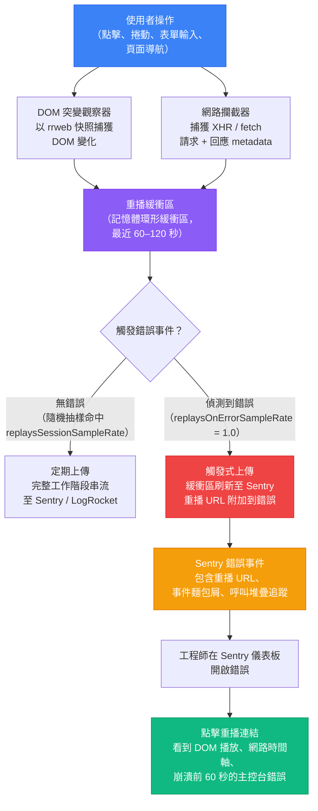

# 工作階段重播與正式環境除錯

## 背景脈絡

「我無法重現這個問題」是軟體工程中代價最高的一句話。只在特定裝置、特定網路條件、特定 UI 互動序列後才會出現的 bug，可能需要數小時或數天才能重現——如果可以重現的話。傳統除錯工具組（日誌、截圖、使用者回報的步驟）對這類情況力有未逮，因為它依賴使用者準確回憶並描述一連串他們根本不知道自己應該觀察的事件。

工作階段重播（Session Replay）改變了這一切：它記錄使用者互動發生時的一切——DOM 突變、捲動位置、點擊座標、網路請求與回應、主控台錯誤，以及 JavaScript 例外——全部捕獲在一個工程師可以在瀏覽器介面中重播的時間軸上。重播將「無法重現」的問題，化為「看看發生了什麼」。工程師看到的正是使用者所看到的，依照事件發生的順序，附帶完整脈絡。

各工具的定位與深度各有不同。**LogRocket** 是專屬的工作階段重播產品，具備高保真 DOM 錄製和深度網路請求審查能力，包括請求與回應內容本體。**Sentry Session Replay**（`@sentry/replay`）直接與錯誤追蹤整合：當錯誤事件被捕獲時，Sentry 可以將錯誤發生前後 60 秒的工作階段重播連結附加到錯誤事件上。對於已使用 Sentry 的團隊而言，這是最關鍵的功能——錯誤與其脈絡被整合在同一個地方。**Microsoft Clarity** 是 Microsoft 提供的免費工具，提供工作階段重播與熱圖，沒有每次工作階段的費用，對高流量應用程式相當實用。**FullStory** 是企業級產品，除重播功能外，還強調 DX 資料捕獲和產品分析。

隱私是不可妥協的約束。工作階段重播記錄使用者輸入的內容、點擊的位置，以及他們看到的內容——包括潛在的敏感資訊：表單輸入、財務資料、健康資訊、DOM 內容中的個人識別資訊。未遮罩地記錄這些資料會產生 GDPR、CCPA 和 HIPAA 的法律責任。架構原則是**預設選擇錄製（opt-in to recording），而非預設選擇遮罩（opt-in to masking）**：隱私保護應該是預設值，工程師需要明確選擇允許特定內容顯示，而不是事後才發現敏感欄位被錄製了。

**GDPR 與同意** 增加了法律層面的要求。在 GDPR（及類似法律）適用的司法管轄區，工作階段重播構成個人資料處理，通常需要在開始前取得使用者的明確同意。這意味著工作階段重播的初始化必須以同意訊號為條件——不能在應用程式啟動時無條件啟用。若對所有使用者啟用重播，事後才發現歐盟使用者在未同意的情況下被錄製，這將構成資料保護事件。

**關聯 ID（Correlation ID）** 將前端工作階段連接到後端日誌追蹤。在前端產生的工作階段 ID，作為 HTTP 標頭（`X-Correlation-ID`）隨每個 API 請求傳遞，讓後端工程師可以搜尋其日誌，找到觸及特定使用者工作階段的所有請求。結合工作階段重播 URL，這創造了一個完整的圖像：重播顯示使用者的體驗；關聯 ID 呈現那段時間的後端狀態。

## 原則

- 應該（SHOULD）預設遮罩所有敏感輸入欄位——採用選擇錄製（opt-in to recording）而非選擇遮罩（opt-in to masking）的設計。
- 應該（SHOULD）將工作階段重播與錯誤報告相關聯，使錯誤事件直接連結到該時刻周圍的重播。
- 應該（SHOULD）在有法規要求的司法管轄區（GDPR、CCPA）取得使用者的明確同意後，才啟用工作階段重播。
- 應該（SHOULD）在 API 請求標頭（`X-Correlation-ID`）中傳遞關聯 ID（工作階段 ID 或追蹤 ID），使後端日誌追蹤能與前端工作階段相連結。
- 不應該（SHOULD NOT）在測試或開發環境中錄製工作階段重播，除非明確需要除錯——將重播收集限制在正式環境。
- 不應該（SHOULD NOT）將工作階段重播資料保存超過資料保留政策的要求；在重播工具儀表板中配置保留期限。

## 設計思維

### 為何工作階段重播改變了正式環境除錯

在工作階段重播出現之前，重現正式環境 bug 需要以下三者之一：(1) 任何工程師都可以在測試環境中遵循的可靠步驟；(2) 存取使用者的特定裝置與帳號狀態；或 (3) 一次運氣。依賴時序、網路條件、瀏覽器版本、帳號資料結構，或特定 UI 互動序列的 bug，往往因為無法滿足這三個條件中的任何一個而得不到解決。

工作階段重播消除了重現步驟。工程師不需要重現 bug——他們直接觀看它發生的過程。重播顯示失敗時的確切 DOM 狀態、其之前的網路請求、主控台錯誤，以及觸發它們的使用者操作。之前在「無法重現」待辦清單中的 bug，在單次工作階段中就能解決。

第二階效應是組織層面的：客戶支援可以將使用者投訴連結到重播，附上 URL 後升交工程師，工程師無需與使用者交流就能掌握完整脈絡。過去需要支援票單、來回澄清，以及最佳猜測重現嘗試的資訊傳遞，被 90 秒的播放所取代。

### 為何隱私必須從一開始就設計進去

事後補救的隱私保護容易出錯。若在沒有遮罩的情況下部署重播並捕獲了個人識別資訊，資料就已經被錄製了。從重播提供商的儲存中刪除它需要使用他們的刪除 API 或手動請求流程。GDPR 的刪除義務同樣適用於重播資料，而重播提供商的資料保留時程可能與你需要的刪除時程不一致。

事後遮罩敏感欄位需要識別每一個可能包含個人識別資訊的欄位——跨越每一個頁面、每一個元件、每一個第三方小工具。這與安全設計原則相反：你試圖列舉需要保護的內容，這意味著風險在於你遺漏的部分。從另一個方向設計——預設遮罩所有內容，工程師明確取消遮罩他們需要用於除錯的內容——意味著風險在於你不必要地暴露的部分，這是一個更小且更容易審計的集合。

對於 Sentry 的實際含義：`maskAllInputs: true` 是預設值，應保持開啟。`maskAllText: false` 是預設值；如果你的應用程式在 DOM 文字節點中渲染個人識別資訊（帳號號碼、電子郵件地址、健康資料），請設定 `maskAllText: true`，並對你希望在重播中可見的內容套用 `.sentry-unmask` 樣式類別。

### 資料駐留

**資料駐留**（Data residency）是與同意機制不同的獨立考量：它決定了重播資料儲存在哪個地理區域。根據 GDPR，將個人資料傳輸至歐盟以外地區需要適當決定或安全保障措施。大多數重播提供商提供歐盟區域部署選項——Sentry 在 `sentry.io/eu/` 提供歐盟主機版本，LogRocket 提供歐盟資料儲存。企業合約可能需要資料主權保證。請確認你的提供商的資料駐留設定——預設值通常是美國區域儲存，即使是歐盟團隊也不例外。

### 為何將重播與錯誤相關聯是最關鍵的功能

Sentry 錯誤事件本身告訴你出了什麼問題：例外類型、呼叫堆疊追蹤、瀏覽器版本、受影響的 URL。它沒有告訴你的是：錯誤觸發前 60 秒使用者在做什麼。透過 `replaysOnErrorSampleRate: 1.0`，Sentry 為每個工作階段捕獲並緩衝重播，在發生錯誤時上傳，並將重播 URL 附加到 Sentry UI 中的錯誤事件。

結果是：在 Sentry 中點擊一個錯誤，就會開啟一個顯示導致崩潰的使用者操作的重播。你不需要閱讀堆疊追蹤並推測是什麼狀態變化序列導致了它。你直接觀看這個序列。使用過這個功能的工程師描述它，就像是閱讀崩潰報告與觀看崩潰螢幕錄影之間的差異。

對於尚未使用 Sentry 的團隊，LogRocket 從另一個方向提供了相同的關聯模式：`LogRocket.getSessionURL(sessionURL => ...)` 返回一個 URL，可以附加到任何錯誤報告呼叫中，在錯誤事件與重播之間建立相同的雙向連結。

### LogRocket 與 Sentry Session Replay 如何選擇

LogRocket 和 Sentry Session Replay 有顯著的重疊，但深度不同。LogRocket 是專屬的重播產品，網路審查更豐富：它捕獲請求和回應內容本體，而不僅僅是標頭和狀態碼。它還提供 Sentry 沒有的產品分析層（使用者旅程漏斗、點擊地圖）。對於主要使用場景是深度除錯正式環境問題和理解使用者行為的團隊，LogRocket 的額外監控能力很有價值。

Sentry Session Replay 對於已使用 Sentry、想要單一工具而非兩份合約的團隊是更好的選擇。錯誤-重播關聯是原生的——不需要額外的整合程式碼。錯誤預算的角度也有利於 Sentry：在 Sentry 中管理錯誤率、SLO 和告警的同一個團隊，無需切換工具或維護第二個資料管道就能獲得重播脈絡。

決策點通常是組織層面的：如果你的團隊已經支付 Sentry 費用，且重播保真度滿足你的除錯需求（對絕大多數 bug 而言確實如此），那麼新增 LogRocket 是一筆需要自我證明的額外成本。如果你的團隊不使用 Sentry，或者網路級請求內容審查對你的除錯工作流程至關重要，LogRocket 值得額外投資。

## 視覺化

### 工作階段重播流程

以下圖表展示使用者操作如何被錄製、緩衝，以及在發生錯誤時上傳，以及工程師如何從 Sentry 錯誤事件導航回工作階段重播。



## 範例

### 1. Sentry Session Replay 設定

安裝並配置 Sentry Session Replay。從 7.27 版本起，該整合已包含在 `@sentry/browser` 中。重播整合從 `@sentry/replay` 匯入。

```typescript
// src/instrument.ts（在應用程式初始化前載入）
import * as Sentry from '@sentry/browser';

Sentry.init({
  dsn: 'https://YOUR_DSN@sentry.io/YOUR_PROJECT',
  integrations: [
    Sentry.replayIntegration({
      // 預設：遮罩所有輸入欄位（不要將此改為 false）
      maskAllInputs: true,
      // 遮罩所有文字節點——若你的應用程式在 DOM 文字中渲染個人識別資訊請啟用
      // maskAllText: true,
      // 阻止所有媒體（圖片、影片）出現在重播中
      // blockAllMedia: false,
    }),
  ],
  // 對所有工作階段的 10% 進行重播抽樣，不論是否有錯誤
  replaysSessionSampleRate: 0.1,
  // 對產生錯誤的工作階段 100% 捕獲重播
  replaysOnErrorSampleRate: 1.0,
});
```

若要允許特定元素在重播中以未遮罩形式出現（針對被 `maskAllText: true` 遮罩的非敏感 UI 內容），新增 `.sentry-unmask` CSS 類別：

```html
<!-- 啟用 maskAllText: true 時預設遮罩 -->
<p>使用者帳號：****</p>

<!-- 明確取消遮罩——僅對非個人識別資訊內容執行此操作 -->
<p class="sentry-unmask">頁面標題：儀表板</p>
```

若要明確阻止某個元素出現在重播中（即使是遮罩後的佔位符也不顯示），新增 `.sentry-block` 類別：

```html
<!-- 此元素即使作為遮罩佔位符也不會出現在重播中 -->
<div class="sentry-block">
  <canvas id="signature-pad" />
</div>
```

### 2. GDPR 同意閘道的重播初始化

對於服務歐盟使用者的應用程式，重播必須以同意為前提。先初始化 Sentry 但不啟用重播，然後在取得同意後新增重播整合。

```typescript
// src/instrument.ts
import * as Sentry from '@sentry/browser';

// 初始化 Sentry，但不含重播——追蹤錯誤通常可依據合法利益；
// 重播需要明確同意
Sentry.init({
  dsn: 'https://YOUR_DSN@sentry.io/YOUR_PROJECT',
  integrations: [], // 尚無重播
  tracesSampleRate: 0.2,
});

// 在使用者於 Cookie 橫幅授予同意後呼叫此函式
export function enableSessionReplayAfterConsent(): void {
  const client = Sentry.getClient();
  if (!client) return;

  client.addIntegration(
    Sentry.replayIntegration({
      maskAllInputs: true,
    })
  );

  Sentry.getCurrentScope().setExtra('replayConsent', true);
}
```

在你的同意管理平台處理器中：

```typescript
// src/consent.ts
import { enableSessionReplayAfterConsent } from './instrument';

cookieConsentPlatform.on('consent:granted', (categories) => {
  if (categories.includes('analytics')) {
    enableSessionReplayAfterConsent();
  }
});
```

### 3. LogRocket 設定與錯誤關聯

```typescript
// src/instrument.ts
import LogRocket from 'logrocket';

LogRocket.init('your-app/your-project', {
  dom: {
    // 清除所有輸入欄位的值——它們在重播中將顯示為星號
    inputSanitizer: true,
  },
  network: {
    // 從網路請求/回應捕獲中移除敏感標頭
    requestSanitizer: (request) => {
      if (request.headers['Authorization']) {
        request.headers['Authorization'] = '[REDACTED]';
      }
      return request;
    },
    responseSanitizer: (response) => {
      // 對敏感端點的回應內容進行編輯
      if (response.url.includes('/api/payments')) {
        response.body = '[REDACTED]';
      }
      return response;
    },
  },
});

// 識別使用者（在正式環境中使用 ID，不使用姓名或電子郵件）
LogRocket.identify('user-internal-id-123', {
  // 僅包含非敏感識別符
  plan: 'enterprise',
  role: 'admin',
});
```

將 LogRocket 工作階段 URL 附加到 Sentry 錯誤，使兩個系統相互連結：

```typescript
// src/instrument.ts（續）
import * as Sentry from '@sentry/browser';

LogRocket.getSessionURL((sessionURL) => {
  Sentry.getCurrentScope().setExtra('logRocketSessionURL', sessionURL);
});
```

當 Sentry 錯誤被捕獲時，它將包含 `logRocketSessionURL` 額外欄位，這是該工作階段 LogRocket 重播的直接連結。

### 4. Microsoft Clarity（免費方案）

Microsoft Clarity 只需一個 script 標籤或一行初始化程式碼。對於想要工作階段重播但不想付費的團隊，這是最簡單的選項。

```html
<!-- 新增至 <head>——將 PROJECT_ID 替換為你的 Clarity 專案 ID -->
<script type="text/javascript">
  (function(c,l,a,r,i,t,y){
    c[a]=c[a]||function(){(c[a].q=c[a].q||[]).push(arguments)};
    t=l.createElement(r);t.async=1;t.src="https://www.clarity.ms/tag/"+i;
    y=l.getElementsByTagName(r)[0];y.parentNode.insertBefore(t,y);
  })(window, document, "clarity", "script", "PROJECT_ID");
</script>
```

或透過 npm：

```typescript
import { clarity } from 'clarity-js';

clarity('init', 'PROJECT_ID');

// 以自訂識別符標記工作階段以供關聯
clarity('set', 'userId', 'internal-user-id-123');
```

Clarity 的個人識別資訊遮罩在 Clarity 儀表板的遮罩設定中配置。你可以透過 CSS 選擇器或元素屬性設定遮罩規則，無需更改應用程式程式碼。對於需要程式碼層級遮罩的元素：

```html
<!-- 新增 data-clarity-mask 屬性以遮罩元素 -->
<input type="text" name="ssn" data-clarity-mask="True" />
```

### 5. FullStory 設定

```typescript
import * as FullStory from '@fullstory/browser';

FullStory.init({
  orgId: 'YOUR_ORG_ID',
  // 在非正式環境中停用捕獲
  devMode: process.env.NODE_ENV !== 'production',
});

// 識別使用者（使用內部 ID，不使用個人識別資訊）
FullStory.identify('user-internal-id-123', {
  displayName: 'Masked User',
  // 不要在此處包含電子郵件或真實姓名
});
```

若要讓 FullStory 捕獲時遮罩 DOM 元素，新增 `data-recording-ignore="mask"` 屬性：

```html
<!-- FullStory 不會記錄此元素的內容 -->
<div data-recording-ignore="mask">
  <span>信用卡號：4111 1111 1111 1111</span>
</div>
```

### 6. 後端追蹤的關聯 ID

在應用程式啟動時產生工作階段範圍的關聯 ID，並將其附加到每個 API 請求。這讓後端工程師可以搜尋其日誌，找到來自特定前端工作階段的所有請求。

```typescript
// src/correlation.ts
import { v4 as uuidv4 } from 'uuid';

// 每次頁面載入產生一次（若持久化到 sessionStorage 則每個使用者工作階段一次）
export const correlationId = sessionStorage.getItem('correlationId')
  ?? (() => {
    const id = uuidv4();
    sessionStorage.setItem('correlationId', id);
    return id;
  })();

// 附加到 Sentry 範圍，使其出現在每個錯誤事件中
import * as Sentry from '@sentry/browser';
Sentry.getCurrentScope().setTag('correlationId', correlationId);
```

透過 fetch 包裝器或 Axios 攔截器，將關聯 ID 新增到每個傳出的 API 請求：

```typescript
// src/api/client.ts
import { correlationId } from '../correlation';

// Fetch 包裝器
export async function apiFetch(url: string, options: RequestInit = {}): Promise<Response> {
  const headers = new Headers(options.headers);
  headers.set('X-Correlation-ID', correlationId);

  return fetch(url, { ...options, headers });
}

// Axios 攔截器替代方案
import axios from 'axios';

axios.interceptors.request.use((config) => {
  config.headers['X-Correlation-ID'] = correlationId;
  return config;
});
```

在後端，將 `X-Correlation-ID` 標頭記錄到每個請求日誌條目中。後端工程師隨後可以執行：

```bash
# 尋找特定前端工作階段的所有後端日誌條目
grep "X-Correlation-ID: abc-123-def" /var/log/app/access.log
```

結合工作階段重播 URL（其 metadata 中包含相同的工作階段識別符），這建立了從前端使用者操作，通過 API 請求，到後端日誌條目的完整稽核軌跡。

### 7. 網路除錯的 HAR 匯出

當工作階段重播不可用，或特定網路層級問題需要深度審查時，Chrome DevTools HAR 匯出提供了完整的網路請求和回應存檔。

匯出 HAR 檔案的步驟：
1. 開啟 Chrome DevTools（F12 或 Cmd+Opt+I）
2. 切換到 Network 標籤
3. 重現問題（或載入問題發生的頁面）
4. 在網路請求列表中右鍵點擊任意位置
5. 選擇「Save all as HAR with content」

匯出的 `.har` 檔案（JSON 格式）包含每個請求的 URL、方法、標頭（請求和回應）、狀態碼、時序分解，以及回應內容本體。與正在調查問題的工程師分享 HAR 檔案。

分享前為保護隱私，從 HAR 中清除敏感標頭：

```bash
# 在分享前從 HAR 檔案中移除 Authorization 標頭
# （需要 jq）
jq 'del(.log.entries[].request.headers[] | select(.name == "Authorization"))' \
  network-capture.har > network-capture-sanitized.har
```

### 8. 透過功能旗標的遠端除錯日誌

對於工作階段重播無法捕獲的問題（時序敏感的競態條件、低層級渲染 bug），透過功能旗標為特定使用者啟用詳細日誌記錄。

```typescript
// src/debug-logger.ts
import { featureFlags } from './feature-flags'; // FEE-1405 模式

const isVerboseLogging = featureFlags.isEnabled('verbose-logging');

export function debugLog(message: string, context?: Record<string, unknown>): void {
  if (!isVerboseLogging) return;

  // 在每個除錯日誌中包含關聯 ID，使後端可以連接日誌
  const entry = {
    timestamp: new Date().toISOString(),
    correlationId: sessionStorage.getItem('correlationId'),
    message,
    ...context,
  };

  // 傳送到你的結構化日誌端點（FEE-1403 模式）
  fetch('/api/debug-logs', {
    method: 'POST',
    headers: { 'Content-Type': 'application/json' },
    body: JSON.stringify(entry),
  }).catch(() => {
    // 日誌記錄絕不能拋出例外——靜默吞噬錯誤
  });

  // 同時記錄到主控台以供本地除錯
  console.debug('[debug]', message, context);
}
```

透過在你的旗標管理系統（LaunchDarkly、Unleash 等）中將功能旗標定向到特定使用者 ID，僅對遭遇問題的特定使用者啟用詳細日誌記錄。

## 常見錯誤

### 將遮罩作為事後補救

```typescript
// 錯誤：在沒有遮罩的情況下部署重播，事後才新增遮罩
Sentry.init({
  integrations: [
    Sentry.replayIntegration({
      maskAllInputs: false, // 「我們稍後會新增遮罩」
      maskAllText: false,
    }),
  ],
  replaysSessionSampleRate: 1.0, // 錄製所有工作階段
});
```

如果在新增遮罩之前就捕獲了個人識別資訊，資料就已經存在於重播提供商的儲存中。GDPR 刪除義務立即生效。補救成本——識別受影響的使用者、提交刪除請求、確認刪除——遠超過在上線前配置遮罩的成本。

```typescript
// 正確：預設遮罩，明確取消遮罩工程師需要的內容
Sentry.init({
  integrations: [
    Sentry.replayIntegration({
      maskAllInputs: true,  // 預設——保持開啟
      maskAllText: false,   // 若你的應用程式在文字節點中渲染個人識別資訊則設為 true
    }),
  ],
  replaysSessionSampleRate: 0.1, // 10% 的工作階段，而非全部
  replaysOnErrorSampleRate: 1.0, // 100% 的錯誤工作階段
});
```

### 對歐盟使用者無條件啟用重播

```typescript
// 錯誤：在檢查同意之前就啟動重播
import * as Sentry from '@sentry/browser';

Sentry.init({
  dsn: '...',
  integrations: [Sentry.replayIntegration()], // 無同意閘道
  replaysSessionSampleRate: 0.1,
});
```

GDPR 將工作階段重播定性為個人資料處理。在未獲同意的情況下錄製歐盟使用者會產生法規風險。正確的模式是在同意訊號之後才初始化重播。

```typescript
// 正確：僅在取得同意後才啟動重播
Sentry.init({
  dsn: '...',
  integrations: [], // 初始化時不含重播
});

// 使用者授予同意後：
consentManager.on('analytics:accepted', () => {
  Sentry.getClient()?.addIntegration(Sentry.replayIntegration());
});
```

### 未將重播與錯誤報告相關聯

```typescript
// 錯誤：LogRocket 和 Sentry 並行運行，兩者之間沒有連結
LogRocket.init('app/id');
Sentry.init({ dsn: '...' });
// 沒有連接——工程師必須在兩個工具中分別搜尋
```

沒有關聯，查看 Sentry 錯誤的工程師必須在 LogRocket 中分別搜尋相同的使用者和時間窗口。這種兩步驟查找方式大幅削弱了同時擁有兩個工具的效率優勢。

```typescript
// 正確：將 LogRocket 工作階段 URL 附加到每個 Sentry 錯誤範圍
LogRocket.getSessionURL((sessionURL) => {
  Sentry.getCurrentScope().setExtra('logRocketSession', sessionURL);
});
```

### 在 API 請求中省略關聯 ID

```typescript
// 錯誤：API 請求沒有工作階段識別符
const response = await fetch('/api/orders');

// 後端日誌顯示：GET /api/orders 500——無法找到是哪個使用者
```

沒有關聯 ID，在伺服器日誌中看到錯誤的後端工程師無法找到與之相關聯的前端工作階段重播。關聯 ID 是連接前端體驗與後端追蹤的橋樑。

```typescript
// 正確：每個 API 請求都攜帶關聯 ID
import { correlationId } from './correlation';

const response = await fetch('/api/orders', {
  headers: { 'X-Correlation-ID': correlationId },
});

// 後端日誌：GET /api/orders 500 X-Correlation-ID=abc-123-def
// 工程師可以找到標記有 correlationId=abc-123-def 的 Sentry 工作階段重播
```

### 在非正式環境中錄製重播

```typescript
// 錯誤：在所有環境中啟用重播
Sentry.init({
  integrations: [Sentry.replayIntegration()],
  replaysSessionSampleRate: 0.1,
});
```

測試和開發環境可能包含看起來像真實資料的測試帳號、模擬敏感操作的開發工作流程，或不應儲存在第三方重播提供商的除錯狀態。將重播限制在正式環境。

```typescript
// 正確：僅在正式環境中啟用重播
Sentry.init({
  integrations: process.env.NODE_ENV === 'production'
    ? [Sentry.replayIntegration({ maskAllInputs: true })]
    : [],
  replaysSessionSampleRate: process.env.NODE_ENV === 'production' ? 0.1 : 0,
  replaysOnErrorSampleRate: process.env.NODE_ENV === 'production' ? 1.0 : 0,
});
```

## 相關 FEE

- [FEE-1400：可觀測性與錯誤追蹤總覽](./1400.md) — 分類脈絡；工作階段重播是三個可觀測性支柱的使用者面向層
- [FEE-1401：使用 Sentry 進行錯誤追蹤](./1401.md) — Sentry 錯誤事件連結到工作階段重播；`replaysOnErrorSampleRate` 是連接它們的配置
- [FEE-1403：日誌記錄與結構化日誌](./1403.md) — 結構化日誌中的關聯 ID 讓後端日誌追蹤能與重播中捕獲的前端工作階段相連結
- [FEE-1405：功能旗標可觀測性與 A/B 測試](./1405.md) — 功能旗標狀態在重播脈絡中可見；遠端除錯日誌（特定使用者的詳細模式）由功能旗標控制

## 參考資料

- [Sentry — Session Replay 文件](https://docs.sentry.io/platforms/javascript/session-replay/)
- [Sentry — Session Replay 隱私與遮罩](https://docs.sentry.io/platforms/javascript/session-replay/privacy/)
- [Sentry — replayIntegration() API 參考](https://docs.sentry.io/platforms/javascript/session-replay/configuration/)
- [LogRocket — 入門指南](https://docs.logrocket.com/docs/getting-started)
- [LogRocket — 個人識別資訊與資料隱私](https://docs.logrocket.com/docs/privacy)
- [LogRocket — getSessionURL API](https://docs.logrocket.com/reference/getsessionurl)
- [Microsoft Clarity — 文件](https://learn.microsoft.com/en-us/clarity/)
- [Microsoft Clarity — 遮罩設定](https://learn.microsoft.com/en-us/clarity/setup-and-installation/clarity-masking)
- [FullStory — 入門指南](https://developer.fullstory.com/browser/getting-started/)
- [FullStory — 預設隱私保護](https://developer.fullstory.com/browser/capture-and-privacy/)
- [rrweb — 開源 DOM 錄製函式庫（底層技術）](https://github.com/rrweb-io/rrweb)
- [W3C HAR 規範](https://w3c.github.io/web-performance/specs/HAR/Overview.html)
- [GDPR — 第 6 條：處理的合法性](https://gdpr-info.eu/art-6-gdpr/)
- [OWASP — 工作階段管理備忘單](https://cheatsheetseries.owasp.org/cheatsheets/Session_Management_Cheat_Sheet.html)
