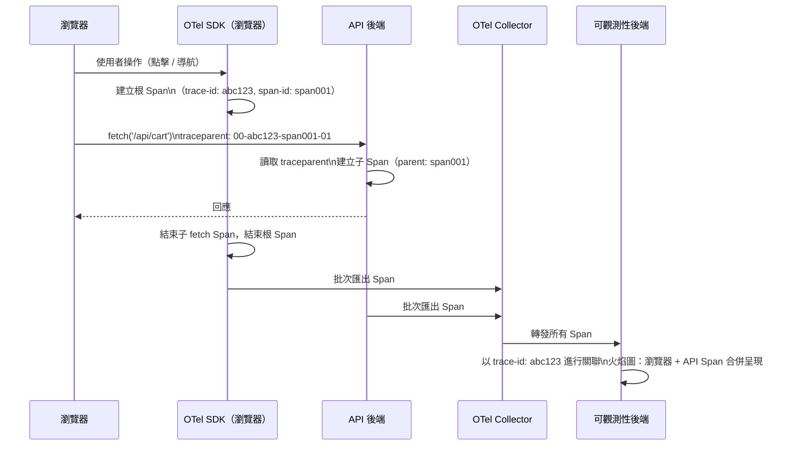

# 瀏覽器中的 OpenTelemetry Trace 關聯

分散式追蹤（Distributed Tracing）沿著請求的路徑跨越多個服務記錄時序與
上下文。對於 Web 應用程式，這條鏈結始於瀏覽器：使用者的點擊、表單提交
或背景資料抓取所發起的請求，會依序通過 API 閘道、後端服務與資料庫。若沒
有從瀏覽器開始的追蹤，後端的 Trace 便是從鏈結中段才開始的——延遲高峰的根
因可能是在第一次網路呼叫之前發生的緩慢 JavaScript 互動，對任何僅限後端
的追蹤系統而言都是不可見的。

OpenTelemetry 的瀏覽器 SDK `@opentelemetry/sdk-trace-web` 將 W3C Trace
Context 標準延伸至前端。瀏覽器建立根 Span（root span），並在送出的 HTTP
請求中注入 `traceparent` 標頭。已完成儀器化（instrumented）的後端服務讀
取此標頭後，會在相同的 Trace ID 下繼續追蹤，形成一條橫跨整個使用者互動
的完整分散式 Trace——從按鈕點擊到資料庫查詢，再回到瀏覽器渲染。

Trace 關聯解決了一個常見的可觀測性缺口：後端在 P95 延遲超過閾值時觸發
告警，但後端的 Trace 顯示各服務的處理時間均正常。實際延遲是來自行動裝置
在壅塞網路上的來回傳輸時間（RTT）——只有在 Trace 從瀏覽器的 `fetch()`
呼叫開始記錄、並從用戶端角度捕捉完整的首字節時間（TTFB）時，才能看見
這段延遲。

本文涵蓋設置 OpenTelemetry Web SDK、為使用者互動與頁面導航建立 Span、透
過 HTTP 標頭傳遞追蹤上下文，以及在共用可觀測性後端中將瀏覽器 Trace 與
後端服務 Trace 進行關聯的完整流程。

## 設計思維

### W3C Trace Context 標準的運作方式

W3C Trace Context 規範將 `traceparent` 標頭定義為由連字號分隔的四個欄位
組成的固定長度字串：`{version}-{trace-id}-{parent-id}-{flags}`。`trace-id`
是整條分散式 Trace 唯一的 16 位元組十六進位值。`parent-id` 是 8 位元組的
十六進位值，識別發起此請求的特定 Span——從接收端角度來看，即「父 Span」。
`flags` 位元組攜帶取樣狀態：`01` 表示已取樣、應被記錄；`00` 表示未取樣。

當瀏覽器建立根 Span 並將 `traceparent` 標頭附加到 fetch 請求時，後端服務
讀取此標頭，提取 Trace ID 與父 Span ID，並以瀏覽器的 Span 為父節點建立
新的子 Span。子 Span 使用相同的 Trace ID，因此鏈結中的所有 Span——瀏覽器、
閘道、服務、資料庫——在可觀測性後端中都以同一個 Trace ID 下的連結樹形式
呈現。

`tracestate` 標頭是 `traceparent` 的伴侶，是一個不透明的鍵值儲存區，用於
廠商特定的取樣或路由決策。使用廠商特定匯出器時，OpenTelemetry 會自動填充
`tracestate`。大多數應用程式不需要直接讀寫 `tracestate`——SDK 會自動管理。

### 設置瀏覽器 SDK

OpenTelemetry 的瀏覽器 JavaScript SDK 分為多個職責明確的套件。
`@opentelemetry/sdk-trace-web` 提供 `WebTracerProvider`，即核心追蹤引擎。
`@opentelemetry/context-zone` 提供基於 Zone.js 的上下文傳遞，確保非同步
操作之間保留活躍的 Span 上下文。`@opentelemetry/instrumentation-fetch` 自
動儀器化 `window.fetch()` 呼叫，注入 `traceparent` 標頭並為每個請求建立子
Span。`@opentelemetry/instrumentation-document-load` 儀器化頁面載入生命週
期，為 DNS 解析、TCP 連線、TLS 握手、伺服器回應與 DOM 解析各建立 Span。

Provider 需要一個 Exporter 將 Span 資料傳送到後端。在生產環境中，OTel
Collector 透過 `@opentelemetry/exporter-trace-otlp-http` 以 OTLP/HTTP 接
收 Span，並轉發給可觀測性後端（Jaeger、Grafana Tempo、Datadog 等）。從瀏
覽器直接向 SaaS 後端傳送 Span 雖然可行，但會將 API 金鑰暴露在用戶端程式
碼中——透過 Collector 中轉可避免此問題，並集中管理匯出配置。

`BatchSpanProcessor` 是生產環境的正確選擇。它在記憶體中緩衝 Span，並按
可配置的間隔批次匯出，減少瀏覽器發出的網路請求次數。`SimpleSpanProcessor`
即時匯出每個 Span，僅適用於開發階段除錯。

取樣器在 `WebTracerProvider` 初始化時配置。生產環境的標準組合是
`ParentBasedSampler` 搭配 `TraceIdRatioBased` 根取樣器。`ParentBasedSampler`
會遵從傳入 `traceparent` 標頭中的取樣決策——若後端標記某請求為已取樣，瀏覽
器便繼續該已取樣的 Trace。`TraceIdRatioBased` 依據可配置的機率對新的根
Span 做取樣決策。

### 透過 fetch 請求傳遞追蹤上下文

`FetchInstrumentation` 外掛程式在每個請求發送前修補 `window.fetch()`，注
入 `traceparent` 與 `tracestate` 標頭，並將 fetch 包裝在子 Span 中，記錄
請求 URL、HTTP 方法與回應狀態碼。一旦外掛程式完成註冊，標準 fetch 呼叫便
無需手動儀器化。

傳遞依賴請求 URL 符合 `propagateTraceHeaderCorsUrls` 配置選項——這是一個
指定哪些來源應注入標頭的 URL 模式清單（字串或 RegExp）。若不配置此選項，
儀器化僅對同源請求傳遞標頭。對 API 後端的跨源請求，需要後端在 CORS 預飛
行回應中的 `Access-Control-Allow-Headers` 加入 `traceparent` 與 `tracestate`。
若這些標頭不在 CORS 配置中，瀏覽器會將其刪除，追蹤的連續性便無聲中斷——
後端 Trace 將顯示為一個不相連的獨立根 Span。

使用 `XMLHttpRequest` 發出的請求需要獨立的
`@opentelemetry/instrumentation-xml-http-request` 外掛程式。若應用程式使
用了封裝 XHR 的函式庫，且該封裝對 fetch 儀器化不透明，則可能需要同時安
裝兩個外掛程式。

### 為使用者互動建立 Span

`FetchInstrumentation` 與 `DocumentLoadInstrumentation` 涵蓋了網路活動與
頁面載入，但無法涵蓋發起這些活動的使用者可見操作。使用者點擊「加入購物
車」會觸發一連串動作：點擊處理器驗證輸入、呼叫庫存 API、更新本地狀態，
再重新渲染購物車。僅儀器化 fetch 呼叫只能捕捉 API 延遲，卻無法記錄請求
前後的 JavaScript 執行時間。

手動建立 Span 可以包裝整個操作。`tracer.startSpan()` API 建立具名 Span。
`context.with(trace.setSpan(context.active(), span), fn)` 以新 Span 為活躍
上下文執行函式，確保在 `fn` 內建立的所有子 Span 或儀器化 fetch 呼叫，都
自動連結為操作 Span 的子節點。Span 在 `finally` 區塊中結束，確保即使操作
拋出例外也能完成記錄。

Span 屬性（Attributes）提供可查詢的標籤。設置 `user.id`、`cart.item_count`
或 `route.name` 等屬性可在可觀測性後端進行篩選——例如，找出特定使用者遭遇
高 API 延遲的所有 Trace。屬性在 Span 結束前設置。敏感使用者資料——電子郵
件地址、付款資訊或任何個人識別資訊——不得（MUST NOT）設為 Span 屬性，因
為 Trace 資料儲存在可觀測性後端，其保留期限與存取控制可能與應用程式日誌
有所不同，不得將其視為與日誌享有相同保護級別的儲存位置。

### 關聯瀏覽器與後端 Span

關聯取決於後端是否讀取 `traceparent` 標頭並在自身的 Span 建立中傳遞它。
使用 OpenTelemetry Node.js SDK 的後端，在 HTTP 儀器化外掛程式完成註冊後
會自動執行此操作。使用 OpenTelemetry Java Agent 的 Java 後端亦同。若後端
未完成儀器化，瀏覽器的 Trace 將是一個孤立的根 Trace——它獨立存在，無法
與後端服務資料進行關聯。

驗證關聯需要在可觀測性後端中查看 Trace，確認瀏覽器 Span 與後端 Span 共
享相同的 Trace ID。在 Jaeger 中，Trace 詳細檢視以火焰圖形式呈現同一 Trace
ID 下的所有 Span，並以服務名稱作為標籤。若瀏覽器 Span 顯示為獨立 Trace，
表示後端未讀取 `traceparent`——最常見的原因是 `Access-Control-Allow-Headers`
缺少相關欄位，或後端儀器化存在缺口。

Session 關聯將 Trace 資料連結至 Session 回放工具。若應用程式使用
Session 回放工具（Datadog RUM、Sentry、FullStory），可將活躍的 Trace ID
作為自訂屬性注入 Session 回放事件流。當使用者回報問題時，Session 回放呈
現使用者的操作過程，而連結的 Trace ID 則直接指向可觀測性後端中對應的分
散式 Trace。

## 最佳實踐

**必須（MUST）**將 `propagateTraceHeaderCorsUrls` 配置為包含應用程式所
有 API 來源的模式。若不配置，跨源 fetch 儀器化不會注入 `traceparent`
標頭，分散式 Trace 的連續性將無聲中斷。

**必須（MUST）**確保所有 API 後端在 CORS 預飛行回應的
`Access-Control-Allow-Headers` 中包含 `traceparent` 與 `tracestate`。遺漏
這些標頭是跨源架構中最常見的無聲 Trace 關聯失敗原因。

**禁止（MUST NOT）**將敏感使用者資料——電子郵件、付款資訊、Session Token
或任何個人識別資訊——設為 Span 屬性。不得假設 Span 資料享有與應用程式
日誌相同的存取控制或保留政策，也不得在 Span 中儲存任何需要受控存取的
個人資料。

**應該（SHOULD）**在生產環境中使用 `BatchSpanProcessor`。`SimpleSpanProcessor`
每個 Span 觸發一次獨立網路請求，隨著互動量增加而線性提高延遲與成本。

**應該（SHOULD）**對高流量生產應用程式配置 10% 或以下的 `TraceIdRatioBased`
取樣率。100% 取樣僅適用於低流量的內部工具或開發環境。

**應該（SHOULD）**將手動 Span 建立限制在具有語意意義的操作：頁面導航、
使用者觸發的資料載入動作以及多步驟表單流程。將每個 DOM 事件或狀態更新都
包裝在 Span 中，只會產生追蹤雜訊並增加攝取成本。

**應該（SHOULD）**透過 OTel Collector 路由 Span 匯出，而非從瀏覽器直接
向 SaaS 後端匯出。直接匯出需要將 API 金鑰嵌入用戶端套件中。

## 視覺呈現



## 範例

```typescript
// src/telemetry/setup.ts
// 初始化 OpenTelemetry 瀏覽器追蹤，啟用自動 fetch 儀器化，
// 並透過本地 Collector 以 OTLP 匯出 Span。

import { WebTracerProvider } from '@opentelemetry/sdk-trace-web';
import { BatchSpanProcessor } from '@opentelemetry/sdk-trace-base';
import { OTLPTraceExporter } from '@opentelemetry/exporter-trace-otlp-http';
import {
  CompositePropagator,
  W3CTraceContextPropagator,
  W3CBaggagePropagator,
  ParentBasedSampler,
  TraceIdRatioBasedSampler,
} from '@opentelemetry/core';
import { FetchInstrumentation } from '@opentelemetry/instrumentation-fetch';
import { DocumentLoadInstrumentation } from '@opentelemetry/instrumentation-document-load';
import { registerInstrumentations } from '@opentelemetry/instrumentation';
import { Resource } from '@opentelemetry/resources';
import { SEMRESATTRS_SERVICE_NAME } from '@opentelemetry/semantic-conventions';

export function initTelemetry(): void {
  const exporter = new OTLPTraceExporter({
    // 代理至本地 Collector——避免在套件中嵌入 SaaS API 金鑰
    url: '/otel/v1/traces',
  });

  const provider = new WebTracerProvider({
    resource: new Resource({
      [SEMRESATTRS_SERVICE_NAME]: 'frontend',
    }),
    sampler: new ParentBasedSampler({
      // 10% 的新根 Span 被取樣；子 Span 繼承後端的取樣決策
      root: new TraceIdRatioBasedSampler(0.1),
    }),
  });

  provider.addSpanProcessor(new BatchSpanProcessor(exporter));

  provider.register({
    propagator: new CompositePropagator({
      propagators: [
        new W3CTraceContextPropagator(),
        new W3CBaggagePropagator(),
      ],
    }),
  });

  registerInstrumentations({
    instrumentations: [
      new FetchInstrumentation({
        // 必填：向跨源 API 請求注入 traceparent
        propagateTraceHeaderCorsUrls: [/https:\/\/api\.example\.com\/.*/],
        applyCustomAttributesOnSpan: (span) => {
          span.setAttribute('browser.user_agent', navigator.userAgent);
        },
      }),
      new DocumentLoadInstrumentation(),
    ],
  });
}

// 使用者互動的手動 Span——確保整個操作（包含 fetch 前的 JS 時間）
// 都被追蹤記錄：
//
// import { trace, context } from '@opentelemetry/api';
// const tracer = trace.getTracer('frontend');
//
// async function handleAddToCart(productId: string): Promise<void> {
//   const span = tracer.startSpan('cart.add_item');
//   await context.with(trace.setSpan(context.active(), span), async () => {
//     try {
//       span.setAttribute('product.id', productId);
//       await addItemToCart(productId); // fetch 已自動儀器化
//     } catch (err) {
//       span.recordException(err as Error);
//       throw err;
//     } finally {
//       span.end();
//     }
//   });
// }
```

## 常見錯誤

- 遺漏 `propagateTraceHeaderCorsUrls` 配置——跨源 fetch 呼叫不傳送
  `traceparent`，後端 Trace 顯示為不相連的獨立根 Span，分散式 Trace
  無聲中斷
- 後端 CORS `Access-Control-Allow-Headers` 未包含 `traceparent` 與
  `tracestate`——即使 SDK 配置正確，瀏覽器也會阻止標頭注入
- 在生產環境使用 `SimpleSpanProcessor`——每個 Span 觸發一次獨立網路
  請求，隨互動量線性增加延遲與成本
- 將個人識別資訊設為 Span 屬性——Trace 資料的存取控制與保留政策與
  日誌不同，在 Span 中儲存個人資料會帶來合規與隱私風險
- 為每個 DOM 事件或狀態更新建立 Span——追蹤雜訊使火焰圖難以閱讀，
  並在不帶來可觀測性價值的情況下增加攝取成本
- 從瀏覽器直接向 SaaS 後端匯出 Span——將 API 金鑰嵌入用戶端套件，
  任何檢查網路請求的人都能看見

## 相關 FEE

- FEE-1400: Structured Logging Fundamentals
- FEE-1403: Error Tracking & Source Maps
- FEE-1407: Real User Monitoring (RUM) vs. Synthetic Monitoring

## 參考資料

- [OpenTelemetry JavaScript SDK 文件](https://opentelemetry.io/docs/languages/js/)
- [W3C Trace Context 規範](https://www.w3.org/TR/trace-context/)
- [OpenTelemetry Collector 文件](https://opentelemetry.io/docs/collector/)
- [opentelemetry-js-contrib: instrumentation-fetch](https://github.com/open-telemetry/opentelemetry-js-contrib/tree/main/plugins/node/opentelemetry-instrumentation-fetch)
- [Jaeger: 入門指南](https://www.jaegertracing.io/docs/latest/getting-started/)
- [Grafana Tempo 文件](https://grafana.com/docs/tempo/latest/)
