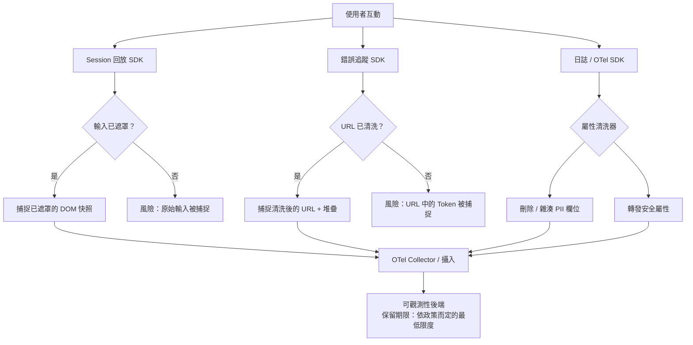

# [FEE-1409] 尊重隱私的可觀測性

:::info
可觀測性工具（錯誤追蹤器、Session 回放工具、日誌管線、真實使用者監控）攝入的 Web 應用程式執行期行為，比幾乎任何其他層級都多，其中相當一部分屬於個人資料。如今主流的 Session 回放與錯誤追蹤 SDK 預設會遮罩輸入與文字，堵住了最明顯的漏洞。但缺口依然存在：網路回應主體、以 Canvas 渲染的付款欄位、非輸入型文字節點，以及設定錯誤的允許模式覆寫，仍可能讓個人資料外洩。GDPR、ePrivacy 指令與 CCPA 各自對這些工具的收集行為課予義務，無論團隊是否有意收集。本文將說明每一類工具攝入哪些資料、如何在收集點進行遮罩與清洗，以及如何依實際診斷需求訂出合理的保留期限。
:::

## 背景

Session 回放工具可能在未遮罩的付款欄位中捕捉每一次按鍵。結構化日誌可能在沒有人特意做出決定的情況下，把使用者的電子郵件當成請求參數一併送出。錯誤報告可能包含完整堆疊追蹤，其中的 URL 片段夾帶了 OAuth token，因為只要 token 出現在 URL 裡，就會出現在報告裡。團隊通常是在資料外洩事後檢討或合規稽核時才發現這類缺口，而非事前。

尊重隱私的可觀測性代表有意識地收集資料：了解每個工具攝入哪些內容，在資料離開瀏覽器之前完成遮罩與清洗，並讓保留期限對應到它實際服務的診斷目的。

主流工具的預設收集行為已轉向遮罩。Datadog Session Replay 的 `defaultPrivacyLevel` 預設為 `mask`，會遮罩所有 HTML 文字、使用者輸入、圖片與連結，並將頁面渲染為線框圖。Sentry 的 Session Replay 預設遮罩所有文字（`maskAllText: true`）並封鎖所有媒體（`blockAllMedia: true`）。Sentry 的錯誤追蹤 SDK 將 `sendDefaultPii` 預設為 `false`，因此除非團隊主動選用，否則會排除 IP 位址等可自動收集的欄位；JavaScript SDK 現在以 `dataCollection` 作為未來的設定入口，`sendDefaultPii` 已被棄用並計畫移除，但目前仍為了向後相容而受到支援，其所控制的預設行為（不收集 PII）並未改變。真正的暴露風險如今落在這些預設值未涵蓋的範圍：一旦啟用回應記錄，網路回應主體便會被捕捉；以 Canvas 渲染的表單欄位（部分支付服務業者刻意以 Canvas 渲染卡片輸入框，藉此避開直接的 DOM 存取）；從預設遮罩切換為允許模式覆寫的工具；以及從未採用遮罩優先預設值的舊版或第三方工具。逐項細節請見下方的[收集面向與因應措施](#收集面向與因應措施)。

法規背景決定了「合規處理」的意涵。GDPR 要求處理個人資料須有合法依據，並賦予資料主體刪除權；其儲存限制原則（第 5(1)(e) 條）將保留期限與特定目的的必要性綁定，並未訂出固定天數。在歐盟，要求在腳本於使用者裝置上儲存或讀取資訊之前先取得同意的規範（啟用 Session 回放或分析 SDK 正屬於此類行為）是 ePrivacy 指令；GDPR 則管轄腳本執行後續的個人資料處理。CCPA 要求揭露出售給第三方的個人資料；若可觀測性供應商受合規的服務提供者合約約束，通常不構成 CCPA 定義下的「出售」，分類與否取決於合約條款，而非供應商是否採 SaaS 交付模式。若應用程式處理受保護的健康資訊，且可觀測性工具攝入了該資訊，則 HIPAA 亦適用。這些法規並不禁止可觀測性。它們要求所收集的資料能夠被合理說明、受到適當保護，且能夠應要求刪除。

## 視覺呈現



## 範例

```typescript
// src/telemetry/privacy-span-processor.ts
// 自訂 OTel SpanProcessor，在匯出前從 Span 屬性中清洗個人識別資訊。
// 在 BatchSpanProcessor 之前註冊此處理器。

import {
  SpanProcessor,
  ReadableSpan,
  Span,
} from '@opentelemetry/sdk-trace-base';
import { Context } from '@opentelemetry/api';

const SENSITIVE_ATTRIBUTE_KEYS = new Set([
  'http.request.header.authorization',
  'http.request.header.cookie',
  'user.email',
  'user.phone',
  'enduser.email',
]);

// 無論鍵名為何，值符合此模式的屬性均需被編輯
const SENSITIVE_VALUE_PATTERNS: RegExp[] = [
  /\b[A-Z0-9._%+-]+@[A-Z0-9.-]+\.[A-Z]{2,}\b/i, // 電子郵件
  /access_token=[^&]+/i,
  /code=[a-z0-9_-]{20,}/i,
];

function scrubAttributes(
  attributes: Record<string, unknown>,
): Record<string, unknown> {
  const result: Record<string, unknown> = {};
  for (const [key, value] of Object.entries(attributes)) {
    if (SENSITIVE_ATTRIBUTE_KEYS.has(key)) {
      result[key] = '[REDACTED]';
      continue;
    }
    if (typeof value === 'string') {
      const isSensitive = SENSITIVE_VALUE_PATTERNS.some((p) => p.test(value));
      result[key] = isSensitive ? '[REDACTED]' : value;
    } else {
      result[key] = value;
    }
  }
  return result;
}

export class PrivacySpanProcessor implements SpanProcessor {
  onStart(_span: Span, _parentContext: Context): void {}

  onEnd(span: ReadableSpan): void {
    // 在 Span 到達匯出器之前就地修改屬性
    const attrs = span.attributes as Record<string, unknown>;
    const scrubbed = scrubAttributes(attrs);
    Object.assign(attrs, scrubbed);
  }

  shutdown(): Promise<void> {
    return Promise.resolve();
  }

  forceFlush(): Promise<void> {
    return Promise.resolve();
  }
}

// 在 setup.ts 中的註冊方式：
// provider.addSpanProcessor(new PrivacySpanProcessor());
// provider.addSpanProcessor(new BatchSpanProcessor(exporter));
```

## 最佳實踐

**必須（MUST）** 在假設某可觀測性 SDK 已具備隱私安全性之前，先審查其實際部署的配置。廠商的預設值已轉向遮罩文字與輸入，但沿用舊版 SDK、自架部署，或較小型第三方工具的配置，仍可能運作在全量擷取模式下。在 SDK 上線之前，明確確認輸入遮罩、網路請求過濾與麵包屑清洗均已到位。

**禁止（MUST NOT）** 允許含有 Token、授權碼或使用者識別碼的 URL 片段或查詢參數被傳輸到可觀測性後端。應設定 URL 清洗機制，在 URL 被捕捉為 Span 屬性、日誌欄位或 Session 回放麵包屑之前，先剝除這些片段。

**應該（SHOULD）** 確認 Session 回放的遮罩設定採隱私優先原則：預設遮罩所有輸入與文字，並維護一份明確的安全欄位允許名單。任何處於允許模式的工具或覆寫設定，都應視為需要與手動拒絕名單同等程度的持續維護紀律。

**應該（SHOULD）** 在收集點（瀏覽器 SDK 或伺服器端的日誌呼叫）實施日誌與 Trace 清洗，而非只依賴攝入後的管線處理。資料一旦到達攝入後端，即使只是暫時停留，移除它也需要提出刪除請求，而不像一開始就不傳送那樣簡單。

**必須（MUST）** 將可觀測性資料的保留期限，設定為團隊能對其診斷與法律需求提出正當理由的期間，而非沿用廠商預設的最長期限。保留期限越長，一旦發生資料外洩或收到傳票，暴露範圍就越大，因此超出診斷所需最短期限的保留，都應對應到明確的既定目的，例如詐欺調查或法律保全義務（legal hold）。

**應該（SHOULD）** 在日誌與 Trace 中使用 Session 範圍的關聯 ID，而非持久性使用者識別碼。關聯 ID 提供相同的連結能力，卻具有更短的個人資料生命週期。

## 設計思維

**允許名單與拒絕名單的遮罩取捨。** 預設遮罩的允許名單模式（先遮罩所有內容，再針對確認安全的特定欄位取消遮罩）需要持續維護：每當有新欄位確實需要在回放中可見，就必須明確新增一筆取消遮罩的項目。忘記新增，頂多讓該欄位維持隱藏，付出的是除錯價值上的代價，而非資料外洩。拒絕名單模式（先取消遮罩所有內容，再針對特定欄位遮罩）則是拿這份維護成本，換取另一種安全成本：忘記新增一筆項目，暴露的是個人資料，而不只是讓除錯者原本想看到的欄位被隱藏。對於敏感程度不明確的欄位，允許名單模式所導致的失效後果，是較能承受的那一種。

**SDK 端與 Collector 端清洗的取捨。** 在 OTel Collector 中透過 `redaction` 或 `transform` 處理器進行清洗，能將規則集中管理：只要調整一次設定，就能保護所有透過該 Collector 傳送資料的服務，且規則不會散落在應用程式碼中。但瀏覽器端的 Span 在到達 Collector 之前，早已先經過網路傳輸，也就是說，任何原本應由瀏覽器端處理器在匯出前編輯掉的欄位，其實早已經過了一個中繼節點。SDK 端清洗（透過自訂的 `SpanProcessor`，參見範例，或是像 Sentry `beforeSend` 這類 hook）能補上這個缺口，代價是清洗邏輯必須在團隊所使用的每個 SDK 整合中重複實作一次。處理敏感到「單一遺漏節點也可能造成問題」的資料（例如健康資料或支付流程）的團隊，應在兩處都進行清洗；只追求可維護性的團隊，則可以仰賴 Collector 即可。

## 收集面向與因應措施

### 每類工具收集的內容

**Session 回放** 是資料量風險最高的類別：只要回放功能啟用，DOM 內容、表單輸入、滑鼠移動與點擊座標都會被捕捉。如今市場領先的工具已預設遮罩文字與輸入（見背景），但較舊或第三方工具，以及任何切換為允許模式的工具，並不會。應驗證實際部署的配置，而非假設它是安全的。

**錯誤追蹤器** 通常會捕捉錯誤發生當下的完整 URL，包括查詢參數與片段。OAuth 重導向流程會在 URL 中傳遞 `access_token` 或 `code` 參數，因此一次在登入重導向期間發生的未捕捉例外，就可能將存取 token 送往錯誤追蹤器的後端。錯誤追蹤器也會捕捉 `navigator` 屬性，並在設定為包含麵包屑狀態時，一併捕捉 Cookie 與 localStorage 值。

**結構化日誌** 的風險較不明顯，但仍經常浮現個人資料。會記錄請求與回應主體的 API 客戶端函式庫，也會記錄使用者提交的表單資料。在伺服器端渲染應用程式中開啟 ORM 偵錯日誌，會記錄包含使用者 ID、電子郵件或搜尋詞的查詢參數。接受完整 HTTP 標頭的日誌聚合器，將收到含有 Bearer Token 的 `Authorization` 標頭。

**真實使用者監控** 工具記錄時序資料、頁面 URL 與 User Agent 字串。頁面 URL 經常直接在路徑中暴露使用者專屬的識別碼：`/users/12345/settings` 就直接暴露了使用者 ID。User Agent 字串再結合 RUM 工具通常也會收集的 IP 位址，可透過裝置指紋辨識重新識別個人。

**分散式 Trace** 攜帶 Span 屬性。設置在 HTTP 請求 Span 上的屬性，往往包含完整的 URL 路徑、查詢參數與回應碼。若請求 URL 含有使用者識別碼或使用者輸入的搜尋詞，該屬性就是儲存在 Trace 後端中的個人資料。

### 在 Session 回放工具中遮罩個人資料

所有主流 Session 回放工具都提供輸入遮罩配置：Datadog 的 `defaultPrivacyLevel`、Sentry 的 `maskAllInputs` 與 `maskAllText`、PostHog 的 `maskAllInputs`。PostHog 是個值得特別留意的部分例外：它預設遮罩輸入元素，但不遮罩一般文字，因此像是以純文字形式顯示在表單旁、而非輸入到欄位中的值（例如確認頁面上回顯的信用卡卡號），除非團隊額外設定文字遮罩，否則仍可能被捕捉。在依賴這項設定之前，應先確認實際部署的配置真的預設遮罩；沿用舊版 SDK，或複製了廠商變更預設值之前的起始設定範本的團隊，都可能在不自知的情況下，仍以未遮罩模式進行記錄。

基於 CSS class 的遮罩是跨工具中最具移植性的模式。指定一個 CSS class（慣例上為 `.pii` 或 `.sensitive`，或是特定工具的 class，例如 rrweb 系工具的 `.rr-mask`、Sentry 的 `.sentry-mask`）作為遮罩選擇器，會讓任何帶有該 class 的元素，在工具傳輸快照之前就於 DOM 層級被排除在記錄之外。新增表單欄位的開發者需要知道這項慣例的存在，否則允許名單就會在無聲無息中失效。

若啟用了網路請求記錄，就需要以明確的允許名單指定哪些回應主體可安全記錄。這是與 DOM、輸入遮罩不同的另一個設定面向：遮罩了某個表單欄位，並不代表同一個值出現在已記錄的 API 回應主體中時也會被遮罩。回應主體記錄應預設關閉，只在團隊已驗證不含個人資料的端點上才開啟。

Canvas 與 Shadow DOM 元素需要獨立的遮罩配置。部分支付服務業者刻意以 Canvas 渲染卡片輸入框，藉此避開直接的 DOM 存取，這類欄位並不在 DOM 層級的遮罩規則涵蓋範圍內；應特別檢查工具針對這類表單的 Canvas 擷取行為。用於敏感輸入的 Shadow DOM 元件，也需要同樣的驗證。

### 從日誌與 Trace 中清洗個人資料

日誌清洗在傳輸層運作：在日誌事件被傳輸前，清洗函式會檢查酬載內容，並替換或移除個人資料。常見的模式有欄位路徑排除（從每個日誌事件中刪除 `user.email` 欄位）、值模式替換（將符合電子郵件模式的字串替換為 `[REDACTED]`），以及雜湊替換（將使用者識別碼替換為確定性雜湊，在不暴露原始值的情況下保留可關聯性）。

對自由格式欄位套用基於模式的清洗容易出錯。包含「Request failed for john@example.com」的日誌訊息，不會被欄位路徑排除規則識別；僅依賴模式比對的團隊，得維護涵蓋每一種可能遇到的個人資料格式的正則表達式，而這份清單本質上不可能完整。結構化控制更為可靠：記錄結構化資料物件、而非將字串格式化為訊息的日誌框架，能讓欄位路徑排除機制同時做到可靠與全面。

OpenTelemetry 針對這個問題提供了四種專用的 Collector 處理器。`attributes` 處理器會移除或修改指定屬性。`filter` 處理器會捨棄符合條件的整個 Span、日誌或指標。`redaction` 處理器會刪除任何不在明確允許名單上的屬性。`transform` 處理器則以表達式改寫值，包括以正則表達式為基礎的編輯。對 Span 與日誌屬性而言，`redaction` 處理器通常是較合適的預設選擇，因為它是以允許名單、而非模式清單為運作基礎：某服務新增了一個先前沒有的屬性時，會預設被捨棄，而不是一路放行直到有人注意到為止。搭配這些處理器效果不錯的具體最小化技巧，包括截斷 IPv4 位址、捨去最後一段；剝除電子郵件位址中的帳號名稱、保留網域；以及在日層級精度沒有診斷價值時，將時間戳記降為年月粒度。把這些邏輯集中在 Collector 中，能讓規則集中在同一處，而不是分散在每個 SDK 整合裡，降低某個服務遺漏規則的風險。

對錯誤追蹤器而言，SDK 端的 hook 是 `beforeSend`（效能資料則用 `beforeSendTransaction`），Sentry 與同類工具會在事件傳輸前立即呼叫它，讓整合程式碼有最後一次機會刪除或編輯欄位。這也是 `sendDefaultPii` 發揮作用的地方：維持其預設值 `false`，可讓 SDK 不會自動附加 IP 位址等欄位，否則 `beforeSend` 事後還得再把這些欄位剝除。JavaScript SDK 現在以 `dataCollection` 作為這項控制的未來介面；`sendDefaultPii` 已被棄用並排定移除，但目前仍為了向後相容而受到支援，其預設行為（排除 PII）並未改變。

對於瀏覽器端的 Span 與日誌，清洗同樣必須在資料離開瀏覽器之前完成（SDK 端與 Collector 端的取捨，參見設計思維）。OTel SDK 的 Span 處理器可作為自訂 `SpanProcessor`（如上方範例所示）套用屬性過濾：在每個 Span 被匯出之前，處理器會檢查 Span 屬性，並對符合敏感欄位名稱或模式的值進行編輯。

### 結構化日誌的資料最小化

資料最小化（只收集必要的資料）比清洗更有效，因為它從根本上消除了事後識別並移除資料的需求。在向日誌事件新增任何欄位之前，應先問：這個欄位能提供哪些若缺少它就無法做出的診斷決策？

日誌中的使用者識別碼用於關聯：將多個日誌事件連結到同一個使用者 Session。Session 範圍的關聯 ID（在 Session 開始時產生的隨機 UUID，並包含在每一筆日誌事件中）提供了同等的關聯能力，卻不會暴露持久性使用者識別碼。若法規要求日後刪除某使用者的資料，只需刪除關聯 ID，不會影響使用者帳號。

請求與回應主體日誌應預設關閉。若為了除錯而啟用，應限制在非驗證端點，或團隊已確認回應主體不含個人資料的端點。測試與開發環境可以更廣泛地啟用主體日誌，但這不得透過共享配置延伸至生產環境。

### 同意與退出機制

在歐盟，啟用 Session 回放或分析 SDK，等同於在使用者裝置上儲存或存取資訊，這件事本身即受 ePrivacy 指令規範，須事先取得同意；後續的個人資料處理，才輪到 GDPR 管轄（見背景）。Cookie 同意框架通常會將這項義務與分析 Cookie、追蹤腳本綁在一起處理，但若團隊的同意管理平台尚未涵蓋 Session 回放與錯誤追蹤，這兩者可能需要被當成獨立的同意類別來管理。

實際實作方式是延遲 SDK 初始化：可觀測性 SDK 腳本已載入但未初始化，直到確認使用者的同意狀態為止。若使用者尚未同意相關類別，SDK 保持休眠狀態。若取得同意，SDK 以適當的遮罩配置進行初始化。若同意被撤回，SDK 被銷毀，後續 Session 不再收集資料。

對於不使用基於同意啟動的應用程式，全站退出機制在某些解釋下能滿足 GDPR 資料主體權利：使用者可以要求其 Session 資料不被收集，退出設定儲存在第一方 Cookie 中，SDK 在初始化時會檢查此 Cookie。此方式的法律依據與適用性須與法律顧問確認。

### 保留期限與刪除

含有個人資料的可觀測性資料，受資料主體權利約束：存取權、更正權與刪除權。大多數可觀測性 SaaS 後端都提供保留期限的配置，而合適的數字是政策決定，不是法規規定的數字。GDPR 的儲存限制原則要求保留期限對應到一個明確的目的，但並未指定具體天數。舉例來說，團隊或許會將 Session 回放的保留期限設在一到三個月之間，錯誤事件則設在數個月左右，具體數字依團隊自身的事件回應需求而定，並記錄下判斷理由，以便日後向稽核人員說明。無論數字是多少，保留期限越長，一旦發生資料外洩或收到傳票，暴露範圍就越大；任何超出診斷所需最短期限的保留，都應對應到明確的既定目的，詐欺與拒付調查，或法律保全義務（legal hold），都是常見的例子。

來自使用者的刪除請求，需要一種機制能在可觀測性後端中識別並移除其資料。若 Span 屬性或日誌事件中包含使用者識別碼，可觀測性工具必須支援依使用者識別碼進行刪除。不支援此功能的工具需要一個操作變通方案：獨立儲存使用者 ID 與 Session ID 的對應關係，並提交以 Session 為單位的刪除請求。

## 常見錯誤

- 假設 SDK 預設值已經保護了個人資料，而未檢查實際部署的配置。市場上的領先工具如今預設會遮罩，但沿用舊版 SDK、自架部署，或較小型第三方工具的配置，仍可能預設採全量擷取。
- 對 Session 回放輸入遮罩使用拒絕名單而非允許名單。任何新增的表單欄位在有人注意到之前都維持未遮罩狀態，而屆時它可能早已存在於某個已儲存的錄影中。
- 記錄包含查詢參數的完整請求 URL。Token 與使用者識別碼會在 OAuth 流程、搜尋表單與分頁的 URL 中出現。
- 假設 OTel Collector 會處理所有清洗工作。瀏覽器端 Span 到達 Collector 時已經成形，因此在瀏覽器端設置錯誤的欄位，必須在瀏覽器 SDK 清洗，而不能只靠 Collector。
- 沿用廠商預設的保留期限來保存 Session 回放資料，而未檢查它是否對應到實際的診斷或法律保全需求。期限越長，法規暴露就越大，卻沒有文件化的理由支撐。
- 將可觀測性工具排除在資料處理清單之外。法規機關與稽核人員期望所有個人資料處理者均被記錄在案，包括 SaaS 可觀測性供應商。

## 延伸閱讀

- [FEE-1400：可觀測性與錯誤追蹤總覽](./1400.md)。分類脈絡，說明隱私議題在可觀測性各支柱中的定位。
- [FEE-1401：使用 Sentry 進行錯誤追蹤](./1401.md)。其 `beforeSend`、`beforeSendTransaction` 與 `sendDefaultPii`（已由 JavaScript SDK 中的 `dataCollection` 取代，但其所控制的預設行為並未改變）正是本文所依循的 SDK 端清洗控制項。
- [FEE-1403：日誌記錄與結構化日誌](./1403.md)。結構化的日誌欄位，正是讓欄位路徑排除清洗機制可靠運作的基礎。
- [FEE-1407：工作階段重播與正式環境除錯](./1407.md)。更深入涵蓋本文提及的各工具遮罩預設值。
- [FEE-1408：瀏覽器中的 OpenTelemetry Trace 關聯](./1408.md)。範例章節中的自訂 `SpanProcessor`，延伸了該文所涵蓋的 Trace 管線。

## 參考資料

- [GDPR 第 5 條：處理個人資料的原則](https://gdpr-info.eu/art-5-gdpr/)
- [OWASP：日誌記錄備忘單](https://cheatsheetseries.owasp.org/cheatsheets/Logging_Cheat_Sheet.html)
- [OpenTelemetry：語義慣例](https://opentelemetry.io/docs/specs/semconv/)
- [OpenTelemetry：處理敏感資料](https://opentelemetry.io/docs/security/handling-sensitive-data/)
- [PostHog：Session 回放隱私控制](https://posthog.com/docs/session-replay/privacy)
- [Datadog：Session 回放隱私選項](https://docs.datadoghq.com/session_replay/privacy_options/)
- [Sentry：Session 回放隱私與遮罩](https://docs.sentry.io/platforms/javascript/session-replay/privacy/)
- [Sentry：清洗敏感資料](https://docs.sentry.io/platforms/javascript/data-management/sensitive-data/)
- [歐盟：第 2002/58/EC 號指令（ePrivacy 指令）](https://eur-lex.europa.eu/eli/dir/2002/58/oj/eng)
- [W3C：隱私原則](https://www.w3.org/TR/privacy-principles/)
