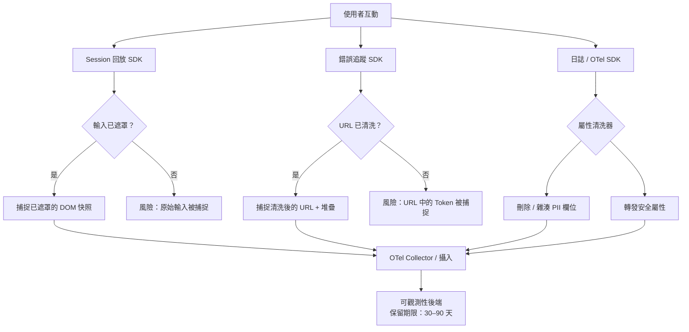

# 尊重隱私的可觀測性

可觀測性工具——錯誤追蹤器、Session 回放工具、日誌管線、真實使用者監控——
是 Web 應用程式所運行的系統中最渴求資料的一類，也是最容易意外攝入使用者
資料的一類。Session 回放工具在開發者意識到輸入欄位未被遮罩之前，已捕捉
了付款表單中的每一個按鍵。結構化日誌將使用者的電子郵件作為請求參數一同
傳送。錯誤報告包含了帶有 OAuth token 的 URL 片段完整的堆疊追蹤。每一種
情況都是從未被有意識地做出的資料收集決策。

尊重隱私的可觀測性並非意味著收集更少的資料，而是更有意識地收集：了解每
個工具攝入哪些資料、在資料離開瀏覽器之前套用遮罩與清洗，以及將資料保留
期限設定為診斷目的所需的最短時間。大多數可觀測性 SDK 的預設配置是為了
完整性而設計的，而非隱私保護。團隊必須主動覆蓋這些預設值，而非接受它們。

法規背景至關重要。GDPR 要求處理個人資料須有合法依據，並賦予資料主體刪除
權。CCPA 要求揭露出售給第三方的資料，可觀測性 SaaS 平台可能符合此定義。
若應用程式處理受保護的健康資訊，且可觀測性工具攝入了 PHI，則 HIPAA 亦
適用。這些法規並不禁止可觀測性——它們要求所收集的資料能夠被合理說明、
受到適當保護，且能夠應要求刪除。

本文涵蓋可觀測性工具常見收集的個人資料類別、在 SDK 層級進行遮罩與清洗
的技術、結構化日誌與 Trace 的資料最小化模式，以及使隱私合規可持續維護的
組織管控措施。

## 原則

在將任何可觀測性工具部署至生產環境之前，必須（MUST）針對該工具可能攝入
的個人資料類別進行審查。可觀測性管線中的個人資料必須（MUST）在收集點進
行遮罩——在瀏覽器 SDK 或日誌呼叫中——而非依賴攝入後的資料治理流程。敏感
欄位禁止（MUST NOT）以任何可識別或重新識別個人的形式出現在日誌、Trace 或
Session 回放中。保留期限必須（MUST）設定為能滿足資料診斷目的的最短時間
區間。

## 設計思維

### 可觀測性工具常見收集的資料

Session 回放工具是風險最高的類別。在預設設定下，它們會記錄螢幕上可見的
所有 DOM 內容、在表單欄位中輸入的所有文字、滑鼠移動路徑與點擊座標。在
結帳頁面使用預設配置的 Session 回放工具，會在使用者輸入時記錄信用卡號、
帳單地址與 CVV 欄位。即使是在 DOM 中以點字符顯示的遮罩欄位，若工具攔截
的是 input 事件而非渲染後的 DOM，也可能以真實值被記錄。

錯誤追蹤器通常會捕捉錯誤發生時的完整 URL，包括查詢參數與 URL 片段。
OAuth 重導向流程會在 URL 中傳遞 `access_token` 或 `code` 參數。一次在登
入重導向期間發生的未捕捉例外，可能將存取 token 送往錯誤追蹤器的後端。在
某些配置中，錯誤追蹤器還會捕捉 `navigator` 屬性、Cookie，以及被要求包含
麵包屑狀態時的 localStorage 值。

結構化日誌的風險較不明顯，但經常浮現個人資料。會記錄請求與回應主體的
API 客戶端函式庫，也會記錄使用者提交的表單資料。在伺服器端渲染應用程式
中開啟 ORM 偵錯日誌，會記錄包含使用者 ID、電子郵件或搜尋詞的查詢參數。
接受完整 HTTP 標頭的日誌聚合器，將收到含有 Bearer Token 的 Authorization
標頭。

真實使用者監控（RUM）工具記錄時序資料、頁面 URL 與 User Agent 字串。頁
面 URL 往往含有使用者特定的識別碼——`/users/12345/settings` 就暴露了使用者
ID。User Agent 字串與 IP 位址（RUM 工具通常也會收集）組合，可透過裝置指
紋辨識重新識別個人。

分散式 Trace 攜帶 Span 屬性。設置在 HTTP 請求 Span 上的屬性，往往包含完
整的 URL 路徑、查詢參數與回應碼。若請求 URL 含有使用者識別碼或使用者輸
入的搜尋詞，該屬性便是儲存在 Trace 後端中的個人資料。

### 在 Session 回放工具中遮罩個人資料

所有主流 Session 回放工具都提供輸入遮罩配置。正確的預設值是「隱私優先」：
預設遮罩所有輸入，並選擇性地取消遮罩不含個人資料的欄位。反向做法——預設
取消遮罩、選擇性遮罩——需要持續維護，因為每次新增表單欄位若未加上遮罩標
記，就會形成資料洩漏。

基於 CSS class 的遮罩是最具移植性的模式。指定一個 CSS class——慣例上為
`.pii`、`.masked` 或 `.rr-mask`——作為遮罩選擇器，任何帶有該 class 的元
素都會在 DOM 層級被排除在 Session 回放記錄之外，在工具傳輸快照之前生效。
新增表單欄位的後端開發者必須被告知，任何接受個人資料的欄位都需套用遮罩
class。

若啟用了網路請求記錄，則需要明確允許名單來指定哪些回應主體可以安全記錄。
預設記錄所有網路回應，會捕捉到可能含有使用者個人資料、付款資訊或訊息的
API 回應。回應主體記錄應預設關閉，僅在非驗證端點或已確認回應主體不含個
人資料的端點中開啟，且診斷價值須明確。

Canvas 與 Shadow DOM 元素需要獨立的遮罩配置。捕捉 Canvas 內容的可觀測性
工具，可能會記錄自訂渲染的付款輸入框（某些支付服務使用此方式以避免直接
存取 DOM）。用於敏感表單的 Shadow DOM 元件，應針對工具的 Shadow DOM 捕捉
行為進行驗證。

### 從日誌與 Trace 中清洗個人資料

日誌清洗在傳輸層運作：在日誌事件被傳輸前，清洗函式檢查事件酬載，並替換
或移除個人資料。常見的模式有：欄位路徑排除（從每個日誌事件中刪除
`user.email` 欄位）、值模式替換（將符合電子郵件模式的字串替換為
`[REDACTED]`），以及雜湊替換（將使用者識別碼替換為確定性雜湊，以在不暴
露原始值的情況下保留可關聯性）。

對自由格式欄位套用基於模式的清洗容易出錯。包含「Request failed for
john@example.com」的日誌訊息，無法被欄位路徑排除規則識別。僅依賴模式匹
配的團隊，必須維護涵蓋所有個人資料格式的正則表達式——這是一份本質上不完
整的清單。結構化控制更為可靠：記錄結構化資料物件而非將字串格式化為訊息
的日誌框架，能使欄位路徑排除既可靠又全面。

OpenTelemetry 的屬性清洗可在 Collector 管線中使用 `transform` 處理器套用。
Collector 可在轉發至可觀測性後端之前，對符合指定模式的 Span 屬性進行刪
除、雜湊或替換。這樣可將清洗邏輯集中在基礎設施中，而非分散在每個 SDK
整合中，降低某個服務遺漏清洗規則的風險。

對於瀏覽器端的日誌與 Trace，清洗必須在資料離開瀏覽器之前完成。OTel SDK
的 Span 處理器可在瀏覽器中作為自訂 `SpanProcessor` 套用屬性過濾：在每個
Span 被匯出之前，處理器檢查 Span 屬性，並對符合敏感欄位名稱或模式的值
進行編輯。

### 結構化日誌的資料最小化

資料最小化——只收集必要的資料——比清洗更有效，因為它從根本上消除了事後識
別和移除資料的需求。在向日誌事件新增任何欄位之前，應問：這個欄位能提供
哪些若無它便無法做出的診斷決策？

日誌中的使用者識別碼用於關聯：將多個日誌事件連結到同一個使用者 Session。
Session 範圍的關聯 ID——在 Session 開始時生成的隨機 UUID，包含在所有日誌
事件中——提供了同等的關聯能力，卻不暴露持久性使用者識別碼。若法規要求
稍後刪除某使用者的資料，可以直接刪除關聯 ID，而不影響使用者帳號。

請求與回應主體日誌應預設關閉。若為了除錯而啟用，應限制在非驗證端點或團
隊已確認回應主體不含個人資料的端點。測試與開發環境可以更廣泛地啟用主體
日誌，但這不得透過共享配置延伸至生產環境。

### 同意與退出機制

某些司法管轄區與應用程式情境要求在啟動可觀測性工具之前取得使用者同意。
Cookie 同意框架通常將分析 Cookie 與追蹤腳本納入其範疇，但 Session 回放
與錯誤追蹤若處理個人資料，可能受到獨立管轄。

實際實作方式是延遲 SDK 初始化：可觀測性 SDK 腳本已載入但未初始化，直到
確認使用者的同意狀態為止。若使用者尚未同意相關類別，SDK 保持休眠狀態。
若取得同意，SDK 以適當的遮罩配置進行初始化。若同意被撤回，SDK 被銷毀，
後續 Session 不再收集資料。

對於不使用基於同意啟動的應用程式，全站退出機制在某些解釋下能滿足 GDPR
資料主體權利：使用者可以要求其 Session 資料不被收集，退出設定儲存在第一
方 Cookie 中，SDK 在初始化時會檢查此 Cookie。此方式的法律依據與適用性
須與法律顧問確認。

### 保留期限與刪除

含有個人資料的可觀測性資料受資料主體權利約束：存取權、更正權與刪除權。
大多數可觀測性 SaaS 後端提供保留期限配置。將保留期限設定為事件回應所需
的最短時間——Session 回放通常為 30 至 90 天，錯誤事件通常為 90 至 180 天
——能限制暴露窗口。

來自使用者的刪除請求需要一種機制，能在可觀測性後端中識別並移除其資料。
若 Span 屬性或日誌事件中包含使用者識別碼，可觀測性工具必須支援依使用者
識別碼進行刪除。不支援此功能的工具需要一個操作變通方案：獨立儲存使用者
ID 與 Session ID 的對應關係，並提交以 Session 為單位的刪除請求。

## 最佳實踐

**必須（MUST）**在部署至生產環境之前，審查每個可觀測性 SDK 的預設資料
收集行為。預設值為完整性而非隱私而優化。在 SDK 上線之前，明確配置輸入
遮罩、網路請求過濾與麵包屑清洗。

**禁止（MUST NOT）**允許含有 Token、授權碼或使用者識別碼的 URL 片段或查
詢參數被傳輸到可觀測性後端。不得跳過 URL 清洗步驟，也不得將帶有敏感參數
的原始 URL 作為 Span 屬性、日誌欄位或 Session 回放麵包屑進行捕捉。

**應該（SHOULD）**為 Session 回放採用隱私優先的遮罩預設值：預設遮罩所有
輸入，並維護一份明確的安全欄位允許名單。不要依賴開發者記得為新增的表單
欄位加上遮罩標記。

**應該（SHOULD）**在收集點——瀏覽器 SDK 或伺服器端日誌呼叫——實施日誌與
Trace 清洗，而非依賴攝入後的管線處理。資料一旦到達攝入後端，即使是暫時
性的，也面臨風險。

**必須（MUST）**將可觀測性資料保留期限配置為滿足診斷目的的最短時間。保
留 12 個月的 Session 回放在事件回應上沒有任何價值，卻會增加法規風險。

**應該（SHOULD）**在日誌與 Trace 中使用 Session 範圍的關聯 ID，而非持久
性使用者識別碼。關聯 ID 提供相同的連結能力，卻具有更短的個人資料生命週期。

## 視覺呈現



## 範例

```typescript
// src/telemetry/privacy-span-processor.ts
// 自訂 OTel SpanProcessor，在匯出前從 Span 屬性中清洗個人識別資訊。
// 在 BatchSpanProcessor 之前註冊此處理器。

import {
  SpanProcessor,
  ReadableSpan,
  Span,
} from '@opentelemetry/sdk-trace-base';
import { Context } from '@opentelemetry/api';

const SENSITIVE_ATTRIBUTE_KEYS = new Set([
  'http.request.header.authorization',
  'http.request.header.cookie',
  'user.email',
  'user.phone',
  'enduser.email',
]);

// 無論鍵名為何，值符合此模式的屬性均需被編輯
const SENSITIVE_VALUE_PATTERNS: RegExp[] = [
  /\b[A-Z0-9._%+-]+@[A-Z0-9.-]+\.[A-Z]{2,}\b/i, // 電子郵件
  /access_token=[^&]+/i,
  /code=[a-z0-9_-]{20,}/i,
];

function scrubAttributes(
  attributes: Record<string, unknown>,
): Record<string, unknown> {
  const result: Record<string, unknown> = {};
  for (const [key, value] of Object.entries(attributes)) {
    if (SENSITIVE_ATTRIBUTE_KEYS.has(key)) {
      result[key] = '[REDACTED]';
      continue;
    }
    if (typeof value === 'string') {
      const isSensitive = SENSITIVE_VALUE_PATTERNS.some((p) => p.test(value));
      result[key] = isSensitive ? '[REDACTED]' : value;
    } else {
      result[key] = value;
    }
  }
  return result;
}

export class PrivacySpanProcessor implements SpanProcessor {
  onStart(_span: Span, _parentContext: Context): void {}

  onEnd(span: ReadableSpan): void {
    // 在 Span 到達匯出器之前就地修改屬性
    const attrs = span.attributes as Record<string, unknown>;
    const scrubbed = scrubAttributes(attrs);
    Object.assign(attrs, scrubbed);
  }

  shutdown(): Promise<void> {
    return Promise.resolve();
  }

  forceFlush(): Promise<void> {
    return Promise.resolve();
  }
}

// 在 setup.ts 中的註冊方式：
// provider.addSpanProcessor(new PrivacySpanProcessor());
// provider.addSpanProcessor(new BatchSpanProcessor(exporter));
```

## 常見錯誤

- 在未審查所收集資料的情況下接受 SDK 預設配置——大多數工具為了開發者的
  便利性而預設最大化捕捉
- 對 Session 回放輸入遮罩使用拒絕名單而非允許名單——任何新增的表單欄位
  都處於未遮罩狀態，直到有人注意到為止
- 記錄包含查詢參數的完整請求 URL——Token 與使用者識別碼出現在 OAuth
  流程、搜尋表單與分頁的 URL 中
- 假設 OTel Collector 會處理所有清洗工作——瀏覽器端 Span 到達 Collector
  時已成形；在瀏覽器端設置不當的欄位必須在瀏覽器端進行清洗
- 在沒有診斷理由的情況下，將 Session 回放資料保留數個月——長保留期在不
  增加事件回應價值的情況下，增加了法規風險
- 將可觀測性工具排除在資料處理清單之外——法規機關與審計人員期望所有個
  人資料處理者均被記錄在案，包括 SaaS 可觀測性供應商

## 相關 FEE

- FEE-1400: Structured Logging Fundamentals
- FEE-1403: Error Tracking & Source Maps
- FEE-1408: OpenTelemetry Trace Correlation in the Browser

## 參考資料

- [GDPR 第 5 條：處理個人資料的原則](https://gdpr-info.eu/art-5-gdpr/)
- [OWASP：日誌記錄備忘單](https://cheatsheetseries.owasp.org/cheatsheets/Logging_Cheat_Sheet.html)
- [OpenTelemetry：屬性命名慣例](https://opentelemetry.io/docs/specs/semconv/)
- [PostHog：Session 回放隱私控制](https://posthog.com/docs/session-replay/privacy)
- [Datadog：Session 回放隱私選項](https://docs.datadoghq.com/real_user_monitoring/session_replay/privacy_options/)
- [W3C：隱私原則](https://w3ctag.github.io/privacy-principles/)
