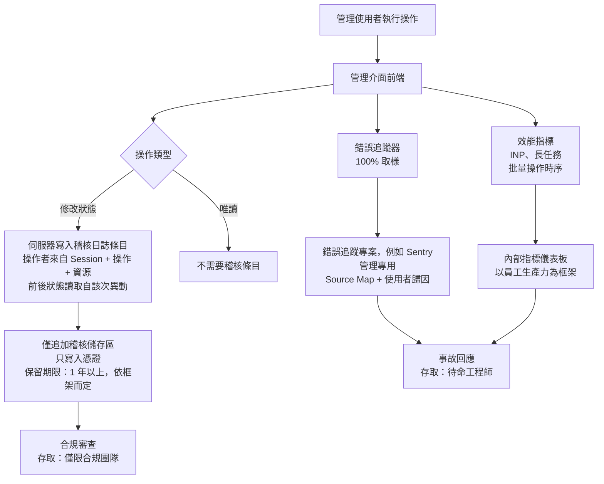

# [FEE-1410] 內部工具與管理介面的可觀測性

:::info
內部工具與管理後台執行系統中最敏感的操作：批量資料編輯、權限變更、客戶
帳號管理、功能旗標覆蓋。它們也是多數前端程式碼庫中監測最不完善的部分，
因為團隊認為使用者基數小就代表風險低。面向客戶的介面出現錯誤只影響一位
客戶；管理介面的批量編輯操作出錯，單次點擊就可能影響數千條記錄。內部工
具需要自己的稽核日誌、錯誤監控與效能可觀測性校準基準，而非消費性應用程
式手冊的縮小版。
:::

## 背景

多數可觀測性指南鎖定面向客戶的產品：取樣的錯誤追蹤、Core Web Vitals，
以及為降低隱私風險而剔除個人資料的錯誤上下文。這些指南預設的是一個龐大
且匿名的使用者群體，其中單一使用者的 Session 在統計上可被取代。內部工
具翻轉了這些假設：每個帳號都屬於具名人員並帶有組織角色，每個操作都出於
故意而非偶然。關鍵問題也隨之改變，從「有多少使用者遭遇了這個錯誤」變成
「誰在什麼順序下做了什麼，結果造成了什麼變化」。本文涵蓋管理操作的稽核
日誌、針對小型已知群體校準的錯誤監控、超級使用者的效能可觀測性，以及避
免這些資料本身成為負擔的存取控制。

## 視覺對比



## 範例

稽核記錄唯有在由客戶端無法偽造的一方寫入時才值得信賴。瀏覽器絕不能成為
`actor` 或 `before`/`after` 狀態的真實來源：惡意或有 Bug 的客戶端可能回
報不同的使用者、不同的角色，或是與實際發生情況不符的差異。權威的稽核條
目必須在伺服器端建構，依據已驗證的 Session 以及伺服器實際執行的異動，
而不是依據前端自行組裝並 POST 上來的資料。

以下範例是一個用於更新使用者角色的伺服器端路由處理器。它從已驗證的
Session（而非請求主體）讀取操作者，在寫入前立即從資料庫讀取「前」狀態，
並從寫入結果本身讀取「後」狀態。

```typescript
// src/api/routes/update-user-role.ts
// 這是一個修改狀態的管理操作的伺服器端處理器。稽核條目在這裡建構，
// 而不是在客戶端建構，因為伺服器是唯一能被信任、可回報操作者身份
// 與變更內容的一方。

import type { AuthenticatedRequest, Response } from '../types';
import { writeAuditEntry } from '../audit/audit-store';
import { db } from '../db';

export type AuditAction =
  | 'create'
  | 'update'
  | 'delete'
  | 'bulk_update'
  | 'export'
  | 'permission_change';

export interface AuditEntry<T = unknown> {
  actor: { userId: string; displayName: string; role: string };
  action: AuditAction;
  resource: { type: string; id: string };
  timestamp: string; // ISO 8601 UTC
  before?: T;
  after?: T;
  metadata?: Record<string, string | number | boolean>;
}

export async function updateUserRole(req: AuthenticatedRequest, res: Response) {
  // req.session.user 來自伺服器自身的 Session 儲存區。客戶端無法透過
  // 編輯請求主體來設定或偽造這個值。
  const actor = req.session.user;
  const { targetUserId, roles: requestedRoles } = req.body;

  const before = await db.user.findUnique({ where: { id: targetUserId } });
  const after = await db.user.update({
    where: { id: targetUserId },
    data: { roles: requestedRoles },
  });

  await writeAuditEntry<{ roles: string[] }>({
    actor: { userId: actor.id, displayName: actor.name, role: actor.role },
    action: 'permission_change',
    resource: { type: 'user', id: targetUserId },
    timestamp: new Date().toISOString(),
    before: { roles: before?.roles ?? [] },
    after: { roles: after.roles },
  });

  res.json(after);
}
```

前端的角色僅限於呼叫業務端點（此處為 `PATCH /api/admin/user-roles`，請
求主體帶有 `{ targetUserId, roles }`）並傳入請求的變更。伺服器負責建構
`AuditEntry`、從自身 Session 解析操作者，並計算 `before`/`after` 差異。
批量操作遵循相同模式：伺服器為每個批量請求寫入一筆頂層稽核條目，並為每
筆受影響記錄寫入一筆詳細條目，使用的操作者來自伺服器自身的 Session，異
動記錄也來自伺服器實際寫入的內容，而非客戶端提供的計數或差異。

## 最佳實踐

**必須（MUST）**為每個修改狀態的管理操作記錄結構化的稽核日誌條目：建立、
更新、刪除、批量修改、權限變更以及資料匯出。未出現在稽核日誌中的操作，
對合規審查和事故調查而言是不可見的。

**必須（MUST）**在更新和刪除操作的稽核日誌條目中包含操作前後的狀態。僅
記錄「已更新」而不記錄實際變更內容的條目，不足以重建特定時間點的狀態。

**禁止（MUST NOT）**允許管理介面應用程式層刪除或修改自身的稽核日誌條目。
稽核日誌的完整性依賴於日誌從應用程式角度而言是只能追加、不得修改的。不
得向應用程式的服務帳號授予稽核日誌儲存區的刪除權限，也不得在應用程式層
提供任何稽核記錄的修改介面。

**應該（SHOULD）**將效能監控聚焦於高互動量的工作流程：批量操作、資料表
格渲染與篩選，以及複雜的多步驟表單流程，而非鎖定為面向客戶頁面校準的標
準 Core Web Vitals 指標。管理使用者長時間、高頻率地使用工具；首次內容
繪製很少是瓶頸所在。長任務持續時間、下次互動到繪製的時間（INP），以及
工作流程層級的時序（從發起 500 筆記錄的批量更新到收到最終結果所花費的
時間）才是能反映真實員工生產力影響的指標。

**應該（SHOULD）**對內部工具採用 100% 錯誤捕捉取樣，而非適用於高流量面
向客戶應用程式的百分比取樣。內部工具中的每個錯誤都影響一位正在執行真實
任務的具名人員。

**應該（SHOULD）**對內部工具設定以絕對數量而非比率為基礎的錯誤告警。在
一個擁有 50 位使用者的工具中，1% 的錯誤率代表一個中斷的 Session；針對大
型應用程式調整的比率閾值將無法捕捉到此問題。

**應該（SHOULD）**為管理套件部署單獨配置 Source Map 上傳。從不同部署路
徑提供的管理工具，需要自己的 Source Map 產物上傳，才能解析錯誤報告中的
堆疊追蹤。

**應該（SHOULD）**在獨立的存取受控專案或索引中儲存稽核日誌與內部工具錯
誤資料，而非將其與面向客戶的可觀測性資料聚合在一起。

## 設計思維

### 稽核日誌：範疇、內容與儲存

一條稽核日誌記錄有四個必要維度：誰（who）、做了什麼（what）、何時
（when）、影響了哪個資源（which resource）。「誰」是發出請求的已驗證使
用者：其內部使用者 ID、顯示名稱，以及操作當下的組織角色。「做了什麼」
是操作分類：建立、更新、刪除、匯出、核准、撤銷，或領域特定的動詞。「何
時」是帶有 UTC 時區與毫秒精度的 ISO 8601 時間戳記。「哪個資源」是受影響
實體的類型與識別碼：`user:12345`、`order:67890` 或
`feature_flag:payments-v2`。

一條記錄「更新了使用者權限」的記錄，遠不如記錄「權限從 `[viewer]` 變更
為 `[editor, billing_admin]`」的記錄有用。序列化完整的前後 JSON 差異
（diff）可以重建任意時間點的狀態。對於大型實體，僅記錄變更的欄位（即差
異）比將完整物件記錄兩次更為理想。

批量操作需要特殊處理。一個修改 500 條記錄的批量操作，邏輯上代表的是管
理員的一次有意操作，但會產生 500 個單獨的狀態變更。稽核日誌應將批量操
作記錄為單一的頂層條目，包含操作者、操作內容、受影響記錄數量與操作參
數，並附加一個指向包含每個個別變更的批量詳細日誌的引用。這種結構可以在
操作層級回答「這位管理員做了什麼」，而不至於在事件層級被海量資料淹沒。

稽核日誌從被稽核系統的角度來看必須是不可寫入的。管理介面應用程式層不應
能夠刪除或修改自身的稽核日誌記錄。在架構上，稽核日誌通常儲存在獨立的資
料庫或僅允許追加的日誌儲存區中，應用程式層只擁有寫入憑證。若支援刪除稽
核日誌，需要明確的帶外（out-of-band）授權。

稽核日誌的保留期限要求，通常長於應用程式日誌。PCI DSS 要求第 10 條給出
了一個具體範例：處理持卡人資料的系統，必須保留稽核日誌歷史至少一年，且
最近三個月須可立即用於分析。SOC 2 並未強制規定固定的保留期限，但稽核人
員評估的控制審查期通常涵蓋六至十二個月，因此即使沒有硬性要求，將稽核日
誌至少保留這麼長的時間，也是務實的最低標準。與 Session 回放資料不同，
稽核日誌通常不包含超出受影響記錄中已有資訊的個人資料。其記錄被修改的資
料主體，已透過主系統對該資料擁有相應權利。

### 針對內部工具校準的錯誤監控

面向客戶的應用程式往往因使用者基數龐大而對錯誤追蹤採用取樣方式，取樣後
的錯誤仍能提供統計上可靠的信號。內部工具則應改用 100% 錯誤捕捉。內部工
具的使用者基數小且有限，通常是數十到數百位具名員工，而非消費性應用程式
所服務的匿名大眾，每個錯誤都代表一位具名人員在執行真實任務時遭遇的具體
失敗。

內部工具錯誤率的告警閾值，應低於面向客戶應用程式的設定。以一個擁有 50
位活躍使用者的工具為例：1% 的錯誤率意味著每 50 位使用者中就有一位在每
次 Session 中遭遇錯誤。為一萬使用者量級應用程式調校的閾值，不會因這個
數字而觸發，但這卻代表某位員工的工作流程完全中斷。告警閾值應以錯誤的絕
對數量表達，而非以比率表達。任何影響具名使用者的錯誤都應觸發告警。

內部工具的錯誤上下文應包含完整的使用者歸因：已驗證使用者的身份、其角色，
以及錯誤發生時正在執行的操作。在面向客戶的應用程式中，錯誤報告中含有使
用者身份會引發隱私顧慮。但在管理工具中，每位使用者都是具名員工，每個操
作都是有意為之，使用者身份是必要的上下文：它能直接告訴響應工程師是誰受
到影響、哪個操作中斷了。

管理介面的堆疊追蹤，應能針對與管理套件一同部署的 Source Map 正確地解析。
內部工具往往從獨立部署中提供服務，擁有獨立的建構產物和資產路徑。若一個
共用的錯誤追蹤專案（例如 Sentry 或類似工具）缺少管理建構的正確 Source
Map 產物，會產生無法解析的堆疊追蹤，使除錯工作毫無用處。Source Map 上
傳必須針對每個獨立部署分別配置。

### 超級使用者的效能可觀測性

管理使用者的互動模式與客戶截然不同。試想兩種對比的 Session：一位客戶簡
短開啟應用程式完成單一任務後便離開；另一位管理員則讓工具在工作日的多數
時間保持開啟，持續發出一連串的異動操作，使用鍵盤快捷鍵，並在表格與詳細
檢視之間不間斷地切換。

效能儀器化應反映這些模式。對於使用者已在持久分頁中載入的管理工具，測量
首次內容繪製（FCP）的意義有限。長任務（Long Task）持續時間與 INP 更為
相關：它們衡量在主動、高頻使用中 UI 的響應性。批量操作進度（從發起 500
條記錄更新到收到第一個結果，再到最終結果的時間）是面向客戶工具中沒有對
應項目的工作流程層級指標。

資料表格效能是管理工具中最常見的效能瓶頸。在未使用虛擬化的情況下渲染數
百行的表格，會在正常的管理工作負載下產生長時間的版面和繪製任務，使 UI
凍結。Core Web Vitals 工具不會標記此問題：初始頁面載入很快，只有在持續
使用中問題才會顯現。在大型資料集規模下測量表格渲染時間、篩選套用延遲以
及行選取延遲的自訂指標，對這類 UI 比標準 CWV 指標更具診斷價值。

管理工具的效能預算，應相對於其對員工生產力的影響來設定。在一個使用者每
天執行 200 次操作的工具中，每次操作 200 毫秒的延遲，累積等待時間為 40
秒；同樣情境下 500 毫秒的延遲，累積等待時間則超過 100 秒。面向客戶的應
用程式以轉換率和跳出率來框架效能，頁面載入變慢對完成的購買數有可直接量
化的影響。管理工具沒有對應的轉換漏斗，因此員工時間是使預算具體化的計量
單位。將此效果乘以整個團隊後會產生複合效應：一個有 30 位管理員的團隊，
每人每天因 200 毫秒的延遲損失 40 秒，團隊每天就損失 20 分鐘的集體工作時
間，這還不包括延遲回應把人的注意力拉往其他任務時所產生的情境切換成本。

### 內部工具可觀測性資料的存取控制

來自內部工具的可觀測性資料本身就是敏感資料。記錄每個管理操作的稽核日誌，
是組織運營的完整記錄。包含完整使用者歸因以及其正在修改的資料狀態的錯誤
報告，比面向客戶產品的應用程式日誌更為敏感。存取內部工具可觀測性資料，
應限制於需要用它進行事故回應、合規審查或工程除錯的人員。

在實踐中，這意味著為內部工具配置獨立的錯誤追蹤專案（例如專屬的 Sentry
專案）、獨立的日誌索引，以及獨立的儀表板權限，而非將所有可觀測性資料聚
合到所有工程師都能存取的共用專案中。原則是：存取管理操作可觀測性資料，
應需要與存取管理工具本身相同的組織審批。

稽核日誌的存取尤其應遵循最小權限原則。合規人員可能需要在特定時間範圍內
讀取稽核日誌。工程師可能需要在診斷特定事故時取得存取權限。兩者都不應擁
有不受限制的持續存取權限。稽核日誌的查詢介面本身也應被記錄（誰查詢了稽
核日誌、查詢的時間範圍與篩選條件），以防止稽核日誌淪為反過來監控其所記
錄員工的監控工具。

## 常見錯誤

- 以使用者基數小為由，認為內部工具可免於可觀測性要求。使用者基數小加上
  高影響力操作，會使每個錯誤更為嚴重，而非更不嚴重。
- 直接沿用面向客戶應用程式的比率型錯誤告警閾值而不加調整。為一萬使用者
  校準的閾值，永遠不會在影響 50 位員工的錯誤上觸發。
- 稽核日誌中只記錄「做了什麼」而不記錄前後狀態。一條說「更新了權限」卻
  沒有變更詳情的記錄，不足以進行事故重建。
- 將管理工具可觀測性資料聚合到所有工程師均可存取的共用專案中。管理操作
  的稽核日誌需要比一般應用程式日誌更嚴格的存取控制。
- 忘記為管理套件部署單獨上傳 Source Map。管理工具往往有獨立的部署路徑，
  針對面向客戶應用程式的共用 Source Map 配置，無法解析管理端的堆疊追蹤。
- 對內部工具採用百分比取樣的錯誤取樣方式。在 50 位使用者的內部工具中採
  用 10% 取樣，代表發生次數少於 10 次的錯誤很可能永遠不會被回報。

## 延伸閱讀

- [可觀測性與錯誤追蹤總覽](/zh-tw/Observability%20and%20Error%20Tracking/1400)
- [日誌記錄與結構化日誌](/zh-tw/Observability%20and%20Error%20Tracking/1403)
- [尊重隱私的可觀測性](/zh-tw/Observability%20and%20Error%20Tracking/1409)

## 參考資料

- OWASP, "Logging Cheat Sheet," OWASP Cheat Sheet Series. https://cheatsheetseries.owasp.org/cheatsheets/Logging_Cheat_Sheet.html
- AICPA & CIMA, "2018 SOC 2 Description Criteria (With Revised Implementation Guidance - 2022)," AICPA & CIMA Resources. https://www.aicpa-cima.com/resources/download/get-description-criteria-for-your-organizations-soc-2-r-report
- PCI Security Standards Council, "PCI DSS v4.0 Requirement 10.5.1: Retain Audit Log History for at Least 12 Months," PCI Security Standards Council (2024). https://www.pcisecuritystandards.org/document_library/
- Sentry, "Identify Users," Sentry Documentation. https://docs.sentry.io/platforms/javascript/enriching-events/identify-user/
- Jeremy Wagner and Barry Pollard, "Interaction to Next Paint (INP)," web.dev (2022, updated 2025). https://web.dev/inp/
- NIST, "SP 800-92: Guide to Computer Security Log Management," National Institute of Standards and Technology (2006). https://csrc.nist.gov/publications/detail/sp/800-92/final
- OpenTelemetry, "Semantic Conventions," OpenTelemetry Specification. https://opentelemetry.io/docs/specs/semconv/
