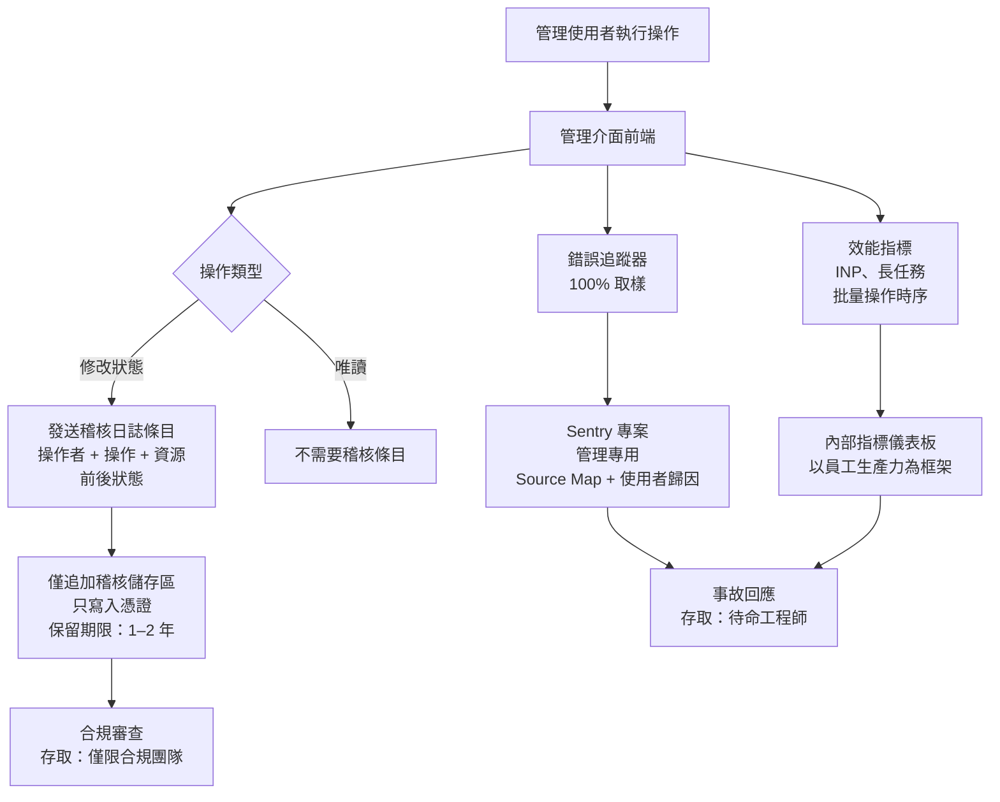

# 內部工具與管理介面的可觀測性

內部工具與管理後台在可觀測性的層次中佔據著特殊位置：它們影響系統中最敏
感的操作——批量資料編輯、權限變更、客戶帳號管理、功能旗標覆蓋——卻往往是
前端程式碼庫中監測最不完善的部分。這種情況的形成有其脈絡：內部工具的使
用者基數小、開發時間較短，且其缺陷的代價被認為較低。然而在實際情況中，
管理工具缺陷的代價往往更高。面向客戶的介面出現錯誤影響的是一位客戶；管
理操作的錯誤卻可能影響數千條記錄。

內部工具的可觀測性需求在幾個重要面向上與面向客戶的應用程式有所不同。使
用者群體規模小且身份明確——每個使用者都有具名帳號和組織歸屬。每個操作都
具有意圖性：一位工作人員進行批量更新，是出於明確的目的，這意味著每個操
作都可以被歸因追責。相關的問題不是「有多少使用者遭遇了這個錯誤」，而是
「誰在什麼時間、以什麼順序做了什麼，結果如何」。

稽核日誌（Audit Log）是內部工具最主要的可觀測性產物。稽核日誌記錄了誰
執行了某個操作、操作內容為何、哪些資料受到影響，以及前後狀態分別是什麼。
這與結構化應用程式日誌（記錄系統事件）和錯誤追蹤（記錄失敗）有所區別。
稽核日誌是合規性與問責制的記錄，而不僅僅是除錯輔助工具。

本文涵蓋管理操作稽核日誌的設計、針對小型內部使用者基數校準的錯誤監控、
適用於高互動率超級使用者的效能可觀測性，以及使內部工具可觀測性可持續維
護的組織管控措施。

## 原則

管理介面中每一個修改狀態的操作，必須（MUST）記錄在稽核日誌中，捕捉操作
者、操作內容、受影響的資源，以及操作前後的狀態。內部工具的錯誤追蹤應該
（SHOULD）配置為 100% 取樣，並設定較低的告警閾值，因為每個錯誤都影響一
位具名的已知使用者，且可能代表合規風險。效能監控應該（SHOULD）聚焦於高
互動量的工作流程——批量操作、資料表格、複雜的表單流程——在這些情境下，效
能劣化會直接降低員工的生產力。內部工具可觀測性資料必須（MUST）以符合其
敏感程度的存取控制加以儲存：捕捉管理員操作的稽核日誌，至少需要與其所記
錄操作本身相當的存取限制。

## 設計思維

### 稽核日誌：範疇、內容與儲存

一條稽核日誌記錄有四個必要維度：誰（who）、做了什麼（what）、何時
（when）、影響了哪個資源（which resource）。「誰」是發出請求的已驗證使
用者——其內部使用者 ID、顯示名稱，以及操作當下的組織角色。「做了什麼」
是操作分類：建立、更新、刪除、匯出、核准、撤銷，或領域特定的動詞。「何
時」是帶有 UTC 時區與毫秒精度的 ISO 8601 時間戳記。「哪個資源」是受影響
實體的類型與識別碼——`user:12345`、`order:67890` 或
`feature_flag:payments-v2`。

前後狀態的捕捉，將有用的稽核日誌與合規勾選動作區分開來。一條記錄「更新
了使用者權限」的記錄，遠不如記錄「權限從 `[viewer]` 變更為
`[editor, billing_admin]`」的記錄有用。序列化完整的前後 JSON 差異（diff）
可以重建任意時間點的狀態。對於大型實體，記錄差異——僅記錄變更的欄位——比
將完整物件記錄兩次更為理想。

批量操作需要特殊處理。一個修改 500 條記錄的批量操作，邏輯上代表的是管
理員的一次有意操作，但會產生 500 個單獨的狀態變更。稽核日誌應將批量操
作記錄為單一的頂層條目——包含操作者、操作內容、受影響記錄數量與操作參數
——並附加一個指向包含每個個別變更的批量詳細日誌的引用。這種結構可以在操
作層級回答「這位管理員做了什麼」，而不至於在事件層級被海量資料淹沒。

稽核日誌從被稽核系統的角度來看必須是不可寫入的。管理介面應用程式層不應
能夠刪除或修改自身的稽核日誌記錄。在架構上，稽核日誌通常儲存在獨立的資
料庫或僅允許追加的日誌儲存區中，應用程式層只擁有寫入憑證。若支援刪除稽
核日誌，需要明確的帶外（out-of-band）授權。

稽核日誌的保留要求通常長於應用程式日誌。許多合規框架規定稽核記錄的最低
保留期限為一年或兩年。PCI DSS 要求持卡人資料環境的稽核記錄保留至少一
年，且最近三個月須可立即存取。SOC 2 審計通常要求覆蓋六至十二個月的稽核
日誌。設定保留期限時，應先確認應用程式適用的合規框架，再以此為下限進行
配置，而非使用未經審查的預設值。

與 Session 回放資料不同，稽核日誌通常不包含超出受影響記錄中已有資訊的
個人資料——其記錄被修改的資料主體，本已透過主系統對該資料擁有相應權利。

### 針對內部工具校準的錯誤監控

面向客戶的應用程式由於使用者基數龐大，往往對錯誤追蹤採用取樣方式，取樣
後的錯誤仍能提供統計上可靠的信號。內部工具應採用 100% 錯誤捕捉，因為使
用者基數小——通常少於 50 至 500 位並發使用者——每個錯誤都代表一位具名人員
在執行真實任務時遭遇的具體失敗。

內部工具錯誤率的告警閾值應低於面向客戶應用程式的設定。在一個擁有 50 位
活躍使用者的工具中，1% 的錯誤率意味著每 50 位使用者中就有一位在 Session
中遭遇錯誤。這可能不會觸發為一萬使用者量級應用程式設定的告警閾值，但卻
代表某位員工的工作流程完全中斷。內部工具的告警閾值應以錯誤的絕對數量表
達——「任何影響具名使用者的錯誤都觸發告警」——而非以比率表達。

內部工具的錯誤上下文應包含完整的使用者歸因：已驗證使用者的身份、其角色，
以及錯誤發生時正在執行的操作。在面向客戶的應用程式中，錯誤報告中含有使
用者身份會引發隱私顧慮。但在管理工具中，每位使用者都是具名員工，每個操
作都是有意為之，使用者身份是必要的上下文——它能直接告訴響應工程師是誰受
到影響、哪個操作中斷了。

管理介面的堆疊追蹤，應能針對與管理套件一同部署的 Source Map 正確地解析。
內部工具往往從獨立部署中提供服務，擁有獨立的建構產物和資產路徑。若一個
共用的 Sentry 專案沒有管理建構的正確 Source Map 產物，會產生無法解析的堆
疊追蹤，使除錯工作毫無用處。Source Map 上傳必須針對每個獨立部署分別配置。

### 超級使用者的效能可觀測性

管理使用者的互動模式與客戶截然不同。客戶可能每次 Session 使用應用程式
5 到 15 分鐘，遵循線性流程，執行一到兩個資料操作。而管理使用者可能持續
使用工具 4 到 8 小時，執行數百次資料操作，使用鍵盤快捷鍵，並在表格與詳
細檢視之間快速切換。

效能儀器化應反映這些模式。對於使用者已在持久分頁中載入的管理工具，測量
首次內容繪製（FCP）的意義有限。長任務（Long Task）持續時間與下次互動到
繪製的時間（INP）更為相關：它們衡量在主動、高頻使用中 UI 的響應性。批量
操作進度——從發起 500 條記錄更新到收到第一個結果，再到最終結果的時間——是
面向客戶工具中沒有對應項目的工作流程層級指標。

資料表格效能是管理工具中最常見的效能瓶頸。在未使用虛擬化的情況下渲染數
百行的表格，會在正常的管理工作負載下產生長時間的版面和繪製任務，使 UI
凍結。Core Web Vitals 工具不會標記此問題，因為初始頁面載入很快——只有在
持續使用中問題才會顯現。在大型資料集規模下測量表格渲染時間、篩選套用延
遲以及行選取延遲的自訂指標，對這類 UI 比標準 CWV 指標更具診斷價值。

管理工具的效能預算應相對於其對員工生產力的影響來設定。在一個使用者每天
執行 200 次操作的工具中，每次操作 200 毫秒的延遲，累積等待時間為 40 秒；
同樣情境下 500 毫秒的延遲，累積等待時間超過 100 秒。以每天員工時間來框
架效能，使預算具體化，並將其與成本連結。

### 內部工具可觀測性資料的存取控制

來自內部工具的可觀測性資料本身就是敏感資料。記錄每個管理操作的稽核日誌，
是組織運營的完整記錄。包含完整使用者歸因以及其正在修改的資料狀態的錯誤
報告，比面向客戶產品的應用程式日誌更為敏感。存取內部工具可觀測性資料，
應限制於需要用它進行事故回應、合規審查或工程除錯的人員。

在實踐中，這意味著為內部工具配置獨立的 Sentry 專案、獨立的日誌索引，以
及獨立的儀表板權限，而非將所有可觀測性資料聚合到所有工程師都能存取的共
用專案中。原則是：存取管理操作可觀測性資料，應需要與存取管理工具本身相
同的組織審批。

稽核日誌的存取尤其應遵循最小權限原則。合規人員可能需要在特定時間範圍內
讀取稽核日誌。工程師可能需要在診斷特定事故時取得存取權限。兩者都不應擁
有不受限制的持續存取權限。稽核日誌的查詢介面本身也應被記錄——誰查詢了稽
核日誌、查詢的時間範圍與篩選條件——以防止稽核日誌淪為反過來監控其所記錄
員工的監控工具。

## 最佳實踐

**必須（MUST）**為每個修改狀態的管理操作記錄結構化的稽核日誌條目：建立、
更新、刪除、批量修改、權限變更以及資料匯出。未出現在稽核日誌中的操作，
對合規審查和事故調查而言是不可見的。

**必須（MUST）**在更新和刪除操作的稽核日誌條目中包含操作前後的狀態。僅
記錄「已更新」而不記錄實際變更內容的條目，不足以重建特定時間點的狀態。

**禁止（MUST NOT）**允許管理介面應用程式層刪除或修改自身的稽核日誌條目。
稽核日誌的完整性依賴於日誌從應用程式角度而言是只能追加、不得修改的。不
得向應用程式的服務帳號授予稽核日誌儲存區的刪除權限，也不得在應用程式層
提供任何稽核記錄的修改介面。

**應該（SHOULD）**對內部工具採用 100% 錯誤捕捉取樣，而非適用於高流量面
向客戶應用程式的百分比取樣。內部工具中的每個錯誤都影響一位正在執行真實
任務的具名人員。

**應該（SHOULD）**對內部工具設定以絕對數量而非比率為基礎的錯誤告警。在
一個擁有 50 位使用者的工具中，1% 的錯誤率代表一個中斷的 Session——針對
大型應用程式調整的比率閾值將無法捕捉到此問題。

**應該（SHOULD）**為管理套件部署單獨配置 Source Map 上傳。從不同部署路徑
提供的管理工具，需要自己的 Source Map 產物上傳，才能解析錯誤報告中的堆
疊追蹤。

**應該（SHOULD）**在獨立的存取受控專案或索引中儲存稽核日誌與內部工具錯
誤資料，而非將其與面向客戶的可觀測性資料聚合在一起。

## 視覺呈現



## 範例

```typescript
// src/admin/audit-logger.ts
// 管理介面操作的結構化稽核日誌客戶端。
// 將日誌傳送至後端端點，後端負責寫入僅追加的稽核儲存區。

export type AuditAction =
  | 'create'
  | 'update'
  | 'delete'
  | 'bulk_update'
  | 'export'
  | 'permission_change';

export interface AuditEntry<T = unknown> {
  actor: {
    userId: string;
    displayName: string;
    role: string;
  };
  action: AuditAction;
  resource: {
    type: string; // 例如：'user'、'order'、'feature_flag'
    id: string;
  };
  timestamp: string; // ISO 8601 UTC
  before?: T;
  after?: T;
  metadata?: Record<string, string | number | boolean>;
}

async function logAuditEvent<T>(entry: AuditEntry<T>): Promise<void> {
  await fetch('/api/audit-log', {
    method: 'POST',
    headers: { 'Content-Type': 'application/json' },
    body: JSON.stringify(entry),
  });
}

// 使用範例：更新使用者角色
// const before = { roles: ['viewer'] };
// const after = { roles: ['editor', 'billing_admin'] };
// await logAuditEvent({
//   actor: {
//     userId: currentUser.id,
//     displayName: currentUser.name,
//     role: currentUser.role,
//   },
//   action: 'permission_change',
//   resource: { type: 'user', id: targetUserId },
//   timestamp: new Date().toISOString(),
//   before,
//   after,
// });

// 批量操作範例：
// await logAuditEvent({
//   actor: {
//     userId: currentUser.id,
//     displayName: currentUser.name,
//     role: currentUser.role,
//   },
//   action: 'bulk_update',
//   resource: { type: 'order', id: 'bulk' },
//   timestamp: new Date().toISOString(),
//   metadata: {
//     count: selectedOrderIds.length,
//     field: 'status',
//     newValue: 'cancelled',
//     reason: cancellationReason,
//   },
// });
```

## 常見錯誤

- 以使用者基數小為由，認為內部工具可免於可觀測性要求——使用者基數小加上
  高影響力操作，使每個錯誤更為嚴重，而非更不嚴重
- 直接沿用面向客戶應用程式的比率型錯誤告警閾值——為一萬使用者校準的閾
  值，永遠不會在影響 50 位員工的錯誤上觸發
- 稽核日誌中只記錄「做了什麼」而不記錄前後狀態——一條說「更新了權限」
  卻沒有變更詳情的記錄，不足以進行事故重建
- 將管理工具可觀測性資料聚合到所有工程師均可存取的共用專案中——管理操
  作的稽核日誌需要比一般應用程式日誌更嚴格的存取控制
- 未為管理套件部署單獨上傳 Source Map——管理工具往往有獨立的部署路徑；
  針對面向客戶應用程式的共用 Source Map 配置，無法解析管理端的堆疊追蹤
- 對內部工具採用百分比取樣——在 50 位使用者的內部工具中採用 10% 取樣，
  表示發生次數少於 10 次的錯誤很可能永遠不會被回報

## 相關 FEE

- FEE-1400: Structured Logging Fundamentals
- FEE-1403: Error Tracking & Source Maps
- FEE-1409: Privacy-Respecting Observability

## 參考資料

- [OWASP：日誌記錄備忘單](https://cheatsheetseries.owasp.org/cheatsheets/Logging_Cheat_Sheet.html)
- [SOC 2：稽核日誌要求](https://www.aicpa.org/resources/landing/system-and-organization-controls-soc-suite-of-services)
- [Sentry：使用者回饋與歸因](https://docs.sentry.io/platforms/javascript/user-feedback/)
- [web.dev：下次互動到繪製的時間（INP）](https://web.dev/inp/)
- [NIST SP 800-92：電腦安全日誌管理指南](https://csrc.nist.gov/publications/detail/sp/800-92/final)
- [OpenTelemetry：語義慣例](https://opentelemetry.io/docs/specs/semconv/)
- [PCI DSS：稽核日誌需求 10](https://www.pcisecuritystandards.org/document_library/)
- [Datadog：稽核追蹤](https://docs.datadoghq.com/account_management/audit_trail/)
