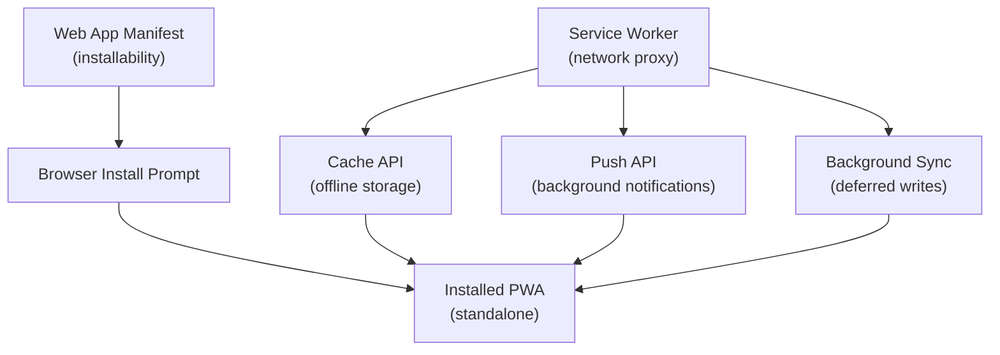

# [FEE-1300] Progressive Web Apps 與離線功能概覽

:::info
本類別涵蓋 Web 應用程式如何透過開放的 Web 標準，達成原本只有原生應用程式才能實現的能力：可安裝性、離線存取、背景處理，以及作業系統層級的整合。主題涵蓋 Web App Manifest、Service Worker、快取策略、推播通知、Background Sync，以及上線部署模式。
:::

## 介紹

Progressive Web App（PWA）是一種 Web 應用程式，透過分層運用現代瀏覽器 API，提供過去只有原生行動或桌面應用程式才能達成的使用體驗。「漸進式（Progressive）」這個詞反映了其設計哲學：對於不支援進階功能的瀏覽器，PWA 仍然是一個完整可用的網頁；而隨著瀏覽器能力的提升，功能也逐步增強。在支援的瀏覽器與作業系統上，使用者可以將 App 安裝到主畫面、在沒有網址列的視窗中啟動、接收推播通知，並在網路中斷時繼續使用 -- 這一切都不需要經過應用程式商店。

PWA 的動機根植於原生應用程式發佈的經濟成本與使用摩擦。
原生 App 需要分別為 iOS 和 Android 維護獨立的程式碼庫、經過應用商店審核、遵守強制更新週期，而且安裝步驟本身就會造成顯著的用戶流失。
Web 應用程式消除了這些障礙，但過去犧牲了可發現性、互動機制（主畫面呈現、通知），以及離線可靠性。
PWA 彌補了這個落差，將這些互動性與可靠性特性帶入 Web，同時保留 Web 的發佈優勢：一個 URL、零安裝摩擦，以及跨平台共用的單一程式碼庫。

主流瀏覽器與作業系統對 PWA API 的支援已大幅成熟。Chromium 架構的瀏覽器在 Android、Windows、ChromeOS 上提供完整的安裝、通知與背景功能。
Safari on iOS 持續擴大對 Service Worker 的支援，並新增了主畫面安裝能力（自 iOS 16.4 起，包含推播通知），逐步縮小與 Chromium 的差距。
Chrome 和 Edge 的桌面 PWA 支援讓所有主要平台的使用者都能安裝 Web App，並透過工作列、App 捷徑、分享目標等作業系統層級的介面與之互動。
採用 PWA 技術不再是小眾決策 -- 對於任何重視互動性、可靠性與效能的應用程式而言，這已是基本的考量。

## PWA 的四大支柱

### 可安裝性（Installability）

可安裝性是 PWA 最可見的能力：App 出現在使用者的主畫面或工作列，並在自己的視窗中啟動，沒有瀏覽器網址列，就像原生應用程式一樣。這需要兩個元件協同運作。

**Web App Manifest**（`manifest.json`）是一個從 HTML 文件連結的 JSON 檔案，宣告 App 的識別資訊與啟動行為。它指定 App 的名稱、簡短名稱、圖示（多種解析度，供不同介面使用）、控制啟動頁面的 `start_url`、`display` 模式，以及 `theme_color`。瀏覽器使用此檔案構建安裝體驗：主畫面上的圖示、App 載入時的啟動畫面，以及 standalone 模式下的視窗外觀。

**`beforeinstallprompt`** 事件在支援的瀏覽器中，當可安裝性條件滿足時觸發：HTTPS 來源、含必要欄位的有效 manifest、以及已註冊的 Service Worker。應用程式程式碼可以監聽此事件，儲存提示的參考，並將顯示安裝 UI 的時機延後至上下文適切的時刻 -- 例如在使用者完成一個有意義的操作之後，而非在第一次頁面載入時。未處理 `beforeinstallprompt` 的應用程式會收到瀏覽器預設的安裝 UI，顯示在網址列或環境徽章中。

安裝後，App 會在裝置上佔據一個持久的位置，並以 manifest 中宣告的 display 模式啟動。在 `standalone` 模式下，瀏覽器外殼完全隱藏。在 `minimal-ui` 模式下，保留少量導航控制項。從使用者的角度來看，正常使用時與原生應用程式無法區分。

### 離線可靠性（Offline Reliability）

Service Worker 是瀏覽器以持久化背景腳本形式安裝的 JavaScript 檔案，執行在獨立於頁面的執行緒中。它作為**可程式化的網路代理（programmable network proxy）**：受控頁面發出的每個請求都會通過 Service Worker 的 `fetch` 事件處理器，應用程式可以在此決定是從快取服務、從網路取得，還是套用結合兩者的策略。

這個架構使離線可靠性成為可能。在 Service Worker 的 `install` 事件期間，應用程式可以預先快取關鍵資源 -- App Shell 的 HTML、CSS 和 JavaScript -- 使後續訪問時瀏覽器無需接觸網路即可渲染 UI。API 回應也可以在正常網路使用時快取，讓使用者在連線中斷時仍能存取顯示中的資料。

核心技術機制是 **Cache API** -- 一個用於儲存 `Request`/`Response` 鍵值對的持久化儲存，跨頁面載入與瀏覽器工作階段保持。與 `localStorage` 或 `sessionStorage` 不同，Cache API 儲存完整的 HTTP 回應，保留標頭與本體。Service Worker 負責填充與查詢此儲存，實現對快取內容、保留時間及失效條件的精細控制。

### 背景能力（Background Capabilities）

即使應用程式的所有頁面都已關閉，Service Worker 仍保持已註冊狀態，這帶來了兩種重要的背景行為。

**Push API** 允許伺服器向瀏覽器傳送訊息，喚醒 Service Worker 並觸發 `push` 事件，即使使用者已關閉應用程式的所有分頁。Service Worker 處理此事件，並使用 Notifications API 顯示通知。通知出現在 OS 層級，與原生 App 通知在同一個通知中心。點擊通知可以聚焦一個已開啟的頁面，或開啟新頁面，透過推播載荷中的資料決定要導航到哪個視圖。推播訊息需要使用者的明確授權（透過 `Notification.requestPermission()` 請求），並需要與 Web Push Protocol 的伺服器端整合。

**Background Sync** 解決了不同的問題：在請求完成之前使用者已離線，導致寫入失敗。當同步已註冊，即使 App 未開啟，Service Worker 也會在裝置下次有穩定連線時收到 `sync` 事件。這允許離線優先的寫入模式：使用者點擊「提交」，App 將載荷儲存在本地，註冊同步，Service Worker 則在連線恢復時將其送達伺服器。Background Sync 與樂觀 UI 更新（optimistic UI updates）相輔相成 -- 樂觀 UI 立即向使用者顯示預期結果，同時將實際請求延後。

### 原生般的 UX（Native-like UX）

除了可安裝性和離線可靠性，PWA 還可以整合作業系統介面，縮小與原生 App 的感知差距。

**Standalone display 模式**在從主畫面啟動 App 時移除所有瀏覽器外殼。
結合 manifest 中的 `theme_color`，作業系統在任務切換器、狀態列和視窗標題區域使用 App 的品牌色彩，與裝置其他 UI 形成視覺一致性。

**App 捷徑（App Shortcuts）**允許 manifest 宣告一組可從 App 圖示長按（或在桌面上右鍵點擊）的動作。
一個任務管理 App 可以公開「新任務」和「今日任務」作為捷徑，讓使用者無需在 App 中導航即可直接跳到這些視圖。
捷徑定義為 manifest 中的 `shortcuts` 陣列，並在作業系統中以自己的名稱和圖示顯示。

**主題啟動畫面（Themed Splash Screens）**在安裝時由瀏覽器自動生成，使用 manifest 中的 App 名稱、背景顏色和圖示。
啟動畫面覆蓋冷啟動的等待時間，此期間 Service Worker 正在初始化，App Shell 正從快取載入。

**分享目標整合（Share Target）**允許已安裝的 PWA 出現在 OS 分享表單中，與原生 App 並列。
當使用者從另一個 App 分享 URL 或檔案時，PWA 可以列為目的地 -- 這是過去只有透過平台應用商店發佈的 App 才能享有的介面。
這透過 manifest 中的 `share_target` 欄位宣告，使 PWA 成為分享工作流程中原生應用程式的同等公民。

## 設計思維

### 為什麼採用網路代理模型

將離線能力實作為可程式化的網路代理 -- 而非開發者顯式切換的離線模式 -- 對 PWA 程式碼的結構方式有深遠影響。代理是透明攔截的：頁面程式碼發出普通的 `fetch` 呼叫，Service Worker 決定如何履行。這意味著離線支援可以疊加在現有的 fetch 邏輯之上，無需改寫網路呼叫。頁面不需要知道自己是線上還是離線；Service Worker 根據啟用的快取策略回應每個請求。

這種架構也意味著快取管理和網路策略集中在 Service Worker 中，而非分散在元件、hooks 或 API 客戶端之間。單一 Service Worker 檔案可以宣告：所有導航請求都從 App Shell 服務、圖片請求使用最長 7 天的 cache-first 策略、API 請求使用帶有快取後備的 network-first 策略。這種集中化使快取行為可以獨立於應用程式的渲染邏輯進行稽核和測試。

### 為什麼可安裝性需要明確的條件

瀏覽器的可安裝性條件 -- HTTPS、有效的 manifest 以及已註冊的 Service Worker -- 並非隨意的門檻。每個條件代表一個最低能力要求：

- **HTTPS** 確保 Service Worker（它可以攔截 App 發出的每個請求）本身不會被中間人攻擊所入侵。HTTP 來源上的 Service Worker 可能被替換為攔截憑證的惡意程式碼。
- **有效的 manifest** 確保瀏覽器有足夠的資訊將 App 表示為一等的 OS 公民：名稱、適當解析度的圖示，以及已定義的入口點。沒有這些，瀏覽器無法構建一致的安裝體驗。
- **已註冊的 Service Worker** 確保已安裝的 App 在網路不可用時能以某種有意義的方式運作。在主畫面上載入失敗的 App 是不稱職的公民，因為使用者期望它至少能顯示快取內容。

這些條件解釋了為什麼僅新增 manifest 檔案不足以實現可安裝性，以及為什麼 PWA 功能自然地相互耦合：manifest、Service Worker 和 HTTPS 構成一個系統，而非獨立選項的菜單。

## 邊界：本類別與其他類別的關係

### vs. Build Tooling（800 系列）

Build 工具（Webpack、Vite、Rollup、esbuild）將原始碼轉換為最佳化的產出包：它們進行 tree-shaking、將模組分塊以實現平行載入，並輸出帶有內容雜湊的檔名以支援長效快取。它們的責任止於建置產出的邊緣。

PWA 技術完全在建置之後運作：Service Worker 在資源進入瀏覽器後攔截對這些產出包的請求，管理其快取與更新方式，並決定在網路不可用時提供什麼內容。兩個層次互為補充。Build 工具產生每次發布時檔名都會改變的資源；Service Worker 的快取更新邏輯必須處理這種變動 -- 偵測新的資源名稱、清除過期的快取條目，並在不中斷已開啟分頁的情況下啟用新版本。

Workbox（FEE-1304 涵蓋）透過在建置時生成知曉建置輸出資源 manifest 的 Service Worker 來橋接這個差距，自動化預快取更新邏輯，否則需要在建置和 Service Worker 之間進行手動協調。

### vs. Rendering & Performance（700 系列）

伺服器端渲染（SSR）和靜態網站生成（SSG，700 系列涵蓋）在伺服器或建置時產生 HTML，透過減少客戶端 JavaScript 執行來實現快速的首次渲染和良好的 Core Web Vitals 分數。

Service Worker 將這項工作延伸到離線和重複訪問的維度。靜態生成的網站產生預渲染的 HTML 檔案；Service Worker 可以快取這些檔案，使使用者第二次訪問（以及任何離線訪問）都從快取載入 HTML，而不是訪問伺服器。初始 HTML 因為 SSG 而快速；重複訪問因為 Service Worker 而即時。類似地，Service Worker 可以在背景取得最新版本的同時，服務快取中的 App Shell（stale-while-revalidate 策略），在保持內容最新的同時給予使用者即時反饋。

## 圖解

Manifest 和 Service Worker 是獨立的註冊，但協同運作：manifest 定義已安裝的 App 外觀，Service Worker 定義在網路不可用或 App 不在前景時的行為方式。Cache API、Push API 和 Background Sync 都是透過 Service Worker 的事件驅動生命週期所公開的能力。

請注意，本概覽中描述的四大支柱直接對應到圖中的節點。可安裝性從 manifest 流向安裝提示，再流向已安裝的 PWA。離線可靠性從 Service Worker 流經 Cache API 到達已安裝的 PWA。背景能力從 Service Worker 流經 Push API 和 Background Sync 回到同一個已安裝的 App 上下文。圖底部的「Installed PWA (standalone)」節點不僅僅是部署目標 -- 它是四大支柱傳遞使用者可感知價值的介面。實作了全部四大支柱的 App，使用者可以像依賴原生 App 一樣依賴它，同時仍然可以透過 URL 普遍存取。

## 類別路線圖

| FEE | 標題 | 重點 |
|-----|------|------|
| [FEE-1301](./1301.md) | Web App Manifest 與可安裝性 | Manifest 欄位、圖示、`display` 模式、`beforeinstallprompt`、安裝 UX 模式 |
| [FEE-1302](./1302.md) | Service Worker | 生命週期（install、activate、fetch）、scope、更新流程、DevTools 除錯 |
| [FEE-1303](./1303.md) | 快取策略 | Cache-first、network-first、stale-while-revalidate、cache-then-network、離線後備 |
| [FEE-1304](./1304.md) | Workbox 與 PWA 工具鏈 | Workbox 模組、預快取、執行期快取、建置整合（Vite、Webpack） |
| [FEE-1305](./1305.md) | 離線 UX 模式 | 離線偵測、樂觀 UI、衝突解決、背景資料同步模式 |
| [FEE-1306](./1306.md) | 推播通知與 Background Sync | Web Push Protocol、VAPID、推播載荷處理、Background Sync API |
| [FEE-1307](./1307.md) | PWA 上線實務 | Lighthouse PWA 稽核、更新策略、跨瀏覽器相容性、已安裝 PWA 的分析 |

**閱讀順序：** 從 Manifest（1301）開始了解可安裝性，接著學習 Service Worker 生命週期（1302）作為其他一切的基礎。快取策略（1303）和 Workbox（1304）涵蓋如何可靠地快取資源。離線 UX（1305）和推播/同步（1306）處理使用者體驗層面。PWA 上線實務（1307）涵蓋向真實使用者發佈時出現的跨瀏覽器、監控和部署問題。

**先決知識：** 本類別假設讀者熟悉 Fetch API 和瀏覽器事件處理（FEE-400 系列），以及 JavaScript 模組語意的基本理解。Service Worker 在現代環境中使用 ES module import，但生命週期事件 -- `install`、`activate`、`fetch`、`push`、`sync` -- 是 Service Worker 上下文特有的，從 FEE-1302 起詳細涵蓋。

## 相關 FEE

| FEE | 關聯 |
|-----|------|
| [FEE-403：Fetch、Streams 與網路 API](../Browser%20APIs%20and%20Web%20Platform/403.md) | Service Worker 攔截 `fetch` 請求。理解 Fetch API -- `Request`、`Response`、`Headers`、串流本體 -- 對於撰寫能正確克隆、快取和轉發請求的 `fetch` 事件處理器至關重要。 |
| [FEE-704：Core Web Vitals 與效能指標](../Rendering%20and%20Performance/704.md) | PWA 快取策略直接影響 LCP、FID/INP 和 CLS。從快取服務 App Shell 消除了重複訪問的伺服器往返延遲。Lighthouse 的 PWA 稽核與其效能稽核有所重疊。 |
| [FEE-404：儲存與狀態持久化](../Browser%20APIs%20and%20Web%20Platform/404.md) | Cache API 是眾多瀏覽器儲存機制之一。IndexedDB 通常與 Service Worker 一起用於結構化的離線資料儲存。了解每個 API 的儲存配額、驅逐策略和持久性行為，有助於設計快取策略。 |

這些類別之間的關係是有方向性的：Browser APIs（400 系列）提供 PWA 技術所建構的基礎（Fetch、Cache、IndexedDB）。Rendering & Performance（700 系列）決定初始 HTML 到達的速度；Service Worker 決定第一次訪問之後每次訪問的速度。Build Tooling（800 系列）決定 Service Worker 將管理的資源形狀。理解這些依賴關係使除錯 PWA 問題更加容易 -- 預快取失敗通常是建置 manifest 問題，而更新失敗通常是 Service Worker 生命週期問題，而非快取策略問題。
