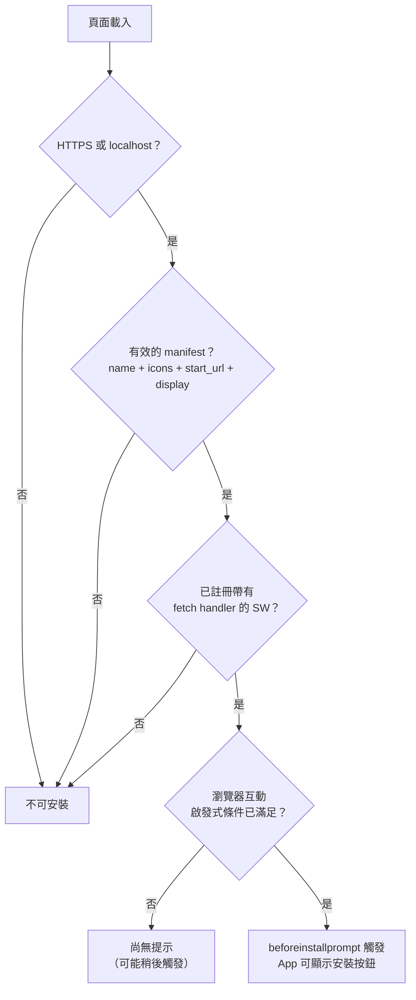

# [FEE-1301] Web App Manifest 與可安裝性

## 介紹

Web App Manifest 是一個 JSON 檔案，為瀏覽器提供將 Web 應用程式視為主機作業系統一等公民所需的一切資訊。它回答了三個問題：這個 App 叫什麼名字、外觀如何，以及啟動時應如何表現。從 HTML 文件連結的 `manifest.json` 告訴瀏覽器 App 的完整名稱、空間受限介面上使用的簡短名稱、不同尺寸的圖示、啟動時開啟的 URL，以及顯示所使用的視窗模式。沒有 manifest，瀏覽器就沒有依據來構建一致的安裝體驗 -- 沒有圖示、沒有啟動畫面、沒有獨立視窗。

可安裝性是瀏覽器代表使用者評估 manifest 是否符合一組條件的結果。瀏覽器不是單純信任 manifest 是完整的，而是驗證宣告的圖示尺寸是否存在、`start_url` 是否解析到正確的來源，以及帶有 `fetch` 事件處理器的 Service Worker 是否已註冊。當所有條件都滿足，且瀏覽器判斷使用者對網站有足夠的互動時，它會觸發 `beforeinstallprompt` 事件。這個事件是 App 符合新增至主畫面或工作列條件的訊號。應用程式程式碼可以攔截此事件、抑制瀏覽器預設的環境安裝 UI，並在上下文有意義的時刻 -- 在使用者看到 App 的價值之後，而非之前 -- 顯示自訂安裝按鈕。

這個機制的實際意義在於：安裝意圖與安裝時機是解耦的。瀏覽器決定何時 App 準備好被安裝（基於 manifest 有效性和 Service Worker 註冊）。應用程式開發者決定何時詢問使用者（基於互動程度、上下文和產品目標）。這種分離既尊重使用者的時間，也尊重瀏覽器作為品質把關者的角色。一個將核心功能鎖在安裝之後，或在第一位訪客登陸時立即顯示安裝提示的 App，是對這兩者的誤用。

## 設計思維

### Manifest 欄位及其影響

`manifest.json` 中的每個欄位都有具體的使用者可見效果，設定錯誤的後果會出現在安裝體驗中，而非 JavaScript 錯誤裡。

`name` 是作業系統安裝對話框、App 在任務切換器中的條目，以及 App 載入時顯示的啟動畫面中使用的完整應用程式名稱。`short_name` 顯示在主畫面圖示下方，空間受限 -- 實際限制約為 12 個字元，超過後作業系統會以省略號截斷。這兩個欄位不可互換；省略 `short_name` 會迫使瀏覽器以自己的方式縮寫 `name`。品牌名稱超過 12 個字元的團隊需要刻意規劃簡短名稱策略。

`start_url` 控制使用者從主畫面啟動 App 時開啟的頁面。這不一定是網站的根路徑 -- 團隊可以設定 `"start_url": "/?source=pwa"` 以在分析儀表板中區分安裝來源與一般瀏覽器訪問。關鍵限制是：無論宣告什麼 URL 作為 `start_url`，它都必須在 Service Worker 的預快取中。如果網路不可用，且 Service Worker 沒有 `start_url` 的快取回應，已安裝的 App 在啟動時會顯示離線錯誤頁面，這是 PWA 可能產生的最嚴重的體驗之一。

`display` 決定視窗外觀。`standalone` 完全移除瀏覽器 UI，使 App 在正常使用時視覺上等同於原生應用程式。`minimal-ui` 保留返回和重新整理按鈕 -- 適用於使用者可能需要在 App 沒有提供自己的返回控制時返回上一頁的 App。`fullscreen` 同時移除作業系統狀態列和瀏覽器外殼，通常用於遊戲和沉浸式媒體。`browser` 在普通瀏覽器分頁中渲染 App，這違背了安裝的目的。

`scope` 限制瀏覽器視為「在 App 內」的 URL 範圍。如果使用者導航到超出 scope 的 URL，瀏覽器會在新的瀏覽器分頁中開啟它，而不是在獨立視窗內。這個邊界對於嵌入第三方內容的 App 很重要 -- 一個連結到外部文件網站的任務管理 App 應設定狹窄的 scope，讓外部連結在瀏覽器中開啟，而不是將使用者拉出 App 的獨立上下文。團隊 MUST 將 `scope` 設定為至少 `"/"` （或涵蓋所有 App 路由的更具體路徑）；如果 `scope` 被省略或設定得太窄，落在其範圍外的導航將會跳出獨立視窗並在系統瀏覽器中開啟，這會讓使用者感到困惑，並破壞已安裝 App 的體驗。

### 圖示與 maskable 安全區域

圖示要求比單張兩種尺寸的圖片更複雜。Android 和部分桌面環境將 App 圖示裁切為圓形或圓角方形（squircle）。未為此設計的標準圖示會被裁掉角落，可能切掉放置在邊緣附近的商標或文字。Maskable 圖示透過要求所有有意義的內容保持在圖片內側 80% -- 即「安全區域」-- 並允許外側 20% 填充可以安全裁切的背景色來解決這個問題。manifest 中的圖示條目必須包含 `"purpose": "maskable"` 來向瀏覽器發出訊號。

實際上，團隊應提供至少四個圖示條目：192x192 和 512x512 的標準圖示（帶有 `"purpose": "any"`）以及 192x192 和 512x512 的 maskable 圖示。maskable 變體可以在發布前在 [maskable.app](https://maskable.app) 測試。在單一圖示條目中將兩個目的合併為 `"purpose": "any maskable"` 在技術上是有效的，但不推薦 -- 瀏覽器可能在不裁切圖示的介面上使用 maskable 版本，顯示標誌周圍的額外內距為可見的空白。

### `beforeinstallprompt` 模式

`beforeinstallprompt` 事件在基於 Chromium 的瀏覽器中，當所有可安裝性條件都滿足且瀏覽器的互動啟發式條件也滿足時觸發。自 Chrome 116 起，沒有最低訪問次數要求 -- 瀏覽器只需要 HTTPS、帶有 `name`、`icons`、`start_url` 和非 `browser` 的 `display` 的有效 manifest，以及帶有 `fetch` 事件處理器的已註冊 Service Worker。如果所有條件都已滿足，事件會在當前頁面載入時觸發。

標準模式是：監聽事件、立即呼叫 `event.preventDefault()` 來抑制瀏覽器的環境安裝 UI（網址列 chip 或底部表單）、將事件參考儲存在元件狀態中，並且只在儲存的事件非 null 時渲染自訂安裝按鈕。當使用者點擊按鈕時，呼叫 `savedEvent.prompt()` 觸發瀏覽器的原生安裝對話框，然後等待 `savedEvent.userChoice` 來得知使用者是否接受或拒絕。如果使用者接受，清除儲存的事件讓按鈕消失。如果使用者拒絕，事件參考可以保留並在稍後再次顯示按鈕，或在本次工作階段的剩餘時間中隱藏。

這個模式讓團隊控制安裝詢問出現的時機。最佳實踐是等到使用者在 App 中完成至少一個有意義的操作 -- 建立任務、儲存文件、完成工作流程 -- 再顯示安裝按鈕。看到了價值的使用者比第一次訪客接受率高得多。

### 決策表 -- 我的 App 是否應該支援安裝？

並非每個 Web 屬性都能從安裝中受益。安裝提示本身就是一個摩擦點，對於使用者不會再次訪問的 App 顯示它對任何人都沒有好處。

| 情境 | 建議 |
|------|------|
| 任務型 App，使用者定期回訪（電子郵件、筆記、待辦事項、專案管理） | 是 -- 安裝帶來實際價值；主畫面捷徑和離線存取改善日常使用 |
| 漸進式內容網站（部落格、文件、新聞） | 可選 -- 新增 manifest 以提高可發現性；跳過自訂安裝提示 |
| 電商結帳流程 | 否 -- 網址列是信任訊號；在 standalone 模式中移除它會增加購物車放棄率 |
| 由已知使用者存取的企業內部工具 | 是 -- 可安裝性簡化了分發，並在不經過應用商店的情況下創造原生感的 UX |
| 單次使用工具（稅務計算機、一次性表單） | 否 -- 使用者不會再回來；安裝提示為零利益創造摩擦 |

## 最佳實踐

**必須（MUST）在每個 HTML 頁面連結 manifest 和 theme-color。** 團隊必須（MUST）在 App 每個頁面的 `<head>` 中包含 `<link rel="manifest" href="/manifest.json" />` 和 `<meta name="theme-color" content="#3b82f6" />`，而不只是根頁面。瀏覽器在每次頁面載入時評估可安裝性條件；在某些頁面缺少 manifest 會導致從深層連結進入 App 的使用者出現不一致的行為。

**應該（SHOULD）在 `start_url` 中使用 `/?source=pwa` 進行分析歸因。** 查詢參數被 App 的路由邏輯忽略，但被分析工具作為不同的流量來源捕獲。團隊應該（SHOULD）使用這個模式來測量已安裝使用者從主畫面開啟 App 的頻率與從瀏覽器開啟的頻率，以及已安裝使用者是否比瀏覽器使用者有不同的留存率或轉化率。

**禁止（MUST NOT）在第一次頁面載入時顯示安裝提示。** 可安裝性禁止（MUST NOT）被用來限制核心功能；拒絕安裝或瀏覽器不支援安裝的使用者必須（MUST）獲得完整可用的 Web 體驗。等到使用者完成一個表示意圖的操作 -- 儲存文件、新增任務、登入 -- 再顯示安裝按鈕。

**必須（MUST）在發布前提供分開的 maskable 圖示條目。** 團隊必須（MUST）分別在 192×192 和 512×512 像素提供 `"purpose": "any"` 和 `"purpose": "maskable"` 條目。使用 maskable.app 驗證 maskable 變體裁切為圓形時看起來正確，並確認沒有有意義的內容落在圖示外側 20% 的區域。

**必須（MUST）在上線前使用 Lighthouse 驗證 manifest。** 團隊必須（MUST）針對正式建置版本執行 Lighthouse 的 PWA 稽核，以檢查 manifest 完整性、圖示可用性、`start_url` 可達性和 Service Worker 註冊。在 CI 或 Chrome DevTools 中執行稽核，在發布前發現否則會阻止 `beforeinstallprompt` 觸發的問題。`display` 欄位禁止（MUST NOT）設為 `"browser"` -- 這樣做會明確退出 standalone 模式，並在基於 Chromium 的瀏覽器中抑制 `beforeinstallprompt`。

**應該（SHOULD）處理 `appinstalled` 事件以更新 UI 狀態。** 使用者接受安裝提示後，瀏覽器會在 `window` 上觸發 `appinstalled`。團隊應該（SHOULD）監聽此事件以隱藏安裝按鈕，並可選地顯示確認訊息，確保按鈕在 App 已在主畫面上之後不會繼續顯示在 UI 中。

## 圖解

以下圖解顯示瀏覽器的可安裝性檢查序列。每個節點代表瀏覽器評估的一個條件；任何單一條件失敗都會阻止 `beforeinstallprompt` 在當前頁面載入時觸發。



互動啟發式條件節點反映出，即使是完全有效的 manifest 和已註冊的 Service Worker 也不能保證立即出現提示。如果使用者是第一次導航到網站，Chrome 可能會延遲事件。一旦事件觸發，應用程式就控制著何時實際顯示原生安裝對話框。另外值得注意的是，`beforeinstallprompt` 不會在同一次頁面工作階段中自動再次觸發：如果使用者關閉了原生安裝對話框而未接受，事件不會在當前頁面再次觸發。應用程式必須等到下一次完整的頁面載入 -- 也就是新的導航 -- 瀏覽器才會再次考慮觸發它。

## 範例

以下範例顯示完整的 `manifest.json`、所需的 HTML `<head>` 標籤，以及實作延遲 `beforeinstallprompt` 模式的 React 元件。

### public/manifest.json

```json
{
  "name": "Acme Task Manager",
  "short_name": "Acme Tasks",
  "description": "Manage your tasks offline-first",
  "start_url": "/?source=pwa",
  "display": "standalone",
  "background_color": "#ffffff",
  "theme_color": "#3b82f6",
  "scope": "/",
  "icons": [
    {
      "src": "/icons/icon-192.png",
      "sizes": "192x192",
      "type": "image/png",
      "purpose": "any"
    },
    {
      "src": "/icons/icon-192-maskable.png",
      "sizes": "192x192",
      "type": "image/png",
      "purpose": "maskable"
    },
    {
      "src": "/icons/icon-512.png",
      "sizes": "512x512",
      "type": "image/png",
      "purpose": "any"
    },
    {
      "src": "/icons/icon-512-maskable.png",
      "sizes": "512x512",
      "type": "image/png",
      "purpose": "maskable"
    }
  ],
  "shortcuts": [
    {
      "name": "New Task",
      "url": "/tasks/new",
      "icons": [
        { "src": "/icons/shortcut-add.png", "sizes": "96x96" }
      ]
    }
  ]
}
```

### HTML head 標籤

```html
<head>
  <meta charset="UTF-8" />
  <meta name="viewport" content="width=device-width, initial-scale=1.0" />
  <title>Acme Task Manager</title>

  <!-- PWA manifest -->
  <link rel="manifest" href="/manifest.json" />

  <!-- 瀏覽器工具列和 Android 狀態列的主題色 -->
  <meta name="theme-color" content="#3b82f6" />

  <!-- iOS 後備：Safari 不從 manifest 讀取 theme_color -->
  <meta name="apple-mobile-web-app-capable" content="yes" />
  <meta name="apple-mobile-web-app-status-bar-style" content="default" />
  <meta name="apple-mobile-web-app-title" content="Acme Tasks" />
  <link rel="apple-touch-icon" href="/icons/icon-192.png" />
</head>
```

### src/components/InstallButton.tsx

```tsx
import { useEffect, useState } from 'react';

interface BeforeInstallPromptEvent extends Event {
  prompt(): Promise<void>;
  userChoice: Promise<{ outcome: 'accepted' | 'dismissed' }>;
}

export function InstallButton() {
  const [installEvent, setInstallEvent] =
    useState<BeforeInstallPromptEvent | null>(null);
  const [installed, setInstalled] = useState(false);

  useEffect(() => {
    const onBeforeInstall = (e: Event) => {
      // 抑制瀏覽器的環境安裝 UI（網址列 chip / 底部表單）
      e.preventDefault();
      setInstallEvent(e as BeforeInstallPromptEvent);
    };

    const onInstalled = () => {
      setInstalled(true);
      setInstallEvent(null);
    };

    window.addEventListener('beforeinstallprompt', onBeforeInstall);
    window.addEventListener('appinstalled', onInstalled);

    return () => {
      window.removeEventListener('beforeinstallprompt', onBeforeInstall);
      window.removeEventListener('appinstalled', onInstalled);
    };
  }, []);

  // 如果已安裝或瀏覽器尚未觸發 beforeinstallprompt，則隱藏
  if (installed || !installEvent) return null;

  async function handleInstall() {
    if (!installEvent) return;

    // 顯示瀏覽器的原生安裝對話框
    await installEvent.prompt();

    const { outcome } = await installEvent.userChoice;

    if (outcome === 'accepted') {
      // 清除儲存的事件讓按鈕消失
      setInstallEvent(null);
    }
    // 如果拒絕，保留 installEvent 讓按鈕仍然可用
  }

  return (
    <button
      onClick={handleInstall}
      className="px-4 py-2 bg-blue-600 text-white rounded-md hover:bg-blue-700"
    >
      安裝 App
    </button>
  );
}
```

元件在 `beforeinstallprompt` 觸發之前不渲染任何內容，這意味著它可以安全地包含在 App Shell 中，在呼叫位置不需要任何載入狀態或條件渲染。將此按鈕放置在持久性 UI 元素中 -- 導航列、設定頁面或引導流程 -- 使它能在正確時機出現，無需任何額外的路由邏輯。

### Service Worker 預快取要求

為了讓安裝體驗在離線時正確工作，Service Worker 必須快取 `start_url`。一個滿足可安裝性條件的最小 Service Worker 如下所示：

```js
// public/sw.js
const CACHE_NAME = 'acme-v1';
const PRECACHE_URLS = ['/', '/?source=pwa', '/index.html'];

self.addEventListener('install', (event) => {
  event.waitUntil(
    caches.open(CACHE_NAME).then((cache) => cache.addAll(PRECACHE_URLS))
  );
});

self.addEventListener('fetch', (event) => {
  event.respondWith(
    caches.match(event.request).then(
      (cached) => cached ?? fetch(event.request)
    )
  );
});
```

即使快取邏輯很簡單，`fetch` 處理器對於可安裝性條件也是必需的。沒有它，無論 manifest 多麼完整，瀏覽器都不會觸發 `beforeinstallprompt`。

正式上線的專案 SHOULD 使用 Workbox（詳見 FEE-1304）而非手動撰寫這個 `fetch` 處理器。Workbox 的 `precacheAndRoute` 能正確處理快取版本控制、舊條目清理和導航備援 -- 這些都是簡單的手寫處理器會遺漏的邊界情境。上述範例在開發環境中足以滿足可安裝性條件，但並不適合直接用於正式環境。特別是這個最小化處理器沒有快取清除邏輯：如果資源在部署之間發生變更，舊版本會無限期保留在快取中，直到使用者清除網站資料為止。Workbox 透過在建置時產生的版本雜湊 manifest 解決了這個問題，使它成為任何面向真實使用者的 App 的正確選擇。

## 常見錯誤

**`start_url` 未被 Service Worker 快取。** 這是最嚴重的設定錯誤。App 成功安裝，出現在主畫面，然後使用者在離線時開啟它卻載入失敗。修復方法是在 `install` 事件期間將 `start_url`（以及任何查詢字串變體，如 `/?source=pwa`）新增到 Service Worker 的預快取列表中。

## 相關 FEE

- [FEE-1300：Progressive Web Apps 與離線功能概覽](./1300.md) -- 類別概覽，涵蓋 manifest 如何融入更廣泛的 PWA 架構
- [FEE-1302：Service Worker](./1302.md) -- 可安裝性條件所需的 Service Worker 生命週期與 `fetch` 處理器
- [FEE-1307：PWA 上線實務](./1307.md) -- 在部署前後驗證 manifest 完整性和圖示正確性的 Lighthouse 稽核

## 參考資料

- [MDN：Web app manifests](https://developer.mozilla.org/zh-TW/docs/Web/Manifest)
- [Chrome Developers：Add a web app manifest](https://web.dev/articles/add-manifest)
- [Chrome Developers：How Chrome determines installability](https://web.dev/articles/install-criteria)
- [maskable.app](https://maskable.app) -- 測試 maskable 圖示安全區域的互動工具
- [MDN：BeforeInstallPromptEvent](https://developer.mozilla.org/en-US/docs/Web/API/BeforeInstallPromptEvent)
- [web.dev：Patterns for promoting PWA installation](https://web.dev/articles/promote-install) -- 關於何時以及如何顯示安裝提示而不影響使用者操作流程的 UX 指南
- [W3C Web App Manifest 規範](https://www.w3.org/TR/appmanifest/) -- 所有 manifest 成員定義和處理規則的權威參考
- [Chrome Developers：Define your app's scope](https://web.dev/articles/add-manifest#scope) -- 說明 `scope`、`start_url` 與超出範圍導航行為之間的關係

