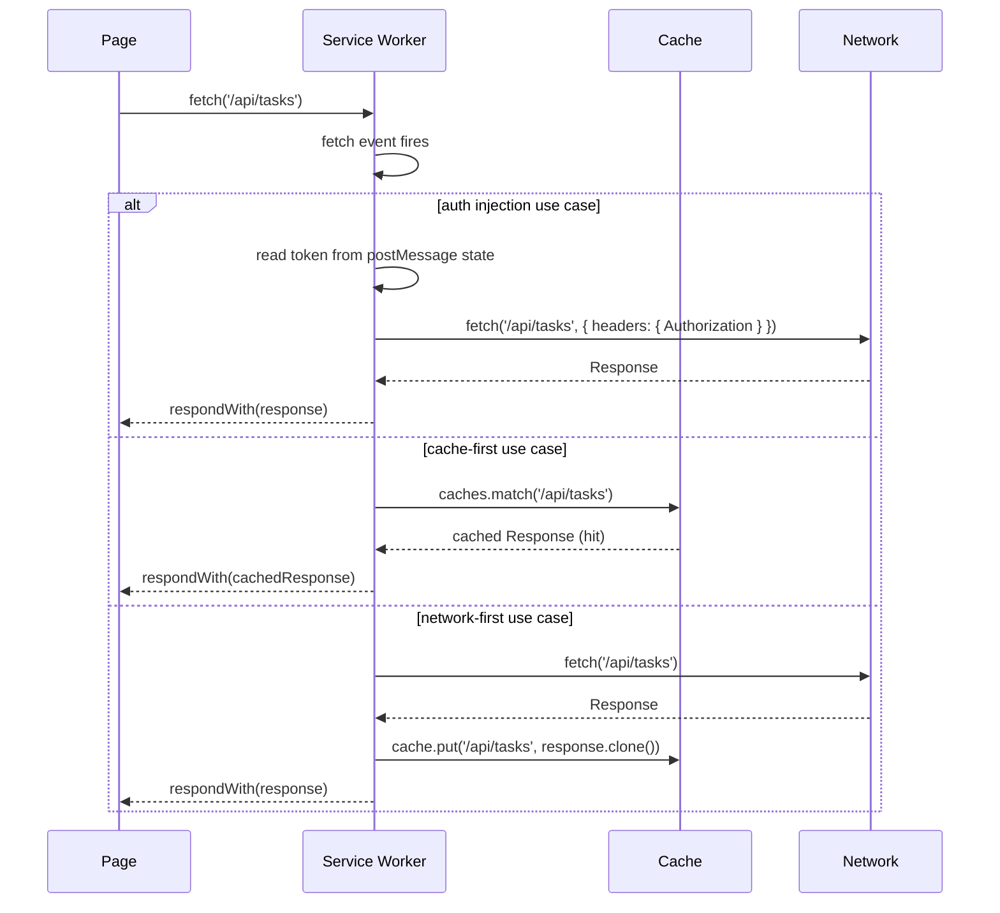

# [FEE-1302] Service Worker

## 介紹

Service Worker 是瀏覽器在與頁面分離的獨立執行緒中執行的 JavaScript 檔案，無法存取 DOM，也沒有與特定分頁的直接連結。它位於頁面與網路之間：頁面發出的每個 `fetch` 請求在到達網路之前，都會先通過 Service Worker 的 `fetch` 事件處理器，由 Service Worker 決定要回傳什麼回應。這個架構使 Service Worker 成為瀏覽器中最強大的擴充點，能夠介入所有涉及網路層的操作。

常見的心智模型 -- 認為 Service Worker 是快取層 -- 低估了這個 API 的能力。快取是 `fetch` 處理器內的一種有效策略，但它不是 Service Worker 存在的原因。Service Worker 是在瀏覽器內部執行的通用網路代理。它可以為每個送出的請求注入標頭、對相同端點的並發呼叫進行去重、攔截請求並回傳由測試資料建立的合成回應、批次處理遙測事件直到可靠的發送視窗開啟，或根據功能旗標將流量路由到不同的後端。這些全都不需要 PWA 或離線需求 -- 只需要一個已註冊的 Service Worker。

將 Service Worker 理解為中介層（middleware）而非快取，改變了團隊評估何時使用它的方式。問題不是「這個 App 需要離線支援嗎？」，而是「我是否需要在網路層對這個來源（origin）的所有請求套用某些行為，包括由我無法控制的程式碼發出的請求？」當答案是肯定的，Service Worker 通常是正確的工具。本文深入介紹 Service Worker 的生命週期，列出非 PWA 使用情境的具體實作模式，並比較 Service Worker 與團隊常用的替代方案。

Service Worker 需要安全上下文（HTTPS 或 localhost）並以 origin 為範疇。它們在不同 origin 的 iframe 中不可用，也無法攔截發往不同 origin 的請求 -- `app.example.com` 上的 Service Worker 無法攔截發往 `api.example.com` 的 fetch，但如果路由被代理到 `app.example.com/api/`，則可以攔截。這個 origin 邊界是安全屬性，而非可透過設定繞過的限制。現代瀏覽器的支援已相當廣泛：Chrome、Edge、Firefox 和 Safari（15.4 起）均實作了完整的生命週期，但 Background Sync 和 Push 等特定 API 的支援範圍較核心的 fetch 攔截能力更為有限。

## 原則

Service Worker 是網路代理，團隊 MUST 將其視為中介層：快取行為是 `fetch` 處理器邏輯的結果，而不是註冊 Service Worker 的目的。當 Service Worker 的預期目標是支援可安裝性時，團隊 MUST 一併註冊 `fetch` 事件處理器 -- Chrome 需要 `fetch` 處理器才能觸發 `beforeinstallprompt` 事件。沒有 `fetch` 處理器的 Service Worker 既無法滿足可安裝性條件，也無法達成任何有意義的網路攔截目的，SHOULD NOT 被部署。

當 `install` 和 `activate` 事件處理器執行非同步工作時，團隊 MUST 在兩者中都呼叫 `event.waitUntil()`。若未呼叫 `waitUntil`，瀏覽器可能在 promise 解析前終止 Service Worker 執行緒，導致快取寫入或清理操作在執行途中被靜默中斷。當需要新 Service Worker 立即接管現有開啟分頁（而非等待下次導航）時，團隊 SHOULD 在 `activate` 處理器中呼叫 `self.clients.claim()`。

## 設計思維

### Service Worker 的生命週期

Service Worker 從首次註冊到完全控制頁面的網路請求，會經歷四個階段。理解每個階段是撰寫在首次安裝、跨版本更新及多分頁情境下行為正確的處理器的前提。

**`register()`** 透過頁面 JavaScript 的 `navigator.serviceWorker.register('/sw.js')` 呼叫。這個呼叫是冪等的：如果已有相同 scope 且相同位元組內容的 Service Worker 被註冊並啟用，瀏覽器不做任何事。該方法回傳一個 `ServiceWorkerRegistration` promise，在瀏覽器確認檔案後解析。scope 預設為包含 `sw.js` 的目錄 -- 位於 `/sw.js` 的檔案涵蓋整個 origin，而位於 `/app/sw.js` 的檔案只涵蓋 `/app/` 下的路徑。將 Service Worker 檔案放在根目錄是最常見且最不容易出錯的做法。

**`install` 事件** 在每個 Service Worker 版本中只觸發一次，即瀏覽器首次遇到新的或變更過的 `sw.js` 檔案時（與已啟用版本逐位元組比較）。這是預先快取應用程式外殼（app shell）的正確位置 -- 即 App 離線時首次渲染所需的資源集合。處理器 MUST 以 `event.waitUntil(promise)` 呼叫一個在所有非同步工作完成後才解析的 promise。如果省略 `waitUntil`，瀏覽器可能在 `caches.addAll()` 完成寫入前終止 Service Worker 執行緒，導致快取處於不完整狀態。

**`activate` 事件** 在舊 Service Worker 停用、新版本準備接管後觸發。從 `install` 完成到 `activate` 觸發之間的間隔可能很長：新 Service Worker 會保持「等待中」狀態，直到所有使用舊 Service Worker 的分頁都關閉為止。這是瀏覽器確保單次頁面載入完全由單一 Service Worker 版本服務的機制。`activate` 處理器是刪除屬於舊版本的快取的正確位置。在 `install` 處理器中呼叫 `self.skipWaiting()` 可以繞過等待期，使新 Service Worker 立即啟用，這在開發時很有用，但在生產環境需要謹慎使用，因為不同分頁中的頁面可能短暫地被不同版本的 Service Worker 控制。

**`fetch` 事件** 在頁面發出的每個網路請求時觸發 -- `fetch()` 呼叫、圖片載入、腳本載入、樣式表載入，以及導航請求。處理器接收一個 `FetchEvent`，其 `respondWith(responsePromise)` 方法允許 Service Worker 提供回應。如果未呼叫 `respondWith`，請求會和沒有 Service Worker 時一樣正常送往網路。`fetch` 處理器就是中介層。Service Worker 在實務中所做的一切 -- 快取查找、標頭注入、請求去重、模擬回應 -- 都在這裡發生。

### 更新流程

當瀏覽器偵測到 `sw.js` 已變更（下載的檔案與已安裝版本的逐位元組比較），它會在舊版本旁邊安裝新的 Service Worker。新版本完成 `install` 處理器後進入等待狀態。在舊 Service Worker 控制的每個分頁都關閉或導航離開之前，新版本不會啟用，因此也不會攔截任何 fetch 請求。這就是為什麼 Service Worker 更新在長時間運行的工作階段中看似沒有效果：新程式碼已安裝但在等待中。

開發團隊常將此視為除錯難題：他們更新 `sw.js`，重新載入頁面，卻發現變更沒有生效，因為前一個 Service Worker 仍在背景分頁中活躍。Chrome DevTools 的 Application 面板顯示等待中的 worker，並提供開發用的「skipWaiting」按鈕。在生產環境，提供一個呼叫 `registration.waiting.postMessage({ type: 'SKIP_WAITING' })` 的 UI 元素，讓使用者可以選擇接受更新，而無需關閉所有分頁。

### Service Worker 作為通用瀏覽器中介層

以下五個使用情境說明了 Service Worker 在 PWA 快取之外能解決的問題範疇。每個情境都代表攔截發生在網路層而非應用程式程式碼的情況 -- 這正是使 Service Worker 成為正確工具的關鍵區別。

| 使用情境 | 實作方式 | 何時優先於替代方案 |
|---------|---------|-----------------|
| Auth token 注入 | 在處理器中攔截所有 API `fetch` 請求，從透過 `postMessage` 設定的 SW 狀態中讀取 token，並加入 `Authorization: Bearer <token>` 標頭 | 當 token 必須套用到來自第三方腳本、iframe 或無法修改為使用 axios interceptor 的 worker 的請求時 |
| 請求去重 | 維護一個儲存進行中請求 URL 的 `Map<string, Promise<Response>>`；若重複的 URL 到達，回傳現有的 promise | 高流量儀表板，10+ 個元件在掛載時各自獨立 fetch 相同的 `/api/user` 端點 |
| Mock Service Worker (MSW) | SW 攔截請求，並從測試或開發程式碼中定義的處理器 registry 回傳 mock 資料 | 需要真實 API 回應而無需真實伺服器的瀏覽器端元件測試和整合測試 |
| Analytics 批次處理 | 在 SW 中將遙測事件排入佇列；透過 `sync` 事件或 `visibilitychange` 沖刷佇列 | 當使用者在 analytics payload 發送前於工作階段中途關閉頁面時，確保可靠的事件傳遞 |
| A/B 測試中介層 | 從 SW 狀態讀取實驗旗標；根據旗標將 fetch 路由到不同的後端 URL | 適用於來自整個 origin 的所有請求的實驗，包括第三方 tag manager 腳本 |

Auth token 注入的情境值得深入探討，因為它揭示了應用程式層解決方案的不足之處。axios interceptor 適用於通過該 axios 實例發出的所有呼叫，但它無法攔截第三方 analytics SDK 發出的 fetch 呼叫、tag manager、來自相關子網域的嵌入 iframe，或並非使用相同 axios 實例撰寫的 Web Worker。Service Worker 攔截來自 origin 的所有請求，無論是由什麼發出的。

MSW 特別值得關注，因為它常被誤解為在模組層級進行 mock 的工具（如 Jest 的 `jest.mock()`）。在瀏覽器模式下，MSW 會註冊一個真實的 Service Worker。Service Worker 攔截真實的 `fetch` 請求，並回傳由測試或開發設定中定義的處理器函式建立的回應。這意味著瀏覽器端測試可以執行真實的 HTTP 客戶端程式碼，包括重試邏輯、錯誤處理和請求序列化，而無需發出真實的網路呼叫。MSW 文件明確確認這一點：瀏覽器整合是一個真正的 Service Worker，而非 monkey-patch。

### 決策：Service Worker vs. HTTP Interceptor vs. API Proxy

了解何時使用各種工具，可以避免過度設計，以及在專案進行到一半時更改架構層的痛苦。

| 維度 | Service Worker | HTTP Interceptor | API Proxy |
|------|---------------|-----------------|-----------|
| 攔截範圍 | 來自 origin 的所有請求，包括第三方腳本與 iframe | 僅限透過被攔截客戶端發出的請求 | 伺服器端的所有請求 |
| 持續性 | 跨頁面載入持續存在；無需重新註冊 | 每次頁面載入都必須重新套用 | 始終在伺服器上運行 |
| 第三方覆蓋 | 是 — 可攔截 analytics、廣告及其他網域的腳本 | 否 — 僅涵蓋已設定的客戶端 | 不適用（伺服器端） |
| 存取密鑰 | 否 — 不可將 token 或金鑰放入 SW；透過 postMessage 通訊 | 是 — 僅限客戶端，並非真正保密 | 是 — 伺服器環境變數 |
| 需要 HTTPS | 是（localhost 除外） | 否 | 否（但伺服器本身須加密） |
| 最適合 | 來自你無法控制的程式碼的請求；必須在頁面重新載入後持續存在的行為 | 為自己的 fetch/axios 呼叫加入標頭或紀錄 | 需要伺服器上下文的邏輯（驗證、資料庫存取） |

指導原則：當你需要攔截來自你無法控制的程式碼的請求，或當行為必須在頁面重新載入後無需重新初始化地持續存在時，請使用 Service Worker。

### 作用範圍與註冊路徑

Service Worker 的 scope 由其腳本 URL 的路徑決定，而非任何參數。位於 `/sw.js` 的 Service Worker 控制整個 origin。位於 `/app/sw.js` 的 Service Worker 只控制路徑以 `/app/` 開頭的 URL。當單一 origin 承載多個不同的應用程式時，這一點非常重要 -- 例如 `/` 上的公開行銷網站與 `/app/` 上的驗證應用程式。在 `/app/sw.js` 註冊 Service Worker 意味著行銷頁面永遠不會被 SW 的 `fetch` 處理器觸及，避免了區分應用程式請求與行銷頁面請求的路由邏輯複雜性。

路徑限制也意味著 Service Worker 檔案不能從低於其預期控制範疇的子目錄提供。位於 `/assets/sw.js` 的檔案無法控制 `/` -- 它只能控制 `/assets/`。使用打包工具並將所有輸出放在 `assets/` 目錄的團隊，必須設定建置工具在根目錄輸出 `sw.js`，或在 `register()` 中使用 `{ scope: '/' }` 選項明確設定更寬廣的 scope，這需要伺服器在 worker 檔案上傳送 `Service-Worker-Allowed: /` 回應標頭。

### 頁面與 Service Worker 之間的通訊

Service Worker 執行緒與頁面執行緒沒有共享記憶體。所有通訊都是非同步且基於訊息的。頁面使用 `navigator.serviceWorker.controller.postMessage(data)` 向活躍的 Service Worker 發送訊息。Service Worker 使用 `client.postMessage(data)` 向受控客戶端發送訊息，其中客戶端參考透過 `self.clients.get(clientId)` 或 `self.clients.matchAll()` 取得。

常見的模式是建立在 `MessageChannel` 之上的請求-回應通道。頁面建立一個 `new MessageChannel()`，在 `postMessage` 呼叫中將 `port2` 發送給 Service Worker，並在 `port1` 上監聽回應。Service Worker 從 `event.ports[0]` 接收 `port2` 並用它發送回應。這避免了在 `navigator.serviceWorker` 上處理所有 Service Worker 訊息的笨拙全域 `message` 事件。對於大多數應用程式而言，頁面到 SW 的單向訊息（用於設定 auth token 等狀態）和 SW 到所有客戶端的單向廣播（用於宣告更新），已能涵蓋大部分真實的通訊需求。

## 最佳實踐

**必須（MUST）在註冊前檢查 Service Worker 是否受支援。** 團隊必須（MUST）使用 `'serviceWorker' in navigator` 進行防衛性檢查，以防止在不支援此 API 的環境中出現執行時期錯誤，包括某些較舊的瀏覽器和非安全上下文。在 `window.addEventListener('load', ...)` 回呼中進行註冊，確保 SW 的註冊請求不會與頁面在初始載入期間的關鍵資源競爭。

**應該（SHOULD）保持 Service Worker 檔案精簡，透過 `importScripts()` 或動態 import 引入大型邏輯。** Service Worker 檔案在瀏覽器每次檢查更新時都會被解析和評估，大型檔案會增加更新檢查的開銷。團隊應該（SHOULD）將大型處理器 registry、fixture 資料或複雜的路由表移至獨立模組，讓主檔案保持為薄薄的入口點。

**必須（MUST）在 `install` 和 `activate` 處理器中對每個非同步操作呼叫 `event.waitUntil()`。** 沒有 `waitUntil`，瀏覽器可能在非同步工作完成前終止 Service Worker 執行緒。團隊必須（MUST）使用 `Promise.all()` 將多個並發非同步操作包裝成傳給 `waitUntil` 的單一 promise。

**必須（MUST）明確為快取名稱加入版本號，並在 `activate` 處理器中刪除舊快取。** 從不清理舊快取的 Service Worker 會在各版本部署間積累過期條目。團隊必須（MUST）在檔案頂部定義 `const CACHE_NAME = 'app-v1'`，並在 `activate` 處理器中刪除所有名稱不匹配的快取，當預快取資源列表變更時遞增版本字串。

**應該（SHOULD）當需要立即控制時，在 `activate` 中使用 `self.clients.claim()`。** 沒有 `clients.claim()`，新啟用的 Service Worker 只控制在啟用後導航的頁面。當新 Service Worker 必須（MUST）立即接管所有開啟分頁而非等待下次導航時，團隊應該（SHOULD）呼叫 `clients.claim()`。

**必須（MUST）透過 `postMessage` 傳送 auth token，而非寫入 SW 檔案本身。** Service Worker 檔案不是存放密鑰的安全位置。團隊必須（MUST）使用 `navigator.serviceWorker.controller.postMessage({ type: 'SET_AUTH_TOKEN', token })` 從頁面傳送 token 給 Service Worker，並將其儲存在 SW scope 中的變數裡，因為 token 不會在 SW 重啟後持續存在，每次頁面載入都需重新傳送。

**必須（MUST）在 fetch 處理器中謹慎根據請求 URL 和方法進行防衛性檢查。** 無條件攔截所有請求的 fetch 處理器會捕獲導航請求、跨來源請求和瀏覽器內部請求。團隊必須（MUST）在決定是否以修改過的請求回應前，先測試 `event.request.mode`、`event.request.method` 和 `new URL(event.request.url).origin`，以確保只影響同源請求。

**應該（SHOULD）刻意測試 Service Worker 更新流程，而非只測試正常路徑。** 大多數 SW 錯誤不在初始安裝時浮現，而是在更新週期中出現。團隊應該（SHOULD）撰寫明確的測試情境：在一個分頁開啟 App、部署新 SW、開啟第二個分頁，並驗證兩個分頁的行為正確，Chrome DevTools Application 面板的「等待中」指示是可觀察的訊號。

**不應該（SHOULD NOT）在生產環境中沒有使用者觸發就呼叫 `skipWaiting()`。** 在 `install` 處理器中無條件呼叫 `skipWaiting()` 會導致新 Service Worker 在舊版控制的分頁仍然開啟時啟用。團隊應該（SHOULD）改為透過 `registration.waiting` 提供「重新載入以更新」的提示，因為不相容的新快取策略可能在使用者不知情的情況下導致工作階段中途出現破損狀態。

## 圖解

以下循序圖說明 `fetch` 處理器針對三個代表性使用情境的決策邏輯：auth 注入、快取優先（cache-first）和網路優先（network-first）。在每個情境中，頁面的 `fetch()` 呼叫是觸發點，`respondWith()` 是 Service Worker 確定其回應的地方。圖解中各分支使用相同的 `/api/tasks` 端點，以便直接比較各策略的分支邏輯。在生產環境的 `fetch` 處理器中，策略選擇通常基於請求的 URL 模式或請求的 `destination` 屬性，而非全域的 `alt` 分支。



`alt` 分支對每個請求是互斥的：`fetch` 處理器評估條件後只呼叫一次 `respondWith`。為了可讀性，圖解省略了 cache-first 策略的快取未命中路徑 -- 完整實作在下方的範例章節中正確處理。

## 範例

以下兩個 Service Worker 檔案均完整且可獨立部署。第一個實作標準的 PWA cache-then-network 模式，第二個為非 PWA 情境實作 auth token 注入。兩者之後是屬於頁面進入點的註冊程式碼。

### public/sw.js -- 範例一：cache-then-network（PWA 模式）

```js
// public/sw.js — 範例一：cache-then-network（標準 PWA 模式）

const CACHE_NAME = 'app-v1';
const PRECACHE_URLS = ['/', '/offline.html', '/app.css'];

self.addEventListener('install', (event) => {
  event.waitUntil(
    caches.open(CACHE_NAME).then((cache) => cache.addAll(PRECACHE_URLS))
  );
});

self.addEventListener('activate', (event) => {
  event.waitUntil(
    caches.keys().then((keys) =>
      Promise.all(keys.filter((k) => k !== CACHE_NAME).map((k) => caches.delete(k)))
    )
  );
  self.clients.claim();
});

self.addEventListener('fetch', (event) => {
  if (event.request.method !== 'GET') return;
  event.respondWith(
    caches.match(event.request).then((cached) => {
      if (cached) return cached;
      return fetch(event.request).then((response) => {
        const clone = response.clone();
        caches.open(CACHE_NAME).then((cache) => cache.put(event.request, clone));
        return response;
      });
    })
  );
});
```

`install` 處理器相對於 Service Worker 的存活期間同步地快取應用程式外殼：`waitUntil` 確保瀏覽器在所有 URL 都被快取之前保持 SW 執行緒存活。`activate` 處理器刪除所有名稱不是 `CACHE_NAME` 的快取，移除所有前版本 Service Worker 寫入的條目。`self.clients.claim()` 使新啟用的 Service Worker 接管在 Service Worker 安裝時開啟的所有分頁。

`fetch` 處理器先檢查快取。命中時立即回傳快取的回應，不接觸網路。未命中時從網路 fetch，複製回應（`Response` 的 body 只能被消費一次），快取副本，並回傳原始的回應。`method !== 'GET'` 的過濾器防止處理器嘗試快取 POST、PUT 或 DELETE 請求，Cache API 不支援這些。

### public/sw-auth.js -- 範例二：auth token 注入（非 PWA 使用情境）

```js
// public/sw-auth.js — 範例二：auth token 注入（非 PWA 使用情境）

let authToken = null;

self.addEventListener('message', (event) => {
  if (event.data?.type === 'SET_AUTH_TOKEN') {
    authToken = event.data.token;
  }
});

self.addEventListener('fetch', (event) => {
  const url = new URL(event.request.url);
  if (url.origin !== 'https://api.acme.com') return;
  if (!authToken) return;

  const modifiedRequest = new Request(event.request, {
    headers: {
      ...Object.fromEntries(event.request.headers.entries()),
      Authorization: `Bearer ${authToken}`,
    },
  });
  event.respondWith(fetch(modifiedRequest));
});
```

這個 Service Worker 沒有 `install` 或 `activate` 處理器，因為它不維護快取。它唯一的工作是將 `Authorization` 標頭注入到所有傳送至 `https://api.acme.com` 的 fetch 請求中，無論是 origin 上的哪個腳本或 worker 發出的請求。`origin` 過濾器防止處理器觸及對其他網域（如 CDN 資源或 analytics 端點）的請求。

`authToken` 變數是 Service Worker 執行緒中的記憶體內狀態。它不會持續存在：如果瀏覽器終止 Service Worker（在頁面閒置時會發生），token 就會消失，必須重新傳送。頁面在每次頁面載入時發送一個新的 `SET_AUTH_TOKEN` 訊息來處理這種情況。

### src/main.ts -- 註冊

```js
// src/main.ts
if ('serviceWorker' in navigator) {
  navigator.serviceWorker.register('/sw.js').then((registration) => {
    console.log('SW registered, scope:', registration.scope);
  });
}
```

對於 auth 注入的 Service Worker，在註冊後加入 token 傳送：

```js
// src/main.ts（auth SW 變體）
if ('serviceWorker' in navigator) {
  navigator.serviceWorker.register('/sw-auth.js').then(() => {
    // 等待 SW 啟用後再傳送 token
    const sw = navigator.serviceWorker.controller;
    if (sw) {
      sw.postMessage({ type: 'SET_AUTH_TOKEN', token: getAuthToken() });
    }

    // 同時處理 SW 在此程式碼執行後才啟用的情況
    navigator.serviceWorker.addEventListener('controllerchange', () => {
      const newSw = navigator.serviceWorker.controller;
      if (newSw) {
        newSw.postMessage({ type: 'SET_AUTH_TOKEN', token: getAuthToken() });
      }
    });
  });
}
```

`controllerchange` 監聽器處理 Service Worker 在頁面已執行完註冊回呼後才啟用的競態條件。這可能發生在首次訪問時，Service Worker 需要經過 install 和 activate 才能控制頁面，以及等待中的 Service Worker 呼叫 `skipWaiting` 並在工作階段中途接管時。

### 在 Chrome DevTools 中檢查 Service Worker 狀態

Chrome DevTools 在 **Application > Service Workers** 下提供專用的 Service Worker 面板。面板顯示每個已註冊 worker 的狀態（installing、waiting、activated）、其腳本 URL 和 scope，以及強制更新、skip waiting 和取消註冊的控制項。**Bypass for network** 核取方塊指示瀏覽器在 DevTools 開啟時，將所有 fetch 請求直接傳送到網路，完全繞過 Service Worker 的 `fetch` 處理器。這是隔離問題是在 Service Worker 還是在應用程式程式碼中的最快方式。

**Application > Cache Storage** 部分顯示由 `caches.open()` 建立的每個快取，可以檢查快取的條目並刪除個別條目。當由於缺少 `waitUntil` 導致預快取操作靜默失敗時，Cache Storage 面板會顯示沒有快取或只有部分填充的快取，使問題立即可見。開發期間，勾選 **Update on reload** 核取方塊通常很有用，這會強制瀏覽器略過正常的位元組比較更新檢查，在每次頁面重新載入時始終將當前 Service Worker 檔案視為新版本，立即啟用而無需關閉分頁。這個捷徑不反映生產環境的更新行為，不得用於測試更新流程本身。

## 常見錯誤

**SW 更新因為背景分頁保持舊 SW 存活而永遠無法啟用。** 只要有任何分頁仍由前一個版本控制，瀏覽器就不會啟用新的 Service Worker。將 App 留在背景分頁整夜的使用者，在關閉該分頁之前不會收到更新。提供「重新載入以更新」的提示：透過 `navigator.serviceWorker.addEventListener('controllerchange', ...)` 監聽 `registration.waiting` 的變更，並在 `registration.waiting` 非 null 時顯示通知橫幅。

**在重疊的 scope 上註冊多個 SW 檔案，導致意外的 `fetch` 處理器優先順序。** 如果 `sw-auth.js` 涵蓋 `/` 且 `sw-analytics.js` 也涵蓋 `/`，只有其中一個可以成為活躍的控制器 -- 瀏覽器不會堆疊 Service Worker。為相同 scope 再次註冊 Service Worker，會在新檔案下次啟用時取代第一個。將所有 Service Worker 邏輯合併到每個 origin 的單一檔案中，或刻意使用不同的 scope（例如 `/app/` 和 `/api/`）。

**直接修改 `Request` 物件而非建立新的 `Request`。** 傳給 `fetch` 處理器的 `Request` 物件是不可變的 -- 其標頭無法就地修改。嘗試這樣做要麼靜默失敗，要麼根據瀏覽器不同而拋出例外。在需要新增或變更標頭時，始終建立 `new Request(event.request, { headers: { ... } })`。

**將回應的複製品回傳給頁面，並快取原始回應。** `Response.clone()` 必須在任何一個 body 被消費之前呼叫。如果 `fetch` 處理器先將回應回傳給頁面，然後才試圖複製它，複製品會是空的，因為 body 已經被讀取了。在收到網路回應後立即複製：`const clone = response.clone(); caches.open(...).then(c => c.put(url, clone)); return response;`。

**以過長的 `Cache-Control` max-age 提供 `sw.js`。** 瀏覽器在每次頁面載入時都會重新 fetch Service Worker 檔案以檢查更新，但在決定是否將新檔案與已安裝版本比較時，會遵從 HTTP 快取標頭。`sw.js` 上的 `Cache-Control: max-age=86400` 意味著瀏覽器可能在不下載新版本的情況下提供一個 24 小時前的快取副本，使更新延遲最多一天。在 Service Worker 檔案上設定 `Cache-Control: no-cache`，讓瀏覽器始終下載新版本並能立即偵測變更。Service Worker 快取的資源則是另一回事 -- 那些可以且應該有較長的快取存活時間。

## 相關 FEE

- [FEE-1303：快取策略](./1303.md) -- `fetch` 處理器內部的操作：cache-first、network-first、stale-while-revalidate 和 cache-only 策略的詳細說明
- [FEE-1304：Workbox 與 PWA 工具鏈](./1304.md) -- 基於此原始 API 的生產環境抽象層；Workbox 能正確處理快取版本控制、過期條目清理和導航備援
- [FEE-1104：Mock、Stub 與測試替身](../Testing%20Strategies/1104.md) -- MSW 作為基於 SW 的測試替身：MSW 如何使用真實的 Service Worker 在瀏覽器端測試中攔截請求
- [FEE-1206：HTTPS、安全標頭與 Cookie 屬性](../Security/1206.md) -- SW 需要 HTTPS（localhost 除外）；了解安全上下文要求

## 參考資料

- [MDN：Service Worker API](https://developer.mozilla.org/zh-TW/docs/Web/API/Service_Worker_API) -- 所有 Service Worker 介面、事件和瀏覽器相容性資料的權威參考
- [web.dev：The service worker lifecycle](https://web.dev/articles/service-worker-lifecycle)（Jake Archibald）-- install、waiting、activate 和更新流程的權威說明，附有互動式圖表
- [MSW 文件](https://mswjs.io/docs/) -- 涵蓋瀏覽器模式設定、處理器撰寫，以及 Service Worker 整合在底層的運作方式
- [Chrome DevTools：Debug service workers](https://developer.chrome.com/docs/devtools/application/service-workers/) -- 如何在 DevTools 中檢查註冊狀態、強制更新、繞過網路，以及觸發 push/sync 事件
- [MDN：Using Service Workers](https://developer.mozilla.org/zh-TW/docs/Web/API/Service_Worker_API/Using_Service_Workers) -- 註冊、install、fetch 和更新模式的逐步說明
- [web.dev：Service worker caching and HTTP caching](https://web.dev/articles/service-worker-caching-and-http-caching) -- 瀏覽器的 HTTP 快取如何與 Service Worker 快取互動，包括 `sw.js` 本身的 `Cache-Control: no-cache` 要求
- [W3C Service Workers 規範](https://www.w3.org/TR/service-workers/) -- 完整 Service Worker API、事件模型和存活期語意的規範性參考；用於解決瀏覽器行為中的歧義
- [web.dev：Handling service worker updates](https://web.dev/articles/service-worker-update) -- 詳細介紹更新生命週期，包括等待狀態、skipWaiting，以及在不中斷開啟工作階段的情況下向使用者傳達更新
- [web.dev：Service workers and the Cache API](https://web.dev/articles/cache-api-quick-guide) -- 專注於 install 和 fetch 處理器中使用的 Cache API 指南：開啟快取、比對請求，以及管理快取大小
- [W3C Service Workers 規範](https://www.w3.org/TR/service-workers/) -- 完整 Service Worker API、事件模型和存活期語意的規範性參考；用於解決瀏覽器行為中的歧義
- [Google Chrome Developers：Service worker mind the gap](https://developer.chrome.com/blog/service-worker-mindset/) -- 探討 Service Worker 思維模型轉變的深度文章，涵蓋其作為瀏覽器中介層而非單純快取的正確定位
- [Jake Archibald：Is Service Worker Ready?](https://jakearchibald.github.io/isserviceworkerready/) -- 跨瀏覽器 Service Worker 功能支援狀態的即時追蹤，依 API 表面分類
