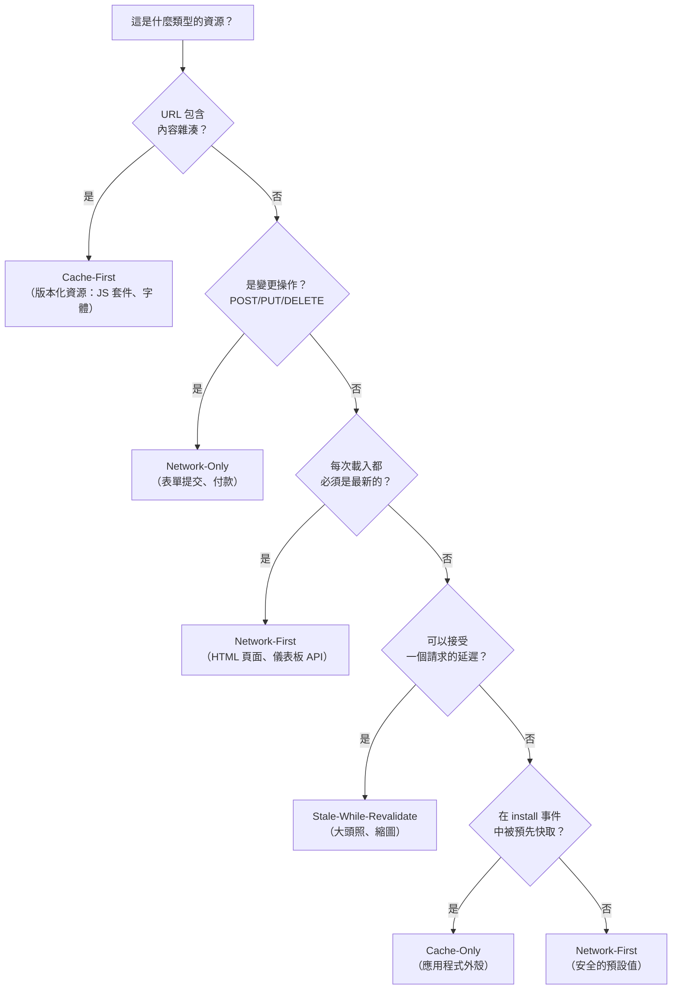

# [FEE-1303] 快取策略

## 介紹

Service Worker 的 `fetch` 事件處理器是一個網路代理：它攔截離開頁面的每個請求，並決定要回傳什麼回應。這個決策就是快取策略。快取策略不是瀏覽器統一套用的單一演算法 -- 而是開發者針對每種資源類型所做的刻意選擇，用來回答一個具體問題：對於這個資源、這個變更頻率、以及這個對陳舊內容的容忍度，Service Worker 現在能給出的最佳回應是什麼？

瀏覽器的 HTTP 快取與 Service Worker 的 Cache API 解決的是不同的問題。HTTP 快取透過儲存以 URL 為鍵的回應，並依據 `Cache-Control` 標頭排定的時間表重新驗證，來減少多餘的網路往返。Service Worker 的快取則賦予開發者完整的程式控制：策略、儲存名稱、淘汰策略，以及備用行為都是程式碼。兩種快取可以共存，實際上也常在同一個應用程式中並用，但 Service Worker 層才是讓開發者明確決定離線能力、效能，以及資料新鮮度取捨的地方，而非從伺服器標頭中推斷。

五種標準快取策略各有其不同的 fetch 處理器控制流程：Cache-First、Network-First、Stale-While-Revalidate、Cache-Only，以及 Network-Only。這些名稱在 web.dev 的 Offline Cookbook、MDN 的 Cache API 文件，以及 Workbox 函式庫中保持一致。在程式碼中使用這些標準名稱 -- 作為函式名稱、程式碼注解，或 Workbox 策略類別的參照 -- 使 `fetch` 處理器具有自我說明的能力，並讓路由決策可以在不執行程式碼的情況下進行審查。

沒有任何單一策略適用於所有資源。結構良好的 Service Worker 會依據 URL 模式或請求的 `destination` 屬性，將最適合的策略套用到相應的資源類型上。路由設定錯誤會帶來具體的後果：在 HTML 文件上使用 Cache-First，使用者將永遠看不到內容更新；在大型圖片上使用 Network-First，意味著使用者在離線時要等待逾時才能看到任何內容；對本可快取的 GET 請求使用 Network-Only，則白白浪費了離線能力。本文定義每種策略、描述其適用情境、說明不適合使用的時機，並展示一個將五種策略整合在一起的完整多策略 `fetch` 處理器。

路由設定錯誤會帶來具體的後果：在 HTML 文件上使用 Cache-First，使用者將永遠看不到內容更新；在大型圖片上使用 Network-First，意味著使用者在離線時要等待逾時才能看到任何內容；對本可快取的 GET 請求使用 Network-Only，則白白浪費了離線能力。本文定義每種策略、描述其適用情境、說明不適合使用的時機，並展示一個將五種策略整合在一起的完整多策略 `fetch` 處理器。

## 原則

沒有放諸四海皆準的快取策略。團隊 MUST 根據資源類型與其對陳舊內容的容忍度來選擇策略。決定正確選擇的問題有三個：這個資源多久變更一次？提供陳舊版本的後果有多嚴重？離線時完全無法取得資源的後果又有多嚴重？

對於不明確屬於其他四種類別的任何資源，團隊 SHOULD 預設使用 Network-First。Network-First 是五種策略中最保守的：它以效能換取正確性，永遠不會提供過時的回應。這個取捨在資源類別尚未完全分析時是正確的選擇。隨著團隊對每種資源類別的陳舊容忍度有更深入的了解，可以逐步將特定類別改為更高效的策略。將 Network-First 套用在本可用 Cache-First 的資源上是一種浪費，但永遠不會造成錯誤；而將 Cache-First 套用在應該用 Network-First 的資源上，可能導致使用者無限期看到陳舊內容，這是一種正確性錯誤。有疑慮時，優先選擇新鮮度。對於非冪等請求（POST、PUT、DELETE、PATCH），團隊 MUST NOT 在任何策略下快取其回應 -- 快取一個變更回應並在後續請求中重播，會產生未定義且可能造成破壞性的行為。

## 設計思維

### 五種策略

這五種策略涵蓋了新鮮度、速度和離線能力之間所有有意義的取捨空間。每種策略都由其 `fetch` 處理器控制流程、最適合的情境，以及不應使用的反例來定義。

**Cache-First（快取優先，失敗時回退至網路）：** 處理器首先檢查快取。命中時立即回傳快取的回應，不聯繫網路。未命中時從網路取得資料，將回應存入快取並回傳。快取被視為權威來源。這是效能最高的策略：快取命中不需要任何網路往返和等待時間。它適用於 URL 本身包含內容雜湊的版本化靜態資源：如 `/assets/app.3f4d2a.js` 的 JavaScript 套件，或 `/assets/inter.9b2c1d.woff2` 的網頁字體。如果內容變更，建置工具會產生新的雜湊值，從而產生新的 URL，進而導致快取未命中，確保取得更新後的資源。URL 隨內容變更而改變，是 Cache-First 安全使用的前提條件。請勿對 HTML 頁面、API 回應，或任何在內容變更時 URL 保持不變的資源使用 Cache-First。除非手動清除快取條目，否則使用者永遠看不到更新，而實際上這意味著永遠不會更新。

**Network-First（網路優先，失敗時回退至快取）：** 處理器嘗試從網路取得資料。成功時將回應存入快取並回傳。發生網路錯誤時，回退至最近一次快取的回應。此策略優先考慮新鮮度：在線使用者一律取得最新內容。這是 HTML 導航請求（啟動應用程式的文件）以及頻繁更新的 API 回應（如收件匣、儀表板指標或通知動態）的正確策略。在線使用者看到新鮮內容；離線使用者看到最近一次快取的版本，這是一種降級但仍可用的體驗。請勿對圖片或影片等大型二進位資產使用 Network-First。逾時 30 秒的網路請求意味著使用者要等待 30 秒才能看到備用內容。對大型資產而言，Stale-While-Revalidate 或 Cache-First 更為合適。

**Stale-While-Revalidate（立即回傳舊快取，背景重新驗證）：** 處理器立即回傳快取的回應 -- 即使它是陳舊的 -- 同時在背景發起網路請求以更新快取，供下次請求使用。使用者每次請求都能獲得快速回應。代價是一個請求的延遲：使用者可能看到的是上一次請求時準確的內容，而非當前最新的。這是偶爾變更但可接受單次請求延遲的資產的正確策略：大頭照圖片、商品縮圖、非關鍵的元資料，以及不驅動使用者決策的次要 API 回應。陳舊的時間窗口最多只有一個請求，對於顯示舊值不會造成業務問題的內容而言是可以接受的。請勿對定價資料、庫存數量、供應狀態，或任何顯示陳舊值會造成業務問題的資源使用 Stale-While-Revalidate。一個商品顯示「庫存充足」但實際已售罄的情況，正是來自單一請求陳舊快取的具體失敗範例。

**Cache-Only（僅使用快取）：** 處理器從快取回傳，從不聯繫網路。如果資源不在快取中，回應為 fetch 錯誤。此策略只對在 Service Worker `install` 事件期間被明確預先快取的資源有意義 -- 即 `install` 處理器在 Service Worker 啟用前已保證存入快取的應用程式外殼資源。這些資源的定義即是穩定的：如果無法快取，安裝就會失敗。套用在預先快取外殼上的 Cache-Only 是最快的策略，完全沒有網路依賴。請勿對任何未被明確預先快取的資源使用 Cache-Only。如果資源不在快取中，使用者會看到網路錯誤，而本可提供有效回應。

**Network-Only（僅使用網路）：** 處理器從網路取得資料，從不觸碰快取。這是非冪等請求 -- 任何 GET 以外的方法 -- 以及不適合提供快取回應的冪等請求的正確策略：付款確認、工作階段終止、即時分析提交。Service Worker 的 `fetch` 處理器會對所有請求觸發，包括 POST、PUT 和 DELETE。對於非 GET 請求，正確行為幾乎在所有情況下都是不進行任何操作：不呼叫 `respondWith` 直接返回，讓瀏覽器正常處理請求。在 `request.method !== 'GET'` 時提前返回是慣用的模式，這也實現了 Network-Only 的語義。請勿對可安全快取的 GET 請求使用 Network-Only -- 這浪費了 Service Worker 存在的離線能力。

### 選擇正確的策略

一旦對每種資源類別回答了這三個問題，決策便是機械性的。首先詢問 URL 是否包含內容雜湊 -- 如果是，Cache-First 是安全的。接著詢問請求是否為變更操作 -- 如果是，使用 Network-Only 或不進行攔截。然後詢問每次載入是否都必須保持新鮮 -- 如果是，使用 Network-First。再詢問是否可接受一個請求的延遲 -- 如果是，使用 Stale-While-Revalidate。最後詢問資源是否在安裝時被預先快取 -- 如果是，使用 Cache-Only。如果上述條件都不適用，預設使用 Network-First。

這些決策在 `fetch` 處理器中的路由邏輯裡成為程式碼。典型的實作依據三個屬性進行路由：`request.method`（用於捕捉變更操作）、`url.pathname` 前綴（用於識別版本化資源目錄），以及 `request.destination`（用於識別圖片和文件，而無需列舉每個 URL）。路由順序很重要：變更操作必須在任何快取邏輯執行前被捕捉，最具體的模式必須優先於最通用的模式。

### 策略比較表格

下表從路由決策最關鍵的維度，總結了五種策略。在審查現有 Service Worker 或設計新的 Service Worker 時，可以配合流程圖一起使用。

| 策略 | 從快取回傳？ | 從網路取得？ | 網路失敗時 | 最適合的資源類型 |
|---|---|---|---|---|
| Cache-First | 是（優先） | 僅在快取未命中時 | 快取命中時成功；未命中時失敗 | 版本化靜態資源（內容雜湊 URL） |
| Network-First | 僅在網路失敗時 | 是（優先） | 提供陳舊快取；回退至離線頁面 | HTML 導航、頻繁更新的 API |
| Stale-While-Revalidate | 是（立即） | 始終，在背景 | 提供陳舊快取；無背景更新 | 圖片、縮圖、非關鍵 API 資料 |
| Cache-Only | 是（唯一來源） | 從不 | Fetch 錯誤（無快取條目） | 預先快取的應用程式外殼（安裝保證） |
| Network-Only | 從不 | 是（唯一來源） | Fetch 錯誤（無備用方案） | 變更操作（POST/PUT/DELETE）、付款 |

這張表格使一個策略名稱本身無法直接表達的關係變得明確：Stale-While-Revalidate 即使在快取命中時，也始終從網路取得資料。這正是快取保持最新狀態的機制。團隊有時期望 Stale-While-Revalidate 像 Cache-First 一樣（命中時跳過網路），並配有獨立的重新驗證觸發器。事實並非如此：對每個存在快取條目的請求，背景請求都會觸發。這是正確且合理的行為 -- 快取條目最多只比最新狀態落後一個請求 -- 但這意味著即使頁面看起來在使用快取內容，Stale-While-Revalidate 仍然會貢獻網路流量。

### 不透明回應與跨來源資源

不透明回應（opaque response）是以 `no-cors` 模式對跨來源資源發起 `fetch` 時所得到的回應。瀏覽器出於安全考量隱藏了其狀態碼、標頭和主體。不透明回應的 `response.status` 始終為 `0`，即使底層伺服器回傳了 200 亦然。快取不透明回應在某些情況下是安全的，但在其他情況下可能是災難性的。如果跨來源伺服器回傳錯誤（5xx 或重新導向至登入頁面），不透明回應的狀態仍是 `0`，與成功回應無法區分。將這個 0 狀態的回應存入快取，並在下次請求時提供給使用者，意味著靜默地提供空白或錯誤的回應，而不會有任何錯誤提示。

實務規則：除非資源真的是可選的，且快取中存入失敗條目是可接受的，否則不要快取不透明回應。對於 Google Fonts 或已啟用 CORS 標頭（`Access-Control-Allow-Origin: *`）的 CDN 資產等跨來源字體，使用 `fetch(request, { mode: 'cors' })` 取得包含真實狀態碼的非不透明回應。對於真的無法回傳 CORS 標頭的跨來源資源，完全不要透過 Service Worker 快取它們 -- 讓瀏覽器的 HTTP 快取依其 `Cache-Control` 標頭來處理。

### 快取大小與淘汰

Cache API 不對每個快取強制執行大小限制。它強制執行的是每個來源的儲存配額，該配額與 IndexedDB 和 Origin Private File System 共用。當儲存壓力增加時，瀏覽器會開始淘汰最近最少使用的資料，但這種淘汰的粒度不足以作為快取管理策略來依賴。沒有有界淘汰策略而快取每個網路回應的 Service Worker，其快取將無限增長。對於動態快取（由 `fetch` 處理器在執行期填充，而非在安裝時由 `addAll` 填充的快取），在每次 `cache.put()` 後實作明確的大小限制：開啟快取、取得所有鍵值，並刪除超出限制的最舊條目。對於在安裝時填充的靜態快取，快取大小在建置時已知，不會在執行期增長。

### 結合策略：`fetch` 處理器中的路由邏輯

一個生產環境的 Service Worker 會同時執行多種策略，依請求屬性進行路由。路由邏輯應清晰易讀，而非一長串巢狀條件判斷。建議採用一系列的提前返回防護語句，每個語句處理一種資源類別，然後再進入下一個。最受限制的類別優先處理：變更操作（非 GET）始終是 Network-Only，必須在任何快取邏輯執行之前被捕捉。接著處理最具體的 URL 模式 -- 預先快取外殼資源的精確比對，然後是版本化資源的目錄前綴。再來是基於 `destination` 的路由（圖片、字體、文件）。最後，以安全的預設值處理通用情況。

當兩種策略可能適用於同一資源類別時，選擇更保守的策略。如果一個 URL 模式同時模糊地匹配了版本化資源目錄和通用 API 模式，將其路由到 Network-First 而非 Cache-First：Network-First 套用在版本化資源上，最壞的結果是回應稍微慢一點；Cache-First 套用在 API 端點上，最壞的結果是將陳舊資料顯示為最新資料。建立路由邏輯時，確保沒有任何 URL 落入比其陳舊容忍度所需更激進的策略。

### 選擇合適策略的組合邏輯

在 `fetch` 處理器中撰寫路由程式碼之前，先為每個資源類別用流程圖回答這三個分類問題。對 `/index.html` 的策略是什麼？對 `/assets/app.abc123.js` 呢？對 `/api/user` 呢？如果逐行讀取 `fetch` 處理器無法立即回答這三個問題，就需要重構路由結構。路由規則是一種設定，應該可以像設定一樣讀懂。依據 `url.pathname` 進行 URL 模式比對通常已足夠；避免對 `request.url`（包含來源和查詢字串的完整 URL）進行比對，這對包含查詢參數的同來源請求可能產生意想不到的結果。

Cache API 的請求比對演算法預設對完整 URL（包含查詢字串）進行比對。`/api/data?page=1` 和 `/api/data?page=2` 的請求會產生不同的快取條目。對於分頁 API 回應而言，這是正確的行為；但如果查詢字串在快取比對時應被忽略，請在 `caches.match()` 中傳入 `{ ignoreSearch: true }` 選項。要謹慎：忽略查詢字串對某些資源是正確的，對其他資源則會造成正確性問題。在路由程式碼中明確記錄這個決策。

## 最佳實踐

**必須（MUST）為靜態快取名稱加上版本號，並在 activate 時刪除舊快取。** 團隊必須（MUST）在 Service Worker 檔案頂部定義 `const STATIC_CACHE = 'static-v1'` 和 `const DYNAMIC_CACHE = 'dynamic-v1'`，並在 `activate` 處理器中刪除每個名稱不在當前快取集合中的快取。每當預先快取的資源列表變更時遞增版本字串，確保前一版本所快取的資源立即被清理。

**必須（MUST）在將回應存入快取之前先複製（clone）回應。** `Response` 物件的主體是只能消費一次的可讀取串流。團隊必須（MUST）在 `await fetch()` 呼叫後立即執行 `const clone = response.clone()`；若 `respondWith` 先消費了主體，複製結果將是空的。複製品存入快取，原始回應回傳給頁面。

**必須（MUST）只將 Cache-First 套用於具有內容雜湊 URL 的資源。** URL 中的內容雜湊是使 Cache-First 安全的不變量；沒有它，Cache-First 就是一個正確性風險。團隊必須（MUST）在發布前驗證每個 `cacheFirst()` 呼叫點所處理的 URL 都包含雜湊片段。

**應該（SHOULD）將 Network-First 作為任何未明確分類的資源的安全預設。** Network-First 不如 Cache-First 或 Stale-While-Revalidate 高效，但永遠不會出錯。團隊應該（SHOULD）優先確保正確性：陳舊的快取回應是正確性失敗，多一次網路往返是效能問題。

**禁止（MUST NOT）快取來自跨來源 no-cors 請求的不透明回應。** 團隊必須（MUST）在呼叫 `cache.put()` 前檢查 `response.type === 'opaque'`，並對不透明回應跳過快取。如果跨來源資源必須（MUST）被快取，應向伺服器請求 CORS 標頭，並以 `mode: 'cors'` 發起 `fetch`。

**必須（MUST）為動態快取實作有界淘汰策略。** 對於任何在執行期填充的快取，團隊必須（MUST）定義條目的最大數量，並在每次 `cache.put()` 後強制執行。用 `cache.keys()` 取得所有快取鍵值，並刪除超出限制的條目。沒有這個機制，高流量應用程式的動態快取將無限增長。

**應該（SHOULD）明確測試離線行為，而非僅測試快取命中路徑。** 團隊應該（SHOULD）使用 Chrome DevTools Network 面板的「Offline」模式，驗證每種策略在網路請求失敗時的行為符合規格。Network-First 回退到快取、快取條目缺失時的 Cache-Only 錯誤，以及 Stale-While-Revalidate 的背景更新，都有只在網路不可用時才會執行的路徑。

**應該（SHOULD）將每個策略函式的作用範圍限定在單一具名快取。** 團隊應該（SHOULD）以參數形式傳入快取名稱（如 `cacheFirst(request, STATIC_CACHE)`），使快取歸屬在呼叫點一目瞭然，並防止意外的跨快取汙染。這個粒度確保版本升級時只刪除對應的陳舊快取，動態快取維持不變。

**必須（MUST）防範快取錯誤回應。** 解析成功的 `fetch()` 仍可能回傳 4xx 或 5xx 回應。團隊必須（MUST）在呼叫 `cache.put()` 前檢查 `response.ok`，並在其為 false 時跳過快取；被快取的 404 將在每次後續命中時提供給使用者，使資源看起來永久損壞。

## 圖解

以下流程圖將三個分類問題對應到五種策略。在為應用程式的 `fetch` 處理器撰寫任何路由程式碼之前，先用它來確定每個資源類別的正確策略。



## 範例

以下 Service Worker 是一個完整、可直接部署的實作，包含所有五種策略和 URL 模式路由。路由順序是刻意設計的：變更操作首先被捕捉（不進行攔截直接返回），然後是最具體的 URL 模式，接著是基於 `destination` 的路由，最後是通用的預設值。程式碼中的注解說明了每個路由決策的理由。

```js
// public/sw.js

const STATIC_CACHE = 'static-v1';
const DYNAMIC_CACHE = 'dynamic-v1';

// 應用程式外殼：必須在任何時候都能離線使用的資源。
// 這些確切的 URL 在安裝時被預先快取，並透過 Cache-Only 提供。
const APP_SHELL = ['/', '/offline.html', '/app.css'];

// ── Install：預先快取應用程式外殼 ──────────────────────────────────────────
self.addEventListener('install', (event) => {
  event.waitUntil(
    caches.open(STATIC_CACHE).then((cache) => cache.addAll(APP_SHELL))
  );
});

// ── Activate：刪除屬於先前 SW 版本的快取 ────────────────────────────────────
self.addEventListener('activate', (event) => {
  const CURRENT_CACHES = [STATIC_CACHE, DYNAMIC_CACHE];
  event.waitUntil(
    caches.keys().then((keys) =>
      Promise.all(
        keys
          .filter((k) => !CURRENT_CACHES.includes(k))
          .map((k) => caches.delete(k))
      )
    )
  );
  // 立即接管開啟的分頁，而非等待下次導航。
  self.clients.claim();
});

// ── Fetch：將每個請求路由到適當的策略 ────────────────────────────────────────
self.addEventListener('fetch', (event) => {
  const { request } = event;
  const url = new URL(request.url);

  // Network-Only（隱式）：非 GET 請求從不被攔截。
  // 不呼叫 respondWith 直接返回，讓瀏覽器正常處理。
  if (request.method !== 'GET') return;

  // Cache-Only：應用程式外殼資源在安裝時已保證存入 STATIC_CACHE。
  // 這些資源不需要也不應該發出網路請求。
  if (APP_SHELL.includes(url.pathname)) {
    event.respondWith(caches.match(request));
    return;
  }

  // Cache-First：/assets/ 中的版本化資源具有內容雜湊 URL。
  // URL 變更即代表內容變更，因此快取命中必定是正確的。
  if (url.pathname.startsWith('/assets/')) {
    event.respondWith(cacheFirst(request, STATIC_CACHE));
    return;
  }

  // Stale-While-Revalidate：圖片偶爾會變更，但可接受一個請求的延遲。
  // 使用者始終獲得快速回應。
  if (request.destination === 'image') {
    event.respondWith(staleWhileRevalidate(request, DYNAMIC_CACHE));
    return;
  }

  // Network-First（預設）：API 回應和 HTML 導航請求在在線時需要最新內容，
  // 離線時則需要盡力而為的備用方案。
  event.respondWith(networkFirst(request, DYNAMIC_CACHE));
});

// ── 策略實作 ──────────────────────────────────────────────────────────────────

async function cacheFirst(request, cacheName) {
  // 命中時立即回傳快取的回應。
  const cached = await caches.match(request);
  if (cached) return cached;

  // 未命中時，從網路取得，快取回應，然後回傳。
  const response = await fetch(request);
  const cache = await caches.open(cacheName);
  // 存入快取前先複製：Response 主體只能消費一次。
  cache.put(request, response.clone());
  return response;
}

async function networkFirst(request, cacheName) {
  try {
    // 嘗試網路請求。成功時，快取並回傳回應。
    const response = await fetch(request);
    const cache = await caches.open(cacheName);
    cache.put(request, response.clone());
    return response;
  } catch {
    // 網路錯誤時，回退至快取。
    const cached = await caches.match(request);
    // 如果沒有快取版本，回傳離線備用頁面。
    return cached ?? caches.match('/offline.html');
  }
}

async function staleWhileRevalidate(request, cacheName) {
  const cache = await caches.open(cacheName);
  const cached = await cache.match(request);

  // 啟動背景請求以更新快取，供下次請求使用。
  // 不使用 await：更新在回應回傳後才發生。
  const networkPromise = fetch(request).then((response) => {
    cache.put(request, response.clone());
    return response;
  });

  // 如果有快取版本，立即回傳；
  // 否則等待網路（首次訪問時尚無快取條目）。
  return cached ?? networkPromise;
}
```

三個策略函式與路由邏輯分開，以提高清晰度和可測試性。每個函式都是從請求到回應的純粹轉換，具有可預期的備用行為。`networkFirst` 函式在網路和快取都無法提供回應時，回退到 `/offline.html` -- 這要求 `/offline.html` 必須在應用程式外殼預先快取中，而 `APP_SHELL` 陣列和 `install` 處理器保證了這一點。

`staleWhileRevalidate` 函式在回傳快取回應之前，不會等待 `networkPromise` 完成。背景請求觸發並更新快取，但呼叫端的 `respondWith` 已經提交。這是預期的行為：快取是為下一個請求更新的，而非當前這個。`?? networkPromise` 備用方案處理了尚無快取條目存在的首次訪問情況，使函式在第一次請求時表現得像 Network-First，在後續每次請求時表現得像 Stale-While-Revalidate。

請注意，`cacheFirst` 和 `networkFirst` 在呼叫 `cache.put()` 之前都使用了 `response.clone()`。這是必要的。`Response` 主體是一次性可讀取的串流。將原始物件傳給 `cache.put()` 然後再回傳給 `respondWith`，會導致頁面收到空的主體。先複製，然後將一份傳給快取，另一份回傳給頁面。

此範例的一個值得注意的省略，是每個 `cache.put()` 呼叫之前的回應狀態防護。生產環境的實作應在儲存回應之前檢查 `response.ok` -- 快取一個 404 或 503 意味著後續每次對該 URL 的快取命中都會提供錯誤回應，直到快取被清除。範例為了簡潔而省略了這個防護；生產環境的模式如下：

```js
if (response.ok) {
  cache.put(request, response.clone());
}
return response;
```

將此防護套用在每個寫入快取的策略中：`cacheFirst` 在網路未命中時，以及 `networkFirst` 在網路成功時。`staleWhileRevalidate` 函式應在 `networkPromise` 的 `.then()` 回呼中套用相同的防護。對於 Cache-Only 和隱式 Network-Only 路徑（非 GET 的提前返回），不會發生 `cache.put()`，因此不需要防護。

`networkFirst` 的 `catch` 區塊在回退至快取之前靜默地忽略了錯誤。在生產環境的 Service Worker 中，在回退前記錄錯誤 -- 至少記錄到 `console.error('[SW] networkFirst failed:', request.url, err)`。Service Worker 的 console 輸出在 DevTools Console 的上下文切換器設定為 Service Worker 執行緒時可見。在此記錄失敗是最早發現某類網路請求系統性失敗的信號，這可能代表部署錯誤、後端故障，或設定錯誤的路由規則，而非偶發性的連線問題。

## 常見錯誤

**在 HTML 頁面上使用 Cache-First。** 使用 Cache-First 提供的 HTML 文件，每次載入都會回傳快取版本，永遠如此。當部署變更了 HTML 時，擁有快取副本的使用者永遠不會收到更新，除非手動刪除快取條目或其到期，而 Cache API 不會自動強制執行這一點。HTML 文件 MUST 使用 Network-First 提供，確保在線使用者始終收到當前版本，離線使用者收到最近快取的版本。

**在大型圖片或影片上使用 Network-First。** Network-First 在查詢快取之前先從網路取得。對於 5 MB 的圖片，網路逾時意味著使用者要等待完整的逾時時長 -- 通常是 30 到 60 秒 -- 才能觸發備用方案。對圖片使用 Stale-While-Revalidate：快取版本立即回傳，網路更新在背景進行。單一請求的延遲對使用者而言是不可見的；逾時等待則不是。

**靜默吞掉所有 fetch 錯誤。** 圍繞網路請求的 `try/catch`，在回退到快取回應之前不記錄錯誤，會在開發和生產除錯期間隱藏網路失敗。在回退之前至少記錄錯誤 -- 最低限度記錄到 Service Worker 的 `console.error` -- 這樣監控工具才能浮現本來不可見的網路故障模式。

**未在 Network-First 中處理離線頁面本身。** Network-First 的備用方案在網路和快取都無法提供回應時，會回傳 `caches.match('/offline.html')`。如果 `/offline.html` 未在 `install` 處理器中加入預先快取，這個備用方案會回傳 `undefined`，導致 `respondWith` 拒絕請求，使用者看到的是瀏覽器層級的網路錯誤，而非受控的離線頁面。務必將離線備用頁面加入 `APP_SHELL` 預先快取清單。

**未明確測試離線行為路徑。** 在開發階段，大多數測試只涵蓋網路可用時的快取命中路徑。Network-First 的快取備用方案、Cache-Only 在快取條目缺失時的錯誤，以及 Stale-While-Revalidate 的背景更新，都只在網路不可用時才會執行。使用 Chrome DevTools Network 面板的「Offline」模式，驗證每種策略在網路請求失敗時的行為符合預期，而非只驗證成功時的行為。驗證時同時檢查 Cache Storage 面板，確認每種策略寫入和讀取的是正確的具名快取。

**對不在預先快取中的資源使用 Cache-Only。** Cache-Only 只有在 `install` 處理器保證資源已存在於快取中時才是正確的。如果一個 URL 被添加到 Cache-Only 路由邏輯中，但未包含在 `APP_SHELL` 裡，Service Worker 會對每個對該資源的請求回傳 fetch 錯誤。驗證每個被 Cache-Only 路由邏輯匹配的 URL，是否也包含在 `install` 處理器的 `addAll()` 呼叫中。這種驗證最好在 CI 中自動化：比較 `APP_SHELL` 陣列與 Cache-Only 路由邏輯中精確比對的 URL 清單，確保兩者保持同步。

## 相關 FEE

- [FEE-1302：Service Worker](./1302.md) -- 這些策略在其中實作的 `fetch` 處理器；涵蓋 Service Worker 的生命週期、註冊，以及中介層模型
- [FEE-1304：Workbox 與 PWA 工具鏈](./1304.md) -- 這五種策略作為具名 Workbox 類別（`CacheFirst`、`NetworkFirst`、`StaleWhileRevalidate`、`CacheOnly`、`NetworkOnly`），並附帶內建的過期管理和廣播更新支援
- [FEE-403：Fetch、Streams 與網路 API](../Browser%20APIs%20and%20Web%20Platform/403.md) -- Service Worker 在策略函式中呼叫 `fetch(request)` 時所委派的底層網路層

## 參考資料

- [web.dev：The Offline Cookbook](https://web.dev/articles/offline-cookbook)（Jake Archibald）-- 五種快取策略的標準參考；定義了本文通篇使用的策略名稱，並提供每種控制流程的視覺化圖表
- [MDN：Cache API](https://developer.mozilla.org/en-US/docs/Web/API/Cache) -- `caches.open()`、`cache.match()`、`cache.put()`、`cache.keys()` 和 `cache.delete()` 的權威參考；涵蓋請求比對演算法和快取儲存配額
- [Workbox：快取策略概覽](https://developer.chrome.com/docs/workbox/caching-strategies-overview/) -- 記錄 Workbox 函式庫中實作的五種策略；有助於理解每種策略必須處理的生產級邊緣案例
- [MDN：Response.clone()](https://developer.mozilla.org/en-US/docs/Web/API/Response/clone) -- 解釋為何複製是必要的：Response 主體只能消費一次；描述在主體已被讀取後呼叫 `clone()` 時拋出的 `TypeError`
- [web.dev：Storage for the web](https://web.dev/articles/storage-for-the-web) -- 涵蓋 Cache API 和 IndexedDB 共用的每來源儲存配額；解釋瀏覽器淘汰策略，以及如何使用 Storage Manager API 查詢可用配額
- [web.dev：處理 Service Worker 更新](https://web.dev/articles/service-worker-update) -- 與快取策略相關，因為 `activate` 處理器中的快取版本命名和清理是策略實作的一部分，而非獨立事項
- [Chrome DevTools：Cache Storage 檢查](https://developer.chrome.com/docs/devtools/application/cache-storage/) -- 如何在開發期間檢查具名快取、查看個別條目，並刪除條目以驗證每種策略寫入和讀取的是正確的快取
- [W3C Service Workers 規格：快取比對](https://www.w3.org/TR/service-workers/#cache-match) -- `caches.match()` 比對請求 URL 方式的規範定義，包括控制查詢字串和方法比對行為的 `ignoreSearch`、`ignoreMethod` 和 `ignoreVary` 選項
- [web.dev：Service Worker 快取與 HTTP 快取](https://web.dev/articles/service-worker-caching-and-http-caching) -- 解釋 Service Worker 快取策略與瀏覽器內建 HTTP 快取之間的互動，包括網路回應上的 `Cache-Control` 標頭如何影響 Service Worker 呼叫 `cache.put()` 時儲存的內容
- [MDN：FetchEvent.respondWith()](https://developer.mozilla.org/en-US/docs/Web/API/FetchEvent/respondWith) -- 每種快取策略的核心 API；說明 `respondWith` 必須以一個解析為 `Response` 的 Promise 呼叫，以及若未呼叫 `respondWith` 時瀏覽器的預設行為
- [MDN：使用 Service Workers](https://developer.mozilla.org/zh-TW/docs/Web/API/Service_Worker_API/Using_Service_Workers) -- Service Worker 的逐步操作指南，涵蓋註冊、install 與 fetch 處理器的完整流程，是了解快取策略實作背景的實用起點
