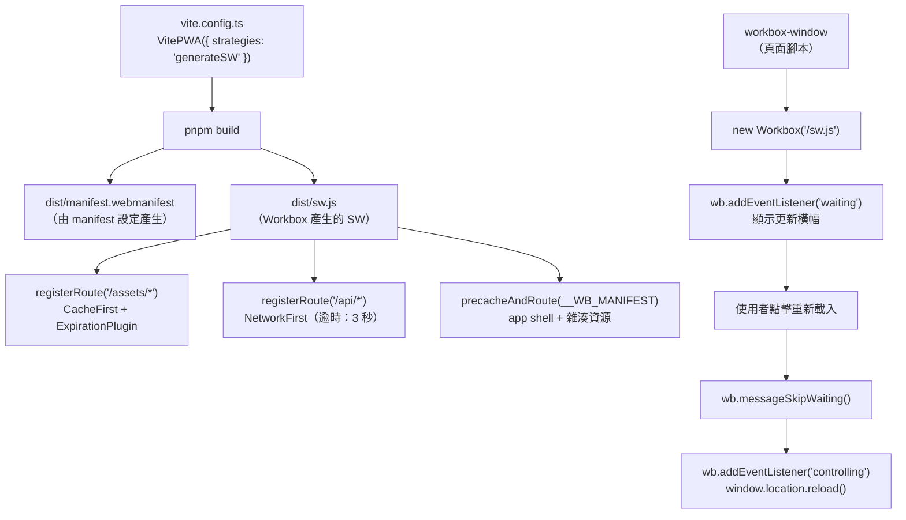

# [FEE-1304] Workbox 與 PWA 工具鏈

:::info
Workbox 由 Chrome 團隊維護，目前版本為 7.4.x，將 FEE-1303 的五種快取策略封裝為具名類別，加入過期與更新外掛機制，並自動從建置輸出產生 precache manifest。針對 Vite 專案，`vite-plugin-pwa` 透過單一設定物件產生 service worker 與 web app manifest；針對 Next.js，已取代 `@ducanh2912/next-pwa` 成為維護選項的 Serwist（`@serwist/next`）則是從手寫的原始碼檔案加上設定來建置 worker。本文涵蓋 Workbox 策略類別、`generateSW`／`injectManifest` 的區分、`workbox-window` 的更新偵測流程，以及 Next.js PWA 工具鏈的現況。
:::

## 背景

手刻一個 production 等級的 service worker 是可行的，但每次都要解決同一組問題：管理 cache 名稱與版本、實作能正確 clone response 並防止快取錯誤狀態碼的策略函式、限制動態快取的成長、建立 precache manifest 以便在部署後取得更新的資源，以及測試只有在離線狀態才會觸發的 fallback 路徑。每個問題單獨來看都不大，但加總起來，針對中等複雜度的應用程式，手刻的 service worker 在出現任何應用程式專屬的 routing 邏輯之前，就已經膨脹成數百行防禦性的樣板程式碼。Workbox 是由 Chrome 團隊維護的一組函式庫，用來消除這種累積。

Workbox 並不能取代對原始 Cache API 與 service worker 生命週期的理解。FEE-1302 與 FEE-1303 的概念在 Workbox 中依然存在：install 與 activate 生命週期、作為網路代理的 `fetch` event handler、五種快取策略及其取捨、response clone 的必要性，以及 opaque response 的風險。Workbox 將這些概念封裝起來，但並未隱藏它們。當 Workbox 驅動的 service worker 出現問題時，診斷失敗需要閱讀 Workbox 的 `runtimeCaching` 設定，並將其對應回原始行為。跳過 FEE-1302 與 FEE-1303 直接使用 Workbox 的團隊，會遇到難以理解的錯誤，且沒有推理框架可以分析它們。

Workbox 生態系統分為兩層。下層是 Workbox 函式庫本身：`workbox-strategies`、`workbox-routing`、`workbox-precaching`、`workbox-expiration`，以及 `workbox-window`。這些套件可以直接從開發者撰寫的自訂 service worker 檔案中匯入。上層是建置工具整合：Vite 專案（React、Vue、Svelte 等）使用 `vite-plugin-pwa`；Next.js 則使用 Serwist（`@serwist/next`）或其前身 `@ducanh2912/next-pwa`。`vite-plugin-pwa` 與 `@ducanh2912/next-pwa` 讀取設定物件，並產生 service worker 與 web app manifest 作為建置輸出；Serwist 則是從手寫的 `app/sw.ts` 原始碼加上設定來建置 worker。多數 production 團隊在上層作業，將下層的決策委託給設定，只有在需要建置工具整合無法表達的自訂邏輯時，才會直接匯入 Workbox 套件。

## 視覺對比

以下圖表展示了 `generateSW` 模式下的 `vite-plugin-pwa` 建置管道，以及執行期的 `workbox-window` 更新偵測流程。



## 範例

以下範例是在 `generateSW` 模式下的完整 `vite-plugin-pwa` 設定，包含三條 runtime cache 路由與使用 `workbox-window` 的 React 更新橫幅元件，接著是目前建議與舊版的 Next.js 設定。

### `vite.config.ts`

```ts
// vite.config.ts
import { defineConfig } from 'vite';
import react from '@vitejs/plugin-react';
import { VitePWA } from 'vite-plugin-pwa';

export default defineConfig({
  plugins: [
    react(),
    VitePWA({
      // 不要自動啟用；讓 UpdateBanner 元件控制時機。
      registerType: 'prompt',

      // generateSW：Workbox 根據此設定撰寫整個 service worker。
      // 如果 SW 需要自訂請求變更邏輯，請切換到 'injectManifest'。
      strategies: 'generateSW',

      workbox: {
        // /assets/ 中的資源具有內容雜湊的 URL。CacheFirst 是安全的，因為
        // 內容更改會產生新的 URL（雜湊更改），所以快取命中始終是正確的。
        // ExpirationPlugin 防止快取無限成長。
        runtimeCaching: [
          {
            urlPattern: /\/assets\/.*/i,
            handler: 'CacheFirst',
            options: {
              cacheName: 'assets-cache-v1',
              expiration: {
                maxEntries: 100,
                maxAgeSeconds: 365 * 24 * 60 * 60, // 1 年
              },
            },
          },
          // API response 在連線時的每次載入都需要最新資料。
          // networkTimeoutSeconds: 3 確保網路惡化的使用者快速看到快取的 response，
          // 而不是無限期地等待網路。
          {
            urlPattern: /\/api\/.*/i,
            handler: 'NetworkFirst',
            options: {
              cacheName: 'api-cache-v1',
              networkTimeoutSeconds: 3,
              expiration: {
                maxEntries: 50,
                maxAgeSeconds: 5 * 60, // 5 分鐘
              },
            },
          },
          // 圖片：一次請求的延遲是可以接受的。StaleWhileRevalidate 立即回傳快取的圖片，
          // 並在背景更新。
          {
            urlPattern: /\.(?:png|jpg|jpeg|svg|gif|webp)$/i,
            handler: 'StaleWhileRevalidate',
            options: {
              cacheName: 'image-cache-v1',
              expiration: {
                maxEntries: 60,
                maxAgeSeconds: 30 * 24 * 60 * 60, // 30 天
              },
            },
          },
        ],
      },

      manifest: {
        name: 'Acme Task Manager',
        short_name: 'Acme Tasks',
        start_url: '/?source=pwa',
        display: 'standalone',
        theme_color: '#3b82f6',
        background_color: '#ffffff',
        icons: [
          { src: '/icons/icon-192.png', sizes: '192x192', type: 'image/png' },
          { src: '/icons/icon-512.png', sizes: '512x512', type: 'image/png' },
          {
            src: '/icons/icon-512-maskable.png',
            sizes: '512x512',
            type: 'image/png',
            purpose: 'maskable',
          },
        ],
      },
    }),
  ],
});
```

### 更新橫幅：`src/components/UpdateBanner.tsx`

```tsx
// src/components/UpdateBanner.tsx
import { useEffect, useState } from 'react';
import { Workbox } from 'workbox-window';

export function UpdateBanner() {
  const [showBanner, setShowBanner] = useState(false);
  const [wb, setWb] = useState<Workbox | null>(null);

  useEffect(() => {
    // Service worker 在開發模式或不支援該 API 的瀏覽器中無法使用。
    if (!('serviceWorker' in navigator)) return;

    const workbox = new Workbox('/sw.js');

    // 當新的 service worker 已安裝但因此分頁仍使用舊版本而無法啟用時，
    // 'waiting' 事件就會觸發。顯示橫幅讓使用者選擇何時套用更新。
    workbox.addEventListener('waiting', () => {
      setShowBanner(true);
    });

    workbox.register();
    setWb(workbox);
  }, []);

  function handleUpdate() {
    if (!wb) return;

    // 當新的 service worker 啟用並接管頁面控制時，重載頁面
    // 以確保所有資源和記憶體狀態都與新版本一致。
    wb.addEventListener('controlling', () => {
      window.location.reload();
    });

    // 向等待中的 service worker 發送訊息，告訴它呼叫 self.skipWaiting()。
    // 這觸發啟用，然後上面的 'controlling' 事件。
    wb.messageSkipWaiting();
  }

  if (!showBanner) return null;

  return (
    <div className="fixed bottom-4 left-4 right-4 bg-blue-600 text-white p-4 rounded-lg flex items-center justify-between shadow-lg">
      <span>有新版本可用。</span>
      <button
        onClick={handleUpdate}
        className="px-3 py-1 bg-white text-blue-600 rounded font-medium hover:bg-blue-50 transition-colors"
      >
        重新載入
      </button>
    </div>
  );
}
```

### 根註冊：`src/main.tsx`

```tsx
// src/main.tsx
import React from 'react';
import ReactDOM from 'react-dom/client';
import App from './App';
import { UpdateBanner } from './components/UpdateBanner';

// vite-plugin-pwa 會產生一個虛擬模組 'virtual:pwa-register/react'，
// 提供用於 service worker 註冊的 React hook。或者，也可以像上面的
// UpdateBanner 一樣直接實例化 workbox-window，並省略這個匯入。
// 兩種做法都可行；上方 UpdateBanner 展示的是直接使用
// workbox-window 的做法。

ReactDOM.createRoot(document.getElementById('root')!).render(
  <React.StrictMode>
    <App />
    <UpdateBanner />
  </React.StrictMode>
);
```

### `injectManifest` 模式：`src/sw.ts`

以下展示了為 `injectManifest` 模式撰寫的 service worker 結構。只有在 service worker 需要超出快取路由的自訂邏輯時才需要這個。

```ts
// src/sw.ts（僅在 injectManifest 模式下使用）
import { precacheAndRoute, cleanupOutdatedCaches } from 'workbox-precaching';
import { registerRoute } from 'workbox-routing';
import { CacheFirst, NetworkFirst, StaleWhileRevalidate } from 'workbox-strategies';
import { ExpirationPlugin } from 'workbox-expiration';

declare const self: ServiceWorkerGlobalScope;

// __WB_MANIFEST 在建置時被替換為從 dist/ 輸出產生的 precache 條目陣列。
// 沒有這個呼叫，app shell 就不會被 precache，HTML 進入點的離線支援就無法運作。
precacheAndRoute(self.__WB_MANIFEST);

// 清理舊版 service worker 建立的快取。
cleanupOutdatedCaches();

// 自訂邏輯：在所有 API 請求中注入 Authorization header。
// 這是需要 injectManifest 的使用案例——它無法在 generateSW 的
// runtimeCaching 設定中表達，因為該設定不支援請求變更。
self.addEventListener('fetch', (event) => {
  const url = new URL(event.request.url);
  if (url.pathname.startsWith('/api/')) {
    const token = /* 從 IndexedDB 或全域變數取得 token */ '';
    if (token) {
      const modifiedRequest = new Request(event.request, {
        headers: new Headers({
          ...Object.fromEntries(event.request.headers.entries()),
          Authorization: `Bearer ${token}`,
        }),
      });
      // 在變更請求後，交給 Workbox 的 NetworkFirst handler 處理。
      event.respondWith(
        new NetworkFirst({
          cacheName: 'api-cache-v1',
          networkTimeoutSeconds: 3,
          plugins: [new ExpirationPlugin({ maxEntries: 50, maxAgeSeconds: 5 * 60 })],
        }).handle({ event, request: modifiedRequest })
      );
      return;
    }
  }
});

// 非 API 資源的標準 runtime cache 路由。
registerRoute(
  ({ url }) => url.pathname.startsWith('/assets/'),
  new CacheFirst({
    cacheName: 'assets-cache-v1',
    plugins: [new ExpirationPlugin({ maxEntries: 100, maxAgeSeconds: 365 * 24 * 60 * 60 })],
  })
);

registerRoute(
  ({ request }) => request.destination === 'image',
  new StaleWhileRevalidate({
    cacheName: 'image-cache-v1',
    plugins: [new ExpirationPlugin({ maxEntries: 60, maxAgeSeconds: 30 * 24 * 60 * 60 })],
  })
);
```

### Next.js：Serwist 設定（目前建議）

Serwist 需要手寫 service worker，比較接近 `injectManifest` 模式，而非 `vite-plugin-pwa` 的 `generateSW`。從 `@serwist/next/worker` 匯出的 `defaultCache`，提供與 `@ducanh2912/next-pwa` 內建預設 `runtimeCaching` 相同的 runtime-caching 路由組合；下方的 `@ducanh2912/next-pwa` 範例是精簡過的自訂設定，並非該預設路由組合。

```ts
// next.config.mjs
import withSerwistInit from '@serwist/next';

const withSerwist = withSerwistInit({
  swSrc: 'app/sw.ts',
  swDest: 'public/sw.js',
});

export default withSerwist({
  // 你的 Next.js 設定放這裡
});
```

```ts
// app/sw.ts
import { defaultCache } from '@serwist/next/worker';
import type { PrecacheEntry, SerwistGlobalConfig } from 'serwist';
import { Serwist } from 'serwist';

declare global {
  interface WorkerGlobalScope extends SerwistGlobalConfig {
    __SW_MANIFEST: (PrecacheEntry | string)[] | undefined;
  }
}
declare const self: ServiceWorkerGlobalScope;

// defaultCache 提供與 @ducanh2912/next-pwa 內建預設 runtimeCaching
// 相同的 runtime-cache 路由組合（下方範例是精簡過的自訂設定，
// 並非該預設組合）。
// 依專案需求延伸這個陣列，加入專屬路由。
const serwist = new Serwist({
  precacheEntries: self.__SW_MANIFEST,
  skipWaiting: true,
  clientsClaim: true,
  runtimeCaching: defaultCache,
});

serwist.addEventListeners();
```

Serwist 提供 `@serwist/window` 作為其 `workbox-window` 對應套件，可用來建構更新提示橫幅。在把它接入上方 `vite-plugin-pwa` 所示的提示模式之前，請對照 Serwist 文件確認其目前的 API；這兩個函式庫是各自獨立的套件，彼此並非可直接替換的關係。

### `@ducanh2912/next-pwa` 設定（舊版路徑）

`@ducanh2912/next-pwa` 仍可運作，且在形式上仍接近 `vite-plugin-pwa` 的 `generateSW` 模式。這裡展示它是為了已經建置在其上的專案，而非作為新專案的建議起點。

```ts
// next.config.ts
import withPWA from '@ducanh2912/next-pwa';

const nextConfig = withPWA({
  // service worker 的最大範圍是它被提供的目錄路徑，因此它必須從
  // /sw.js（根路徑）提供，才能控制每一條路由。
  // dest 已預設為 'public'；在這裡設定只是讓這個選擇在設定中可見。
  dest: 'public',

  // 在開發中永遠不執行快取 service worker。HMR 需要未快取的網路 response；
  // 快取 SW 會破壞熱模組替換。
  disable: process.env.NODE_ENV === 'development',

  // 使用 'prompt' 以匹配上面的 UpdateBanner 模式。
  // 只有在 session 中途啟用不會中斷進行中請求的應用程式，
  // 'autoUpdate' 才是合適的選擇。
  register: false, // 透過 UpdateBanner 中的 workbox-window 手動註冊
  skipWaiting: false, // 不要自動啟用；讓 workbox-window 控制

  workboxOptions: {
    runtimeCaching: [
      {
        urlPattern: /\/api\/.*/i,
        handler: 'NetworkFirst',
        options: {
          cacheName: 'api-cache-v1',
          networkTimeoutSeconds: 3,
          expiration: { maxEntries: 50, maxAgeSeconds: 5 * 60 },
        },
      },
      {
        urlPattern: /\.(?:png|jpg|jpeg|svg|gif|webp)$/i,
        handler: 'StaleWhileRevalidate',
        options: {
          cacheName: 'image-cache-v1',
          expiration: { maxEntries: 60, maxAgeSeconds: 30 * 24 * 60 * 60 },
        },
      },
    ],
  },
})({
  // 你的 Next.js 設定放這裡
});

export default nextConfig;
```

## 最佳實踐

**必須（MUST）在每條 `CacheFirst` 路由上搭配 `ExpirationPlugin`。** 沒有過期設定的 `CacheFirst` 路由是快取洩漏：每個符合路由的唯一 URL 都會在具名快取中新增一個永久條目。團隊必須（MUST）為每個快取設定 `maxEntries` 上限（JS/CSS 資源 100；圖片 60）和 `maxAgeSeconds`，因為瀏覽器基於配額的驅逐機制無法作為管理策略加以依賴。

**應該（SHOULD）使用 `registerType: 'prompt'` 搭配明確的更新橫幅。** Session 中途自動更新 service worker，可能會在使用者有進行中的 API 請求或與新版本不一致的快取狀態時導致頁面中斷。團隊應該（SHOULD）使用 `'prompt'` 模式讓應用程式控制新 service worker 的啟用時機，當 `waiting` 事件觸發時顯示橫幅，並在使用者確認後呼叫 `wb.messageSkipWaiting()`。

**禁止（MUST NOT）在 service worker 需要自訂請求變更邏輯時使用 `generateSW`。** Auth token 注入無法以宣告式的 `generateSW` 設定表達。團隊必須（MUST）在這類情況下使用 `injectManifest` 模式；當所有快取行為都能以資料形式表達在 `vite.config.ts` 時，`generateSW` 才是合適的選擇。

**必須（MUST）在所有 `NetworkFirst` 路由上設定 `networkTimeoutSeconds`。** 沒有逾時的情況下，網路狀況不佳時 `NetworkFirst` 路由會等待瀏覽器本身的網路層逾時；fetch 規格並未為此固定任何特定時長，等待時間可能拖得很長。團隊必須（MUST）為導航和 API 路由設定 `networkTimeoutSeconds: 3`，確保網路惡化的使用者能快速看到快取的回應，而非無限期地等待網路。

**應該（SHOULD）設定 `globPatterns` 以匹配你的實際建置輸出。** 未被 `globPatterns` 匹配的資源不會包含在 precache manifest 中，在離線時將無法使用，除非有 runtime cache 路由涵蓋它們。團隊應該（SHOULD）在建置後稽核 `dist/` 目錄，確認應用程式離線運作所需的每個檔案都在 precache manifest 中或被 runtime cache 路由涵蓋。

**必須（MUST）從根路徑提供 service worker，並在開發環境中停用它。** service worker 的最大範圍是它被提供的目錄路徑，因此檔案必須可在 `/sw.js` 存取，才能控制應用程式中的每一條路由。在 `@ducanh2912/next-pwa` 中，`dest` 已預設為 `'public'`，會將產生的 worker 放置在 `public/sw.js`；明確設定 `dest: 'public'` 只是多一層保險，並非修正某個 App Router 專屬的範圍錯誤。Serwist 的 `withSerwist` 設定則明確設定對應的 `swDest: 'public/sw.js'`。團隊也必須（MUST）設定 `disable: process.env.NODE_ENV === 'development'`（`@ducanh2912/next-pwa`），以防止快取 service worker 攔截開發模式的請求並破壞熱模組替換。忘記任一設定都會產生難以診斷的微妙錯誤。

**禁止（MUST NOT）在 precache 和 runtime cache 中同時註冊相同的 URL 模式。** `precacheAndRoute` 會在任何 `runtimeCaching` 路由註冊之前，先為每個 precached URL 註冊 Cache-Only 路由，而 Workbox 的路由器是依「先註冊者優先」的順序比對路由。因此，若某個 `runtimeCaching` 條目也匹配一個已 precache 的 URL，這條路由就是永遠不會執行的死碼：precache 路由永遠優先匹配，runtime 路由不會被執行。團隊必須（MUST）讓 precached URL 與 runtime cache 模式互斥，避免任何路由被悄悄地永遠攔截不到請求。這個順序機制的權威說明，請見 Posnick 的〈Precaching vs. runtime caching〉（見參考資料）。

**應該（SHOULD）使用 `workbox-window` 進行更新偵測，而非原始的 `navigator.serviceWorker` 事件。** 原始的 `navigator.serviceWorker` API 需要仔細追蹤哪個 worker 處於 `installing`、`waiting` 和 `active` 狀態，而同版本重載和首次安裝這兩種情況產生的事件很容易混淆。團隊應該（SHOULD）使用 `workbox-window`，它會規範化這些邊緣案例，只在更新真正可用且待處理時才提供 `waiting` 事件。

**應該（SHOULD）在部署前在 staging 環境驗證更新流程。** 團隊應該（SHOULD）建置 production bundle 兩次並比較產生的 service worker 檔案，確認 precache manifest 雜湊值是穩定的，因為非確定性建置產生的 service worker 可能在每次部署時看起來都有更新，或即使應用程式已更改也無法更新。

## 設計思維

### `vite-plugin-pwa` 整合：`generateSW` vs. `injectManifest`

`vite-plugin-pwa` 是 Vite 生態系對 Workbox 的封裝。它作為 Vite 外掛安裝，並在 `vite.config.ts` 中設定。單一設定物件會產生兩個建置輸出：`manifest.webmanifest` 檔案（讓應用程式可安裝的 web app manifest），以及包含 Workbox routing、策略設定，以及所有建置輸出資源 precache manifest 的 service worker 檔案。

外掛以兩種截然不同的模式運作，由 `strategies` 選項選擇：

| 模式 | Workbox 的工作 | 你的 SW 檔案 | 使用時機 |
|------|----------------|-------------|--------|
| `generateSW` | Workbox 根據設定撰寫整個 SW 檔案 | 無——完全自動產生 | 僅需標準快取；不需要自訂 fetch 邏輯 |
| `injectManifest` | 你撰寫 `src/sw.ts`；Workbox 將 precache manifest 注入為 `self.__WB_MANIFEST` | 必要——你自行撰寫 | 需要在快取旁邊加入 auth token 注入、自訂分析或 A/B routing 等邏輯 |

在 `generateSW` 模式下，service worker 完全由 `vite.config.ts` 中的 `workbox` 設定物件衍生而來。開發者永遠不需要撰寫 `.js` 或 `.ts` 的 service worker 檔案。外掛將 `runtimeCaching` 陣列條目映射為 `registerRoute` 呼叫，並將 `manifest` 物件映射為產生的 `.webmanifest` 檔案。這個模式適用於大多數 production 應用程式，在這些應用程式中，快取是唯一的 service worker 關切點。

在 `injectManifest` 模式下，開發者建立 service worker 原始碼檔案（慣例上為 `src/sw.ts`），並直接從 `workbox-routing`、`workbox-strategies` 和 `workbox-precaching` 匯入。建置步驟將原始碼檔案中的 `self.__WB_MANIFEST` 佔位符替換為實際的 precache manifest：一個由建置輸出產生的 `{ url, revision }` 物件陣列。當 service worker 必須做快取路由以外的事情時，例如在 API 請求離開用戶端之前注入 Authorization header，這個模式就是必要的。自訂邏輯和 Workbox 快取路由共存於同一個檔案中，因為開發者撰寫整個檔案。

`registerType` 選項控制應用程式如何處理 service worker 更新。`'autoUpdate'` 透過自動呼叫 `skipWaiting` 和 `clientsClaim` 立即啟用新的 service worker。`'prompt'` 不會自動啟用；它透過 `workbox-window` 發出 `waiting` 事件，讓應用程式決定何時套用更新。多數面向使用者的 production 應用程式應該使用 `'prompt'` 並顯示更新橫幅：在 session 中途靜默重載會讓使用者感到困惑，而在頁面開啟時進行的更新，如果頁面的進行中請求假設舊 API 版本，可能會產生執行期錯誤。`'autoUpdate'` 只有在更新內容純屬累加、且 session 中途啟用不會中斷任何進行中狀態時，才是合理的選擇。

### Next.js：Serwist vs. `@ducanh2912/next-pwa`

Next.js 有兩個基於 Workbox 的整合方案。Serwist（`@serwist/next`）是目前積極維護的選項：它由與 `@ducanh2912/next-pwa` 相同的維護者打造，是 Workbox 的一個 fork。`@ducanh2912/next-pwa` 自己的 README 現在告訴新專案：「如果沒有特別理由要繼續使用 `@ducanh2912/next-pwa`，可以考慮遷移到 `@serwist/next`。」`@ducanh2912/next-pwa` 仍可正常運作，對於已經建置在其上的專案來說也依然合理，但它不是啟動新 Next.js PWA 專案時該選的套件。

這兩個整合方案使用不同的設定形式。`@ducanh2912/next-pwa` 對應 `vite-plugin-pwa` 的 `generateSW` 模式：在 `next.config.js` 中以宣告式的 `workboxOptions.runtimeCaching` 陣列表達。Serwist 對應 `injectManifest` 模式：開發者直接撰寫 `app/sw.ts`，從 `@serwist/next/worker` 匯入預先建置好的 `defaultCache` 路由組合，並與任何自訂邏輯結合。上方的範例小節同時展示了這兩者。

### 決策表：原始 SW vs. `generateSW` vs. `injectManifest`

| 需求 | 工具 |
|------|------|
| 學習、除錯、了解 Workbox 抽象了什麼 | 原始 SW（FEE-1302/1303） |
| 僅需標準快取——資源、API、導航 | `vite-plugin-pwa` 搭配 `generateSW` |
| 需要自訂邏輯（auth、分析、A/B）與快取並存 | `vite-plugin-pwa` 搭配 `injectManifest` |
| Next.js 專案 | Serwist（`@serwist/next`）；若專案已建置在 `@ducanh2912/next-pwa` 上則沿用它 |

這個表格涵蓋常見案例。真實專案會有將它們推向邊緣的限制條件：使用 Serwist 的 Next.js 專案本來就要手寫 `app/sw.ts`，因此上面的 `generateSW`／`injectManifest` 區分方式，並不會像套用在 `vite-plugin-pwa` 上那樣適用於它。完全不需要快取的 Vite 專案，可能會完全跳過 `vite-plugin-pwa`，只為 web app manifest 和推播通知註冊一個小型手刻 service worker。

## 深入探討

### Workbox 策略作為 FEE-1303 的程式碼層級對應

FEE-1303 的五種策略直接對應到 `workbox-strategies` 套件中的五個 Workbox 類別。這些類別實作了 FEE-1303 描述的相同控制流程，並在其上疊加了額外功能：用於過期、廣播更新與背景同步的外掛 hook、`NetworkFirst` 的可設定網路逾時、每個策略實例的具名快取，以及能理解 URL 模式與請求目的地類型的請求比對機制。

`new CacheFirst({ cacheName: 'assets', plugins: [new ExpirationPlugin({ maxEntries: 100, maxAgeSeconds: 30 * 24 * 60 * 60 })] })` 是 FEE-1303 原始 `cacheFirst()` 函式的 production 形式。策略類別處理了 response clone、`cache.put()` 前的 `response.ok` 檢查，以及透過 `ExpirationPlugin` 實現的有界驅逐政策（原始實作需要開發者自行撰寫）。`maxAgeSeconds` 值 `30 * 24 * 60 * 60` 是 30 天換算成秒；`maxEntries: 100` 將快取上限設為 100 個條目，超過時刪除最少使用的條目。

`new NetworkFirst({ networkTimeoutSeconds: 3 })` 在 network-first 控制流程中加入了可設定的逾時。在原始實作中，策略在回退到快取之前會無限等待網路。在 Workbox 中，`networkTimeoutSeconds: 3` 表示策略在三秒後放棄網路請求，並立即回傳快取的 response（如果存在的話）。這為使用者這一側的等待時間設下了上限：沒有逾時的情況下，網路惡化時可能要花上許多秒才會有回應，而使用者得等上整段時間，離線 fallback 才會出現。

`new StaleWhileRevalidate({ cacheName: 'images' })` 用相同的外掛系統包裝了 stale-while-revalidate 模式。搭配 `ExpirationPlugin` 可以限制圖片快取：`new StaleWhileRevalidate({ cacheName: 'images', plugins: [new ExpirationPlugin({ maxEntries: 60, maxAgeSeconds: 30 * 24 * 60 * 60 })] })`。沒有外掛的話，圖片快取會隨著應用程式載入的每個唯一圖片 URL 而成長，在內容豐富的應用程式上，可能會耗盡來源的儲存配額。

`new CacheOnly()` 和 `new NetworkOnly()` 完成了五策略組合。`CacheOnly` 用於 `install` handler 保證已在快取中的 precache app shell 資源。`NetworkOnly` 是對 mutation 和即時請求「不攔截」行為的明確形式。在 Workbox routing 中，未匹配的請求會傳遞給瀏覽器原生的 fetch 行為，等同於 Network-Only。當 Workbox 路由出於其他原因（例如記錄）必須匹配某個 URL 模式，但不應快取 response 時，明確的 `NetworkOnly` 策略才有其用武之地。

`registerRoute(matcher, strategy)` 是原始 fetch handler 中 routing 邏輯的 Workbox 等效物。matcher 可以是 `RegExp`、字串、`Request.destination` 值，或接收 `({ url, request, event })` 並回傳布林值的自訂函式。當 service worker 收到 fetch 事件時，Workbox 按照註冊順序評估每條已註冊路由的 matcher，並套用第一個匹配的策略。這與 FEE-1303 原始 fetch handler 中的提前返回守衛評估順序相同，因此同樣的規則適用：在較不具體的 matcher 之前先註冊較具體的 matcher。

### `workbox-window` 更新偵測生命週期

`workbox-window` 是在頁面中執行的配套函式庫，它可以在頁面驅動 UI；而 service worker 本身則在獨立的 worker 執行緒中運作。它提供一個 `Workbox` 類別，用於管理 service worker 的註冊，並將原始 service worker 生命週期事件（`installing`、`installed`、`waiting`、`activating`、`activated`、`controlling`）包裝成更高層次的事件系統，從應用程式程式碼的角度來看更容易推理。

對於 production PWA 而言，最重要的事件是 `waiting`。當新的 service worker 已安裝但因舊 service worker 仍控制著開啟的分頁而無法啟用時，`waiting` 事件就會觸發。這是標準的 service worker 更新機制：瀏覽器不會在任何用戶端（分頁）仍在使用舊版本時啟用新的 worker。如果使用者從未關閉分頁，`waiting` 狀態可能會無限期持續。不向使用者呈現此狀態的應用程式，對於從不關閉分頁的使用者來說，將永遠停留在舊版本。

當新的 service worker 接管頁面控制權時，`controlling` 事件就會觸發。這發生在 `skipWaiting` 被呼叫、且新 worker 成為活躍控制器之後。此時頁面的 fetch handler 是新 service worker 的 handler，頁面應該重載以確保所有記憶體中的狀態和網路請求都與新版本一致。在 `controlling` 事件 handler 中呼叫 `window.location.reload()` 是確保乾淨過渡的標準模式。

從更新偵測到使用者重載的流程如下：

1. 瀏覽器在背景安裝新的 service worker（使用者看不到任何東西）。
2. 新的 service worker 進入 `waiting` 狀態，因為舊的 service worker 仍在控制頁面。
3. `workbox-window` 在頁面的 `Workbox` 實例上觸發 `waiting` 事件。
4. 應用程式向使用者顯示更新橫幅。
5. 使用者點擊「重新載入」。
6. 應用程式呼叫 `wb.messageSkipWaiting()`，這向等待中的 service worker 發送訊息，指示它呼叫 `self.skipWaiting()`。
7. 新的 service worker 啟用並接管控制。
8. `workbox-window` 觸發 `controlling` 事件。
9. 應用程式呼叫 `window.location.reload()`。
10. 頁面在新的 service worker 下重載。

### Precache manifest 與資源版本控制

Workbox 建置工具整合的最重要功能之一，是自動產生 precache manifest。當 `vite-plugin-pwa` 在 `generateSW` 模式下執行時，它掃描建置輸出（`dist/`），並為每個應該被 precache 的檔案產生 `{ url, revision }` 物件陣列：HTML 進入點、雜湊的 JS 和 CSS bundle、字型，以及 `globPatterns` 選項中列出的任何其他靜態資源。`revision` 欄位是檔案內容的雜湊值。

當 service worker 安裝時，`precacheAndRoute(self.__WB_MANIFEST)` 將所有 manifest 條目加入 precache。在後續部署時，Workbox 比較新 manifest 與快取的 manifest。`revision` 雜湊已更改的檔案會被重新取得並更新。`revision` 未更改的檔案保持不變。已從 manifest 中移除的檔案會從快取中刪除。這種增量更新機制意味著部署只取得實際更改的資源，而不是整個應用程式 shell，對於大型應用程式而言，這大幅減少了更新頻寬。

`precacheAndRoute` 呼叫還會為每個 precached URL 註冊 Cache-Only 路由，且會在任何 `runtimeCaching` 路由之前完成註冊。Workbox 的路由器依「先註冊者優先」的順序比對路由，因此對 `/` 的導航請求、雜湊 bundle 的 CSS 請求，以及所有其他 precached 資源，都會從這個 Cache-Only 路由提供，不會諮詢網路或任何之後才註冊的 runtime 路由。這是 Workbox 產生的 service worker 為重訪提供即時載入、並為 app shell 提供完整離線功能的機制：一旦 install handler 完成，precached 資源就可以在本地取得。這也解釋了為什麼匹配到已 precache URL 的 `runtimeCaching` 條目永遠不會被觸發（見最佳實踐）。

### 快取命名慣例與快取檢視

Workbox 對所有儲存使用具名快取。預設情況下，快取名稱遵循 precache 的 `workbox-precache-v2-<origin>` 模式，以及 runtime cache 的 `cacheName` 選項值。為 runtime cache 使用描述性的版本化名稱：`assets-cache-v1`、`api-cache-v1`、`image-cache-v1`。當部署需要為某類資源採用不同的快取政策時（例如，將圖片過期從 30 天改為 7 天），遞增快取版本後綴。舊的快取條目會在下次 service worker 啟用時由 Workbox 的快取清理機制自動清除。

在 Chrome DevTools 中，Application 面板的 Cache Storage 區段列出所有具名快取及其條目。這是驗證 Workbox 是否寫入正確快取，以及 `ExpirationPlugin` 是否強制執行設定限制的主要工具。載入幾張圖片後，開啟 `image-cache-v1` 快取，確認條目數不超過 `maxEntries`。部署後重載頁面，檢查 `workbox-precache-v2` 快取，確認更新的資源存在且已移除的資源已消失。

## 常見錯誤

**在不了解其影響的情況下設定 `registerType: 'autoUpdate'`。** `'autoUpdate'` 讓 `vite-plugin-pwa` 在新的 service worker 安裝時自動呼叫 `skipWaiting`，使新的 service worker 在 session 中途啟用，這時使用者可能正開著一份尚未儲存的表單。對於 service worker 版本必須匹配 API 版本，或新版本會更改快取 schema 的應用程式，自動更新可能導致靜默的資料損壞或執行期錯誤。除非應用程式在 session 中途確實是更新安全的，否則請使用 `'prompt'` 搭配明確的更新橫幅。

**在重載之前未監聽 `controlling` 事件。** 在更新橫幅模式中，呼叫 `wb.messageSkipWaiting()` 向等待中的 service worker 發送訊息，但新的 service worker 不會立即接管頁面。如果應用程式在 `messageSkipWaiting()` 後立即呼叫 `window.location.reload()` 而不等待 `controlling` 事件，重載可能在新的 service worker 啟用之前發生，重載的頁面繼續由舊的 service worker 控制。始終在 `controlling` 事件 handler 內部重載：`wb.addEventListener('controlling', () => window.location.reload())`。

## 延伸閱讀

- [FEE-1302 Service Worker](/zh-tw/Progressive%20Web%20Apps%20and%20Offline/1302) — Workbox 所抽象的原始 API；理解 install、activate 與 fetch 生命週期，是診斷 Workbox 設定錯誤的先決條件。
- [FEE-1303 快取策略](/zh-tw/Progressive%20Web%20Apps%20and%20Offline/1303) — Workbox 實作為具名類別的五種策略。
- [FEE-1307 PWA 上線實務](/zh-tw/Progressive%20Web%20Apps%20and%20Offline/1307) — 更新策略、`skipWaiting`、`clientsClaim`，以及 Workbox 工具鏈所支援的更廣泛 production 部署考量。

## 參考資料

- Chrome for Developers, "Workbox," Chrome for Developers (2026). https://developer.chrome.com/docs/workbox
- Chrome for Developers, "workbox-window," Chrome for Developers (2026). https://developer.chrome.com/docs/workbox/reference/workbox-window/
- Chrome for Developers, "Service Workers panel," Chrome DevTools documentation (2026). https://developer.chrome.com/docs/devtools/progressive-web-apps/
- web.dev, "Workbox," web.dev (2025). https://web.dev/articles/workbox
- web.dev, "The service worker lifecycle," web.dev (2025). https://web.dev/articles/service-worker-lifecycle
- vite-plugin-pwa, "vite-plugin-pwa documentation," vite-plugin-pwa (2026). https://vite-pwa-org.netlify.app/
- Jeff Posnick, "Precaching vs. runtime caching," jeffy.info (2021). https://jeffy.info/2021/07/26/precaching-vs-runtime-caching.html
- Serwist, "Getting started: @serwist/next," Serwist documentation (2026). https://serwist.pages.dev/docs/next/getting-started
- DuCanhGH, "next-pwa," GitHub README (2026). https://github.com/DuCanhGH/next-pwa
- DuCanhGH, "next-pwa documentation," ducanh-next-pwa.vercel.app (2026). https://ducanh-next-pwa.vercel.app/docs/next-pwa
