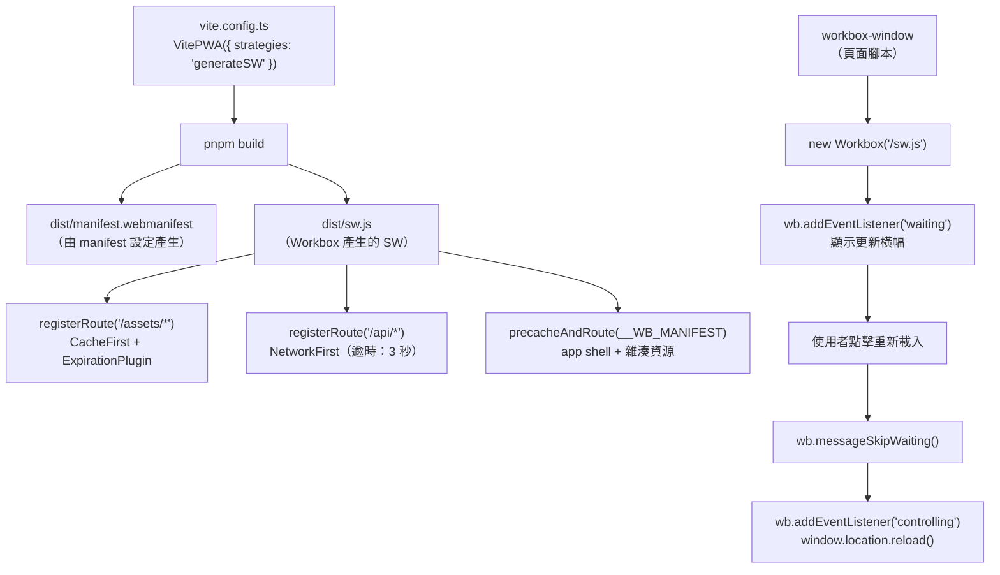

# [FEE-1304] Workbox 與 PWA 工具鏈

## 簡介

手刻一個 production 等級的 service worker 是可行的，但每次都要解決同一組問題：管理 cache 名稱與版本、實作能正確 clone response 並防止快取錯誤狀態碼的策略函式、限制動態快取的成長、建立 precache manifest 以便在部署後取得更新的資源、以及測試只有在離線狀態才會觸發的 fallback 路徑。這些問題在概念上並不困難，但累積起來就很可觀。針對中等複雜度的應用程式，手刻的 service worker 在出現任何應用程式專屬的 routing 邏輯之前，就已經膨脹成數百行防禦性的樣板程式碼。Workbox 正是為了解決這種累積而誕生的：它是由 Chrome 團隊維護的一組函式庫，將 FEE-1303 的五種快取策略實作為具名類別、加入 cache 過期與廣播更新的外掛機制，並從建置輸出中自動產生 precache manifest。

Workbox 並不能取代對原始 Cache API 與 service worker 生命週期的理解。FEE-1302 與 FEE-1303 的概念——install 與 activate 生命週期、`fetch` event handler 作為網路代理的角色、五種快取策略及其取捨、response clone 的必要性、opaque response 的風險——在 Workbox 中仍然存在。Workbox 將這些概念封裝起來，但並沒有隱藏它們：當 Workbox 驅動的 service worker 出現問題時，診斷失敗需要閱讀 Workbox 的 `runtimeCaching` 設定，並將其對應回原始行為。跳過 FEE-1302 和 FEE-1303 直接使用 Workbox 的團隊，將會遇到神秘的錯誤，且沒有推理框架可以分析它們。

Workbox 生態系統分為兩層。下層是 Workbox 函式庫本身：`workbox-strategies`、`workbox-routing`、`workbox-precaching`、`workbox-expiration`、以及 `workbox-window`。這些套件可以直接從開發者撰寫的自訂 service worker 檔案中匯入。上層是建置工具整合：Vite 生態系專用的 `vite-plugin-pwa`（支援 React、Vue、Svelte 等），以及 Next.js 專用的 `@ducanh2912/next-pwa`。這些整合讀取設定物件，並產生完整的 service worker 檔案與 web app manifest 作為建置輸出。多數 production 團隊在上層作業，將下層的決策委託給設定，只有在需要建置工具整合無法表達的自訂邏輯時，才會直接匯入 Workbox 套件。

## 設計思考

### Workbox 策略作為 FEE-1303 的程式碼層級對應

FEE-1303 的五種策略直接對應到 `workbox-strategies` 套件中的五個 Workbox 類別。這些類別實作了 FEE-1303 描述的相同控制流程，並在其上疊加了額外功能：用於過期、廣播更新與背景同步的外掛 hook、`NetworkFirst` 的可設定網路逾時、每個策略實例的具名快取，以及能理解 URL 模式與請求目的地類型的請求比對機制。

`new CacheFirst({ cacheName: 'assets', plugins: [new ExpirationPlugin({ maxEntries: 100, maxAgeSeconds: 30 * 24 * 60 * 60 })] })` 是 FEE-1303 原始 `cacheFirst()` 函式的 production 形式。策略類別處理了 response clone、`cache.put()` 前的 `response.ok` 檢查，以及透過 `ExpirationPlugin` 實現的有界驅逐政策（原始實作需要開發者自行撰寫）。`maxAgeSeconds` 值 `30 * 24 * 60 * 60` 是 30 天換算成秒；`maxEntries: 100` 將快取上限設為 100 個條目，超過時刪除最少使用的條目。

`new NetworkFirst({ networkTimeoutSeconds: 3 })` 在 network-first 控制流程中加入了可設定的逾時。在原始實作中，策略在回退到快取之前會無限等待網路。在 Workbox 中，`networkTimeoutSeconds: 3` 表示策略在三秒後放棄網路請求，並立即回傳快取的 response（如果存在的話）。這對於網速較慢的連線使用者體驗至關重要：沒有逾時的情況下，一個需要 15 秒才能回應的惡化網路，會強迫使用者等待 15 秒後才出現離線 fallback。

`new StaleWhileRevalidate({ cacheName: 'images' })` 用相同的外掛系統包裝了 stale-while-revalidate 模式。搭配 `ExpirationPlugin` 可以限制圖片快取：`new StaleWhileRevalidate({ cacheName: 'images', plugins: [new ExpirationPlugin({ maxEntries: 60, maxAgeSeconds: 30 * 24 * 60 * 60 })] })`。沒有外掛的話，圖片快取會隨著應用程式載入的每個唯一圖片 URL 而成長，在內容豐富的應用程式上，可能會耗盡來源的儲存配額。

`new CacheOnly()` 和 `new NetworkOnly()` 完成了五策略組合。`CacheOnly` 用於 `install` handler 保證已在快取中的 precache app shell 資源。`NetworkOnly` 是對 mutation 和即時請求「不攔截」行為的明確形式。在 Workbox routing 中，未匹配的請求會傳遞給瀏覽器原生的 fetch 行為，等同於 Network-Only。當 Workbox 路由出於其他原因（例如記錄）必須匹配某個 URL 模式，但不應快取 response 時，明確的 `NetworkOnly` 策略才有其用武之地。

`registerRoute(matcher, strategy)` 是原始 fetch handler 中 routing 邏輯的 Workbox 等效物。matcher 可以是 `RegExp`、字串、`Request.destination` 值，或接收 `({ url, request, event })` 並回傳布林值的自訂函式。當 service worker 收到 fetch 事件時，Workbox 按照註冊順序評估每條已註冊路由的 matcher，並套用第一個匹配的策略。這與 FEE-1303 原始 fetch handler 中的提前返回守衛評估順序相同，因此同樣的規則適用：在較不具體的 matcher 之前先註冊較具體的 matcher。

### `vite-plugin-pwa` 整合

`vite-plugin-pwa` 是 Vite 生態系對 Workbox 的封裝。它作為 Vite 外掛安裝，並在 `vite.config.ts` 中設定。單一設定物件會產生兩個建置輸出：`manifest.webmanifest` 檔案（讓應用程式可安裝的 web app manifest），以及包含 Workbox routing、策略設定，以及所有建置輸出資源 precache manifest 的 service worker 檔案。

外掛以兩種截然不同的模式運作，由 `strategies` 選項選擇：

| 模式 | Workbox 的工作 | 你的 SW 檔案 | 使用時機 |
|------|----------------|-------------|--------|
| `generateSW` | Workbox 根據設定撰寫整個 SW 檔案 | 無——完全自動產生 | 僅需標準快取；不需要自訂 fetch 邏輯 |
| `injectManifest` | 你撰寫 `src/sw.ts`；Workbox 將 precache manifest 注入為 `self.__WB_MANIFEST` | 必要——你自行撰寫 | 需要在快取旁邊加入 auth token 注入、自訂分析或 A/B routing 等邏輯 |

在 `generateSW` 模式下，service worker 完全由 `vite.config.ts` 中的 `workbox` 設定物件衍生而來。開發者永遠不需要撰寫 `.js` 或 `.ts` 的 service worker 檔案。外掛將 `runtimeCaching` 陣列條目映射為 `registerRoute` 呼叫，並將 `manifest` 物件映射為產生的 `.webmanifest` 檔案。這個模式適用於大多數 production 應用程式，在這些應用程式中，快取是唯一的 service worker 關切點。

在 `injectManifest` 模式下，開發者建立 service worker 原始碼檔案（慣例上為 `src/sw.ts`），並直接從 `workbox-routing`、`workbox-strategies` 和 `workbox-precaching` 匯入。建置步驟將原始碼檔案中的 `self.__WB_MANIFEST` 佔位符替換為實際的 precache manifest——一個由建置輸出產生的 `{ url, revision }` 物件陣列。當 service worker 必須做快取路由以外的事情時，這個模式是必要的：在 API 請求中注入 Authorization header、在分析事件離開用戶端之前轉送，或根據功能旗標將請求路由到不同的後端來源。自訂邏輯和 Workbox 快取路由共存於同一個檔案中，因為開發者撰寫整個檔案。

`registerType` 選項控制應用程式如何處理 service worker 更新。`'autoUpdate'` 透過自動呼叫 `skipWaiting` 和 `clientsClaim` 立即啟用新的 service worker。`'prompt'` 不會自動啟用；它透過 `workbox-window` 發出 `waiting` 事件，讓應用程式決定何時套用更新。多數面向使用者的 production 應用程式應該使用 `'prompt'` 並顯示更新橫幅：在 session 中途靜默重載會讓使用者感到困惑，而在頁面開啟時進行的更新，如果頁面的進行中請求假設舊 API 版本，可能會產生執行期錯誤。

### Next.js 的 `@ducanh2912/next-pwa`

`@ducanh2912/next-pwa` 是原始 `next-pwa` 套件的維護社群 fork，已針對 Next.js 13+ 和 App Router 更新。它以與 `vite-plugin-pwa` 相同的方式封裝 Workbox，但整合進 `next.config.js` 而非 `vite.config.ts`。

App Router 引入了一個 Pages Router 中不存在的結構性考量：`/app/` 目錄結構。預設情況下，Next.js 從 `/app/` 路徑命名空間內提供所有 App Router 路由。在 `/app/sw.js` 服務的 service worker，其範圍僅限於 `/app/*` 路徑，這排除了根路徑和所有頂層路由。service worker 必須從根路徑提供（`/sw.js`），才能具有 `/` 的範圍並攔截所有導航請求。修復方法很直接：在外掛設定中設定 `dest: 'public'`，這指示建置輸出將產生的 service worker 放置在 `public/sw.js`。Next.js 在根路徑提供 `public/` 目錄，因此 service worker 可在 `/sw.js` 以根範圍存取。

外掛還需要使用 `disable: process.env.NODE_ENV === 'development'` 停用 Next.js 的預設 service worker 處理。在開發模式下執行快取 service worker 會導致對開發建置資源的過時服務，這破壞了熱模組替換並使除錯變得非常混亂。`disable` 選項在開發中 SHOULD 始終評估為 `true`，在 production 中評估為 `false`。

### `workbox-window` 與更新偵測生命週期

`workbox-window` 是在頁面 context 中（而非 service worker 執行緒中）執行的配套函式庫。它提供一個 `Workbox` 類別，用於管理 service worker 的註冊，並將原始 service worker 生命週期事件（`installing`、`installed`、`waiting`、`activating`、`activated`、`controlling`）包裝成更高層次的事件系統，從應用程式程式碼的角度來看更容易推理。

對於 production PWA 而言，最重要的事件是 `waiting`。當新的 service worker 已安裝但因舊 service worker 仍控制著開啟的分頁而無法啟用時，`waiting` 事件就會觸發。這是標準的 service worker 更新機制：瀏覽器不會在任何用戶端（分頁）仍在使用舊版本時啟用新的 worker。如果使用者從未關閉分頁，`waiting` 狀態可能會無限期持續。不向使用者呈現此狀態的應用程式，對於從不關閉分頁的使用者來說，將永遠停留在舊版本。

當新的 service worker 接管頁面控制權時——也就是呼叫 `skipWaiting` 且新 worker 成為活躍控制器後——`controlling` 事件就會觸發。此時頁面的 fetch handler 是新 service worker 的 handler，頁面應該重載以確保所有記憶體中的狀態和網路請求都與新版本一致。在 `controlling` 事件 handler 中呼叫 `window.location.reload()` 是確保乾淨過渡的標準模式。

從更新偵測到使用者重載的流程如下：

1. 瀏覽器在背景安裝新的 service worker（使用者看不到任何東西）。
2. 新的 service worker 進入 `waiting` 狀態，因為舊的 service worker 仍在控制頁面。
3. `workbox-window` 在頁面的 `Workbox` 實例上觸發 `waiting` 事件。
4. 應用程式向使用者顯示更新橫幅。
5. 使用者點擊「重新載入」。
6. 應用程式呼叫 `wb.messageSkipWaiting()`，這向等待中的 service worker 發送訊息，指示它呼叫 `self.skipWaiting()`。
7. 新的 service worker 啟用並接管控制。
8. `workbox-window` 觸發 `controlling` 事件。
9. 應用程式呼叫 `window.location.reload()`。
10. 頁面在新的 service worker 下重載。

這個使用 `workbox-window` 實作的流程，是更新管理的正確 production 模式。替代方案——`vite-plugin-pwa` 中的 `registerType: 'autoUpdate'`，它在沒有使用者確認的情況下自動呼叫 `skipWaiting`——適用於更新內容純屬累加且 session 中途啟用不會中斷任何進行中狀態的應用程式。對於大多數應用程式，提示使用者更為安全。

### 決策表：原始 SW vs. `generateSW` vs. `injectManifest`

| 需求 | 工具 |
|------|------|
| 學習、除錯、了解 Workbox 抽象了什麼 | 原始 SW（FEE-1302/1303） |
| 僅需標準快取——資源、API、導航 | `vite-plugin-pwa` 搭配 `generateSW` |
| 需要自訂邏輯（auth、分析、A/B）與快取並存 | `vite-plugin-pwa` 搭配 `injectManifest` |
| Next.js 專案 | `@ducanh2912/next-pwa` |

這個表格是起點，不是嚴格規則。需要自訂 service worker 邏輯的 Next.js 專案可以搭配 `@ducanh2912/next-pwa` 使用 `injectManifest` 模式——外掛支援這個選項。完全不需要快取的 Vite 專案可能完全跳過 `vite-plugin-pwa`，只為 web app manifest 和推播通知註冊一個小型手刻 service worker。決策表涵蓋常見案例；真實專案會有將它們推向邊緣的約束條件。

### Precache manifest 與資源版本控制

Workbox 建置工具整合的最重要功能之一，是自動產生 precache manifest。當 `vite-plugin-pwa` 在 `generateSW` 模式下執行時，它掃描建置輸出（`dist/`），並為每個應該被 precache 的檔案產生 `{ url, revision }` 物件陣列：HTML 進入點、雜湊的 JS 和 CSS bundle、字型，以及 `globPatterns` 選項中列出的任何其他靜態資源。`revision` 欄位是檔案內容的雜湊值。

當 service worker 安裝時，`precacheAndRoute(self.__WB_MANIFEST)` 將所有 manifest 條目加入 precache。在後續部署時，Workbox 比較新 manifest 與快取的 manifest。`revision` 雜湊已更改的檔案會被重新取得並更新。`revision` 未更改的檔案保持不變。已從 manifest 中移除的檔案會從快取中刪除。這種增量更新機制意味著部署只取得實際更改的資源，而不是整個應用程式 shell，對於大型應用程式而言，這大幅減少了更新頻寬。

`precacheAndRoute` 呼叫還為每個 precached URL 註冊 Cache-Only 路由，因此對 `/` 的導航請求、雜湊 bundle 的 CSS 請求，以及所有其他 precached 資源，都從快取提供而不諮詢網路。這是 Workbox 產生的 service worker 為重訪提供即時載入，並為 app shell 提供完整離線功能的機制：一旦 install handler 完成，precached 資源就可以在本地取得。

### 快取命名慣例與快取檢視

Workbox 對所有儲存使用具名快取。預設情況下，快取名稱遵循 precache 的 `workbox-precache-v2-<origin>` 模式，以及 runtime cache 的 `cacheName` 選項值。為 runtime cache 使用描述性的版本化名稱：`assets-cache-v1`、`api-cache-v1`、`image-cache-v1`。當部署需要為某類資源採用不同的快取政策時（例如，將圖片過期從 30 天改為 7 天），遞增快取版本後綴。舊的快取條目會在下次 service worker 啟用時由 Workbox 的快取清理機制自動清除。

在 Chrome DevTools 中，Application 面板的 Cache Storage 區段列出所有具名快取及其條目。這是驗證 Workbox 是否寫入正確快取，以及 `ExpirationPlugin` 是否強制執行設定限制的主要工具。載入幾張圖片後，開啟 `image-cache-v1` 快取，確認條目數不超過 `maxEntries`。部署後重載頁面，檢查 `workbox-precache-v2` 快取，確認更新的資源存在且已移除的資源已消失。

## 最佳實踐

**必須（MUST）在每條 `CacheFirst` 路由上搭配 `ExpirationPlugin`。** 沒有過期設定的 `CacheFirst` 路由是快取洩漏——每個符合路由的唯一 URL 都會在具名快取中新增一個永久條目。團隊必須（MUST）為每個快取設定 `maxEntries` 上限（JS/CSS 資源 100；圖片 60）和 `maxAgeSeconds`，因為瀏覽器基於配額的驅逐機制無法作為管理策略加以依賴。

**應該（SHOULD）使用 `registerType: 'prompt'` 搭配明確的更新橫幅。** Session 中途自動更新 service worker，可能會在使用者有進行中的 API 請求或與新版本不一致的快取狀態時導致頁面中斷。團隊應該（SHOULD）使用 `'prompt'` 模式讓應用程式控制新 service worker 的啟用時機，當 `waiting` 事件觸發時顯示橫幅，並在使用者確認後呼叫 `wb.messageSkipWaiting()`。

**禁止（MUST NOT）在 service worker 需要自訂請求變更邏輯時使用 `generateSW`。** Auth token 注入、A/B 路由和自訂分析無法以宣告式的 `generateSW` 設定表達。團隊必須（MUST）在這類情況下使用 `injectManifest` 模式；當所有快取行為都能以資料形式表達在 `vite.config.ts` 時，`generateSW` 才是合適的選擇。

**必須（MUST）在所有 `NetworkFirst` 路由上設定 `networkTimeoutSeconds`。** 沒有逾時的情況下，`NetworkFirst` 路由會等待網路直到傳輸層逾時，通常是 30 到 60 秒。團隊必須（MUST）為導航和 API 路由設定 `networkTimeoutSeconds: 3`，確保網路惡化的使用者能快速看到快取的回應，而非等待整個逾時。

**應該（SHOULD）設定 `globPatterns` 以匹配你的實際建置輸出。** 未被 `globPatterns` 匹配的資源不會包含在 precache manifest 中，在離線時將無法使用。團隊應該（SHOULD）在建置後稽核 `dist/` 目錄，確認應用程式離線運作所需的每個檔案都在 precache manifest 中或被 runtime cache 路由涵蓋。

**必須（MUST）在 `@ducanh2912/next-pwa` 中設定 `dest: 'public'` 並在開發中停用。** 團隊必須（MUST）將產生的 service worker 輸出到 `public/` 使其以根範圍 `/sw.js` 提供，並必須（MUST）設定 `disable: process.env.NODE_ENV === 'development'` 以防止快取 service worker 破壞熱模組替換。這兩個設定都不是預設值，忘記任何一個都會產生難以診斷的微妙錯誤。

**禁止（MUST NOT）在 precache 和 runtime cache 中同時註冊相同的 URL 模式。** `precacheAndRoute` 為所有 precached URL 註冊 Cache-Only 路由，runtime cache 路由若也匹配 precached URL 會覆蓋 Cache-Only 路由導致 precached 條目永遠不被提供。團隊禁止（MUST NOT）讓 precached URL 和 runtime cache 模式重疊。

**應該（SHOULD）使用 `workbox-window` 進行更新偵測，而非原始的 `navigator.serviceWorker` 事件。** `workbox-window` 規範化了相同版本重載和首次安裝等邊緣案例，只在更新真正可用且待處理時提供 `waiting` 事件。團隊應該（SHOULD）使用 `workbox-window` 以避免手動處理這些容易混淆的邊緣案例。

**應該（SHOULD）在部署前在 staging 環境驗證更新流程。** 團隊應該（SHOULD）建置 production bundle 兩次並比較產生的 service worker 檔案，確認 precache manifest 雜湊值是穩定的。非確定性建置產生的 service worker 可能在每次部署時看起來都有更新，或即使應用程式已更改也無法更新。

## 圖解

以下圖表展示了 `generateSW` 模式下的 `vite-plugin-pwa` 建置管道，以及執行期的 `workbox-window` 更新偵測流程。



## 範例

以下範例是在 `generateSW` 模式下的完整 `vite-plugin-pwa` 設定，包含三條 runtime cache 路由，以及使用 `workbox-window` 的 React 更新橫幅元件。

### `vite.config.ts`

```ts
// vite.config.ts
import { defineConfig } from 'vite';
import react from '@vitejs/plugin-react';
import { VitePWA } from 'vite-plugin-pwa';

export default defineConfig({
  plugins: [
    react(),
    VitePWA({
      // 不要自動啟用；讓 UpdateBanner 元件控制時機。
      registerType: 'prompt',

      // generateSW：Workbox 根據此設定撰寫整個 service worker。
      // 如果 SW 需要自訂請求變更邏輯，請切換到 'injectManifest'。
      strategies: 'generateSW',

      workbox: {
        // /assets/ 中的資源具有內容雜湊的 URL。CacheFirst 是安全的，因為
        // 內容更改會產生新的 URL（雜湊更改），所以快取命中始終是正確的。
        // ExpirationPlugin 防止快取無限成長。
        runtimeCaching: [
          {
            urlPattern: /\/assets\/.*/i,
            handler: 'CacheFirst',
            options: {
              cacheName: 'assets-cache-v1',
              expiration: {
                maxEntries: 100,
                maxAgeSeconds: 365 * 24 * 60 * 60, // 1 年
              },
            },
          },
          // API response 在連線時的每次載入都需要最新資料。
          // networkTimeoutSeconds: 3 確保網路惡化的使用者快速看到快取的 response，
          // 而不是等待 30 秒的逾時。
          {
            urlPattern: /\/api\/.*/i,
            handler: 'NetworkFirst',
            options: {
              cacheName: 'api-cache-v1',
              networkTimeoutSeconds: 3,
              expiration: {
                maxEntries: 50,
                maxAgeSeconds: 5 * 60, // 5 分鐘
              },
            },
          },
          // 圖片：一次請求的延遲是可以接受的。StaleWhileRevalidate 立即回傳快取的圖片，
          // 並在背景更新。
          {
            urlPattern: /\.(?:png|jpg|jpeg|svg|gif|webp)$/i,
            handler: 'StaleWhileRevalidate',
            options: {
              cacheName: 'image-cache-v1',
              expiration: {
                maxEntries: 60,
                maxAgeSeconds: 30 * 24 * 60 * 60, // 30 天
              },
            },
          },
        ],
      },

      manifest: {
        name: 'Acme Task Manager',
        short_name: 'Acme Tasks',
        start_url: '/?source=pwa',
        display: 'standalone',
        theme_color: '#3b82f6',
        background_color: '#ffffff',
        icons: [
          { src: '/icons/icon-192.png', sizes: '192x192', type: 'image/png' },
          { src: '/icons/icon-512.png', sizes: '512x512', type: 'image/png' },
          {
            src: '/icons/icon-512-maskable.png',
            sizes: '512x512',
            type: 'image/png',
            purpose: 'maskable',
          },
        ],
      },
    }),
  ],
});
```

### 更新橫幅：`src/components/UpdateBanner.tsx`

```tsx
// src/components/UpdateBanner.tsx
import { useEffect, useState } from 'react';
import { Workbox } from 'workbox-window';

export function UpdateBanner() {
  const [showBanner, setShowBanner] = useState(false);
  const [wb, setWb] = useState<Workbox | null>(null);

  useEffect(() => {
    // Service worker 在開發模式或不支援該 API 的瀏覽器中無法使用。
    if (!('serviceWorker' in navigator)) return;

    const workbox = new Workbox('/sw.js');

    // 當新的 service worker 已安裝但因此分頁仍使用舊版本而無法啟用時，
    // 'waiting' 事件就會觸發。顯示橫幅讓使用者選擇何時套用更新。
    workbox.addEventListener('waiting', () => {
      setShowBanner(true);
    });

    workbox.register();
    setWb(workbox);
  }, []);

  function handleUpdate() {
    if (!wb) return;

    // 當新的 service worker 啟用並接管頁面控制時，重載頁面
    // 以確保所有資源和記憶體狀態都與新版本一致。
    wb.addEventListener('controlling', () => {
      window.location.reload();
    });

    // 向等待中的 service worker 發送訊息，告訴它呼叫 self.skipWaiting()。
    // 這觸發啟用，然後上面的 'controlling' 事件。
    wb.messageSkipWaiting();
  }

  if (!showBanner) return null;

  return (
    <div className="fixed bottom-4 left-4 right-4 bg-blue-600 text-white p-4 rounded-lg flex items-center justify-between shadow-lg">
      <span>有新版本可用。</span>
      <button
        onClick={handleUpdate}
        className="px-3 py-1 bg-white text-blue-600 rounded font-medium hover:bg-blue-50 transition-colors"
      >
        重新載入
      </button>
    </div>
  );
}
```

### `injectManifest` 模式：`src/sw.ts`

以下展示了為 `injectManifest` 模式撰寫的 service worker 結構。只有在 service worker 需要超出快取路由的自訂邏輯時才需要這個。

```ts
// src/sw.ts（僅在 injectManifest 模式下使用）
import { precacheAndRoute, cleanupOutdatedCaches } from 'workbox-precaching';
import { registerRoute } from 'workbox-routing';
import { CacheFirst, NetworkFirst, StaleWhileRevalidate } from 'workbox-strategies';
import { ExpirationPlugin } from 'workbox-expiration';

declare const self: ServiceWorkerGlobalScope;

// __WB_MANIFEST 在建置時被替換為從 dist/ 輸出產生的 precache 條目陣列。
// 沒有這個呼叫，app shell 就不會被 precache，HTML 進入點的離線支援就無法運作。
precacheAndRoute(self.__WB_MANIFEST);

// 清理舊版 service worker 建立的快取。
cleanupOutdatedCaches();

// 自訂邏輯：在所有 API 請求中注入 Authorization header。
// 這是需要 injectManifest 的使用案例——它無法在 generateSW 的
// runtimeCaching 設定中表達，因為該設定不支援請求變更。
self.addEventListener('fetch', (event) => {
  const url = new URL(event.request.url);
  if (url.pathname.startsWith('/api/')) {
    const token = /* 從 IndexedDB 或全域變數取得 token */ '';
    if (token) {
      const modifiedRequest = new Request(event.request, {
        headers: new Headers({
          ...Object.fromEntries(event.request.headers.entries()),
          Authorization: `Bearer ${token}`,
        }),
      });
      // 在變更請求後，交給 Workbox 的 NetworkFirst handler 處理。
      event.respondWith(
        new NetworkFirst({
          cacheName: 'api-cache-v1',
          networkTimeoutSeconds: 3,
          plugins: [new ExpirationPlugin({ maxEntries: 50, maxAgeSeconds: 5 * 60 })],
        }).handle({ event, request: modifiedRequest })
      );
      return;
    }
  }
});

// 非 API 資源的標準 runtime cache 路由。
registerRoute(
  ({ url }) => url.pathname.startsWith('/assets/'),
  new CacheFirst({
    cacheName: 'assets-cache-v1',
    plugins: [new ExpirationPlugin({ maxEntries: 100, maxAgeSeconds: 365 * 24 * 60 * 60 })],
  })
);

registerRoute(
  ({ request }) => request.destination === 'image',
  new StaleWhileRevalidate({
    cacheName: 'image-cache-v1',
    plugins: [new ExpirationPlugin({ maxEntries: 60, maxAgeSeconds: 30 * 24 * 60 * 60 })],
  })
);
```

### `@ducanh2912/next-pwa` 設定

```ts
// next.config.ts
import withPWA from '@ducanh2912/next-pwa';

const nextConfig = withPWA({
  // 將產生的 service worker 輸出到 public/，以便在根範圍以 /sw.js 提供。
  // 如果 dest 不是 'public'，App Router 的 /app/ 目錄結構會將 SW 範圍
  // 限制在 /app/*，這排除了根路徑導航。
  dest: 'public',

  // 在開發中永遠不執行快取 service worker。HMR 需要未快取的網路 response；
  // 快取 SW 會破壞熱模組替換。
  disable: process.env.NODE_ENV === 'development',

  // 使用 'prompt' 以匹配上面的 UpdateBanner 模式。
  register: false, // 透過 UpdateBanner 中的 workbox-window 手動註冊
  skipWaiting: false, // 不要自動啟用；讓 workbox-window 控制

  workboxOptions: {
    runtimeCaching: [
      {
        urlPattern: /\/api\/.*/i,
        handler: 'NetworkFirst',
        options: {
          cacheName: 'api-cache-v1',
          networkTimeoutSeconds: 3,
          expiration: { maxEntries: 50, maxAgeSeconds: 5 * 60 },
        },
      },
      {
        urlPattern: /\.(?:png|jpg|jpeg|svg|gif|webp)$/i,
        handler: 'StaleWhileRevalidate',
        options: {
          cacheName: 'image-cache-v1',
          expiration: { maxEntries: 60, maxAgeSeconds: 30 * 24 * 60 * 60 },
        },
      },
    ],
  },
})({
  // 你的 Next.js 設定放這裡
});

export default nextConfig;
```

## 常見錯誤

**在不了解其影響的情況下設定 `registerType: 'autoUpdate'`。** `'autoUpdate'` 讓 `vite-plugin-pwa` 在新的 service worker 安裝時自動呼叫 `skipWaiting`，使新的 service worker 在 session 中途啟用，可能在使用者有進行中的 API 請求、開啟的表單草稿，或與新版本不一致的快取狀態時。對於 service worker 版本必須匹配 API 版本，或新版本更改快取 schema 的應用程式，自動更新可能導致靜默的資料損壞或執行期錯誤。除非應用程式在 session 中途真的是更新安全的，否則使用 `'prompt'` 和明確的更新橫幅。

**在重載之前未監聽 `controlling` 事件。** 在更新橫幅模式中，呼叫 `wb.messageSkipWaiting()` 向等待中的 service worker 發送訊息，但新的 service worker 不會立即接管頁面。如果應用程式在 `messageSkipWaiting()` 後立即呼叫 `window.location.reload()` 而不等待 `controlling` 事件，重載可能在新的 service worker 啟用之前發生，重載的頁面繼續由舊的 service worker 控制。始終在 `controlling` 事件 handler 內部重載：`wb.addEventListener('controlling', () => window.location.reload())`。

## 相關 FEE

- [FEE-1302：Service Worker](./1302.md) — Workbox 抽象的原始 API；涵蓋 Workbox 運作其中的 install、activate 和 fetch 生命週期
- [FEE-1303：快取策略](./1303.md) — Workbox 實作為具名類別的五種策略；了解原始控制流程是診斷 Workbox 設定錯誤的先決條件
- [FEE-1307：PWA 上線實務](./1307.md) — 更新策略、`skipWaiting`、`clientsClaim`，以及 Workbox 工具鏈所支援的更廣泛 production 部署考量

## 參考資料

- [Workbox 文件](https://developer.chrome.com/docs/workbox) — 所有 Workbox 套件的權威參考，包括 `workbox-strategies`、`workbox-routing`、`workbox-precaching`、`workbox-expiration` 和 `workbox-window`；包含 API 參考和主要版本間的遷移指南
- [vite-plugin-pwa 文件](https://vite-pwa-org.netlify.app/) — 涵蓋 `generateSW` 和 `injectManifest` 模式、`registerType` 選項、`globPatterns` 設定，以及框架整合（React、Vue、Svelte）的虛擬模組 API
- [workbox-window API 參考](https://developer.chrome.com/docs/workbox/reference/workbox-window/) — 記錄 `Workbox` 類別建構子、所有生命週期事件（`installed`、`waiting`、`controlling`、`activated`），以及 `messageSkipWaiting` 方法
- [@ducanh2912/next-pwa 文件](https://ducanh2912.github.io/next-pwa/) — 涵蓋 App Router 和 Pages Router 設定、`dest` 選項、`workboxOptions`，以及維護 fork 與原始 `next-pwa` 套件的差異
- [web.dev：Workbox 概覽](https://web.dev/articles/workbox) — Workbox 套件架構的概念性概述；解釋 `workbox-routing`、`workbox-strategies` 與建置工具之間的關係
- [Chrome DevTools：Service Workers 面板](https://developer.chrome.com/docs/devtools/progressive-web-apps/) — 如何檢視已註冊的 service worker、強制更新和略過網路、查看 cache storage，以及在開發期間手動觸發更新流程
- [web.dev：Service worker 生命週期](https://web.dev/articles/service-worker-lifecycle) — installing、waiting、activating 和 controlling 狀態的規範性描述，`workbox-window` 事件映射到這些狀態；對於理解 `controlling` 事件為何在特定時機觸發至關重要
