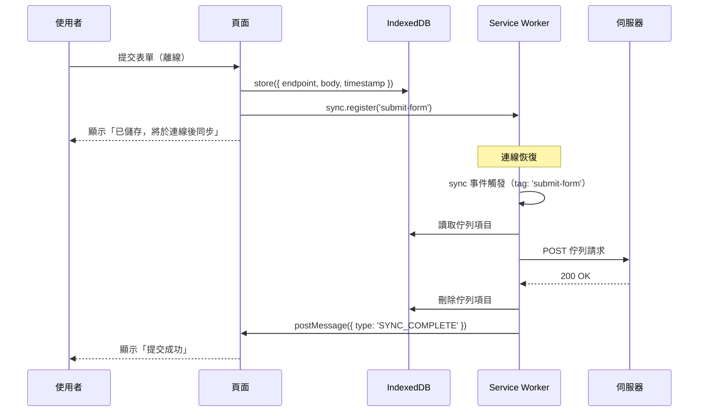

# [FEE-1305] 離線 UX 模式

## 簡介

離線狀態並非例外情況。行動網路在隧道、電梯和偏遠地區會斷線。Wi-Fi 可能連上路由器，但路由器本身沒有對外的網路連線——這種情況稱為「lie-fi」。企業代理伺服器可能對特定外部主機回傳錯誤。企業 VPN 可能在 session 中途斷線。Android 的省電模式有時會節流甚至停用無線電模組。任何服務真實使用者的應用程式，在任何時刻都可能遇到離線或網路降級的使用者。問題不是你的應用程式是否會遇到這種情況，而是遇到時會怎麼處理。

瀏覽器對離線導航請求的預設回應是顯示恐龍遊戲（Chrome）或錯誤頁面（Firefox/Safari）。這些預設的錯誤頁面對於完全沒有處理離線情況的頁面來說是合適的——它們能清楚地傳達網路不可用的訊息。但對於已安裝 service worker、註冊了快取策略、並宣告自己是 PWA 的 web 應用程式而言，顯示瀏覽器的預設離線頁面，是應用程式對使用者合約的一種違背。它傳達的訊號是：這個應用程式不在乎你的離線體驗。使用者是感受得到的。

良好的離線 UX 並不需要完整的離線能力。大多數應用程式不需要在完全沒有網路的情況下運作——這是一個高複雜度的目標，需要衝突解決策略，對大多數團隊來說超出範圍。每個 PWA 真正需要的是：當網路不可用時，清楚地通知使用者；提供優雅的 fallback 而非空白螢幕；以及——對於寫入密集型應用程式——一種在離線狀態接受使用者輸入、並在連線恢復後進行同步的機制。這三種能力只需要相對少量的 API 即可實現：`online`/`offline` window 事件、由 service worker 提供的 precache fallback 頁面、樂觀本地狀態管理，以及 Background Sync API。本文逐一介紹這些內容。

## 原則

離線是一種狀態，不是錯誤。應用程式 MUST 清楚地向使用者傳達網路狀態，且 MUST NOT 在網路不可用時顯示空白螢幕或原始的 fetch 錯誤。每個註冊了 service worker 的應用程式 SHOULD 定義明確的離線 fallback——至少要有一個快取頁面，告訴使用者他們目前離線，並說明哪些功能仍然可用。離線 fallback 頁面 MUST 在 service worker 的 `install` 事件期間進行 precache；依賴執行期的快取命中，意味著無法保證 fallback 在需要時可用。

應用程式 SHOULD 優先採用樂觀 UI 和延遲同步，而非在使用者離線時阻擋其操作。一個因為網路中斷而無法提交表單的使用者，工作被打斷了；一個提交被樂觀接受並排入同步佇列的使用者，則獲得了流暢的體驗。當佇列中的寫入在重試後永久失敗時，應用程式 MUST 回滾本地狀態並通知使用者——靜默的資料遺失比可見的錯誤訊息更糟。同步佇列 MUST 持久化至 IndexedDB，以在頁面重載和 service worker 重啟後仍能存活。MUST 提供手動重試按鈕，作為不支援 Background Sync API 之瀏覽器的 fallback，因為 iOS Safari 和部分 Firefox 設定不支援此 API。

## 設計思考

### 偵測網路狀態

瀏覽器提供了三種偵測離線狀態的機制，各有不同的成本與可靠性特性。

`navigator.onLine` 是一個布林屬性，當瀏覽器完全離線（沒有任何實體網路介面）時，其值為 `false`。問題在於，當使用者連上了路由器但該路由器沒有對外網路連線時，它會回傳 `true`。這就是 lie-fi，在行動裝置上極為常見。一個坐在咖啡廳裡但 ISP 發生中斷的使用者，或是在 LTE 訊號沒有上行路由的火車上的使用者，即使每個網路請求都會逾時或失敗，`navigator.onLine === true` 仍然成立。在關鍵寫入操作前——付款、表單提交、訊息發送——將 `navigator.onLine` 作為唯一的偵測信號，會靜默地允許操作進行，並在網路層級失敗，讓使用者陷入模糊的狀態。

`online` 和 `offline` window 事件在瀏覽器偵測到網路狀態轉換時觸發。它們具有與 `navigator.onLine` 相同的 lie-fi 限制——它們反映的是瀏覽器對網路介面的認知，而非任何特定伺服器的可達性。它們的優點是成本低：監聽這些事件並顯示或隱藏 UI 指示器，大約只需要十行 JavaScript，不需要任何網路往返。對於低風險的 UI——一個顯示「您似乎已離線」的橫幅——這個層級的信號是適當且足夠的。它會漏掉 lie-fi，但會捕捉到明確的離線情況，並在連線恢復時立即更新 UI。

探測請求（probe request）是向已知可靠端點發送帶有短暫逾時的 `HEAD` 請求。如果請求失敗或逾時，使用者實際上就是離線的。好的探測目標是你自己基礎設施上的小型資源：`/healthz`（回傳空白主體的 `200 OK` 健康檢查端點）、CDN 上的 1×1 像素 PNG，或特定的知名 URL。探測在正常情況下會增加 200–500ms 的延遲——即發送 `HEAD` 請求並接收標頭所需的時間——但它是唯一能區分 lie-fi 與真實連線能力的機制。探測應在無法透明重試的關鍵寫入操作前使用：付款表單提交、發送訊息、發布將永久歸屬於使用者的內容。

使用哪種機制的決策規則，取決於操作的風險程度：

| 信號 | 可靠性 | 延遲成本 | 使用時機 |
|------|--------|----------|---------|
| `online`/`offline` 事件 | 低——漏掉 lie-fi | 無 | 顯示「您似乎已離線」的 UI 指示器 |
| `navigator.onLine` 檢查 | 低——相同限制 | 無 | 低風險讀取前的快速防護；絕不用於寫入 |
| 探測請求（`HEAD` + 逾時） | 高 | 200–500ms | 付款、訊息發送、任何不可逆的寫入操作之前 |

### 離線 fallback 頁面

離線 fallback 頁面是一個 precache 的 HTML 文件，service worker 用它來回應任何失敗的導航請求——即發生網路錯誤且快取中無命中的情況。它不是某次訪問留下的過時內容，而是一個專為說明離線狀態而設計的頁面，告訴使用者他們可以做什麼。一個最小可行的離線 fallback 頁面應包含：網路不可用的清楚訊息、仍可離線使用的功能列表（如果有的話），以及嘗試重新載入失敗導航的重試按鈕。

關鍵限制是離線 fallback 必須在 service worker 的 `install` 事件期間進行 precache。`install` 事件是 service worker 生命週期中，瀏覽器保證 service worker 有網路存取（或可從 install cache 完成）的唯一時間點。如果 `/offline.html` 只在執行期快取——即使用者首次訪問頁面時——那麼在連線恢復前就安裝了 PWA 的使用者，將沒有可用的 fallback。在 `install` 期間進行 precache，保證 fallback 從 service worker 啟用的那一刻起就存在。

在 fetch handler 中，離線 fallback 僅適用於導航請求——即 `event.request.mode === 'navigate'` 的請求。離線後失敗的子資源請求（腳本、樣式表、圖片）應由各自的快取策略處理。對失敗的圖片請求回傳離線 HTML，會以意想不到的方式破壞頁面渲染。這個僅限導航的防護，只需要 fetch handler 中的一個 `if` 陳述式。

### 樂觀 UI

樂觀 UI 是一種在使用者執行操作時立即更新本地應用程式狀態的模式，無需等待伺服器確認寫入。使用者在網路往返完成之前就看到了成功狀態——按讚數增加、訊息出現在討論串中、草稿已儲存。對伺服器的寫入在背景異步發出。如果成功，什麼都不會改變（使用者已經看到了成功狀態）。如果暫時失敗，應用程式會重試。如果永久失敗，應用程式會回滾本地狀態並顯示錯誤。

三步驟模式是：（1）立即更新本地狀態並渲染成功狀態；（2）非同步地向伺服器發出寫入請求；（3）在永久失敗時，回滾本地狀態並通知使用者。步驟 3 是最常被跳過的步驟，跳過它會導致靜默的資料遺失。如果使用者點擊文章的「按讚」，計數增加了，但在寫入完成前使用者離線了，導致網路寫入被靜默丟棄，使用者會以為操作成功了。他們離開了頁面。按讚永遠沒有到達伺服器。這比顯示錯誤訊息還要糟糕。

樂觀 UI 的適當範圍是純附加（append-only）或冪等操作，其中永久失敗的風險較低，回滾的後果並非災難性的：社交反應、聊天介面中的訊息發送、草稿自動儲存、清單項目的新增。對於破壞性操作——刪除、轉帳、購買——樂觀 UI 應謹慎採用。付款上的假陽性成功狀態，其代價遠高於不顯示載入旋轉圖示帶來的好處。

### Background Sync API

Background Sync API 允許 web 應用程式向 service worker 註冊一個同步任務，並讓瀏覽器在連線恢復時執行該任務——即使註冊任務的頁面此後已關閉。這與在頁面 context 中重試 `fetch` 呼叫有質的不同：基於頁面的重試會在使用者導航離開時停止。Background Sync 的註冊會持久存在於瀏覽器中，直到 sync handler 成功執行。

註冊流程分為兩個部分。頁面端將待處理的寫入儲存至 IndexedDB——一種持久的、受配額管理的儲存，在頁面重載和 service worker 重啟後仍能存活——然後註冊一個 sync tag：`navigator.serviceWorker.ready.then(reg => reg.sync.register('submit-form'))`。順序很重要：IndexedDB 的寫入必須在 sync tag 註冊之前完成。sync 事件可能在註冊後非常快速地觸發（如果連線已恢復），如果在佇列為空時 sync handler 運行，這次註冊將表現為成功，但實際上沒有任何資料被發送。

service worker 端監聽 `sync` 事件：`self.addEventListener('sync', event => { if (event.tag === 'submit-form') event.waitUntil(replayQueue()) })`。`event.waitUntil()` 接收一個 Promise。如果 Promise resolve，瀏覽器認為同步完成並移除該註冊。如果 Promise reject，瀏覽器將以指數退避（exponential backoff）重試——確切的退避排程由瀏覽器控制——直到達到最大重試次數。超過最大重試次數後，sync 註冊將被丟棄。sync handler MUST 從 IndexedDB 佇列讀取資料、嘗試網路寫入，並且只有在確認收到成功回應後才刪除佇列條目。在確認前刪除意味著如果刪除後請求失敗，寫入就會遺失。

Background Sync 的瀏覽器支援情況不均，這個差距在實際應用中很重要。Chrome 和 Edge 完整支援此 API。Firefox 支援有限。iOS Safari 不支援。針對包含 iOS Safari 使用者的應用程式——這包含大多數面向消費者的 web 應用程式——不能只依賴 Background Sync 作為唯一的重試機制。fallback 模式是在 UI 上提供一個手動重試按鈕，使用者在知道自己恢復連線後可以點擊。手動重試按鈕的存在，使應用程式對所有瀏覽器都是正確的；Background Sync 是一種漸進式增強，讓支援它的瀏覽器上的體驗更加流暢。

### 唯讀 vs. 支援寫入的離線——決策表

| 方案 | 複雜度 | 適用時機 |
|------|--------|---------|
| 唯讀：提供過時的快取內容 | 低——實作 Network-First 或 Stale-While-Revalidate 快取（參見 FEE-1303） | 新聞網站、文件、儀表板——使用者可讀取快取內容但無法提交 |
| 樂觀 UI 搭配客戶端佇列 | 中——管理本地狀態、發出背景寫入、處理回滾 | 含有簡單寫入的應用程式：按讚、反應、草稿自動儲存、純附加訊息 |
| Background Sync + IndexedDB 佇列 | 中高——需要 SW sync 事件 handler、持久的 IndexedDB 佇列，以及手動重試 fallback | 必須最終成功的寫入，即使頁面在連線恢復前關閉 |
| 完整離線優先搭配衝突解決 | 高——需要 CRDT 或伺服器端合併邏輯，超出本文範圍 | Google Docs 模式的協作編輯——本文未涵蓋 |

## 最佳實踐

**必須（MUST）無條件 precache 離線 fallback 頁面。** 在 service worker 的 `install` 事件 cache open 呼叫中加入 `/offline.html`。禁止（MUST NOT）依賴執行期快取條目作為 fallback。fallback 必須在任何使用者訪問發生之前就已可用。

**應該（SHOULD）在上線前於 DevTools 中測試離線 fallback。** 開啟 DevTools，前往 Application > Service Workers，勾選「Offline」，然後導航至未快取的路由。離線頁面必須（MUST）出現。如果出現瀏覽器的預設錯誤頁面，表示 fallback 未正常運作。

**禁止（MUST NOT）混淆離線指示器與離線 fallback。** `online`/`offline` 事件監聽器驅動的是 UI 指示器（橫幅、狀態標示），告訴使用者他們在目前頁面的網路狀態。離線 fallback 是用於替換失敗導航請求的整頁內容。這是兩種不同機制，服務於兩種不同目的；實作其中一個並不代表實作了另一個。

**必須（MUST）將 sync 佇列保存在 IndexedDB 中，而非 sessionStorage 或記憶體中。** 儲存在記憶體中的佇列，在頁面重新整理時會遺失。儲存在 sessionStorage 中的佇列，在瀏覽器分頁關閉時會遺失。只有 IndexedDB 在頁面重載和 service worker 重啟後都能存活。`idb` 函式庫（Jake Archibald）提供了一個乾淨的 Promise-based 包裝器，包裝了原始的 IndexedDB API，並大幅減少了樣板程式碼。

**必須（MUST）在 IndexedDB 寫入之後再註冊 sync tag，而非之前。** sync 事件可能在網路已可用的情況下，於註冊後幾乎立即觸發。如果 tag 在資料寫入 IndexedDB 之前就被註冊，handler 會在空的 store 上執行，並回傳一個 resolved Promise，讓瀏覽器認為同步完成。已排隊的資料之後孤立在 IndexedDB 中——沒有已註冊的 sync tag 來處理它。

**應該（SHOULD）在兩端都通知使用者佇列狀態。** 當寫入在離線時被排隊，顯示訊息：「已在本地儲存。連線恢復後將自動提交。」當同步完成（service worker 透過 `postMessage` 通知頁面），UI 必須（MUST）更新：「提交成功。」完整的往返回饋迴路可防止重複並建立信任。

**必須（MUST）為所有瀏覽器提供手動重試按鈕。** Background Sync 是漸進式增強，不是基線功能。必須（MUST）使用功能偵測包裝 sync 註冊（`'SyncManager' in window.ServiceWorkerRegistration.prototype`），並始終在 UI 中為不支援的瀏覽器使用者渲染「重試」按鈕。重試按鈕在點擊時直接從頁面讀取 IndexedDB 佇列並重放它。

**必須（MUST）在永久失敗時回滾樂觀狀態。** 定義每個操作的「永久失敗」含義：通常是不可重試的 HTTP 狀態碼（400、401、403、404、409、422）或重試預算耗盡。當偵測到永久失敗時，必須（MUST）回滾本地狀態變更，並向使用者顯示清楚的錯誤訊息，提供重試選項。

## 圖解



## 範例

以下範例分為兩個檔案：`public/sw.js` 包含離線 fallback 和 Background Sync 的 service worker 新增內容，`src/hooks/useContactForm.ts` 包含頁面端的邏輯，用於偵測離線狀態、寫入 IndexedDB，以及註冊 sync tag。

### Service worker：離線 fallback 與 Background Sync handler

```js
// public/sw.js（相關新增部分）

const OFFLINE_PAGE = '/offline.html';

// 在 install 期間 precache 離線 fallback，以確保在任何使用者
// 導航發生之前它都可用。
self.addEventListener('install', (event) => {
  event.waitUntil(
    caches.open('app-v1').then((cache) => cache.add(OFFLINE_PAGE))
  );
});

// 離線 fallback：任何失敗的導航請求（網路錯誤且快取無命中）
// 都用 precache 的離線頁面回應。
// `event.request.mode === 'navigate'` 的防護確保我們只將
// fallback 套用至完整頁面導航，而非子資源請求。
self.addEventListener('fetch', (event) => {
  if (event.request.mode === 'navigate') {
    event.respondWith(
      fetch(event.request).catch(() => caches.match(OFFLINE_PAGE))
    );
    return;
  }
  // 其他 fetch 處理（資源與 API 請求的快取策略等）
  // 會在此處註冊。
});

// Background Sync handler：在連線恢復時觸發。
// event.waitUntil() 接收一個 Promise；如果它 reject，瀏覽器
// 以指數退避重試。如果它 resolve，該註冊被移除。
self.addEventListener('sync', (event) => {
  if (event.tag === 'submit-contact-form') {
    event.waitUntil(replayContactFormQueue());
  }
});

async function replayContactFormQueue() {
  const db = await openDB('offline-queue', 1);
  const items = await db.getAll('contact-form');

  await Promise.all(
    items.map(async (item) => {
      const response = await fetch('/api/contact', {
        method: 'POST',
        headers: { 'Content-Type': 'application/json' },
        body: JSON.stringify(item.body),
      });

      // 只有在確認網路寫入成功後才刪除佇列條目。
      // 如果順序反過來——先刪除再發送——刪除後的網路失敗
      // 會讓佇列變空，寫入遺失且無法重放——這是一個微妙但關鍵的順序限制。
      if (response.ok) {
        await db.delete('contact-form', item.id);

        // 通知頁面，以便將 UI 從「已排隊」更新為「已提交」。
        const clients = await self.clients.matchAll({ type: 'window' });
        clients.forEach((client) =>
          client.postMessage({ type: 'SYNC_COMPLETE', itemId: item.id })
        );
      }
    })
  );
}
```

### 頁面端：佇列註冊與網路偵測

```ts
// src/hooks/useContactForm.ts
import { openDB } from 'idb';

export interface ContactFormData {
  name: string;
  email: string;
  message: string;
}

// Background Sync API 的功能偵測。
// Background Sync 在 Chrome 和 Edge 中受支援。Firefox 支援有限。
// iOS Safari 不支援。對不支援的環境，一律提供手動重試路徑。
const backgroundSyncSupported =
  'serviceWorker' in navigator &&
  'SyncManager' in (window.ServiceWorkerRegistration?.prototype ?? {});

async function getQueueDB() {
  return openDB('offline-queue', 1, {
    upgrade(db) {
      if (!db.objectStoreNames.contains('contact-form')) {
        db.createObjectStore('contact-form', {
          autoIncrement: true,
          keyPath: 'id',
        });
      }
    },
  });
}

export async function submitContactForm(
  data: ContactFormData
): Promise<{ queued: boolean; id?: number }> {
  // 使用探測請求而非 navigator.onLine 來偵測 lie-fi。
  // navigator.onLine 在使用者連上了沒有對外網路的路由器時仍回傳 true。
  const online = await probeConnectivity();

  if (!online) {
    // 在註冊 sync tag 之前寫入 IndexedDB。
    // 如果連線已可用，sync 事件可能在註冊後立即觸發；
    // 在寫入之前就註冊，意味著 handler 在空佇列上執行。
    const db = await getQueueDB();
    const id = await db.add('contact-form', {
      body: data,
      timestamp: Date.now(),
    });

    if (backgroundSyncSupported) {
      const reg = await navigator.serviceWorker.ready;
      await reg.sync.register('submit-contact-form');
    }
    // 如果不支援 Background Sync，項目留在 IndexedDB 中，
    // 直到使用者從 UI 手動觸發重試。

    return { queued: true, id: id as number };
  }

  // 線上路徑：直接提交。
  const response = await fetch('/api/contact', {
    method: 'POST',
    headers: { 'Content-Type': 'application/json' },
    body: JSON.stringify(data),
  });

  if (!response.ok) {
    throw new Error(`提交失敗：${response.status}`);
  }
  return response.json();
}

// 透過向已知可靠端點發送 HEAD 請求來探測連線能力。
// 如果探測本身發生意外錯誤，回退至 navigator.onLine。
async function probeConnectivity(timeoutMs = 4000): Promise<boolean> {
  try {
    const controller = new AbortController();
    const timer = setTimeout(() => controller.abort(), timeoutMs);
    const response = await fetch('/healthz', {
      method: 'HEAD',
      cache: 'no-store',
      signal: controller.signal,
    });
    clearTimeout(timer);
    return response.ok;
  } catch {
    return false;
  }
}

// 手動重試：直接從頁面讀取 IndexedDB 佇列並重放。
// 從 UI 的「重試」按鈕呼叫此函式，供不支援 Background Sync 的瀏覽器使用。
export async function replayQueueManually(): Promise<void> {
  const db = await getQueueDB();
  const items = await db.getAll('contact-form');

  for (const item of items) {
    const response = await fetch('/api/contact', {
      method: 'POST',
      headers: { 'Content-Type': 'application/json' },
      body: JSON.stringify(item.body),
    });
    if (response.ok) {
      await db.delete('contact-form', item.id);
    }
  }
}
```

### 在元件中監聽同步完成事件

```ts
// src/components/ContactForm.vue（script setup——節錄）
import { onMounted, onUnmounted } from 'vue';

function handleServiceWorkerMessage(event: MessageEvent) {
  if (event.data?.type === 'SYNC_COMPLETE') {
    // 更新 UI：「您的訊息已成功提交。」
    // 當 service worker 成功重放佇列項目並從 IndexedDB 刪除它後，此處觸發。
    syncStatus.value = 'submitted';
  }
}

onMounted(() => {
  navigator.serviceWorker?.addEventListener('message', handleServiceWorkerMessage);
});

onUnmounted(() => {
  navigator.serviceWorker?.removeEventListener('message', handleServiceWorkerMessage);
});
```

### 離線指示器（`online`/`offline` 事件）

```ts
// src/composables/useNetworkStatus.ts
import { ref, onMounted, onUnmounted } from 'vue';

export function useNetworkStatus() {
  const isOnline = ref(navigator.onLine);

  function handleOnline() { isOnline.value = true; }
  function handleOffline() { isOnline.value = false; }

  onMounted(() => {
    window.addEventListener('online', handleOnline);
    window.addEventListener('offline', handleOffline);
  });

  onUnmounted(() => {
    window.removeEventListener('online', handleOnline);
    window.removeEventListener('offline', handleOffline);
  });

  return { isOnline };
}
```

`isOnline` ref 驅動應用程式殼層中的橫幅。注意這個 composable 使用 `online`/`offline` 事件——適合用於低風險的 UI 指示器——而 `submitContactForm` 則在需要決定是直接提交還是排入佇列這個更高風險的判斷時，使用探測請求。兩種機制在同一個應用程式中共存，各司其職。

## 常見錯誤

**在關鍵寫入操作前只用 `navigator.onLine` 檢查離線狀態。** `navigator.onLine` 在 lie-fi 情況下回傳 `true`：使用者連上了沒有對外網路的 Wi-Fi 存取點。一個通過 `navigator.onLine` 檢查但隨後因網路逾時而失敗的付款表單提交，給了使用者虛假的安全感。在任何不可逆的寫入操作前，使用探測請求。

**在確認網路寫入成功之前就刪除 IndexedDB 佇列條目。** 安全的順序是：發送請求、收到 `response.ok` 確認，然後刪除佇列條目。如果順序反過來——先刪除再發送——刪除後的網路失敗讓佇列變空，寫入遺失，且無法重放。

## 相關 FEE

- [FEE-1302：Service Worker](./1302.md) — 提供離線 fallback 及接收 sync 事件的 SW fetch handler
- [FEE-1303：快取策略](./1303.md) — 離線時提供快取內容的 Network-First 與 Stale-While-Revalidate
- [FEE-404：儲存與狀態持久化](../Browser%20APIs%20and%20Web%20Platform/404.md) — IndexedDB 作為離線寫入佇列的持久儲存

## 參考資料

- MDN Web Docs — [Background Synchronization API](https://developer.mozilla.org/en-US/docs/Web/API/Background_Synchronization_API)
- MDN Web Docs — [navigator.onLine](https://developer.mozilla.org/en-US/docs/Web/API/Navigator/onLine)
- web.dev — [Offline UX design guide](https://web.dev/articles/offline-ux-design-guidelines)
- web.dev — [Offline fallback page](https://web.dev/articles/offline-fallback-page)
- Jake Archibald — [idb 函式庫](https://github.com/jakearchibald/idb) — Promise-based IndexedDB 包裝器
- Can I Use — [Background Sync API 瀏覽器支援](https://caniuse.com/background-sync)
