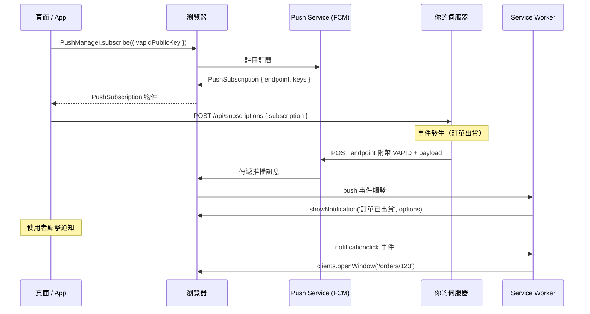

# [FEE-1306] Web 推播通知

:::info
推播通知是由伺服器發送、經瀏覽器傳遞到使用者裝置的訊息，即使 web 應用程式沒有在任何分頁中開啟也能送達。它填補了與原生應用程式之間長期存在的落差：原生應用程式十幾年來都能適時傳送訊息給使用者，而 web 過去只能在使用者主動造訪頁面時才呈現資訊。Push API（W3C 規範）以及它所依循的 Web Push 協定（IETF RFC 8030），將這種再互動能力帶到 Chrome、Firefox 與 Safari（macOS 16.1+、iOS 16.4+），且不需要使用者安裝原生應用程式。
:::

## 背景

原生應用程式自 2010 年代初期起就提供推播訊息功能；web 一直缺乏對等能力，直到 Push API 陸續在 Chrome（2015 年）、Firefox，以及後來的 macOS 版 Safari（Safari 16.1，2022 年）與 iOS 版 Safari（Safari 16.4，2023 年 3 月，僅限主畫面應用程式）上成熟為止。本文完整涵蓋命令式的 Web Push 流程：讓使用者訂閱、儲存訂閱、從伺服器發送訊息，以及在 service worker 中處理傳遞與互動。Background Sync 是一項相關但不同的能力，用於在連線恢復前延後寫入，而非通知使用者事件；該主題另於 FEE-1305 中說明，本文僅在下方的決策表格中提及。

瀏覽器不會直接接收來自你伺服器的訊息。你的伺服器改為透過瀏覽器廠商所營運的中介服務發送訊息：Chrome 對應 Firebase Cloud Messaging（FCM），Firefox 對應 Mozilla 的 push service，iOS 與 macOS 13+ 上的 Safari 則對應 Apple 以 APNs 為基礎的服務。你的伺服器使用 RFC 8030（「Generic Event Delivery Using HTTP Push」）與這些服務通訊，並以 VAPID（RFC 8292）進行驗證。由於 push service 承接了連線，你的伺服器不需要為了發送通知而追蹤 socket 或擴展 WebSocket 層，代價是延遲。沒有保證的傳遞時間：push service 可能在低電量裝置上批次處理或延遲傳遞，若訂閱端點失效，傳遞會靜默失敗。推播通知是一種再互動工具，而非即時資料通道；下方的決策表格說明何時該改用 Server-Sent Events 或 WebSocket（FEE-403）。

## 視覺對比



## 範例

以下範例分為三個檔案：用於瀏覽器端訂閱流程的 TypeScript hook、伺服器端發送邏輯的 Node.js/Express 路由，以及用於 `push` 和 `notificationclick` 處理器的 service worker。

### 步驟零：生成 VAPID 金鑰

執行一次。將私鑰儲存在你的伺服器環境中。將公鑰設為前端環境變數。

```bash
npx web-push generate-vapid-keys
```

輸出看起來像這樣：

```
Public Key:
BEl62iUYgUivxIkv69yViEuiBIa40HuFXqZ...

Private Key:
yfWVHRlz5rOXOsJI...
```

在你的伺服器環境中設定 `VAPID_PUBLIC_KEY` 和 `VAPID_PRIVATE_KEY`。在你的前端建置環境中將 `VITE_VAPID_PUBLIC_KEY` 設為公鑰值。

### 瀏覽器端：訂閱推播

```ts
// src/hooks/usePushNotifications.ts

const VAPID_PUBLIC_KEY = import.meta.env.VITE_VAPID_PUBLIC_KEY;

/**
 * 將 URL 安全 Base64 的 VAPID 公鑰字串轉換為 Uint8Array，
 * 以符合 PushManager.subscribe() applicationServerKey 參數的要求。
 *
 * 這個轉換是必要的，因為 VAPID 金鑰以 Base64 字串分發，
 * 但瀏覽器 API 需要型別陣列。URL 安全 Base64 字母表使用 '-' 和 '_'
 * 代替 '+' 和 '/'；atob() 需要標準字母表，
 * 因此替換必須在解碼之前進行。
 */
function urlBase64ToUint8Array(base64String: string): Uint8Array {
  const padding = '='.repeat((4 - (base64String.length % 4)) % 4);
  const base64 = (base64String + padding).replace(/-/g, '+').replace(/_/g, '/');
  const rawData = atob(base64);
  return new Uint8Array([...rawData].map((char) => char.charCodeAt(0)));
}

/**
 * 檢查推播通知是否受支援，以及使用者是否已授予、拒絕
 * 或尚未回應權限提示。
 *
 * 在 mount 時呼叫此函式以確定要顯示哪個 UI。
 * 不要在此呼叫 Notification.requestPermission()——只讀取目前狀態。
 */
export function getPushPermissionState(): NotificationPermission | 'unsupported' {
  if (!('Notification' in window) || !('serviceWorker' in navigator) || !('PushManager' in window)) {
    return 'unsupported';
  }
  return Notification.permission;
}

/**
 * 訂閱目前使用者接受推播通知。
 *
 * 只從使用者主動操作（按鈕點擊處理器）呼叫此函式。
 * 永遠不要在頁面載入或元件 mount 時呼叫。
 *
 * 此函式：
 *   1. 請求瀏覽器通知權限（顯示瀏覽器對話框）。
 *   2. 取得活躍的 service worker 註冊。
 *   3. 透過 PushManager.subscribe() 建立推播訂閱。
 *   4. POST 訂閱到你的伺服器進行儲存。
 *
 * 如果完整流程成功，回傳 'granted'；如果使用者拒絕了權限對話框，
 * 回傳 'denied'；如果瀏覽器不支援 Web Push，回傳 'unsupported'。
 */
export async function subscribeToPush(): Promise<'granted' | 'denied' | 'unsupported'> {
  if (getPushPermissionState() === 'unsupported') return 'unsupported';

  // 請求權限。這會顯示瀏覽器對話框。只從使用者主動觸發的事件處理器呼叫。
  const permission = await Notification.requestPermission();
  if (permission !== 'granted') return 'denied';

  // 等待活躍的 service worker。如果未註冊 SW，此 promise
  // 將永遠不會 resolve——在呼叫此函式之前確保已註冊 SW。
  const reg = await navigator.serviceWorker.ready;

  // 訂閱推播。瀏覽器聯繫 push service（依瀏覽器不同可能是 FCM、Mozilla 或 Apple）
  // 並回傳 PushSubscription 物件。
  const subscription = await reg.pushManager.subscribe({
    userVisibleOnly: true,
    applicationServerKey: urlBase64ToUint8Array(VAPID_PUBLIC_KEY),
  });

  // 將訂閱發送到你的伺服器。如果你的 API 需要，包含驗證標頭。
  const response = await fetch('/api/subscriptions', {
    method: 'POST',
    headers: { 'Content-Type': 'application/json' },
    body: JSON.stringify(subscription),
  });

  if (!response.ok) {
    // 訂閱已在瀏覽器中建立，但無法儲存在伺服器上。
    // 考慮在此呼叫 subscription.unsubscribe() 以保持瀏覽器和伺服器狀態一致。
    throw new Error(`儲存訂閱失敗：${response.status}`);
  }

  return 'granted';
}

/**
 * 取消訂閱目前使用者的推播通知。
 *
 * 呼叫 subscription.unsubscribe() 以撤銷瀏覽器端的訂閱，
 * 然後向伺服器發送 DELETE 請求以移除已儲存的訂閱。
 */
export async function unsubscribeFromPush(): Promise<void> {
  const reg = await navigator.serviceWorker.ready;
  const subscription = await reg.pushManager.getSubscription();
  if (!subscription) return;

  await subscription.unsubscribe();

  await fetch('/api/subscriptions', {
    method: 'DELETE',
    headers: { 'Content-Type': 'application/json' },
    body: JSON.stringify({ endpoint: subscription.endpoint }),
  });
}
```

### 伺服器端：發送推播通知

```js
// server/push.js（Node.js — 適用於 Express、Fastify 或任何 HTTP 框架）
import webPush from 'web-push';

// 在伺服器啟動時一次性設定 VAPID 憑證。
// 聯絡 email 會發送給 push service，以便在你的伺服器行為異常時聯繫你。
// 它不需要是公開地址。
webPush.setVapidDetails(
  'mailto:admin@acme.com',
  process.env.VAPID_PUBLIC_KEY,
  process.env.VAPID_PRIVATE_KEY
);

/**
 * 向單一訂閱發送推播通知。
 *
 * @param {object} subscription - 儲存在資料庫中的 PushSubscription 物件。
 *   必須有 endpoint、keys.p256dh 和 keys.auth。
 * @param {object} payload - 通知資料。將被 JSON 編碼。
 *   建議格式：{ title, body, icon, badge, tag, url, actions }
 *
 * @throws {WebPushError} 如果訂閱已過期或使用者已撤銷權限，
 *   statusCode 為 404 或 410。呼叫者應捕捉這些錯誤並從資料庫中刪除訂閱。
 */
export async function sendPushNotification(subscription, payload) {
  try {
    await webPush.sendNotification(subscription, JSON.stringify(payload));
  } catch (error) {
    if (error.statusCode === 404 || error.statusCode === 410) {
      // 訂閱不再有效。從資料庫中移除它，
      // 以避免未來繼續向已失效端點發送。
      await deleteSubscription(subscription.endpoint);
    } else {
      // 重新拋出意外的錯誤（網路失敗、VAPID 設定錯誤等）
      throw error;
    }
  }
}

/**
 * 範例：向指定使用者的所有訂閱發送推播。
 * 當事件發生時（如訂單出貨），由你的業務邏輯呼叫。
 */
export async function notifyUser(userId, notification) {
  const subscriptions = await getSubscriptionsForUser(userId);

  await Promise.allSettled(
    subscriptions.map((sub) => sendPushNotification(sub, notification))
  );
}
```

### 訂閱管理的 Express 路由

```js
// server/routes/subscriptions.js
import { Router } from 'express';
import { saveSubscription, deleteSubscriptionByEndpoint } from '../db/subscriptions.js';

const router = Router();

// 儲存新的推播訂閱，與已驗證的使用者關聯。
router.post('/api/subscriptions', async (req, res) => {
  const subscription = req.body;
  const userId = req.user.id; // 假設驗證中介軟體已設定 req.user

  // 驗證訂閱具有必要的欄位。
  if (!subscription?.endpoint || !subscription?.keys?.p256dh || !subscription?.keys?.auth) {
    return res.status(400).json({ error: '無效的訂閱物件' });
  }

  await saveSubscription(userId, subscription);
  res.status(201).json({ ok: true });
});

// 當使用者取消訂閱時移除推播訂閱。
router.delete('/api/subscriptions', async (req, res) => {
  const { endpoint } = req.body;
  await deleteSubscriptionByEndpoint(endpoint);
  res.status(204).end();
});

export default router;
```

### Service worker：push 與 notificationclick 處理器

```js
// public/sw.js — push 和 notificationclick 處理器
// 這些處理器應加入到處理快取的同一個 service worker 檔案中
// （透過 Workbox 或手動註冊）。

self.addEventListener('push', (event) => {
  // 解析推播 payload。如果推播沒有 payload（一個只是喚醒 SW 的
  // 「tickle」push），使用預設值。
  const data = event.data?.json() ?? {};

  const title = data.title ?? 'Acme App';
  const options = {
    body: data.body ?? '',
    icon: data.icon ?? '/icons/icon-192.png',
    badge: data.badge ?? '/icons/badge-72.png',
    // tag 去重：帶有相同 tag 的新通知替換前一個，
    // 而非在通知抽屜中增加第二個通知條目。
    tag: data.tag ?? 'default',
    // renotify: true 在替換帶 tag 的通知時也會播放聲音/震動——
    // 當替換代表使用者應該被提醒的新內容時使用。
    renotify: data.renotify ?? false,
    // data 傳遞給 notificationclick 處理器。
    // 始終在此編碼 URL，以便點擊處理器知道要導航到哪裡。
    data: {
      url: data.url ?? '/',
      ...data.data,
    },
    // actions 在 Android 上以按鈕形式呈現在通知內。
    // 最多 2 個操作（Chrome）。iOS Safari 不支援。
    actions: data.actions ?? [],
  };

  // event.waitUntil() 是必要的。沒有它，瀏覽器可能在
  // showNotification() 完成之前終止 service worker，通知將永遠不會出現。
  event.waitUntil(
    self.registration.showNotification(title, options)
  );
});

self.addEventListener('notificationclick', (event) => {
  // 立即關閉通知。這會在使用者與通知互動後立即將其從通知抽屜中移除。
  event.notification.close();

  const targetUrl = event.notification.data?.url ?? '/';

  // event.action 包含使用者點擊操作按鈕時的 action 識別符。
  // 空字串表示使用者點擊了通知主體本身。
  if (event.action === 'dismiss') {
    // 使用者點擊了「關閉」操作按鈕——不要導航。
    return;
  }

  // event.waitUntil() 在此也是必要的。clients.matchAll() 和
  // clients.openWindow() 是非同步的。沒有 waitUntil()，瀏覽器在
  // 非同步工作完成之前終止 service worker，視窗永遠不會開啟或獲得焦點。
  event.waitUntil(
    clients
      .matchAll({ type: 'window', includeUncontrolled: true })
      .then((clientList) => {
        // 如果目標 URL 已有視窗開啟，將焦點集中在它上面。
        // 這避免了開啟重複的分頁。
        const existing = clientList.find(
          (c) => c.url === targetUrl && 'focus' in c
        );
        if (existing) {
          return existing.focus();
        }

        // 目標 URL 沒有現有視窗——開啟新的。
        return clients.openWindow(targetUrl);
      })
  );
});
```

### 在 Vue 元件中連接訂閱 UI

```ts
// src/components/PushNotificationToggle.vue（script setup）
import { ref, onMounted } from 'vue';
import {
  getPushPermissionState,
  subscribeToPush,
  unsubscribeFromPush,
} from '../hooks/usePushNotifications';

const permissionState = ref<NotificationPermission | 'unsupported'>('default');
const isSubscribed = ref(false);
const isLoading = ref(false);
const error = ref<string | null>(null);

onMounted(async () => {
  permissionState.value = getPushPermissionState();
  if (permissionState.value === 'granted') {
    const reg = await navigator.serviceWorker.ready;
    const sub = await reg.pushManager.getSubscription();
    isSubscribed.value = sub !== null;
  }
});

async function handleSubscribe() {
  isLoading.value = true;
  error.value = null;
  try {
    const result = await subscribeToPush();
    if (result === 'granted') {
      isSubscribed.value = true;
      permissionState.value = 'granted';
    } else if (result === 'denied') {
      permissionState.value = 'denied';
    }
  } catch (err) {
    error.value = '啟用通知失敗，請再試一次。';
  } finally {
    isLoading.value = false;
  }
}

async function handleUnsubscribe() {
  isLoading.value = true;
  try {
    await unsubscribeFromPush();
    isSubscribed.value = false;
  } finally {
    isLoading.value = false;
  }
}
```

## 最佳實踐

**禁止（MUST NOT）在使用者主動、正向互動之後的情境以外呼叫 `Notification.requestPermission()`。** 將「啟用通知」按鈕放在情境相關的位置，例如訂單確認頁面，而非放在入口畫面。在使用者點擊按鈕之前，清楚說明他們將會收到什麼通知。你必須（MUST）只從該按鈕的點擊處理器呼叫 `Notification.requestPermission()`，絕不在 mount 或捲動時呼叫。

**必須（MUST）在傳入 `subscribe()` 之前轉換 VAPID 公鑰。** `applicationServerKey` 參數需要 `Uint8Array`，但 `web-push generate-vapid-keys` 產生的 VAPID 公鑰是 URL-safe Base64 字串。轉換步驟包含移除 URL-safe 字元、補齊 padding、執行 `atob()`，並將字元碼對應為位元組。這個轉換是每個推播實作都需要的標準工具函式；上面的範例章節提供了典型實作。

**必須（MUST）在通知上設定 `tag` 欄位。** 沒有 `tag`，即使所有通知都與同一個實體相關（同一個聊天對話、同一筆訂單），每個推播通知仍會在通知抽屜中建立一個新條目。收到十次訂單狀態更新的使用者，會看到十則各自獨立的通知。將 `tag` 設為能唯一識別該通知所屬實體的字串（例如 `order-${orderId}` 或 `chat-${conversationId}`）。該 tag 底下最新的通知會取代先前所有通知。

**必須（MUST）在伺服器上處理過期與失效的訂閱。** 當 push service 回傳 HTTP 404（找不到訂閱）或 HTTP 410（訂閱已過期，不應重試）時，你的伺服器必須（MUST）從資料庫中刪除對應的訂閱。持續向已失效的端點發送請求會浪費伺服器資源，並可能導致 push service 對你的應用程式進行速率限制。`web-push` 函式庫的 `sendNotification()` 會以 `WebPushError` reject，可檢查其 `statusCode` 屬性以判斷原因。

**應該（SHOULD）在 push service 輪替訂閱時重新訂閱。** Push service 可能在使用者從未取消訂閱的情況下，讓訂閱失效並替換為新的訂閱。`PushSubscription.expirationTime` 會提示預定的過期時間，而當 push service 強制輪替時，service worker 的 `pushsubscriptionchange` 事件會被觸發。監聽這個事件，使用相同的 `applicationServerKey` 再次呼叫 `subscribe()`，並將新的訂閱 POST 到你的伺服器以取代舊的訂閱。各瀏覽器支援程度不一：Firefox 會可靠地觸發 `pushsubscriptionchange`，Chrome 則不會，因此在應用程式開啟時定期重新驗證已儲存的訂閱，是比單靠事件更務實的做法。

**必須（MUST）實作 `notificationclick`。** 使用者點擊後什麼都沒發生的推播通知，比完全不收到通知更糟。使用者為了點擊通知而中斷了正在做的事；如果結果是沉默，他們對你的應用程式通知的信任會立即下降。`notificationclick` 處理器必須（MUST）關閉通知並將使用者導航到相關頁面，方法是將焦點集中在該 URL 的現有視窗，或開啟新視窗。

**必須（MUST）** 在 service worker 的 `push` 事件處理器中呼叫 `event.waitUntil()`，包裹一個在 `self.registration.showNotification()` 完成後才 resolve 的 Promise。瀏覽器可以在 `push` 事件處理器同步返回後立即終止 service worker。若 `showNotification()` 在 `event.waitUntil()` 之外呼叫，瀏覽器可能在非同步顯示操作完成之前終止 service worker，導致通知靜默地從未出現。

**必須（MUST）** 在 `notificationclick` 處理器中呼叫 `event.waitUntil()`，包裹任何非同步工作，例如 `clients.matchAll()` 或 `clients.openWindow()`。沒有 `event.waitUntil()`，瀏覽器會在非同步鏈完成之前終止 service worker，導致預期的視窗永遠不會開啟或獲得焦點，點擊了通知的使用者也得不到任何可見回應。

**應該（SHOULD）發送所需的最小 payload。** RFC 8030 將加密後的推播訊息大小上限訂為 4096 位元組，扣除加密額外開銷後，明文大約還剩 4 KB（使用標準的 `aes128gcm` 內容編碼時約為 3993 位元組）。只發送通知顯示所需的內容：標題、內文、URL 和 tag。客戶端在開啟通知時再向伺服器取得完整資料。這麼做也能避免資料過時，因為 payload 是在發送當下產生的，但使用者可能要到幾分鐘甚至幾小時後才會開啟通知。

**應該（SHOULD）提供訂閱管理 UI。** 啟用推播通知的使用者應該（SHOULD）能夠從你的應用程式內停用通知，而無需找到瀏覽器設定。實作取消訂閱流程：在客戶端呼叫 `subscription.unsubscribe()`，並向你的伺服器發送 DELETE 請求以移除已儲存的訂閱。沒有這個流程，想要停止通知的使用者除了在瀏覽器設定中撤銷權限之外別無他法，而這是一種可能導致永久封鎖的不友善體驗。

**應該（SHOULD）在連接伺服器之前使用瀏覽器 DevTools 測試推播和通知點擊處理器。** Chrome DevTools 的 Application 面板在 Service Workers 下有一個 Push 面板，允許在沒有伺服器的情況下發送測試推播訊息。始終透過點擊 OS 通知中心的通知來測試 `notificationclick` 處理器，而非只是從 DevTools 觸發事件。

## 設計思維

### 端到端推播流程

Web Push 協定涉及六個不同的步驟，每個步驟由不同的角色負責。理解每個角色負責哪個步驟，對於除錯以及在客戶端程式碼、service worker 程式碼和伺服器程式碼之間正確劃分責任至關重要。

**步驟一：Subscribe（訂閱）。** 頁面呼叫 `reg.pushManager.subscribe({ userVisibleOnly: true, applicationServerKey: vapidPublicKey })`。`userVisibleOnly: true` 這個旗標，在強制執行它的瀏覽器中並非可選（Chrome 要求它，Firefox 在某些情境下會放寬，但省略它並非安全的做法）。違背這個承諾會有實際代價：Safari 會撤銷收到推播卻沒有顯示可見通知的訂閱，Chrome 則會代為顯示一則通用的「此網站已在背景更新」通知。`applicationServerKey` 是將 VAPID 公鑰從 URL-safe Base64 字串轉換為 `Uint8Array` 後的結果。當 `subscribe()` 被呼叫時，瀏覽器會聯繫 push service（依瀏覽器而定，可能是 FCM、Mozilla 的服務或 Apple 的服務），註冊訂閱，並回傳一個 `PushSubscription` 物件。這個物件有兩個關鍵屬性：`endpoint`（push service 上的唯一 URL，你的伺服器發送通知時會 POST 到這個位址）和 `keys`（包含 `p256dh` 與 `auth`，用於加密通知 payload，確保只有瀏覽器能夠解密）。

**步驟二：Store（儲存）。** 頁面透過已驗證的 POST 請求，將 `PushSubscription` 物件發送到你的伺服器。伺服器將訂閱儲存在資料庫中，並與使用者帳號建立關聯。訂閱必須原樣儲存：發送通知時，你的伺服器會需要 `endpoint`、`p256dh` 和 `auth` 值。訂閱可能會過期或失效（例如使用者清除了瀏覽器資料），你的伺服器 SHOULD 在收到 push service 回傳的 HTTP 404 與 HTTP 410 回應時，刪除資料庫中對應的訂閱，而不是繼續向已失效的端點重試。

**步驟三：Send（發送）。** 當發生需要通知使用者的事件時（例如訂單出貨），你的伺服器會從資料庫取出使用者已儲存的訂閱，並以 VAPID 簽署的通知 payload 呼叫 push service 的端點。`web-push` npm 套件（或其他語言的等效函式庫）負責處理 VAPID 簽署、使用使用者的 `p256dh` 與 `auth` 金鑰加密 payload，以及向 push service 端點發送 HTTP 請求。你的伺服器不會直接向使用者的瀏覽器發送通知。

**步驟四：Deliver（傳遞）。** Push service 接收來自你伺服器的請求，驗證 VAPID 簽章，並將訊息傳遞給瀏覽器。瀏覽器可能需要喚醒 service worker 來處理訊息。在行動裝置上，這可能涉及將裝置從睡眠中喚醒；push service 會與作業系統的喚醒機制協調（Android 的 FCM 系統、iOS 的 APNs）。沒有保證的傳遞時間；push service 可能根據裝置電量狀態、網路條件或廠商政策套用延遲。

**步驟五：Show（顯示）。** Service worker 接收 `push` 事件。處理器以 `event.data.json()`（若 payload 不是 JSON 則用 `.text()`）讀取 payload，取出通知標題、內文、圖示、tag 及其他選項，並呼叫 `self.registration.showNotification(title, options)`。這個呼叫被包裹在 `event.waitUntil()` 中，讓瀏覽器在通知顯示完成前保持 service worker 存活。

**步驟六：Handle click（處理點擊）。** 當使用者點擊或觸碰通知時，瀏覽器會在 service worker 中觸發 `notificationclick` 事件。處理器以 `event.notification.close()` 關閉通知，從 `event.notification.data.url` 讀取目標 URL，然後將焦點集中在該 URL 上的現有瀏覽器視窗或分頁，或是開啟一個新的。所有非同步工作都包裹在 `event.waitUntil()` 中。

### VAPID：它是什麼以及為何不是可選的

VAPID（Voluntary Application Server Identification）是一組公私金鑰對，讓 push service 能夠驗證發送通知的伺服器身份。當你的伺服器發送推播訊息時，它在 `Authorization` 標頭中包含一個已簽署的 JSON Web Token（JWT）。JWT 以 VAPID 私鑰簽署，並攜帶伺服器的聯絡 email 和短暫的過期時間。Push service 根據 VAPID 公鑰驗證簽名。這正是瀏覽器在建立訂閱時所提交的同一把金鑰。如果簽名無效或缺少 VAPID 憑證，push service 會拒絕請求。

Chrome 的 FCM、Firefox 的 push service，以及 Safari 以 APNs 為基礎的服務都要求使用 VAPID。目前所有瀏覽器的 push service 都要求它：Chrome 在 VAPID 出現之前使用的 GCM sender-ID 路徑，已隨著舊版 Firebase Cloud Messaging API 於 2024 年一併停用；Safari 較新的 Declarative Web Push 傳遞路徑（詳見 FEE-1316）也沿用相同的 `applicationServerKey` 訂閱模型。使用 `npx web-push generate-vapid-keys` 產生一次金鑰對即可。將私鑰以環境變數形式儲存在你的伺服器上，絕不要將它暴露給客戶端程式碼。將公鑰傳給你的前端，通常透過環境變數（`VITE_VAPID_PUBLIC_KEY`），讓瀏覽器能在 `PushManager.subscribe()` 中使用它。

### 權限時機：「通知我」模式

權限對話框是一扇單向門。拒絕從應用程式的角度來看是永久性的，只能由使用者透過瀏覽器設定撤銷。由於這種不對稱性，正確的策略是在呼叫 `Notification.requestPermission()` 之前先投資情境鋪陳。

除了禮儀之外，瀏覽器也會直接強制執行這項限制。在 iOS 上，請求必須源自使用者手勢，否則會直接失敗；Firefox 同樣會壓制非使用者主動觸發的提示。Chrome 則採取不同做法：會將拒絕率偏高的網站降級到較不顯眼、容易被忽略的權限介面。

錯誤模式：在頁面載入時而非使用者手勢中呼叫 `Notification.requestPermission()`，例如在 mount 時的 `useEffect` 裡。這是推播通知最常見的單一錯誤。使用者不知道這個網站是什麼，也不知道它會通知他們什麼。未經請求的權限提示，拒絕率極高。

正確模式：先顯示一個柔性的應用程式內提示，也就是一個你完全掌控的 HTML 元素，例如橫幅。內容類似「掌握你的訂單狀態：點擊『啟用通知』以取得即時的訂單狀態更新」。當使用者在你的 UI 中點擊「啟用通知」時，你的程式碼才呼叫 `Notification.requestPermission()`。瀏覽器對話框會在使用者已經選擇加入、且情境已說明原因的時機出現。

一個應該避免的常見變體：顯示一個自訂對話框詢問「你想接收通知嗎？」，附上是/否按鈕，然後在使用者點擊「是」時才呼叫 `requestPermission()`。這會造成令人困惑的雙重提示：使用者先對你的對話框說「是」，接著瀏覽器立刻又問了一次同樣的問題。應該用應用程式內橫幅來說明價值主張，並讓按鈕的點擊處理器直接呼叫 `requestPermission()`，而不是連到另一個確認對話框。

### 決策：推播 vs. 替代方案

並非每個再互動或更新情境都需要推播通知。下表將常見情境對應到合適的工具。

| 場景 | 建議工具 |
|------|---------|
| App 已關閉；使用者需要知道重要事件（訂單出貨、收到訊息） | 推播通知 |
| App 已開啟；向活躍使用者顯示即時更新 | Server-Sent Events 或 WebSocket（FEE-403） |
| 資源變化緩慢（每分鐘少於一次）；app 已開啟 | `setInterval` 輪詢 |
| 寫入必須最終成功，即使頁面關閉也一樣 | Background Sync（FEE-1305） |
| iOS 16.4 之前（Safari 不支援 Web Push） | 下次訪問時回退至應用程式內通知 |

最重要的區別在於「app 已關閉」和「app 已開啟」之間的差異。推播通知是為應用程式關閉的情況而設計：它們能夠觸及目前沒有在使用你應用程式的使用者。對於已開啟應用程式並正在積極使用的使用者，推播是錯誤的工具：它會在應用程式內的更新旁邊，額外建立一個多餘的通知。當應用程式開啟時，請使用 Server-Sent Events（用於伺服器發起的單向串流）或 WebSocket（用於雙向通訊）即時更新 UI。

### 深入了解通知選項

傳遞給 `showNotification()` 的 `options` 物件有許多欄位會實質影響使用者體驗：

- `icon`：在通知旁邊顯示的方形圖片 URL（通常為 192×192px）。使用你的 app 圖示。
- `badge`：在 Android 狀態列顯示的小型單色圖片（通常為 72×72px）。這是使用者在不解鎖螢幕的情況下看到的圖示。
- `body`：通知內文。保持在一到兩句話；太長的通知會被 OS 截斷。
- `tag`：用於通知去重的字串。若新通知與現有通知的 `tag` 相同，現有通知會被取代，而不是在通知抽屜中新增第二則通知。對於代表持續狀態的通知，請務必設定 `tag`，例如聊天對話。沒有它，快速連續的推播會堆疊成一串各自獨立的通知，使用者會覺得像是被垃圾訊息轟炸。
- `renotify`：布林值（預設為 `false`）。當設為 `true` 時，即使是取代帶有 tag 的通知，也會播放聲音與震動，如同收到新通知一般。當取代的內容確實是使用者應該被提醒的新內容時，才將此設為 `true`，即便它取代的是同一主題的先前通知。若在未設定 `tag` 的情況下使用 `renotify: true`，會拋出 `TypeError`。
- `actions`：一個 action 物件的陣列，每個物件都有 `action` 字串識別碼與 `title` 字串。可用的最大數量由使用者代理（user agent）透過 `Notification.maxActions` 定義；Chrome 目前允許 2 個。這些會在 Android 與部分桌面瀏覽器中以按鈕形式呈現在通知內。所選擇的 action 可透過 `notificationclick` 中的 `event.action` 取得。
- `data`：與通知一起儲存的任意可序列化物件。使用此屬性傳遞通知應開啟的 URL、相關實體的 ID，或 `notificationclick` 處理器將需要的任何其他資訊。避免在此放置大型資料；payload 由瀏覽器儲存直到通知被關閉。

### iOS Safari 的限制

Safari 在 macOS 上透過 Safari 16.1（macOS Ventura，2022 年）推出了 Web Push；iOS 與 iPadOS 則隨後在 Safari 16.4（2023 年 3 月）跟進，且僅限主畫面 web 應用程式使用。在 iOS 上，來自 web 的推播通知要求使用者先將網站加入主畫面（作為 Progressive Web App）。在 iOS 的 Safari 瀏覽器分頁中，Notification 與 Push API 根本不會被公開：`window.Notification` 是 `undefined`，而 feature detection（如上方的 `getPushPermissionState()`）會正確回報這些 API 不受支援，而不是呼叫靜默失敗。使用者必須先點擊分享按鈕並選擇「加入主畫面」，然後開啟產生的主畫面圖示。只有已安裝的主畫面應用程式才能取得這些 API，屆時才能請求推播權限並訂閱。

這項限制直接影響你該如何為 iOS 使用者設計訂閱流程。`navigator.standalone`（一個非標準但廣受支援的屬性）在頁面以已安裝的主畫面應用程式執行時會回傳 `true`。將它作為判斷條件：如果在 iOS 上 `navigator.standalone !== true`，顯示一則說明性提示，告知使用者必須先將應用程式加入主畫面才能啟用通知，而不要呼叫 `requestPermission()`，因為這個方法在一般的 Safari 分頁中並不存在。即使在安裝後，權限請求仍然必須源自使用者手勢，這與瀏覽器在其他地方套用的限制相同。

此外，iOS Safari 的推播通知還有一些選項限制：不支援 `actions`（通知操作按鈕不會出現）、`badge` 選項（Android 狀態列圖示）會被忽略，而且 `icon` 必須在 Web App Manifest 中預先聲明，無法在通知顯示時透過 `showNotification()` 設定。iOS 16.4+ 的主畫面應用程式仍然可以透過另一個獨立的 Badging API 取得 app 圖示上的角標數字；參見 [FEE-1317：Badging API](/zh-tw/Progressive%20Web%20Apps%20and%20Offline/badging-api)。

Safari 18.4（iOS/iPadOS）與 18.5（macOS）新增了第二種傳遞路徑：Declarative Web Push，可直接從 JSON payload 顯示通知，不需要啟動 service worker。它使用與前述相同的 RFC 8030 傳輸協定與 `applicationServerKey` 模型，因此本文所述的訂閱流程依然適用。payload 格式，以及如何用單一次發送同時支援兩種傳遞路徑，請參見 FEE-1316。

## 常見錯誤

**當應用程式開啟時，用推播進行即時更新。** 推播通知是用來觸及應用程式已關閉的使用者。如果使用者已開啟應用程式，發送推播通知會在既有的應用程式內更新機制之外，額外產生一個多餘的彈出視窗。團隊經常因為推播已經實作好了就直接沿用；請參考上方的決策表格，確認何時該改用 Server-Sent Events 或 WebSocket（FEE-403）。

**在客戶端程式碼中儲存 VAPID 私鑰。** 私鑰用於在伺服器上簽署推播請求。如果它被嵌入會打包進前端的 Vite 環境變數中，任何人都能從瀏覽器讀取它，並向你所有的訂閱者發送未經授權的推播通知。私鑰必須永遠只存在於伺服器上，並從伺服器端的環境變數載入。

## 延伸閱讀

- [FEE-1305：離線 UX 模式](/zh-tw/Progressive%20Web%20Apps%20and%20Offline/1305)（透過 Background Sync 在不依賴推播的情況下可靠地傳遞寫入）
- [FEE-1302：Service Worker](/zh-tw/Progressive%20Web%20Apps%20and%20Offline/1302)（`push` 與 `notificationclick` 處理器在 SW context 中執行）
- [FEE-1316：宣告式 Web Push](/zh-tw/Progressive%20Web%20Apps%20and%20Offline/declarative-web-push)（Safari 免 service worker 的傳遞路徑，架構於相同的 RFC 8030 傳輸協定之上）
- [FEE-403：Fetch、Streams 與網路 API](/zh-tw/Browser%20APIs%20and%20Web%20Platform/403)（SSE 與 WebSocket 作為即時應用程式內更新的替代方案）

## 參考資料

- MDN Contributors, "Push API," MDN Web Docs (2026). https://developer.mozilla.org/en-US/docs/Web/API/Push_API
- MDN Contributors, "Notifications API," MDN Web Docs (2026). https://developer.mozilla.org/en-US/docs/Web/API/Notifications_API
- MDN Contributors, "Notification.requestPermission()," MDN Web Docs (2026). https://developer.mozilla.org/en-US/docs/Web/API/Notification/requestPermission_static
- MDN Contributors, "PushManager.subscribe()," MDN Web Docs (2026). https://developer.mozilla.org/en-US/docs/Web/API/PushManager/subscribe
- MDN Contributors, "ServiceWorkerGlobalScope: push event," MDN Web Docs (2026). https://developer.mozilla.org/en-US/docs/Web/API/ServiceWorkerGlobalScope/push_event
- MDN Contributors, "ServiceWorkerGlobalScope: notificationclick event," MDN Web Docs (2026). https://developer.mozilla.org/en-US/docs/Web/API/ServiceWorkerGlobalScope/notificationclick_event
- Kayce Basques and Matt Gaunt, "Adding Push Notifications to a Web App," web.dev (2020). https://web.dev/articles/push-notifications-overview
- Matt Gaunt, "Web Push Notifications: Timely, Relevant, and Precise," web.dev (2016). https://web.dev/articles/push-notifications-how-push-works
- web-push contributors, "web-push," npm (2026). https://www.npmjs.com/package/web-push
- M. Thomson, E. Damaggio, and B. Raymor, "Generic Event Delivery Using HTTP Push," RFC 8030, IETF (2016). https://www.rfc-editor.org/info/rfc8030/
- M. Thomson, "Message Encryption for Web Push," RFC 8291, IETF (2017). https://www.rfc-editor.org/rfc/rfc8291
- M. Thomson and P. Beverloo, "Voluntary Application Server Identification (VAPID) for Web Push," RFC 8292, IETF (2017). https://www.rfc-editor.org/info/rfc8292/
- Can I Use, "Push API," Can I Use (2026). https://caniuse.com/push-api
- Brady Eidson, "Meet Web Push," WebKit Blog (2022). https://webkit.org/blog/12945/meet-web-push/
- Brady Eidson and Jen Simmons, "Web Push for Web Apps on iOS and iPadOS," WebKit Blog (2023). https://webkit.org/blog/13878/web-push-for-web-apps-on-ios-and-ipados/
