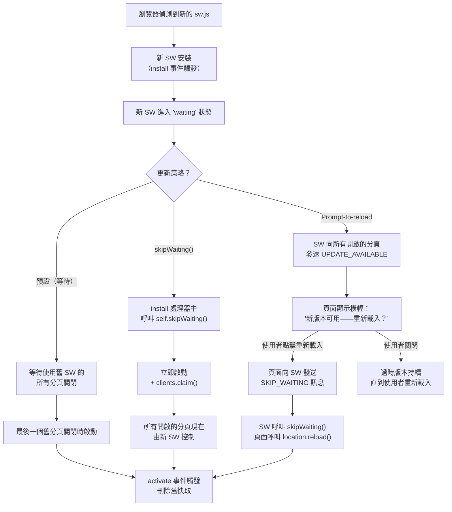

# [FEE-1307] PWA 上線實務

## 簡介

在本地開發環境中能正常運作的 Progressive Web App，與在生產環境中穩定運作的 PWA，是兩個根本不同的問題。在開發階段，service worker 通常是被停用的或是以空實作（no-op stub）替代——Vite 的 dev server 預設不會註冊真實的 service worker，Create React App 的 `react-scripts start` 使用的 stub 會跳過所有快取邏輯。這意味著，一個團隊可以在完全沒有觀察到 service worker 在瀏覽器生產條件下的真實行為的情況下，就建構、測試並上線一個 PWA。結果是一類在開發期間從未浮現的生產故障：使用者永遠收不到更新、離線 fallback 回傳空白頁面，以及 cache storage 無限制增長直到瀏覽器開始驅逐條目。

Lighthouse PWA 稽核是業界標準工具，用於評估 PWA 在上線前是否符合一套基準標準。它檢查了一份有意義的需求清單——HTTPS、已註冊的 service worker、有效的 Web App Manifest、起始 URL 的離線能力——但它不檢查快取邏輯的正確性、離線 fallback 的可用性、更新策略的品質，或安裝提示流程的時機是否適當。完美的 Lighthouse PWA 分數與會讓使用者無限期停留在舊版內容的更新策略完全相容。團隊經常把稽核誤解為品質認證，而它更準確的定位是部署清單：PWA 必須滿足的最低需求集合，才能被識別為可安裝。稽核告訴你 PWA 是否可安裝；它不告訴你它是否做得好。

在生產環境中運作 PWA 需要回答三個 Lighthouse 稽核無法回答的問題。第一，當新版本應用程式部署時，使用者將如何收到更新？瀏覽器預設的 service worker 更新行為——新 SW 等待至使用舊 SW 的所有分頁都關閉後才啟動——不是一個策略；它是一個分頁會被頻繁關閉的假設，而這對大多數應用程式而言是不成立的。第二，當新版本部署時，如何識別並刪除舊快取，以避免使用者從不匹配的快取中獲取資源？第三，對於需要透過平台應用程式商店發布 PWA 的團隊，前往 Android 和 Windows 發布的正確路徑是什麼，以及 iOS 上有哪些實際限制？

## 設計思考

### Lighthouse 檢查什麼——以及它不檢查什麼

Lighthouse PWA 稽核針對應用程式的生產建置執行一組固定的需求清單。理解稽核涵蓋什麼與不涵蓋什麼之間的界線，對於正確解讀分數以及了解在 PWA 準備好進入生產環境之前還需要哪些額外工作至關重要。

**Lighthouse 檢查的項目：**
- HTTPS（或 localhost）。應用程式必須在安全來源上提供服務。Service worker 和 Web App Manifest 在非安全來源（`localhost` 除外）上無法使用。
- 已註冊的 service worker。Lighthouse 檢查是否有 service worker 被註冊，而不是它是否實作了任何特定的快取策略。一個什麼都不做只是成功註冊的 service worker 可以通過這個檢查。
- 有效的 `manifest.json`。Manifest 必須包含 `name` 或 `short_name`、至少一個帶有 `src`、`sizes` 和 `type` 的圖示、一個 `start_url`，以及 `standalone`、`fullscreen` 或 `minimal-ui` 的 `display` 模式。圖示必須包含一個 192×192px 或更大的可遮罩（maskable）圖示。
- `start_url` 的離線回應。Lighthouse 將瀏覽器設為離線並導航至 `start_url`。如果 service worker 返回任何回應——一個快取的頁面或自訂的離線 fallback——檢查通過。如果它返回瀏覽器錯誤頁面，檢查失敗。一個空的 `<html>` 文件可以通過；稽核不要求有意義的離線頁面。
- `<meta name="viewport">` 標籤。響應式顯示的必要條件。
- 瀏覽器工具列主題。Manifest 的 `theme_color` 必須與 HTML 中的 `<meta name="theme-color">` 標籤值相符。

**Lighthouse 不檢查的項目：**
- 快取策略是否正確。一個永遠快取每個請求的 service worker，包括永遠不應該被快取的 API 回應，可以通過稽核。
- 離線 fallback 是否可用。一個空白白色頁面加上 HTTP 200 回應可以通過。一個顯示 stack trace 的損壞離線頁面也可以通過。Lighthouse 衡量是否存在離線回應，而不是它對使用者是否有意義。
- 更新策略是否有效。一個永遠不向現有使用者傳遞更新的 service worker，可以以完美分數通過 Lighthouse PWA 稽核。
- 推播通知時機是否適當（詳見 FEE-1306）。
- Background Sync 是否正確運作（詳見 FEE-1305）。

將 Lighthouse PWA 稽核視為部署清單——上線前必須通過的關卡——而不是 PWA 生產品質的衡量標準。完美分數是起點，不是終點。

### Service worker 更新策略

Service worker 生命週期在新版本部署和現有使用者收到更新之間製造了一個落差。當瀏覽器偵測到新的 `sw.js` 檔案時，它會下載並安裝新的 service worker，但會將其保持在「waiting」狀態。新 SW 只能在使用舊 service worker 的所有瀏覽器分頁都關閉後才能啟動——並開始從其新快取中提供回應。在實際情況下，長時間存活的應用程式可能數天都無法滿足這個條件。

下表描述了團隊用來管理此落差的四種主要策略。

| 策略 | 運作方式 | 風險 | 最適合 |
|------|---------|------|--------|
| 預設（等待分頁關閉） | 新 SW 安裝並進入「waiting」狀態。當使用舊 SW 的所有分頁關閉後啟動。 | 長時間存活的應用程式，使用者讓分頁開著數小時或數天——更新可能在使用者的工作階段期間永遠無法到達。 | 短工作階段的應用程式（結帳流程、預訂表單），使用者在完成任務後自然關閉分頁。 |
| `skipWaiting()` | 新 SW 在 `install` 處理器中呼叫 `self.skipWaiting()` 立即啟動，然後呼叫 `clients.claim()` 接管所有開啟的分頁。 | 如果新 SW 的快取策略在請求進行中時發生變化，進行中的 `fetch` 請求可能失敗或返回意外的回應。 | 以靜態資源為主的應用程式，沒有長時間執行的請求，且只有在快取版本升級向後相容的情況下。 |
| Prompt-to-reload（提示重新載入） | 當新 SW 安裝時，它向所有開啟的分頁發送 `UPDATE_AVAILABLE` 訊息。頁面顯示「新版本可用——重新載入？」橫幅。當使用者點擊重新載入時，頁面向 SW 發送 `SKIP_WAITING` 訊息，SW 呼叫 `skipWaiting()`，頁面重新載入。 | 使用者可能忽略或關閉提示；過時版本持續到使用者重新載入為止。 | 大多數應用程式——在不干擾使用者當前任務的情況下給予可見度和控制權。 |
| Periodic Background Sync / 版本輪詢 | SW 定期抓取一個小型版本 manifest 檔案。當版本變更時，它發送 `UPDATE_AVAILABLE`，頁面顯示橫幅。 | 實作更複雜；`periodicSync` 的瀏覽器支援有限（僅限 Android 上的 Chrome/Edge）。 | 使用者讓分頁開著數小時且需要在不需要使用者操作的情況下傳遞更新的應用程式。 |

Prompt-to-reload 策略是大多數生產 PWA 的正確預設選項。它讓使用者清楚地知道新版本存在，保留了他們的當前任務狀態（他們選擇何時重新載入），並避免了 `skipWaiting()` 的請求中斷風險。主要的失敗模式——使用者關閉或忽略橫幅——比其他替代方案危害小得多：使用者正在積極使用應用程式，可以在完成當前任務後重新載入。如果分析數據顯示使用者習慣性地忽略橫幅，考慮在導航事件上增加版本過時性檢查（比較伺服器回應中的版本與執行中的版本），並在過時版本上經過可設定的導航次數後顯示更顯著的警告。

### 版本化快取清除

快取版本管理是防止新啟動的 service worker 從舊版應用程式建置的資源中提供回應的機制。沒有版本化快取名稱，`activate` 處理器無法可靠地識別哪些快取是過時的，因為所有快取在各版本之間共用相同的名稱。

正確的做法是在每個快取名稱中包含版本常數，並在 `activate` 期間刪除所有名稱匹配快取命名空間前綴但不匹配當前版本的快取：

```js
const CACHE_VERSION = 'v3';
const STATIC_CACHE = `static-${CACHE_VERSION}`;
const RUNTIME_CACHE = `runtime-${CACHE_VERSION}`;

self.addEventListener('activate', (event) => {
  event.waitUntil(
    caches.keys().then((keys) =>
      Promise.all(
        keys
          .filter(
            (k) =>
              (k.startsWith('static-') && k !== STATIC_CACHE) ||
              (k.startsWith('runtime-') && k !== RUNTIME_CACHE)
          )
          .map((k) => caches.delete(k))
      )
    )
  );
});
```

每當快取策略以需要全新清除的方式變更時遞增 `CACHE_VERSION`：當預快取資源路徑變更、快取 TTL 變更，或運行時快取處理的路由集發生重大變化時。不要在每次部署都遞增版本——只在舊版本的過時快取會造成使用者可見問題時才遞增。如果不確定，就遞增；不必要的快取失效的代價是回訪使用者的首次載入稍微慢一些，這遠比從不匹配的快取中提供資源要好得多。

### 應用程式商店發布

透過平台應用程式商店發布 PWA，可以將其觸及到通過 Google Play 商店、Microsoft 商店或 Apple App Store 發現應用程式的使用者。不同平台的技術機制和需求差異很大。

**Trusted Web Activity（TWA）——Android Play Store。** TWA 是一個使用 Chrome 渲染引擎顯示 PWA 的 Android APK。與基於 WebView 的混合應用程式不同，TWA 提供完整的 Chrome 瀏覽上下文，包括 service worker 支援、Web Push 和 Bluetooth API。當 PWA 通過 Digital Asset Links 驗證時，URL 列是隱藏的——一個託管在域名上的 `.well-known/assetlinks.json` 檔案，將域名與 APK 的 SHA-256 憑證指紋關聯起來。如果 Digital Asset Links 驗證失敗，Chrome 會在已安裝的 APK 內顯示 URL 列，這是對使用者表明包裝出了問題的可見訊號。`bubblewrap` CLI（由 Chrome 團隊維護，在 npm 上以 `@bubblewrap/cli` 發布）從 Web App Manifest 生成 APK。PWABuilder（Microsoft）在相同流程上提供了圖形介面。透過 Play Store 發布需要 Google Play Console 帳號，一次性費用為 25 美元。

**PWABuilder——Windows Store 與多平台。** Microsoft 的 PWABuilder 工具接受 PWA URL，分析 manifest，並為多個平台生成可發布的套件：用於 Android 的 TWA APK、用於 Microsoft Store 的 MSIX 套件，以及 iOS 的指引。對於想要以最少平台特定工程工作獲得最廣泛應用程式商店存在的團隊，PWABuilder 是現有 PWA 取得應用程式商店存在感的最低摩擦路徑。生成的套件並沒有深度客製化，但它們是可上架的。

**iOS 和 Apple App Store 的限制。** iOS 不支援 TWA 或可比較的機制。透過 Apple App Store 發布基於 web 的應用程式的唯一方式是將 WebKit WebView 包裝在原生 Swift/Objective-C 殼層中——這是一個混合應用程式，不是 PWA。影響 PWA 生產部署的主要 iOS web 限制包括：
- Web Push 通知需要主畫面安裝（iOS 16.4+）。在 Safari 瀏覽器分頁中執行的網頁無法請求推播通知權限。使用者必須先透過分享選單將網站加入主畫面，然後開啟產生的圖示。只有從已安裝的主畫面上下文中，PWA 才能呼叫 `Notification.requestPermission()`。
- iOS Safari 不支援 Background Sync。依賴 Background Sync（FEE-1305）的延遲寫入操作在 iOS 上無法運作。
- iOS Safari 不支援 Periodic Background Sync。
- 當 PWA 從主畫面執行時，`navigator.standalone` 返回 `true`。在 iOS 上使用此屬性來控制推播訂閱流程的進入條件。
- 需要在實體 iOS 裝置上進行測試。macOS Safari 無法複製 Web Push 的主畫面安裝需求。iOS 模擬器無法準確複製推播的 service worker 行為。

## 最佳實踐

**必須（MUST）針對生產建置而非 dev server 執行 Lighthouse。** Vite 的 dev server 不會註冊 service worker。`next dev` 會 stub 或停用 SW 行為。必須（MUST）始終針對 `pnpm build && pnpm preview` 或等效的生產建置指令的輸出執行稽核，並使用 Chrome 的無痕模式避免來自先前測試執行的快取狀態。

**應該（SHOULD）使用 prompt-to-reload 模式作為預設更新策略。** `skipWaiting()` 沒有使用者提示，只有在新 SW 的快取策略與進行中的請求向後相容時才是安全的。對於大多數應用程式，更安全的預設是從 service worker 的 `install` 事件發送 `UPDATE_AVAILABLE`，並顯示一個不干擾的橫幅，讓使用者控制何時重新載入。

**必須（MUST）每當快取策略變更時遞增快取版本字串。** 禁止（MUST NOT）使用沒有版本後綴的快取名稱。名為 `app-cache` 的快取無法被 `activate` 處理器與名為 `app-cache` 的前版本快取區分開來。使用 `static-v1`、`static-v2` 等，並在 `activate` 期間清除除當前版本之外所有匹配命名空間前綴的舊版本。

**必須（MUST）明確地預快取 `start_url`。** Lighthouse 離線檢查在停用網路的情況下導航至 `start_url`。如果 `start_url` 不在預快取中，此檢查失敗。更重要的是，將 PWA 安裝到主畫面後在離線狀態下啟動的使用者，必須（MUST）收到快取回應，而非瀏覽器錯誤頁面。

**必須（MUST）在提交至 Play Store 之前驗證 Digital Asset Links。** 如果 `.well-known/assetlinks.json` 檔案缺失、格式錯誤或返回錯誤的憑證指紋，Chrome 將在已安裝的 TWA 內顯示 URL 列。在 Play Store 安裝的「應用程式」中看到 URL 列的使用者，會得出應用程式損壞的結論。必須（MUST）使用 Digital Asset Links API 驗證該檔案，然後再提交 APK。

**必須（MUST）在實體 iOS 裝置上進行測試。** macOS Safari 和 iOS 模擬器不會準確複製推播通知的主畫面安裝需求、Background Sync 的缺失，或已安裝 PWA 上下文中 Web App Manifest 的行為。對於任何面向 iOS 使用者的 PWA，必須（MUST）在測試輪換中保留至少一部實體 iPhone。

**不應（SHOULD NOT）在沒有大小限制的情況下快取 opaque response。** 沒有 CORS 標頭的跨來源回應以 opaque response 的形式儲存，Cache Storage API 將其大小報告為 0 位元組，但瀏覽器可能以填充的大小計算配額。在沒有最大條目數或 TTL 的情況下快取許多 opaque response，可能耗盡儲存配額。如果必須快取跨來源資源，必須（MUST）使用 Workbox 的 `ExpirationPlugin` 配置條目限制。

**應該（SHOULD）提供有意義的離線 fallback 頁面。** Lighthouse 稽核接受空白頁面作為離線回應，但使用者理應得到更好的體驗。建立一個專用的 `/offline.html` 頁面，在 SW 安裝階段預快取。當 SW 無法從網路履行導航請求且沒有快取版本時，必須（MUST）回退到此頁面，而不是返回一般瀏覽器錯誤。

## Mermaid 圖



## 範例

以下範例完整實作了 prompt-to-reload 更新模式。它分為三個檔案：service worker（`public/sw.js`）、一個 React 更新橫幅元件（`src/components/UpdateBanner.tsx`），以及一個將兩者串聯起來的 service worker 註冊模組（`src/registerSW.ts`）。

### Service worker：install、activate 與更新訊息

```js
// public/sw.js

const CACHE_VERSION = 'v1';
const STATIC_CACHE = `static-${CACHE_VERSION}`;
const RUNTIME_CACHE = `runtime-${CACHE_VERSION}`;

// 在 install 期間預快取的資源。這些資源在每次請求時，
// 包括使用者離線時，都從快取中提供服務。
const PRECACHE_ASSETS = [
  '/',
  '/offline.html',
  '/icons/icon-192.png',
  '/icons/icon-512.png',
];

// --- Install（安裝）---
// 預快取靜態資源。此處不呼叫 skipWaiting()——
// 我們在啟動前提示使用者，讓他們選擇何時重新載入。
self.addEventListener('install', (event) => {
  event.waitUntil(
    caches
      .open(STATIC_CACHE)
      .then((cache) => cache.addAll(PRECACHE_ASSETS))
      .then(() => {
        // 通知所有開啟的分頁新版本已就緒並等待中。
        // 這在 SW 啟動之前觸發，因此現有分頁仍在執行
        // 舊 SW，可以顯示更新橫幅。
        return self.clients.matchAll({ includeUncontrolled: true });
      })
      .then((clients) => {
        clients.forEach((client) =>
          client.postMessage({ type: 'UPDATE_AVAILABLE' })
        );
      })
  );
});

// --- Activate（啟動）---
// 刪除舊版本的快取。完成後，所有請求將從新快取中提供。
self.addEventListener('activate', (event) => {
  event.waitUntil(
    caches
      .keys()
      .then((keys) =>
        Promise.all(
          keys
            .filter(
              (k) =>
                (k.startsWith('static-') && k !== STATIC_CACHE) ||
                (k.startsWith('runtime-') && k !== RUNTIME_CACHE)
            )
            .map((k) => caches.delete(k))
        )
      )
      .then(() => self.clients.claim())
  );
});

// --- Fetch：預快取資源用快取優先，其他用網路優先 ---
self.addEventListener('fetch', (event) => {
  const { request } = event;

  // 只處理 GET 請求。絕不攔截 POST、PUT、DELETE 等。
  if (request.method !== 'GET') return;

  // 導航請求：網路優先，回退至離線頁面。
  if (request.mode === 'navigate') {
    event.respondWith(
      fetch(request).catch(() => caches.match('/offline.html'))
    );
    return;
  }

  // 靜態資源：快取優先。
  event.respondWith(
    caches.match(request).then((cached) => {
      if (cached) return cached;

      return fetch(request)
        .then((response) => {
          // 只快取成功的、非 opaque 的回應。
          if (
            !response ||
            response.status !== 200 ||
            response.type === 'opaque'
          ) {
            return response;
          }
          const responseToCache = response.clone();
          caches
            .open(RUNTIME_CACHE)
            .then((cache) => cache.put(request, responseToCache));
          return response;
        })
        .catch(() => {
          // 沒有網路也沒有快取條目——不返回有用的內容。
        });
    })
  );
});

// --- Message 處理器：從頁面接收 SKIP_WAITING ---
// 當使用者在更新橫幅中點擊「重新載入」時，頁面發送此訊息。
// 我們呼叫 skipWaiting() 來啟動等待中的 SW。
self.addEventListener('message', (event) => {
  if (event.data?.type === 'SKIP_WAITING') {
    self.skipWaiting();
  }
});
```

### Service worker 註冊模組

```ts
// src/registerSW.ts
// 註冊 service worker 並為更新事件公開回呼。
// 在應用程式啟動時匯入並呼叫一次 registerSW()。

export interface SWRegistrationOptions {
  /** 當新 SW 安裝並等待時呼叫。顯示更新橫幅。*/
  onUpdateAvailable?: () => void;
}

export async function registerSW(options: SWRegistrationOptions = {}): Promise<void> {
  if (!('serviceWorker' in navigator)) return;

  // 使用 'load' 事件將註冊延遲到頁面完成初始渲染之後。
  // 這避免了 SW 安裝在首次訪問時與頁面資源載入競爭。
  window.addEventListener('load', async () => {
    try {
      const registration = await navigator.serviceWorker.register('/sw.js', {
        scope: '/',
      });

      // 監聽來自 SW 的訊息（例如 UPDATE_AVAILABLE）。
      navigator.serviceWorker.addEventListener('message', (event) => {
        if (event.data?.type === 'UPDATE_AVAILABLE') {
          options.onUpdateAvailable?.();
        }
      });

      // 處理頁面載入時 SW 已在等待的情況
      // （例如，使用者在新 SW 已在前一個工作階段安裝但從未被啟動後開啟了應用程式）。
      if (registration.waiting) {
        options.onUpdateAvailable?.();
      }

      // 處理新 SW 在註冊後開始等待的情況。
      registration.addEventListener('updatefound', () => {
        const newWorker = registration.installing;
        if (!newWorker) return;

        newWorker.addEventListener('statechange', () => {
          if (
            newWorker.state === 'installed' &&
            navigator.serviceWorker.controller
          ) {
            // 新 SW 現在已安裝並等待中。controller 檢查
            // 確保這是一次更新（而非首次安裝——首次安裝時
            // 還沒有 controller）。
            options.onUpdateAvailable?.();
          }
        });
      });
    } catch (error) {
      console.error('Service worker 註冊失敗：', error);
    }
  });
}
```

### 更新橫幅元件（React）

```tsx
// src/components/UpdateBanner.tsx
// 當有新版本的應用程式可用時顯示不干擾的橫幅。
// 使用者可以關閉它或點擊「重新載入」來套用更新。

import { useEffect, useState } from 'react';

export function UpdateBanner() {
  const [show, setShow] = useState(false);

  useEffect(() => {
    const handler = (event: MessageEvent) => {
      if (event.data?.type === 'UPDATE_AVAILABLE') {
        setShow(true);
      }
    };

    navigator.serviceWorker?.addEventListener('message', handler);
    return () => navigator.serviceWorker?.removeEventListener('message', handler);
  }, []);

  function handleReload() {
    // 告訴等待中的 SW 跳過等待階段並啟動。
    navigator.serviceWorker.controller?.postMessage({ type: 'SKIP_WAITING' });
    // 等待 controller 變更（新 SW 接管）後再重新載入，
    // 以避免在 SW 準備好之前重新載入。
    navigator.serviceWorker.addEventListener('controllerchange', () => {
      window.location.reload();
    });
  }

  function handleDismiss() {
    setShow(false);
  }

  if (!show) return null;

  return (
    <div
      role="alert"
      aria-live="polite"
      className="fixed bottom-4 inset-x-4 z-50 bg-blue-600 text-white px-4 py-3 rounded-lg shadow-lg flex items-center justify-between gap-4"
    >
      <span className="text-sm font-medium">
        此應用程式有新版本可用。
      </span>
      <div className="flex items-center gap-2 shrink-0">
        <button
          onClick={handleReload}
          className="px-3 py-1.5 bg-white text-blue-600 rounded text-sm font-semibold hover:bg-blue-50 transition-colors"
        >
          重新載入
        </button>
        <button
          onClick={handleDismiss}
          aria-label="關閉更新通知"
          className="p-1.5 text-blue-200 hover:text-white transition-colors"
        >
          &times;
        </button>
      </div>
    </div>
  );
}
```

### 在應用程式啟動時連接 SW 註冊

```tsx
// src/main.tsx（或 src/index.tsx）
import { StrictMode } from 'react';
import { createRoot } from 'react-dom/client';
import App from './App';
import { registerSW } from './registerSW';

// updateAvailableSignal 是一個輕量的 observable，用來將 SW 回呼
// 橋接到 React 元件樹。可替換為你偏好的狀態管理方案
//（Zustand、Jotai、React context 等）。
let onUpdateCallbacks: Array<() => void> = [];

export function subscribeToUpdateAvailable(cb: () => void) {
  onUpdateCallbacks.push(cb);
  return () => { onUpdateCallbacks = onUpdateCallbacks.filter((fn) => fn !== cb); };
}

registerSW({
  onUpdateAvailable: () => {
    onUpdateCallbacks.forEach((cb) => cb());
  },
});

createRoot(document.getElementById('root')!).render(
  <StrictMode>
    <App />
  </StrictMode>
);
```

### TWA 設定（使用 bubblewrap）

```bash
# 全局安裝 bubblewrap CLI
npm install -g @bubblewrap/cli

# 從 Web App Manifest 初始化新的 TWA 專案
# 將 URL 替換為你的生產域名
bubblewrap init --manifest https://yourdomain.com/manifest.json

# 建置 APK
bubblewrap build
```

`bubblewrap init` 指令會詢問以下值：

- **Application ID**：反向域名識別符，例如 `com.acme.myapp`。必須與你在 Play Console 中註冊的識別符相符。
- **簽署金鑰**：現有的 `.keystore` 檔案及其別名，或 bubblewrap 會生成一個。安全地儲存 keystore 檔案及其密碼——發布後無法更換簽署金鑰。
- **SHA-256 指紋**：bubblewrap 從簽署金鑰計算此值，並在生成 `assetlinks.json` 檔案時使用它。建置後，將此檔案託管在 `https://yourdomain.com/.well-known/assetlinks.json`。

```json
// .well-known/assetlinks.json
[
  {
    "relation": ["delegate_permission/common.handle_all_urls"],
    "target": {
      "namespace": "android_app",
      "package_name": "com.acme.myapp",
      "sha256_cert_fingerprints": [
        "AB:CD:EF:01:23:45:67:89:AB:CD:EF:01:23:45:67:89:AB:CD:EF:01:23:45:67:89:AB:CD:EF:01:23:45:67"
      ]
    }
  }
]
```

在提交至 Play Store 之前，驗證該檔案是否可訪問且有效。使用 Google Digital Asset Links 驗證端點確認：

```bash
curl "https://digitalassetlinks.googleapis.com/v1/statements:list\
?source.web.site=https://yourdomain.com\
&relation=delegate_permission/common.handle_all_urls"
```

成功的回應包含 `"matched": true`。如果 `matched` 為 `false` 或端點返回錯誤，URL 列將出現在已安裝的 TWA 中。

## 常見錯誤

**`skipWaiting()` 沒有搭配 `clients.claim()`。** 在 `install` 處理器中呼叫 `skipWaiting()` 會讓新 SW 立即啟動，但不會自動將已開啟分頁的控制權轉移給新 SW。現有分頁繼續由舊 SW 服務，直到重新載入。新 SW 只控制啟動後開啟的分頁。在 `activate` 處理器中添加 `self.clients.claim()` 會立即將所有開啟分頁的控制權轉移給新 SW。當目標是更新所有開啟的分頁時，兩個呼叫都是必要的。

**`skipWaiting()` 搭配 `clients.claim()` 但沒有遞增快取版本。** 當新 SW 啟動並接管所有開啟的分頁時，它開始服務請求——但如果快取名稱沒有變更，它將從與舊 SW 相同的快取中提供資源。如果舊快取包含與新應用程式程式碼不相容的過時資源，使用者將看到損壞的應用程式。始終將 `skipWaiting()` 策略與快取版本遞增配對使用。這種組合會導致難以在本地重現的生產故障，因為本地 dev server 不執行真實的 service worker。

**假設 `install` 事件對回訪使用者觸發。** `install` 事件只在偵測到新版本的 SW 時觸發。如果沒有新的 `sw.js` 可用，已安裝 SW 的回訪使用者將不會看到新的 `install` 事件。上述範例中的 `UPDATE_AVAILABLE` 訊息是從 `install` 事件發送的——這意味著它只在實際有更新可用時觸發。不要混淆首次安裝和後續更新；兩種情況都必須處理，但它們觸發不同的事件。

## 相關 FEE

- [FEE-1302：Service Worker](./1302.md) — 生命週期、`skipWaiting`、`activate`、`clients.claim`、SW 更新演算法
- [FEE-1304：Workbox 與 PWA 工具鏈](./1304.md) — `workbox-window` 更新偵測、`messageSkipWaiting`、`ExpirationPlugin`
- [FEE-704：Core Web Vitals 與效能指標](../Rendering%20and%20Performance/704.md) — Lighthouse 在 PWA 清單旁邊稽核效能；了解完整的稽核範圍

## 參考資料

- Google Chrome Developers — [Lighthouse PWA 稽核文件](https://developer.chrome.com/docs/lighthouse/pwa/load-fast-enough-for-pwa)
- web.dev — [Service Worker 生命週期](https://web.dev/articles/service-worker-lifecycle)
- web.dev — [處理 service worker 更新](https://web.dev/articles/service-worker-lifecycle#handling_service_worker_updates)
- MDN Web Docs — [ServiceWorkerGlobalScope: skipWaiting()](https://developer.mozilla.org/en-US/docs/Web/API/ServiceWorkerGlobalScope/skipWaiting)
- MDN Web Docs — [Clients.claim()](https://developer.mozilla.org/en-US/docs/Web/API/Clients/claim)
- MDN Web Docs — [Cache Storage API](https://developer.mozilla.org/en-US/docs/Web/API/CacheStorage)
- Google Digital Asset Links — [Statement List API](https://developers.google.com/digital-asset-links/reference/rest/v1/statements/list)
- bubblewrap CLI — [GitHub repository 與文件](https://github.com/GoogleChromeLabs/bubblewrap)
- PWABuilder — [Microsoft PWA 打包工具](https://www.pwabuilder.com/)
- Apple Developer — [在 Apple 平台上啟用 Web Push API](https://developer.apple.com/documentation/usernotifications/sending-web-push-notifications-in-web-apps-and-browsers)
- Can I Use — [Service Workers 瀏覽器支援](https://caniuse.com/serviceworkers)
- Can I Use — [Periodic Background Sync](https://caniuse.com/periodic-background-sync)
