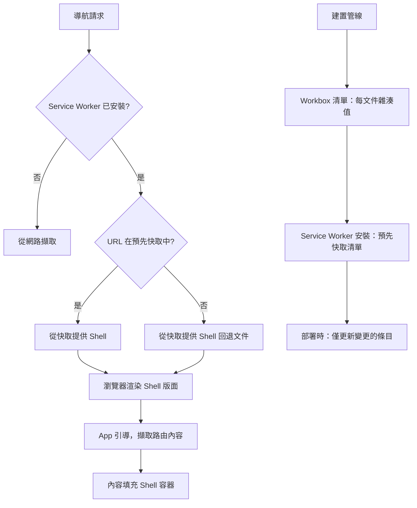

# App Shell 架構

App Shell 模型將應用程式的結構外框——導航側邊欄、標題欄、載入骨架，以及
始終存在的版面容器——與填充這些容器的動態內容分離。Shell 是應用程式的
「框架」：在任何內容載入之前渲染互動式版面所需的 HTML、CSS 和 JavaScript。
內容是出現在框架內的「圖片」：在 Shell 顯示後透過網路擷取的特定路由資料。

這種分離的重要性在於：Shell 可以在 Service Worker 安裝期間預先快取。在
後續訪問中，Service Worker 攔截文件導航請求並立即以快取的 Shell 回應——
無需網路往返。瀏覽器在導航後數毫秒內渲染 Shell 的版面，應用程式開始將
動態內容載入到現在可見的框架中。使用者感受到快速載入，因為互動式結構
在第一個位元組從伺服器到達之前就已出現。

App Shell 方法早於 Service Worker 出現——早期的單頁應用程式使用本地儲存
和用戶端路由來近似相同的行為。Service Worker 使這個模式變得可靠：Shell
回應始終可用，與網路條件無關；快取是明確且受控的；預先快取的 Shell 在
瀏覽器重啟後仍然存在。結果是重複訪問的瀏覽體驗感覺像原生應用——即時的
結構，內容隨著到達逐漸填充。

本文涵蓋 Shell 邊界的設計、使用 Workbox 的預先快取策略、帶有 Shell 的
路由級串流如何與伺服器端渲染結合，以及當 Shell-內容邊界劃定不正確時的
常見陷阱。

## 原則

App Shell 是必須（MUST）由 Service Worker 預先快取並優先從快取提供的最小
HTML、CSS 和 JavaScript 集合。Shell 邊界內的內容——導航、版面外框、載入
狀態——必須（MUST）在不需要任何網路請求的情況下正確渲染。Shell 邊界外的
路由級內容應該（SHOULD）使用 NetworkFirst 或 StaleWhileRevalidate 策略，
因為它頻繁變化並且必須反映當前資料。Shell 邊界應該（SHOULD）盡可能小：
Shell 中每個位元組的 JavaScript 和 CSS 都會增加預先快取的有效載荷，以及
首次載入時的關鍵渲染路徑。

## 設計思維

### 設計 Shell 邊界

Shell 邊界是一個具有效能和使用者體驗影響的架構決策。過窄的 Shell——只有
最外層的 `<div id="app">`——意味著 Shell 幾乎沒有感知速度提升，因為空白
框架沒有提供有意義的結構。過寬的 Shell——包含特定路由的版面或依賴資料的
元件——意味著 Shell 更大、預先快取需要更長時間，並且每次任何包含的元件
變更時都必須更新。

大多數應用程式的實際邊界落在：持久導航（側邊欄、標題欄、麵包屑路徑）、
全域 UI 外框（通知提示、全域出現的模態框、主題提供者）、應用程式載入
骨架（匹配預期內容版面的佔位符形狀）和路由出口容器（路由內容將掛載的
空 `<main>` 或 `<div>`）。特定路由的元件、資料擷取元件，以及任何顯示
使用者特定內容的元素，都屬於 Shell 之外。

一個有用的測試：Shell 能否在沒有網路存取的情況下以空的內容出口正確渲染？
若答案是肯定的，邊界就是合適的。若渲染 Shell 需要網路請求或使用者資料，
邊界就劃定得太寬了。

另一個框架：Shell 是應用程式在載入第一個路由時顯示的內容。若你的 SPA
在導航事件之間有一個骨架載入狀態，該骨架實際上就是 App Shell。將其正式
化為預先快取的 Shell，意味著它從快取即時出現，而非在 JavaScript 套件評估
後才出現。因此，Shell 載入狀態的設計不僅僅是使用者體驗關注點——它直接
決定了 Service Worker 預先快取的內容以及預先快取有效載荷的成長。

一個常見的設計錯誤是在 Shell 中包含應用程式的主要導航選單，但導航選單的
項目來自 API（例如根據使用者角色動態生成的選單項目）。在這種情況下，
看似是 Shell 的東西實際上是內容。解決方案是讓 Shell 包含導航容器和一個
靜態的載入骨架，而由資料驅動的實際選單項目在 Shell 掛載後非同步填充。
這保持了 Shell 的靜態特性，同時實現了期望的視覺設計。

Shell 的 HTML 通常是一個靜態文件——用戶端應用程式的 `index.html`，或
基於框架的應用程式的版面模板。所有 Shell 資源（HTML 文件、主要 CSS 套件、
應用程式引導 JavaScript）都列在 Service Worker 的預先快取清單中。Service Worker
在啟用之前已安裝並快取清單資源，確保在 Service Worker 開始攔截請求之前，
完整的 Shell 就已可供下次導航使用。

一個細節：預先快取清單必須在與導航 URL 匹配的快取鍵下包含 Shell 文件。
當使用者導航至 `https://app.example.com/settings` 時，Service Worker 攔截
該 URL 的導航請求。若 `/settings` 不在預先快取中，Service Worker 透過
`navigateFallback` 選項回退至預先快取的 `index.html`。這種回退行為意味著
只需要預先快取一個 HTML 文件即可覆蓋所有用戶端路由——導航回退覆蓋了路由
器處理的所有路徑。

### 使用 Workbox 預先快取 Shell

Workbox 是生產 PWA 應用程式中 Service Worker 建構的標準程式庫。其
`precacheAndRoute()` 函式接受一個清單陣列——通常由 `workbox-webpack-plugin`
或 `vite-plugin-pwa` 在建置時注入——並在安裝事件期間將列出的資源安裝到
Service Worker 的預先快取儲存中。匹配預先快取 URL 的路由被攔截並以快取
優先策略從快取提供服務。

預先快取分兩個不同的階段進行。安裝階段發生在新的 Service Worker 首次被
瀏覽器下載時：Service Worker 並行擷取清單中的所有資源並將其儲存在快取中。
只有在所有資源都成功快取後，Service Worker 才會進入等待激活狀態。若任何
資源擷取失敗，安裝失敗，Service Worker 不會激活——這確保預先快取始終是完整
的，永遠不會處於部分狀態。

激活階段在前一個 Service Worker 退役後發生。Workbox 在激活期間從快取中
刪除清單中不再存在的舊版本資源，防止快取因每次部署後積累的舊版本文件而
無限增長。這個清理步驟是自動的，無需開發者干預——這是使用 Workbox 而非
手寫 Service Worker 快取邏輯的主要優勢之一。

建置工具整合是關鍵部分。手動維護預先快取清單容易出錯且無法隨頻繁部署擴展。
`workbox-webpack-plugin`（GenerateSW 模式）掃描 Webpack 的輸出，自動生成
清單，並將其注入到 Service Worker 文件中。Vite 的等效工具是 `vite-plugin-pwa`，
它在單一設定物件中生成清單和 Service Worker 文件。這兩種方法都不需要開發者
手動列出文件：建置工具知道哪些文件被生成、它們的大小和內容雜湊值。

每個資源的預先快取清單條目包含根據文件內容計算的修訂雜湊值。當文件變更
時，雜湊值也改變，Workbox 的預先快取控制器在下一次 Service Worker 啟用
期間偵測到這個變更。它擷取更新後的資源，將其儲存在預先快取中，並刪除
過時的條目。這種增量更新機制確保預先快取在部署後從不提供過時版本的
Shell——只有變更的文件被重新擷取，而非整個清單。

InjectManifest 模式是 GenerateSW 的替代方案，適用於需要超出 GenerateSW
設定範圍的自訂 Service Worker 邏輯的團隊。在 InjectManifest 模式中，開發
者編寫一個 Service Worker 原始文件，並使用特殊的 `self.__WB_MANIFEST`
佔位符，指示預先快取清單應該注入的位置。建置工具在建置時將佔位符替換為
生成的清單。這種模式允許完全控制 Service Worker 的 fetch、sync 和 push
事件處理器，同時仍自動化清單生成這個最容易出錯的部分。

選擇 GenerateSW 還是 InjectManifest 主要取決於應用程式是否需要自訂的
Service Worker 邏輯。GenerateSW 適合大多數應用程式——它處理安裝、激活和
預先快取路由，並透過設定選項暴露最常見的自訂需求。InjectManifest 適合需要
自訂背景同步、推送通知處理、或與預先快取之外的自訂快取邏輯整合的應用程式。
若現有的設定選項就足夠，應優先使用 GenerateSW，因為它減少了需要維護的
手寫 Service Worker 程式碼量。

### SSR 中帶有 App Shell 的路由級串流

純用戶端 App Shell 架構直觀明瞭，但有首次載入的成本：瀏覽器必須下載並
解析 JavaScript 套件才能顯示任何內容。伺服器端渲染透過在伺服器上將路由
內容渲染為 HTML 並與 Shell 結構一起串流到瀏覽器，解決了首次載入效能問題。

React 18 的串流 SSR 搭配 `renderToPipeableStream` 或 `renderToReadableStream`
允許伺服器立即刷新 Shell HTML，並在 Suspense 邊界解析時串流內容區塊。
Shell HTML——文件 head、版面外框、載入回退——首先被刷新，讓瀏覽器開始渲染
可見結構並解析關鍵 CSS。當伺服器解析其資料時，暫停元件的內容串流進來，
逐步填充版面，無需用戶端資料擷取往返。對使用者而言，效果是：導航幾乎立即
顯示應用程式的版面結構，內容隨著伺服器渲染完成而逐漸出現——比傳統 SSR
在一個大的 HTML 回應中返回所有內容感覺更快，也比純 SPA 在 JS 執行後才能
顯示任何內容感覺更快。

Service Worker 與 SSR 串流的互動需要謹慎。串流回應在仍在串流時無法作為
單一條目被 `Cache-Storage` 快取——快取條目只有在串流完成後才存在。對於
SSR 應用程式，Service Worker 的角色從快取完整的 HTML 回應轉變為快取這些
回應引用的靜態資源。Service Worker 以高效的快取策略處理 JavaScript、CSS、
字型和圖片；HTML 文件從網路擷取（或在首次載入完成後從快取提供），而非
從預先快取的 Shell 文件提供。

### Shell 之外內容的策略

頻繁變化的內容需要反映其波動性的快取策略。Workbox 提供幾種策略作為命名
處理器：NetworkFirst 從網路擷取並在失敗時回退到快取；StaleWhileRevalidate
立即回傳快取的回應，同時在背景擷取更新版本；CacheFirst 始終回傳快取的
回應並在背景以 TTL 重新驗證。

對於應用程式資料（API 回應），NetworkFirst 加上短暫超時在網路快速時防止
顯示過時資料，同時確保對先前看到的資料的離線存取。對於上傳到儲存服務的
使用者生成內容（如圖片），帶有 TTL 和最大快取大小（由 Workbox 的
`ExpirationPlugin` 管理）的 CacheFirst 防止無限制的快取增長。

選擇這些策略需要了解資料的更新頻率和過時容忍度。側邊欄中的導航連結很少
變更，可以容忍 StaleWhileRevalidate——使用者立即看到最後已知的導航，Service
Worker 在背景為下次訪問更新它。搜尋結果和個人化資訊流永遠不應以過時版本
提供——NetworkFirst 加上離線回退是正確的。頭像和縮圖很少變更——帶有一週
TTL 的 CacheFirst 防止重複往返，同時保證最終的新鮮度。將內容和類別結構
對應到正確的策略是刻意的架構決策，而非留給 Service Worker 模板的預設選擇。

Workbox 的 `ExpirationPlugin` 允許同時按條目數量和時間限制快取大小。設定
`maxEntries: 50` 和 `maxAgeSeconds: 86400`（一天）確保快取不會隨時間無限
增長，同時保持合理的離線可用資料集。當快取達到上限時，Workbox 使用
最近最少使用（LRU）策略驅逐條目，優先移除最久未存取的資源，這與使用者
的訪問模式一致——不再訪問的頁面資源不應佔用儲存空間。

在設計運行時快取策略時，考慮瀏覽器的儲存配額。現代瀏覽器允許相當大的
快取（通常為磁碟空間的 20% 或更多），但在低存儲設備或在 Safari 的隱私
瀏覽模式下，配額可能更嚴格。Workbox 本身不能防止配額溢出；明確的
`ExpirationPlugin` 設定是防止快取溢出和觸發瀏覽器驅逐的最有效工具。

## 最佳實踐

**必須（MUST）**預先快取 Shell 渲染所需的所有資源：HTML 文件、關鍵 CSS
套件、應用程式引導 JavaScript，以及 Shell 的 CSS 中引用的任何字型。缺少
任何資源都會在離線模式下破壞 Shell 的完整渲染，因為 Service Worker 無法
提供未快取的資源。

**必須（MUST）**使用 `workbox-webpack-plugin` 或 `vite-plugin-pwa` 將預先
快取清單生成整合到建置管線中。手動維護的清單在部署後變得過時，並在版本
不匹配時提供損壞的 Shell 資源，這比完全沒有 Service Worker 更糟糕。

**應該（SHOULD）**盡可能保持 Shell 邊界狹窄——導航外框和空的內容容器，而非
特定路由的元件。較小的 Shell 預先快取速度更快，更新也更可靠，並且減少
首次造訪時的關鍵渲染路徑。

**應該（SHOULD）**透過在 DevTools 中模擬離線條件並驗證 Shell 在任何內容
載入之前在沒有網路存取的情況下正確渲染，來測試 Shell 體驗。使用 DevTools
的「Network throttling」將連接設為「Offline」，然後刷新頁面，確認 Shell
立即出現而沒有網路錯誤。

**禁止（MUST NOT）**在預先快取的 Shell 中包含動態或使用者特定的內容——不得
將個人化資料嵌入到由所有使用者共享的 Shell 文件中。包含使用者資料的 Shell
對於共享同一 Service Worker 安裝的不同使用者會發生錯誤，並且在每次使用者
資料變更時使預先快取失效。使用者特定的內容屬於內容層，在 Shell 掛載且
使用者工作階段建立後擷取。

## 視覺呈現



## 範例

```typescript
// vite.config.ts — vite-plugin-pwa 的 App Shell 設定
import { defineConfig } from 'vite'
import { VitePWA } from 'vite-plugin-pwa'

export default defineConfig({
  plugins: [
    VitePWA({
      strategies: 'generateSW',
      registerType: 'prompt', // 參見 FEE-1309 的更新提示策略
      workbox: {
        // 預先快取 Shell：index.html + 所有建置輸出資源
        globPatterns: ['**/*.{js,css,html,ico,png,svg,woff2}'],

        // 對於任何未明確快取的導航 URL，提供 Shell
        navigateFallback: '/index.html',

        // 永遠不對 API 路由使用 Shell 回退（SSR 或代理）
        navigateFallbackDenylist: [/^\/api\//],

        // 內容策略：API 回應使用 NetworkFirst + 5 秒超時
        runtimeCaching: [
          {
            urlPattern: /^https:\/\/api\.example\.com\//,
            handler: 'NetworkFirst',
            options: {
              cacheName: 'api-cache',
              networkTimeoutSeconds: 5,
              expiration: { maxEntries: 50, maxAgeSeconds: 60 * 60 * 24 },
            },
          },
        ],
      },
    }),
  ],
})
```

## 常見錯誤

- 在 Shell 的預先快取中包含 API 回應或使用者特定資料——預先快取在使用者
  和工作階段之間共享，因此個人資料在使用者之間洩漏或因使用者資料變更而
  立即失效，導致不一致的應用程式狀態
- 沒有為 API 路由設定 `navigateFallbackDenylist`——Service Worker 為 API
  擷取請求提供 Shell HTML，破壞任何期望 JSON 或其他非 HTML 格式回應的
  伺服器端請求，導致難以追蹤的解析錯誤
- 忘記在 Shell 預先快取中包含字型和圖示——Shell 在離線模式下以系統字型
  渲染並顯示損壞的圖示，使離線體驗大打折扣
- 在不閱讀 FEE-1309 的情況下使用 `registerType: 'autoUpdate'`——靜默自動
  更新立即啟用新的 Service Worker，可能中斷進行中的請求或導致應用程式
  顯示新舊資源混合的狀態，直到下次完整頁面重新載入
- 未配置 `ExpirationPlugin` 的快取大小限制——運行時快取可能無限增長，
  在低存儲設備上觸發瀏覽器的配額驅逐機制，清除所有快取資源

## 相關 FEE

- FEE-1300: Service Worker 生命週期與註冊
- FEE-1302: 離線優先資料策略
- FEE-1305: PWA 效能優化
- FEE-1309: 更新偵測與重新整理提示

## 參考資料

- [Google: App Shell 模型](https://developers.google.com/web/fundamentals/architecture/app-shell)
- [Workbox 文件](https://developer.chrome.com/docs/workbox/)
- [vite-plugin-pwa 文件](https://vite-pwa-org.netlify.app/)
- [web.dev: 串流——最終指南](https://web.dev/streams/)
- [React 18: 帶串流的伺服器渲染](https://react.dev/blog/2021/12/17/react-conf-2021-recap)
- [MDN: Cache Storage API](https://developer.mozilla.org/zh-TW/docs/Web/API/Cache)
- [Workbox: ExpirationPlugin 文件](https://developer.chrome.com/docs/workbox/modules/workbox-expiration/)
- [web.dev: Workbox 指南](https://developer.chrome.com/docs/workbox/guides/)
- [MDN: Service Worker API](https://developer.mozilla.org/zh-TW/docs/Web/API/Service_Worker_API)
