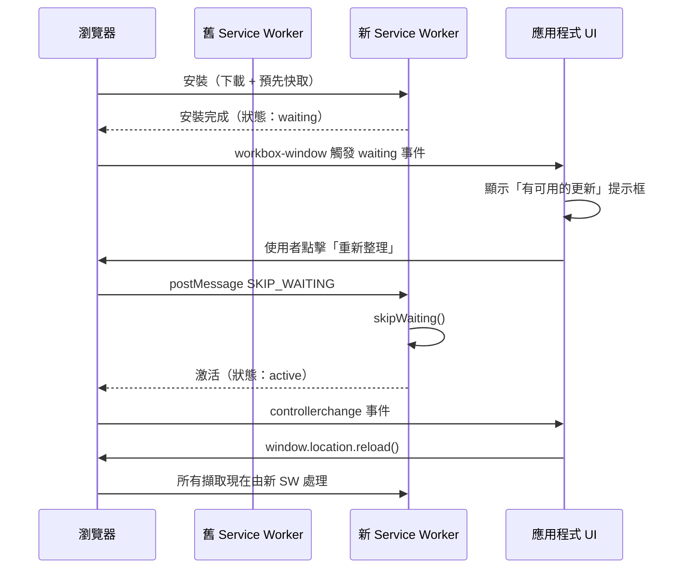

# 更新偵測與重新整理提示

Service Worker 一旦安裝，就會持續控制其範圍內的所有頁面，直到被更新版本
取代。更新週期不是自動的。當使用者導航至 PWA 時，瀏覽器在背景檢查是否
有更新的 Service Worker。若找到，它會下載並安裝新版本，同時保留舊版本。
新的 Service Worker 進入等待狀態：它已安裝但尚未激活，因為舊的 Service
Worker 仍然控制所有開啟的頁面。只有當範圍內的所有頁面都關閉並開啟新頁面
後，新的 Service Worker 才會激活並接管控制權。

這個預設生命週期產生了一種讓 PWA 開發新手感到意外的行為模式：使用者可能
在等待狀態中保留已部署的更新數小時或數天，同時保持分頁開啟。舊的 Service
Worker 繼續從更新之前的預先快取提供 Shell，新的 Service Worker 在等待，
使用者看到的是應用程式的過時版本。從工程師的角度看，部署已成功，CI
顯示綠色，但活躍使用者可能幾天內都不會看到任何變更——這是 Service Worker
生命週期中最常被誤解的行為之一。

理解這個生命週期對於診斷部署後的問題也很重要。若使用者回報他們仍然看到
已修復的錯誤，第一個問題應該是：「Service Worker 是否已在其瀏覽器中更新？」
而非假設修復無效。DevTools 的 Application 面板中「Service Workers」區域可以
顯示每個頁面由哪個版本的 Service Worker 控制，以及是否有新版本在等待。
這個診斷資訊對支援已部署但仍有使用者報告舊問題的情況至關重要。

解決這種張力需要在兩種方法之間做出深思熟慮的選擇：提示使用者重新載入
（協作式更新）或強制新的 Service Worker 立即激活（`skipWaiting`）。兩者
都有重大的取捨。正確做出這個決策是團隊做出的最具影響力的 PWA 架構決策
之一。

## 設計思維

### 為何更新策略是產品決策，而非單純的工程細節

Service Worker 的更新生命週期處於工程架構與產品體驗的交叉點。

協作式提示與 `skipWaiting` 之間的選擇不純粹是技術性的——它編碼了關於使用者的假設：他們保持分頁開啟多長時間、他們對中斷的容忍度，以及團隊對混合版本狀態承擔的風險程度。

一個每天部署多次且使用者習慣將應用程式固定在分頁中的團隊，面臨的更新問題與每週部署一次的團隊根本不同。將預設瀏覽器行為視為可接受的——這會讓使用者無限期停留在過時版本上——本身就是一個產品決策，通常是一個未經深思的決策。

明確制定更新策略，迫使團隊闡明「在過時版本上運行」對其使用者意味著什麼：這是一個不便、一個資料完整性風險，還是一個安全暴露？答案決定了正確的更新機制。通知的 UX 選擇也反映了這一決策：對於使用者而言過時版本帶來的後果越嚴重，就越應該採用更具侵入性的更新提示，從角落的 toast 到持久橫幅，乃至全螢幕阻塞模態框。

### Service Worker 更新偵測的運作方式

瀏覽器的更新偵測機制作為導航生命週期的一部分運行。當使用者導航至由
Service Worker 控制的頁面時，瀏覽器從網路擷取已註冊的 Service Worker
指令碼（繞過 Service Worker 指令碼的 HTTP 快取）。若擷取的指令碼與已安裝
的版本差異哪怕一個位元組，瀏覽器就認為這是更新並開始新指令碼的安裝過程。

新指令碼與舊指令碼並行運行。它接收一個 `install` 事件並執行其自己的
預先快取安裝。當 `install` 事件成功完成後，新的 Service Worker 進入等待
狀態：其內部狀態為 `waiting`。舊的 Service Worker 保持 `active` 狀態，
繼續處理當前開啟頁面的所有 fetch、sync 和 push 事件。新版本無法激活，
直到舊版本完全釋放——這只有在它控制的所有頁面都關閉時才會發生。

Workbox 的 `workbox-window` 套件提供了 `Workbox` 類別，它封裝了瀏覽器的
`ServiceWorkerRegistration` API 並發出更高層次的事件。當 Workbox 偵測到
新的 Service Worker 已進入等待狀態時，`waiting` 事件觸發。這個事件是在
應用程式 UI 中觸發更新通知的信號。事件物件包含 `wasWaitingBeforeRegister`
屬性：當為 `true` 時，表示在 `Workbox` 類別實例化時，Service Worker 已
在等待狀態，表明存在使用者尚未重新載入的先前更新。這種情況——在頁面載入
之前就已等待的更新——需要相同的面向使用者的提示。

原生的 `ServiceWorkerRegistration` API 也暴露了 `updatefound` 事件，它在
瀏覽器開始安裝新的 Service Worker 時觸發。這比 `waiting` 更早觸發——它
表示安裝已開始，而非完成。直接使用 `updatefound` 需要追蹤新的 Service
Worker 的安裝狀態（監聽其 `statechange` 事件從 `installing` 到 `installed`
的轉變），以便在 Service Worker 實際進入等待狀態時發送通知。`workbox-window`
封裝了這個過程，`waiting` 事件是封裝的結果，只在安裝完成後觸發。這就是
推薦使用 `workbox-window` 而非直接使用原生 Registration API 的主要原因。

### 協作式更新方法

協作式方法是大多數生產應用程式的推薦模式。當 `waiting` 事件觸發時，
應用程式顯示一個非阻塞通知——提示框、橫幅或持久的底部欄——通知使用者
有可用的更新。通知包含一個「重新整理」或「更新」按鈕。當使用者點擊時，
應用程式向等待的 Service Worker 發送消息，指示其跳過等待。等待的 Service
Worker 呼叫 `skipWaiting()` 後，它激活並接管所有頁面的控制。應用程式
隨後重新載入以從新的 Service Worker 的預先快取載入資源。

Workbox 的通訊模式是：頁面呼叫 `workbox.messageSkipWaiting()`（向等待的
Service Worker 發布 `SKIP_WAITING` 消息），Service Worker 的安裝處理器
在回應該消息時呼叫 `self.skipWaiting()`。這個兩步驟通訊——頁面消息加上
Service Worker 回應——是有意的設計，確保只有在使用者明確請求時才呼叫
`skipWaiting()`，而不是在安裝時自動呼叫。

`workbox-window` 的 `Workbox` 類別也暴露了一個 `register()` 方法，它接受
一個 `immediate` 選項。當 `immediate: false`（預設值）時，`workbox-window`
等到頁面 `load` 事件後才註冊 Service Worker，避免在頁面的初始資源載入
期間爭用頻寬。這個預設行為對大多數應用程式是正確的，但可能延遲更新偵測
數秒。對於更新檢測時機很重要的應用程式，可以使用 `immediate: true` 立即
開始更新檢查，代價是可能影響首頁載入效能。

協作方法保留了使用者的自主性，防止了工作階段中途突然的頁面重新載入。
它還防止了混合版本狀態問題：由於重新載入是明確觸發的，使用者從舊版本
到新版本的過渡是乾淨的，而不是某些資源來自新快取、某些資源來自舊快取的
狀態。

協作方法也更容易調試。當問題在部署後出現時，工程師可以問：「使用者是否
已接受更新？」若使用者沒有點擊更新按鈕，他們仍在使用舊版本，這可能解釋
問題。這個可追蹤性使問題隔離更容易，而使用 `skipWaiting` 的應用程式則
很難確定使用者在問題發生時使用的是哪個版本。在日誌和錯誤追蹤中記錄 Service
Worker 版本，有助於將錯誤回報與特定部署版本關聯起來。

通知的使用者體驗對採用率至關重要。在角落出現並在五秒後自動關閉的提示
框很容易被忽視。一個留在頁面頂部持續可見直到使用者採取行動（更新或關閉）
的持久橫幅更具干擾性，但也更有效。對於過時資料是合規問題的企業儀表板，
全螢幕阻塞式模態框是合理的。使用者體驗的選擇反映了在過時版本上運行的
重要性：對於後果更嚴重的更新，選擇相應更具干擾性的通知。

一個實用的中間方案是「可忽略的橫幅」：通知持續可見，有明確的「現在更新」
主要按鈕和「稍後」次要按鈕。若使用者選擇「稍後」，橫幅暫時隱藏，但在
下次頁面導航時重新出現。這保留了使用者的控制，同時確保更新通知不會被
完全忽略。若結合超時機制，在使用者忽略通知超過閾值後強制重新載入，這種
方法在使用者體驗和版本控制之間提供了良好的平衡。

### skipWaiting 方法：風險及其可接受的情況

`skipWaiting` 使新的 Service Worker 立即激活，無需等待現有頁面關閉。在
Workbox 中，在 `GenerateSW` 配置中設定 `skipWaiting: true` 導致生成的
Service Worker 在安裝事件期間呼叫 `self.skipWaiting()`，甚至在新版本完成
安裝之前。

風險是混合版本狀態。當 Service Worker 透過 `skipWaiting` 激活時，它立即
開始控制所有開啟的頁面。這些頁面是以舊版本的 HTML、JavaScript 和 CSS 載入
的。若頁面的 JavaScript 請求新的 Service Worker 以不同雜湊值快取的資源——
這在部署後很常見，因為文件內容雜湊值會改變——新的 Service Worker 在其預先
快取中不會有舊版本的資源。資源擷取將失敗或回退到網路，導致當前運行頁面
中的錯誤。

`skipWaiting: true` 與 `activate` 處理器中的 `clients.claim()` 結合是特別
危險的組合。`clients.claim()` 使新的 Service Worker 接管範圍內在其激活之前
開啟的所有頁面的控制——包括根本未透過 Service Worker 載入的頁面。以舊的
JavaScript 套件載入的頁面現在由新的 Service Worker 提供資源。若新 Service
Worker 的資源清單與舊 JavaScript 預期的不匹配，頁面就會崩潰。

`skipWaiting` 在特定情況下是可接受的：當應用程式是每次工作階段開始時
重新載入的儀表板或工具、當部署對預先快取資源清單沒有破壞性變更，或當
團隊已驗證 `skipWaiting` 在特定應用程式的資源結構中不會導致運行時錯誤。

驗證 `skipWaiting` 安全性的測試策略是：在兩個並行的瀏覽器分頁中打開應用
程式，在其中一個分頁中載入新的 Service Worker 版本（例如透過強制更新），
確認另一個分頁在新 Service Worker 激活後繼續正常運行。若另一個分頁顯示
任何 404 錯誤、資源載入失敗或 JavaScript 錯誤，`skipWaiting` 在此應用程式
的部署中是不安全的，應該改用協作提示方法。

### 防止快取卡住

一個相關的失敗模式是快取卡住：Service Worker 的預先快取包含先前版本的
資源，新版本的資源具有不同的雜湊值，但新的 Service Worker 的 `install`
事件未能擷取新資源（網路錯誤、CDN 中斷，或意外從預先快取清單中遺漏的
資源）。新的 Service Worker 安裝失敗，舊的 Service Worker 保持激活，
使用者繼續看到先前的版本。

Workbox 透過將 `install` 事件視為原子操作來防止安裝失敗留下部分快取：
若任何資源擷取失敗，整個安裝失敗並回滾部分快取。這防止了 Service Worker
以不完整的資源集激活。

另一個卡住快取的來源是建置管線錯誤地從預先快取清單中省略了資源。這可能
因為 glob 模式過於狹窄（例如，不包括 `.woff2` 字型文件），或因為動態生成
的資產未被建置工具的清單生成知曉。驗證整個預先快取清單的一個有效方法是
在建置後在 DevTools 的 Application 面板中檢查 Cache Storage，確認每個
應用程式需要的資源都出現在預先快取中，以及其版本雜湊值已從上次部署更新。

Service Worker 指令碼本身的 HTTP 快取控制標頭需要明確關注。瀏覽器的更新
偵測檢查 Service Worker 指令碼的位元組是否已改變，但若指令碼被具有長
`max-age` 的 HTTP 快取快取，瀏覽器可能數小時內都看不到更新的指令碼。
Service Worker 指令碼 URL 必須以 `Cache-Control: no-cache` 或非常短的 TTL
提供，以確保瀏覽器始終檢查更新。大多數 CDN 配置需要明確的規則來從 CDN 的
快取行為中排除 Service Worker 指令碼 URL。

驗證更新偵測是否如預期運作，需要在啟用 HTTP 快取的瀏覽器中測試（不是在
DevTools 勾選了「停用快取」的情況下），並使用部署環境而非 localhost。DevTools
的 Application 面板顯示 Service Worker 的註冊狀態，包括是否有新版本在等待、
每個頁面由哪個版本控制，以及上次更新檢查的時間。當測試更新流程時，在一個
分頁中觸發新的服務工作者安裝（例如透過在第二個分頁中部署和導航），然後
確認第一個分頁收到 `waiting` 事件並顯示更新提示。

## 最佳實踐

**必須（MUST）**選擇明確的更新策略（協作提示或 `skipWaiting`），而非依賴
預設的被動行為。預設行為在任何開啟分頁的整個生命週期內，讓使用者無限期
地停留在過時版本上——對於持續多日開啟同一分頁的使用者而言，這可能意味著
使用者幾天內都看不到新功能或安全修復。

**應該（SHOULD）**以協作提示方法作為預設：透過 `workbox-window` 偵測
`waiting` 事件，並顯示非阻塞的 UI 提示，讓使用者決定何時重新載入。

**應該（SHOULD）**以 `Cache-Control: no-cache` 提供 Service Worker 指令碼
URL（`/sw.js` 或等效項），使瀏覽器的更新偵測在每次導航時都能看到最新的
指令碼，而非來自先前訪問的、被中間 CDN 或瀏覽器 HTTP 快取快取的版本。

**禁止（MUST NOT）**在未驗證應用程式的資源結構能承受工作階段中途 Service
Worker 交換的情況下，將 `skipWaiting: true` 與 `clients.claim()` 結合使用
——不得在沒有充分測試混合版本狀態影響的情況下採用此組合配置。這種組合是
PWA 應用程式部署後崩潰最常見的原因。

**應該（SHOULD）**對有嚴格版本一致性要求的應用程式實作協作更新的最大等待
超時。若 Service Worker 等待超過設定的時間（例如 24 小時），在下次導航時
自動重新載入，而不等待使用者操作。超時值應根據應用程式的更新頻率和對過時
內容的容忍度來設定——頻繁部署的應用程式需要較短的超時，而月度更新的應用
程式可以容忍更長的等待期。

## 視覺呈現



## 範例

```typescript
// src/service-worker-registration.ts
// 註冊 Service Worker 並連接協作式更新提示。

import { Workbox } from 'workbox-window';

export function registerServiceWorker(
  onUpdateAvailable: (acceptUpdate: () => void) => void,
): void {
  if (!('serviceWorker' in navigator)) return;

  const wb = new Workbox('/sw.js');

  wb.addEventListener('waiting', () => {
    // 新的 Service Worker 正在等待。提供使用者更新機會。
    onUpdateAvailable(() => {
      // 當使用者接受時，告知等待的 SW 激活。
      wb.messageSkipWaiting();
    });
  });

  // skipWaiting 激活新 SW 後，控制器發生變更。
  // 重新載入使頁面使用新的預先快取資源。
  wb.addEventListener('controlling', () => {
    window.location.reload();
  });

  wb.register();
}

// 在應用程式根元件中的使用方式：
// registerServiceWorker((acceptUpdate) => {
//   showUpdateToast({ onAccept: acceptUpdate });
// });
```

## 常見錯誤

- 不進行任何明確更新處理，依賴預設生命週期——使用者在開啟分頁的整個
  生命週期內（可能是數天或數週）都停留在過時版本上
- 在未測試部署後行為的情況下使用 `skipWaiting: true`——混合版本狀態導致
  在開發環境中難以重現的資源不匹配
- 以長 `Cache-Control` TTL 提供 Service Worker 指令碼——更新偵測被 HTTP
  快取時長延遲，使部署看起來沒有生效
- 在 `controllerchange` 觸發後不重新載入——頁面有了新的 Service Worker，
  但繼續在記憶體中使用舊的 JavaScript 套件，製造了正是要避免的混合版本
  狀態；`wb.addEventListener('controlling', () => window.location.reload())`
  是確保頁面使用新版本資源的必要步驟
- 在新 Service Worker 的安裝完成之前顯示更新通知——在 `install` 事件仍在
  運行時顯示提示，可能導致使用者在新的預先快取尚未就緒時觸發重新載入，
  導致資源缺失和應用程式崩潰；`workbox-window` 的 `waiting` 事件在安裝
  完成後才觸發，這是優先使用它而非原生 `updatefound` 的主要原因之一

## 相關 FEE

- FEE-1300: Service Worker 生命週期與註冊
- FEE-1305: PWA 效能優化
- FEE-1308: App Shell 架構
- FEE-1302: 離線優先資料策略

## 參考資料

- [MDN: Service Worker API — updatefound 事件](https://developer.mozilla.org/zh-TW/docs/Web/API/ServiceWorkerRegistration/updatefound_event)
- [Workbox Window 文件](https://developer.chrome.com/docs/workbox/modules/workbox-window/)
- [web.dev: Service worker 生命週期](https://web.dev/service-worker-lifecycle/)
- [MDN: ServiceWorkerRegistration.update()](https://developer.mozilla.org/zh-TW/docs/Web/API/ServiceWorkerRegistration/update)
- [web.dev: 處理 Service Worker 更新](https://web.dev/handling-service-worker-updates/)
- [Workbox: GenerateSW 配置](https://developer.chrome.com/docs/workbox/modules/workbox-build/)
- [MDN: ServiceWorker.state 屬性](https://developer.mozilla.org/zh-TW/docs/Web/API/ServiceWorker/state)
- [web.dev: PWA 更新最佳實踐](https://web.dev/service-worker-mindset/)
- [Chrome DevTools: 偵錯 Service Workers](https://developer.chrome.com/docs/devtools/progressive-web-apps/)
