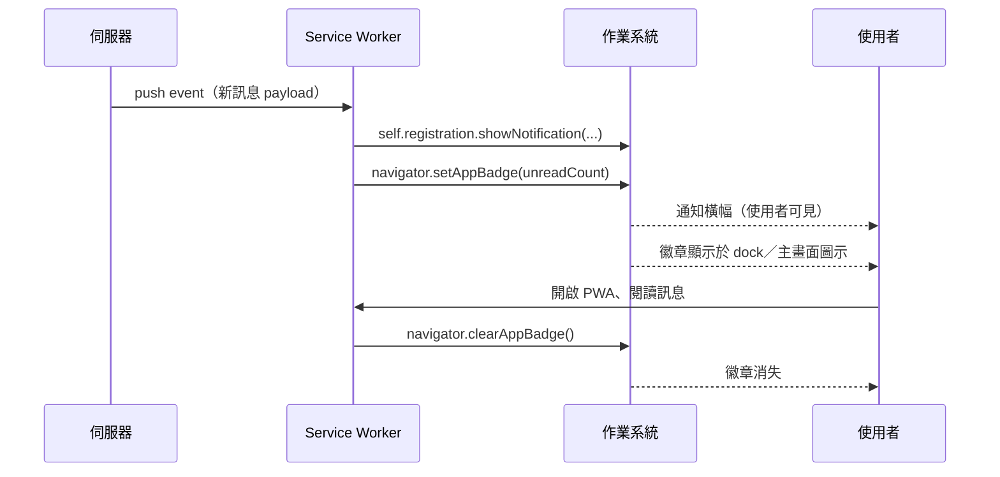

# [FEE-1317] Badging API 與已安裝 PWA 的再參與介面

:::info
Badging API 在 `Navigator` 與 `WorkerNavigator` 上提供兩個方法 `setAppBadge()` 與 `clearAppBadge()`，可在已安裝 PWA 的作業系統圖示旁（dock、shelf 或主畫面）渲染數字計數或通用指示符號。此 API 設計給已安裝的 Web 應用程式使用，回傳會 resolve 為 `undefined` 的 promise，並可從 service worker 的 `push` 處理函式中呼叫，使徽章能作為使用者可見通知的安靜伴隨物進行更新。瀏覽器支援涵蓋 Chrome 與 Edge 81+、Safari macOS 17+，以及 iOS Safari 16.4+ 上加入主畫面的 Web App；Firefox 不支援。徽章是渲染於已安裝應用程式 OS 圖示上的安靜計數，與通知有別，且可在不打斷使用者的情況下以較高頻率更新。
:::

## 背景

Web 開發者過去常以更動 favicon 與覆寫 `document.title` 的方式，在瀏覽器分頁列上呈現未讀計數（MDN）。Badging API 將此模式提升到作業系統介面層級：依據 W3C Working Draft，規格定義了一種方式以「在使用者作業系統中顯示應用程式徽章於應用程式主要圖示表現旁」（W3C）。MDN 將此 API 描述為設定「與已安裝 Web App 圖示關聯的 App 徽章」，並指出這些徽章「可能依使用裝置顯示在 dock、shelf 或主畫面上的應用程式圖示上」。W3C 草案將此功能限定於已安裝應用程式：「徽章作為已安裝 Web 應用程式的機制」。Chrome 的 capabilities 文件強化了這個安裝門檻：「您的 Web App 須符合 Chrome 的可安裝條件，且使用者必須將其加入主畫面。」在 Apple 平台上，Marcos Cáceres 與 Brady Eidson 撰寫的 WebKit 部落格文章將 iOS/iPadOS 16.4 的曝露範圍限制於「使用者已加入主畫面的 Web App」，並排除 Safari 本身與 WKWebView。

## 視覺對比



## 範例

一個訊息 PWA 在前景頁面從伺服器取得新訊息後遞增徽章；在 service worker `push` 處理函式中於使用者可見通知旁更新徽章；在使用者讀取收件匣時清除徽章。

```js
// Foreground page: after a fetch returns the unread count.
async function refreshBadge(unread) {
  if (!('setAppBadge' in navigator)) return;
  if (unread > 0) {
    await navigator.setAppBadge(unread);
  } else {
    await navigator.clearAppBadge();
  }
}
```

```js
// service-worker.js — push handler updates the badge AND shows a notification.
self.addEventListener('push', (event) => {
  const data = event.data?.json() ?? { count: 1, title: 'New message' };
  event.waitUntil((async () => {
    await self.registration.showNotification(data.title, {
      body: data.body ?? 'You have a new message',
    });
    if ('setAppBadge' in self.navigator) {
      await self.navigator.setAppBadge(data.count);
    }
  })());
});
```

```js
// Read-receipt path: clear the badge once the inbox is opened.
async function onInboxOpened() {
  if ('clearAppBadge' in navigator) {
    await navigator.clearAppBadge();
  }
}
```

W3C 簽章為 `Promise<undefined> setAppBadge(optional [EnforceRange] unsigned long long contents);`（W3C）。依 MDN：「若 `contents` 為 `0`，徽章將被設為 `nothing`，表示徽章已清除。」WebKit 部落格證實此等價性：「呼叫 `navigator.setAppBadge(0)` 等同於呼叫 `navigator.clearAppBadge()`。」呼叫 `navigator.setAppBadge()` 不帶引數則顯示「一個小點，或是平台所定義的其他指示符號」（MDN）。

## 最佳實踐

- **MUST** 在呼叫前以 `'setAppBadge' in navigator` 進行特性偵測，因為此 API 設計給已安裝應用程式使用，且在不支援的瀏覽器中不存在（W3C：「徽章作為已安裝 Web 應用程式的機制」；caniuse：「Firefox：Not supported」）。
- **MUST** 在 WebKit 平台從 `push` 事件更新徽章時同時呼叫 `self.registration.showNotification(...)`，因為「單獨的徽章更新無法滿足『使用者可見』要求」（WebKit 部落格）。
- **MUST** 透過接收時設定、讀取時清除來保持徽章與伺服器真實狀態同步，呼應典型的「以應用程式圖示徽章顯示新訊息已抵達的訊息功能」使用情境（MDN）。
- **SHOULD** 在意圖為清除時呼叫 `clearAppBadge()` 而非依賴 `setAppBadge(0)`，因為兩者皆定義為將徽章設為 `nothing`（W3C、MDN），而 `clearAppBadge()` 更明確表達清除語意。
- **SHOULD** 在高頻率狀態更新時優先選用徽章而非通知，因為「徽章往往比通知更友善，且因不會打斷使用者，可以較高頻率更新」（Chrome capabilities）。
- **MAY** 在無法取得精確計數時以無引數呼叫 `setAppBadge()`，此時平台「將顯示為一個小點，或其他指示符號」（MDN）。
- **MAY** 在 service worker 中透過 `WorkerNavigator` 呼叫此 API，因為 W3C 規格將 `NavigatorBadge` 包含於 `Navigator` 與 `WorkerNavigator`，且 MDN 指出「此功能在 Web Workers 中可用」。

## 設計思維

徽章座落於 ambient 通道；通知座落於打斷型通道。Chrome 的 capabilities 文章描繪此一取捨：徽章「不會打斷使用者」，因此「可以較高頻率更新」。一個訊息 App 若對每則進站訊息都遞增通知，將迅速劣化為噪音；同一個 App 若僅更新徽章，則能在不消耗使用者注意力預算的前提下保持介面活躍。選擇徽章通道的代價在於使用者必須注視圖示才能看見狀態，這對非緊急計數可接受，對時效性警示則不可接受。WebKit 要求 `push` 驅動的徽章更新須伴隨 `showNotification` 呼叫，從平台側反映了同一條軸線：push 消耗一份喚醒預算，平台不會為單獨的安靜更新授予該預算。

## 深入探討

W3C IDL `Promise<undefined> setAppBadge(optional [EnforceRange] unsigned long long contents)` 將 contents 引數限制為 64-bit 無號整數；`EnforceRange` 使超出範圍的值拋錯而非截斷（W3C）。`setAppBadge` 與 `clearAppBadge` 皆回傳 resolve 為 `undefined` 的 promise（MDN）。Mixin `NavigatorBadge` 同時被加入到 `Navigator` 與 `WorkerNavigator`（W3C），這正是 service worker `push` 處理函式模式的基礎：WebKit 部落格明白指出「在您的 Service Worker 處理 `push` 事件時更新應用程式徽章十分簡單」，Chrome capabilities 文件亦確認「伺服器 push 可以透過呼叫 `navigator.setAppBadge()` 更新徽章」。在 iOS 與 iPadOS 16.4 上，此 API 與主畫面安裝環境綁定：依 WebKit，「您不會在 Safari、其他瀏覽器或任何使用 WKWebView 的 App 中找到此 API 的曝露」。瀏覽器支援依 caniuse 與 Chrome capabilities：桌面端 Chrome 81+ 與 Edge 81+、Safari macOS 17.0+、iOS 16.4+ 上加入主畫面的 Web App；Firefox 不支援。

## 徽章 UX 設計模式

研究文件整理了六個具體模式。每個模式將某種再參與意圖映射到特定的 API 呼叫序列。

| # | 模式 | 觸發條件 | 動作 | 來源依據 |
|---|---------|---------|--------|--------------|
| 1 | 未讀收件匣 | 收到新訊息 | 接收時 `setAppBadge(unread)`；讀取時 `clearAppBadge()` | MDN：訊息功能使用情境 |
| 2 | 待審查佇列 | 佇列長度變動 | 每個 settle 事件呼叫 `setAppBadge(queueLength)`；對更新進行 debounce 以避免 taskbar 抖動 | Chrome capabilities：徽章「可以較高頻率更新」 |
| 3 | 通用活動小點 | 計數未知 | 不帶引數呼叫 `setAppBadge()` | MDN：「徽章將顯示為一個小點，或是平台所定義的其他指示符號」 |
| 4 | Push 驅動徽章 | Service worker `push` 事件 | 先呼叫 `showNotification(...)`，再呼叫 `setAppBadge(count)` | WebKit：「單獨的徽章更新無法滿足『使用者可見』要求」 |
| 5 | 跨裝置同步 | App focus／`visibilitychange` | 重新從伺服器抓取未讀計數，再呼叫 `setAppBadge(count)` | MDN、Chrome capabilities：徽章呈現伺服器真實狀態 |
| 6 | 進入 App 時歸零 | 使用者開啟 App | 第一次 focus 事件時呼叫 `clearAppBadge()` | 呼應典型訊息使用情境（MDN） |

模式 4 與模式 5 錨定跨平台限制：WebKit 要求伴隨使用者可見通知，於 focus 時與伺服器真實狀態對帳則防止徽章與收件匣狀態漂移。模式 3 是「旗標」模式，適用於 App 知道有變化但無法快速計算計數的情況。

## 延伸閱讀

- [Web App Manifest](/zh-tw/Progressive%20Web%20Apps%20and%20Offline/1301)
- [Push Notifications and Background Sync](/zh-tw/Progressive%20Web%20Apps%20and%20Offline/1306)
- [Service Workers](/zh-tw/Progressive%20Web%20Apps%20and%20Offline/1302)

## 參考資料

- W3C, "Badging API," W3C Working Draft (n.d.). https://www.w3.org/TR/badging/
- MDN contributors, "Badging API," MDN Web Docs (n.d.). https://developer.mozilla.org/en-US/docs/Web/API/Badging_API
- MDN contributors, "Navigator: setAppBadge() method," MDN Web Docs (n.d.). https://developer.mozilla.org/en-US/docs/Web/API/Navigator/setAppBadge
- MDN contributors, "Navigator: clearAppBadge() method," MDN Web Docs (n.d.). https://developer.mozilla.org/en-US/docs/Web/API/Navigator/clearAppBadge
- Chrome capabilities team, "Badging API," Chrome for Developers (n.d.). https://developer.chrome.com/docs/capabilities/web-apis/badging-api
- web.dev, "Badges," web.dev patterns (n.d.). https://web.dev/patterns/web-apps/badges
- Marcos Cáceres and Brady Eidson, "Badging for Home Screen Web Apps," WebKit blog (2023). https://webkit.org/blog/14112/badging-for-home-screen-web-apps/
