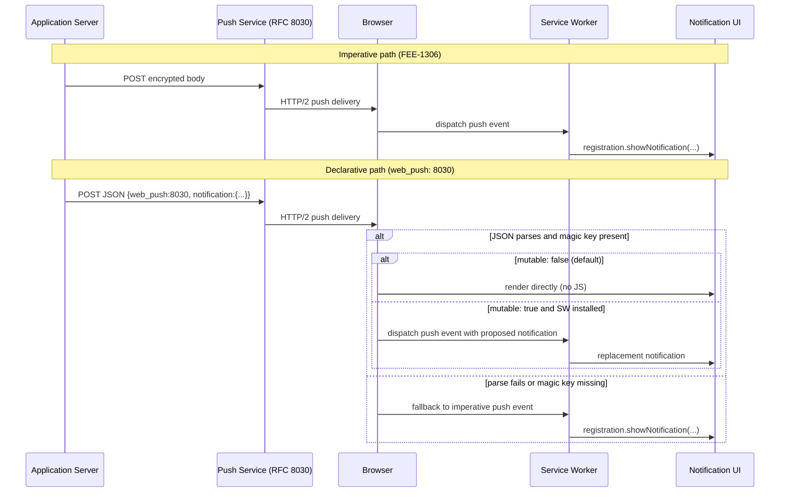

# [FEE-1316] 宣告式 Web Push（Safari 18.4/18.5）與跨瀏覽器 Push 趨同

:::info
宣告式 Web Push 是由 WebKit 主導的 Web Push 協定變體，應用伺服器發出含有 `web_push: 8030` magic key 的結構化 JSON payload，瀏覽器即可直接顯示通知，無須啟動 service worker。WebKit 已在 Safari 18.4 為 iOS／iPadOS 主畫面 Web App 啟用，並於 Safari 18.5 在 macOS 上線。命令式 Web Push 採用的 RFC 8030 傳輸與 `applicationServerKey` 訂閱模型仍然適用，因此今日送出的同一則 push 可在 Safari 上以宣告式渲染，並在尚未實作的瀏覽器上回退到命令式 `push` 事件。
:::

## 背景

命令式 Web Push 是 MDN 所記錄的模型，要求「the service worker will be started as necessary to handle incoming push messages, which are delivered to the `onpush` event handler.」由 service worker 決定是否呼叫 `showNotification`、要渲染什麼標題與內文，以及是否更新徽章。傳輸層本身為 RFC 8030（Generic Event Delivery Using HTTP Push），其 body 由應用程式自行定義，對 push service 而言是不透明的。

Brady Eidson 於 WebKit 部落格貼文「Meet Declarative Web Push」（2025-03-27）介紹了一個架在同一 RFC 8030 傳輸之上的並行格式。文中指出宣告式 Web Push「allows web developers to request a Web Push subscription and display user visible notifications without requiring an installed service worker」，且其 JSON schema「guarantees that the browser has enough information to display a user-visible notification without any JavaScript.」WebKit 的 Safari 18.5 release notes 將動機定調為開發者體驗與能耗：「This new approach to push notifications on the web doesn't require Service Workers — which makes it far easier for you as a developer to implement. And saves battery life for your users.」標準化進度於 W3C Push API issue #360 追蹤。

## 視覺對比



## 範例

伺服器 payload，逐字取自「Meet Declarative Web Push」：

```json
{
    "web_push": 8030,
    "notification": {
        "title": "Webkit.org — Meet Declarative Web Push",
        "lang": "en-US",
        "dir": "ltr",
        "body": "Send push notifications without JavaScript or service worker!",
        "navigate": "https://webkit.org/blog/16535/meet-declarative-web-push/",
        "silent": false,
        "app_badge": "1"
    }
}
```

當此 payload 抵達實作宣告式 Web Push 的瀏覽器時，JSON 解析成功，最上層的 `web_push: 8030` key 將該訊息切入宣告式解析路徑，瀏覽器以指定的 title、body、語言、書寫方向與 silent 旗標渲染通知，啟動時導向 `navigate` URL，並在 iOS 主畫面 Web App 上將應用程式徽章更新為 `1`。整個過程沒有任何 JavaScript 執行。

訂閱端在用戶端同樣不需要 service worker。WebKit 部落格展示了 `window` 上的新進入點：

```js
const subscription = await window.pushManager.subscribe({
    userVisibleOnly: true,
    applicationServerKey: arrayForPublicKey
});
```

訂閱模型沿用命令式 push 的 `applicationServerKey`，因此後端只要原本已能發送命令式 push 訊息，即可對同一個 subscription endpoint 開始發送宣告式 JSON。

## 最佳實踐

- **MUST** 在每個宣告式 payload 中加入最上層的 `web_push: 8030` magic key。WebKit 部落格稱之為「the magic value that opts the rest of your push message into declarative parsing」；WWDC25 議程則重述要求為「you must always have a web_push key with the value 8-0-3-0.」
- **MUST** 提供非空的 `notification.title` 與 `notification.navigate` URL。WWDC25 Session 235 將兩者列為「the minimum requirements for a valid notification」，WebKit 部落格說明 `title` 必須非空，而 `navigate`「describes a URL that will be navigated to by the browser upon activation.」
- **MUST** 在推進期間繼續與宣告式 payload 並行送出命令式 payload。WWDC25 確認當瀏覽器 JSON 解析失敗或找不到 magic key 時「it falls back to original Web Push, using a Service Worker to handle the message」，且 WebKit Safari 18.4 / 18.5 release notes 將實作範圍限縮在 Safari。
- **SHOULD** 在通知內容於伺服器端已完全已知時，優先採用宣告式路徑。WebKit Safari 18.5 release notes 將無 SW 模型歸功於更易實作並節省電力，WebKit 部落格亦指出在宣告式遞送下「there is no penalty for service workers failing to display a notification」。
- **SHOULD** 僅在 service worker 確實需要在顯示前改寫提案通知時才設置 `mutable: true`。WebKit explainer 指出「notification payloads are immutable by default (false)」，WWDC25 將 `mutable` 描述為「this notification needs to be processed by the service worker」的明確訊號。
- **MAY** 使用 `app_badge` 欄位內嵌更新應用程式徽章。WebKit 部落格指出「the declarative message can include an updated application badge」可透過 `app_badge` 用於 iOS 主畫面 Web App，WWDC25 將其描述為「built-in updating of the app badge」。

## 設計思維

權衡點在於宣告式 schema 與任意程式碼之間。命令式 Web Push 允許 service worker 在通知時刻執行任何邏輯：IndexedDB 查詢、動態組合內文、端對端加密內文解密。宣告式 Web Push 將可顯示表面固定到 W3C `NotificationOptions` dictionary（依 WWDC25：「anything supported by the W3C standard NotificationOptions dictionary is respected here」），以放棄這份彈性換取瀏覽器在不啟動 service worker 的前提下顯示通知。

WebKit 對此權衡的官方理由是隱私與能耗：「Allowing websites to remotely wake up a device for silent background work is a privacy violation and expends energy.」逃生口為 `mutable: true`──當提案通知無法直接顯示（例如 body 必須在用戶端解密），就會將提案通知 context 透過 `PushEvent` 派發給 service worker 並顯示替代通知。若伺服器作者不需要這個逃生口，預設 `mutable: false` 會將 service worker 完全排除在路徑之外。

## 深入探討

三項行為：

1. **解析路徑的回退（Parse-path fallback）。** 依 WWDC25：「what happens if the browser attempts to parse JSON from the push message and fails? In that case it falls back to original Web Push, using a Service Worker to handle the message. It also falls back to original Web Push if the JSON doesn't have the magic key.」這正是讓單一 payload 能跨瀏覽器安全發送的關鍵：未實作宣告式的 Chrome 或 Firefox 版本會將 JSON body 視為不透明的 RFC 8030 位元組，並對 service worker 派發 `push` 事件，由 SW 自行呼叫 `showNotification`。

2. **`PushEvent` 攜帶提案通知。** WebKit 部落格指出「when a Declarative Web Push message arrives and a service worker is installed, a push event is dispatched to it like before. `PushEvent` now has the context of the 'proposed notification' from the Declarative Web Push message.」同篇文章補充「there is no penalty for service workers failing to display a notification」──當 `mutable` 為 false 或缺席時，瀏覽器仍會渲染提案通知。

3. **`window.pushManager` 的分歧。** 命令式 Web Push 僅暴露 `ServiceWorkerRegistration.pushManager`。WebKit 部落格指出宣告式 Web Push「also exposes `window.pushManager` to support subscription management without requiring a service worker.」其餘訂閱契約（`userVisibleOnly`、`applicationServerKey`）則維持不變。

## 命令式與宣告式決策矩陣

| 面向 | 命令式 Web Push（RFC 8030 + SW） | 宣告式 Web Push |
|---|---|---|
| Service Worker 派發路徑 | `push` 事件在 SW 上觸發；SW 呼叫 `registration.showNotification` | 當 `mutable` 為 false 或缺席時，瀏覽器直接渲染；僅在 `mutable: true` 時 SW 才會收到帶有提案通知 context 的 `push` |
| JSON 形狀 | 由應用程式自行定義；依 RFC 8030 對 push service 不透明 | 最上層 `web_push: 8030` magic key 加上 `notification` 物件，其欄位對應 W3C `NotificationOptions`（`title`、`lang`、`dir`、`body`、`navigate`、`silent`、`app_badge`、`mutable`） |
| 與 IETF webpush draft 的對齊 | RFC 8030 傳輸，body 由應用程式自行定義 | 同樣使用 RFC 8030 傳輸；宣告式格式為 WebKit 提案、堆疊在傳輸之上的 schema，於 W3C Push API issue #360 追蹤 |
| 跨瀏覽器回退 | 不適用；本身即為 baseline | 若 JSON 解析失敗或 magic key 缺席，瀏覽器回退到命令式 `push` 事件；同一 payload 因此可同時供 Safari 18.4+/18.5+ 與 Chrome/Firefox 使用 |
| 開發／測試體驗 | 需要已註冊、已安裝的 Service Worker；若 SW 未註冊或 `showNotification` 失敗，通知就不會出現 | 顯示不需要 SW；訂閱透過 `window.pushManager` 進行；依 Safari 18.5 release notes，無 SW 路徑「far easier for you as a developer to implement」 |

## 延伸閱讀

- [Push Notifications and Background Sync](/zh-tw/Progressive%20Web%20Apps%20and%20Offline/1306) — 宣告式 Web Push 在無實作環境下回退到的命令式 service worker 路徑。

## 參考資料

- Brady Eidson, "Meet Declarative Web Push," WebKit blog (2025). https://webkit.org/blog/16535/meet-declarative-web-push/
- WebKit team, "WebKit Features in Safari 18.4," WebKit blog (2025). https://webkit.org/blog/16574/webkit-features-in-safari-18-4/
- WebKit team, "WebKit Features in Safari 18.5," WebKit blog (2025). https://webkit.org/blog/16923/webkit-features-in-safari-18-5/
- Brady Eidson, "Learn more about Declarative Web Push," Apple WWDC25 Session 235 (2025). https://developer.apple.com/videos/play/wwdc2025/235/
- WebKit, "Declarative Web Push," explainer README, GitHub (2025). https://github.com/WebKit/explainers/blob/main/DeclarativeWebPush/README.md
- M. Thomson, E. Damaggio, B. Raymor, "RFC 8030: Generic Event Delivery Using HTTP Push," IETF (2016). https://datatracker.ietf.org/doc/html/rfc8030
- MDN Web Docs contributors, "Push API," MDN (2025). https://developer.mozilla.org/en-US/docs/Web/API/Push_API
- W3C Push Working Group, "Declarative Web Push (issue #360)," W3C Push API repository. https://github.com/w3c/push-api/issues/360
