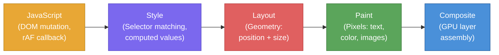
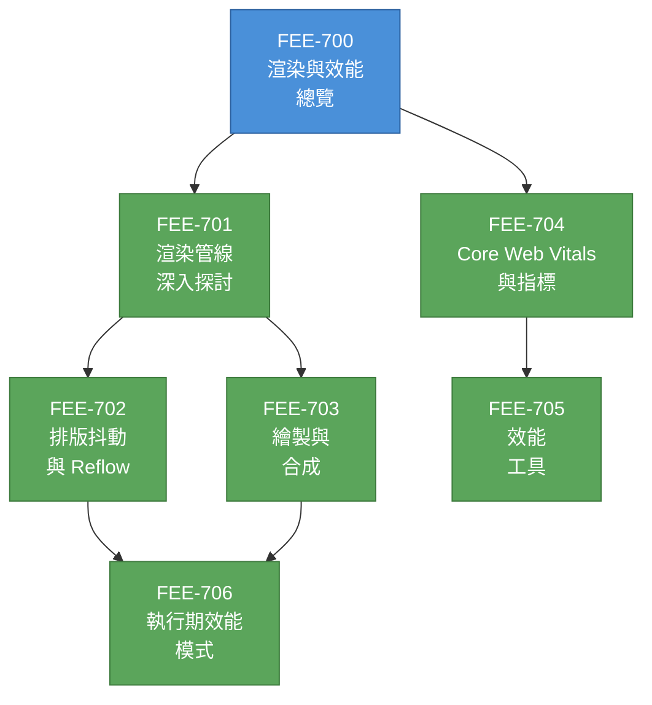

# [FEE-700] 渲染與效能總覽

:::info
本類別涵蓋瀏覽器如何將 HTML、CSS 與 JavaScript 轉換為螢幕上的像素 -- 以及前端工程師如何確保這個過程保持快速。主題涵蓋渲染管線（rendering pipeline）、幀預算（frame budget）、排版抖動（layout thrashing）、繪製最佳化、合成（compositing）、Core Web Vitals 以及效能工具。
:::

## 背景

使用者在網頁上的每一次互動 -- 滾動、點擊、打字、觀看動畫 -- 都依賴瀏覽器在嚴格的時間限制內完成一系列工作。這個序列就是**渲染管線（rendering pipeline）**，理解它是區分「能打造快速介面的工程師」與「靠猜測調整效能的工程師」的關鍵。

渲染管線描述瀏覽器將變更（DOM 異動、CSS 過渡、滾動事件）轉換為更新像素所執行的階段：

1. **JavaScript** -- 程式碼執行並觸發視覺變更：DOM 異動、class 切換、`requestAnimationFrame` 回呼。
2. **Style（樣式計算）** -- 瀏覽器重新計算哪些 CSS 規則適用於哪些元素（選擇器匹配），並計算最終屬性值。
3. **Layout（排版）** -- 瀏覽器計算渲染樹中每個受影響元素的幾何資訊 -- 位置與尺寸。首次計算稱為 layout；後續的重新計算稱為 **reflow**。
4. **Paint（繪製）** -- 瀏覽器填入像素：文字、顏色、圖片、邊框、陰影。現代瀏覽器會繪製到多個 **layers（圖層）**，而非單一表面。
5. **Composite（合成）** -- 合成器執行緒取得繪製好的圖層，套用 transform 與 opacity，組裝出最終影像。此步驟可在 GPU 上執行，不佔用主執行緒。

並非每個變更都會觸發每個階段。這正是效能優化的核心洞察：

- **改變 layout 屬性**（例如 `width`、`height`、`margin`、`top`）會觸發完整管線：Style、Layout、Paint、Composite。
- **改變 paint-only 屬性**（例如 `background-color`、`box-shadow`、`color`）會跳過 Layout：Style、Paint、Composite。
- **改變 compositor-only 屬性**（例如 `transform`、`opacity`）同時跳過 Layout 與 Paint：Style、Composite。這是最低成本的路徑，也是動畫與滾動效果應優先採用的方式。

### 幀預算（Frame Budget）

在 60 Hz 更新率下，瀏覽器必須每 **16.66 毫秒** 產生一個新幀。扣除瀏覽器自身的開銷（排程、垃圾回收、合成器簿記），開發者在每幀中大約有 **10 毫秒** 的主執行緒時間來完成 JavaScript、樣式計算、排版與繪製工作。

錯過截止時間會產生 **jank（卡頓）** -- 使用者會立即感知到可見的結巴或掉幀。這個閾值並非理論值；人類感知研究一致顯示：

| 閾值 | 使用者感知 |
|------|-----------|
| 0-16 ms | 流暢的動態效果。使用者感知為連續動畫。 |
| 16-100 ms | 對離散回應（按鈕回饋、選單展開）可接受。 |
| 100-300 ms | 可感知的延遲。介面感覺遲鈍但仍與操作有關聯。 |
| 300-1000 ms | 明顯的延遲。使用者失去直接操控的感覺。 |
| > 1000 ms | 斷裂。使用者會認為頁面凍結或操作失敗。 |

對動畫和滾動而言，16.66 ms 的預算是不可妥協的。對離散互動（點擊開啟 modal、提交表單），Interaction to Next Paint（INP）指標以 200 ms 作為「良好」的閾值。

### 為什麼效能不同於正確性

一個功能可以在功能上正確 -- 給定正確的輸入就能渲染正確的輸出 -- 但仍然是糟糕的使用者體驗。效能是一種感知品質，不是布林值。兩個產生完全相同視覺輸出的實作，如果一個在 8 ms 內交付幀，另一個需要 80 ms，使用者感受會截然不同。

這就是為什麼效能無法在開發完成後才補上。排版選擇（你對哪些 CSS 屬性做動畫）、架構選擇（你如何批次處理 DOM 讀取與寫入）、API 選擇（你使用 `IntersectionObserver` 還是帶有 `getBoundingClientRect` 的 scroll 事件監聽器）都決定了渲染管線能否在預算內完成。

## 設計思維

### 為什麼是管線（Pipeline）而非單次處理

渲染管線是分階段的，原因與編譯器將詞法分析、語法解析和程式碼生成分開相同：**關注點分離（separation of concerns）能實現針對性的最佳化**。

如果樣式計算、排版和繪製是單一的整體操作，任何變更 -- 即使只是將 `opacity` 從 1 切換到 0.5 -- 都需要重新計算幾何並重新繪製每個像素。管線的分階段設計意味著瀏覽器可以**跳過無關的階段**：

- Compositor-only 屬性（`transform`、`opacity`）完全繞過 layout 和 paint。合成器執行緒在 GPU 上處理這些，不觸及主執行緒。這就是為什麼 CSS `transform: translateX(100px)` 與 `left: 100px` 的效能表現根本不同 -- 即使兩者在視覺上都是移動元素。

- Paint-only 屬性（`background-color`、`color`）繞過 layout。瀏覽器知道改變顏色不可能影響幾何，因此跳過昂貴的排版步驟。

這種架構也是 **layers（圖層）** 存在的原因。瀏覽器會將特定元素（具有 `will-change`、`transform`、`opacity` 的元素，以及 `<video>`、`<canvas>`）提升到獨立的合成圖層。每個圖層可以獨立繪製並在 GPU 上合成。當只有一個圖層變更時，瀏覽器只需重新繪製該圖層並重新合成 -- 避免整頁重繪。

### 為什麼效能「感覺」不同於正確性

正確性是二元的：按鈕不是提交了表單就是沒有。效能是一個與人類感知相關的光譜，其閾值根植於心理物理學（psychophysics）：

- **100 ms** 是使用者感覺系統即時反應的極限。低於此閾值，因果關係感覺直接相連。
- **300 ms** 是互動開始感覺遲鈍的臨界點。使用者開始注意到自己在等待。
- **1000 ms** 是維持思維流暢的極限。超過此時間，使用者會在心理上脫離任務。

這些閾值解釋了為什麼幀預算存在（60 fps 動畫需要 16.66 ms）、為什麼 INP 目標是 200 ms、為什麼 Largest Contentful Paint 目標是 2.5 秒。每個指標都對應一個感知邊界。

實務上的結論：效能工作需要**量測（measurement）**，而非直覺。工程師經常猜錯時間花在哪裡。Chrome DevTools 中的 Performance 面板、Lighthouse 和 `PerformanceObserver` API 之所以存在，正是因為渲染管線的行為無法僅從閱讀原始碼來推斷。

## 圖解

### 渲染管線（Rendering Pipeline）

### 類別路線圖（Category Roadmap）

**閱讀順序：** 從管線深入探討（701）開始，建立瀏覽器渲染的心智模型。排版抖動（702）與繪製/合成（703）深入探討特定管線階段。Core Web Vitals（704）與工具（705）涵蓋量測。執行期效能模式（706）將一切整合為實用的最佳化技術。

## 相關 FEE

| FEE | 關聯 |
|-----|------|
| [FEE-300 JavaScript 核心與執行環境](../JavaScript%20Core%20and%20Runtime/300.md) | JavaScript 執行是渲染管線的第一個階段。理解事件迴圈（event loop）、微任務（microtask）與 `requestAnimationFrame` 時序對避免 jank 至關重要。 |
| [FEE-200 CSS 與排版系統](../CSS%20and%20Layout%20Systems/200.md) | CSS 屬性決定觸發哪些管線階段。排版模式（Flexbox、Grid）影響 reflow 成本。使用 `transform` 與 `left` 做動畫有根本不同的效能特性。 |
| [FEE-400 瀏覽器 API 與 Web 平台](../Browser%20APIs%20and%20Web%20Platform/400.md) | `IntersectionObserver`、`requestIdleCallback`、`PerformanceObserver` 和 Web Animations API 等 API 是瀏覽器原生的效能基礎設施。 |

## 參考資料

- [Rendering Performance -- web.dev](https://web.dev/articles/rendering-performance) -- Google 關於像素管線、幀預算與三種管線路徑的權威指南
- [Populating the Page: How Browsers Work -- MDN](https://developer.mozilla.org/en-US/docs/Web/Performance/Guides/How_browsers_work) -- 從 DNS 查詢到合成的關鍵渲染路徑完整說明
- [Inside Look at Modern Web Browser (Part 3) -- Chrome for Developers](https://developer.chrome.com/blog/inside-browser-part3) -- 渲染器行程、合成器執行緒與圖層樹的詳細說明
- [RenderingNG Architecture -- Chrome for Developers](https://developer.chrome.com/docs/chromium/renderingng-architecture) -- Chromium 現代渲染架構，包含執行緒模型與管線階段
- [Critical Rendering Path -- MDN](https://developer.mozilla.org/en-US/docs/Web/Performance/Guides/Critical_rendering_path) -- MDN 關於瀏覽器將 HTML、CSS、JS 轉換為像素的步驟指南
