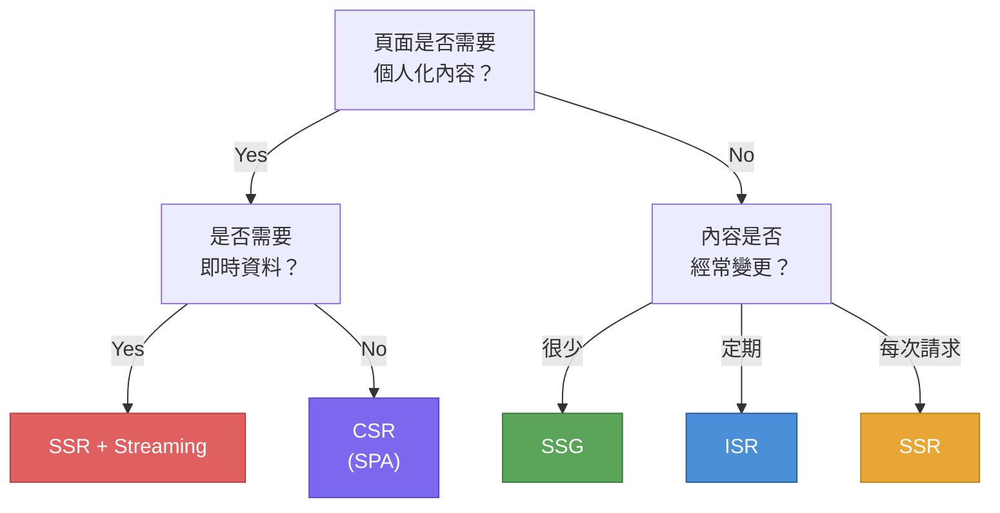

# [FEE-701] 渲染策略：CSR、SSR、SSG 與串流

:::info
本文涵蓋前端工程師可用的主要渲染策略 -- Client-Side Rendering（CSR，客戶端渲染）、Server-Side Rendering（SSR，伺服器端渲染）、Static Site Generation（SSG，靜態網站生成）、Incremental Static Regeneration（ISR，增量式靜態再生成）以及 Streaming SSR（串流式伺服器端渲染）-- 包括它們的效能取捨以及選擇決策框架。
:::

## 背景

現代的 Web 應用程式不再受限於單一渲染策略。「HTML 在哪裡、何時產生？」已成為逐路由（per-route）、甚至逐元件（per-component）的決策。理解從完全靜態到完全動態的渲染光譜，是做出正確架構選擇的基礎 -- 這些選擇直接影響 Time to First Byte（TTFB，首位元組時間）、First Contentful Paint（FCP，首次內容繪製）、Time to Interactive（TTI，可互動時間）、SEO 以及基礎設施成本。

### Client-Side Rendering（CSR，客戶端渲染）

在 CSR 中，伺服器傳送一個最小的 HTML 外殼（通常只有 `<div id="app"></div>`）和一個 JavaScript 套件。瀏覽器下載、解析並執行 JavaScript，然後由客戶端取得資料並完整渲染 UI。

**特性：**

- **TTFB：** 快 -- 伺服器傳送的是一個小型靜態 HTML 檔案。
- **FCP：** 慢 -- 瀏覽器必須下載並執行 JS 套件後才會出現任何有意義的內容。
- **TTI：** 慢 -- 頁面在完整套件載入並完成 hydration（若有）之前無法互動。
- **SEO：** 預設較差 -- 搜尋引擎爬蟲看到的是空殼，除非它們執行 JavaScript。雖然 Googlebot 會執行 JS，但其他爬蟲可能不會，且索引內容出現會有延遲。
- **基礎設施成本：** 低 -- 伺服器只是一個簡單的靜態檔案伺服器或 CDN。

CSR 是使用 React（Create React App）、Vue CLI 和未設定 SSR 的 Angular CLI 建構的單頁應用程式（SPA）的預設模型。它適合用於需要登入的儀表板、內部工具，以及 SEO 不重要且使用者願意以初始載入時間換取後續流暢導航的應用。

### Server-Side Rendering（SSR，伺服器端渲染）

在 SSR 中，伺服器為每個請求生成完整的 HTML。瀏覽器收到完整標記後立即繪製，接著下載 JavaScript 進行「hydration（注水）」-- 附加事件監聽器使頁面具備互動性。

**特性：**

- **TTFB：** 較慢 -- 伺服器必須先取得資料並渲染 HTML 才能回應。TTFB 取決於伺服器效能、資料庫延遲以及頁面的複雜度。
- **FCP：** 快 -- 瀏覽器收到完整 HTML 後可以在 JS 載入前就繪製頁面。
- **TTI：** 中等 -- 頁面出現（FCP）到可以互動（hydration 完成）之間有一段間隔。這段間隔就是 SSR 的「恐怖谷（uncanny valley）」。
- **SEO：** 極佳 -- 爬蟲收到的是完整渲染的 HTML。
- **基礎設施成本：** 較高 -- 每個請求都需要伺服器運算。伺服器必須可用且回應快速。

當頁面內容因使用者而異、每次請求都不同、或依賴即時資料時，SSR 是正確的選擇。社群媒體動態消息、具有動態定價的電商產品頁面、以及搜尋結果頁面都是典型的 SSR 使用場景。

### Static Site Generation（SSG，靜態網站生成）

在 SSG 中，頁面在建置時（build time）被渲染為 HTML。輸出是一組靜態 HTML 檔案，可直接從 CDN 提供服務，請求時不需要任何伺服器運算。

**特性：**

- **TTFB：** 最快 -- 回應是從邊緣節點（edge）提供的預先建置檔案。
- **FCP：** 最快 -- 完整 HTML 立即可用。
- **TTI：** 快 -- 純靜態內容幾乎不需要 hydration。
- **SEO：** 極佳 -- 爬蟲收到完整渲染的 HTML。
- **基礎設施成本：** 最低 -- CDN 上的靜態檔案，不需要原始伺服器進行渲染。

SSG 適合部署之間不會變更的內容：文件網站、部落格、行銷頁面和到達頁面。取捨是任何內容更新都需要重新建置和重新部署。

### Incremental Static Regeneration（ISR，增量式靜態再生成）

ISR 由 Next.js 推廣，結合了 SSG 的效能與無需完整重建即可更新內容的能力。頁面在建置時靜態生成，但可以在可設定的時間間隔後或按需（on-demand）在背景中重新驗證。

**特性：**

- **TTFB：** 快 -- 提供快取的靜態頁面。過期的頁面會觸發背景再生成。
- **FCP：** 快 -- 與快取頁面的 SSG 相同。
- **TTI：** 快 -- 與 SSG 相同。
- **SEO：** 極佳 -- 爬蟲始終收到渲染好的 HTML。
- **基礎設施成本：** 低到中等 -- 大多數請求命中快取；只有過期時才進行再生成。

ISR 適合大型內容網站（擁有數千個產品頁面的電商目錄、新聞網站），這類網站完整重建不切實際，且內容可以容忍幾秒或幾分鐘的過期。

### Streaming SSR（串流式伺服器端渲染）

Streaming SSR 在伺服器生成 HTML 時分段（chunks）傳送給瀏覽器，而非等到整個頁面完成後才傳送任何位元組。瀏覽器在收到第一個分段時就可以開始解析和繪製。

**特性：**

- **TTFB：** 相較傳統 SSR 有改善 -- 第一個位元組在外殼準備好後就到達，即使較慢的資料來源尚未解析完成。
- **FCP：** 更快 -- 瀏覽器在下方區段持續串流時就渲染外殼和首屏內容。
- **TTI：** 可能更快 -- 早期區段的 JavaScript 可以在後續區段仍在串流時開始 hydration。
- **SEO：** 極佳 -- 最終的 HTML 是完整且完全渲染的。
- **基礎設施成本：** 與 SSR 類似，但在不增加額外運算的情況下降低感知延遲。

當頁面有多個獨立的資料來源且延遲不同時，串流特別有價值。伺服器不必等最慢的查詢完成才回應整個頁面，而是立即串流已準備好的區段，並在資料到達時填入其餘部分。

## 設計思維

### 為什麼有這麼多渲染模式？

渲染策略的多樣化並非偶然的複雜性。它反映了三個相互拉扯的基本關注點之間的張力：

1. **內容新鮮度** -- 資料必須多即時？上週的部落格文章從靜態快取提供完全沒問題。股票價格必須精確到秒。
2. **效能** -- 使用者期望頁面在一秒內載入。CDN 上的靜態檔案是最快的傳遞機制。伺服器渲染增加延遲但能提供動態內容。
3. **基礎設施成本** -- 每個 SSR 請求都消耗 CPU 資源。靜態檔案的服務成本幾乎為零。渲染越動態，需要的伺服器越多。

沒有單一策略能同時最佳化這三者。這就是為什麼現代框架提供了一系列選項，並鼓勵在同一應用程式中混合使用多種策略：

| 情境 | 最佳策略 | 原因 |
|------|---------|------|
| 部落格 / 文件網站 | SSG | 內容很少變更；最大化速度、最小化成本 |
| 電商目錄 | SSG + ISR | 數千頁面，定期更新；完整重建不切實際 |
| 個人化儀表板 | SSR 或 CSR | 內容因使用者而異；無法預先渲染 |
| 電商結帳 | SSR + Streaming | 個人化、即時定價；串流避免被慢速 API 阻塞 |
| 內部管理工具 | CSR | 不需要 SEO；使用者接受初始載入以換取豐富互動性 |
| 行銷到達頁面 | SSG | 為轉換率最大化效能；內容由團隊控制 |

### 框架預設值與策略光譜

每個主要框架都在靜態到動態的光譜上選擇了預設位置，反映其主要受眾和設計哲學：

- **Next.js（App Router）：** 預設為 React Server Components（RSC）搭配靜態渲染。除非頁面使用動態函式（`cookies()`、`headers()`、`searchParams`），否則會靜態渲染。串流透過 `loading.js` 和 `<Suspense>` 內建支援。ISR 透過 `revalidate` 支援。Next.js 的定位是「預設靜態，需要時動態」。

- **Nuxt 3：** 預設為 universal rendering（通用渲染）-- 首次請求使用 SSR，後續頁面切換使用客戶端導航。支援混合渲染（hybrid rendering），個別路由可設定為 SSR、SSG、ISR 或 CSR。`routeRules` API 允許逐路由設定而無需修改程式碼。

- **Astro：** 預設為靜態輸出且零客戶端 JavaScript。互動式元件（「islands，島嶼」）透過 `client:*` 指令選擇性加入 hydration。這種 Islands Architecture（島嶼架構）傳送最少量的 JavaScript，使 Astro 成為內容導向網站最快的選擇。按需（伺服器）渲染可依路由啟用。

- **SvelteKit：** 預設為 universal rendering（SSR + 客戶端 hydration）。頁面可透過 `export const prerender = true` 選擇啟用預渲染（SSG）。SvelteKit 的編譯器產生的執行期程式碼極為精簡，所產生的套件比虛擬 DOM 框架更小。

- **Remix / React Router v7：** 預設為 SSR 搭配巢狀路由 loader。串流是一等公民，透過 `defer()` 和 `<Await>` 實現。Remix 的哲學是「善用平台」-- 利用 HTTP 快取、漸進增強和串流，而非靜態生成。沒有內建 SSG 或 ISR；快取在 HTTP 層處理。

### 從靜態到動態的光譜

```
完全靜態                                                    完全動態
|-------|-----------|-----------|------------|------------|
SSG     SSG+ISR     Streaming   SSR          CSR
                    SSR
        
建置時渲染          請求時渲染                客戶端渲染
```

核心洞察是：這不是一個排名 -- 而是一個工具箱。架構良好的應用程式通常同時使用多種策略。一個 Next.js 電商網站可能首頁使用 SSG、產品頁面使用 ISR、搜尋結果使用 SSR + Streaming、購物車使用 CSR -- 全部在同一個程式碼庫中。

## 圖解

### 渲染時間軸：TTFB、FCP、TTI 比較

```mermaid
gantt
    title Rendering Strategy Timeline Comparison
    dateFormat X
    axisFormat %s

    section CSR
    TTFB (HTML shell)        :done, csr_ttfb, 0, 1
    Download JS bundle       :active, csr_js, 1, 4
    Execute JS + Fetch data  :csr_exec, 4, 7
    FCP (content appears)    :milestone, csr_fcp, 7, 7
    TTI (interactive)        :milestone, csr_tti, 7, 7

    section SSR
    Server render            :done, ssr_render, 0, 3
    TTFB (full HTML)         :milestone, ssr_ttfb, 3, 3
    FCP (content appears)    :milestone, ssr_fcp, 3, 3
    Download + Hydrate JS    :active, ssr_hydrate, 3, 6
    TTI (interactive)        :milestone, ssr_tti, 6, 6

    section SSG
    TTFB (cached HTML)       :done, ssg_ttfb, 0, 1
    FCP (content appears)    :milestone, ssg_fcp, 1, 1
    Download + Hydrate JS    :active, ssg_hydrate, 1, 3
    TTI (interactive)        :milestone, ssg_tti, 3, 3

    section Streaming SSR
    Server starts streaming  :done, str_start, 0, 1
    TTFB (first chunk)       :milestone, str_ttfb, 1, 1
    FCP (shell + above fold) :milestone, str_fcp, 1, 1
    Stream remaining chunks  :active, str_stream, 1, 4
    Progressive hydration    :str_hydrate, 2, 5
    TTI (interactive)        :milestone, str_tti, 5, 5
```



### 決策流程圖



## 範例

### 1. CSR：SPA 資料取得模式

典型的 CSR 應用在元件掛載後才取得資料。頁面在 JavaScript 執行且 API 回應前是空白的。

```jsx
// React CSR -- 資料取得完全在客戶端進行
import { useState, useEffect } from 'react';

function ProductList() {
  const [products, setProducts] = useState([]);
  const [loading, setLoading] = useState(true);

  useEffect(() => {
    // 這個 fetch 只在瀏覽器中 JS 載入後才執行
    fetch('/api/products')
      .then(res => res.json())
      .then(data => {
        setProducts(data);
        setLoading(false);
      });
  }, []);

  if (loading) return <div>Loading...</div>;

  return (
    <ul>
      {products.map(p => (
        <li key={p.id}>{p.name} -- ${p.price}</li>
      ))}
    </ul>
  );
}
```

**取捨：** 使用者會看到 "Loading..." 直到 API 回應。搜尋引擎可能不會索引產品列表。這種模式對需要登入的儀表板可以接受，但對公開內容頁面則有問題。

### 2. SSR + Streaming（Next.js App Router）

Streaming SSR 立即傳送頁面外殼，並在資料相依區段解析完成時填入。`<Suspense>` 邊界定義了串流 fallback 出現的位置。

```tsx
// app/products/page.tsx -- Next.js App Router 搭配串流
import { Suspense } from 'react';

// 此元件在伺服器端取得資料
async function ProductList() {
  // 慢速 API 呼叫 -- 但不會阻塞整個頁面
  const res = await fetch('https://api.example.com/products', {
    next: { revalidate: 60 }, // ISR：每 60 秒重新驗證
  });
  const products = await res.json();

  return (
    <ul>
      {products.map((p: Product) => (
        <li key={p.id}>{p.name} -- ${p.price}</li>
      ))}
    </ul>
  );
}

// 頁面外殼立即串流；ProductList 在準備好時串流進來
export default function ProductsPage() {
  return (
    <main>
      <h1>Our Products</h1>
      <Suspense fallback={<p>Loading products...</p>}>
        <ProductList />
      </Suspense>
    </main>
  );
}
```

**取捨：** 使用者立即看到頁面標題和載入佔位符（快速 FCP）。產品列表在 API 回應後出現。沒有客戶端的 fetch 瀑布。最終的 HTML 對 SEO 是完整的。

### 3. SSG + ISR（Next.js Pages Router）

ISR 在建置時生成頁面，並在頁面過期時於背景中再生成。

```tsx
// pages/products/[id].tsx -- Next.js Pages Router 搭配 ISR
import type { GetStaticProps, GetStaticPaths } from 'next';

export const getStaticPaths: GetStaticPaths = async () => {
  // 在建置時預渲染前 100 個產品
  const res = await fetch('https://api.example.com/products?top=100');
  const products = await res.json();

  return {
    paths: products.map((p: Product) => ({ params: { id: String(p.id) } })),
    fallback: 'blocking', // 未預渲染的頁面在首次請求時使用 SSR
  };
};

export const getStaticProps: GetStaticProps = async ({ params }) => {
  const res = await fetch(`https://api.example.com/products/${params!.id}`);
  const product = await res.json();

  return {
    props: { product },
    revalidate: 3600, // 最多每小時再生成一次
  };
};

export default function ProductPage({ product }: { product: Product }) {
  return (
    <main>
      <h1>{product.name}</h1>
      <p>{product.description}</p>
      <p>Price: ${product.price}</p>
    </main>
  );
}
```

**取捨：** 在重新驗證視窗後的第一位訪客會觸發背景再生成，但仍然收到過期的快取頁面（stale-while-revalidate 模式）。這代表內容可能過期最多 `revalidate` 秒，這對產品目錄可以接受，但對即時定價則不行。

## 常見錯誤

### 1. 對內容導向、依賴 SEO 的網站使用 CSR

將公開的部落格、文件網站或電商門市建構為純 CSR SPA，代表搜尋引擎看到的是空白頁面（或必須等待 JS 執行）。即使 Googlebot 可以執行 JavaScript，索引也有顯著的延遲，且其他搜尋引擎可能根本不執行 JS。修正方式：對任何需要被搜尋發現的內容使用 SSG 或 SSR。

### 2. 對很少變更的內容使用 SSR

在每個請求中渲染一個行銷頁面或部落格文章，浪費伺服器運算資源並增加 TTFB，卻沒有任何好處。如果內容對每個訪客都相同，且只在團隊發布更新時才變更，SSG（或大型網站使用 ISR）可以更快、更便宜地傳遞相同的 HTML。

### 3. 頁面有慢速資料來源時不使用串流

傳統 SSR 會阻塞整個回應直到所有資料取得完成。如果一個 API 呼叫需要 3 秒，使用者就盯著空白畫面 3 秒。Streaming SSR 立即傳送頁面外殼，並在慢速區段解析完成時填入。在可以串流的情況下不使用串流，等於白白浪費了 FCP 的改善空間。

### 4. ISR 缺乏重新驗證策略

設定 `revalidate: 3600` 後就不再理會，代表使用者可能看到最多一小時前的內容。對時間敏感的內容（活動頁面、限時特賣），這可能造成損害。修正方式：對關鍵內容使用按需重新驗證（webhook 觸發），僅對可以容忍過期的內容使用基於時間的重新驗證。永遠思考使用者可能遇到的最差情況過期時長。

### 5. 伺服器/客戶端分歧導致的 Hydration 不匹配

當伺服器渲染的 HTML 與客戶端 JavaScript 預期渲染的結果不一致時，React 會拋出 hydration mismatch 錯誤，使用者可能看到一閃而過的錯誤內容。常見原因：
- 在渲染期間使用 `Date.now()` 或 `Math.random()`（伺服器與客戶端的值不同）。
- 在 SSR 期間存取 `window` 或 `localStorage`（這些在伺服器上不存在）。
- 基於瀏覽器專屬 API 的條件式渲染。

修正方式：將瀏覽器專屬邏輯隔離在 `useEffect` 中或 `typeof window !== 'undefined'` 判斷之後，確保初始渲染在伺服器端和客戶端產生相同的輸出。

## 相關 FEE

| FEE | 關聯 |
|-----|------|
| [FEE-700 渲染與效能總覽](./700.md) | 母類別總覽，涵蓋 HTML 到達後執行的瀏覽器渲染管線 -- 無論該 HTML 是如何產生的。 |
| [FEE-703 繪製與合成](./703.md) | Hydration 是 SSR 和串流中的關鍵步驟，會觸發 paint 和 compositing。理解這些管線階段有助於診斷 hydration 效能問題。 |
| [FEE-106 漸進增強](../HTML%20and%20Semantic%20Markup/106.md) | 漸進增強（progressive enhancement）確保伺服器渲染的內容在客戶端 JavaScript 載入前就能運作 -- 這個原則直接支援 SSR 和串流策略。 |

## 參考資料

- [Rendering on the Web -- web.dev](https://web.dev/articles/rendering-on-the-web) -- Google 對 CSR、SSR、SSG、串流與 rehydration 模式的綜合比較與效能分析
- [How to Choose the Best Rendering Strategy -- Vercel](https://vercel.com/blog/how-to-choose-the-best-rendering-strategy-for-your-app) -- SSG、ISR、SSR 與 CSR 的選擇決策框架，附實際應用模式
- [Rendering: Server Components -- Next.js Docs](https://nextjs.org/docs/app/building-your-application/rendering/server-components) -- Next.js 關於 React Server Components、串流與 App Router 渲染模型的文件
- [Hybrid Rendering -- Nuxt Docs](https://nuxt.com/docs/guide/concepts/rendering#hybrid-rendering) -- Nuxt 3 逐路由混合 SSR、SSG、ISR 與 CSR 的方式
- [On-demand Rendering -- Astro Docs](https://docs.astro.build/en/guides/on-demand-rendering/) -- Astro 讓個別路由選擇啟用伺服器渲染、其餘保持靜態的模型
- [Islands Architecture -- Astro Docs](https://docs.astro.build/en/concepts/islands/) -- Astro 的 Islands Architecture，在靜態頁面中選擇性 hydration 互動式元件
- [SvelteKit Routing: Page Options -- SvelteKit Docs](https://svelte.dev/docs/kit/page-options) -- SvelteKit 逐路由設定 prerendering、SSR 與 CSR 的方式
- [Rendering Strategies -- patterns.dev](https://www.patterns.dev/react/rendering-patterns) -- 渲染模式的視覺化指南，涵蓋 streaming SSR 與 progressive hydration
