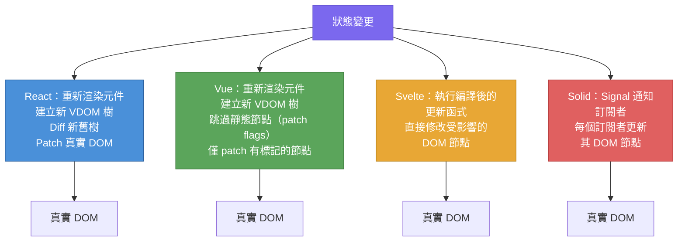

# [FEE-702] 虛擬 DOM、協調與差異比較

:::info
本文說明什麼是 Virtual DOM（虛擬 DOM），React 等框架如何透過 reconciliation（協調）與 diffing（差異比較）來最小化真實 DOM 操作，以及為什麼 Svelte、Solid 等框架完全捨棄了 Virtual DOM，改用編譯器或 signal（訊號）為基礎的方案。
:::

## 背景

操作真實 DOM 的成本很高。每一次 `document.createElement`、每一次 `element.setAttribute`、每一次 `parentNode.appendChild` 都會觸發瀏覽器的內部記帳工作：style recalculation（樣式重新計算）、layout（佈局）、paint（繪製）、compositing（合成）。當一次使用者互動改變了數十個元素時，每次改變都直接操作 DOM 的命令式程式碼會產生遠超必要的工作量。

**Virtual DOM（VDOM，虛擬 DOM）** 是一層抽象，透過在應用程式碼與真實 DOM 之間插入一個輕量的記憶體內 UI 表示來解決這個問題。應用程式不直接修改 DOM，而是將期望的 UI 狀態描述為一棵由純 JavaScript 物件組成的樹。框架接著將新樹與前一棵樹比較（稱為 **diffing，差異比較**），計算出最少的真實 DOM 操作，然後批次套用（稱為 **reconciliation，協調**）。

### Virtual DOM 的運作方式

1. **Render（渲染）**：應用程式產生一棵新的 VDOM 樹，由描述元素類型、props 和子節點的輕量物件組成。
2. **Diff（差異比較）**：框架逐節點比較新樹與前一棵樹。
3. **Patch（修補）**：只將差異套用到真實 DOM：這裡改一個屬性、那裡插入一個節點、別處移除一個。

這個模式將「UI 應該長什麼樣子」的問題（宣告式）與「如何從狀態 A 將 DOM 變成狀態 B」的問題（命令式）解耦。框架處理命令式的部分，讓開發者可以用宣告式的思維。

### React：Fiber 與啟發式差異比較

React 在 2013 年開創了 Virtual DOM 方法。其目前的 reconciliation 引擎 **React Fiber**（在 React 16 引入）取代了原本同步、遞迴的樹走訪，改用增量式、可中斷的架構。

**兩個啟發式假設。** 通用的樹差異演算法時間複雜度為 O(n^3)（對有數百甚至數千節點的 UI 樹不切實際）。React 透過兩個假設將複雜度降至 O(n)：

1. **不同類型的元素會產生不同的樹。** 如果 `<div>` 變成 `<span>`，React 會拆除整棵舊子樹並建一棵新的，而不嘗試轉換。
2. **Key 在跨次渲染中識別穩定的子元素。** 渲染列表時，`key` prop 告訴 React 哪些子元素在不同渲染之間是相同的，使其能有效率地重新排序、插入或移除。

**Fiber 的增量模型。** Fiber 之前，reconciliation 是同步的：一旦 React 開始 diff，在整棵樹處理完之前無法暫停。深層的樹會導致掉幀。Fiber 將 reconciliation 拆分為工作單元（fiber node），每個代表一個元素。reconciler 可以：

- **暫停**工作以讓出主執行緒給瀏覽器（保持動畫流暢）。
- **優先處理**緊急更新（使用者輸入）而非較不緊急的更新（資料取得結果）。
- **放棄**過時的工作，如果新狀態在前一次 reconciliation 完成之前到達。

**Double buffering（雙緩衝）。** React 維護兩棵 fiber 樹：`current` 樹（目前畫面上的）和 `workInProgress` 樹（正在建構的下一個版本）。reconciliation 完成時，React 交換指標：`workInProgress` 變成 `current`。這避免了部分 UI 狀態。

### Vue：compiler-informed Virtual DOM（編譯器輔助的虛擬 DOM）

Vue 也使用 Virtual DOM，但其 template compiler（模板編譯器）在建置時執行優化，大幅減少了執行期的 diffing 工作量。

**Static hoisting（靜態提升）。** 編譯器偵測完全靜態的節點（無動態綁定），並將其 VDOM 建立提升到 render function 之外。這些節點只建立一次，在每次重新渲染時重複使用。當 renderer 偵測到新舊 vnode 是同一個參考時，完全跳過 diffing。

**Static node condensation（靜態節點壓縮）。** 當多個連續的靜態元素出現時，編譯器將它們壓縮為一個包含純 HTML 字串的「static vnode」，透過一次 `innerHTML` 操作設定。

**Patch flags（修補標記）。** 對於有動態綁定的節點，編譯器附加數值型的 patch flag，精確描述什麼可能改變：class、style、text、props。在執行期，patching 演算法檢查 flag 後直接跳到相關的比較，跳過所有不可能變更的屬性。

**Tree flattening（樹扁平化）。** 編譯器將動態節點抽取到一個扁平陣列（block tree），使執行期只遍歷實際需要 diffing 的節點，不論它們在模板中的深度。

**Vue Vapor Mode。** Vue 即將推出的 Vapor Mode 更進一步：將模板編譯為直接的 DOM 操作，完全不使用 VDOM（類似 Svelte 的方法），適用於選擇啟用的元件。

### Svelte：沒有 Virtual DOM

Svelte 的創建者 Rich Harris 在 2018 年主張 Virtual DOM 是「純粹的額外開銷（pure overhead）」。他的論點是：VDOM 是達成目的（宣告式 UI）的手段，不是唯一的手段。如果編譯器能在建置時分析元件程式碼並生成精確、最小的 DOM 更新指令，執行期的 diffing 步驟就不必要了。

Svelte 是一個**編譯器**。它在建置時分析元件的 reactive dependencies（反應式依賴），並生成直接更新依賴特定狀態的 DOM 節點的命令式 JavaScript。當 `count` 改變時，Svelte 不會重新渲染元件或 diff 一棵樹；它執行像 `set_data(t, count)` 這樣的生成語句來更新單一文字節點。

**取捨：**

- 更小的 runtime（沒有 VDOM 引擎傳送到瀏覽器）。
- 每個 reactive binding 的更新是 O(1)，而非每棵元件樹的 O(n)。
- 對於高度動態的 UI（編譯器無法預測輸出結構），彈性較低。
- 沒有跨平台渲染（編譯器專門針對 DOM）。

### Solid：signal 與直接 DOM 操作

Solid.js 採取不同的路徑到達相同的目的地。像 React 一樣，它使用 JSX。與 React 不同的是，它**不**使用 Virtual DOM。Solid 將 JSX 編譯為真實的 DOM 建立程式碼，每個元件只執行**一次**。反應性透過 **signal（訊號）** 處理，在細粒度層級追蹤其訂閱者的可觀察原始值。

當 signal 的值改變時，只有讀取該 signal 的特定 DOM 表達式會重新執行。元件函式本身永遠不會重新執行。這就是 **fine-grained reactivity（細粒度反應性）**：reactive graph（反應式圖）將 signal 直接連接到 DOM 更新函式，沒有中間的樹表示。

**與 React 的不同之處：**

- React 重新渲染元件（重新執行元件函式）並 diff 產生的樹。Solid 只執行元件函式一次，只更新 reactive expression。
- React 的粒度是元件。Solid 的粒度是個別的 DOM 表達式。
- React 需要 `React.memo`、`useMemo` 和 `useCallback` 來防止不必要的工作。Solid 的 reactive system 在設計上就避免了不必要的工作。

## 設計思維

### 為什麼 React 發明了 Virtual DOM

在 React 之前，建構互動式 UI 意味著撰寫命令式 DOM 操作：`document.getElementById('list').appendChild(newItem)`。這種方法有兩個根本問題：

1. **無法隨複雜度擴展。** 隨著可能的狀態數量增長，狀態之間的命令式轉換數量會以組合方式增長。宣告式模型，「給定這個狀態，UI 應該長這樣」，完全消除了轉換邏輯。
2. **將渲染耦合到 DOM。** 命令式程式碼直接使用 `document` 和 `element` API，使得無法渲染到其他目標（伺服器 HTML 字串、原生行動裝置視圖、測試框架）。

VDOM 解決了這兩個問題。它提供了**宣告式程式設計模型**（將 UI 描述為狀態的函式）和**平台無關的渲染目標**（VDOM 只是物件；任何 renderer 都可以消費它們）。React Native、React PDF、React Three Fiber 和 server-side rendering 都存在，是因為 VDOM 抽象將「渲染什麼」與「渲染到哪裡」分離了。

### 為什麼 Svelte 和 Solid 拒絕了 Virtual DOM

VDOM 引入了額外開銷：建立新的物件樹、走訪兩棵樹找出差異、然後套用修補。對許多應用而言，這個開銷很小，開發者體驗的好處值得。但它**不是零**，而且與元件樹的大小成正比，而非與實際變更的大小成正比。

Svelte 的洞察：如果框架是一個編譯器而非執行期函式庫，它可以提前分析程式碼並生成只針對可能改變的 DOM 節點的更新函式。結果是直接賦值，沒有建立樹、diffing 或 patching 步驟。

Solid 的洞察：如果反應性建立在原始值層（signal、effect、memo），reactive graph 本身就追蹤哪些 DOM 節點依賴哪些狀態。當狀態改變時，graph 告訴 runtime 確切要更新什麼。不需要重新執行元件、不需要 tree diffing。

### 編譯器 vs. 執行期的取捨

| | Runtime VDOM（React） | Compiler-informed VDOM（Vue） | 無 VDOM -- 編譯器（Svelte） | 無 VDOM -- signal（Solid） |
|---|---|---|---|---|
| 更新粒度 | 元件 | 元件（搭配 flag 捷徑） | 每個綁定 | 每個 signal 訂閱者 |
| Bundle 包含 | VDOM runtime + reconciler | VDOM runtime（較小）+ 編譯器輸出 | 最小 runtime + 生成程式碼 | 小型 runtime + 編譯後 JSX |
| 跨平台 | 是（React Native 等） | 有限（Vapor 僅針對 DOM） | 否（僅 DOM） | 有限 |
| 動態 UI 彈性 | 高 | 高 | 中等 | 高 |
| 開發者優化負擔 | 高（`memo`、`useMemo`、`useCallback`） | 低（編譯器處理大部分） | 極低 | 極低 |

沒有普遍「最好」的方法。React 的 VDOM 支撐了一整個 renderer 生態系和可擴展到大型團隊的心智模型。Vue 的 compiler-informed VDOM 以較少的開發者負擔獲得了大部分的執行期好處。Svelte 和 Solid 透過完全消除 VDOM 層達到了最高的原始更新效能，代價是跨平台的彈性。

## 最佳實踐

**在列表項目上提供穩定的 `key` prop。** MUST 從資料本身的身份衍生 key（資料庫 ID、UUID、slug），當列表可以被重新排序、篩選，或有項目插入/移除時，絕對不能使用陣列 index。缺少或基於 index 的 key 會導致 React 對錯誤的資料重用 DOM 節點，使輸入狀態損壞、動畫中斷，並強制進行不必要的 DOM 操作。MUST 在 React 迭代的元素上指定 key，而不是在其內部的子元素上。

**避免在 render 中建立匿名物件和函式。** 當這些表達式作為 props 傳遞給已記憶化的子元件時，SHOULD NOT 在 JSX 中內聯寫 <code v-pre>style={{ color: 'red' }}</code> 或 `onClick={() => handler(id)}`。每次渲染都會建立新的參考，導致 React.memo 和 PureComponent 的比較永遠失敗，使記憶化失效。SHOULD 使用 `useMemo` 穩定物件和陣列的參考，使用 `useCallback` 穩定函式的參考，或採用 React Compiler（React 19+）自動處理這些情況。

**縮小狀態的範圍以最小化重新渲染的子樹大小。** SHOULD 只將狀態提升到真正需要它的元件。根層級的狀態會在每次更新時導致整棵樹重新渲染。SHOULD 將頻繁變更的狀態分離到只有消費者訂閱的 context，或使用具有 selector 訂閱機制的專用狀態函式庫，讓一個狀態的更新不會在無關的子樹中引發連鎖反應。

## 圖解

### 協調：從舊樹到 DOM 修補

```mermaid
flowchart LR
    subgraph Before["前一棵 VDOM 樹"]
        A1["div"]
        A2["h1: 'Hello'"]
        A3["ul"]
        A4["li key=1: 'Apple'"]
        A5["li key=2: 'Banana'"]
        A1 --> A2
        A1 --> A3
        A3 --> A4
        A3 --> A5
    end

    subgraph After["新的 VDOM 樹"]
        B1["div"]
        B2["h1: 'Hello'"]
        B3["ul"]
        B4["li key=2: 'Banana'"]
        B5["li key=3: 'Cherry'"]
        B1 --> B2
        B1 --> B3
        B3 --> B4
        B3 --> B5
    end

    subgraph Diff["差異結果"]
        D1["移除 li key=1"]
        D2["插入 li key=3"]
        D3["重排 li key=2"]
    end

    subgraph Patch["DOM 修補"]
        P1["removeChild&#40;apple&#41;"]
        P2["appendChild&#40;cherry&#41;"]
        P3["將 banana 移到 index 0"]
    end

    Before --> Diff
    After --> Diff
    Diff --> Patch

    style Before fill:#4A90D9,color:#fff,stroke:#2A5F9E
    style After fill:#5BA55B,color:#fff,stroke:#3D7A3D
    style Diff fill:#E8A735,color:#fff,stroke:#B8841A
    style Patch fill:#E06060,color:#fff,stroke:#B84040
```



### 框架方法比較



## 範例

### 1. React：列表中的 Key 用法

Key 是 React 識別列表中哪些項目已變更、新增或移除的方式。沒有穩定的 key，React 會退回到基於 index 的比較，在項目重新排序時可能產生錯誤的結果。

```jsx
// 錯誤：對可重新排序的列表使用陣列 index 作為 key
function TodoList({ todos, onRemove }) {
  return (
    <ul>
      {todos.map((todo, index) => (
        // 如果項目被重新排序或移除，index 會移位，
        // React 會錯誤地重複使用 DOM 節點 -- input 狀態在項目間
        // 混亂、動畫中斷、效能下降。
        <li key={index}>
          <input type="checkbox" />
          <span>{todo.text}</span>
          <button onClick={() => onRemove(todo.id)}>Remove</button>
        </li>
      ))}
    </ul>
  );
}

// 正確：使用穩定、唯一的 ID 作為 key
function TodoList({ todos, onRemove }) {
  return (
    <ul>
      {todos.map((todo) => (
        // 穩定的 key 讓 React 在跨次渲染中追蹤每個項目。
        // 重新排序會移動 DOM 節點而非重新建立它們。
        <li key={todo.id}>
          <input type="checkbox" />
          <span>{todo.text}</span>
          <button onClick={() => onRemove(todo.id)}>Remove</button>
        </li>
      ))}
    </ul>
  );
}
```

### 2. Vue：靜態提升與 Patch Flags

Vue 的 template compiler 在建置時偵測靜態內容並生成優化的渲染程式碼。開發者撰寫一般的模板；編譯器負責優化工作。

```html
<template>
  <!-- 靜態內容：提升到 render function 之外，只建立一次 -->
  <header>
    <h1>My Application</h1>
    <p>Welcome to the dashboard</p>
  </header>

  <!-- 動態內容：只有 text binding 會被 diff -->
  <div>
    <span>Count: {{ count }}</span>       <!-- patch flag: TEXT -->
    <button :class="btnClass">Click</button> <!-- patch flag: CLASS -->
  </div>
</template>
```

編譯器輸出的概念大致如下：

```js
// 靜態節點被提升 -- 只建立一次，永不 diff
const _hoisted_1 = /*#__PURE__*/ createStaticVNode(
  '<header><h1>My Application</h1><p>Welcome to the dashboard</p></header>'
);

function render(_ctx) {
  return (
    openBlock(),
    createElementBlock(Fragment, null, [
      _hoisted_1, // 以參考重複使用 -- 完全跳過 diff
      createElementVNode("div", null, [
        createElementVNode(
          "span",
          null,
          "Count: " + toDisplayString(_ctx.count),
          1 /* TEXT -- 只有文字內容被 diff */
        ),
        createElementVNode(
          "button",
          { class: normalizeClass(_ctx.btnClass) },
          "Click",
          2 /* CLASS -- 只有 class 屬性被 diff */
        ),
      ]),
    ])
  );
}
```

### 3. Solid：細粒度 Signal 更新

在 Solid 中，元件函式只執行一次。Signal 建立 reactive subscription，直接更新 DOM，不需要重新渲染或 diff 步驟。

```jsx
import { createSignal } from "solid-js";

function Counter() {
  const [count, setCount] = createSignal(0);

  // 這個 console.log 只在元件掛載時執行一次。
  // 在 React 中，它會在每次重新渲染時執行。
  console.log("Counter component function executed");

  return (
    <div>
      {/* 當 count 改變時只有這個文字節點更新。
          div、button 和其他節點永遠不會被觸碰。 */}
      <p>Count: {count()}</p>
      <button onClick={() => setCount(count() + 1)}>
        Increment
      </button>
    </div>
  );
}
```

當 `setCount` 被呼叫時，Solid 不會重新執行 `Counter` 函式。它只更新 `<p>` 元素內的文字節點，訂閱了 `count` signal 的特定 DOM 節點。`<div>`、`<button>` 和其他所有節點都不會被觸碰。

## 深入剖析：Key 協調演算法與 Index Key 失效的原因

React 的 reconciliation 演算法在 VDOM 樹的每個節點上做出一個特定決策：如果元素類型與上一次渲染相同，就原地更新現有的 DOM 節點；如果類型改變了，就卸載整棵舊子樹並掛載一棵新的。這個決策是 O(n) 的，因為 React 從不嘗試將 `<div>` 轉換為 `<span>`：它只是直接銷毀並重建。

當 React 遇到一個列表（子節點陣列）時，它對每個子節點套用相同的規則，但現在需要決定哪個舊子節點對應到哪個新子節點。沒有 key 的話，React 按位置比較：假設新陣列中 index 0 的子節點與舊陣列中 index 0 的子節點是同一個。這個啟發式方法只在列表從不改變順序且不在中間插入或移除項目的情況下才正確。

**為什麼 index key 在重新排序時失效。** 假設有三個項目 `[A, B, C]` 用 `key={index}` 渲染，key 分別為 0、1、2。如果使用者將列表反轉為 `[C, B, A]`，React 再次看到 key 0、1、2。它得出結論：key 0 的項目與之前相同（只是 props 更新了），並進行原地更新。位置 0 的 DOM 節點沒有移動；只有其內容被修補。這代表：

- **元件狀態被固定到位置，而不是資料。** 如果 key 0 的項目有一個已輸入文字的 input 元素，這段文字現在會出現在曾經是 A 但現在顯示 C 資料的插槽中。DOM 節點留下來了，但它顯示的資料改變了。
- **動畫無法正確執行。** 綁定到元件實例的動畫（如掛載/進入過渡）永遠不會觸發，因為 React 從不卸載並重新掛載節點：它只是修補它。
- **React.memo 和 PureComponent 的記憶化失效。** 每個項目看起來都改變了（其 props 改變了），所以記憶化對每個元素都跳過了 bail-out，抵消了優化效果。

**為什麼穩定 ID key 有效。** 使用 `key={item.id}` 時，React 按身份而非位置匹配新舊子節點。當列表被重新排序時，React 識別出項目 A 的 DOM 節點應該移動到新位置，而不是原地更新。它執行 DOM 插入和移動而非 props 修補，保留元件狀態，觸發正確的生命週期方法，並允許 CSS 過渡正確觸發。

**不帶 key 的同類型/不同類型決策。** 即使在列表外，同類型啟發式方法也決定元件是否保留狀態。一個在相同位置交替 `<TextInput />` 和 `<NumberInput />` 的切換會卸載並重新掛載元件（清除狀態），因為類型不同。一個在相同位置交替兩個 `<TextInput />` 元件的切換會原地更新（保留狀態），這在你期望一個全新元件時可能令人驚訝。在相同位置的元件上明確使用 `key` 是強制 React 將它們視為不同實例並在切換時重置狀態的標準方法。

## 常見錯誤

### 1. 假設 Virtual DOM 很「快」

VDOM 不是效能優化。它是**程式設計模型**的優化。它存在是為了讓開發者可以撰寫宣告式 UI 程式碼而不需要手動追蹤 DOM 異動。VDOM 與完美針對性的命令式程式碼相比增加了額外開銷（樹建立、diffing、patching）。它比單純「清除並重建整個 DOM」的方法快，但比精確的手動更新慢。

**修正：** 將 VDOM 理解為取捨：以一些執行期成本換取開發者體驗和正確性。當這個成本重要時，使用框架特定的工具來降低它（`React.memo`、Vue patch flags 等），或考慮完全跳過 VDOM 的框架。

### 2. 未使用框架特定的優化工具

每個框架都提供了短路不必要工作的工具，但開發者往往忽略它們：

- **React：** `React.memo` 在 props 未改變時跳過重新渲染。`useMemo` 和 `useCallback` 穩定參考。React Compiler（React 19+）自動化這些。
- **Vue：** `v-once` 只渲染子樹一次，永不更新。`v-memo` 根據依賴值記憶化模板的部分。`shallowRef` 和 `shallowReactive` 選擇退出深層反應性。
- **Svelte：** `{#key}` 區塊在值改變時強制重新建立。不可變資料模式幫助編譯器優化。

**修正：** 學習並應用所選框架的效能原始工具。先 profiling，再優化。

## 相關 FEE

| FEE | 關聯 |
|-----|------|
| [FEE-700 渲染與效能總覽](./700.md) | 母類別總覽，涵蓋瀏覽器渲染管線。VDOM reconciliation 過程產生的 DOM 異動接著流經瀏覽器的 style、layout、paint 和 composite 階段。 |
| [FEE-401 DOM API 與遍歷](../Browser%20APIs%20and%20Web%20Platform/401.md) | VDOM 框架抽象化的真實 DOM API。理解 `createElement`、`setAttribute` 和 `appendChild` 的成本，解釋了為什麼透過 VDOM（或編譯器/signal）批次處理很重要。 |
| [FEE-502 反應式狀態原始值](../State%20Management/502.md) | Signal、observable 和 reactive primitive 是 Solid 和 Vue 細粒度反應性的基礎 -- 使無 VDOM 更新成為可能的機制。 |
| [FEE-601 區域元件狀態](../State%20Management/601.md) | 元件狀態在 VDOM 框架中觸發重新渲染。理解 `useState`、`ref` 和 `$state` 的運作方式對於理解 reconciliation 何時執行至關重要。 |

## 參考資料

- [Reconciliation (React, Legacy Docs)](https://legacy.reactjs.org/docs/reconciliation.html)：React 官方對 diffing 演算法、兩個啟發式假設（元素類型和 key）以及為何 O(n) 可達成的說明
- [React Fiber Architecture (Andrew Clark)](https://github.com/acdlite/react-fiber-architecture)：React Fiber 的原始設計文件，說明增量渲染、優先權和 fiber 資料結構
- [Rendering Mechanism (Vue.js)](https://vuejs.org/guide/extras/rendering-mechanism)：Vue 官方文件，涵蓋 compiler-informed VDOM、靜態提升、patch flags 和樹扁平化
- [Virtual DOM is Pure Overhead (Rich Harris, Svelte Blog)](https://svelte.dev/blog/virtual-dom-is-pure-overhead)：2018 年具影響力的文章，主張 VDOM 是達成宣告式 UI 的手段而非唯一手段，編譯器可以做得更好
- [Fine-Grained Reactivity (Solid Docs)](https://docs.solidjs.com/advanced-concepts/fine-grained-reactivity)：Solid 的文件，說明 signal、effect 和 memo 如何建立 reactive graph 來在無 VDOM 的情況下更新 DOM
- [Thinking Granular: How is SolidJS so Performant? (Ryan Carniato)](https://dev.to/ryansolid/thinking-granular-how-is-solidjs-so-performant-4g37)：深入探討 Solid 的編譯模型以及為什麼細粒度反應性在大多數更新模式中優於 VDOM diffing
