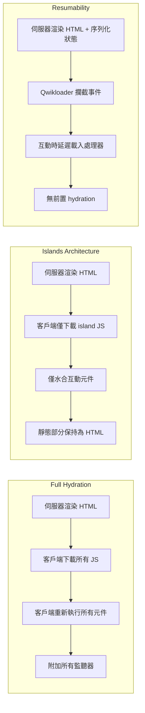

# [FEE-703] 水合與部分水合

:::info
本文涵蓋 hydration（水合）-- 讓伺服器渲染的 HTML 變得可互動的過程 -- 以及降低其成本的策略光譜：progressive hydration（漸進式水合，分階段進行的模式，可在任何框架中建構）、selective hydration（選擇性水合，React 以 Suspense 驅動的實作形式）、Islands Architecture（島嶼架構，Astro）和 resumability（可恢復性，Qwik）。理解這些模式對於縮短 First Contentful Paint 與頁面真正回應輸入之間的差距至關重要。
:::

## 背景

Server-Side Rendering（SSR，伺服器端渲染）產生完整渲染的 HTML，瀏覽器可以立即繪製，提供快速的 FCP 和良好的 SEO。但這些 HTML 是靜止的：伺服器渲染出的按鈕在 JavaScript 附加其點擊處理器之前什麼都不會做。將事件監聽器附加到伺服器渲染的標記上並恢復應用程式狀態的過程，稱為 **hydration（水合）**。Google 的渲染指南將相關術語 rehydration（再水合）保留給那些在 hydration 完成後仍持續以新狀態更新 DOM 的情況；但生態系中大多數人並不嚴格區分，會將兩者當作同義詞交替使用。

Hydration 是「看起來可互動」與「真正可互動」之間的橋樑。在 hydration 過程中，框架必須：

1. **下載** 包含元件邏輯的 JavaScript 套件。
2. **執行** 元件程式碼以重建虛擬 DOM 或元件樹。
3. **附加** 事件監聽器到現有 DOM 節點上。
4. **恢復** 應用程式狀態，使客戶端的表示與伺服器輸出一致。

在 hydration 完成之前，頁面處於 **恐怖谷（uncanny valley）** 狀態 -- 它看起來已經就緒，但不回應使用者輸入。FCP（內容可見）與 TTI（內容可互動）之間的這段間隔就是 **hydration gap（水合間隔）**，它隨頁面複雜度和 JavaScript 套件大小線性增長。

### Full hydration（完全水合）的成本

在傳統的 full hydration（React、Vue 和 Angular SSR 的預設行為）中，框架在客戶端重新執行每個元件，即使是完全靜態且永遠不會改變的元件也不例外。對於一個包含靜態 header、footer、sidebar 和一個互動式 widget 的頁面，full hydration 會為所有元件下載並執行 JavaScript -- 付出與整個頁面成正比的代價，而非僅與互動部分成正比。

這個成本體現在幾個方面：

- **套件大小：** 即使是靜態內容，所有元件程式碼都必須下載。
- **CPU 時間：** 框架遍歷整個元件樹，將虛擬 DOM 與伺服器渲染的 HTML 進行比對。
- **TTI 延遲：** 頁面在 hydration 完成前無法回應互動。在 CPU 較慢的行動裝置上，這個延遲可達數秒。
- **主執行緒阻塞：** Hydration 傳統上是同步的，會阻塞主執行緒，使瀏覽器無法回應使用者輸入。

### 解決方案的光譜

業界已發展出四種主要方法來降低 hydration 成本，各自做出不同的取捨：

| 策略 | 方法 | 傳送的 JS | Hydration 工作量 |
|------|------|----------|-----------------|
| Full hydration（完全水合） | 水合所有內容 | 所有元件 | 整個頁面 |
| Progressive hydration（漸進式水合） | 分階段水合 | 所有元件（延遲載入） | 整個頁面，分塊進行 |
| Partial hydration / Islands（部分水合 / 島嶼） | 只水合互動部分 | 僅島嶼元件 | 僅島嶼 |
| Resumability（可恢復性） | 完全跳過 hydration | 僅在互動時載入 | 無前置作業 |

只有 resumability 與特定框架綁定 -- 它需要一個從頭打造、能將監聽器與狀態序列化進 HTML 的框架，這正是 Qwik 整體設計的核心。其餘的 hydration 策略都是可移植的。本文以 React 作為串流範例，是因為其以 Suspense 驅動的 **selective hydration（選擇性水合）** 是文件最完整的實作 -- 它是由框架管理的 progressive hydration 形式，`<Suspense>` 邊界定義各個階段，使用者輸入則即時重新排序這些階段。Vue 3.5+ 以 lazy hydration 策略（`hydrateOnVisible()`、`hydrateOnIdle()`）提供相同能力，Astro islands 可承載任何框架的元件，而這種分階段模式也能用 `IntersectionObserver` 搭配動態 `import()` 在原生 JavaScript 中手動打造。

## 設計思維

### 為什麼 hydration 存在：SSR 到可互動的間隔

Web 平台以文件（document）形式傳遞 HTML，而非應用程式。當伺服器傳送 HTML 時，瀏覽器可以立即渲染 -- 但這個渲染是被動的。互動行為需要 JavaScript。SSR 給予使用者快速的視覺回饋（FCP），但應用程式在 JavaScript 載入並連接到 DOM 之前並未真正就緒。Hydration 就是橋接文件渲染與應用程式行為之間這個根本差距的機制。

替代方案 -- 等待 JavaScript 在客戶端渲染所有內容（CSR）-- 意味著使用者在整個套件載入並執行完畢前什麼都看不到。SSR 搭配 hydration 是一種務實的折衷：先顯示內容，之後再加入互動性。因此每個 SSR 應用程式都必須決定要 hydrate 多少、以及何時進行。

### Hydration gap：TTI 減去 FCP

Hydration gap（TTI - FCP）是使用者可以看到內容但無法互動的時間窗口。在這段期間：

- 按鈕的點擊被丟失或排入佇列。
- 表單提交沒有任何反應。
- 捲動觸發的動畫不會啟動。

使用者會認為這是壞掉的頁面。間隔越長，使用者體驗越差。對於互動性極少的內容導向頁面，這段間隔純粹是浪費 -- 框架正在水合永遠不會接收使用者互動的元件。

### Islands 作為典範轉移：預設靜態，只水合互動部分

Islands Architecture（島嶼架構）-- 由 Astro（一個以內容為核心、預設將頁面渲染為純 HTML 的 Web 框架）推廣 -- 顛覆了預設假設。它不是「水合所有東西，排除不需要的」，而是從「什麼都不水合，選擇性加入需要的」開始。每個元件預設都是靜態的。只有明確標記 hydration 指令（如 `client:load` 或 `client:visible`）的元件才會接收 JavaScript。

這是一個典範轉移，因為它改變了 JavaScript 成本的擴展行為。在 full hydration 中，JS 成本隨總頁面大小擴展。在 Islands 中，JS 成本隨互動表面積擴展。一個包含一個搜尋框和一個主題切換按鈕的文件頁面，只為這兩個元件傳送 JavaScript，無論周圍有多少段落、程式碼區塊和導航連結。

每個 island 都是獨立的 -- 它獨立水合、擁有自己的框架實例，且不透過框架與其他 island 共享狀態。這種隔離使 island 可以在同一頁面使用不同框架，並按不同時程水合（載入時、閒置時、可見時、媒體查詢匹配時）。

### Resumability：完全不 hydrate -- 將狀態與處理器序列化進 HTML

Qwik 採取最激進的方法：完全消除 hydration。Qwik 不是在客戶端重新執行元件來發現事件監聽器和重建狀態，而是在伺服器渲染時將三項資訊（監聽器、元件樹、應用程式狀態）直接序列化到 HTML 中。

當頁面在瀏覽器中載入時，一個微型的全域事件監聽器（Qwikloader，不到 1 KB）攔截使用者互動，並按需延遲載入僅該互動所需的特定處理器程式碼。在使用者實際互動之前，沒有元件程式碼會執行。應用程式從伺服器中斷的位置「恢復」，而非從頭「重播」。

這意味著：

- **頁面載入時零 JavaScript 執行**（除了 Qwikloader）。
- **TTI 等於 FCP** -- 頁面在可見的瞬間就可以互動。
- **JavaScript 成本隨使用者互動擴展**，而非隨頁面複雜度擴展。

取捨是較大的 HTML 負載（序列化狀態增加位元組數）以及第一次互動時的微小延遲（處理器必須被取得並執行）。對大多數應用來說，這個延遲難以察覺，因為處理器的 chunk 很小且可以預先載入。

## 最佳實踐

**避免 hydration 不匹配 -- 伺服器端與客戶端必須渲染出相同的輸出。** MUST 確保初始渲染在伺服器端和客戶端產生相同的 HTML。任何在渲染期間使用的非確定性值 -- `Date.now()`、`Math.random()`、與語系相關的格式化，或瀏覽器專屬 API 如 `window` 和 `localStorage` -- 都會在伺服器端和客戶端之間產生差異。文字或結構上的不匹配，會使 React 丟棄距離最近的 `<Suspense>` 邊界以內的伺服器渲染 DOM，並在客戶端重新渲染該部分（若沒有邊界，則整個根節點都會被丟棄）；僅屬性不同的不匹配則只會在開發環境中發出警告，且不會被修補。SHOULD 將瀏覽器專屬的邏輯隔離在 `useEffect`（React）或 `onMounted`（Vue）內，讓它們只在 hydration 完成後才執行。

**讓獨立的區段各自獨立水合。** SHOULD 使用 `<Suspense>` 邊界（React 18+，此做法稱為 selective hydration）將頁面的獨立區段包裹起來，讓每個區段作為獨立單元進行 hydration。沒有 Suspense 邊界的單一根節點會強制整個頁面作為整體進行 hydration，在所有元件處理完成之前阻塞主執行緒。應優先對使用者最可能首先互動的元件進行 hydration；將較不關鍵的區段推遲到背景 hydration 流程中處理。

**對首屏以下的內容延遲 hydration。** SHOULD NOT 為初始載入時不可見的元件支付 JavaScript 下載和執行的成本。使用 `client:visible`（Astro）、結合 Intersection Observer 的 `React.lazy`，或搭配 `hydrateOnVisible()` 策略的 `defineAsyncComponent`（Vue 3.5+）來延遲這項工作，直到元件接近視窗。這縮短了 hydration 差距（TTI 減去 FCP），並減少造成內容豐富頁面 INP 分數不佳的主執行緒阻塞。

## 圖解

### Hydration 時間軸：Full vs Selective vs Islands vs Resumable

```mermaid
gantt
    title Hydration Strategy Timeline Comparison
    dateFormat X
    axisFormat %s

    section Full Hydration
    TTFB + FCP (HTML painted)  :done, fh_fcp, 0, 2
    Download all JS            :active, fh_dl, 2, 5
    Hydrate entire page        :crit, fh_hyd, 5, 8
    TTI (interactive)          :milestone, fh_tti, 8, 8

    section Selective (React Suspense)
    TTFB + FCP (HTML painted)  :done, ph_fcp, 0, 2
    Download JS chunks         :active, ph_dl, 2, 4
    Hydrate critical section   :crit, ph_hyd1, 4, 5
    Hydrate remaining sections :ph_hyd2, 5, 7
    TTI (critical interactive) :milestone, ph_tti, 5, 5

    section Islands (Astro)
    TTFB + FCP (HTML painted)  :done, is_fcp, 0, 2
    Download island JS only    :active, is_dl, 2, 3
    Hydrate islands            :crit, is_hyd, 3, 4
    TTI (islands interactive)  :milestone, is_tti, 4, 4

    section Resumable (Qwik)
    TTFB + FCP (HTML painted)  :done, re_fcp, 0, 2
    TTI (instant, no hydration):milestone, re_tti, 2, 2
    JS loads on interaction    :active, re_int, 4, 5
```



### 架構比較



## 範例

### 1. React 18 Selective Hydration 搭配 Suspense

React 18 使用 `<Suspense>` 邊界將頁面拆分為可獨立水合的區塊。框架為每個邊界串流 HTML 並個別水合。若使用者點擊尚未水合的元件，React 會優先水合包含該元件的邊界。

```tsx
// src/ProductPage.tsx -- 透過 Suspense 邊界實現 selective hydration
// （純 React 18 streaming SSR；meta-framework 路由器會加入自己的額外層）
import { Suspense, lazy } from 'react';

// 較重的元件透過 code-split 獨立水合
const ProductReviews = lazy(() => import('./ProductReviews'));
const RecommendationEngine = lazy(() => import('./RecommendationEngine'));

// 靜態內容 -- 作為主要 chunk 的一部分水合
function ProductDetails({ product }: { product: Product }) {
  return (
    <section>
      <h1>{product.name}</h1>
      <p>{product.description}</p>
      <p>Price: ${product.price}</p>
    </section>
  );
}

export default function ProductPage({ product }: { product: Product }) {
  return (
    <main>
      {/* 此區段優先水合 -- 對互動至關重要 */}
      <ProductDetails product={product} />

      {/* 此區段獨立水合 -- 不阻塞上方內容 */}
      <Suspense fallback={<p>Loading reviews...</p>}>
        <ProductReviews productId={product.id} />
      </Suspense>

      {/* 此區段最後水合 -- 最低優先順序 */}
      <Suspense fallback={<p>Loading recommendations...</p>}>
        <RecommendationEngine userId={product.userId} />
      </Suspense>
    </main>
  );
}
```

**運作方式：**

- 伺服器為每個 `<Suspense>` 邊界串流 HTML，隨著其資料解析完成逐步傳送。
- 客戶端在各邊界的 JavaScript chunk 到達時獨立水合。
- 若使用者在 `ProductReviews` 水合前點擊其按鈕 -- 且其 JavaScript chunk 已經抵達 -- React 會在該次點擊的捕獲階段（capture phase）同步水合該邊界，讓同一次點擊落在剛附加好的監聽器上。若 chunk 尚未抵達，該次點擊則會被丟棄：React 18 不會將 click 這類離散事件排入佇列並重播（它只會在 hydration 後重新廣播如 `mouseover` 這類連續事件）。其餘邊界則在背景繼續水合。
- 關鍵的 `ProductDetails` 區段最先變得可互動；較低優先順序的區段漸進式水合。

### 2. Astro Islands 搭配 `client:*` 指令

Astro 預設將每個元件渲染為靜態 HTML。只有帶有 `client:*` 指令的元件才會接收 JavaScript 並變得可互動。

```astro
---
// src/pages/index.astro
// 這些元件可以來自任何框架：React、Vue、Svelte 等
import Header from '../components/Header.astro';       // 靜態 -- 無 JS
import HeroSection from '../components/Hero.astro';     // 靜態 -- 無 JS
import SearchBar from '../components/SearchBar.tsx';     // 互動式 island
import Newsletter from '../components/Newsletter.vue';  // 互動式 island
import Footer from '../components/Footer.astro';        // 靜態 -- 無 JS
---

<html>
  <body>
    <!-- 靜態：渲染為 HTML，零 JavaScript -->
    <Header />
    <HeroSection />

    <!-- Island：頁面載入時立即水合 -->
    <SearchBar client:load />

    <!-- 主要內容：靜態 HTML，不需要 hydration -->
    <article>
      <h2>Welcome to our site</h2>
      <p>This is static content. No JavaScript needed.</p>
      <!-- 數百行靜態內容... -->
    </article>

    <!-- Island：捲動到視窗範圍內時水合 -->
    <Newsletter client:visible />

    <!-- 靜態：渲染為 HTML，零 JavaScript -->
    <Footer />
  </body>
</html>
```

**Astro client 指令參考：**

| 指令 | 何時水合 | 使用場景 |
|------|---------|---------|
| `client:load` | 頁面載入時立即執行 | 關鍵互動元件（搜尋、導航） |
| `client:idle` | 瀏覽器閒置時 | 非關鍵但即將需要的元件（分析、聊天小工具） |
| `client:visible` | 元件進入視窗範圍時 | 首屏下方內容（電子報、留言區） |
| `client:media` | CSS media query 匹配時 | 僅限行動版或桌面版的元件 |
| `client:only="react"` | 僅客戶端，不進行 SSR（必須指定框架值） | 無法在伺服器執行的元件 |

**結果：** 一個包含 50 個元件但只有 2 個 island 的頁面，只為 2 個元件傳送 JavaScript。其餘 48 個是純 HTML，零執行期成本。

### 3. Qwik Resumability（可恢復性）

Qwik 將事件監聽器、元件邊界和應用程式狀態直接序列化到 HTML 中。客戶端不執行任何 hydration 步驟。

```tsx
// Qwik 元件 -- 事件處理器被序列化，而非預先下載
import { component$, useSignal } from '@builder.io/qwik';

export const Counter = component$(() => {
  const count = useSignal(0);

  return (
    <div>
      <p>Count: {count.value}</p>
      {/* onClick$ 處理器不在初始 JS 套件中。
          它作為參考被序列化進 HTML。
          實際的處理器程式碼只在使用者點擊時載入。 */}
      <button onClick$={() => count.value++}>
        Increment
      </button>
    </div>
  );
});
```

**伺服器渲染的 HTML 長這樣（簡化版）：**

```html
<div>
  <p>Count: 0</p>
  <!-- 事件監聽器以屬性形式序列化 -->
  <button on:click="chunk-abc.js#Counter_onClick">
    Increment
  </button>
</div>
<!-- 序列化的狀態嵌入頁面中 -->
<script type="qwik/json">
  {"ctx": {"#1": {"count": 0}}}
</script>
<!-- Qwikloader：約 1KB 的全域事件監聽器 -->
<script>/* Qwikloader */</script>
```

**運作方式：**

1. 伺服器渲染 HTML，並將元件狀態、事件處理器參考和元件樹序列化為 HTML 屬性和內嵌 JSON。
2. Qwikloader（不到 1 KB）在 document 上註冊一個全域事件監聽器。
3. 當使用者點擊按鈕時，Qwikloader 讀取 `on:click` 屬性、取得 `chunk-abc.js`、執行處理器並更新 DOM。
4. 在使用者互動之前不執行任何 JavaScript。TTI 等於 FCP。

## 深入探討

### 串流在網路傳輸層面的樣貌

selective hydration 所依賴的串流，其實就是普通的 HTTP，並非框架私有的通道。伺服器會以 `Transfer-Encoding: chunked`（HTTP/1.1）或 HTTP/2 以上版本中等效的訊框機制來回應，並在 shell（`<Suspense>` 邊界以外的所有內容，加上每個邊界的 fallback）就緒後立即將其送出。當某個邊界的資料解析完成時，伺服器會送出另一個 chunk：該邊界的實際 HTML 會放在一個隱藏容器中，接著附上一小段內嵌 `<script>`，負責將它替換到 fallback 的位置。

在 React 中，伺服器端使用的 API 是 `renderToPipeableStream`（Node streams）或 `renderToReadableStream`（Web Streams）。瀏覽器端則不需要任何特殊 API，因為瀏覽器本來就會邊接收邊解析並繪製 HTML。至於水合順序，則是客戶端自行決定：每個邊界會在其 JavaScript chunk 抵達時進行水合，而使用者的互動會將被觸碰到的邊界提升到佇列最前面。

### Hydration 不匹配偵測與重新渲染的代價

當 React 對伺服器渲染的頁面進行 hydration 時，它同步走訪現有的 DOM 樹和元件樹，附加事件監聽器並協調狀態。如果它遇到伺服器渲染的 HTML 與元件在客戶端產生的輸出不匹配的節點，就會記錄一個 hydration mismatch（不匹配）。接下來會發生什麼，在不同 React 版本之間已有實質上的變化。

**React 17 及更早版本：靜默修補。** React 會嘗試就地修補個別不匹配的節點 -- 在生產環境中，不同的文字內容會被靜默地修補為客戶端的值，不會出現任何錯誤。這讓伺服器 HTML 大致保持完整，但也可能留下細微的不一致（例如過時的屬性殘留在已修補的文字旁邊），且完全沒有向生產環境的使用者傳遞任何異常訊號。

**React 18：丟棄並於客戶端重新渲染。** React 18 不再進行修補。文字或結構上的不匹配會被視為可復原的錯誤：React 會丟棄距離最近的 `<Suspense>` 邊界以內的伺服器渲染 HTML，並在客戶端從頭重新渲染該部分 -- 若沒有邊界，則整個根節點都會被丟棄。因此，Suspense 邊界同時也限制了一次不匹配所能破壞的範圍。僅屬性不同則是例外：React 只會在開發環境中發出警告，並保留該屬性不做修補，而不會丟棄任何內容。

**React 19：單一錯誤，附帶差異比對。** React 19 將原本逐節點的警告整合為單一錯誤，並直接印出伺服器與客戶端輸出的差異（diff），讓造成問題的值可以直接看到，不再需要手動一一排查。

**為什麼這對效能很重要。** 若不匹配發生在任何 Suspense 邊界之外的元件中（例如，在渲染期間讀取 `localStorage` 的佈局元件），整個頁面的伺服器 HTML 都會被丟棄，瀏覽器必須改為從客戶端渲染的輸出繪製。這等於在執行期將該頁面的 SSR 變成 CSR：伺服器渲染的 TTFB 和 FCP 優勢都會消失，使用者可能會看到一閃而過的畫面，或是在客戶端輸出替換伺服器輸出時出現內容位移。

**`suppressHydrationWarning` 的逃生艙口。** React 提供了 `suppressHydrationWarning={true}` 屬性來靜默警告，並跳過該元素文字內容的協調。這僅適用於有意不同的值（例如伺服器時間戳記），不能作為靜默不匹配錯誤的通用方法。它只作用於一層深度，不延伸到子元素。

**實用的偵測策略。** 在開發環境中，React 19 的差異錯誤會準確顯示是哪個值不一致。務必確保初始渲染時使用的每個值，在伺服器端與客戶端都能取得完全相同的結果 -- 透過序列化的 props 或資料腳本（data script）注入設定，而不是各自臨時讀取環境狀態。對於必須不同的值（客戶端生成的 ID、瀏覽器偵測的特性），使用兩次渲染模式：第一次渲染輸出穩定的占位符，然後在 hydration 完成後的 `useEffect` 中更新為客戶端特定的值。

## 常見錯誤

### 1. Hydration 不匹配：伺服器與客戶端 HTML 不一致

當伺服器渲染的 HTML 與客戶端 JavaScript 在 hydration 過程中產生的輸出不同時，框架會拋出 hydration mismatch 錯誤。在 React 18+ 中，文字或結構上的不匹配會丟棄距離最近的 `<Suspense>` 邊界以內的伺服器渲染 DOM，並在客戶端重新渲染該部分，讓 SSR 在該部分頁面的優勢化為烏有。常見原因：

- 渲染期間使用了 `Date.now()`、`Math.random()` 或與語系相關的格式化。
- 初始渲染期間存取了瀏覽器專屬 API（`window`、`localStorage`、`navigator`）。
- 基於認證狀態的條件渲染在伺服器端和客戶端之間有所不同。

**修正方式：** 將瀏覽器專屬的邏輯隔離在 `useEffect`（React）或 `onMounted`（Vue）中。確保初始渲染在伺服器端和客戶端產生相同的輸出。

### 2. 全部都水合，但其實 Islands 就夠了

許多頁面主要是靜態內容，只有少數幾個互動式 widget。將整個頁面包裹在全量 hydration 框架中，會強迫瀏覽器下載並執行永遠不會改變的內容的 JavaScript。如果你的頁面有 90% 是靜態的、10% 是互動的，請考慮使用 Astro Islands 或類似的部分水合方案，只為互動元件傳送 JavaScript。

**症狀：** 內容豐富的頁面有大型 JS 套件、FCP 快但 TTI 高、「看起來簡單」的頁面 Lighthouse 分數卻很差。

### 3. 沒有使用 Suspense 邊界進行 selective hydration

在 React 18+ 中，將整個應用程式包裹在沒有 Suspense 邊界的單一根節點中，意味著整個頁面作為整體進行 hydration -- 沒有任何區段可以互動，直到最慢的 chunk 完成 hydration。在各個獨立區段周圍加上 `<Suspense>` 邊界，可以讓 React 各自進行水合，在兩次傳遞之間讓出瀏覽器以處理使用者輸入。

**修正方式：** 找出獨立的頁面區段（留言、推薦、側欄），並為每個區段加上 `<Suspense>` 邊界。搭配 `lazy()` 進行 code splitting，讓每個區段的 JavaScript chunk 獨立載入。

### 4. 第三方腳本阻塞 hydration

同步載入的第三方腳本（分析工具、廣告、聊天小工具）會與框架的 hydration 競爭主執行緒時間。一個同步的分析腳本可能延遲 hydration 數百毫秒，延長 hydration gap。

**修正方式：** 使用 `async` 或 `defer` 載入第三方腳本。對非關鍵腳本使用 `requestIdleCallback` 或 `client:idle` 指令（在 Astro 中）。考慮將較重的第三方整合移到 Web Workers 中。

### 5. 認為 SSR 本身就能解決 TTI

SSR 改善了 FCP 和 SEO，但它本身並不改善 TTI。事實上，如果 hydration 成本很高，SSR 可能使 TTI 比 CSR 更差 -- 使用者更早看到內容，卻要等待更久才能互動 -- 也就是頁面凍結。SSR 只是解決方案的一半；hydration 策略決定了那個快速的 FCP 是否能轉化為一個一觸即應的頁面。

**關鍵洞察：** TTI 已在 Lighthouse 10（2023 年）中被棄用並移除，因此 hydration gap 如今更像是一種推理工具，而不是可以直接在儀表板上看到的數字。改為衡量它的症狀：在實驗室環境中看 Total Blocking Time，在真實環境中看 Interaction to Next Paint。如果頁面載入期間的輸入經常卡在主執行緒上等待，代表 hydration 策略需要調整。

## 相關 FEE

| FEE | 關聯 |
|-----|------|
| [FEE-700 渲染與效能總覽](./700.md) | 母類別總覽，涵蓋處理已水合內容的瀏覽器渲染管線。 |
| [FEE-701 渲染策略：CSR、SSR、SSG 與串流](./701.md) | 涵蓋產生 HTML 以供 hydration 使用的渲染策略。Streaming SSR（FEE-701）與 progressive hydration（本文）互補 -- 串流分塊傳遞 HTML，漸進式水合則增量啟動這些區塊。 |
| [FEE-704 Core Web Vitals](./704.md) | Hydration gap 直接影響 TTI 和 Interaction to Next Paint（INP）。Islands 和 resumability 是改善這些 Core Web Vitals 指標的策略。 |

## 參考資料

- [New Suspense SSR Architecture in React 18 -- React Working Group](https://github.com/reactwg/react-18/discussions/37) -- Dan Abramov 詳細解說 React 18 中 streaming SSR、selective hydration 與 Suspense 整合
- [Selective Hydration -- patterns.dev](https://www.patterns.dev/react/react-selective-hydration/) -- React selective hydration 搭配 Suspense 邊界與事件優先順序的視覺化指南
- [Progressive Hydration -- patterns.dev](https://www.patterns.dev/react/progressive-hydration/) -- Progressive hydration 模式與實作策略的說明
- [Islands Architecture -- Astro Docs](https://docs.astro.build/en/concepts/islands/) -- Astro 官方文件，涵蓋 Islands Architecture、client 指令與 partial hydration
- [Islands Architecture -- patterns.dev](https://www.patterns.dev/vanilla/islands-architecture/) -- 與框架無關的 Islands 模式說明，包含實作考量
- [Resumable -- Qwik Docs](https://qwik.dev/docs/concepts/resumable/) -- Qwik 官方文件，涵蓋 resumability、序列化格式與 Qwikloader
- [Resumability vs Hydration -- Builder.io](https://www.builder.io/blog/resumability-vs-hydration) -- Misko Hevery 比較 hydration 與 resumability 模型的效能分析
- [Rendering on the Web -- web.dev](https://web.dev/articles/rendering-on-the-web) -- Google 的渲染模式綜合指南，涵蓋 hydration 與 rehydration 策略
