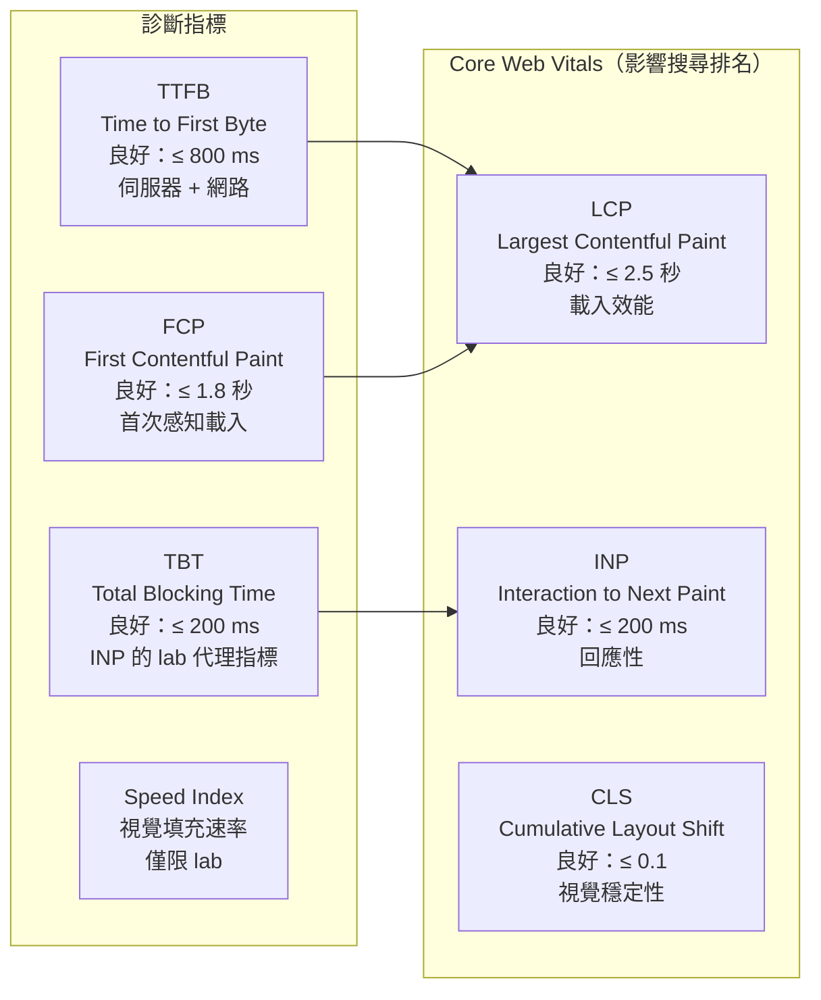

# [FEE-704] 核心 Web 指標與效能指標

:::info
本文介紹 Core Web Vitals 計畫：LCP、INP、CLS 各自衡量什麼、Google 為何推出這套標準，以及如何透過 CrUX 與 web-vitals 函式庫從真實使用者蒐集 field data。同時說明輔助指標（TTFB、FCP、TBT、Speed Index）的用途，以及 Next.js 等框架如何針對各項指標進行最佳化。
:::

## 情境

在 Web 效能的歷史上，大多數指標衡量的是技術里程碑：DNS 解析時間、TCP 握手、DOMContentLoaded、load 事件。這些數字是真實存在的，但與使用者的實際感受相關性不佳。一個頁面可能在不到一秒內觸發 load 事件，卻仍然讓人感覺很慢——因為最大的圖片很晚才出現、使用者閱讀時版面突然跳動，或者點擊按鈕要等 800 ms 才有反應。

Google 在 2020 年推出 **Web Vitals** 計畫，旨在彌補這個落差。Web Vitals 是以使用者為中心的指標，用來量化三個最重要的體驗面向：內容載入速度（LCP）、頁面回應輸入的速度（INP），以及版面是否穩定（CLS）。這三項就是 **Core Web Vitals**——Google 認為所有頁面都應該達成的子集，也是 Google Search 排名的考量因素之一。

這套計畫同時建立了一套量測標準：Core Web Vitals 應在特定來源的真實使用者 session 的 **第 75 百分位數** 進行評估。也就是說，75% 的訪客必須獲得「良好」分數，而不只是中位數或平均值。這套計畫也明確區分 **lab data**（Lighthouse 等工具在受控硬體環境下執行的合成量測）與 **field data**（Chrome User Experience Report，即 CrUX，從真實使用者的 Chrome 瀏覽器蒐集的資料）。Lab data 適合除錯；field data 才是使用者實際體驗的權威記錄。

2024 年 3 月，**Interaction to Next Paint（INP）** 正式取代 **First Input Delay（FID）**，成為 Core Web Vitals 的回應性指標。FID 只衡量頁面上第一次互動前的延遲。INP 則捕捉整個 session 中觀測到的最差互動延遲——這是對頁面在真實使用情境下行為更完整的描述。

## 設計思維

### 為何用以使用者為中心的指標，而非技術里程碑

DOMContentLoaded 或 `load` 事件等傳統指標，在瀏覽器的文件生命週期的特定時刻觸發，而非對應使用者的感知。一個頁面可能很快就滿足 DOMContentLoaded，但因為關鍵 hero 圖片仍在載入，視窗仍然一片空白。相反地，一個頁面可能 `load` 事件很慢，因為它在畫面繪製後才做延遲資料請求，但使用者早已看到並互動過主要內容。

以使用者為中心的指標問的是不同的問題：「使用者的體驗是什麼？是在什麼時候？」LCP 回答「主要內容何時出現？」INP 回答「回應我的互動花了多久？」CLS 回答「當我在閱讀時，有任何東西跳動嗎？」每個指標都對應一種具體的使用者挫折感：等待內容、感覺無回應、失去視線焦點。

### 三大 Core Web Vitals

**Largest Contentful Paint（LCP）** 衡量初始視窗中最大的圖片、文字區塊或影片變為可見所需的時間。門檻值：良好 ≤ 2.5 秒，需要改善 2.5--4.0 秒，差 > 4.0 秒。「最大」元素是根據在視窗中的渲染尺寸決定，而非檔案大小。常見候選元素包括 hero 圖片、顯示在折疊線以上的 `<h1>` 標題，以及使用 `url()` 的背景圖片。

LCP 主要受四個因素影響：伺服器回應時間（TTFB）、阻塞渲染的資源（CSS 和同步腳本）、資源載入時間（圖片下載），以及客戶端渲染開銷。最有效的單一最佳化是確保 LCP 圖片在 HTML 中被早期發現（而非由 JavaScript 注入），並使用 `fetchpriority="high"` 以最高瀏覽器優先級獲取。

**Interaction to Next Paint（INP）** 衡量整個 session 中的頁面回應性。它觀察從頁面載入到卸載的每次點擊、觸碰和按鍵，記錄從輸入開始到下一幀繪製的時間，並回報最差（或接近最差）的值。門檻值：良好 ≤ 200 ms，需要改善 201--500 ms，差 > 500 ms。與 FID 不同，FID 只衡量第一個事件處理程序開始執行前的延遲；INP 衡量完整的互動時間，包含事件處理程序執行時間，以及在下一幀之前的渲染工作。這使它對主執行緒上的高成本 JavaScript 非常敏感——長任務、大量重新渲染，以及同步的 layout/style 重新計算。

**Cumulative Layout Shift（CLS）** 衡量視覺穩定性。當可見元素在畫面幀之間意外移動時，就會發生 layout shift。CLS 是頁面整個生命週期中所有 layout shift 分數的總和，其中每個 shift 分數是 impact fraction（視窗受影響面積比例）乘以 distance fraction（元素移動距離比例）的乘積。門檻值：良好 ≤ 0.1，需要改善 0.1--0.25，差 > 0.25。最常見的原因是沒有明確尺寸的圖片和 iframe、字體換成不同大小，以及動態插入的橫幅或廣告。

### 輔助指標：完整的效能圖景

除了三大 Core Web Vitals 之外，還有幾個輔助指標提供更細粒度的診斷資訊：

- **Time to First Byte（TTFB）**：從導航請求到 HTML 回應第一個位元組的時間。TTFB 捕捉伺服器處理時間、CDN 路由和網路來回時間。它不是 Core Web Vital，但它是一個上限：如果 TTFB 是 1.5 秒，無論客戶端渲染多快，LCP 都不可能低於 1.5 秒。
- **First Contentful Paint（FCP）**：第一個像素內容（文字、圖片、SVG）被繪製的時間。FCP 讓使用者知道「有東西正在發生」；它是感知載入開始的良好代理指標。門檻值：良好 ≤ 1.8 秒，差 > 3.0 秒。
- **Total Blocking Time（TBT）**：FCP 到 TTI 之間所有長任務（超過 50 ms 的任務）的「阻塞部分」之總和。TBT 是一個純 lab 指標，與 INP 高度相關——降低 TBT 是在 lab 條件下改善 INP 的主要手段。
- **Speed Index**：Lighthouse 專用的 lab 指標，衡量載入過程中內容視覺填充的速度，以毫秒表示。它捕捉可見完整度的進展，而非單一時間點。適合整體比較不同渲染策略。

### Lab data 與 Field data：關鍵區別

Lab data 來自合成測試環境——Lighthouse、WebPageTest、Chrome DevTools Performance 面板——在固定硬體和網路條件下執行受控的測試場景。Lab data 是確定性且可重現的，非常適合開發期間的除錯和迴歸測試。

Field data 來自在自己裝置和網路連線上執行 Chrome 的真實使用者。它由瀏覽器蒐集，並在 CrUX 中彙整。Field data 捕捉使用者條件的完整多樣性：慢速的 Android 手機、擁擠的行動網路、裝了許多瀏覽器擴充功能的使用者、有大量第三方腳本的頁面。Field data 是 Google Search 排名的基準，也是了解真實使用者體驗的依據。

這兩種資料是互補的。開發者可能使用 Lighthouse 找出哪些資源阻塞了 LCP，然後查看 CrUX 確認修復是否真的改善了真實使用者的 LCP 分數。常見的錯誤是最佳化 Lighthouse 分數（lab）後就假設 field data 也改善了，或者看到 CrUX 數據不佳時只從 lab 工具中尋找修復方法，而不去了解為何真實條件有所不同。

### 框架如何最佳化 Core Web Vitals

**Next.js Image 元件（LCP + CLS）：** `next/image` 的 `<Image>` 元件自動設定 `width` 和 `height` 屬性（防止 CLS）、生成響應式 `srcset` 值，並對折疊線以下的圖片啟用懶加載。對於 LCP 圖片，`priority` prop 會停用懶加載，並在文件 head 中注入 `<link rel="preload">` 標籤，確保瀏覽器在 HTML 解析過程中遇到 `` 標籤之前就能發現並獲取圖片。這等同於手動加入 `fetchpriority="high"` 和 `<link rel="preload">`，但自動化且較不容易出錯。

**Next.js 字體最佳化（CLS）：** `next/font` 套件在建置時下載並自行託管 Google Fonts，在文件 head 中內嵌 font-face 宣告，並生成最佳化的 CSS `font-display` 值，使用 size-adjusted 的後備字體。這個 size-adjusted 後備字體的 metrics 經過調整，以匹配網路字體的行高和字元寬度，從而最小化網路字體換入時產生的 layout shift。

**React concurrent 功能（INP）：** React 18 的並發渲染允許框架在回應使用者輸入時中斷和暫停渲染工作。`startTransition` 將狀態更新標記為非緊急，讓 React 可以在完成過渡之前將主執行緒讓給互動處理。`useDeferredValue` 同樣會延遲高成本的重新渲染。這些 API 可以防止大型重新渲染（由篩選器、搜尋輸入或導航觸發）阻塞事件迴圈，避免 INP 分數過高。

### 第 75 百分位數原則

以第 75 百分位數而非中位數評估 CWV 是一個刻意的設計選擇。中位數代表第 50 百分位數使用者的體驗——平均條件。第 75 百分位數捕捉的是體驗比平均差的使用者：較慢的裝置、擁擠的網路、較大的瀏覽器快取。透過針對第 75 百分位數進行最佳化，這套計畫推動網站處理受眾的真實多樣性，而不只是針對理想條件進行最佳化。

這也說明了為何單靠 Lighthouse 分數是不夠的：Lighthouse 模擬的是單一裝置和網路條件。一個網站可能在 Lighthouse 中得 95 分，但低階 Android 手機上 30% 的真實使用者體驗到很差的 LCP，因為 lab 條件無法代表他們的硬體。

## 最佳實踐

**在 field data（CrUX）而非只在 lab（Lighthouse）中量測。** MUST NOT 僅依賴 Lighthouse 分數評估 Core Web Vitals。Lighthouse 在模擬的中階裝置和受限網路下執行，無法捕捉低階 Android 手機、壅塞網路，或安裝大量瀏覽器擴充功能的真實使用者的多樣性。SHOULD 部署 web-vitals 函式庫，從真實 session 蒐集 LCP、INP 和 CLS，並在每次重大變更後透過 CrUX 驗證改善成效。Lab data 引導除錯；第 75 百分位數的 field data 才是權威記錄，也是 Google 搜尋排名所使用的依據。

**透過 `<link rel="preload">` 優先發現 LCP 資源。** MUST 確保 LCP 圖片存在於初始 HTML 中（而非由 JavaScript 注入），並且 SHOULD 在文件 `<head>` 中加上 `<link rel="preload" as="image">`，同時在 `` 元素上加上 `fetchpriority="high"`。這個組合確保瀏覽器在 HTML 解析期間遇到標籤之前就能發現並取得 LCP 候選元素，最小化 TTFB 到 LCP 繪製之間的差距。在 Next.js 中，`<Image>` 上的 `priority` prop 會自動處理這兩者。

**將長任務移出主執行緒以改善 INP。** SHOULD 使用 `scheduler.yield()`、`setTimeout(..., 0)` 或 `requestIdleCallback` 將任何執行超過 50 ms 的 JavaScript 任務分解為較小的 chunk，讓瀏覽器能在 chunk 之間處理待處理的使用者輸入。SHOULD 使用 `startTransition` 和 `useDeferredValue`（React 18+）將高成本的重新渲染標記為非緊急，讓瀏覽器能在完成更新之前就繪製互動回應。長任務是 INP 分數不佳的主要原因。

**避免因圖片和嵌入元素未設定尺寸造成 CLS。** MUST 在每個 `` 和 `<iframe>` 上設定明確的 `width` 和 `height` 屬性，讓瀏覽器能在資源載入之前透過元素的長寬比預留空間。SHOULD 也為動態注入的內容（橫幅、廣告、Cookie 對話框）預留空間，使用 `min-height` 占位符或不影響文件流的 `position: fixed` 覆蓋層。AVOID 對 `top`、`left`、`height` 或 `width` 屬性做動畫，這些屬性會觸發 layout shift；應改用 `transform`。

## 視覺圖

### 頁面載入時間軸中的 Core Web Vitals

```mermaid
gantt
    title 頁面載入時間軸：每個指標的量測位置
    dateFormat x
    axisFormat %Lms

    section 網路與伺服器
    發出導航請求              :done, nav, 0, 50
    TTFB（收到第一個位元組）  :milestone, ttfb, 400, 400
    HTML 解析完成             :done, html, 400, 600

    section 首次繪製
    FCP（第一個內容繪製）     :milestone, fcp, 900, 900

    section 最大內容
    LCP 圖片獲取中            :active, lcpfetch, 600, 1800
    LCP（最大元素繪製完成）   :milestone, lcp, 1800, 1800

    section 互動性
    長任務（阻塞輸入）        :crit, lt1, 1000, 1200
    使用者互動 #1             :active, int1, 1400, 1600
    INP 候選記錄              :milestone, inp1, 1600, 1600
    長任務（阻塞輸入）        :crit, lt2, 2000, 2300
    使用者互動 #2             :active, int2, 2400, 2700
    INP 候選記錄              :milestone, inp2, 2700, 2700

    section 視覺穩定性
    版面位移（圖片載入）      :crit, cls1, 800, 820
    版面位移（字體替換）      :crit, cls2, 1100, 1120
    CLS 持續累積              :active, cls, 800, 3000
```



### 指標摘要



## 範例

### 1. 使用 web-vitals 函式庫在 field 中量測 Core Web Vitals

web-vitals 函式庫（~2 KB brotli 壓縮）使用與 Chrome 向 Google 回報相同的 API，從真實使用者測量 LCP、INP、CLS、FCP 和 TTFB。每個 callback 在指標值確定時觸發（對於 INP 和 CLS，是在頁面隱藏時）。

```javascript
// vitals.js -- 進行 field 量測，將資料傳送至你的分析端點
import { onCLS, onINP, onLCP, onFCP, onTTFB } from 'web-vitals';

function sendToAnalytics(metric) {
  // navigator.sendBeacon 在頁面卸載時可靠地傳送資料；fetch 則不可靠。
  const body = JSON.stringify({
    name: metric.name,      // 'LCP', 'INP', 'CLS', 'FCP', 'TTFB'
    value: metric.value,    // 原始值，單位為 ms（CLS 無單位）
    id: metric.id,          // 用於在分析中去重的唯一 ID
    rating: metric.rating,  // 'good', 'needs-improvement', 或 'poor'
    navigationType: metric.navigationType, // 'navigate', 'reload', 'back-forward'
  });
  navigator.sendBeacon('/api/analytics/vitals', body);
}

// 註冊所有五個指標。
// Callback 在指標值就緒後觸發一次。
onLCP(sendToAnalytics);
onINP(sendToAnalytics);
onCLS(sendToAnalytics);
onFCP(sendToAnalytics);
onTTFB(sendToAnalytics);
```

**重要提醒：** INP 和 CLS 的 callback 在頁面隱藏時（切換標籤、導航離開）觸發，而非在 session 進行中。此時的值代表整個 session 的最差互動或總版面位移。

### 2. 最佳化 LCP 圖片

LCP 圖片是最重要的最佳化目標。瀏覽器必須在 HTML 中早期發現圖片 URL，並以最高優先級獲取它。

```html
<!-- 純 HTML：為 LCP 圖片加上 preload 和 fetchpriority -->
<head>
  <!-- preload 讓瀏覽器在解析到  標籤前就開始獲取 -->
  <link
    rel="preload"
    as="image"
    href="/images/hero.webp"
    imagesrcset="/images/hero-400.webp 400w, /images/hero-800.webp 800w, /images/hero.webp 1200w"
    imagesizes="100vw"
  />
</head>
<body>
  <!-- fetchpriority="high" 將此資源提升至其他圖片之上 -->
  <!-- 明確的 width/height 可在圖片載入時防止 CLS -->
  
  <!-- 其他圖片：預設懶加載 -->
  
</body>
```

```tsx
// Next.js：<Image priority> 自動處理 preload 和 fetchpriority
import Image from 'next/image';

export default function Hero() {
  return (
    // priority prop：
    // - 停用懶加載
    // - 在 <head> 中注入 <link rel="preload">
    // - 在  上設定 fetchpriority="high"
    // width/height：必填，防止 CLS
    <Image
      src="/images/hero.webp"
      width={1200}
      height={600}
      priority
      alt="產品主視覺"
    />
  );
}
```

### 3. 防止 CLS：圖片、字體與動態內容

```html
<!-- 始終設定 width 和 height。瀏覽器使用 aspect-ratio 預留空間。 -->


<!-- Iframe：同樣規則 -->
<iframe src="https://example.com/widget" width="560" height="315" title="Widget"></iframe>
```

```css
/* 為動態注入的橫幅（如 Cookie 同意）預留空間 */
.banner-placeholder {
  /* 在內容載入前給予固定的最小高度 */
  min-height: 60px;
  /* CSS containment 防止版面重新計算向外擴散 */
  contain: layout;
}

/* 使用 CSS transform 製作動畫——不會觸發 layout shift */
.slide-in {
  transform: translateY(-100%);
  transition: transform 300ms ease;
}
.slide-in.visible {
  transform: translateY(0);
}
/* 避免對 top、left、height、width 做動畫——這些會觸發 layout shift */
```

```javascript
// Next.js 字體最佳化：自行託管、size-adjusted 後備字體、無 CLS
// app/layout.tsx
import { Inter } from 'next/font/google';

// next/font 在建置時下載 Inter，生成 size-adjusted 後備字體，
// 在文件 head 中內嵌 font-face，並設定 font-display: swap
// 搭配調整過的後備字體 metrics，將字體替換時的 CLS 降至最低。
const inter = Inter({
  subsets: ['latin'],
  display: 'swap',
});

export default function RootLayout({ children }) {
  return (
    <html lang="zh-TW" className={inter.className}>
      <body>{children}</body>
    </html>
  );
}
```

### 4. 使用 React startTransition 改善 INP

```tsx
// SearchPage.tsx -- 防止高成本的篩選阻塞使用者輸入
import { useState, useDeferredValue } from 'react';

function SearchPage({ items }: { items: Item[] }) {
  const [query, setQuery] = useState('');
  // useDeferredValue 在使用者輸入時延遲篩選清單的重新渲染。
  // 輸入框本身立即更新（低延遲回饋）；
  // 清單則在延遲、可中斷的過程中重新渲染。
  const deferredQuery = useDeferredValue(query);

  const handleChange = (e: React.ChangeEvent<HTMLInputElement>) => {
    // 直接狀態更新：緊急，同步執行
    setQuery(e.target.value);

    // 若有另一個高成本的狀態更新，可標記為 transition：
    // startTransition(() => setFilteredResults(compute(e.target.value)));
  };

  // 高成本篩選：使用 deferredQuery 而非 query
  // 這意味著輸入不會阻塞主執行緒等待篩選完成。
  const filtered = items.filter(item =>
    item.name.toLowerCase().includes(deferredQuery.toLowerCase())
  );

  return (
    <div>
      <input value={query} onChange={handleChange} placeholder="搜尋..." />
      <ResultList items={filtered} />
    </div>
  );
}
```

### 5. 透過 CrUX API 查詢 field data

CrUX 提供從 Chrome 瀏覽器彙整的真實使用者資料。CrUX API 提供程式化存取來源層級和 URL 層級的 field data，無需 Google Search Console 帳戶。

```javascript
// 獲取某個來源的 CrUX 資料（公開來源不需要 API 金鑰）
async function getCruxData(origin) {
  const response = await fetch(
    'https://chromeuxreport.googleapis.com/v1/records:queryRecord' +
    '?key=YOUR_API_KEY',
    {
      method: 'POST',
      headers: { 'Content-Type': 'application/json' },
      body: JSON.stringify({
        origin,
        metrics: ['largest_contentful_paint', 'interaction_to_next_paint', 'cumulative_layout_shift'],
      }),
    }
  );
  const data = await response.json();
  const metrics = data.record.metrics;

  // p75 值是 Google 用於搜尋排名評估的依據
  console.log('LCP p75:', metrics.largest_contentful_paint.percentiles.p75, 'ms');
  console.log('INP p75:', metrics.interaction_to_next_paint.percentiles.p75, 'ms');
  console.log('CLS p75:', metrics.cumulative_layout_shift.percentiles.p75);
}

getCruxData('https://example.com');
```

## 常見錯誤

- **將 INP 誤認為「首次互動」指標（與 FID 混淆）。** FID 只衡量第一次互動的輸入延遲。INP 觀察每次互動並回報最差值。一個對第一次點擊回應良好，但複雜下拉選單或即時篩選器互動較慢的頁面，即使 FID 良好，INP 仍會很差。

- **將 Speed Index 與 Core Web Vital 混淆。** Speed Index 是一個 Lighthouse 專用的 lab 指標。它不出現在 CrUX 中，不用於 Google Search 排名，也無法從真實使用者測量。它是一個有用的診斷工具，但不應作為主要最佳化目標。

- **忽視 TTFB。** 如果 TTFB 很慢，LCP 就不可能快。TTFB 超過 600 ms 的網站應先調查伺服器端快取、CDN edge 快取和資料庫查詢效能，再最佳化客戶端渲染。

## 相關 FEE

| FEE | 關係 |
|-----|------|
| [FEE-700 渲染與效能概覽](./700.md) | 涵蓋瀏覽器渲染管線的父文件。Core Web Vitals 是建立在該管線之上的量測層。 |
| [FEE-706 圖片最佳化](./706.md) | 深入探討圖片格式、響應式圖片和 `fetchpriority`。LCP 幾乎總是圖片最佳化問題。 |
| [FEE-705 程式碼分割與懶加載](./705.md) | 程式碼分割透過縮短主執行緒長任務來降低 TBT 並改善 INP。對折疊線以下資源進行懶加載，可消除與 LCP 圖片爭奪頻寬的情況。 |

## 參考資料

- [Web Vitals -- web.dev](https://web.dev/articles/vitals) -- Google 關於 Web Vitals 計畫、CWV 門檻值和第 75 百分位數評估方法的權威概覽
- [Interaction to Next Paint (INP) -- web.dev](https://web.dev/articles/inp) -- 官方 INP 文件，涵蓋量測方法、門檻值，以及 2024 年 3 月取代 FID 的過渡說明
- [Largest Contentful Paint (LCP) -- web.dev](https://web.dev/articles/lcp) -- 官方 LCP 文件，涵蓋候選元素、瓶頸類別和量測 API
- [Cumulative Layout Shift (CLS) -- web.dev](https://web.dev/articles/cls) -- 官方 CLS 文件，涵蓋版面位移分數計算、常見原因和防止技術
- [Chrome User Experience Report (CrUX) -- Chrome for Developers](https://developer.chrome.com/docs/crux) -- CrUX 文件，涵蓋 field data 蒐集、存取方式（BigQuery、PageSpeed Insights、CrUX API、CrUX History API）
- [web-vitals JavaScript 函式庫 -- GitHub](https://github.com/GoogleChrome/web-vitals) -- web-vitals npm 套件的原始碼和 API 文件（onLCP、onINP、onCLS、onFCP、onTTFB）
- [Optimize LCP -- web.dev](https://web.dev/articles/optimize-lcp) -- 全面的 LCP 最佳化指南，涵蓋 TTFB、阻塞渲染的資源、資源載入時間和 fetchpriority
