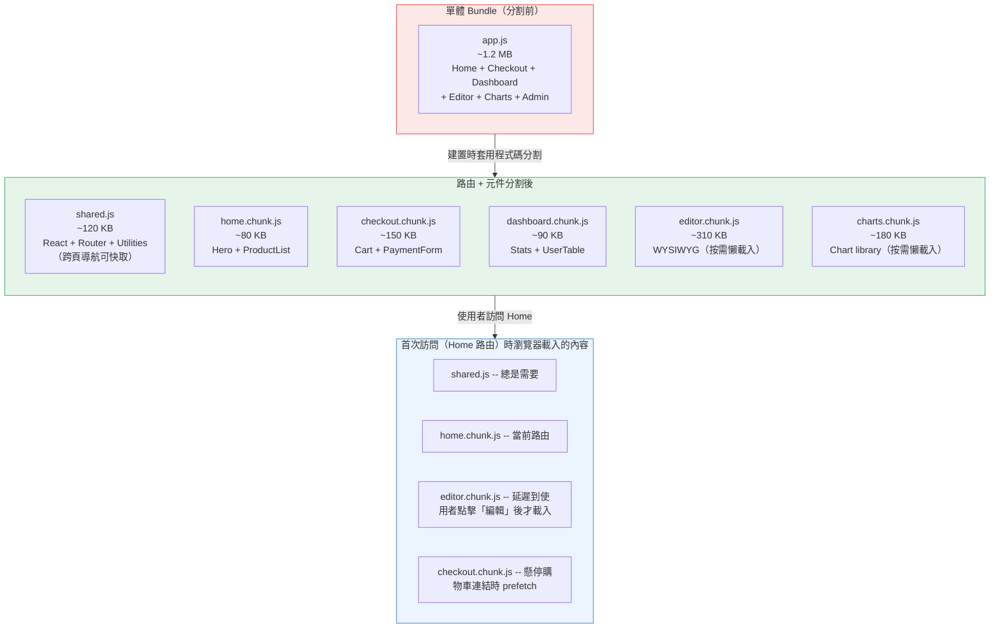
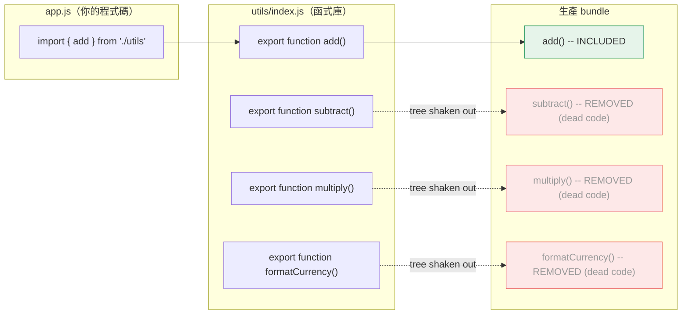

# [FEE-705] 程式碼分割、懶載入與 Tree Shaking

:::info
本文介紹三種減少 JavaScript 成本的互補技術：程式碼分割（code splitting，只傳送當前路由或元件所需的程式碼）、懶載入（lazy loading，延遲載入不在可視範圍內的資源）、以及 Tree Shaking（在建置階段消除無用程式碼）。三者共同鎖定三個會在使用者能進行任何互動前阻塞互動性的階段：下載時間、解析時間和執行時間。
:::

## 背景脈絡

瀏覽器下載的每一個 JavaScript 位元組，都必須先經過解析（parse）與編譯（compile）才能執行。一個 500 KB 的單體 bundle 付出的成本不只是下載時間。它在解析與執行階段同樣會佔用瀏覽器主執行緒，直接延遲 TTI（Time to Interactive）並提高 TBT（Total Blocking Time）。這項成本在不同裝置之間的分布並不平均：V8 的分析發現，Reddit 的 JavaScript 在中階手機（Moto G4）上的執行時間是高階裝置（Pixel 3）的 3-4 倍，在低階裝置（售價不到 100 美元的 Alcatel 1X）上更超過 6 倍（V8, "The Cost of JavaScript in 2019"）。

在模組打包工具出現之前，每個 script 都是獨立的 HTTP 請求，這也帶來了自己的開銷：TCP 連線、HTTP 標頭和隊頭阻塞（head-of-line blocking）。打包工具將所有模組串接成一個檔案來解決這個問題，在應用程式規模較小時，這是合理的取捨。隨著 SPA 加入路由、國際化、豐富元件和第三方整合，單體 bundle 逐漸成為負擔：每位訪客在每次造訪時都會下載所有路由的程式碼，包括他們從未開啟過的路由。解法是將 bundle 拆分成多個片段，並只在真正需要時才載入對應片段。

程式碼分割、懶載入和 tree shaking 分別從三個角度解決這個問題。程式碼分割依路由或元件邊界劃分 chunk，讓初始載入只傳送第一個畫面所需的程式碼。懶載入延遲載入圖片、元件和路由等資源，直到它們進入可視範圍或由使用者導航觸發請求。Tree shaking 在建置時移除不可達的程式碼，讓函式庫只貢獻實際被匯入的函式。三者合用在大型應用程式上，通常能移除初始載入中最大部分的不必要 JavaScript，且不影響任何可觀察的行為。

讓這三種技術得以普及的底層原語是 ES Module 系統（ESM）。相較於 CommonJS 的 `require()`，ES `import` 陳述式是靜態的：打包工具在建置時就能確切知道每個模組匯入和匯出的內容。這種靜態結構讓打包工具具備在模組邊界切割程式碼、追蹤哪些 export 被使用的能力，這正是程式碼分割和 tree shaking 共同的前提。

## 視覺化

### 單體 Bundle vs. 分割後的路由 Chunk + Shared Chunk



### Tree Shaking 的運作方式



## 範例

### 1. Next.js App Router 的路由層級分割（自動）

Next.js 在路由區段層級自動分割，無需任何設定。`app/` 下的每個檔案都是獨立的 chunk。

```tsx
// app/page.tsx -- Home 路由的 chunk（立即載入）
export default function HomePage() {
  return <main>Welcome</main>;
}

// app/dashboard/page.tsx -- Dashboard 路由的 chunk（只在使用者導航至此時才載入）
export default function DashboardPage() {
  return <main>Dashboard</main>;
}

// app/dashboard/layout.tsx -- Dashboard layout，包含在 dashboard chunk 中
// 兩個頁面都使用的共用程式碼（React 本身、共用工具函式）自動進入 shared chunk。
export default function DashboardLayout({ children }: { children: React.ReactNode }) {
  return <section>{children}</section>;
}
```

Next.js 的 `<Link>` 會在連結進入可視範圍時 prefetch 連結路由的 chunk：

```tsx
import Link from 'next/link';

// 這個 Link 滾動進入可視範圍時，Next.js 會靜默地預先取得 dashboard.chunk.js
// 所以使用者點擊時的導航感覺是即時的。
export default function Nav() {
  return <Link href="/dashboard">Dashboard</Link>;
}
```

### 2. Angular 的路由層級懶載入（loadComponent）

Angular 不像 Next.js 或 Nuxt 那樣依檔案式路由慣例自動分割。開發者需要直接在路由設定中標記分割點：

```typescript
// app.routes.ts
import { Routes } from '@angular/router';
import { HomeComponent } from './home/home.component';

export const routes: Routes = [
  { path: '', component: HomeComponent }, // 立即載入：永遠包含在初始 bundle 中
  {
    path: 'dashboard',
    loadComponent: () =>
      import('./dashboard/dashboard.component').then((m) => m.DashboardComponent),
  },
];
```

`loadChildren` 套用相同的模式到整個功能模組的路由樹，用於比單一元件更粗粒度的分割。

### 3. 使用 React.lazy + Suspense 進行元件層級分割

對初始渲染時不可見的大型元件使用此模式：modal、富文字編輯器、大型資料表格、圖表面板。

```tsx
import { lazy, Suspense } from 'react';

// import() 呼叫是分割點。
// 打包工具（webpack、Vite/Rollup）將 RichEditor 發出為獨立的 chunk。
// 只有在 <RichEditor> 第一次渲染時才會取得該 chunk。
const RichEditor = lazy(() => import('./RichEditor'));
const DataTable  = lazy(() => import('./DataTable'));

function ArticlePage() {
  return (
    <article>
      <h1>編輯文章</h1>

      {/* Suspense 在此邊界內所有懶載入的子元件解析完成前顯示 fallback。 */}
      {/* 請緊密包裹——包裹整個頁面的 Suspense 邊界會延遲所有內容。 */}
      <Suspense fallback={<div className="skeleton" aria-busy="true">載入編輯器中...</div>}>
        <RichEditor />
      </Suspense>

      <Suspense fallback={<div className="skeleton" aria-busy="true">載入表格中...</div>}>
        <DataTable />
      </Suspense>
    </article>
  );
}
```

### 4. 使用 Vue defineAsyncComponent 進行元件層級分割

```vue
<script setup>
import { defineAsyncComponent } from 'vue'

// 基本用法：在元件首次渲染時才載入 chunk
const RichEditor = defineAsyncComponent(() => import('./RichEditor.vue'))

// 進階用法：帶有 loading/error 狀態和延遲
const DataTable = defineAsyncComponent({
  loader: () => import('./DataTable.vue'),
  loadingComponent: LoadingSpinner,   // chunk 取得期間顯示
  errorComponent: ErrorMessage,       // import 失敗時顯示
  delay: 200,                         // 200ms 後才顯示 loadingComponent
  timeout: 10000,                     // chunk 超過 10s 才到達則視為失敗
})
</script>

<template>
  <!-- Vue Suspense 的運作方式與 React 相同：在非同步相依解析完成前顯示 fallback -->
  <Suspense>
    <template #default>
      <RichEditor />
    </template>
    <template #fallback>
      <div class="skeleton">載入編輯器中...</div>
    </template>
  </Suspense>
</template>
```

上方範本中使用的 Vue `<Suspense>` 目前仍是官方標示的實驗性功能。Vue 官方文件指出它「不保證會進入穩定狀態」，且其 API 在那之前可能變動（Vue.js 官方文件）。在正式環境中依賴它之前，請先確認 Suspense 文件中的最新狀態。

### 5. 使用動態 import 進行函式庫層級分割

```typescript
// 大型相依套件只在使用者觸發操作時才載入。
// PDF 函式庫（~800 KB）永遠不會進入初始 bundle。

async function handleExportPDF() {
  // 打包工具看到這個 import() 並將 jspdf 發出為獨立的 chunk。
  // 字串必須是字面值（不能是變數），打包工具才能靜態分析它。
  const { jsPDF } = await import('jspdf');

  const doc = new jsPDF();
  doc.text('Hello world', 10, 10);
  doc.save('export.pdf');
}

// 綁定到按鈕；chunk 只在第一次點擊時取得
document.getElementById('export-btn')?.addEventListener('click', handleExportPDF);
```

在閒置時間 prefetch chunk，讓第一次點擊感覺即時：

```typescript
// 主要內容可互動後，在空閒時預先取得 PDF chunk
// 這樣使用者點擊「匯出」時，chunk 已在瀏覽器快取中。
if ('requestIdleCallback' in window) {
  requestIdleCallback(() => {
    import('jspdf'); // 打包工具發出 chunk；瀏覽器快取它
  });
}
```

### 6. Tree Shaking：package.json 中的 sideEffects

對所有 export 都是純函式的工具函式庫：

```json
// 共用工具套件的 package.json
{
  "name": "@company/utils",
  "version": "1.0.0",
  "main": "dist/index.cjs",
  "module": "dist/index.esm.js",
  "sideEffects": false
}
```

設定 `"sideEffects": false` 後，若消費者只匯入 `add`：

```typescript
import { add } from '@company/utils';
```

打包工具只會包含 `add` 函式及其相依項目，其他所有 export 都會被消除。若沒有 `"sideEffects": false`，打包工具為了安全起見必須包含整個模組。

對於部分檔案有副作用的套件（例如 CSS import 或 polyfill）：

```json
{
  "sideEffects": ["./src/polyfills.js", "*.css"]
}
```

### 7. 使用 Intersection Observer 對首屏以下的元件進行懶載入

當一個元件確定在首屏以下且不需要在 DOM 中直到使用者滾動到它時，可結合 `defineAsyncComponent`（Vue）或 `React.lazy` 與 Intersection Observer，將 chunk 請求延遲到使用者滾動到附近才發出。

```typescript
// useIntersection.ts -- 可重用的 composable
import { ref, onMounted, onUnmounted } from 'vue';

export function useIntersection(rootMargin = '200px') {
  const target = ref<HTMLElement | null>(null);
  const isVisible = ref(false);

  onMounted(() => {
    if (!target.value) return;
    const observer = new IntersectionObserver(
      ([entry]) => {
        if (entry.isIntersecting) {
          isVisible.value = true;
          observer.disconnect(); // 載入一次後停止觀察
        }
      },
      { rootMargin } // 元素進入可視範圍前 200px 就開始載入
    );
    observer.observe(target.value);
  });

  onUnmounted(() => {
    // observer 在第一次交叉後已斷開，但此處仍做防護
  });

  return { target, isVisible };
}
```

```vue
<!-- LandingPage.vue -->
<script setup>
import { defineAsyncComponent } from 'vue'
import { useIntersection } from './useIntersection'

const TestimonialsSection = defineAsyncComponent(() => import('./TestimonialsSection.vue'))
const { target, isVisible } = useIntersection('300px')
</script>

<template>
  <HeroSection />
  <FeaturesSection />

  <!-- 見證區遠在首屏以下；延遲到使用者滾動接近時才取得 chunk -->
  <div ref="target">
    <TestimonialsSection v-if="isVisible" />
    <div v-else class="placeholder" style="min-height: 400px" />
  </div>
</template>
```

## 最佳實踐

**優先在路由邊界分割，再考慮功能邊界。** SHOULD 在考慮元件層級分割之前，先套用路由層級的分割。現代 meta-framework（Next.js、Nuxt、SvelteKit、Angular）能自動執行路由分割，或只需幾行路由設定即可；光是這一步，就能消除典型 SPA 上大多數不必要的初始 bundle 負擔，因為訪客不再需要下載他們從未開啟過的路由。SHOULD 只對已透過 bundle 分析工具確認 bundle 貢獻量確實較大的元件套用元件層級分割：在加入分割點之前，先驗證該元件的 bundle 貢獻量。每個額外的 chunk 都需要一次額外的網路請求，因此不要分割 20-30 KB 以下的元件。

**使用 `React.lazy` + `Suspense` 進行元件層級分割。** MUST 用有意義的 fallback（骨架屏、spinner）的 `<Suspense>` 包裹懶載入元件，讓 UI 在 chunk 取得期間能優雅降級。SHOULD 將 Suspense 邊界緊密地作用於懶載入元件周圍，而非包裹整個頁面，讓每個區段在其 chunk 到達時能獨立渲染。MUST NOT 對初始載入時立即可見的元件使用懶載入：hero 區域、主要導覽和首屏以上的內容 SHOULD 永遠包含在初始 bundle 中。Vue 的 `defineAsyncComponent` 搭配 `<Suspense>` 提供相同的能力，但 Vue 的 `<Suspense>` 目前仍是官方標示的實驗性功能，其 API 在進入穩定狀態前可能變動（Vue.js 官方文件）；採用它上線的團隊應在每次升級時留意變更紀錄。

**確保 tree shaking 對命名 export 有效，並避免帶有副作用的 barrel 檔案。** MUST 在整個程式碼庫中使用 ES module 的 `import`/`export` 語法；CommonJS 的 `require()` 會在模組邊界停用 tree shaking。SHOULD 在任何所有 export 都是無副作用純函式的工具套件的 `package.json` 中設定 `"sideEffects": false`。AVOID 在大型函式庫中使用 barrel 檔案（從目錄重新匯出所有內容的 `index.js`），除非每個重新匯出的模組確實無副作用：barrel 匯入會讓打包工具無法消除未使用的 export。

**在最佳化前後使用 bundle 分析工具驗證。** SHOULD 在每次最佳化變更時執行 bundle 分析工具（Vite 用 `rollup-plugin-visualizer`，webpack 用 `webpack-bundle-analyzer`），確認未使用的 export 已被消除，且沒有意外加入的程式碼。Tree shaking 失敗是靜默的：bundle 編譯成功，但傳送了比預期更多的程式碼。MUST 將分析工具的輸出視為事實依據，而非原始碼中的 import 陳述式。

## 設計思維

### 為什麼解析與編譯時間不再像過去那樣重要

如背景脈絡一節所述，JavaScript 執行時間在不同裝置之間差異懸殊，而較舊的效能指南經常把解析與編譯時間當成主要的對抗目標。V8 在 2019 年針對串流編譯（streaming compilation）與 bytecode 快取的分析發現，在現代引擎上，下載和 CPU 執行時間才是主要成本，而非解析；解析「已不像過去認為的那樣慢」（V8, "The Cost of JavaScript in 2019"）。解析與編譯時間仍會隨著傳送的位元組數增加而增加，只是裝置間的差距比執行時間小：web.dev 發現最快與平均手機之間的解析／編譯時間差距為 2-5 倍，並實測 CNN 約 1 MB 的腳本在 iPhone 8 上解析編譯約需 4 秒，在 Moto G4 上則約需 13 秒（web.dev, "JavaScript Start-up Optimization"）。三個階段都會隨著傳送的位元組數增加而增加，因此傳送更少的位元組能降低任何裝置上的啟動成本。

### 框架如何自動化路由分割

現代 meta-framework 將路由分割視為預設行為，而非需要開啟的最佳化選項。

**Next.js**（App Router）會為 `app/` 目錄下的每個檔案自動建立獨立的 bundle。Server Components 完全不傳送至客戶端。Client Components 按路由區段分割。多個路由共用的程式碼（如公用工具函式）由 webpack 的 `SplitChunksPlugin` 自動提取成 shared chunk，開發者無需手動設定。

**Nuxt 3** 自動分割 `pages/` 目錄下的頁面，並自動匯入 `components/` 下的元件。若某個元件被超過一個頁面使用，Nuxt 會自動將其提取到 shared chunk。開發者不需要撰寫任何打包工具設定。

**SvelteKit** 底層使用 Vite，在路由區段層級進行分割。每個 `+page.svelte` 及其關聯的 `+layout.svelte` 都會成為獨立的 chunk。`$lib` 中被多個路由使用的程式碼會自動去重並合併到 shared chunk。

**Angular** 採取明確而非檔案式的做法：開發者透過 `loadComponent` 或 `loadChildren` 直接在路由設定中標記每個路由的分割點（參見上方的 Angular 範例）。它不會像其他三個框架那樣，從資料夾結構自動分割。

實際效果是：使用檔案式路由框架的開發者能免費獲得路由層級的分割，而 Angular 開發者只需每個路由加上一行路由設定即可獲得。剩下的機會，以及風險，在於元件層級的分割。

### Tree Shaking：透過 ESM 消除無用程式碼

Tree shaking 是打包工具移除相依圖中從未被匯入的 export 的能力。這個名稱源自概念上「搖動」模組相依樹，讓沒有東西抓住的葉節點（export）掉落。

Tree shaking 需要 ESM 的根本原因：CommonJS 的 `require()` 是動態的。一個模組可以呼叫 `require(someVariable)`，或根據執行時條件匯入不同模組，因此打包工具在建置時無法知道哪些 export 會被使用。ES `import` 陳述式是靜態的：它們出現在頂層，模組 specifier 必須是字串字面值，匯入的名稱是固定的。這讓打包工具能取得完整資訊，判斷哪些 export 是活躍的、哪些是無用的。

`package.json` 中的 `sideEffects` 欄位是關鍵信號。預設情況下，打包工具會假設匯入一個模組可能執行帶有副作用的程式碼，例如修改全域變數或修補原型。如果一個模組有副作用，打包工具就不能安全地移除它，即使它的 export 都沒有被使用。將 `"sideEffects": false` 告知打包工具套件中的所有檔案都是純粹的：匯入它們除了暴露 export 之外不做任何事。這讓積極的消除成為可能：如果你只從一個工具函式庫匯入 `clamp`，打包工具可以完全捨棄函式庫其餘的程式碼。

### 矛盾點：過多分割會造成瀑布請求

程式碼分割並非免費。每個額外的 chunk 都需要瀏覽器發出額外的網路請求。懶載入 chunk 的鏈式相依會造成瀑布效應：載入 chunk A 時發現需要 chunk B，chunk B 又相依 chunk C，導致使用者看到任何內容之前要經過三次循序的往返請求。這在高延遲連線上特別明顯。

緩解方案是 prefetch：在使用者明確請求前，利用空閒的網路時間預先取得 chunk。上方的範例一節已展示了這兩種模式的實際運用：透過 `<Link>` 在懸停時 prefetch 路由，以及透過 `requestIdleCallback` prefetch 動態匯入的函式庫。

經驗法則是：積極使用路由分割，因為它幾乎總是值得的；只對經 bundle 分析工具確認確實較大的元件使用元件分割；並使用 prefetch 消除每次分割帶來的感知延遲。

## 常見錯誤

- **過度分割卻沒有 prefetch。** 每個額外的 chunk 都是一次網路往返。將一個 10 KB 的元件拆成獨立 chunk 卻不做 prefetch，只會讓使用者看到一個本可忽略的 loading spinner。在分割前先用 bundle 分析工具確認大小：小於 20-30 KB 的元件很少值得獨立成一個 chunk。

- **在動態 import 中使用變數路徑。** `import(path)` 其中 `path` 是執行時變數，無法靜態分析。打包工具不知道把哪個檔案放到哪個 chunk；可能發出一個巨大的 catch-all chunk 或根本無法分割。`import()` 內的模組路徑必須是字串字面值。

- **忽略 chunk 的瀑布式相依。** 若懶載入 chunk A 匯入了懶載入 chunk B，載入 A 時會觸發對 B 的循序取得請求。使用 bundle 分析找出這類鏈式依賴，並選擇將程式碼合併，或在 A 開始載入時預先 prefetch B。

## 延伸閱讀

- [渲染與效能總覽](/zh-tw/Rendering and Performance/700)
- [ES 模組與模組系統](/zh-tw/JavaScript Core and Runtime/307)
- [核心 Web 指標與效能指標](/zh-tw/Rendering and Performance/704)
- [構建工具與模組系統總覽](/zh-tw/Build Tooling and Module Systems/800)

## 參考資料

- V8 team (Addy Osmani), "The Cost of JavaScript in 2019," V8 Blog (2019). https://v8.dev/blog/cost-of-javascript-2019
- Addy Osmani, "JavaScript Start-up Optimization," web.dev (2017). https://web.dev/articles/optimizing-content-efficiency-javascript-startup-optimization
- webpack contributors, "Code Splitting," webpack documentation. https://webpack.js.org/guides/code-splitting/
- webpack contributors, "Tree Shaking," webpack documentation. https://webpack.js.org/guides/tree-shaking/
- Vercel, "Lazy Loading," Next.js documentation. https://nextjs.org/docs/app/guides/lazy-loading
- Angular team, "Route-level code-splitting," Angular documentation. https://angular.dev/guide/routing/loading-strategies
- Vue.js team, "Async Components," Vue.js documentation. https://vuejs.org/guide/components/async
- Vue.js team, "Suspense," Vue.js documentation. https://vuejs.org/guide/built-ins/suspense.html
- React team, "lazy," React documentation. https://react.dev/reference/react/lazy
- Átila Fassina, "Tree-Shaking: A Reference Guide," Smashing Magazine (2021). https://www.smashingmagazine.com/2021/05/tree-shaking-reference-guide/
