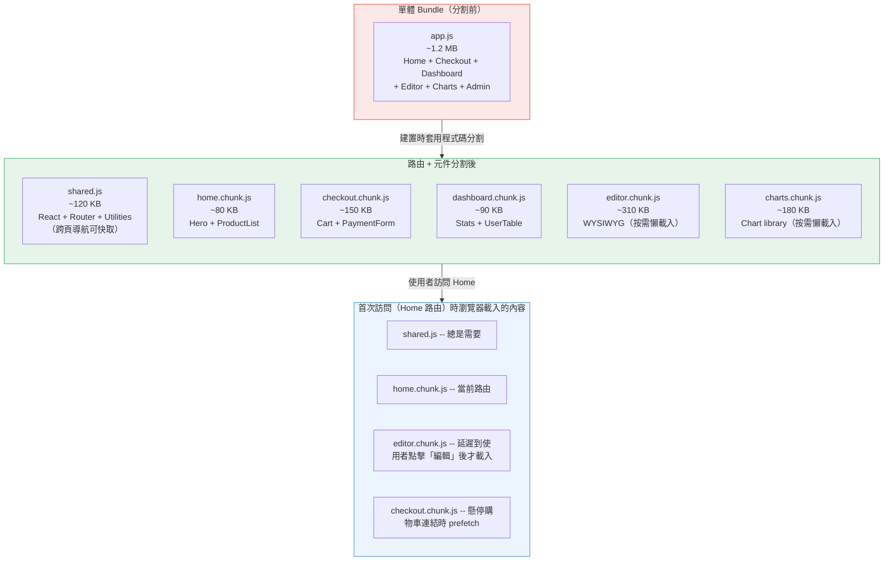
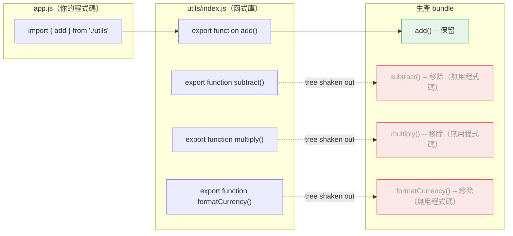

# [FEE-705] 程式碼分割、懶載入與 Tree Shaking

:::info
本文介紹三種減少 JavaScript 成本的互補技術：程式碼分割（code splitting，只傳送當前路由或元件所需的程式碼）、懶載入（lazy loading，延遲載入不在可視範圍內的資源）、以及 Tree Shaking（在建置階段消除無用程式碼）。三者共同作用於下載時間、解析時間和執行時間——這三個阻塞互動性的關鍵階段。
:::

## 背景脈絡

瀏覽器下載的每一個 JavaScript 位元組，都必須先經過解析（parse）和編譯（compile）才能執行。一個 500 KB 的單體 bundle 不只需要下載時間——在解析和執行階段同樣會佔用瀏覽器主執行緒，直接延遲 TTI（Time to Interactive）並提高 TBT（Total Blocking Time）。在中低階 Android 裝置搭配 4G 連線的情況下，1 MB 的 JavaScript 即使下載完成後，仍可能造成超過一秒的主執行緒阻塞。

最初的做法——將所有程式碼打包成一個檔案——在應用程式規模較小時合理。但隨著 SPA 加入路由、國際化、豐富元件和第三方整合，單體 bundle 成了主要的效能瓶頸。解決方案是將 bundle 拆分成多個片段，並在實際需要時才載入對應片段。

程式碼分割、懶載入和 tree shaking 分別從三個角度解決這個問題：程式碼分割依路由或元件邊界劃分 chunk，讓初始載入只傳送第一個畫面所需的程式碼；懶載入延遲載入圖片、元件和路由，直到它們進入可視範圍或使用者導航觸發；tree shaking 在建置時移除不可達的程式碼，讓函式庫只貢獻實際被匯入的函式。三者合用，大型應用程式的初始 bundle 可縮減 50--80%，且不影響任何可觀察的行為。

讓這三種技術得以普及的底層原語是 ES Module 系統（ESM）。相較於 CommonJS 的 `require()`，ES `import` 陳述式是靜態的：打包工具在建置時就能確切知道每個模組匯入和匯出的內容。這種靜態結構是打包工具能在模組邊界切割程式碼、追蹤哪些 export 被使用的前提——也是程式碼分割和 tree shaking 的共同基礎。

## 原則

- SHOULD 對可視範圍以下（below-fold）的元件、圖片和路由使用懶載入；只有首屏關鍵路徑的程式碼才應包含在初始 bundle 中。
- SHOULD 當套件的所有 export 都是無全域副作用的純函式時，在 `package.json` 中標記 `sideEffects: false`。
- SHOULD 以路由層級的分割作為首要且效益最高的分割策略，再視需要套用元件層級分割。
- SHOULD 避免過度分割：每個額外的 chunk 都需要一次額外的網路請求；對小型元件優先考慮 prefetch 而非分割。
- SHOULD 使用 `<Suspense>`（React）或 `<Suspense>` / loading slot（Vue）優雅地處理懶載入元件的載入狀態。
- SHOULD 在假設 tree shaking 生效前，先用 bundle 分析工具確認無用的 import 確實已從生產 bundle 中移除。

## 設計思維

### 為什麼 bundle 大小的影響不只是下載時間

JavaScript 的效能成本分三階段，且循序發生：瀏覽器必須先下載位元組（網路時間），再將原始碼解析和編譯成 bytecode（解析時間），最後執行 bytecode（執行時間）。這三個階段全部完成前，使用者無法進行任何互動。

解析和編譯時間經常被低估。高階桌機的 JavaScript 引擎每秒可處理約 1 MB 的 JavaScript，但在低階 Android 裝置上這個數字降至 100--200 KB/s。一個 1 MB 的 bundle 下載需要 1 秒，但在該裝置上可能還需要額外 3--5 秒的解析時間。這正是 Lighthouse 的「避免過大的網路負載」和「減少 JavaScript 執行時間」警告，即使在網路速度不是瓶頸的情況下仍會標記 bundle 大小的原因。

### 為什麼打包工具需要分割程式碼：單體 bundle 的問題

在模組打包工具出現之前，每個 script 都是獨立的 HTTP 請求，各自都有 TCP 連線、HTTP 標頭和隊頭阻塞的開銷。打包工具透過將所有模組串接成一個檔案解決了這個問題。對小型應用程式這是進步，但隨著應用程式成長，卻造成了新問題：每個使用者在每次訪問時都下載所有路由的程式碼，即使是從未造訪過的路由。

一個典型的電商 SPA 可能包含商品列表頁、結帳流程、帳戶儀表板和管理後台的程式碼——但匿名訪客下載時卻把這些全部取回，即使他們只會看到商品列表頁。路由層級的程式碼分割透過為每個路由（或路由群組）建立獨立的 chunk 來修正這個問題，並只在使用者導航至該路由時才載入對應 chunk。

### 框架如何自動化路由分割

現代 meta-framework 將路由分割視為預設行為，而非需要開啟的最佳化選項：

**Next.js**（App Router）會為 `app/` 目錄下的每個檔案自動建立獨立的 bundle。Server Components 完全不傳送至客戶端。Client Components 按路由區段分割。多個路由共用的程式碼（如公用工具函式）由 webpack 的 `SplitChunksPlugin` 自動提取成 shared chunk，開發者無需手動設定。

**Nuxt 3** 自動分割 `pages/` 目錄下的頁面，並自動匯入 `components/` 下的元件。若某個元件被超過一個頁面使用，Nuxt 會自動將其提取到 shared chunk。開發者不需要撰寫任何打包工具設定。

**SvelteKit** 底層使用 Vite，在路由區段層級進行分割。每個 `+page.svelte` 及其關聯的 `+layout.svelte` 都會成為獨立的 chunk。`$lib` 中被多個路由使用的程式碼會自動去重並合併到 shared chunk。

實際效果是：使用這些框架的開發者免費獲得路由層級的分割。剩下的機會——以及風險——在於元件層級的分割。

### 元件層級分割：React.lazy 與 Vue defineAsyncComponent

路由分割處理最粗粒度的層級。在單一路由內，可能存在渲染成本高且初始未顯示的元件：富文字編輯器、資料表格、圖表函式庫、只有在使用者操作後才出現的 modal。這些都是元件層級分割的候選對象。

在 React 中，`React.lazy()` 接收一個回傳動態 `import()` 的函式，並產生一個在首次渲染時才載入其 chunk 的元件。`<Suspense>` 包裹一個或多個懶載入元件，並在所有元件解析完成前顯示 fallback UI（spinner、skeleton）。

在 Vue 3 中，`defineAsyncComponent()` 扮演相同的角色。它接收一個 loader 函式（動態 import）以及可選的 loading 元件、error 元件、顯示 loading 狀態前的延遲時間和 timeout。Vue 的 `<Suspense>` 可以用與 React 相同的方式包裹 async 元件。

### 使用動態 import 進行函式庫層級分割

即使不使用框架，任何動態 `import()` 呼叫都會建立一個分割點。圖表函式庫只在使用者開啟「報表」頁籤時才載入、PDF 渲染器只在列印操作時載入、WYSIWYG 編輯器只在進入編輯模式時載入——這些都是用 `import()` 延遲大型相依套件到真正需要時才載入的情境。

瀏覽器以非同步方式執行動態 import：它回傳一個 Promise，解析後得到模組的 export。打包工具靜態分析 `import()` 呼叫（字串必須是字面值，不能是變數，打包工具才能在建置時確定 chunk 邊界），並為目標模組及其相依項目發出獨立的 chunk。

### Tree Shaking：透過 ESM 消除無用程式碼

Tree shaking 是打包工具移除相依圖中從未被匯入的 export 的能力。這個名稱源自概念上「搖動」模組相依樹，讓沒有東西抓住的葉節點（export）掉落。

Tree shaking 需要 ESM 的根本原因：CommonJS 的 `require()` 是動態的。一個模組可以呼叫 `require(someVariable)`，或根據執行時條件匯入不同模組。打包工具在建置時無法知道哪些 export 會被使用。ES `import` 陳述式是靜態的：它們出現在頂層，模組 specifier 必須是字串字面值，匯入的名稱是固定的。這讓打包工具能取得完整資訊，判斷哪些 export 是活躍的、哪些是無用的。

`package.json` 中的 `sideEffects` 欄位是關鍵信號。預設情況下，打包工具會保守地假設匯入一個模組可能有副作用（修改全域變數、注冊 polyfill、修補原型）。如果一個模組有副作用，打包工具就不能安全地移除它，即使它的 export 都沒有被使用。將 `"sideEffects": false` 告知打包工具套件中的所有檔案都是純粹的——匯入它們除了暴露 export 之外不做任何事。這讓積極的消除成為可能：如果你只從一個工具函式庫匯入 `clamp`，打包工具可以完全捨棄函式庫其餘的程式碼。

### 矛盾點：過多分割會造成瀑布請求

程式碼分割並非免費。每個額外的 chunk 都需要瀏覽器發出額外的網路請求。懶載入 chunk 的鏈式相依——載入 chunk A 時發現需要 chunk B，chunk B 又相依 chunk C——會造成瀑布：三次循序的往返請求，使用者才能看到內容。這在高延遲連線上特別明顯。

緩解方案是 prefetch：在使用者明確請求前，利用空閒的網路時間預先載入 chunk。懸停時路由 prefetch 或在可視範圍內的連結（視窗中可見的連結）觸發 prefetch 已內建於 Next.js（透過 `<Link prefetch>`）、Nuxt（透過 `<NuxtLink>`），也可手動透過 `<link rel="prefetch">` 或由 `requestIdleCallback` 觸發的 `import()` 呼叫達成。目標是讓 chunk 在使用者導航時已存在於瀏覽器快取，讓體驗感覺即時。

經驗法則是：積極使用路由分割（幾乎總是值得的），對明確較大的元件使用元件分割（透過 bundle 分析工具確認），並使用 prefetch 消除分割帶來的感知延遲。

## 視覺化

### 單體 Bundle vs. 分割後的路由 Chunk + Shared Chunk



### Tree Shaking 的運作方式



## 範例

### 1. Next.js App Router 的路由層級分割（自動）

Next.js 在路由區段層級自動分割，無需任何設定。`app/` 下的每個檔案都是獨立的 chunk。

```tsx
// app/page.tsx -- Home 路由的 chunk（立即載入）
export default function HomePage() {
  return <main>Welcome</main>;
}

// app/dashboard/page.tsx -- Dashboard 路由的 chunk（只在使用者導航至此時才載入）
export default function DashboardPage() {
  return <main>Dashboard</main>;
}

// app/dashboard/layout.tsx -- Dashboard layout，包含在 dashboard chunk 中
// 兩個頁面都使用的共用程式碼（React 本身、共用工具函式）自動進入 shared chunk。
export default function DashboardLayout({ children }: { children: React.ReactNode }) {
  return <section>{children}</section>;
}
```

Next.js 的 `<Link>` 會在連結進入可視範圍時 prefetch 連結路由的 chunk：

```tsx
import Link from 'next/link';

// 這個 Link 滾動進入可視範圍時，Next.js 會靜默地預先取得 dashboard.chunk.js
// 所以使用者點擊時的導航感覺是即時的。
export default function Nav() {
  return <Link href="/dashboard">Dashboard</Link>;
}
```

### 2. 使用 React.lazy + Suspense 進行元件層級分割

對初始渲染時不可見的大型元件使用此模式：modal、富文字編輯器、大型資料表格、圖表面板。

```tsx
import { lazy, Suspense } from 'react';

// import() 呼叫是分割點。
// 打包工具（webpack、Vite/Rollup）將 RichEditor 發出為獨立的 chunk。
// 只有在 <RichEditor> 第一次渲染時才會取得該 chunk。
const RichEditor = lazy(() => import('./RichEditor'));
const DataTable  = lazy(() => import('./DataTable'));

function ArticlePage() {
  return (
    <article>
      <h1>編輯文章</h1>

      {/* Suspense 在此邊界內所有懶載入的子元件解析完成前顯示 fallback。 */}
      {/* 請緊密包裹——包裹整個頁面的 Suspense 邊界會延遲所有內容。 */}
      <Suspense fallback={<div className="skeleton" aria-busy="true">載入編輯器中...</div>}>
        <RichEditor />
      </Suspense>

      <Suspense fallback={<div className="skeleton" aria-busy="true">載入表格中...</div>}>
        <DataTable />
      </Suspense>
    </article>
  );
}
```

### 3. 使用 Vue defineAsyncComponent 進行元件層級分割

```vue
<script setup>
import { defineAsyncComponent } from 'vue'

// 基本用法：在元件首次渲染時才載入 chunk
const RichEditor = defineAsyncComponent(() => import('./RichEditor.vue'))

// 進階用法：帶有 loading/error 狀態和延遲
const DataTable = defineAsyncComponent({
  loader: () => import('./DataTable.vue'),
  loadingComponent: LoadingSpinner,   // chunk 取得期間顯示
  errorComponent: ErrorMessage,       // import 失敗時顯示
  delay: 200,                         // 200ms 後才顯示 loadingComponent
  timeout: 10000,                     // chunk 超過 10s 才到達則視為失敗
})
</script>

<template>
  <!-- Vue Suspense 的運作方式與 React 相同：在非同步相依解析完成前顯示 fallback -->
  <Suspense>
    <template #default>
      <RichEditor />
    </template>
    <template #fallback>
      <div class="skeleton">載入編輯器中...</div>
    </template>
  </Suspense>
</template>
```

### 4. 使用動態 import 進行函式庫層級分割

```typescript
// 大型相依套件只在使用者觸發操作時才載入。
// PDF 函式庫（~800 KB）永遠不會進入初始 bundle。

async function handleExportPDF() {
  // 打包工具看到這個 import() 並將 jspdf 發出為獨立的 chunk。
  // 字串必須是字面值（不能是變數），打包工具才能靜態分析它。
  const { default: jsPDF } = await import('jspdf');

  const doc = new jsPDF();
  doc.text('Hello world', 10, 10);
  doc.save('export.pdf');
}

// 綁定到按鈕；chunk 只在第一次點擊時取得
document.getElementById('export-btn')?.addEventListener('click', handleExportPDF);
```

在閒置時間 prefetch chunk，讓第一次點擊感覺即時：

```typescript
// 主要內容可互動後，在空閒時預先取得 PDF chunk
// 這樣使用者點擊「匯出」時，chunk 已在瀏覽器快取中。
if ('requestIdleCallback' in window) {
  requestIdleCallback(() => {
    import('jspdf'); // 打包工具發出 chunk；瀏覽器快取它
  });
}
```

### 5. Tree Shaking：package.json 中的 sideEffects

對所有 export 都是純函式的工具函式庫：

```json
// 共用工具套件的 package.json
{
  "name": "@company/utils",
  "version": "1.0.0",
  "main": "dist/index.cjs",
  "module": "dist/index.esm.js",
  "sideEffects": false
}
```

設定 `"sideEffects": false` 後，若消費者只匯入 `add`：

```typescript
import { add } from '@company/utils';
```

打包工具只會包含 `add` 函式及其相依項目，其他所有 export 都會被消除。若沒有 `"sideEffects": false`，打包工具為了安全起見必須包含整個模組。

對於部分檔案有副作用的套件（例如 CSS import 或 polyfill）：

```json
{
  "sideEffects": ["./src/polyfills.js", "*.css"]
}
```

### 6. 使用 Intersection Observer 對首屏以下的元件進行懶載入

當一個元件確定在首屏以下且不需要在 DOM 中直到使用者滾動到它時，可結合 `defineAsyncComponent`（Vue）或 `React.lazy` 與 Intersection Observer，將 chunk 請求延遲到使用者滾動到附近才發出。

```typescript
// useIntersection.ts -- 可重用的 composable
import { ref, onMounted, onUnmounted } from 'vue';

export function useIntersection(rootMargin = '200px') {
  const target = ref<HTMLElement | null>(null);
  const isVisible = ref(false);

  onMounted(() => {
    if (!target.value) return;
    const observer = new IntersectionObserver(
      ([entry]) => {
        if (entry.isIntersecting) {
          isVisible.value = true;
          observer.disconnect(); // 載入一次後停止觀察
        }
      },
      { rootMargin } // 元素進入可視範圍前 200px 就開始載入
    );
    observer.observe(target.value);
  });

  onUnmounted(() => {
    // observer 在第一次交叉後已斷開，但此處仍做防護
  });

  return { target, isVisible };
}
```

```vue
<!-- LandingPage.vue -->
<script setup>
import { defineAsyncComponent } from 'vue'
import { useIntersection } from './useIntersection'

const TestimonialsSection = defineAsyncComponent(() => import('./TestimonialsSection.vue'))
const { target, isVisible } = useIntersection('300px')
</script>

<template>
  <HeroSection />
  <FeaturesSection />

  <!-- 見證區遠在首屏以下；延遲到使用者滾動接近時才取得 chunk -->
  <div ref="target">
    <TestimonialsSection v-if="isVisible" />
    <div v-else class="placeholder" style="min-height: 400px" />
  </div>
</template>
```

## 常見錯誤

- **過度分割卻沒有 prefetch。** 每個額外的 chunk 都是一次網路往返。將一個 10 KB 的元件拆成獨立 chunk 卻不做 prefetch，只會讓使用者看到一個本可忽略的 loading spinner。在分割前先用 bundle 分析工具確認大小——小於 20--30 KB 的元件很少值得獨立成一個 chunk。

- **用單一 Suspense 邊界包裹整個頁面。** 若一個大型 `<Suspense>` 包裹所有懶載入的子元件，則在最慢的 chunk 載入完成之前，沒有任何子元件會渲染。請使用多個緊密範圍的 Suspense 邊界，讓每個區塊的 chunk 一到就能獨立渲染。

- **在動態 import 中使用變數路徑。** `import(path)` 其中 `path` 是執行時變數，無法靜態分析。打包工具不知道把哪個檔案放到哪個 chunk；可能發出一個巨大的 catch-all chunk 或根本無法分割。`import()` 內的模組路徑必須是字串字面值。

- **假設 tree shaking 有效而不實際驗證。** CommonJS 函式庫（許多較舊的 npm 套件）無論你匯入什麼都無法被 tree shaken。執行 bundle 分析工具（Vite 的 `rollup-plugin-visualizer`、webpack-bundle-analyzer）並確認最大相依套件中未使用的 export 確實已被消除。

- **忘記在函式庫的 package.json 中加入 `"sideEffects": false`。** 沒有這個欄位，打包工具會保守地保留每個被匯入的完整模組，即使只使用了一個函式。這是工具函式庫的 tree shaking「沒有效果」最常見的原因。

- **對首屏以上的內容使用懶載入。** 對初始就可見的圖片或元件（hero section、導航列、首屏文字）使用懶載入會延遲 LCP，讓頁面感覺損壞。只有真正在首屏以下的資源才能從懶載入中受益。

- **忽略 chunk 的瀑布式相依。** 若懶載入 chunk A 匯入了懶載入 chunk B，載入 A 時會觸發對 B 的循序取得請求。使用 bundle 分析找出這類鏈式依賴，並選擇將程式碼合併，或在 A 開始載入時預先 prefetch B。

## 相關 FEE

| FEE | 關聯說明 |
|-----|----------|
| [FEE-700 渲染與效能概覽](./700.md) | 父級概覽，涵蓋瀏覽器渲染管線；程式碼分割和 tree shaking 降低了管線必須承擔的 JavaScript 成本。 |
| [FEE-307 ES Modules](../JavaScript%20Fundamentals/307.md) | 靜態 ESM import 是在模組邊界進行程式碼分割和 tree shaking 的前提；CommonJS 兩者都無法實現。 |
| [FEE-704 Core Web Vitals & TTI](./704.md) | 程式碼分割直接降低 TBT 並改善 TTI；較小的初始 bundle 意味著互動前更少的主執行緒阻塞。 |
| [FEE-800 建置工具](../Build%20and%20Tooling/800.md) | Webpack SplitChunksPlugin、Vite/Rollup chunk 策略和 bundle 分析工具是實現分割和 tree shaking 的建置工具機制。 |

## 參考資料

- [Code Splitting -- webpack 文件](https://webpack.js.org/guides/code-splitting/) -- webpack 三種程式碼分割方式的權威指南：entry points、SplitChunksPlugin 和動態 import
- [Tree Shaking -- webpack 文件](https://webpack.js.org/guides/tree-shaking/) -- 涵蓋 `sideEffects` package.json 欄位、production mode 需求以及 webpack 如何標記無用程式碼以供消除
- [Code splitting with dynamic imports in Next.js -- web.dev](https://web.dev/articles/code-splitting-with-dynamic-imports-in-nextjs) -- Google 關於 Next.js 動態 import、路由分割行為以及 Next.js 與 webpack 互動的指南
- [Async Components -- Vue.js 文件](https://vuejs.org/guide/components/async) -- Vue 3 官方文件，涵蓋 `defineAsyncComponent`、loading/error 狀態和 Suspense 整合
- [React.lazy and Suspense -- React 文件](https://react.dev/reference/react/lazy) -- React 官方文件，涵蓋 lazy/Suspense 模式、限制（伺服器端渲染）和 error boundary
- [Tree-Shaking: A Reference Guide -- Smashing Magazine](https://www.smashingmagazine.com/2021/05/tree-shaking-reference-guide/) -- 完整參考，涵蓋 ESM vs CommonJS、sideEffects、Rollup vs webpack 以及常見 tree shaking 失敗情境
