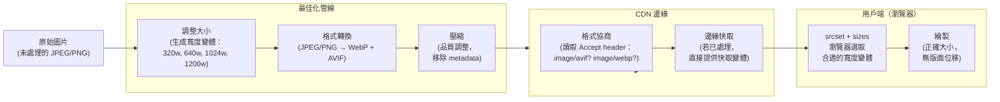

# [FEE-706] 圖片與資源最佳化

:::info
本文涵蓋圖片為何佔據頁面傳輸量的主要比例、現代格式（WebP、AVIF）、使用 srcset/sizes 和 image-set() 的響應式圖片、懶加載與 fetchpriority、框架圖片元件（Next.js、Nuxt、Astro）、建置時最佳化工具（sharp、imagemin），以及 CDN 即時轉換服務（Cloudinary、imgix、Vercel Image Optimization）。
:::

## 情境

圖片是平均網頁中頁面總重量最大的單一來源。HTTP Archive 的資料一致顯示，圖片約佔傳輸位元組總量的 50%——超過腳本、樣式表、字體和 HTML 的總和。與 JavaScript 的重量（還會造成解析與執行的開銷）不同，圖片的重量是「純粹」的傳輸成本：瀏覽器下載這些位元組、解碼它們，然後繪製它們。每一個不必要的 KB 對真實使用者的網路連線都是真實的延遲。

諷刺的是，圖片最佳化在所有效能技術中具有最高的努力與效益比。將一張 1 MB 的 JPEG 改為同等視覺品質的 WebP，通常可以削減 25--40% 的檔案大小。加上 srcset，讓 320 px 寬的手機螢幕不需要下載 1200 px 寬的圖片，可以削減 70--80% 的位元組。然而開發者持續交付未最佳化的圖片——不是因為他們不知道應該這麼做，而是因為過去的工具需要刻意的努力，而這種努力很容易被略過。框架圖片元件的存在正是為了改變這個預設值：當你在 Next.js 或 Nuxt 中使用 `<Image>` 而非裸露的 `` 時，正確的行為——懶加載、響應式 srcset、現代格式、正確尺寸——就會自動發生。

最佳化歷史上發生在兩個時間點：建置時和請求時。Sharp 和 imagemin 等建置時工具在網站建置時轉換並壓縮圖片，產生一組固定的最佳化檔案。由 Cloudinary、imgix 和 Vercel Image Optimization 提供的 CDN 即時轉換，則在 CDN 邊緣動態轉換、調整大小和重新編碼圖片，根據每個請求的 Accept header（用於選取瀏覽器支援的格式）和編碼所需寬度的 URL 參數進行調整。CDN 即時最佳化的能力嚴格意義上更強：它可以從同一張原始圖片，為 Chrome 使用者提供 AVIF，為 Safari 使用者提供 WebP，無需任何建置步驟，能夠適應網站最後部署後出現的設備能力。

## 設計思維

### 為何圖片佔主導地位，以及為何開發者持續交付未最佳化的圖片

瀏覽器的渲染管線將圖片視為被動內容：它下載圖片、解碼圖片，然後繪製圖片。它沒有概念去判斷一張 1 MB 的 JPEG 是否是正確的選擇，或者一張 200 KB 的 WebP 是否看起來完全相同。對於超大尺寸的圖片，沒有像缺少 `alt` 屬性那樣的主控台警告。瀏覽器是沉默的，網站在開發環境中看起來是一樣的（圖片從磁碟瞬間載入），問題只在慢速連線上才以延遲的形式浮現——而開發者很少在這種環境下測試。

這就是為何框架圖片元件代表結構性的改進而非只是便利性的提升。`` 元素是一個「敞開的坑」——它接受任何檔案、任何大小，且預設不懶加載。框架圖片元件是「成功的坑」：它讓錯誤的事情變得不方便（提供未最佳化的格式、略過懶加載、省略尺寸），讓正確的事情自動發生。效能的提升不來自任何單一的聰明最佳化，而是來自讓每張圖片預設都通過最佳化管線。

### WebP vs. AVIF：相容性與壓縮率

WebP 和 AVIF 都是現代圖片格式，使用比 JPEG 或 PNG 更複雜的壓縮演算法。實際差異在於時機和支援度：

**WebP**（Google 開發，2010 年發布）擁有近乎普遍的瀏覽器支援——大約自 2020 年起所有主流瀏覽器均支援。其壓縮率通常比同等感知品質的 JPEG 小 25--35%。它還支援無損壓縮（取代 PNG）和透明度（Alpha 通道），使其在大多數情況下成為 JPEG 和 PNG 的可行替代品。

**AVIF**（基於 AV1 視訊編碼，2019 年標準化）比 WebP 實現了更好的壓縮率——通常比同等 JPEG 小 30--50%——因為它使用更現代的壓縮演算法。它對於精細紋理和漸層的處理特別出色。然而，AVIF 編碼計算成本高昂（建置時較慢），且瀏覽器支援雖然在長青瀏覽器中很廣泛，但尚不如 WebP 普遍。Safari 在 16.4 版（2023 年 3 月）新增了 AVIF 支援；運行 iOS 15 的舊設備不支援它。

實際建議：使用 WebP 作為安全的預設值，以 AVIF 作為漸進式增強。`<picture>` 元素和 CDN 格式協商可以優雅地處理這一點——先提供 AVIF，無法處理的瀏覽器會退回到 WebP 或 JPEG。

### 響應式圖片：讓圖片符合顯示情境

一張 1200 px 寬的圖片提供給 360 px 寬的手機視窗，下載的像素數大約是必要的 11 倍（1200 vs. 360 px，忽略設備像素比）。以 2x 設備像素比計算，最佳圖片為 720 px 寬——仍然遠小於 1200 px。`srcset` 和 `sizes` 屬性為瀏覽器提供選擇合適候選項所需的資訊：

- `srcset` 列出可用的圖片檔案及其固有寬度（寬度描述符如 `400w`）或像素密度比例（`2x`）。
- `sizes` 告訴瀏覽器在各種視窗寬度下圖片的渲染寬度，使用媒體條件。這是版面資訊——它無法僅從圖片或 CSS 中推斷。

瀏覽器結合使用這兩個屬性：讀取 `sizes` 以確定當前視窗下的渲染寬度，然後從 `srcset` 中選擇寬度最接近該渲染寬度乘以設備像素比的圖片。

CSS 中背景圖片的對應功能是 `image-set()`，它接受多個帶有解析度描述符的圖片候選項，為非 `` 圖片提供相同的選擇機制。

### 懶加載與 fetchpriority：優先級的兩個極端

`loading="lazy"` 告訴瀏覽器延遲載入圖片，直到它進入（或接近）視窗。對於折疊線以下的圖片——在典型頁面上佔大多數圖片——這消除了在關鍵早期載入視窗期間與 LCP 圖片和其他首屏資源之間的頻寬競爭。對於滾動的使用者，成本可以忽略不計（由於瀏覽器的預讀距離，圖片在他們到達之前就已載入）；對於不滾動的使用者，好處是他們永遠不會下載從未看到的圖片。

`fetchpriority="high"` 則相反：它告訴瀏覽器將此圖片視為關鍵並推到獲取佇列的頂端。這對 LCP 圖片至關重要。瀏覽器對圖片的預設優先級是低到中；沒有明確的提升，LCP 圖片就會與腳本、樣式表和其他圖片競爭。結合文件 head 中的 `<link rel="preload">`，`fetchpriority="high"` 確保 LCP 圖片盡早被發現並在其他任何內容之前被獲取。

這兩個屬性不應同時出現在同一張圖片上：LCP 圖片使用 `fetchpriority="high"`（且不使用 `loading="lazy"`）；所有其他圖片使用 `loading="lazy"`（且不使用 `fetchpriority`）。

### 建置時 vs. CDN 即時最佳化：責任的轉移

建置時最佳化（sharp、imagemin、squoosh）在網站部署時處理圖片。開發者指定要生成哪些大小和格式，建置工具輸出它們，HTML 靜態引用它們。這種方式可靠且不需要外部服務，但它是靜態的：輸出在建置時固定。如果某個新格式（AVIF）獲得廣泛支援，你需要重新生成圖片並重新部署。如果你漏掉了某個特定寬度的斷點，該視窗的使用者會得到次優大小的圖片，可能大得多。

CDN 即時最佳化在邊緣按需處理圖片。Cloudinary、imgix 和 Vercel Image Optimization 接受原始圖片 URL 和請求 URL 中的參數（寬度、格式、品質），在 CDN 邊緣執行轉換，並返回結果——然後為後續請求快取。CDN 可以檢查 `Accept` header 來確定瀏覽器支援哪些格式，從單一原始圖片為 Chrome 提供 AVIF、為較舊的 Safari 提供 WebP、為舊版瀏覽器提供 JPEG。這種動態適應是建置時工具無法實現的。

取捨在於運營層面：CDN 轉換需要連接到 CDN 服務（一個依賴項），在大規模情況下有每次轉換的成本，並在快取未命中的請求中增加延遲（某個新尺寸/格式組合的第一次請求）。對於大多數生產應用程式，CDN 即時最佳化的靈活性和開發者體驗優於這些成本。建置時工具對於有嚴格自托管要求或離線能力 PWA 的專案仍然有價值。

### 框架圖片元件作為「成功的坑」

最好的圖片最佳化是不需要開發者特別考慮就能發生的。這是框架圖片元件的設計目標：

**Next.js `<Image>`**（來自 `next/image`）自動在可配置的斷點生成響應式 `srcset` 值、協商格式（根據瀏覽器支援提供 WebP 或 AVIF）、設定 `width` 和 `height` 以防止 CLS、預設懶加載，並可選擇在圖片載入時提供模糊佔位符。加上 `priority` 會停用懶加載並為 LCP 圖片注入 `<link rel="preload">`。圖片轉換由 Next.js Image Optimization API 處理（內建或通過 `loader` 配置委派給 CDN 提供商）。

**Nuxt `<NuxtImg>`**（來自 `@nuxt/image`）通過提供商系統提供類似的功能——你配置哪個 CDN 後端（Cloudinary、imgix、內建的 IPX 等）處理轉換。修飾符（width、height、format、fit）作為 props 傳遞。`<NuxtPicture>` 額外生成帶有多種 source 類型的 `<picture>` 標記。

**Astro `<Image>` 和 `<Picture>`**（來自 `astro:assets`）預設執行建置時最佳化，從本地圖片生成最佳化的格式和尺寸。對於遠端圖片，它們與圖片服務提供商整合。Astro 的方式特別適合在建置時就知道所有圖片的內容豐富靜態網站。

## 最佳實踐

**始終在圖片上設定明確的 `width` 和 `height` 以防止 CLS。** MUST 為每個 `` 和 `<iframe>` 加上與元素顯示長寬比相符的 `width` 和 `height` 屬性。沒有這些屬性，瀏覽器在版面計算期間不會分配任何空間；當圖片載入時，周圍的內容會移動，產生 Cumulative Layout Shift。設定這些屬性讓瀏覽器能夠在圖片位元組到達之前，立即使用固有長寬比計算並預留正確的空間。

**使用 AVIF/WebP 搭配 PNG/JPEG 後備，透過 `<picture>` 元素實現。** SHOULD 在 `<picture>` 元素中以 AVIF 作為主要 source、WebP 作為次要 source，並以 JPEG 或 PNG 的 `` 作為後備。瀏覽器按文件順序評估 `<source>` 元素，並選取它支援的第一個類型，因此 AVIF（比 JPEG 小 30-50%）可達到現代瀏覽器，而較舊的瀏覽器則自動回退。2024 年及以後，當 WebP 已獲得普遍瀏覽器支援時，MUST NOT 繼續只傳送 JPEG 或 PNG。

**懶載入首屏以下的圖片。** SHOULD 為每個初始視窗中不可見的 `` 加上 `loading="lazy"`。懶載入會延遲網路請求，直到瀏覽器判斷圖片正在接近視窗，消除與 LCP 圖片和其他關鍵資源在早期載入階段的頻寬競爭。MUST NOT 在 LCP 圖片或任何首屏以上的圖片上加上 `loading="lazy"` -- 對這些元素使用懶載入會延遲它們的取得，直接增加 LCP 時間。

**使用 `<link rel="preload" as="image">` 預載 LCP 圖片。** MUST 在文件 `<head>` 中為 LCP 圖片加上 `<link rel="preload" as="image">`，並在 `` 元素本身加上 `fetchpriority="high"`。預載確保瀏覽器在 HTML 解析時間就發現 LCP 圖片，而非等 CSS 和腳本載入後；`fetchpriority="high"` 將其提升到已在取得佇列中的其他圖片之上。在 Next.js 中，`<Image>` 上的 `priority` prop 會自動套用這兩者。

**使用具有自動格式協商功能的 CDN。** SHOULD 透過 CDN 圖片服務（Cloudinary、imgix、Vercel Image Optimization）路由圖片傳遞，這些服務讀取 `Accept` 請求標頭，為支援的瀏覽器提供 AVIF，不支援的提供 WebP，並以 JPEG 作為通用後備——全部來自同一張原始檔案。CDN 即時的格式協商消除了在建置時手動生成和維護多個格式變體的需求，並確保新支援的格式無需重新部署就能覆蓋到使用者。

## 視覺圖

### 圖片最佳化管線



## 範例

### 1. 使用 srcset 和 sizes 的響應式圖片

`srcset` 屬性列出可用的圖片候選項及其固有像素寬度。`sizes` 屬性描述在不同視窗斷點下的渲染寬度。瀏覽器將渲染寬度乘以設備像素比來選取最佳候選項。

```html

```

在 2x DPR 的 360 px 寬手機螢幕上，瀏覽器讀取 `sizes` 為 100vw = 360 px，乘以 DPR 得到 720 px 有效像素，然後選取 `/images/hero-640.webp`（640w）或 `/images/hero-1024.webp`，取決於哪個最接近而不低於需求。

### 2. 使用 picture 元素提供 AVIF 及 WebP 後備

`<picture>` 元素允許指定多個來源。瀏覽器選取它支援類型的第一個來源，最終退回到 `` 元素的 `src` 作為最後手段。

```html
<picture>
  <!-- AVIF：最佳壓縮，需要現代瀏覽器（Chrome 85+、Safari 16.4+） -->
  <source
    type="image/avif"
    srcset="
      /images/hero-640.avif   640w,
      /images/hero-1200.avif 1200w
    "
    sizes="(max-width: 640px) 100vw, 1200px"
  />
  <!-- WebP：廣泛支援（2020 年起所有主流瀏覽器） -->
  <source
    type="image/webp"
    srcset="
      /images/hero-640.webp   640w,
      /images/hero-1200.webp 1200w
    "
    sizes="(max-width: 640px) 100vw, 1200px"
  />
  <!-- JPEG 後備：通用支援 -->
  
</picture>
```

### 3. CSS image-set() 用於背景圖片

`image-set()` 為 CSS 背景圖片提供相同的多格式、多解析度選取機制。瀏覽器選取它支援的第一種格式類型和最合適的解析度。

```css
.hero {
  background-image: image-set(
    url("/images/hero.avif") type("image/avif"),
    url("/images/hero.webp") type("image/webp"),
    url("/images/hero.jpg")  type("image/jpeg")
  );
  background-size: cover;
  background-position: center;
}

/* 高 DPR 螢幕的解析度感知變體 */
.logo {
  background-image: image-set(
    url("/images/logo.webp") 1x,
    url("/images/logo-2x.webp") 2x
  );
}
```

注意：`image-set()` 在所有現代瀏覽器中均受支援（Chrome 113+、Firefox 89+、Safari 14+）。如有需要，可同時使用廠商前綴 `-webkit-image-set()` 以支援較舊的 Safari 版本。

### 4. 帶有 fetchpriority 和 preload 的 LCP 圖片

LCP 圖片需要兩件事：早期發現（通過 `<link rel="preload">`）和高獲取優先級。兩者結合可以最小化導航開始到 LCP 繪製之間的間隔。

```html
<head>
  <!-- preload：告訴瀏覽器在看到  標籤之前就開始獲取 -->
  <link
    rel="preload"
    as="image"
    href="/images/hero-1200.webp"
    imagesrcset="/images/hero-640.webp 640w, /images/hero-1200.webp 1200w"
    imagesizes="(max-width: 640px) 100vw, 1200px"
  />
</head>
<body>
  <!-- fetchpriority="high"：將此項提升至其他網路請求之上 -->
  <!-- LCP 圖片不加 loading="lazy" -->
  
</body>
```

### 5. Next.js Image 元件

Next.js `<Image>` 元件自動處理 srcset 生成、格式協商、懶加載和 CLS 防止。`priority` prop 是你需要為 LCP 圖片配置的唯一項目。

```tsx
import Image from 'next/image';

// LCP 圖片：priority 停用懶加載、注入 preload、設定 fetchpriority="high"
export function HeroImage() {
  return (
    <Image
      src="/images/hero.jpg"
      width={1200}
      height={600}
      priority
      alt="產品主視覺圖片"
      // Next.js 通過其圖片 API 自動生成 WebP 和 AVIF 變體。
      // 它還在配置的 device sizes 和 image sizes 生成 srcset 值。
      // 模糊佔位符可以這樣啟用：placeholder="blur" blurDataURL="..."
    />
  );
}

// 折疊線以下的圖片：懶加載是預設值，不需要配置
export function ProductCard({ src, alt }: { src: string; alt: string }) {
  return (
    <Image
      src={src}
      width={400}
      height={300}
      alt={alt}
      // loading="lazy" 自動設定（無 "priority" prop）
    />
  );
}
```

在 `next.config.js` 中配置外部圖片 domain 和 CDN loader：

```javascript
// next.config.js
/** @type {import('next').NextConfig} */
const nextConfig = {
  images: {
    // 允許用於遠端圖片的 domain
    remotePatterns: [
      {
        protocol: 'https',
        hostname: 'cdn.example.com',
        pathname: '/images/**',
      },
    ],
    // 格式順序：Next.js 優先選 AVIF，其次 WebP，再其次原始格式
    formats: ['image/avif', 'image/webp'],
    // 用於 srcset 生成的自訂設備寬度
    deviceSizes: [640, 750, 828, 1080, 1200, 1920],
    imageSizes: [16, 32, 48, 64, 96, 128, 256, 384],
  },
};

module.exports = nextConfig;
```

### 6. 帶有 provider 配置的 Nuxt Image

```vue
<!-- pages/index.vue -->
<template>
  <!-- NuxtImg 生成 srcset、懶加載，並委派給配置的 provider -->
  <NuxtImg
    src="/images/hero.jpg"
    width="1200"
    height="600"
    format="webp"
    loading="eager"
    fetchpriority="high"
    alt="產品主視覺圖片"
  />

  <!-- NuxtPicture 生成帶有多種 <source> 類型的 <picture> -->
  <NuxtPicture
    src="/images/product.jpg"
    width="400"
    height="300"
    :imgAttrs="{ alt: '產品照片', loading: 'lazy' }"
  />
</template>
```

```typescript
// nuxt.config.ts
export default defineNuxtConfig({
  image: {
    // 使用 Cloudinary 作為圖片 provider
    cloudinary: {
      baseURL: 'https://res.cloudinary.com/your-cloud/image/upload/',
    },
    // 或使用內建的 IPX provider（自托管，無外部依賴）
    provider: 'ipx',
  },
});
```

### 7. 使用 sharp 進行建置時最佳化

Sharp 是基於 libvips 的高效能 Node.js 圖片處理函式庫。它常用於建置腳本、CI 管線和自訂 Vite/webpack 插件中，以生成最佳化的圖片變體。

```javascript
// scripts/optimize-images.mjs
import sharp from 'sharp';
import { glob } from 'glob';
import { mkdir } from 'fs/promises';
import path from 'path';

const INPUT_DIR = 'src/assets/images';
const OUTPUT_DIR = 'public/images';

// 為響應式 srcset 生成的寬度變體
const WIDTHS = [320, 640, 1024, 1200];

async function optimizeImages() {
  const files = await glob(`${INPUT_DIR}/**/*.{jpg,jpeg,png}`);

  for (const file of files) {
    const name = path.basename(file, path.extname(file));
    const outDir = path.join(OUTPUT_DIR, path.dirname(file).replace(INPUT_DIR, ''));
    await mkdir(outDir, { recursive: true });

    for (const width of WIDTHS) {
      // WebP 變體
      await sharp(file)
        .resize(width)
        .webp({ quality: 80 })
        .toFile(path.join(outDir, `${name}-${width}.webp`));

      // AVIF 變體（編碼較慢，但壓縮更好）
      await sharp(file)
        .resize(width)
        .avif({ quality: 60 }) // AVIF 品質尺度與 JPEG/WebP 不同
        .toFile(path.join(outDir, `${name}-${width}.avif`));
    }

    console.log(`已最佳化：${file}`);
  }
}

optimizeImages().catch(console.error);
```

### 8. CDN 圖片轉換（Cloudinary 和 imgix）

CDN 圖片轉換服務接受原始圖片 URL 和 URL 中的轉換參數，在 CDN 邊緣應用轉換，並返回最佳化結果——然後為後續請求快取在邊緣。

```html
<!-- Cloudinary：轉換參數是路徑片段 -->
<!-- f_auto：格式協商（根據 Accept header 選 AVIF、WebP 或 JPEG） -->
<!-- q_auto：自動品質選擇 -->
<!-- w_640：調整大小至 640px 寬度 -->

```

```javascript
// imgix：轉換參數作為 query string
const imgixBase = 'https://example.imgix.net';

function imgixUrl(path, params) {
  const url = new URL(path, imgixBase);
  // auto=format：根據瀏覽器支援提供 AVIF/WebP
  // auto=compress：應用自動壓縮
  url.searchParams.set('auto', 'format,compress');
  for (const [key, value] of Object.entries(params)) {
    url.searchParams.set(key, value);
  }
  return url.toString();
}

// 為圖片生成 srcset 字串
function buildSrcSet(path, widths) {
  return widths
    .map(w => `${imgixUrl(path, { w })} ${w}w`)
    .join(', ');
}

// 在 JSX 中使用
const src = imgixUrl('/hero.jpg', { w: 1200 });
const srcSet = buildSrcSet('/hero.jpg', [320, 640, 1024, 1200]);
```

## 常見錯誤

- **向所有設備提供原始高解析度圖片。** 提供給 360 px 手機螢幕的 4K 產品圖片浪費了 10--30 倍的必要位元組。始終使用 srcset 和 sizes 生成並提供適當寬度的變體。

- **省略 alt 文字。** 每個 `` 都必須有 `alt` 屬性。空的 `alt=""` 適用於純裝飾性圖片（螢幕閱讀器會跳過它）。缺少 `alt` 屬性是無障礙性失敗和 HTML 驗證錯誤。

- **使用 srcset 而不使用 sizes。** 沒有 `sizes` 屬性，瀏覽器假設圖片是 100vw 寬。一個實際上是 300 px 寬的側邊欄圖片會導致瀏覽器下載不必要的大尺寸候選項。始終將 srcset 與 sizes 配對使用。

- **對 AVIF 和 WebP/JPEG 應用相同的品質設定。** AVIF 的品質尺度是非線性的，且無法與 JPEG 的品質尺度相比較。AVIF 的品質 60 通常比 WebP 的品質 80 產生更好的視覺結果。始終通過視覺比較（而非數字等效）來校準每種格式的品質設定。

- **在 Next.js 中忘記配置遠端圖片 domain。** Next.js Image 元件會阻止最佳化未列在 `next.config.js` 的 `images.remotePatterns` 中的 domain 圖片。這是一種安全措施，但省略 domain 會導致執行時錯誤，很容易在上線前才發現。

## 相關 FEE

| FEE | 關係 |
|-----|------|
| [FEE-700 渲染與效能概覽](./700.md) | 瀏覽器渲染管線的父文件。圖片是該管線必須處理的 payload 中最大的單一貢獻者。 |
| [FEE-704 核心 Web 指標與效能指標](./704.md) | LCP 幾乎總是圖片最佳化問題。LCP 圖片的 fetchpriority="high" 在那裡涵蓋；該圖片的格式和大小最佳化在本文涵蓋。 |
| [FEE-705 程式碼分割與懶加載](./705.md) | 圖片懶加載（loading="lazy"）是 JavaScript 懶加載（dynamic import）的圖片類比。兩者都減少了瀏覽器在使用者需要內容之前所做的工作。 |
| [FEE-104 HTML 媒體元素](../HTML%20Fundamentals/104.md) | img、picture、source 和 srcset/sizes 屬性是本文建立其上的 HTML 基礎。 |
| [FEE-204 響應式 CSS](../CSS%20Fundamentals/204.md) | CSS 中的 image-set() 與 HTML 中的 srcset 平行。CSS containment 和 aspect-ratio 用於防止圖片載入時的 CLS。 |

## 參考資料

- [Responsive images -- MDN](https://developer.mozilla.org/en-US/docs/Learn/HTML/Multimedia_and_embedding/Responsive_images) -- MDN 關於 srcset、sizes 和 picture 元素的指南，附有寬度描述符和像素密度描述符的實際範例
- [Use modern image formats -- web.dev](https://web.dev/articles/uses-webp-images) -- Google 對 WebP 和 AVIF 的論述，包含瀏覽器支援表和壓縮比較
- [AVIF has landed -- Jake Archibald / web.dev](https://web.dev/articles/avif) -- 深入探討 AVIF 的壓縮優勢、與 JPEG 和 WebP 的品質比較，以及編碼取捨
- [Optimizing images -- Next.js docs](https://nextjs.org/docs/app/building-your-application/optimizing/images) -- 官方 Next.js Image 元件文件，涵蓋 priority、placeholder、loader 和配置
- [The loading attribute -- MDN](https://developer.mozilla.org/en-US/docs/Web/HTML/Element/img#loading) -- 瀏覽器對 loading="lazy" 的行為、臨界距離，以及與 fetchpriority 的互動
- [fetchpriority -- web.dev](https://web.dev/articles/fetch-priority) -- Fetch Priority API（fetchpriority 屬性）的工作原理、圖片的優先級提示，以及 LCP 影響測量
- [Nuxt Image -- Nuxt docs](https://image.nuxt.com/) -- 官方 Nuxt Image 文件，涵蓋 NuxtImg、NuxtPicture、providers 和 modifier 語法
