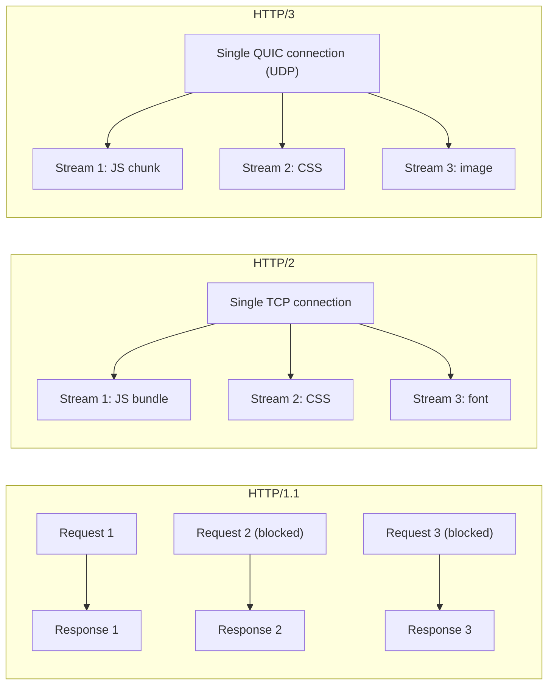

# [FEE-708] HTTP/1.1、HTTP/2 與 HTTP/3：協定演進

:::info
瀏覽器與伺服器之間運行的 HTTP 版本，決定了資源如何並行載入、封包遺失如何影響所有進行中的請求，以及細粒度的程式碼分割究竟是效能提升還是退步。理解 HTTP/1.1、HTTP/2 與 HTTP/3 之間的差異，是做出正確的打包、預載與 CDN 設定決策的關鍵。
:::

## 簡介

HTTP/1.1 於 1997 年標準化，在接下來近二十年間主導了整個網路。它確立了瀏覽器至今仍在使用的請求-回應模型，但帶有一個根本性的限制：單一 TCP 連線一次只能處理一個請求。瀏覽器以每個來源最多開啟六條並行 TCP 連線來繞過這個問題，但六條連線對於一個現代頁面來說是個很小的數字——一個頁面可能引用數十個 JavaScript 區塊、CSS 檔案、字型與圖片。當六條連線全部佔滿時，所有後續請求都必須在它們後面排隊，阻塞了關鍵渲染路徑。

HTTP/2 於 2015 年問世（RFC 7540），透過引入 multiplexing 解決了這個問題——能夠在單一 TCP 連線上，利用二進位框架層，交錯處理多組請求-回應。瀏覽器不再需要開啟多條連線；它只開一條，所有資源在其中以獨立的串流傳輸。這消除了 HTTP/1.1 的 HTTP 層 head-of-line blocking。HTTP/2 還引入了 HPACK 標頭壓縮，移除了在每個請求上重複傳送相同標頭（cookies、`User-Agent`、`Accept-Encoding`）的開銷。實際效果是：細粒度的程式碼分割——拆出許多小型 JavaScript 模組——首次變得可行。

HTTP/3（RFC 9114，2022 年）邁出了更激進的一步：它將 TCP 完全替換為 QUIC（RFC 9000），一個建構於 UDP 之上的傳輸協定。QUIC 保留了 HTTP/2 的 multiplexing 模型，但消除了最後一個 head-of-line blocking 的根源：TCP 本身。當 HTTP/2 連線上有一個封包遺失，OS 層的 TCP 堆疊會凍結所有串流，等待那一個封包重傳。QUIC 以串流為單位追蹤遺失的封包，因此只有擁有該遺失封包的串流會停頓，其他串流繼續正常傳輸資料。這在行動網路與有遺失的 WiFi 環境下影響最大——1–2% 的封包遺失率在這些環境中相當常見。QUIC 也將 TLS 1.3 整合進握手流程，將連線建立從兩個來回（TCP + TLS）縮短為一個（或使用 0-RTT 恢復時為零），其連線 ID 機制還能讓連線在網路切換（4G 切換至 WiFi）時無需完整重連。

標頭壓縮是新版協定展示可測量改善的另一個領域。HTTP/1.1 在每個請求上發送完整的請求標頭集——cookies、`User-Agent`、`Accept`、`Accept-Encoding`、`Referer`。在一個從同一來源載入 50 個資源的頁面上，這些標頭被發送 50 次。對於一個擁有 2 KB cookie 字串的網站，這是 100 KB 不傳遞任何內容的標頭開銷。HPACK（HTTP/2）和 QPACK（HTTP/3）透過在客戶端和伺服器之間維護共享壓縮表來消除這個問題。第一個請求之後，共享相同標頭值的後續請求只傳輸緊湊的索引參考，而非完整字串。

每個版本的採用趨勢對決策很重要。截至 2026 年，HTTP/2 幾乎被所有 CDN 和來源伺服器支援，按請求數量計算佔網路流量的 60% 以上。HTTP/3 由 Chrome、Edge 和 Firefox 支援；Safari 支援部分，在某些版本中仍隱藏於實驗性標誌後面。兩個較新的版本都需要 TLS——沒有任何瀏覽器實作明文 HTTP/2（h2c）或 HTTP/3。對前端團隊的含義是：TLS 不是選項，任何仍透過 HTTP 提供服務的來源必須先遷移，才能從 multiplexing 中獲益。好消息是，現代憑證提供商（Let's Encrypt、Cloudflare）讓免費、自動續約的 TLS 憑證變得常規，移除了讓許多來源在 2010 年代整個十年都停留在 HTTP/1.1 的成本障礙。

## 原則

瀏覽器與伺服器之間運行的 HTTP 版本，決定了資源如何並行取得、head-of-line blocking 如何影響載入，以及「打包所有東西」的策略究竟是最佳還是適得其反。團隊 MUST NOT 在未確認之前假設 HTTP/2 或 HTTP/3 全程有效——應透過伺服器設定、CDN 設定以及瀏覽器 DevTools Network 面板（Protocol 欄位）加以驗證。確認全程採用 HTTP/2+ 後，團隊 SHOULD 優先採用細粒度模組分割；當任何節點仍使用 HTTP/1.1 時，團隊 SHOULD 持續積極打包。無論 HTTP 版本為何，團隊 SHOULD 對關鍵資源使用 `Link: rel=preload` 回應標頭或 `<link rel="preload">`。團隊 SHOULD 優先採用 `103 Early Hints` 而非 HTTP/2 server push——server push 在 Chrome 106+ 中已棄用，且在 HTTP/3 中已移除。

## 設計思維

### 為何傳輸層決定了前端架構

前端工程師經常在不知道資源將透過哪個 HTTP 版本傳送給使用者的情況下做出決策——要產生多少個區塊、是否內嵌關鍵 CSS、要預載哪些字型。這是一種類別錯誤。HTTP/1.1 的最佳策略（少量大型檔案、積極內嵌）與 HTTP/2 的最佳策略（許多小型可快取檔案、最少內嵌）幾乎相反。若未在每個節點——來源伺服器、CDN 邊緣、負載平衡器——驗證協定版本就建立生產系統，某些決策必然是錯誤的。

HTTP/1.1 需要大型 bundle 的原因在於六條連線的限制。若一個頁面請求 30 個 JavaScript 區塊而只有六條連線可用，瀏覽器必須將其中 24 個排隊等待。TCP 連線建立（SYN/SYN-ACK/ACK）每次至少需要一個來回，TLS 又需要再加一個。在 100 ms RTT 的連線上，建立一條新連線在第一個位元組到達前需要 200–300 ms。將此乘以 24 個排隊中的請求，即使在快速網路上也會產生多秒的瀑布式延遲。大型 bundle 降低了請求數量，避免了這個開銷。

### Multiplexing 如何改變計算方式

HTTP/2 multiplexing 透過將所有請求以獨立串流的形式流經單一 TCP 連線，消除了連線數量的限制。每個串流都有自己的標頭區塊與流量控制視窗。伺服器可以以 16 KB 的粒度交錯來自不同串流的幀，因此在 HTTP 層，緩慢到來的大型區塊不會阻塞快速到來的小型區塊。這就是為何細粒度模組分割——每個路由、每個元件或每個廠商函式庫一個區塊——變得可行。每個區塊在同一條連線上並行載入，共享同一個標頭壓縮表，並可獨立快取。當使用者再次造訪頁面而只有一個模組發生變更，只有該模組的區塊需要重新取得，其餘皆從快取提供。

HTTP/3 的每串流遺失復原進一步強化了這一點。HTTP/2 over TCP 上，一個遺失的封包會凍結所有串流，因為 TCP 堆疊要求有序交付。在承載 10 個串流的連線上，1% 的封包遺失率意味著大約每 10 個封包就會發生一次會阻塞所有串流的重傳事件——在行動環境下可測量地降低效能。HTTP/3/QUIC 以串流為單位追蹤序號，只停頓擁有遺失封包的那個串流。實際上，這在降級網路條件下（也就是真實使用者經常所處的環境）轉化為更一致的載入時間。

### HTTP 版本如何影響瀏覽器的資源優先排序

HTTP/2 和 HTTP/3 給了瀏覽器更多表達資源優先級的手段。兩個版本都支援每個串流上的優先級欄位，向伺服器發出訊號，指示在頻寬受限時應優先發送哪些回應。瀏覽器利用這一點確保阻塞渲染的 CSS 在非關鍵圖片之前到達。在 HTTP/1.1 下，瀏覽器只能間接影響優先級——透過控制首先開啟哪些 TCP 連線，這是一個依賴連線時序而非明確訊號的粗糙工具。

實際含義是，不遵守串流優先級的 HTTP/2 伺服器實作，即使 multiplexing 已啟用，仍可能降低效能。以相同優先級發送所有串流的來源伺服器，可能會將低優先級圖片區塊的幀與阻塞渲染的 CSS 檔案的幀交錯，延遲繪製。Nginx 預設遵守 HTTP/2 串流優先級。驗證請求路徑中的任何自訂伺服器中介軟體或反向代理不會剝離或忽略 PRIORITY 幀。在 HTTP/3 中，QUIC 的串流排程使用 RFC 9218（HTTP 的可擴展優先排序方案）中定義的類似優先級機制。

### CDN 層與協定協商

一個常見的誤解是，瀏覽器體驗到的 HTTP 版本反映了完整的連線鏈路。實際上，CDN 在邊緣節點終止瀏覽器連線，並向來源伺服器建立獨立的連線。瀏覽器可能與 Cloudflare 邊緣節點協商 HTTP/3，而該邊緣節點卻透過 HTTP/1.1 從來源取得未快取的內容。結果是，瀏覽器的快速 multiplexed 連線只有在細粒度區塊請求的 CDN 快取命中率足夠高時才有意義。在一次部署事件同時使許多區塊失效時，CDN 必須透過來源取得重新填充快取。如果這些來源取得是透過 HTTP/1.1，它們就會序列化通過與直接面對瀏覽器相同的六條連線瓶頸。在未確保 CDN 到來源採用 HTTP/2 的情況下就採用細粒度分割的團隊，可能會觀察到比使用單一大型 bundle 更慢的部署傳播速度。

這對 preload 策略也有影響。103 Early Hints 回應在可能的情況下由 CDN 邊緣產生（Cloudflare 和 Fastly 都支援基於規則的邊緣生成 Early Hints），因此瀏覽器可以在來源仍在處理請求時就開始取得提示的資源。當來源產生 103 時，瀏覽器獲得同樣的效益，但前提是 CDN 將 103 傳遞給客戶端——並非所有 CDN 設定都這樣做。使用瀏覽器 DevTools Timing 分頁和 Navigation Timing API 中的 `early-hints-time` 欄位端對端驗證 Early Hints 的行為。

### 決策表：依 HTTP 版本選擇策略

| 情境 | HTTP/1.1 | HTTP/2 | HTTP/3 (QUIC) |
|---|---|---|---|
| 並行資源請求 | 每個來源 6 條連線 | 在 1 條 TCP 連線上 multiplexed | 在 1 條 UDP 連線上 multiplexed |
| Head-of-line blocking | 每條連線（TCP + HTTP 層） | HTTP 層已解決；TCP 層仍存在 | 完全消除（QUIC 每串流獨立） |
| Bundle 粒度偏好 | 少量大型 bundle | 許多小型模組可行 | 許多小型模組可行 |
| 封包遺失時的連線行為 | 整條 TCP 連線停頓 | 整條 TCP 連線停頓 | 只有受影響的串流停頓 |
| 連線遷移（行動裝置） | 需要新的 TCP 握手 | 需要新的 TCP 握手 | QUIC 連線 ID 在網路切換後仍存活 |
| 伺服器 → 客戶端提示 | 不支援 | Server Push（已棄用） | 103 Early Hints（建議使用） |
| TLS | 選用 | 實務上為必要 | 整合（QUIC-TLS） |
| 2026 年採用狀況 | 舊有；CDN 仍提供服務 | 普遍 | Chrome/Edge/Firefox；Safari 部分支援 |

## 最佳實踐

**在更改 bundle 策略之前，驗證每個節點的協定。** CDN 邊緣可能對瀏覽器使用 HTTP/2，但對來源伺服器使用 HTTP/1.1。兩個節點都很重要：來源到 CDN 的流量是快取未命中時的瓶頸。查閱 CDN 文件，並使用 DevTools Network 面板的 Protocol 欄位（或 `PerformanceResourceTiming.nextHopProtocol`）確認實際使用的協定。

**只有在確認全程採用 HTTP/2+ 時，才細粒度分割 bundle。** 在 HTTP/2 下，將廠商函式庫分割成獨立的可快取區塊幾乎總是有益的：一個快取 30 天的 `vendor-react` 區塊，在只有應用程式碼變更時不會重新下載。在 HTTP/1.1 下，同樣的分割會產生 24 個額外請求，耗盡六條連線的容量。新專案的正確預設值是假設現代 CDN 上有 HTTP/2，但為 HTTP/1.1 舊有流量保留明確的備用建置設定。

**無論 HTTP 版本為何，都對關鍵資源使用 `Link: rel=preload` 標頭。** preload 告訴瀏覽器在 HTML 解析器發現資源之前，以高優先級取得它。一個藏在樣式表三層重定向深處的關鍵 CSS 檔案，在開始下載前需要多個來回。來自伺服器的 `Link: </styles/main.css>; rel=preload; as=style` 回應標頭免費消除了這個連鎖問題，無論 HTTP 版本為何。

**優先採用 `103 Early Hints` 而非 HTTP/2 server push 進行伺服器主動的資源傳遞。** Server push 在 Chrome 106（2022 年）中已棄用，且在 HTTP/3 中完全缺席。根本問題在於伺服器無法知道瀏覽器快取中已有哪些資源；推送已在瀏覽器快取中的資源會浪費頻寬，甚至可能驅逐其他快取項目。`103 Early Hints`（RFC 8297）避免了這個問題：它立即發送一個帶有 `Link` 標頭的 103 回應，瀏覽器根據自身快取自行決定是否取得提示的資源，200 回應則在伺服器端處理完成後跟進。瀏覽器支援：Chrome 103+、Firefox 102+、Safari 17+。

**啟用 `Alt-Svc` 標頭以廣告 HTTP/3 支援。** 瀏覽器對伺服器的第一次連線始終是 HTTP/1.1 或 HTTP/2（基於 TCP）。`Alt-Svc: h3=":443"; ma=86400` 標頭告訴瀏覽器 HTTP/3 在 443 埠可用，並指示它在後續連線時升級。沒有這個標頭，瀏覽器就不會嘗試 QUIC。Nginx（具有 QUIC 支援）、Caddy 和 Cloudflare 都原生支援這個標頭。

**處理許多小型請求時，評估 HPACK / QPACK 壓縮的效益。** HTTP/2 HPACK 和 HTTP/3 QPACK 跨越同一連線上的串流壓縮請求標頭。當所有 30 個模組區塊共享相同的來源時，`Host`、`Accept-Encoding` 和 cookie 標頭只發送一次，後續請求使用差異壓縮。與 HTTP/1.1 在每條六條連線上重新發送完整標頭相比，這將標頭開銷減少了 80–90%。

**啟用 QUIC 0-RTT 之前，理解其取捨。** QUIC 0-RTT 恢復允許回訪的客戶端在第一個封包中就發送應用程式資料，消除了連線建立的來回延遲。這對重複造訪有可測量的改善。然而，0-RTT 資料容易受到重放攻擊——攻擊者若截獲 0-RTT 封包，可以重放它們以再次觸發相同的請求。將 0-RTT 限制在冪等的 GET 請求（頁面載入、靜態資源），絕不在會改變狀態的端點（如表單提交或付款流程）上啟用它。

**衡量感知效能，而非只看協定版本。** 採用 HTTP/3 並不會自動改善所有指標。在低延遲、可靠的桌上型電腦連線上，HTTP/2 和 HTTP/3 的表現幾乎相同，因為 TCP 封包遺失很少見。HTTP/3 的優勢集中在高延遲或有遺失的連線上——行動網路、洲際 CDN 路徑和擁塞的 WiFi。使用按網路類型和地理區域分層的真實使用者監控（RUM）資料，找出 HTTP/3 部署能帶來可測量改善的地方。要追蹤的關鍵指標是最大內容繪製（LCP）和首次位元組時間（TTFB），按 Network Information API 的 `effectiveType`（`'slow-2g'`、`'2g'`、`'3g'`、`'4g'`）分層，以隔離 HTTP/3 的 QUIC 傳輸帶來最大效益的行動網路群組。

**設定正確的快取標頭，以最大化每個區塊獨立快取的效益。** 將廠商區塊分割成獨立檔案的長期快取優勢，只有在這些區塊具有穩定的內容雜湊且設定了較長 `Cache-Control: max-age` 值時才能實現。一個 60 秒後過期的 `vendor-react` 區塊沒有任何快取優勢。使用內容定址的檔名（Vite 和 Webpack 預設都這樣做），並對所有帶雜湊的靜態資源設定 `Cache-Control: public, max-age=31536000, immutable`。

## Mermaid 圖



## 範例

### 在執行期偵測目前使用的 HTTP 版本

```ts
// check-protocol.ts — 透過 PerformanceResourceTiming 偵測 HTTP 版本
// 檢查主文件
const [nav] = performance.getEntriesByType('navigation') as PerformanceNavigationTiming[];
console.log('Page protocol:', nav.nextHopProtocol);
// 'h2' = HTTP/2 | 'h3' = HTTP/3 | 'http/1.1' = HTTP/1.1

// 檢查頁面上的每個資源
performance.getEntriesByType('resource').forEach((entry) => {
  const r = entry as PerformanceResourceTiming;
  if (r.nextHopProtocol) {
    console.log(`${r.name.split('/').pop()}: ${r.nextHopProtocol}`);
  }
});
```

`nextHopProtocol` 反映的是瀏覽器自身取得資源所用的協定——也就是瀏覽器到 CDN 的這一段。它不反映 CDN 連接來源伺服器所用的協定。依賴 `nextHopProtocol === 'h2'` 來確認 HTTP/2 設定的團隊，可能會忽略 CDN 到來源伺服器這一段仍是 HTTP/1.1 的情況。

要建立完整的協定稽核，需將瀏覽器的 `nextHopProtocol` 資料與 CDN 存取日誌（記錄來源取得所用的協定）和來源伺服器存取日誌（記錄 CDN 到來源取得所用的協定）結合起來。瀏覽器中 `nextHopProtocol === 'h2'` 與來源日誌中 `HTTP/1.1` 之間的差異，正是常見錯誤部分所描述的 CDN 降級問題的特徵。許多 CDN 儀表板在分析中提供「Protocol」維度，使這種稽核無需解析日誌即可完成。

### 在 Nginx 啟用 HTTP/2 與 HTTP/3

```nginx
# nginx.conf — 啟用 HTTP/2 與 HTTP/3
server {
  listen 443 ssl;
  http2 on;                          # HTTP/2（Nginx 1.25.1+）

  # HTTP/3 (QUIC) — 需要具備 QUIC 支援的 Nginx 版本
  listen 443 quic reuseport;
  add_header Alt-Svc 'h3=":443"; ma=86400';  # 廣告 HTTP/3 可用

  ssl_certificate     /etc/ssl/cert.pem;
  ssl_certificate_key /etc/ssl/key.pem;
}
```

`http2 on` 指令使用 Nginx 1.25.1+ 的新語法；舊版 Nginx 使用 `listen 443 ssl http2;`。`quic reuseport` 指令在工作行程間啟用 UDP multiplexing，這是 QUIC 在高負載下正常運作的必要條件。`Alt-Svc` 標頭告訴 Chrome 和 Firefox 在下一次連線時升級至 HTTP/3。

對於使用 Caddy 的團隊，設定更為簡單：Caddy 對所有 HTTPS 監聽器預設啟用 HTTP/2，並在設定 `servers { protocols h3 }` 全域選項時啟用 HTTP/3。Caddy 也透過 Let's Encrypt 或 ZeroSSL 自動生成並更新 TLS 憑證，完全消除憑證管理負擔。HTTP/3 廣告所需的 `Alt-Svc` 標頭仍然必須明確新增為回應標頭指令。

### 為 HTTP/2 配置 Vite 的區塊分割

```ts
// vite.config.ts — HTTP/2 感知的區塊分割設定
// HTTP/2 下：許多小型區塊沒問題；每個都在同一條連線上並行載入。
// HTTP/1.1 下：區塊過多 = 六條連線的瓶頸；保持區塊數量少且體積大。
import { defineConfig } from 'vite';

export default defineConfig({
  build: {
    rollupOptions: {
      output: {
        // 將廠商函式庫分割成獨立的可快取區塊（假設使用 HTTP/2）
        manualChunks: {
          'vendor-react':  ['react', 'react-dom'],
          'vendor-router': ['react-router-dom'],
          'vendor-query':  ['@tanstack/react-query'],
        },
      },
    },
    // 提高區塊大小警告閾值——過度分割對 HTTP/1.1 有害
    chunkSizeWarningLimit: 500, // kb
  },
});
```

每個 `manualChunks` 條目都會產生一個帶有自身內容雜湊的獨立檔案。由於廠商依賴變更不頻繁，這些區塊會在瀏覽器中被快取至其完整的快取週期。當某次部署只有應用程式碼變更，只有應用程式區塊需要重新取得；三個廠商區塊仍保留在快取中。在 HTTP/2 下，所有四個檔案在同一條連線上並行載入，不需要額外的握手開銷。

### 從 Express 伺服器發送 preload 標頭

```ts
// preload-hints.ts — Link: rel=preload 標頭（Node.js/Express）
import express from 'express';
const app = express();

app.get('/', (_req, res) => {
  // Link 標頭等同於 HTML 中的 <link rel="preload">
  // 瀏覽器在解析完整 HTML 回應之前就開始取得這些資源
  res.setHeader('Link', [
    '</styles/main.css>; rel=preload; as=style',
    '</fonts/inter.woff2>; rel=preload; as=font; crossorigin',
    '</scripts/app.js>; rel=preload; as=script',
  ].join(', '));

  res.send(/* html */ `
    <!DOCTYPE html>
    <html>
      <head>
        <link rel="preload" href="/styles/main.css" as="style">
        <link rel="stylesheet" href="/styles/main.css">
      </head>
      <body><div id="root"></div></body>
    </html>
  `);
});
```

`Link` 回應標頭在 HTML 解析開始之前就到達瀏覽器。在回應快速的伺服器上，預載的資源在解析器遇到 `<head>` 中的 `<link>` 標籤之前就已開始下載。`as` 屬性是必要的：它告訴瀏覽器資源類型，讓它能夠分配正確的取得優先級並使用正確的憑證模式。省略 `as` 會導致瀏覽器取得資源兩次——一次為 preload，一次為標籤被解析時。

### 從 Node.js HTTP/2 伺服器發送 103 Early Hints

```ts
// early-hints.ts — 103 Early Hints（Node.js HTTP/2 伺服器）
// 103 立即發送；200 在伺服器處理完成後跟進。
// 瀏覽器在 200 到達之前就開始取得提示的資源。
import http2 from 'node:http2';
import fs from 'node:fs';

const server = http2.createSecureServer({
  key:  fs.readFileSync('key.pem'),
  cert: fs.readFileSync('cert.pem'),
});

server.on('stream', (stream, headers) => {
  if (headers[':path'] === '/') {
    // 立即發送 103 Early Hints
    stream.additionalHeaders({
      ':status': 103,
      link: [
        '</styles/main.css>; rel=preload; as=style',
        '</scripts/app.js>; rel=preload; as=script',
      ].join(', '),
    });

    // ... 執行伺服器端工作（資料庫查詢、模板渲染）...

    // 發送實際的 200 回應
    stream.respond({ ':status': 200, 'content-type': 'text/html' });
    stream.end('<html>...</html>');
  }
});
```

103 狀態碼是資訊性的——瀏覽器不會等待它，也不會渲染它。它立即開始取得提示的資源，同時伺服器執行資料庫查詢或模板渲染。在一個伺服器處理時間 200 ms、RTT 50 ms 的頁面上，Early Hints 可以藉由將 CSS 和 JS 的網路取得與伺服器工作重疊，挽回大部分的 200 ms。這是相較於傳統 preload 標頭的主要優勢——傳統 preload 標頭隨 200 回應一起到達，此時伺服器處理早已完成。

請注意，`stream.additionalHeaders` 是 Node.js `http2` 模組特有的 API。在透過 HTTP/2 運行的 Express.js 或 Fastify 中，使用框架專用的 Early Hints API，或撰寫在主要處理器執行前設定 `:status: 103` 資訊回應的中介軟體。CDN 生成的 Early Hints（在 Cloudflare Workers 和 Fastly Compute 中可用）在提示清單是靜態且在部署時已知的情況下，消除了來源端實作的需求。

在選擇 preload 還是 Early Hints 時，一個實用的判斷準則是：若伺服器處理時間少於 50 ms（如靜態檔案服務），preload 標頭已足夠；若伺服器需要執行資料庫查詢或複雜模板渲染，Early Hints 能更有效地隱藏延遲。在行動裝置上，100 ms 的伺服器處理時間加上 80 ms 的 RTT，Early Hints 可以將首次內容繪製（FCP）改善 15–25%，這是值得在生產環境中測試的優化。

## 常見錯誤

**在未確認全程 HTTP/2 有效的情況下，將 bundle 分割成許多小型檔案。** 一個產生 40 個路由區塊的 Vite 設定，在 HTTP/2 下是最佳選擇，但在 HTTP/1.1 下會造成受限於 6 條連線的 40 個請求瀑布。CDN 邊緣可能對瀏覽器使用 HTTP/2，同時以 HTTP/1.1 從來源取得區塊。在這種情況下，快取未命中會導致 CDN 在服務瀏覽器之前，透過 6 條連線序列化處理 40 個來源請求。務必確認瀏覽器到 CDN 和 CDN 到來源這兩段的協定。

**在新專案中使用 HTTP/2 server push。** Server push 在 Chrome 106（2022 年 9 月）中已棄用，且從未成為 HTTP/3 的一部分。根本問題在於伺服器無法知道瀏覽器快取中已有哪些資源；推送已在瀏覽器快取中的資源會浪費頻寬，甚至可能驅逐其他快取項目。替代方案是 `103 Early Hints`，讓瀏覽器根據自身快取決定要取得什麼。

**假設 CDN 邊緣對來源使用 HTTP/2。** 許多 CDN 供應商在邊緣終止 HTTP/2，並以 HTTP/1.1 連接來源伺服器以確保相容性。這意味著即使瀏覽器體驗到 HTTP/2，來源回應仍受 HTTP/1.1 連線限制約束。明確查閱 CDN 文件——例如 Cloudflare，只有在來源具有有效 SSL 憑證且啟用「HTTP/2 to Origin」設定時，才支援對來源的 HTTP/2。

**將 HTTP 版本與 TLS 混淆。** HTTP/2 技術上允許明文操作（h2c），但沒有任何瀏覽器實作 h2c。實務上，HTTP/2 需要 TLS。HTTP/3/QUIC 將 TLS 1.3 整合為強制元件——沒有明文 HTTP/3。在明文負載平衡器後方部署 HTTP/2（期望 h2c）的團隊，會發現瀏覽器反而協商降回 HTTP/1.1。

**使用 `nextHopProtocol` 稽核完整的連線路徑。** `nextHopProtocol` 報告的是瀏覽器自身取得資源所用的協定——也就是瀏覽器到 CDN 的這一段。它不反映 CDN 連接來源所用的協定。依賴 `nextHopProtocol === 'h2'` 來確認 HTTP/2 設定的團隊，可能會忽略 CDN 到來源伺服器這一段仍是 HTTP/1.1 的情況。

**忽略第三方腳本對協定協商的影響。** 第三方腳本（分析工具、A/B 測試、聊天小工具）從獨立的來源載入。每個獨立來源都建立自己的連線——自己的協定協商、自己的 TLS 握手、若該第三方 CDN 在 HTTP/1.1 上則有自己的最多六條連線佇列。一個透過 HTTP/3 載入自身資源的頁面，若從仍使用 HTTP/1.1 的來源引入十個第三方腳本，對那些腳本就受到 HTTP/1.1 的限制。對第三方資源條目使用 `nextHopProtocol` 來稽核關鍵的第三方腳本是否透過高效的協定提供服務。

**將 `chunkSizeWarningLimit` 設定過高，從而掩蓋了真正的 bundle 大小問題。** 在細粒度分割是刻意為之且 HTTP/2 已確認的情況下，提高 Vite 的區塊大小警告閾值是適當的。若用於壓制關於確實過大、應該分割或進行 tree-shaking 的 bundle 的警告，則有害。將閾值視為意圖的文件說明（這是已知的、可接受的大小），而非避免調查警告的方式。使用 `rollup-plugin-visualizer` 或 `vite-bundle-analyzer` 進行 bundle 分析應該是定期實踐，而非僅在收到投訴時才執行。

## 總結

| 考量項目 | HTTP/1.1 | HTTP/2 | HTTP/3 |
|---|---|---|---|
| 分割前需驗證 | 不適用 | 必要 | 必要 |
| 細粒度區塊 | 有害 | 有益 | 有益 |
| Server push | 不適用 | 已棄用 | 已移除 |
| Early Hints | 不支援 | 支援 | 支援 |
| QUIC 每串流復原 | 否 | 否 | 是 |
| TLS 要求 | 選用 | 強制（瀏覽器） | 整合 |

無論 HTTP 版本為何，工作流程都相同：用 `nextHopProtocol` 測量實際使用的協定，根據結果設計 bundle 策略，對關鍵資源使用 `Link: rel=preload`，並優先採用 `103 Early Hints` 作為伺服器端資源提示。確切的協定版本是這些決策的輸入，而非目標本身。

## 相關 FEE

- [FEE-705：程式碼分割、延遲載入與 Tree Shaking](./705.md) — HTTP 版本決定了最佳的區塊粒度
- [FEE-801：打包工具：Webpack、Vite、Rollup 與 esbuild](../Build%20Tooling%20and%20Module%20Systems/801.md) — 適用於 HTTP/2 感知分割的打包工具設定
- [FEE-700：渲染與效能概覽](./700.md) — HTTP 在整體效能圖景中的位置
- [FEE-411：WebTransport](../Browser%20APIs%20and%20Web%20Platform/411.md) — 建構於 HTTP/3/QUIC 之上的瀏覽器 API

## 參考資料

- MDN HTTP 概覽：https://developer.mozilla.org/en-US/docs/Web/HTTP
- MDN HTTP/2：https://developer.mozilla.org/en-US/docs/Glossary/HTTP_2
- web.dev「HTTP/2」：https://web.dev/articles/performance-http2
- web.dev「103 Early Hints」：https://developer.chrome.com/docs/web-platform/early-hints
- RFC 9114（HTTP/3）：https://datatracker.ietf.org/doc/html/rfc9114
- RFC 9000（QUIC）：https://datatracker.ietf.org/doc/html/rfc9000
- Chrome 棄用 server push：https://developer.chrome.com/blog/removing-push
- MDN PerformanceResourceTiming.nextHopProtocol：https://developer.mozilla.org/en-US/docs/Web/API/PerformanceResourceTiming/nextHopProtocol
