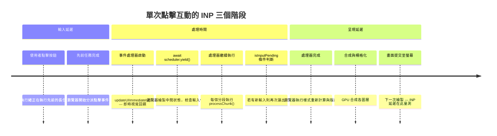

# INP 深度解析：從互動到下一幀繪製

Interaction to Next Paint（INP）於 2024 年 3 月正式成為 Core Web Vitals 指標，取代了 First Input Delay（FID）。INP 量測使用者整個造訪過程中所有互動的延遲時間——點擊、觸控與按鍵——並回報最差情況下的互動延遲（對互動次數極多的頁面會進行離群值修整）。FID 只測量第一次互動；INP 測量全部互動，使其成為衡量頁面整個工作階段回應能力更全面的指標，而不僅限於頁面首次可互動的那一刻。這項改變反映了 Google 的認知：使用者對頁面速度的印象，是由持續的回應能力而非第一印象決定的。

一次互動的延遲分為三個階段：輸入延遲（input delay，使用者動作到瀏覽器開始執行事件處理器的時間）、處理時間（processing time，事件處理器實際執行的時間），以及呈現延遲（presentation delay，處理器完成後瀏覽器渲染並繪製更新畫面所需的時間）。INP 即為工作階段中最差一次互動的這三個階段之總和。每個階段都是獨立的優化目標，各有不同的根本原因與對應解法。若將其混為一談，往往只處理了處理時間，卻讓輸入延遲與呈現延遲未受審視，導致改善效果不完整且無法反映在真實環境指標上。

Google 對 INP 的評分標準為：低於 200ms 為良好，200–500ms 為需要改善，高於 500ms 為差。INP 300ms 意味著使用者在本次工作階段中，至少有一次互動從動作到下一幀繪製耗費了 300ms。對大多數應用程式而言，處理時間是最大的貢獻來源——過長的事件處理器、同步的渲染更新，或處理器觸發的強制版面重排。然而，在隨時間持續載入大量 JavaScript 的頁面上，隨著主執行緒被延遲的腳本評估、hydration 工作與累積的計時器回呼佔滿，恰好在使用者互動時觸發，輸入延遲也可能大幅增長。獨立量測並理解每個階段，是有效 INP 優化的基礎。

## 原則

工程師必須（MUST）透過真實使用者監控（RUM）在真實環境中量測 INP，而非僅依賴實驗室量測結果。INP 是一個統計指標，反映的是整個工作階段中最差一次互動的表現；只執行單次互動的實驗室測試，無法捕捉到在 JavaScript 執行數分鐘、主執行緒累積了微任務佇列、快取狀態與延遲工作後，工作階段中途發生的效能衰退。Chrome User Experience Report（CrUX）及 `web-vitals` 函式庫等 RUM 工具，是取得真實 INP 資料的權威來源，在斷言頁面互動回應能力是否可接受之前，必須（MUST）參考這些資料，而非以 Lighthouse 分數作為替代。

工程師應該（SHOULD）使用 `scheduler.yield()`（或以 `setTimeout(0)` 作為備援方案）將互動事件處理器中阻塞主執行緒的長任務拆分，在處理各個分段之間將控制權還給瀏覽器。一個同步執行 400ms 的事件處理器，對每一位觸發該互動的使用者都會產生至少 400ms 的 INP。在各處理單元之間讓出執行權，可讓瀏覽器處理其他事件、更新 UI 並回應優先度更高的使用者輸入，即使總工作量不變，也能降低最差情況下的互動延遲。工程師也應該（SHOULD）獨立診斷三個 INP 階段，而非預設處理時間是唯一的瓶頸。

## 設計思維

### INP 的三個階段及其根本原因

確認互動延遲中哪個階段佔主導地位，是選擇正確優化策略的前提。輸入延遲是使用者動作與瀏覽器開始執行事件處理器之間的空白時間，成因是互動發生時主執行緒上已有長任務在執行——例如腳本評估、大型 `setTimeout` 回呼，或前一個尚未完成的處理器。降低輸入延遲的方法是減少互動時的主執行緒佔用率：拆分長任務、避免在使用者可能互動時進行繁重的腳本評估、推遲非緊急的背景工作，並避免將 CPU 密集型工作排程進 `requestAnimationFrame` 回呼，以免在最不合時宜的時刻觸發。

處理時間是事件處理器本身的執行時長，也是開發者最容易觀察到的階段，因為它在 DevTools 的效能面板中以 JavaScript 呼叫堆疊的形式呈現。處理時間過長的原因包括：迭代大型資料集、執行同步 DOM 查詢、觸發強制樣式重新計算與版面重排（layout thrash），或協調跨元件的複雜狀態更新。解決方法是找出耗時工作、以 `await scheduler.yield()` 呼叫將其拆分成每個小於 50ms 的分段，並將真正非關鍵的工作——分析記錄、日誌、背景同步——推遲到視覺更新完成後再執行。

呈現延遲是從最後一個事件處理器完成，到瀏覽器在螢幕上繪製更新畫面的時間。當處理器進行多次小型 DOM 變動而觸發多輪樣式重新計算與版面重排、或觸發大型 CSS 動畫或轉場效果、或需要對新顯示的元素進行合成時，呈現延遲就會增長。降低呈現延遲的方法是批次進行 DOM 讀寫讓瀏覽器每幀只計算一次版面、避免交錯讀取版面觸發屬性（如 `offsetHeight`、`getBoundingClientRect`、`scrollTop`）與 DOM 寫入操作，以及善用 CSS 屬性（如 `will-change`、`transform`、`opacity`）將已知開銷大的動畫元素提升到獨立合成層以縮小繪製範圍。

### scheduler.yield() 與 Scheduler API

`await scheduler.yield()` 是拆分長事件處理器的主要工具，同時不需放棄處理器的執行上下文或失去使用者啟動狀態（user activation state）。瀏覽器執行 `await scheduler.yield()` 時，會暫停處理器，以高優先度將其放回任務佇列，並允許任何待處理的渲染工作、輸入事件或優先度更高的任務執行，然後再繼續處理器的執行。這在多個面向上優於 `setTimeout(0)`：`scheduler.yield()` 會保留特定瀏覽器 API（如 `window.open`、`navigator.clipboard.write`）所需的使用者啟動狀態，其排程優先度高於 `setTimeout` 回呼因此處理器恢復更快，且能與瀏覽器的內建任務排程模型整合，而非用粗糙的計時器繞過它。

Scheduler API（`scheduler.postTask`）進一步允許以明確的優先度投遞工作：`'user-blocking'` 表示應在所有其他任務之前執行，`'user-visible'`（預設值）表示應在下一幀執行，`'background'` 表示只在主執行緒閒置時才執行。開發團隊可以用 `scheduler.postTask('background', callback)` 作為推遲分析記錄和日誌到閒置時間的高精度替代方案，取代 `requestIdleCallback`，且額外支援透過 `AbortSignal` 取消任務。此 API 在 Chrome 94+ 可用，其他瀏覽器的支援有限；針對更廣泛的受眾時，務必進行能力檢查並準備 `setTimeout` 備援。

### isInputPending

`navigator.scheduling.isInputPending()` 提供了一種方式，讓長處理迴圈在決定是否讓出之前，先檢查是否有新的使用者輸入到達。若 `isInputPending()` 回傳 `true`，迴圈應立即透過 `scheduler.yield()` 讓出，讓瀏覽器能立即處理待處理的輸入事件，而不需等待當前分段完成。若回傳 `false`，迴圈可繼續處理當前分段而不讓出，從而避免在沒有輸入等待時進行不必要的讓出開銷。這種條件式讓出模式最適合用在處理迴圈中：若每次迭代都讓出頻率會過高，且每次迭代的工作量不大但累積起來可觀。

此 API 在 2026 年的跨瀏覽器支援仍然有限，必須始終以能力檢查加以防護：`navigator.scheduling?.isInputPending()`。在不支援的瀏覽器上呼叫而未加可選鏈操作符，會拋出 TypeError。在 API 不可用的環境中，最安全的備援是在每個分段後以 `await scheduler.yield()` 或 Promise 包裝的 `setTimeout(0)` 無條件讓出。額外讓出的開銷幾乎總是優於未讓出導致 INP 差而帶給使用者的代價。

### 使用 Chrome DevTools 診斷 INP

Chrome DevTools 的效能面板是診斷慢速互動的主要工具。在執行目標互動時錄製效能分析，可以捕捉完整的活動時間軸。時間軸頂部的互動（Interactions）軌道顯示每個錄製的互動及其總耗時，依嚴重程度以顏色標示；點擊某個互動可在主執行緒軌道上高亮顯示對應活動。長任務在主執行緒軌道的角落以紅色三角形標示。展開長任務下方的呼叫堆疊可以揭示哪個函式造成了延遲，以及各函式所花的時間。

Long Animation Frames（LoAF）API，可透過 `PerformanceLongAnimationFrameObserver`（Chrome 123+）存取，會記錄任何渲染時間超過 50ms 的畫面，並包含造成延遲的腳本明細——函式名稱、來源 URL 與執行時長。這使得不需手動搜尋效能分析檔案，就能識別出特定的處理器或回呼。在生產環境中可透過 RUM 收集腳本設定此 observer，從真實使用者工作階段而非只從開發者分析工作階段捕捉 LoAF 資料。

`web-vitals` 函式庫的 `onINP` 回呼提供了真實環境收集的歸因資料，對生產環境診斷極具價值。它回報工作階段中最差互動的目標元素選擇器、事件類型，以及輸入延遲、處理時間與呈現延遲的細項分解。這項歸因告訴開發者使用者點擊（或觸控、輸入）了哪個元素、是什麼類型的事件，以及互動的哪個階段最慢——無需開發者在分析工作階段中完全重現同一操作。將 `onINP` 提供的真實環境歸因資料與使用該具體互動進行 DevTools 實驗室分析搭配使用，是找到修復方案最有效的路徑。

### INP 與 TBT（總阻塞時間）的差異

Total Blocking Time（TBT）是 Lighthouse 的實驗室指標，量測載入階段——具體是從 First Contentful Paint 到 Time to Interactive——期間主執行緒被超過 50ms 任務阻塞的總時間。TBT 在實驗室環境中是 INP 的有用代理指標，因為兩者都對主執行緒長任務敏感：減少載入期間的長任務通常能同時改善 TBT 和 INP。這種相關性解釋了為何 Lighthouse 分數有時與真實環境 INP 改善相關，以及為何致力於 Lighthouse 分數的團隊往往會意外改善 INP。

然而，TBT 與 INP 並非相同的量測指標，TBT 良好並不保證 INP 良好。TBT 可能表現優秀，而 INP 卻依然很差——當昂貴的互動發生在 TBT 所量測的初始載入窗口之後。一個載入迅速且在 Lighthouse 中表現良好的頁面，仍可能有差的 INP，原因包括：使用者互動觸發了長事件處理器、客戶端路由在使用者切換路由時引發大量腳本評估、虛擬列表或資料表格在篩選或排序時處理大型資料集，或背景計時器在載入階段後持續累積主執行緒工作。TBT 的量測窗口（僅限載入階段）完全排除了這整個類別的互動時效能問題。

### INP 歸因與真實環境除錯工作流程

修復差的真實環境 INP 最有效的工作流程是：在 RUM 中收集歸因資料、依元素和事件類型識別影響最大的互動、在 DevTools 分析工作階段中重現該互動、識別主導的 INP 階段，然後套用相應的優化。沒有歸因資料，開發者容易猜測哪個互動很慢並優化了錯誤的目標。`web-vitals` 函式庫的 `onINP` 搭配 `reportAllChanges: true` 選項，會在工作階段進行中每次有新的最差互動時就回報，有助於識別不只是最終的最差互動，也能了解哪些互動傾向於接近 INP 臨界值。將這些資料傳送到分析端點，使團隊得以建立按頁面、按元素、按事件類型與按裝置類別分類的 INP 分佈儀表板——這是系統性大規模改善 INP 的基礎。

## 最佳實踐

**必須（MUST）使用真實使用者監控來量測 INP，而非僅依賴實驗室工具。** Lighthouse 與 PageSpeed Insights 在載入窗口內模擬單一互動的效能。來自 CrUX 或 `web-vitals` 函式庫的真實環境 INP，反映的是跨所有互動、所有裝置與實際造訪期間所有網路條件下的真實使用者工作階段。在 Lighthouse 中表現良好的頁面，若其最常觸發的互動——表單送出、篩選控制項、導航選單、資料表格操作——包含實驗室測試從未執行過的慢速事件處理器，其真實環境 INP 仍可能很差。在 RUM 中收集歸因資料（目標元素與 INP 階段細項）是識別優先優化哪個互動與哪個階段的關鍵。

**應該（SHOULD）使用 `await scheduler.yield()` 來拆分執行超過約 50ms 同步工作的事件處理器。** 50ms 的臨界值來自長任務的定義：任何超過 50ms 的主執行緒任務都會在可感知的時間內阻塞瀏覽器對輸入的回應。迭代大型資料集、計算複雜的衍生狀態、執行多個同步 DOM 更新，或協調跨元件狀態變更的處理器，應在各邏輯處理單元之間讓出，將每個分段控制在 50ms 以內。若 `scheduler.yield()` 不可用，以 Promise 包裝的 `setTimeout(0)` 可提供排程優先度稍低的跨瀏覽器備援方案。處理器模式為：執行即時視覺回饋、讓出、以 `isInputPending()` 為條件進行分段處理，然後完成更新。

**應該（SHOULD）將使用者互動觸發的非關鍵工作推遲到視覺更新完成後，再交由 `requestIdleCallback` 或 `setTimeout(0)` 處理。** 分析記錄、將狀態持久化到 `localStorage`、快取失效，以及背景同步，不需要阻塞緊接在使用者動作之後的那一幀。將這些工作排程到畫面更新後執行，可消除它們對處理時間與呈現延遲的貢獻，從而在不改變互動結果的前提下降低 INP。在可用時使用 `scheduler.postTask('background', fn)` 以獲得比 `requestIdleCallback` 更精確的優先度控制與可取消性。

## 視覺呈現



## 範例

```js
// 使用 scheduler.yield() 拆分長點擊處理器，將 INP 控制在 200ms 以下。
// 模式：先視覺回饋 → 讓出 → 條件讓出的分段處理。
// Chrome 115+ 支援 scheduler.yield()；其他環境備援至 setTimeout(0)。

const yieldToMain = () =>
  typeof scheduler !== 'undefined' && scheduler.yield
    ? scheduler.yield()
    : new Promise((resolve) => setTimeout(resolve, 0));

button.addEventListener('click', async () => {
  // 1. 在任何繁重工作之前先執行即時視覺回饋，
  //    讓使用者盡快看到 UI 的反應。
  updateUIImmediately();

  // 2. 讓出，讓瀏覽器能繪製中間視覺狀態，
  //    並處理任何排隊中的渲染工作。
  await yieldToMain();

  // 3. 以分段方式處理資料。在各分段之間檢查是否有待處理的輸入，
  //    避免在處理過程中延遲新的互動。
  for (const chunk of largeDataChunks) {
    processChunk(chunk);

    if (navigator.scheduling?.isInputPending()) {
      // 有新的輸入到達——立即讓出，讓瀏覽器先處理，
      // 然後再繼續下一個分段。
      await yieldToMain();
    }
  }

  // 4. 所有分段處理完畢後完成更新。
  finalizeUpdate();

  // 5. 將非關鍵的後續工作推遲到瀏覽器閒置時執行，
  //    避免其貢獻到本次互動的呈現延遲。
  requestIdleCallback(() => logAnalyticsEvent('button_clicked'), { timeout: 2000 });
});
```

## 常見錯誤

- **只在 Lighthouse 或 PageSpeed Insights 中量測 INP。** 實驗室工具在載入時模擬單一互動，無法捕捉只在工作階段中途、客戶端 hydration 完成後，或路由切換期間才觸發的慢速處理器。需要來自 CrUX 或 `web-vitals` 的真實環境資料。
- **將 TBT 視為等同於 INP。** TBT 分數良好只代表載入階段沒有太多長任務；它對載入階段後發生的互動效能毫無說明。在具有繁重路由層級程式碼執行的 SPA 上，INP 與 TBT 可能出現顯著分歧。
- **在視覺回饋之前讓出。** 讓出應發生在即時視覺更新（`updateUIImmediately()`）之後，讓使用者盡快看到 UI 變化。在此之前就讓出，會延遲可見的回應，卻不能減少後續的工作量。
- **呼叫 `isInputPending()` 前未進行能力檢查。** 此 API 並非所有瀏覽器都支援；在不支援的瀏覽器上呼叫而未使用可選鏈操作符防護，會拋出 TypeError。
- **使用 `requestIdleCallback` 推遲所有工作卻未設定 `timeout`。** 沒有設定 `timeout` 選項的 `requestIdleCallback`，在繁忙頁面上可能數秒都不觸發。對於互動後必須在合理時間內執行的工作，應傳入 `{ timeout: 1000 }` 或 `{ timeout: 2000 }`，或改用 `setTimeout(0)`。
- **忽略呈現延遲作為優化目標。** 只優化事件處理器執行時間，卻保留了在迴圈中交錯讀取 `getBoundingClientRect` 與樣式寫入的版面重排模式，INP 的改善將是不完整的；在複雜的深層元件樹上，呈現延遲有時會超過處理時間。
- **未在生產環境收集 INP 歸因資料。** 若不知道哪個元素、哪種事件類型與哪個 INP 階段造成了最差的互動，優化工作就只能靠猜測。`web-vitals` 中的 `onINP` 回呼以最低開銷提供這些資料，應成為每個生產 RUM 設定的標準配備。

## 相關 FEE

- [FEE-700 — 渲染與效能總覽](./700.md)
- [FEE-704 — 核心 Web 指標與效能指標](./704.md)
- [FEE-712 — 關鍵渲染路徑與繪製計時](./712.md)
- [FEE-301 — 事件循環與非同步模型](../JavaScript%20Language%20and%20Runtime/301.md)

## 參考資料

- web.dev INP — https://web.dev/articles/inp
- web.dev Optimize INP — https://web.dev/articles/optimize-inp
- Chrome Developers: scheduler.yield() — https://developer.chrome.com/blog/scheduler-yield-origin-trial
- MDN PerformanceLongAnimationFrameObserver — https://developer.mozilla.org/en-US/docs/Web/API/PerformanceLongAnimationFrameObserver
