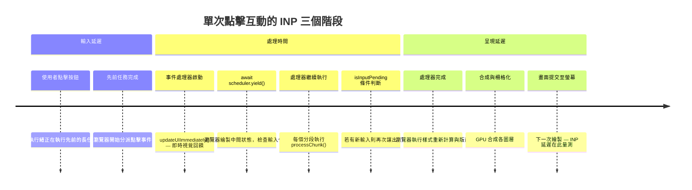

# [FEE-709] INP 深度解析：從互動到下一幀繪製

:::info
Interaction to Next Paint（INP）已於 2024 年 3 月 12 日取代 First Input Delay（FID），成為 Core Web Vitals 的一員，也改寫了「快」的定義。INP 不再只為頁面的第一次互動評分，而是為工作階段中的每一次點擊、觸控與按鍵評分，並回報其中最差的一次。要拿到良好的 INP 分數（低於 200ms），必須同時處理好三個獨立階段：輸入延遲、處理時間與呈現延遲，各自有不同的成因與解法。本文說明如何診斷慢速互動是由哪個階段主導、能同時修復處理時間與輸入延遲的排程 API，以及確認修復真正改善指標所需的真實環境與實驗室量測工作流程。
:::

## 背景

Interaction to Next Paint（INP）於 2024 年 3 月 12 日成為 Core Web Vitals 指標，取代了 Google 用來衡量回應能力的 First Input Delay（FID）。FID 只量測瀏覽器開始處理頁面第一次互動之前的延遲；INP 則量測工作階段中每一次點擊、觸控與按鍵的延遲，並回報其中最差的一次，使其成為衡量整個造訪過程中頁面操作體驗更完整的指標，而不僅限於頁面首次可互動的那一刻。

一次互動的延遲分為三個階段：輸入延遲（input delay，使用者動作到瀏覽器開始執行事件處理器的時間）、處理時間（processing time，處理器本身執行所需的時間），以及呈現延遲（presentation delay，處理器完成到瀏覽器繪製更新畫面的時間）。INP 是工作階段中最差一次互動的這三個階段之總和。每個階段都有不同的根本原因與對應解法，若將 INP 當成單一未分化的數字處理，往往只修復了處理時間，卻讓輸入延遲與呈現延遲維持原狀。

Google 的臨界值為：低於 200ms 為良好，200–500ms 為需要改善，高於 500ms 為差。對互動次數少於 50 次的工作階段，INP 就是所觀察到的最慢互動；對互動次數達到或超過 50 次的工作階段，瀏覽器會在選出回報值之前，每 50 次互動捨棄一次最差的互動：一個有 200 次互動的工作階段，在計算 INP 前會先捨棄四次最差的互動。這種修整能避免單一異常互動主導高互動頁面（如遊戲或儀表板）的得分。這是一個固定比例的小幅捨棄，而非百分位截斷，因此團隊仍應追查每一個能找到的慢速互動，而非假設多數異常值都會被修整掉。由於處理時間只是 200ms 預算內三個階段之一，讓處理器本身的執行時間遠低於 200ms，能為輸入延遲與呈現延遲留下同樣落在臨界值內的空間。

真實環境量測與實驗室量測回答的是不同的問題。Lighthouse 等實驗室工具只在頁面載入期間模擬單一互動。真實環境資料由 Google 彙整於 Chrome 使用者體驗報告（Chrome User Experience Report，CrUX），或由網站自身的真實使用者監控（real user monitoring，RUM）直接收集，捕捉的是真實訪客在其實際裝置與網路環境下，整個工作階段中觸發的每一次互動。本文其餘部分將真實環境 INP 視為真正重要的數字，實驗室工具則是重現與診斷它的手段。

## 視覺對比



## 範例

```js
// 將長時間執行的點擊處理器拆分成分段，確保每次同步執行都低於 50ms。
// 模式：先做視覺回饋，再讓出，然後以時間預算進行分段處理。
// 需要 Chrome 129+ 才能使用穩定版的 scheduler.yield()；
// 其他環境則備援至 setTimeout(0)。

const yieldToMain = () =>
  typeof scheduler !== 'undefined' && scheduler.yield
    ? scheduler.yield()
    : new Promise((resolve) => setTimeout(resolve, 0));

const CHUNK_BUDGET_MS = 40;

button.addEventListener('click', async () => {
  // 1. 在任何繁重工作之前先執行即時視覺回饋，
  //    讓使用者盡快看到 UI 的反應。
  updateUIImmediately();

  // 2. 讓出，讓瀏覽器能繪製中間視覺狀態，
  //    並在繁重處理開始前先處理任何排隊中的渲染工作。
  await yieldToMain();

  // 3. 以時間預算分段處理資料，而不只是在 isInputPending() 回傳 true 時才讓出。
  //    單純依賴 isInputPending() 判斷的話，若某個分段恰好沒有新輸入到達，
  //    或在 navigator.scheduling 未定義的瀏覽器上，就永遠不會讓出——
  //    這個迴圈則無論如何都會讓出。
  let lastYield = performance.now();
  for (const chunk of largeDataChunks) {
    processChunk(chunk);

    const inputIsPending = navigator.scheduling?.isInputPending?.() ?? false;
    const elapsedSinceYield = performance.now() - lastYield;

    if (inputIsPending || elapsedSinceYield >= CHUNK_BUDGET_MS) {
      // 有輸入待處理時立即讓出；一旦當前分段耗用完時間預算，
      // 也無條件讓出。
      await yieldToMain();
      lastYield = performance.now();
    }
  }

  // 4. 所有分段處理完畢後完成更新。
  finalizeUpdate();

  // 5. 將非關鍵的後續工作推遲到瀏覽器閒置時執行，
  //    避免其貢獻到本次互動的呈現延遲。
  requestIdleCallback(() => logAnalyticsEvent('button_clicked'), { timeout: 2000 });
});
```

## 最佳實踐

**必須（MUST）使用真實使用者監控來量測 INP，而非僅依賴實驗室工具。**
Lighthouse 與 PageSpeed Insights 在載入窗口內模擬單一互動的效能。
來自 CrUX 或 `web-vitals` 函式庫的真實環境 INP，反映的是跨所有互動、所有裝置與實際造訪期間所有網路條件下的真實使用者工作階段。
在 Lighthouse 中表現良好的頁面，若其最常觸發的互動（表單送出、篩選控制項、導航選單、資料表格操作）包含實驗室測試從未執行過的慢速事件處理器，其真實環境 INP 仍可能很差。
在 RUM 中收集歸因資料（目標元素與 INP 階段細項）是識別優先優化哪個互動與哪個階段的關鍵。
團隊應在開始任何 INP 優化工作之前而非之後建立 RUM，以便有基準真實環境資料來量測每項改變的影響；沒有基準的優化使人無法區分真正的改善與雜訊。

**應該（SHOULD）使用 `await scheduler.yield()` 來拆分執行超過約 50ms 同步工作的事件處理器。**
50ms 的臨界值來自長任務的定義：任何超過 50ms 的主執行緒任務都會在可感知的時間內阻塞瀏覽器對輸入的回應。
迭代大型資料集、計算複雜的衍生狀態、執行多個同步 DOM 更新，或協調跨元件狀態變更的處理器，應在各邏輯處理單元之間讓出，將每個分段控制在 50ms 以內。
若 `scheduler.yield()` 不可用，以 Promise 包裝的 `setTimeout(0)` 可提供排程優先度稍低的跨瀏覽器備援方案。
處理器模式為：執行即時視覺回饋、讓出、以時間預算進行分段處理（當 `isInputPending()` 回報為 true 時提早讓出），然後完成更新。
在框架元件中套用此模式時，注意不要在同步生命週期方法或渲染函式內部讓出，因為這會導致函式在框架期望同步值的地方回傳 Promise；讓出模式應套用在事件處理器邊界，在框架渲染週期之外。

**應該（SHOULD）將使用者互動觸發的非關鍵工作推遲到視覺更新完成後，再交由 `requestIdleCallback` 或 `setTimeout(0)` 處理。**
分析記錄、將狀態持久化到 `localStorage`、快取失效，以及背景同步，不需要阻塞緊接在使用者動作之後的那一幀。
將這些工作排程到畫面更新後執行，可消除它們對處理時間與呈現延遲的貢獻，從而在不改變互動結果的前提下降低 INP。
在可用時使用 `scheduler.postTask('background', fn)` 以獲得比 `requestIdleCallback` 更精確的優先度控制與可取消性。
採用這種延遲策略時，務必考量使用者可能在延遲工作執行前就離開頁面的情況；使用 `pagehide` 事件或 Page Visibility API，在頁面隱藏前強制刷新所有緩衝的延遲工作，確保使用者在互動後迅速離開時分析資料與狀態持久化不會遺失。

**應該（SHOULD）為各類互動類型制定 INP 預算，並在效能迴歸測試中強制執行。**
不同互動應有不同的可接受延遲目標，因為使用者對慢速回應的容忍度，取決於這個互動實際在做什麼。
以下只是一個假設性的示範，並非量測或有來源依據的數字：團隊或許會判定，觸發導覽的按鈕若超過大約 300ms 就會讓人感覺明顯遲鈍，而使用者能看出正在處理中的複雜篩選操作，則可以容忍較長的等待時間。
實際的數字應該來自團隊自身的使用者研究或 A/B 測試，而不是照搬文章中的數字；重點在於為每種互動類型都設定明確的預算，而不是套用他人訂出的臨界值。
定義明確的預算，並在 CI 環境中使用 Puppeteer 搭配 CPU 降速及 `web-vitals` 函式庫的 `onINP` 回呼進行測試，能在問題到達生產環境前捕捉迴歸。
CI 中的預算超限，應被視為效能關鍵互動的阻塞性錯誤，而非建議性警告，以免團隊建立的真實環境 INP 基準隨著新功能增加而持續悄悄惡化。

**應該（SHOULD）使用 Web Worker 將無法在主執行緒上有效分段的 CPU 密集型工作移交。**
某些計算，例如複雜的資料轉換、檔案解析或加密操作，無法輕易拆分成低於 50ms 的分段，因為每個工作單元本身就很昂貴，且不會產生有意義的中間結果。
對於這些情況，將計算移至專用 Web Worker 可完全消除其對 INP 的貢獻，因為 Worker 在獨立的作業系統執行緒上運行，不會阻塞主執行緒處理輸入事件。
主執行緒應在向 Worker 投遞任務前顯示載入指示器，並在 Worker 透過 `postMessage` 回傳結果時更新 UI，確保即使底層計算需要數百毫秒，互動的視覺回應依然快速。
在資料結構允許的情況下，使用 `Transferable` 物件（如 `ArrayBuffer`）在執行緒間傳遞大型資料，以避免序列化開銷。

## 設計思維

### INP 的三個階段及其根本原因

優化錯誤的階段對另外兩個階段沒有幫助：若團隊把事件處理器本身的執行時間縮短 200ms，但這個互動真正的瓶頸其實是處理器返回後、大型版面重新計算所造成的呈現延遲，INP 分數完全不會因此移動。確認哪個階段主導了特定互動的延遲，才能選擇正確的優化目標。

輸入延遲是使用者動作與瀏覽器開始執行事件處理器之間的空白時間，成因是互動發生時主執行緒上已有長任務在執行：例如腳本評估、大型 `setTimeout` 回呼，或前一個尚未完成的處理器。
降低輸入延遲的方法是減少互動時的主執行緒佔用率：拆分長任務、避免在使用者可能互動時進行繁重的腳本評估、推遲非緊急的背景工作，並避免將 CPU 密集型工作排程進 `requestAnimationFrame` 回呼，以免在最不合時宜的時刻觸發。
一個實用的診斷啟發是：對頁面進入可互動狀態後的最初五秒主執行緒進行分析，找出所有超過 50ms 的任務並逐一拆分，確保執行緒在使用者首次操作時有足夠的空隙可用。
對回應使用者捲動而懶載 JavaScript 模組的頁面，特別容易發生輸入延遲的峰值：使用者捲動後立即點擊，而此時模組尚在評估中。作為一個粗略的經驗法則，而非經過量測或普遍適用的臨界值，將每個懶載模組的解析後 JavaScript 體積控制在大約 30–40KB 以下，有助於限制模組評估可能造成的最壞情況輸入延遲；實際數字應以該模組在受節流的中階裝置上實際的解析與執行時間為準，而非視為固定不變。

處理時間是事件處理器本身的執行時長，也是開發者最容易觀察到的階段，因為它在 DevTools 的效能面板中以 JavaScript 呼叫堆疊的形式呈現。
處理時間過長的原因包括：迭代大型資料集、執行同步 DOM 查詢、觸發強制樣式重新計算與版面重排（layout thrash），或協調跨元件的複雜狀態更新。
解決方法是找出耗時的工作，用 `await scheduler.yield()` 呼叫將其拆分成多個小於 50ms 的分段。真正非關鍵的工作應推遲到視覺更新完成後再執行：分析記錄、狀態持久化、背景同步。
React 應用程式在單次互動觸發大型同步重新渲染樹時，特別容易受此階段影響；使用 `useDeferredValue` 或 `startTransition` 可將非緊急狀態更新移出關鍵渲染路徑，讓即時視覺回饋優先繪製，昂貴的 diff 工作則在較低優先度任務中跟進。
事件處理器複雜度與 INP 之間的關係是直接的：每在處理器的同步執行預算中增加一毫秒，就是對每一位觸發該互動的使用者的 INP 分數增加一毫秒。

呈現延遲是從最後一個事件處理器完成，到瀏覽器在螢幕上繪製更新畫面的時間。
當處理器進行多次小型 DOM 變動而觸發多輪樣式重新計算與版面重排、或觸發大型 CSS 動畫或轉場效果、或需要對新顯示的元素進行合成時，呈現延遲就會增長。
降低呈現延遲的方法是批次進行 DOM 讀寫讓瀏覽器每幀只計算一次版面、避免交錯讀取版面觸發屬性（如 `offsetHeight`、`getBoundingClientRect`、`scrollTop`）與 DOM 寫入操作，以及善用 CSS 屬性（如 `will-change`、`transform`、`opacity`）將已知開銷大的動畫元素提升到獨立合成層以縮小繪製範圍。
CSS 的 `content-visibility: auto` 屬性搭配 `contain-intrinsic-size` 保留跳過內容的版面空間，是另一個互補的手段：它讓瀏覽器完全跳過畫面外區塊的版面與繪製工作，藉此縮減鄰近互動可能觸發的渲染工作量。
呈現延遲是最常被忽視的優化目標，因為它發生在處理器返回之後，不會出現在處理器本身的呼叫堆疊中。只分析互動中 JavaScript 部分的開發者，會完全錯過這個階段。
Long Animation Frames（LoAF）API 特別適合用來診斷呈現延遲，因為其每幀細項分解涵蓋了處理器執行之後的渲染工作，而不只是腳本本身的工作。
保持 DOM 層次淺且 CSS 選擇器特異度低，也能降低樣式重新計算的成本，在元件密集的頁面上這是呈現延遲的重要來源之一。

診斷哪個階段造成問題，需要在剖析時刻意逐一隔離每個階段。DevTools 效能面板的長任務標記，讓輸入延遲在互動事件觸發前的主執行緒佔用期間清晰可見；處理時間以處理器本身的同步呼叫堆疊呈現；呈現延遲則是其後那一幀的渲染工作，時間軸上以處理器返回後出現的樣式重新計算、版面配置、繪製項目來呈現。常見的錯誤是看到 INP 總量偏高後，立即深入調查事件處理器的處理時間，卻發現處理器本身執行得很快，真正的瓶頸其實是處理器觸發的 DOM 變動所帶來的大型複雜版面重排造成的呈現延遲。

真實環境驗證在確認 INP 優化是否有效時同樣至關重要。
由於 INP 代表一個工作階段中最差的互動，將最差處理器從 400ms 縮短至 80ms 的修復，只有在部署後收集到足夠工作階段以推移第 75 百分位測量值時，才會在 CrUX 資料中顯現。
CrUX 以 28 天滾動視窗進行聚合，因此在第一天部署的修復，可能直到第 29 天才會完整反映在 CrUX 資料中。
在比這個視窗更短的時間內評估 INP 改善，可能得出「修復無效」的結論，而實際上只是統計樣本尚未傳播完成。
使用能夠直接回報每個工作階段 INP 的 RUM 工具進行 A/B 實驗，比等待 CrUX 更新提供更快的回饋，是在完整 CrUX 視窗關閉前評估高優先 INP 修復的合適機制。

要找出頁面上是哪個具體互動導致了最差的 INP，需要超越原始分數的歸因資料。從獨立的 `web-vitals/attribution` 建置版本匯入 `onINP`（而非基本的 `web-vitals` 套件），會在每筆回報中加入一個 `metric.attribution` 物件：`interactionTarget`（接收到互動的元素之 CSS 選擇器）、`interactionType`（`pointer` 或 `keyboard`），以及該次產生回報 INP 分數的互動之階段分解，包含 `inputDelay`、`processingDuration` 與 `presentationDelay`。將這些歸因資料記錄到 RUM 後端，可依互動類型與元素將 INP 問題分段，使團隊得以依最常導致最差分數的互動來排定優化工作的優先順序，並依影響程度逐一修復。

裝置類別分層是聚合 INP 分數所掩蓋的另一個面向。一個在桌機與中階 Android 裝置上表現良好的頁面，對於 JavaScript 執行能力受限的入門機型使用者來說，可能表現不佳。CrUX 允許依裝置形式（手機、平板、桌機）與有效連線類型對 INP 進行分層。在斷定頁面 INP 可接受之前先檢視這些分層數據，能避免頁面在桌機上技術上「良好」，卻在 Android 裝置分佈的後半段持續呈現「差」的情況上線；這後半段裝置往往佔全球產品使用者基礎的多數。INP 的三個臨界值（良好：低於 200ms；需改善：200–500ms；差：高於 500ms）是針對廣泛裝置分佈校準的起點，而非適用於所有產品的絕對通過/失敗標準。以低端裝置為主要服務對象的產品，應將內部目標設在「良好」範圍的低端，確保在其特定使用者群體中達到可接受的效能表現。

### scheduler.yield() 與 Scheduler API

`await scheduler.yield()` 是拆分長事件處理器的主要工具，同時不需放棄處理器的執行上下文或失去使用者啟動狀態（user activation state）。它已在 Chrome/Edge 129（2024 年 9 月）與 Firefox 142（2025 年 8 月）進入穩定版；Safari 尚未支援，因此 Safari 與較舊瀏覽器仍需要 `setTimeout(0)` 備援方案。
瀏覽器執行 `await scheduler.yield()` 時，會暫停處理器，以高優先度將其放回任務佇列，並允許任何待處理的渲染工作、輸入事件或優先度更高的任務執行，然後再繼續處理器的執行。
這在多個面向上優於 `setTimeout(0)`：`scheduler.yield()` 會保留特定瀏覽器 API（如 `window.open`、`navigator.clipboard.write`）所需的使用者啟動狀態，其排程優先度高於 `setTimeout` 回呼因此處理器恢復更快，且能與瀏覽器的內建任務排程模型整合，而非用粗糙的計時器繞過它。
此優先度優勢的實際效果是，讓出後的處理器通常在一至兩幀內恢復，而非等待完整的 `setTimeout` 最小延遲，這意味著以 `scheduler.yield()` 作為讓出點的分段操作，總耗時明顯短於以 `setTimeout(0)` 實現的等效操作。
從 `setTimeout` 分段遷移到 `scheduler.yield()` 的團隊，應在真實環境中量測前後的 INP，因為優先度差異即使在每個分段的工作量不變的情況下，也常能帶來可量測的改善。

Scheduler API（`scheduler.postTask`）進一步允許以明確的優先度投遞工作：`'user-blocking'` 表示應在所有其他任務之前執行，`'user-visible'`（預設值）表示應在下一幀執行，`'background'` 表示只在主執行緒閒置時才執行。
開發團隊可以用 `scheduler.postTask('background', callback)` 作為推遲分析記錄和日誌到閒置時間的高精度替代方案，取代 `requestIdleCallback`，且額外支援透過 `AbortSignal` 取消任務。
此 API 在 Chrome 94+ 可用，其他瀏覽器的支援有限；針對更廣泛的受眾時，務必進行能力檢查並準備 `setTimeout` 備援。
採用 `scheduler.postTask` 時，一個重要的設計考量是：`'user-blocking'` 任務會在下一次繪製之前同步執行，因此在此優先度投遞過多工作會適得其反，使 INP 惡化而非改善；應嚴格保留 `'user-blocking'` 給那些其結果必須在下一幀即時可見的工作，其他情況一律預設使用 `'user-visible'` 或 `'background'`。

### isInputPending

`navigator.scheduling.isInputPending()` 讓長處理迴圈能在決定是否立即讓出之前，先檢查是否有新的使用者輸入到達。
若回傳 `true`，迴圈應立即透過 `scheduler.yield()` 讓出，讓瀏覽器能處理待處理的輸入，而不需等待當前分段完成。
Chrome 官方文件現已註明，單純依賴 `isInputPending()` 進行條件式讓出，已不再是建議的主要策略：一個分段若剛好沒有與新輸入重疊，仍可能悄悄執行超過 50ms 的長任務邊界而未被偵測到，因為這項檢查只會回報已經到達的輸入。
目前的建議做法是無論是否有輸入等待，都依時間預算讓出，並將 `isInputPending()` 作為一種優化手段，在輸入已經等待時提早讓出。

此 API 截至 2026 年的跨瀏覽器支援仍然有限，必須始終以能力檢查加以防護：`navigator.scheduling?.isInputPending?.()`。
在不支援的瀏覽器上未加防護呼叫會拋出 TypeError。
無論此 API 是否可用，更安全的預設做法是用 `performance.now()` 追蹤經過時間，並在距上次讓出的時間接近 50ms 長任務臨界值時讓出（例如以 40ms 為預算，保留一點安全邊界），同時只要 `isInputPending()` 回報 `true` 就立即額外讓出。
這種以時間預算為主的做法，即使在分段中途沒有輸入到達的工作階段也會讓出，補上了純條件式讓出留下的漏洞，並且在兩個 API 都不可用的瀏覽器中能優雅地退化為以 `setTimeout(0)` 為基礎的讓出。

### 使用 Chrome DevTools 診斷 INP

Chrome DevTools 的效能面板是診斷慢速互動的主要工具。
在執行目標互動時錄製效能分析，可以捕捉完整的活動時間軸。
時間軸頂部的互動（Interactions）軌道顯示每個錄製的互動及其總耗時，依嚴重程度以顏色標示；點擊某個互動可在主執行緒軌道上高亮顯示對應活動。
長任務在主執行緒軌道的角落以紅色三角形標示。
展開長任務下方的呼叫堆疊可以揭示哪個函式造成了延遲，以及各函式所花的時間。
分析疑似慢速互動時，使用降速 CPU 設定（4 倍或 6 倍降速）來模擬中階 Android 裝置使用者的體驗非常重要，因為 INP 問題在這些裝置上最為嚴重，而開發者的快速電腦可能完全掩蓋這些問題。
DevTools 時間軸也會明確顯示呈現延遲階段，即最後一個腳本任務結束與代表瀏覽器已將畫面提交至螢幕的「Commit」標記之間的間隔。

Long Animation Frames（LoAF）API 會記錄任何渲染時間超過 50ms 的畫面，並包含造成延遲的腳本明細：函式名稱、來源 URL 與執行時長。它是透過標準的 `PerformanceObserver` 介面觀察，而非專屬類別：`new PerformanceObserver(callback).observe({ entryTypes: ['long-animation-frame'] })`。傳入回呼函式的每一筆條目都是一個 `PerformanceLongAnimationFrameTiming` 物件。
這使得不需手動搜尋效能分析檔案，就能識別出特定的處理器或回呼。
在生產環境中可透過 RUM 收集腳本設定此 observer，從真實使用者工作階段而非只從開發者分析工作階段捕捉 LoAF 資料。
LoAF 條目包含 `renderStart` 時間戳，標示了同時涉及腳本執行與渲染工作的任一幀中，處理時間與呈現延遲階段的分界；團隊可以用條目的 `startTime` 加 `duration` 減去 `renderStart` 來計算真實環境中的呈現延遲，無需完整的 DevTools 效能分析檔案。
當 LoAF 的逐腳本歸因對跨來源腳本回傳空白的腳本名稱時，通常是因為缺少 CORS 標頭：Long Animation Frames API 會對不透明的跨來源資源隱藏來源細節，在 script 標籤加上 `crossorigin` 屬性，並搭配伺服器回應的 `Access-Control-Allow-Origin` 標頭，即可恢復這些細節。

`web-vitals` 函式庫中從 `web-vitals/attribution` 建置版本匯入的 `onINP` 回呼，提供了真實環境收集的歸因資料，對生產環境診斷極具價值。
它回報工作階段中最差互動的目標元素選擇器、事件類型，以及輸入延遲、處理時間與呈現延遲的細項分解。
這項歸因告訴開發者使用者點擊（或觸控、輸入）了哪個元素、是什麼類型的事件，以及互動的哪個階段最慢，完全不需要開發者在分析工作階段中重現同一操作。
將 `onINP` 提供的真實環境歸因資料與使用該具體互動進行 DevTools 實驗室分析搭配使用，是找到修復方案最有效的路徑。
歸因資料也支援跨群體分析：團隊可依裝置記憶體、連線類型或地理區域對 INP 報告進行分組，以了解問題是否普遍存在，還是集中在特定使用者群體，從而決定修復方案應是一般性優化還是針對低端裝置的定向適配。

### INP 與 TBT（總阻塞時間）的差異

Total Blocking Time（TBT）是 Lighthouse 的實驗室指標，量測主執行緒在載入階段（具體而言，從 First Contentful Paint 到 Time to Interactive 這段視窗）被超過 50ms 任務阻塞的總時間。
TBT 在實驗室環境中是 INP 的有用代理指標，因為兩者都對主執行緒長任務敏感：減少載入期間的長任務通常能同時改善 TBT 和 INP。
這種相關性，就是為何致力於改善 Lighthouse 分數的團隊，經常會意外看到真實環境 INP 也隨之改善的原因。
TBT 作為 INP 代理指標的實用價值，在專案的初始優化階段最高，也就是頁面在載入過程中有大量長任務與早期使用者互動重疊的階段；處理這些任務通常可以讓兩個指標同步改善。
一旦低垂果實的載入期任務得到解決，TBT 與 INP 就會成為不同的優化目標，團隊必須轉向真實環境 INP 資料才能繼續進展。

然而，TBT 與 INP 並非相同的量測指標，TBT 良好並不保證 INP 良好。
TBT 可能表現優秀，INP 卻依然很差，因為耗時的互動發生在 TBT 所量測的初始載入窗口結束之後。
一個載入迅速且在 Lighthouse 中表現良好的頁面，仍可能有差的 INP，原因包括：使用者互動觸發了長事件處理器、客戶端路由在使用者切換路由時引發大量腳本評估、虛擬列表或資料表格在篩選或排序時處理大型資料集，或背景計時器在載入階段後持續累積主執行緒工作。
TBT 的量測窗口（僅限載入階段）完全排除了這整個類別的互動時效能問題。
來自 CrUX 或 RUM 的真實環境 INP，是唯一能捕捉這些載入後互動成本的指標。
TBT 與 INP 的分歧在使用 Service Worker 快取實現快速載入的頁面上尤為明顯：載入階段短暫，TBT 表現優秀，但快取的 JavaScript 套件在使用者導覽時執行複雜的客戶端邏輯，產生了對所有載入階段指標都不可見的高 INP 分數。

### INP 歸因與真實環境除錯工作流程

修復差的真實環境 INP 最有效的工作流程是：在 RUM 中收集歸因資料、依元素和事件類型識別影響最大的互動、在 DevTools 分析工作階段中重現該互動、識別主導的 INP 階段，然後套用相應的優化。
沒有歸因資料，開發者容易猜測哪個互動很慢並優化了錯誤的目標。
`web-vitals` 函式庫的 `onINP` 搭配 `reportAllChanges: true` 選項，會在工作階段進行中每次有新的最差互動時就回報，有助於識別不只是最終的最差互動，也能了解哪些互動傾向於接近 INP 臨界值。
將這些資料傳送到分析端點，使團隊得以建立按頁面、按元素、按事件類型與按裝置類別分類的 INP 分佈儀表板。
一個有用的工作流程優化是同時追蹤第 75 百分位 INP（Google 用於 CrUX 評估的值）和所有工作階段的中位數 INP，因為兩者之間的差異揭示了 INP 問題是普遍存在，還是僅限於慢速裝置的少數使用者。
只專注於第 75 百分位的團隊，可能實施了讓最差工作階段進入「需要改善」區間的修復，卻沒有改善大多數使用者的體驗；同時追蹤兩個值的團隊能做出更均衡的優化決策。
在隱私政策允許的情況下，將 INP 歸因資料與工作階段重播工具關聯，提供了一種直接觀察造成高 INP 之具體互動的方式，有助於識別自動化分析無法發現的互動模式。

### INP 與 JavaScript 框架

現代 JavaScript 框架在 INP 方面，引入了超越前述一般讓出與分段模式的獨有考量。

React 的並發渲染模型（由 `createRoot` 啟用）允許 React 在回應使用者輸入時中斷並恢復渲染工作，與舊的同步渲染模型相比，這降低了昂貴重新渲染對 INP 的影響。
然而，並發渲染並不能消除問題；若元件樹在渲染期間的 `useMemo` 或 `useReducer` 中同步重新計算昂貴的衍生狀態，仍然可能產生長任務，因為 React 無法在單一元件的渲染函式中途讓出。
識別渲染函式中的昂貴計算，並將其移出渲染路徑（移至 Web Worker、服務端預計算資料，或增量計算快取），往往是在大型 React 應用程式中實現良好 INP 的必要手段。
`startTransition` 會將某次狀態更新標記為非緊急，讓 React 能在渲染過程中若有更高優先度的更新（例如另一次使用者互動）到達時中斷它。

Vue 3 的響應式系統批次處理狀態更新，並在微任務中非同步排程 DOM 修補，這自然地將渲染工作推遲到下一個微任務檢查點，在狀態變更與 DOM 更新之間給予瀏覽器短暫處理輸入的機會。
這種批次行為相比 Vue 2 的同步更新模型降低了同步渲染成本，但當大量響應式依賴項同時改變時，大型元件樹仍可能產生長渲染任務。
對模板不需要深度觀察的大型資料結構使用 `shallowRef` 代替 `ref`，並用明確的 `v-memo` 或 `defineAsyncComponent` 邊界將大型視圖拆分為獨立渲染的元件子樹，是將 Vue 渲染任務控制在 50ms 臨界值以內的有效技術。

Qwik 對同樣的輸入延遲問題採取了不同的做法：可恢復性（resumability）。Qwik 不在客戶端重新執行應用程式程式碼來掛載事件監聽器（這正是 FID 與 INP 輸入延遲階段所懲罰的 hydration 工作），而是在伺服器渲染期間，將應用程式狀態與監聽器參照序列化進 HTML，讓客戶端從伺服器中斷的地方直接恢復執行，而不需重放這些工作。由於沒有 hydration 步驟與使用者最初的互動爭奪主執行緒，頁面最早期的互動不必排在它後面等待。

Angular 轉向 signals 與零 Zone（zoneless）變更偵測，則從另一個角度處理相關問題。Zone.js 是 Angular 傳統的變更偵測機制，會在每次非同步事件時重新檢查整個元件樹，無論實際上發生了什麼變化，這可能讓一個無關的互動變成一項大型同步任務。Signals 讓 Angular 能精確追蹤依賴關係，只重新渲染被變更值實際影響到的元件；而零 Zone 模式（透過 `provideZonelessChangeDetection()` 啟用）則完全移除 Zone.js 的猴子補丁層，使變更偵測只在元件被標記為 dirty，或範本中讀取的 signal 發生變化時才執行。

### INP 與 Web Worker

Web Worker 為計算密集型工作提供了讓出的替代方案：與其在主執行緒上將 CPU 密集型工作拆分成分段，不如將工作完全移交給不阻塞主執行緒的背景執行緒。
這種方式在計算高度獨立、產生可在 Worker 完成後供主執行緒使用的單一結果、且不需要頻繁存取 DOM 時最為有效，因為 Worker 無法觸碰 DOM。
常見的 Web Worker 移交候選包括：圖像處理、檔案解析、加密操作、大型資料排序與篩選，以及複雜的物理模擬。
使用 Worker 的主要代價是透過 `postMessage` 在主執行緒和 Worker 之間傳輸資料的序列化開銷；大型物件必須序列化與反序列化，如果資料集很小，這本身所花的時間可能超過移交計算所帶來的收益。
使用 `Transferable` 物件（如 `ArrayBuffer` 和 `ImageBitmap`）可透過轉移緩衝區所有權而非複製來避免序列化，適用於大型二進位資料。
當頁面有多個各自觸發獨立昂貴計算的互動時，Worker 池模式，也就是維護固定數量的閒置 Worker 並在其間分配任務，比每次互動都建立新 Worker 提供更低的延遲，因為 Worker 初始化本身就需要數十到數百毫秒。

## 常見錯誤

- **只在 Lighthouse 或 PageSpeed Insights 中量測 INP。** 實驗室工具在載入時模擬單一互動，無法捕捉只在工作階段中途、客戶端 hydration 完成後，或路由切換期間才觸發的慢速處理器。需要來自 CrUX 或 `web-vitals` 的真實環境資料。
- **將 TBT 視為等同於 INP。** TBT 分數良好只代表載入階段沒有太多長任務；它對載入階段後發生的互動效能毫無說明。在具有繁重路由層級程式碼執行的 SPA 上，INP 與 TBT 可能出現顯著分歧。
- **在視覺回饋之前讓出。** 讓出應發生在即時視覺更新（`updateUIImmediately()`）之後，讓使用者盡快看到 UI 變化。在此之前就讓出，會延遲可見的回應，卻不能減少後續的工作量。
- **呼叫 `isInputPending()` 前未進行能力檢查。** 此 API 並非所有瀏覽器都支援；在不支援的瀏覽器上呼叫而未使用可選鏈操作符防護（例如 `navigator.scheduling?.isInputPending?.()`），會拋出 TypeError。
- **使用 `requestIdleCallback` 推遲所有工作卻未設定 `timeout`。** 沒有設定 `timeout` 選項的 `requestIdleCallback`，在繁忙頁面上可能數秒都不觸發。對於互動後必須在合理時間內執行的工作，應傳入 `{ timeout: 1000 }` 或 `{ timeout: 2000 }`，或改用 `setTimeout(0)`。
- **忽略呈現延遲作為優化目標。** 只優化事件處理器執行時間，卻保留了在迴圈中交錯讀取 `getBoundingClientRect` 與樣式寫入的版面重排模式，INP 的改善將是不完整的；在複雜的深層元件樹上，呈現延遲有時會超過處理時間。
- **未在生產環境收集 INP 歸因資料。** 若不知道哪個元素、哪種事件類型與哪個 INP 階段造成了最差的互動，優化工作就只能靠猜測。來自 `web-vitals/attribution` 的 `onINP` 回呼以最低開銷提供這些資料，應成為每個生產 RUM 設定的標準配備。
- **不分青紅皂白地套用 `will-change: transform` 來改善呈現延遲。** 將過多元素提升到獨立合成層會增加 GPU 記憶體使用量，在低記憶體裝置上可能引發卡頓。只對已知頻繁執行動畫且繪製成本已量測偏高的元素使用 `will-change`；對每個互動元素推測性地加上此屬性，可能使最需要幫助的裝置上的效能反而惡化。
- **將 INP 與動畫幀率混淆。** INP 量測的是從離散使用者動作到下一幀繪製的延遲，而非連續動畫的流暢度。一個頁面可以有流暢的 60fps 動畫，卻有差的 INP，如果回應點擊和按鍵的事件處理器很慢的話。反之，一個頁面可以有優秀的 INP，卻有卡頓的動畫，如果動畫邏輯在互動事件之間的長任務中執行。
- **假設虛擬列表能消除 INP 問題。** 虛擬化減少了任何時刻渲染的 DOM 節點數量，有助於降低呈現延遲，但在捲動和篩選事件期間計算要渲染哪些項目的 JavaScript 本身可能很慢，並貢獻到處理時間中。虛擬化是互動型資料密集視圖的必要但不充分的優化；驅動虛擬化邏輯的事件處理器若超過 50ms，也必須接受分析與分段處理。
- **未在具代表性的硬體上測試。** INP 問題高度依賴裝置；一個在開發者筆電上 30ms 完成的處理器，在使用同一瀏覽器的中階 Android 手機上可能需要 200ms。只在快速機器上測試會產生虛假的信心，讓真實使用者承受糟糕的體驗。使用 DevTools CPU 降速、實體裝置遠端除錯，或雲端裝置測試服務，在宣布優化完成之前在實際條件下驗證 INP。
- **忽略 `pointerdown` 等指標事件對 INP 的貢獻。** 在某些互動模式中，`pointerdown` 和 `pointerup` 事件在 `click` 事件之前觸發，且三者都計入同一互動的 INP 量測。附加在 `pointerdown` 上的昂貴處理器，即使 `click` 處理器本身很快，也可能延遲視覺回饋；應審計互動元素上的所有事件監聽器，而不只是主要的 `click` 處理器。
- **在事件處理器中使用同步的 `localStorage` 寫入。** `localStorage.setItem` 是一個阻塞主執行緒的同步操作，瀏覽器在寫入磁碟期間會卡住主執行緒；在資源受限的行動裝置硬體或舊版瀏覽器上，這次寫入可能耗時久到足以明顯增加互動的處理時間。將狀態持久化推遲到視覺更新提交後再以 `requestIdleCallback` 或 `setTimeout(0)` 執行，可將此延遲從 INP 量測中移除。
- **忽略第三方腳本對輸入延遲的貢獻。** 分析標籤、A/B 測試框架、聊天元件和廣告腳本，經常在恰好與使用者互動重疊的時間點在主執行緒上排程長任務。第三方腳本是輸入延遲的常見來源，卻在第一方分析中難以察覺；使用能捕捉第三方長任務的 CrUX API 或 RUM 工具，以識別哪些腳本在貢獻輸入延遲，並評估是否可延後其載入策略。
- **將 `keydown` 與 `keyup` 事件視為比點擊事件優先度更低。** INP 會量測所有離散的使用者互動，包括鍵盤事件；因此搜尋框或自動完成元件中緩慢的 `keydown` 處理器，與緩慢的點擊處理器一樣，都會影響頁面的 INP 分數。鍵盤驅動的互動在實驗室測試中往往較少被執行，但打字快速的使用者可能會連續、快速地觸發它們，這使得剖析與優化其效能格外重要。

## 延伸閱讀

- [FEE-700 渲染與效能總覽](./700.md)
- [FEE-704 核心 Web 指標與效能指標](./704.md)
- [FEE-712 關鍵渲染路徑與繪製計時](./712.md)
- [FEE-301 事件循環與非同步模型](../JavaScript%20Language%20and%20Runtime/301.md)

## 參考資料

- Jeremy Wagner and Barry Pollard, "Interaction to Next Paint (INP)," web.dev (2022, updated 2025). https://web.dev/articles/inp
- Jeremy Wagner, Philip Walton, and Barry Pollard, "Optimize Interaction to Next Paint," web.dev (2023, updated 2025). https://web.dev/articles/optimize-inp
- Chrome for Developers, "Use scheduler.yield() to keep your page responsive," Chrome for Developers (2025). https://developer.chrome.com/blog/use-scheduler-yield
- MDN Web Docs, "PerformanceLongAnimationFrameTiming," MDN. https://developer.mozilla.org/en-US/docs/Web/API/PerformanceLongAnimationFrameTiming
- Barry Pollard and Noam Rosenthal, "Long Animation Frames API," Chrome for Developers. https://developer.chrome.com/docs/web-platform/long-animation-frames
- Jeremy Wagner, "Diagnose slow interactions in the lab," web.dev (2023, updated 2024). https://web.dev/articles/diagnose-slow-interactions-in-the-lab
- Nate Schloss and Andrew Comminos, "isInputPending() API," Chrome for Developers (2020). https://developer.chrome.com/articles/isinputpending
- Jeremy Wagner and Brendan Kenny, "Optimize long tasks," web.dev (2022, updated 2024). https://web.dev/articles/optimize-long-tasks
- MDN Web Docs, "Scheduler," MDN. https://developer.mozilla.org/en-US/docs/Web/API/Scheduler
- Google Chrome team, "web-vitals," GitHub. https://github.com/GoogleChrome/web-vitals#onINP
- Chrome for Developers, "CrUX Dashboard," Chrome for Developers (2022, updated 2025). https://developer.chrome.com/docs/crux/dashboard
- React, "startTransition," react.dev. https://react.dev/reference/react/startTransition
- MDN Web Docs, "Web Workers API," MDN (2025). https://developer.mozilla.org/en-US/docs/Web/API/Web_Workers_API
- Surma, "Use web workers to run JavaScript off the browser's main thread," web.dev (2019). https://web.dev/articles/off-main-thread
- W3C Web Performance Working Group, "Event Timing API," W3C Working Draft (2026). https://www.w3.org/TR/event-timing/
- web.dev, "content-visibility: the new CSS property that boosts your rendering performance," web.dev. https://web.dev/articles/content-visibility
- Qwik, "Resumable," Qwik Documentation. https://qwik.dev/docs/concepts/resumable/
- Angular, "Zoneless," angular.dev. https://angular.dev/guide/zoneless
- Matt Zeunert, "How To Fix Missing INP Attribution Data With The LoAF API," DebugBear (2024, updated 2025). https://www.debugbear.com/blog/inp-attribution-data-missing
