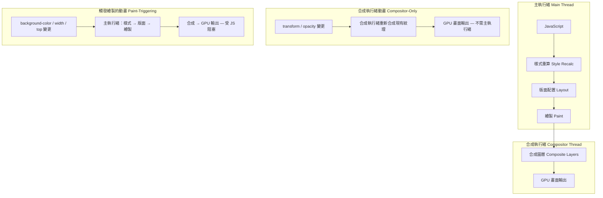

# [FEE-710] GPU 加速動畫與 `will-change`

:::info
瀏覽器將每一影格的產生工作拆分到兩個執行緒。主執行緒負責 JavaScript 執行、樣式重新計算、版面配置與繪製；合成執行緒則將已經繪製完成的圖層組合成螢幕顯示的像素。只改變 `transform` 或 `opacity` 的動畫可以完全在合成執行緒上執行，不受主執行緒當下在做什麼影響。`will-change` 讓頁面能在動畫開始前，先將元素提升至獨立的合成圖層，以 GPU 紋理記憶體換取消除提升瞬間出現的「閃爍」。應該（SHOULD）對任何需要達到 60fps 的動畫使用 `transform` 與 `opacity`；不應該（MUST NOT）將 `will-change` 當作靜態規則套用到清單或格狀佈局中的每一個項目上。
:::

## 背景

主執行緒負責 JavaScript 執行、樣式重新計算、版面配置與繪製，這四個階段是產生一個影格中最耗費資源的部分。合成執行緒負責將各個獨立繪製的圖層組合成最終的像素輸出，並交付至顯示硬體。只改變 `transform` 或 `opacity` 的動畫會完全在合成執行緒上執行：瀏覽器透過讀取當前的 transform 矩陣或 opacity 值來重新合成既有的圖層紋理，不需要回頭執行樣式重新計算、版面配置或繪製，因此忙碌的主執行緒不會阻塞它們。在大多數引擎中，改變 `width`、`height`、`top`、`left` 或 `background-color` 的動畫則會在主執行緒上執行，與 JavaScript、樣式重新計算及其他長任務競爭同一份影格預算。

`transform` 與 `opacity` 仍是唯一在所有主流引擎上都能可靠、一致地獲得合成器支援的屬性組合。目前的 Chromium 也已將 `filter`、`clip-path` 與 `background-color` 納入合成範圍，但這項支援僅限於 Chromium，在 Safari 與 Firefox 上尚未一致。透過 CSS 自訂屬性（custom property）驅動上述任何屬性都會抵銷這項優勢：改變自訂屬性一定會觸發參照它的元素進行繪製，即使該自訂屬性對應的是 `opacity` 這類屬性也一樣。

`will-change` 是一個 CSS 屬性，用來告知瀏覽器在動畫或過渡開始之前預先準備，將元素提升至獨立的合成圖層。這種預先提升可避免元素在動畫進行中途才被提升時所產生的視覺「閃爍」：在合成需求改變的瞬間，瀏覽器將像素資料從一個圖層移至另一個圖層，可能出現短暫但可察覺的視覺異常。`will-change: transform` 告知瀏覽器該元素的 transform 將會改變；`will-change: opacity` 則對應 opacity 屬性。這兩個值在跨瀏覽器的合成圖層行為上最為可靠。其他值如 `will-change: scroll-position` 或 `will-change: contents` 在不同渲染引擎間的行為較不一致，在正式環境仰賴它們之前應進行充分測試。

這裡的取捨很直接：每個被提升的圖層都需要為其紋理分配 GPU 記憶體。計算公式是寬度 × 高度 × DPR² × 4 bytes，其中寬度與高度是元素的 CSS 像素尺寸，DPR 是裝置像素比。一個 400×400 CSS 像素的卡片，在裝置像素比為 2 的螢幕上會轉譯成 800×800 像素的紋理：400 × 400 × 2² × 4 bytes = 2,560,000 bytes，約 2.56 MB。若同時提升大量元素，例如對清單中每一張卡片都套用 `will-change: transform`，這筆成本就會乘上元素數量。在行動裝置上，GPU 記憶體較為稀缺，且由所有已開啟的分頁共享，這可能迫使瀏覽器驅逐其他紋理，表現為渲染異常，極少數情況下甚至導致當機。應動態套用 `will-change`，並在動畫結束後移除：靜態提升會讓紋理記憶體隨元素總數增長，而不是隨實際正在播放動畫的元素數量增長。

## 視覺呈現



## 範例

```css
.card {
  transition: transform 200ms ease-out;
}
```

```js
// 在滑鼠懸停時動態套用，並在實際執行的過渡結束後移除。
// 即使 transitionend 未觸發（例如懸停在過渡開始前就被中斷），
// 備援的 timeout 仍會清除這個提示。
const cards = document.querySelectorAll('.card');

cards.forEach((card) => {
  card.addEventListener('mouseenter', () => {
    card.style.willChange = 'transform';
  });

  card.addEventListener('mouseleave', () => {
    const clearHint = () => {
      card.style.willChange = 'auto';
    };
    const fallback = setTimeout(clearHint, 300); // 比過渡時間長

    card.addEventListener(
      'transitionend',
      () => {
        clearTimeout(fallback);
        clearHint();
      },
      { once: true }
    );
  });
});
```

## 最佳實踐

**應該（SHOULD）針對預期以 60fps 或更高速率運行的 CSS 動畫，使用 `transform` 與 `opacity` 製作動畫。**
在動畫影格之間改變的其他所有 CSS 屬性，都需要瀏覽器在每個影格執行樣式重新計算、版面配置或繪製。
在 60fps 的速率下，每個影格必須在 16.7ms 內完成；在任何具有一定規模 DOM 結構的頁面上，
每個影格都執行版面配置與繪製會消耗掉大部分預算。
`transform` 與 `opacity` 可完全繞過這兩個階段，保留完整的合成預算。
目前的 Chromium 已將同樣的純合成路徑延伸到 `filter`、`clip-path` 與 `background-color`，
但 `transform` 與 `opacity` 仍是唯一在所有主流引擎都可靠支援的組合，
這也是它們被列為 SHOULD 預設選擇的原因。
當設計需要對觸發版面配置的屬性製作動畫，例如展開卡片的高度時，
可考慮改用 `transform: scaleY()` 或 `transform: translateY()`，
在不涉及版面配置引擎的情況下達到視覺上等效的效果。

**禁止（MUST NOT）對重複元素（如清單項目、卡片或格狀格子）靜態套用 `will-change`。**
禁止在清單或格狀子元素上使用靜態 `will-change`，
因為這會為每個 DOM 元素建立一個合成圖層，
使 GPU 紋理記憶體的消耗量與 DOM 中的元素數量成比例增長，
無論這些元素是否正在播放動畫。
在 GPU 記憶體有限的行動裝置上，
這會耗盡可用的紋理預算，導致瀏覽器驅逐其他紋理，
產生渲染異常或瀏覽器不穩定。
正確的做法是動態套用：透過 JavaScript 在 `mouseenter` 事件或觸發過渡之前，
僅對即將播放動畫的特定元素加上 `will-change`，
並在動畫結束後透過 `transitionend` 事件監聽器設定 `will-change: auto` 將其移除。
此方式可使被提升的圖層數量與正在播放動畫的元素數量成比例，
而非與清單或格狀佈局中的元素總數成比例。

**應該（SHOULD）在上線任何使用 `will-change` 的動畫前，
以 Chrome DevTools Layers 面板分析合成圖層的使用狀況。**
該面板顯示每個圖層的記憶體消耗，並標示過多或非預期的圖層建立，
而這些問題在程式碼審查中完全無法察覺。
若某次 CSS 規則變更讓原本零提升的情況變成有 5 個元素被提升，
這在 Layers 面板的記憶體摘要與圖層清單中會立即可見；
但在 CSS 檔案的 diff 審查中完全看不出來。
未在 DevTools 中驗證圖層數量就直接上線 `will-change` 的團隊，
往往要到使用者回報中階或舊款行動裝置上出現渲染異常後，才發現 GPU 記憶體回歸；
這些裝置上造成可見劣化的 GPU 記憶體門檻，遠低於開發者自己工作機器的門檻。

## 設計思維

### 合成執行緒模型

瀏覽器在單一影格的渲染管線中，主執行緒依序執行以下步驟：
JavaScript 執行、樣式重新計算、版面配置、繪製，最後進行合成。
合成是將各個獨立繪製的圖層點陣圖組合成最終畫面的步驟，
也是唯一可以完全交由合成執行緒處理的階段。
當動畫僅改變 `transform` 或 `opacity` 時，合成執行緒可以透過讀取
當前的 transform 矩陣或 opacity 值，並重新合成現有圖層紋理來產生新影格，
而無需重新執行 JavaScript、重新計算樣式、執行版面配置或重新繪製像素。
合成執行緒動畫即使在主執行緒忙碌時，例如正在執行一個解析大型 JSON 回應、
耗時 50ms 的任務，仍能持續以 60fps 產生影格。

觸發版面配置的屬性，例如 `width`、`height`、`margin`、`top` 與 `left`，
會迫使整個管線從版面配置階段起，在動畫產生的每一個影格重新執行。
觸發繪製的屬性，例如 `background-color`、`border-radius`、`box-shadow` 與 `color`，
則會強制從繪製階段起，在每個影格重新執行。
這兩類屬性都在主執行緒上執行，與 JavaScript、事件處理器和計時器回呼
競爭相同的 16.7ms 時間預算。
選擇 `transform: translateX()` 而非 `left`，或選擇 `transform: scale()` 而非 `width`，
能讓動畫的每影格成本完全不含這兩個階段。

### 堆疊上下文與圖層提升

多個 CSS 屬性會建立堆疊上下文（stacking context）：具有非 none 值的 `transform`、
opacity 小於 1、`will-change`、`filter`、`isolation: isolate`，
以及 `position: fixed` 等。
堆疊上下文與合成圖層是兩個在效能討論和文件中常被混淆的不同概念。
堆疊上下文改變繪製階段中重疊元素的渲染順序，
但不一定分配 GPU 紋理或建立獨立的合成圖層。
合成圖層是明確分配 GPU 紋理的結構，使合成執行緒得以在不涉及主執行緒的情況下
為元素產生動畫影格。
`will-change` 是請求合成圖層最直接且有意圖的方式；
其他屬性可能因渲染引擎的內部啟發式策略而附帶觸發圖層提升，
但只有 `will-change` 使提升行為明確、可預測，
且在不同瀏覽器版本之間保持一致。

這個實際區別，在診斷非預期的圖層擴散時尤其重要。
當發現頁面已將 80 個元素提升至合成圖層，遠超過實際正在播放動畫的一小組元素，
追根究柢通常會發現是一連串因不相關原因套用在祖先元素上的堆疊上下文屬性所致。
常見的元兇是遺留的 `transform: translateZ(0)` hack：多年前為了繞過某個渲染錯誤而加入，
如今這個錯誤在任何現代瀏覽器中都已不存在，但這行程式碼依然在建立堆疊上下文，
早已背離了它原本的目的。
為了 `z-index` 控制而加上的 `position: relative`，以及裝飾用的 `filter`，
也會造成同樣的效果。
這些屬性各自都會隱性建立堆疊上下文，而在某些渲染引擎版本中，
這個堆疊上下文會導致圖層提升。
在任何重大 CSS 重構後稽核 Layers 面板，並移除舊有解法遺留下來、已經過時的
`translateZ(0)` 與 `will-change` 規則，能防止圖層數量在多個功能分支中悄悄累積。
程式碼審查時有一個實用的判斷法則：任何新出現在靜態 CSS 規則中的 `will-change`
（也就是不是限定在 `:hover` 狀態、也不是在動畫開始前才由 JavaScript 套用的那種），
都值得作為訊號，去確認作者是否考慮過記憶體成本。

圖層提升的記憶體成本，與元素的渲染尺寸及裝置像素比成正比。
在高解析度螢幕上，一張佔滿版面寬度的主視覺圖片若被提升至獨立圖層，
本身就可能消耗數十 MB 的 GPU 記憶體。
建置動畫密集型介面（例如旋轉木馬或視差捲動效果）的團隊，
應在設計階段、介面上線之前，就先評估被提升圖層的總記憶體用量。
行動裝置的 GPU 與紋理記憶體預算遠比桌機小，且由所有已開啟的分頁共享，
因此提升數十個大型元素的頁面可能耗盡這些預算，觸發紋理驅逐，
並拖累使用者開啟的其他分頁的渲染表現。

### 偵測圖層提升

Chrome DevTools 提供兩個與合成圖層分析直接相關的面板。
Layers 面板（透過 DevTools 選單中的「更多工具」開啟）
以 3D 視圖呈現當前頁面的所有合成圖層，
顯示每個圖層的尺寸、記憶體消耗以及被提升的原因。
檢視提升原因可以區分有意為之的 `will-change` 提升，
與由 `position: fixed`、重疊的已轉換元素或 filter 效果所附帶觸發的非預期提升。
這幾種情況各自需要不同的修正策略。
Performance 面板的火焰圖（flame chart）將合成執行緒影格與主執行緒影格分開呈現，
使工程師得以驗證特定動畫是否真的執行在合成執行緒上，
而非在每個影格強迫主執行緒繪製。

標準的驗證流程是在動畫以設計速率播放時錄製 Performance 面板的追蹤資料，
然後檢查合成執行緒影格中是否出現繪製記錄。
若有，代表該動畫在每個影格都觸發了繪製，並未以預期方式執行 GPU 加速，
無論 CSS 表面上如何描述。
團隊應在上線任何預期以 60fps 或更高速率運行的動畫前執行此驗證，
因為渲染路徑未必與 CSS 程式碼所隱含的相同。
例如，SVG 元素上的 `transform` 動畫在某些瀏覽器版本中可能退回軟體光柵化，
儘管使用了相同的 CSS 語法，其在合成層的行為卻與 HTML 元素上的動畫截然不同。

### 與 CSS Containment 的交互作用

`contain: paint` 建立新的堆疊上下文與新的區塊格式化上下文，
防止子元素渲染超出元素邊界。
這個 containment 邊界可能附帶使瀏覽器將元素提升至合成圖層，
作為繪製 containment 保證的副作用，與 `will-change` 的明確圖層提升效果重疊。
當兩個屬性同時套用於同一元素時，瀏覽器可能建立巢狀圖層，
使總紋理記憶體超過任一屬性單獨使用時的消耗量。
將 `will-change` 與已使用 `contain: paint` 或 `contain: layout`
的版面重型元件整合的工程師，
應在 DevTools Layers 面板中驗證總圖層數，
而非假設兩者的效果以可預測或累加的方式組合。
CSS Containment 在 FEE-209 中有深入介紹，
從版面隔離的方向而非合成方向探討類似的效能議題。

## 常見錯誤

- 將 `will-change: transform` 當作全域規則套用到所有互動元素上，理由是「以防萬一」。這會在頁面載入時，就把每個符合條件的元素都提升至合成圖層，無論該元素在使用者瀏覽期間是否真的播放過動畫。
- 對只會偶爾播放動畫的元素（例如每次頁面訪問僅出現一次的 Modal）使用 `will-change`，使兩次動畫之間持續維護合成圖層的記憶體開銷，超過避免中途提升閃爍所帶來的效益。
- 使用 `left` 和 `top` 製作位移動畫，而非使用 `transform: translate()`，導致每個影格都觸發版面配置，完全在主執行緒上執行，與 JavaScript 競爭影格預算。
- 誤以為所有 CSS 動畫都會自動獲得 GPU 加速。`transform` 與 `opacity` 在所有主流瀏覽器中都有可靠的合成執行緒處理；目前的 Chromium 也已將 `filter`、`clip-path` 與 `background-color` 納入合成範圍，但這三者的支援在不同引擎間尚未一致，因此只有 `transform` 與 `opacity` 可以直接當作安全預設值使用，其餘屬性仍須透過 DevTools Layers 面板確認。
- 未在上線前使用 DevTools Layers 面板驗證圖層提升情況，導致 GPU 記憶體回歸只在 GPU 記憶體受限的裝置上才能被發現。
- 在 `@keyframes` 規則內或動畫本身的過渡 CSS 中設定 `will-change`。該屬性必須在動畫開始前設定才有效；若在動畫播放期間才套用，就為時已晚，無法達到預先提升的效果。

## 延伸閱讀

- [渲染與效能總覽](/zh-tw/Rendering%20and%20Performance/700)
- [CSS 包含性與 `contain`](/zh-tw/CSS%20and%20Layout%20Systems/209)
- [`requestAnimationFrame` 與動畫計時](/zh-tw/Browser%20APIs%20and%20Web%20Platform/412)
- [關鍵渲染路徑與繪製計時](/zh-tw/Rendering%20and%20Performance/712)

## 參考資料

- MDN Contributors，「will-change」，MDN Web Docs。https://developer.mozilla.org/en-US/docs/Web/CSS/will-change
- Google，「Rendering Performance」，web.dev。https://web.dev/articles/rendering-performance
- Google，「Stick to Compositor-Only Properties and Manage Layer Count」，web.dev。https://web.dev/articles/stick-to-compositor-only-properties-and-manage-layer-count
- Chrome for Developers，「Updates in Hardware-Accelerated Animation Capabilities」，Chrome Developers Blog（2021）。https://developer.chrome.com/blog/hardware-accelerated-animations
- Chrome for Developers，「Avoid non-composited animations」，Lighthouse documentation。https://developer.chrome.com/docs/lighthouse/performance/non-composited-animations
