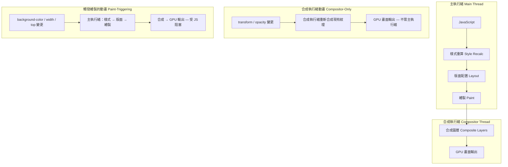

# GPU 加速動畫與 `will-change`

瀏覽器的渲染管線分為兩個執行環境：主執行緒與合成執行緒。
主執行緒負責 JavaScript 執行、樣式重新計算、版面配置（layout）與繪製（paint）——
這四個階段是產生單一影格中最耗時的工作。
合成執行緒負責將各個獨立繪製的圖層組合成最終的像素輸出，並交付至顯示硬體。
影響合成執行緒可獨立處理之屬性的動畫——具體而言是 `transform` 與 `opacity`——
可完全在合成執行緒上執行，不受主執行緒 JavaScript 阻塞。
影響需要版面配置或繪製之屬性的動畫——如 `width`、`height`、`top`、`left`、
`background-color`——必須在主執行緒上執行，當主執行緒忙於處理 JavaScript、
樣式重新計算或長任務時，動畫便容易產生卡頓（jank）。
理解這個分工是所有 GPU 動畫決策的前提，因為動畫所在的執行緒決定了
當主執行緒負載時它是否會掉幀。

`will-change` 是一個 CSS 屬性，用來告知瀏覽器在動畫或過渡開始之前預先準備，
將元素提升至獨立的合成圖層。
這種預先提升可避免元素在動畫進行中途才被提升時所產生的視覺「閃爍」——
在合成需求改變的瞬間，瀏覽器將像素資料從一個圖層移至另一個圖層，
可能出現短暫但可察覺的視覺異常。
`will-change: transform` 告知瀏覽器該元素的 transform 將會改變；
`will-change: opacity` 則對應 opacity 屬性。
這兩個值在跨瀏覽器的合成圖層行為上最為可靠；
其他值如 `will-change: scroll-position` 或 `will-change: contents`
在不同渲染引擎間的行為較不一致，
在正式環境仰賴它們之前應進行充分測試。

此屬性存在直接的取捨關係：每個被提升的圖層都需要為其紋理（texture）分配 GPU 記憶體。
一個 400×400 CSS 像素的卡片元素在裝置像素比為 2 的螢幕上，
會分配一個 800×800 像素的 RGBA 紋理，僅此一個元素便佔用約 2.5 MB 的 GPU 記憶體。
若同時提升大量元素——例如對清單中每一張卡片都套用 `will-change: transform`——
可能耗盡行動裝置的 GPU 記憶體，導致瀏覽器驅逐其他紋理、產生渲染異常，
極端情況下甚至造成瀏覽器崩潰。
值得注意的是，GPU 記憶體的耗盡不會在開發者自己的高端工作機器上重現，
這使得過度提升的問題往往只在特定使用者裝置上才能被觀察到，
是一類在程式碼審查階段難以捕捉的隱性效能債務。
過度提升所帶來的效能損耗，可能遠超過 `will-change` 原本想要防止的卡頓，
因此保守且動態地使用此屬性是必要的實踐，而非可選的最佳化建議。
行動裝置上的 GPU 記憶體是有限的，且由所有已開啟的瀏覽器分頁共享；
單一頁面若提升了數十個大型元素，可能降低使用者同時瀏覽的其他頁面的渲染品質。

## 設計思維

### 合成執行緒模型

瀏覽器在單一影格的渲染管線中，主執行緒依序執行以下步驟：
JavaScript 執行、樣式重新計算、版面配置、繪製，最後進行合成。
合成——將各個獨立繪製的圖層點陣圖組合成最終畫面的步驟——
是唯一可以完全交由合成執行緒處理的階段。
當動畫僅改變 `transform` 或 `opacity` 時，合成執行緒可以透過讀取
當前的 transform 矩陣或 opacity 值，並重新合成現有圖層紋理來產生新影格，
而無需重新執行 JavaScript、重新計算樣式、執行版面配置或重新繪製像素。
這意味著即使主執行緒正在執行一個耗時 50ms 的 JavaScript 任務——
無論是解析操作、複雜的狀態更新，或是第三方分析程式庫的批量刷新——
合成執行緒的動畫仍能持續以 60fps 不間斷地產生影格，
向使用者呈現流暢的視覺回饋，完全不受主執行緒負載的影響。

觸發版面配置的屬性——`width`、`height`、`margin`、`top`、`left`、`padding`——
會迫使整個管線從版面配置階段起重新執行，對每個動畫影格都如此。
觸發繪製的屬性——`background-color`、`border-radius`、`box-shadow`、`color`——
則會強制從繪製階段起重新執行，同樣對每個影格都如此。
兩類屬性都在主執行緒上執行，與 JavaScript、事件處理器和計時器回呼
競爭相同的 16.7ms 時間預算。
選擇 `transform: translateX()` 而非 `left`，或選擇 `transform: scale()` 而非 `width`，
是確保動畫流暢最可靠的架構決策，
因為它消除了最容易導致影格超時、讓使用者感受到卡頓的管線階段。

### 堆疊上下文與圖層提升

多個 CSS 屬性會建立堆疊上下文（stacking context）：具有非 none 值的 `transform`、
opacity 小於 1、`will-change`、`filter`、`isolation: isolate`，
以及 `position: fixed` 等。
堆疊上下文與合成圖層是兩個在效能討論和文件中常被混淆的不同概念。
堆疊上下文改變繪製階段中重疊元素的渲染順序，
但不一定分配 GPU 紋理或建立獨立的合成圖層。
合成圖層是明確分配 GPU 紋理的結構，使合成執行緒得以在不涉及主執行緒的情況下
為元素產生動畫影格。
`will-change` 是請求合成圖層最直接且有意圖的方式；
其他屬性可能因渲染引擎的內部啟發式策略而附帶觸發圖層提升，
但只有 `will-change` 使提升行為明確、可預測，
且在不同瀏覽器版本之間保持一致。

圖層提升的記憶體成本與元素的渲染尺寸及裝置像素比成正比。
在高解析度螢幕上，一個佔滿版面寬度的主視覺圖片若被提升至獨立圖層，
本身就可能消耗數十 MB 的 GPU 記憶體。
建置動畫密集型介面——旋轉木馬、視差效果、手勢驅動的過渡——的團隊，
應在架構設計階段就將所有被提升圖層的總記憶體視為設計限制，
而非等到正式環境事件調查時才發現的問題。
行動平台上的瀏覽器，GPU 記憶體限制通常在跨所有分頁共享的 256MB 至 512MB 之間；
單一頁面若提升了數十個大型元素，可能消耗該預算的相當大比例，
並降低整體瀏覽器效能。

堆疊上下文與合成圖層之間的實際區別，在診斷非預期的圖層擴散時至關重要。
當頁面被提升至合成圖層的元素多達 80 個——遠超過一小組正在製作動畫的元素——
通常可以追溯至一連串因不相關原因套用的父元素屬性：
一個需要 `position: relative` 的 `z-index` 規則、一個微妙陰影效果的 `filter`，
或是多年前為解決一個在現代瀏覽器中早已不存在的渲染錯誤而加入的 `transform: translateZ(0)` hack。
每一個都會隱性建立堆疊上下文；在某些渲染引擎版本和設定中，堆疊上下文會導致圖層提升。
在任何重大 CSS 重構後稽核 Layers 面板，並移除以效能修補目的添加的過時 `transform: translateZ(0)` 和 `will-change`
應用——而非以效能優化為目的的那些——是防止圖層數量在多個功能分支中悄然累積的常規維護工作。
在程式碼審查中，對靜態 CSS 規則中的每個新增 `will-change`（非 `:hover` 狀態、
非動畫前由 JavaScript 動態套用）視為可能不了解記憶體成本的信號，
並主動發起討論評估是否動態套用更合適，是將這種知識傳遞給整個團隊的有效機制。

實際處理動畫效能問題的工作流程，應從 Chrome DevTools 效能面板的影格時間軸開始。
在錄製包含目標動畫的效能追蹤後，切換至「影格」視圖，逐一檢視超過 16.7ms 時間預算的影格。
每個超時影格的細節面板會顯示哪個管線階段超出了預算：
若是「樣式」或「版面配置」佔用大量時間，表示動畫觸發了版面配置屬性；
若是「繪製」佔用大量時間，表示動畫觸發了繪製屬性；
若影格時間在主執行緒分析中很短但視覺上仍有卡頓，
則合成執行緒本身可能是瓶頸——通常因為過多的圖層提升消耗了 GPU 記憶體，
導致合成執行緒在處理過多紋理時反而降速。
理解這三種超時模式，是讓動畫效能調試從試誤轉向有系統診斷的關鍵。
在真實裝置（而非桌機模擬器）上錄製效能追蹤，能確保測量結果反映目標使用者群體實際遭遇的硬體限制，
因為行動 GPU 的記憶體頻寬和紋理容量，與開發者機器之間的差距往往超過 10 倍。
Chrome DevTools 的 CPU 節流功能（4x 或 6x 降速）提供了一種不需要實體低端裝置即可模擬行動裝置主執行緒速度的方式，
對偵測只在效能受限情況下才出現的動畫掉幀特別有用。
但 CPU 節流並不模擬 GPU 記憶體限制，因此對圖層過度提升導致的 GPU 紋理記憶體耗盡問題，仍需在真實行動硬體上才能可靠重現。
建議的實踐是：在節流後的 DevTools 中進行日常動畫效能開發迭代，並在重大動畫功能正式發布前，在代表性的低端 Android 裝置上進行最終驗證。
將動畫效能驗證納入功能接受標準（acceptance criteria），而非僅依賴事後的效能審查，可確保動畫問題在進入生產環境前就被攔截，而不是在使用者回報掉幀後才開始調查。
以每影格預算為導向的動畫設計——在設計階段就確認所有動畫元素僅使用 `transform` 和 `opacity`——比在實作完成後試圖修補觸發版面配置的動畫，所需的返工成本低得多。
與設計師建立共識，使其了解哪些 CSS 屬性可以製作動畫而不影響效能，是從根本上解決此類問題的最有效方式——技術限制在設計決策階段就被考慮進去，而非留到工程實作後才發現衝突。

### 偵測圖層提升

Chrome DevTools 提供兩個與合成圖層分析直接相關的面板。
Layers 面板（透過 DevTools 選單中的「更多工具」開啟）
以 3D 視圖呈現當前頁面的所有合成圖層，
顯示每個圖層的尺寸、記憶體消耗以及被提升的原因。
檢視提升原因可以區分有意為之的 `will-change` 提升，
與由 `position: fixed`、重疊的已轉換元素或 filter 效果所附帶觸發的非預期提升——
每種情況有不同的矯正策略，
而不加區分地套用相同解法往往反而引入新的記憶體或渲染問題。
Performance 面板的火焰圖（flame chart）將合成執行緒影格與主執行緒影格分開呈現，
使工程師得以驗證特定動畫是否真的執行在合成執行緒上，
而非在每個影格強迫主執行緒繪製。

標準的驗證流程是在動畫以設計速率播放時錄製 Performance 面板的追蹤資料，
然後檢查合成執行緒影格中是否出現繪製（paint）記錄。
若有，代表該動畫在每個影格都觸發了繪製，並未以預期方式執行 GPU 加速，
無論 CSS 表面上如何描述。
這種狀況在部分舊版瀏覽器或特定元素類型上尤為常見：
渲染引擎可能在內部將動畫降級為軟體路徑，
而開發者在不使用工具驗證的情況下完全無法察覺。
團隊應在上線任何預期以 60fps 或更高速率運行的動畫前執行此驗證，
因為渲染路徑未必與 CSS 程式碼所隱含的相同。
例如，SVG 元素上的 `transform` 動畫在某些瀏覽器版本中可能退回軟體光柵化，
儘管使用了相同的 CSS 語法，其在合成層的行為卻與 HTML 元素上的動畫截然不同，
導致在開發環境流暢、但在生產環境特定裝置上出現不明原因卡頓的問題。

### 與 CSS Containment 的交互作用

`contain: paint` 建立新的堆疊上下文與新的區塊格式化上下文，
防止子元素渲染超出元素邊界。
這個 containment 邊界可能附帶使瀏覽器將元素提升至合成圖層，
作為繪製 containment 保證的副作用，與 `will-change` 的明確圖層提升效果重疊。
這兩種機制在底層使用不同的觸發條件，
合成的結果取決於具體的瀏覽器版本與渲染引擎實作，
而非由 CSS 規格精確定義，因此行為可能在版本更新後悄然改變。
當兩個屬性同時套用於同一元素時，瀏覽器可能建立巢狀圖層，
使總紋理記憶體超過任一屬性單獨使用時的消耗量。
將 `will-change` 與已使用 `contain: paint` 或 `contain: layout`
的版面重型元件整合的工程師，
應在 DevTools Layers 面板中驗證總圖層數，
而非假設兩者的效果以可預測或累加的方式組合。
在引入 CSS Containment 的元件中新增 `will-change` 之前，
應先在目標瀏覽器與裝置上量測記憶體變化，
確認組合效果符合預期，再提交至生產環境。
CSS Containment 在 FEE-209 中有深入介紹，
從版面隔離的方向而非合成方向探討類似的效能議題，
兩篇文章共同構成理解瀏覽器渲染最佳化的完整視角。

## 最佳實踐

**應該（SHOULD）對預期以 60fps 或更高速率運行的 CSS 動畫，
僅針對 `transform` 與 `opacity` 屬性製作動畫。**
在動畫影格之間改變的其他所有 CSS 屬性，
都需要瀏覽器在每個影格執行樣式重新計算、版面配置或繪製。
在 60fps 的速率下，每個影格必須在 16.7ms 內完成；
在任何具有非零散 DOM 結構的頁面上，
每個影格都執行版面配置與繪製都會消耗大部分預算。
`transform` 與 `opacity` 可完全繞過這兩個階段，
將完整的合成預算保留下來，
並允許動畫在獨立於主執行緒負載的合成執行緒上處理。
當設計需要對觸發版面配置的屬性製作動畫，
例如展開卡片的高度時，
可考慮改用 `transform: scaleY()` 或 `transform: translateY()`
達到視覺上等效的效果，同時不在每個影格觸及版面配置引擎。

**禁止（MUST NOT）對重複元素（如清單項目、卡片或格狀格子）靜態套用 `will-change`。**
禁止在清單或格狀子元素上使用靜態 `will-change`，
因為這會為每個 DOM 元素建立一個合成圖層，
使 GPU 紋理記憶體的消耗量與 DOM 中的元素數量成比例增長，
無論這些元素是否正在播放動畫。
在 GPU 記憶體有限的行動裝置上，
這會耗盡可用的紋理預算，導致瀏覽器驅逐其他紋理，
產生渲染異常或瀏覽器不穩定。
正確的做法是動態套用：透過 JavaScript 在 `mouseenter` 事件或觸發過渡之前，
僅對即將播放動畫的特定元素加上 `will-change`，
並在動畫結束後透過 `transitionend` 事件監聽器設定 `will-change: auto` 將其移除。
此方式可使被提升的圖層數量與正在播放動畫的元素數量成比例，
而非與清單或格狀佈局中的元素總數成比例。

**應該（SHOULD）在上線任何使用 `will-change` 的動畫前，
以 Chrome DevTools Layers 面板分析合成圖層的使用狀況。**
該面板顯示每個圖層的記憶體消耗，並標示過多或非預期的圖層建立，
而這些問題在程式碼審查中完全無法察覺。
一個 CSS 規則變更若將被提升的元素從 5 個增加到 500 個，
在 Layers 面板的記憶體摘要與圖層清單中立即可見；
在 CSS 檔案的 diff 審查中卻完全不可見。
建議將 Layers 面板的記憶體快照納入效能回歸測試的基準，
在 CI/CD 流程中設置圖層數量或記憶體消耗的警示門檻，
以便在問題進入生產環境前被自動捕捉。
未在 DevTools 中驗證圖層數量就直接上線 `will-change` 的團隊，
往往只有在使用者回報中階或舊款行動裝置上出現渲染異常後，
才發現 GPU 記憶體回歸——
而在這些裝置上，導致可見劣化的 GPU 記憶體門檻，
遠低於開發者自己工作機器的門檻，
這使得問題在開發環境中幾乎無法重現，只能在使用者端才能觀察到。

## 視覺呈現



## 範例

```js
// 正確的 will-change 使用方式：在滑鼠懸停時動態套用，過渡結束後移除
const cards = document.querySelectorAll('.card');
cards.forEach(card => {
  card.addEventListener('mouseenter', () => {
    card.style.willChange = 'transform';
  });

  card.addEventListener('mouseleave', () => {
    card.addEventListener('transitionend', () => {
      card.style.willChange = 'auto';
    }, { once: true });
  });
});
```

## 常見錯誤

- 將 `will-change: transform` 作為全域規則套用到所有互動元素「以防萬一」——這會在頁面載入時就將每個符合條件的元素提升至合成圖層，無論該元素在使用者瀏覽期間是否曾實際播放動畫。
- 對只會偶爾播放動畫的元素（例如每次頁面訪問僅出現一次的 Modal）使用 `will-change`，使兩次動畫之間持續維護合成圖層的記憶體開銷，超過避免中途提升閃爍所帶來的效益。
- 使用 `left` 和 `top` 製作位移動畫，而非使用 `transform: translate()`，導致每個影格都觸發版面配置，完全在主執行緒上執行，與 JavaScript 競爭影格預算。
- 誤以為所有 CSS 動畫都自動受到 GPU 加速——只有 `transform` 與 `opacity` 在所有主流瀏覽器中獲得合成執行緒處理的一致保證；`filter` 動畫在部分引擎中有部分加速，但並非在所有引擎中都一致。
- 未在上線前使用 DevTools Layers 面板驗證圖層提升情況，導致 GPU 記憶體回歸只在 GPU 記憶體受限的裝置上才能被發現。
- 在 `@keyframes` 規則內或動畫本身的過渡 CSS 中設定 `will-change`——該屬性必須在動畫開始前設定才有效；在動畫播放期間套用為時已晚，無法達到預先提升的效果。

## 相關 FEE

- FEE-700 — 渲染與效能總覽
- FEE-209 — CSS Containment 與 `contain`
- FEE-412 — `requestAnimationFrame` 與動畫計時
- FEE-712 — 關鍵渲染路徑與繪製計時

## 參考資料

- MDN: will-change — https://developer.mozilla.org/en-US/docs/Web/CSS/will-change
- web.dev: Rendering performance — https://web.dev/articles/rendering-performance
- web.dev: Stick to compositor-only properties — https://web.dev/articles/stick-to-compositor-only-properties-and-manage-layer-count

