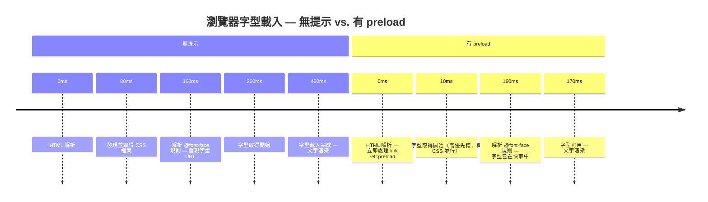

# [FEE-711] 資源提示：`prefetch`、`preload`、`preconnect`

:::info
資源提示（Resource Hints）是 HTML `<link>` 元素與 HTTP 標頭，用來告知瀏覽器將需要哪些資源、以及何時需要，讓瀏覽器能在 HTML 解析或 JavaScript 執行揭露這個需求之前就開始取得。資源提示只是把請求提前到時間軸上更早的位置；瀏覽器最終取得的仍是同一個資源，只是時間提前了，這正是關鍵渲染路徑上的時效性資源，能透過正確的提示明顯改善最大內容繪製（LCP）分數的原因。標題列出的三種提示，`preconnect`、`preload` 與 `prefetch`，只是本文涵蓋的五種提示中的三種；`dns-prefetch` 與 `modulepreload` 是機制相近的近親，下文會以同等篇幅說明。用得好，一個 `preload` 能從 LCP 路徑上省下一整趟網路往返；用得不慎，同一個提示會與它原本想幫助的資源互相競爭。
:::

## 背景

瀏覽器本身就會執行預載掃描器（preload scanner），在主 HTML 解析器之前先行搜尋 `<script src>`、`<link href>` 與 `` 屬性，並搭配一套依請求阻塞渲染的可能性來排序優先權的機制。資源提示之所以存在，是因為這套內建的推測機制有其盲點：CSS 檔案內引用的字型、以 `background-image` 而非 `` 設定的圖片，或由 JavaScript 動態注入的腳本，在瀏覽器執行到指名它們的程式碼之前，掃描器都無法察覺。

這些提示依作用範圍分成兩大類。`preload` 與 `prefetch` 鎖定特定資源 URL：`preload` 立即以高優先權為當前頁面取得該資源，`prefetch` 則以閒置優先權為使用者接下來可能造訪的頁面取得資源。`preconnect` 與 `dns-prefetch` 鎖定的是來源（origin），而非 URL：`preconnect` 預先執行完整的 DNS、TCP、TLS 交握，`dns-prefetch` 只執行其中的 DNS 步驟。下文設計思維會介紹的 `modulepreload`，是專為 ES 模組打造的 `preload` 變體。把這兩類搞混，在機制要求來源時卻指定了 URL，或反過來，是提示位置錯誤最常見的原因。

選錯提示是常見的情況，而且頁面通常還是能正常運作，不容易察覺。沒有對應到實際請求的 `preload`，頁面仍會照常渲染，只是白白浪費頻寬並跳出主控台警告。用在當前頁面資源上的 `prefetch`，資源終究會載入，只是比完全不加提示時更晚抵達。判斷一個提示是否真的有幫助，唯一可靠的方式是實際測量：在加入每個提示前後，各錄一次 Chrome DevTools 或 WebPageTest 的網路瀑布圖，一次只調整一個變因。

## 視覺對比



## 範例

```html
<!-- 對關鍵第三方來源進行 preconnect（分開寫成兩個標籤： -->
<!-- 把 preconnect 與 dns-prefetch 合併在同一個 <link> 會讓 preconnect 在 Safari 中失效） -->
<link rel="preconnect" href="https://fonts.googleapis.com">
<link rel="preconnect" href="https://fonts.gstatic.com" crossorigin>

<!-- 預載 LCP 主視覺圖片；fetchpriority=high 讓它的優先權 -->
<!-- 高於單獨使用 preload 時所能取得的優先權 -->
<link rel="preload" as="image" href="/images/hero.webp" fetchpriority="high">

<!-- 預載主要網頁字型 -->
<link rel="preload" as="font" type="font/woff2" href="/fonts/inter.woff2" crossorigin>

<!-- 預取下一頁的打包檔 -->
<link rel="prefetch" href="/about/bundle.js">
```

當 LCP 元素是已經存在於 DOM 中的一般 ``，而非 CSS 背景時，直接在該標籤上加上 `fetchpriority="high"` 通常就能省去 `preload`，因為預載掃描器本來就會提早發現這個 URL：

```html

```

## 最佳實踐

**必須（MUST）在所有 `<link rel="preload">` 元素上包含 `as` 屬性，並對字型預載包含 `crossorigin`。** 若缺少 `as` 屬性，瀏覽器會以預設優先權取得預載資源，且不帶正確的標頭；等到實際使用方（CSS、JS）以正確的上下文請求同一資源時，還要再取得一次。這次重複取得會浪費頻寬，甚至可能讓資源比完全沒有提示時更晚抵達。對字型而言，即使是自架字型，`crossorigin` 也不可或缺，因為 `@font-face` 規則發出的是 CORS 模式請求，瀏覽器無法將其與非 CORS 的預載配對，導致完整重新取得一次。自架 woff2 字型的正確組合永遠是 `as="font"`、`type="font/woff2"` 與 `crossorigin` 三者同時具備；缺少其中任一項都會破壞配對。

**應該（SHOULD）只對頁面中會提早開始載入關鍵首屏資源的來源使用 `<link rel="preconnect">`。** 每個 `preconnect` 都會開啟一個消耗伺服器與客戶端資源的 TCP/TLS 連線，包括檔案描述符、TLS 工作階段狀態，以及伺服器端的 keep-alive 槽位。根據 web.dev 的說法，瀏覽器會關閉閒置 10 秒的連線，因此若在頁面載入時就對一個工作階段後期才會實際聯繫的來源觸發 `preconnect`，不但拿不到任何好處，還等於白白支付了兩次握手成本。應將 `preconnect` 限制在兩、三個高優先來源；對優先權較低或條件式載入的第三方來源改用 `dns-prefetch`，讓 DNS 提前解析，同時不必承擔完整連線的成本。若要為同一來源同時配置 `preconnect` 與 `dns-prefetch`，須寫成兩個獨立的 `<link>` 標籤：把兩者合併在同一個標籤上，會觸發 Safari 的一個錯誤，導致 `preconnect` 失效。團隊應定期透過 Network 面板的時序分解稽核自己的 `preconnect` 提示，確認每個被提示的連線確實有被重複使用。

**應該（SHOULD）將 `<link rel="prefetch">` 用於下一步最可能的導航所需的資源，而不是當前頁面所需的資源。** `prefetch` 以閒置優先權執行，可能在當前頁面需要資源之前還沒完成。把 `prefetch` 用在當前頁面的資源上，代表這些資源抵達的時間會晚於 `preload` 原本能提供的時間，相較於完全不加提示反而多了淨延遲。適當的用法是推測性的：當分析資料或應用程式邏輯顯示使用者很可能接下來會導向特定路由時，在背景預取該路由的打包檔或資料，能讓下一頁從快取載入，而不必透過網路。舉例來說，一個商品格狀列表可以只針對游標目前懸停的卡片觸發 `prefetch`，而非對頁面上每個商品都觸發。Next.js、Nuxt 等框架會在連結進入視窗時自動實作路由預取。若是完整文件層級的導航，在瀏覽器支援的情況下應優先使用 Speculation Rules API（見下方設計思維）；MDN 目前已建議以它取代 `<link rel="prefetch">` 承擔這項工作，讓 `prefetch` 保留給子資源使用，並作為跨瀏覽器的備援方案。

**應該（SHOULD）為頁面的最大內容繪製（LCP）資源，在 `preload` 或直接在 `` 標籤上搭配 `fetchpriority="high"`。** `preload` 與瀏覽器預設的優先權啟發式，都只是對資源急迫程度的最佳猜測；`fetchpriority="high"` 則明確覆寫這個猜測。Google 自家的 Flights 頁面測試（見下方 Fetch Priority API）顯示，光是這個屬性就能帶來明顯的 LCP 改善，且沒有其他變動。支援度已經廣泛到可以放心無條件使用：Chrome 102+、Safari 17.2+ 與 Firefox 132+ 均已實作，較舊的瀏覽器則會直接忽略這個屬性。對於 CSS `background-image` 的 LCP 元素，仍然需要 `preload` 來提早發現資源，這時應在該 `preload` 標籤上加上 `fetchpriority="high"`。對於已經是一般 `` 存在於 DOM 中的 LCP 圖片，單靠在該元素本身加上 `fetchpriority="high"` 通常就已足夠。

## 設計思維

### preload 與 prefetch 的差異

`preload` 的作用範圍是當前頁面，以高優先權執行，適用於當前導航需要、但瀏覽器要到很晚才會發現的資源：深藏在 CSS 層疊中的字型檔、放在 CSS `background-image` 屬性而非 `` 元素中的圖片，或是以動態方式注入的 JavaScript 模組進入點。瀏覽器一遇到這個提示，就會立即開始取得該資源，時間點早於文件中原本會發現該資源的位置。這讓資源在使用方（CSS 解析器、腳本評估器或版面引擎）發出請求前就已經存在於瀏覽器快取中，從而消除關鍵路徑上的完整網路往返。

若資源在當前頁面載入期間未被使用，瀏覽器會在主控台發出警告，同時白白浪費了已經消耗的頻寬。這個警告是重要的訊號：在 DevTools Network 面板中持續觸發未使用預載警告的 `preload`，代表提示的 URL 已經不再對應使用方實際請求的 URL，通常是因為建置工具重新命名或雜湊了檔案。團隊應將未使用預載警告視同 lint 錯誤，在上線前予以解決。

在含內容雜湊的建置產物中管理預載提示，需要仰賴自動化，而非手動維護 URL。建置工具外掛可以在產生正式環境 HTML 輸出時一併產生 `<link rel="preload">` 標籤：讀取打包工具產出的雜湊檔名清單，並注入對應的預載提示，讓提示在每次建置後都與實際資源 URL 保持同步。若把預載提示寫成範本中的靜態字串，同時建置工具又會對檔名做雜湊，這是一種潛伏的破損模式：每次部署只要改變了被預載檔案的內容雜湊，預載就會悄悄變成未使用預載警告，效能收益也隨之消失，直到有人注意到警告並著手調查。Vite 的 `transformIndexHtml` 外掛鉤點與 Webpack 的 `HtmlWebpackPlugin` 注入點，都能取得產生這些提示所需的最終雜湊檔名。

`prefetch` 的作用範圍是未來的導航，以閒置優先權執行，指示瀏覽器在閒置期間以背景頻寬取得使用者下一頁可能需要的資源。這兩種提示都不會在請求開始後取消：`prefetch` 取得的結果會留在 HTTP 快取中，直到未來的導航取用它或被淘汰為止；`preload` 則永遠會把取得動作完整跑完，這正是為什麼一個未被使用的 `preload` 是在浪費頻寬而不是節省頻寬，也是為什麼未使用預載警告會出現在一個其實已經下載完成的資源上。把 `prefetch` 用在當前頁面的資源上，是常見且後果嚴重的錯誤：由於閒置優先權的請求與活躍中的頁面資源競爭能力弱，`prefetch` 取得的資源可能比 `preload` 原本能提供的時間更晚抵達，結果是淨延遲而非淨收益。瀏覽器的資源排程器把閒置優先權請求當成不該妨礙前景載入的背景工作，這對於當前頁面實際需要的資源來說，正好是完全錯誤的處理方式。

### Fetch Priority API

Fetch Priority API 新增了 `fetchpriority` 屬性（`high`、`low`，或預設值 `auto`），可以覆寫瀏覽器針對特定請求的內建優先權啟發式。它適用於 `<link rel="preload">`、`` 與 `<script>`，支援度也相當廣泛：Chrome 102+、Safari 17.2+ 與 Firefox 132+ 均已實作。`preload` 與 `fetchpriority` 解決的是不同問題：`preload` 控制瀏覽器何時發現一項資源，`fetchpriority` 則控制瀏覽器在發現之後，如何相對於其他資源安排它的排程。兩者可以搭配使用。以 `background-image` 呈現的 LCP 元素為例，CSS 解析器本來就無法及早自行找到圖片 URL，因此仍需要 `preload` 來提早發現；在同一個 `preload` 標籤上再加上 `fetchpriority="high"`，能讓它排在比單獨使用 `preload` 更前面的位置。若 LCP 元素本來就是 DOM 中的一般 ``，瀏覽器的掃描器本來就會提早發現這個 URL，這時單靠在 `` 標籤加上 `fetchpriority="high"` 通常就足夠，完全不需要 `preload`。Google 自家的一項測試中，僅在主視覺圖片加上 `fetchpriority="high"`，就讓某個 Flights 頁面的 LCP 從 2.6 秒縮短到 1.9 秒。`fetchpriority="low"` 則是相反的情況：把它套用在折線以下的圖片或非關鍵腳本上，可以為真正阻塞渲染的資源騰出頻寬。Chrome DevTools 的 Network 面板中的 Priority 欄位，顯示瀏覽器實際指派給某個請求的優先權，是判斷一項資源是否需要手動覆寫的最快方法。

### Speculation Rules API

Speculation Rules API 讓頁面能以 JSON 格式宣告哪些未來的導航應該被瀏覽器預取或預先渲染，可以透過行內的 `<script type="speculationrules">` 元素，或是 HTTP 的 `Speculation-Rules` 標頭來宣告。每條規則都帶有一個決定觸發時機的積極程度（eagerness）等級：`conservative` 會等到使用者在連結上按下指標或觸控；`moderate` 會在使用者懸停約 200 毫秒後觸發（觸控裝置上則是按下時觸發）；`eager` 只要有一絲互動跡象就會觸發（桌面上是短暫懸停，行動裝置上則依視窗啟發式判斷）；`immediate` 則是規則一註冊完成就立即觸發。

```html
<script type="speculationrules">
{
  "prefetch": [{
    "where": { "href_matches": "/products/*" },
    "eagerness": "moderate"
  }]
}
</script>
```

MDN 目前建議在預取完整文件時優先使用 speculation rules，取代 `<link rel="prefetch">`。Speculation rules 能跨站導航運作，這是純 `prefetch` 做不到的；它也會忽略原本會阻擋 `prefetch` 的 `Cache-Control` 標頭；並且會自動尊重使用者的省流量（Data Saver）設定。截至本文撰寫時，這個 API 仍僅限 Chromium 系瀏覽器，尚未列入 Baseline：Safari 與 Firefox 都還沒有實作。正式環境的網站仍然需要 `<link rel="prefetch">` 作為跨瀏覽器的備援方案來處理導航預取，並且用來預取子資源，這是 speculation rules 完全沒有涵蓋的部分。

### preconnect 與 dns-prefetch 的差異

`preconnect` 會對遠端來源啟動完整的連線程序：DNS 解析、TCP 交握，以及 TLS 協商。這些步驟各自至少要花上一趟網路往返；根據 web.dev 的資料，光是 DNS 解析通常就要 20–120 毫秒，而在資源實際被請求之前提早建立連線，總計可以節省 100–500 毫秒的載入時間。對頁面中會提早開始載入關鍵資源的來源使用 `preconnect`，就能把這段時間省下來，因為資源請求發出時連線早已建立完成。這項效益在承載字型、CDN 分發腳本，或頁面載入時就會呼叫的 API 端點的第三方來源上最為明顯：這些來源的連線延遲，頁面作者原本沒有其他辦法可以消除。

`dns-prefetch` 只執行 DNS 解析這一步，把網域名稱解析成 IP 位址，不會發起 TCP 或 TLS 連線。它消耗的資源比 `preconnect` 少得多（不需要檔案描述符、TLS 狀態，也不需要伺服器端連線槽位），適合用在頁面工作階段期間可能用到、但並非立即關鍵的來源。實務上的原則是：對兩、三個會載入首屏資源的來源使用 `preconnect`，對其餘時機不那麼確定的第三方來源使用 `dns-prefetch`。廣泛套用 `preconnect` 會浪費那些開啟後卻從未使用的連線的握手成本；在連線建立成本特別高的行動網路上，這種浪費甚至可能超過提示本身帶來的好處。一個常見且正確的做法，是對同一個來源同時配置 `preconnect` 與 `dns-prefetch`：支援的瀏覽器會使用 `preconnect`，`dns-prefetch` 則在 `preconnect` 效果較差的環境中作為輕量備援。這麼做時務必把兩個提示寫成各自獨立的 `<link>` 標籤：根據 web.dev 的說明，把 `rel="preconnect dns-prefetch"` 合併在同一個標籤上，會觸發 Safari 的一個錯誤，導致 `preconnect` 失效。

### modulepreload

`<link rel="modulepreload">` 是專為 ES 模組設計的 `preload` 變體。與一般 `preload` 不同，`modulepreload` 不僅會取得模組腳本，還會解析它並加入模組映射（module map），使模組被 `import` 時能立即取用，不需要重新解析。對於使用 Vite 或類似模組打包工具建置的應用程式，在主要進入點使用 `modulepreload`，可以縮短第一個有意義路由的可互動時間，因為解析成本是在閒置時間支付，而不是落在使用者第一次互動的關鍵路徑上。Vite 在正式環境建置中會自動為進入點 chunk 產生 `modulepreload` 提示；理解這個機制有助於工程師排查提示缺失或作用範圍不正確的情況。

在瀏覽器完整支援這項規格的情況下，`modulepreload` 還會觸發模組靜態 `import` 的預載，這代表對進入點下的單一提示，可以連鎖觸發整個靜態依賴圖的並行取得與解析。這個行為與一般 `preload` 不同，後者只會取得指定的單一 URL。若以 `rel="preload" as="script"` 取代 `modulepreload`，檔案依然會被取得，但會跳過依賴圖的探索：瀏覽器完全不會知道這個模組有哪些靜態 import，這些依賴要等到進入點模組被解析並執行後才會開始載入，回到關鍵路徑上，而不是在閒置時間並行進行。

### 透過 HTTP 標頭傳遞資源提示

資源提示也可以透過 HTTP `Link` 回應標頭傳遞，而不一定要用 HTML `<link>` 元素。像 `Link: </fonts/inter.woff2>; rel=preload; as=font; crossorigin` 這樣的標頭形式，瀏覽器會在回應標頭一到達就處理，早於 HTML 本體的解析。這讓標頭形式的提示，對於需要在請求生命週期最開始就被啟動的資源而言，比文件內的提示更有效，因為標頭處理發生在任何一個 HTML 位元組被讀取之前。Cloudflare、Fastly 等 CDN 與邊緣平台，可以在網路層注入 `Link` 標頭而不需要修改來源伺服器產生的 HTML，這讓無法直接掌控 HTML 建置管線的團隊，也能採用這種做法。

HTTP 103 Early Hints 回應把這個做法又往前推進了一步。伺服器不必等到產生完最終回應才附上 `Link` 標頭，而是在仍在組裝真正的回應時（通常是資料庫查詢或上游請求還在進行中），先送出一個帶有相同 `Link: rel=preload` 或 `rel=preconnect` 提示的 103 資訊性回應。瀏覽器會立即開始處理這些提示，因此即使頁面產生速度較慢，資源提示仍然能提早送達。Cloudflare 與 Fastly 都支援 Early Hints，Chrome 自 103 版起也已支援，不過 Safari 目前只會處理 103 回應中的 `preconnect` 提示，不處理 `preload`。Early Hints 需要來源伺服器或 CDN 端的支援才能送出這個資訊性回應，而且它攜帶的提示應該要是可以安全推測性送出的內容（冪等、可快取），因為最終回應仍有可能與這些提示不同。

這種做法的代價，是標頭形式的提示對開發者來說比文件內的提示更不容易被看見，因為它們不會出現在瀏覽器收到的 HTML 原始碼中。採用標頭形式預載的團隊，應該把 CDN 或伺服器層加上的標頭記錄下來，並納入效能稽核範圍，避免提示所指向的資源在重新命名或移除之後仍然殘留。來自標頭提示的未使用預載警告，在診斷上與來自 HTML 提示的警告完全相同，但在沒有 CDN 設定存取權限的情況下更難追查來源。

### 過度提示的陷阱

每個被預載的資源，都與同時載入的其他資源競爭頻寬。同時預載主視覺字型、主視覺圖片、第三方分析腳本和三個 CSS 檔案，代表這些請求全部在頁面載入最擁擠的階段，共享同一份連線頻寬。如果最大內容繪製（LCP）元素是一張圖片，預載那些重要性低於它的資源，可能把它推到頻寬佇列的更後面，進而拖慢它。正確的做法是在個別加入每個提示的前後，使用 Chrome DevTools 或 WebPageTest 測量 LCP 與 FCP，只保留能對目標指標帶來可量測改善的提示。

Chrome DevTools 的網路瀑布圖，是評估提示效益最直接的工具。加入一個 `preload` 後重新錄製一次載入並開啟瀑布圖，可以立即看到資源取得時機的變化：被預載資源的進度條會往左移動，與原本屬於更早期並行請求的資源重疊。如果進度條沒有明顯移動，代表這個提示沒有帶來效益，應該移除。一個明明只有兩項資源在 LCP 路徑上、卻對六項資源都下了提示的頁面，會把最擁擠的早期頻寬窗口浪費在錯誤的四項資源上；DevTools 的 Priority 欄位會顯示，那兩項真正重要的資源正與那四項不重要的資源以相同優先權互相競爭，修正方式就是移除提示，直到只剩下真正屬於 LCP 關鍵路徑的資源為止。

瀏覽器的優先權啟發式相當精密，蘊含了大量關於哪些資源可能阻塞 LCP 的經驗知識。一個完全沒有加任何資源提示的頁面，仍然能從瀏覽器內建的推測機制中受益：預載掃描器會在主 HTML 解析器之前先行運作，在解析器抵達對應元素之前，就先發現 `<script src>`、`<link href>` 與 `` 屬性。資源提示只會針對某一項特定資源覆寫這個啟發式；啟發式本身仍持續在底層運作，繼續決定頁面上所有未被明確提示的資源的優先權。覆寫錯了，無論是提示錯資源還是提示太多，結果都會比完全不動啟發式更差，這也是為什麼每個提示都應該以量測驗證，而不是基於「越早越好」的假設就直接加上去。

## 常見錯誤

- **在 `<link rel="preload">` 上省略 `as` 屬性。** 瀏覽器無法判斷資源類型，只能以預設優先權取得，並且省略了正確的 `Accept` 標頭。等到真正的使用方以正確的上下文請求該資源時，還要再取得一次，形成雙重請求。

- **在 `<link rel="preload" as="font">` 上省略 `crossorigin`。** 即使是自架字型，`@font-face` 規則發出的仍是 CORS 模式請求。瀏覽器無法將其與非 CORS 的預載配對，導致字型被取得兩次。

- **對當前頁面的資源使用 `prefetch`。** 閒置優先權的請求與活躍頁面的網路請求競爭能力弱，資源抵達的時間可能比完全不加任何提示還要晚。

- **同時預載過多資源。** 每一項都在載入最擁擠的階段與 LCP 圖片競爭頻寬，拖慢了這些提示原本想要改善的指標。

- **對每個第三方來源都套用 `preconnect`。** 10 秒內未被使用的連線會被關閉，白白浪費了 `preconnect` 原本想省下的 TCP/TLS 握手成本。

- **忽略 DevTools 中的未使用預載瀏覽器警告。** 這個警告代表被預載的 URL 沒有被當前頁面中任何使用方配對，意味著這個提示沒有帶來任何效益，卻仍然消耗頻寬。

- **在有動態 import 的 Vite 專案中省略 `modulepreload`。** 瀏覽器必須在關鍵路徑上逐一取得、解析並執行每個模組，而不是在閒置時間進行。

- **預載 LCP 資源時沒有加上 `fetchpriority="high"`。** 該資源只能以瀏覽器預設啟發式指派的優先權競爭，而不是採用明確的覆寫；Google 的 Flights 測試（見上方 Fetch Priority API）就是在修正這個落差後才拿到改善。

- **完整頁面導航預取只依賴 `<link rel="prefetch">`。** Speculation Rules API 能跨站預取，也會忽略原本會阻擋純 `prefetch` 的 `Cache-Control` 限制。在支援這個較新 API 的瀏覽器中，只依賴 `prefetch` 等於放棄了一項實質的效能提升。

## 延伸閱讀

- [渲染與效能總覽](/zh-tw/Rendering%20and%20Performance/700)
- [核心 Web 指標與效能指標](/zh-tw/Rendering%20and%20Performance/704)
- [程式碼分割、懶載入與 Tree Shaking](/zh-tw/Rendering%20and%20Performance/705)
- [關鍵渲染路徑與繪製計時](/zh-tw/Rendering%20and%20Performance/712)

## 參考資料

- MDN Contributors, "rel=preload HTML Attribute Value," MDN Web Docs (2026). https://developer.mozilla.org/en-US/docs/Web/HTML/Reference/Attributes/rel/preload
- MDN Contributors, "rel=prefetch HTML Attribute Value," MDN Web Docs (2026). https://developer.mozilla.org/en-US/docs/Web/HTML/Reference/Attributes/rel/prefetch
- MDN Contributors, "Speculation Rules API," MDN Web Docs (2025). https://developer.mozilla.org/en-US/docs/Web/API/Speculation_Rules_API
- MDN Contributors, "103 Early Hints," MDN Web Docs (2026). https://developer.mozilla.org/en-US/docs/Web/HTTP/Reference/Status/103
- Djirdeh, H., Wagner, J., and Mihajlija, M., "Preload Critical Assets to Improve Loading Speed," web.dev (2018). https://web.dev/articles/preload-critical-assets
- Wagner, J., and Mihajlija, M., "Establish Network Connections Early to Improve Perceived Page Speed," web.dev (2019). https://web.dev/articles/preconnect-and-dns-prefetch
- Osmani, A., Sohoni, L., Meenan, P., and Pollard, B., "Optimize Resource Loading with the Fetch Priority API," web.dev (2023). https://web.dev/articles/fetch-priority
- WHATWG, "HTML Living Standard: Types of Link" (defines rel=preload, prefetch, dns-prefetch, preconnect, modulepreload), continuously updated. https://html.spec.whatwg.org/#linkTypes
