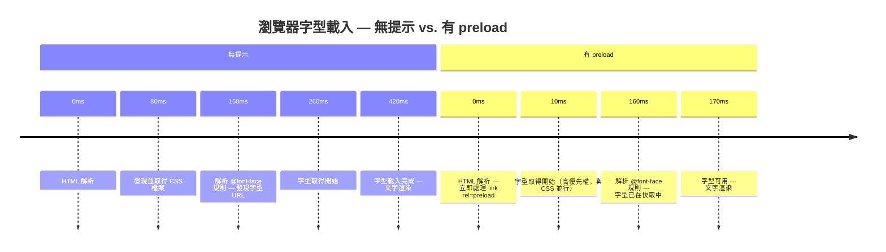

# 資源提示：`prefetch`、`preload`、`preconnect`

資源提示（Resource Hints）是 HTML `<link>` 元素與 HTTP 標頭，用來告知瀏覽器
哪些資源將被需要、以及何時需要。相較於在解析 HTML 或執行 JavaScript 時才被動
地發現資源，資源提示允許瀏覽器更早地發起網路請求——在頁面實際需要該資源之前。
結果是關鍵資源的延遲降低，使用者感知到的效能更快。資源提示不改變瀏覽器載入什麼，
而是改變瀏覽器何時開始載入，將昂貴的網路往返時間移至原本閒置的時間窗口。
對於關鍵渲染路徑上的時效性資源，這種時機上的轉移可以明顯改善最大內容繪製
（LCP）分數。

四種主要的資源提示分別為：`preconnect`（在請求該來源的任何資源之前，預先建立
TCP/TLS 連線）、`dns-prefetch`（僅執行 DNS 查詢）、`preload`（立即以高優先權
為當前頁面取得特定資源）、以及 `prefetch`（以低優先權為未來導航預先取得資源）。
每種提示都有不同的作用範圍與優先權；在錯誤的情境下使用會浪費頻寬，或延遲更重要
的資源載入。這些提示並非對稱的——`preload` 與 `prefetch` 作用於特定資源 URL，
而 `preconnect` 與 `dns-prefetch` 作用於來源（origin），而非 URL。混淆這兩個
層次的差異，是提示位置錯誤最常見的根源。

資源提示功能強大，但也容易被誤用。未能對應到實際資源請求的 `preload`，
瀏覽器會發出警告並浪費頻寬。對當前頁面的資源使用 `prefetch`，
反而會延遲它們而非加速。理解其作用範圍——當前頁面或未來頁面、來源或特定資源——
是正確使用提示的必要前提。使用 Chrome DevTools 或 WebPageTest 的網路瀑布圖
個別測量每個提示的效果，是確認提示帶來預期效益而非意外干擾的唯一可靠方式。

資源提示的規格與瀏覽器實作持續演進。`<script type="speculationrules">` 是
Chromium 推出的新一代推測式載入 API，可以更精細地控制預取與預渲染的條件，
是 `prefetch` 在未來路由預取場景中的潛在替代方案。然而在 2025 年，
`prefetch`、`preload` 和 `preconnect` 仍是跨瀏覽器相容性最廣、
在所有主流瀏覽器引擎中行為最一致的選擇。工程師在採用新 API 時，
應優先確認目標瀏覽器的支援情況，並為不支援的環境保留傳統提示作為備用。

## 設計思維

### preload 與 prefetch 的差異

`preload` 的作用範圍是當前頁面，以高優先權執行。它適用於當前導航所需、
但瀏覽器正常情況下要到很晚才會發現的資源——例如深藏在 CSS 層疊中的字型檔、
放在 CSS `background-image` 屬性而非 `` 元素中的圖片，
或是透過動態方式注入的 JavaScript 模組進入點。瀏覽器在遇到提示後，
立即在文件中通常發現該資源的時間點之前就開始取得。這讓資源能在瀏覽器快取中
待命，等到真正的使用方——CSS 解析器、腳本評估器或版面引擎——請求它時，
可以消除關鍵路徑上的完整網路往返。決定哪些資源值得預載的方法，
是審視網路瀑布圖中的關鍵路徑：若某個資源的請求發起時間晚於它理應發起的時間，
且它位於 LCP 元素的依賴鏈上，那麼 `preload` 就能帶來實質效益；
反之，若資源已能在合理的時間點被發現，添加 `preload` 只是增加 `<head>` 的
複雜度而不帶來收益。

若資源在當前頁面載入期間未被使用，瀏覽器會在主控台發出警告，且已消耗的頻寬
付之流水。這個警告是重要的訊號：在 DevTools Network 面板中持續觸發未使用預載
警告的 `preload`，代表提示的 URL 不再與使用方實際請求的 URL 一致，通常是因為
建置工具已對檔案進行重命名或內容雜湊。團隊應將未使用預載警告視同 lint 錯誤，
在上線前予以解決。在持續整合流程中加入檢查未使用預載警告的自動化測試，
可以防止這類問題在建置管線變更後悄然引入。

在帶內容雜湊的建置產物中管理預載提示，需要仰賴自動化而非手動維護 URL。
若由建置工具外掛程式在生產 HTML 輸出中自動生成 `<link rel="preload">` 標籤——
讀取打包工具產出的雜湊檔名 manifest，並注入對應的預載提示——
可以確保提示在每次建置後都與實際資產 URL 保持同步。
若將預載提示以靜態字串維護在範本中，而建置工具會對檔名進行雜湊，
這是一種隱性破損模式：每次部署只要改變了被預載檔案的內容雜湊，
預載就會靜默地變成未使用預載警告，效能收益無聲消失，直到有人注意到警告並開始調查。
Vite 的 `transformIndexHtml` 外掛鉤點與 Webpack 的 `HtmlWebpackPlugin` 注入點，
都提供了存取最終雜湊檔名所需的介面，可用於實作自動化預載提示生成。
這是一次性的實作投入，可永久避免預載提示與實際資源 URL 的不同步問題，
是維護預載效益最可靠的長期方式。

預載提示的有效性，應在每次重大效能優化後以網路瀑布圖重新確認。
前端效能指標會隨功能迭代而改變：LCP 元素可能從圖片換成文字區塊，
原本被預載的字型可能不再位於 LCP 關鍵路徑，而原本未被預載的圖片可能成為新的 LCP 元素。
將預載清單視為需要與頁面實際內容保持同步的配置，而非一旦設定就無需再管的優化，
是防止預載清單隨時間演進而產生「有害預載」——消耗頻寬但不帶來任何效能收益的提示——的正確心態。
「有害預載」的識別方式是：在 DevTools Network 面板中，該資源的實際請求出現在預載請求之後，
且兩者的優先順序相同，說明預載沒有提前發現任何資源，反而多發出了一次請求。
定期以 WebPageTest 或 Chrome DevTools 分析頁面載入瀑布圖，並確認每個預載提示都對應一個確實提前發現的關鍵資源，是維護預載提示健康狀態的可操作工作。
將此稽核納入季度效能審查或每次重大 UI 重構的完成條件中，可確保預載清單與頁面演進保持同步，而不是等到效能指標出現可見退化後才被動發現問題。
預載清單的健康狀態是效能維護的一個具體、可量測指標：零個未使用預載警告、零個有害預載，是值得追蹤並納入效能評審清單的質量目標。
善用自動化工具（如 Lighthouse 的「避免連結到跨來源目的地」或自定 CI 腳本）來定期掃描頁面的預載狀況，能讓稽核從靠人工記住執行，升級為系統化的品質把關。

`prefetch` 的作用範圍是未來導航，以閒置優先權執行。它指示瀏覽器在閒置期間
以背景頻寬取得使用者下一頁可能需要的資源。瀏覽器不會取消已開始的 `prefetch`；
而未被使用的 `preload` 則會被取消並發出警告。對當前頁面的資源使用 `prefetch`
是一個常見且後果嚴重的錯誤：因為閒置優先權的請求與活躍的頁面資源競爭能力很弱，
`prefetch` 的資源可能比使用 `preload` 更晚到達，導致淨延遲而非淨收益。
瀏覽器的資源排程器將閒置優先權請求視為不應妨礙前景載入的背景工作，
這對於當前頁面所需的資源而言，正好是完全錯誤的行為。一個簡單的自我檢驗問題
是：「如果瀏覽器在任何時間點決定不取得這個資源，當前頁面會出問題嗎？」
若答案是肯定的，那就應該使用 `preload`；若否，才考慮 `prefetch`。

### preconnect 與 dns-prefetch 的差異

`preconnect` 對遠端來源發起完整的連線序列：DNS 解析、TCP 握手，以及 TLS 協商。
對於 HTTPS 來源，根據伺服器的地理距離和網路條件，這個序列通常會在收到第一個
位元組之前增加 100–300ms 的延遲。對即將在頁面載入前兩秒內請求關鍵資源的來源
使用 `preconnect`，可以完全消除這段握手時間，因為在資源請求發出時連線已經建立。
實際效益在承載字型、CDN 分發的腳本或頁面載入時就會請求的 API 端點的第三方來源上
最為顯著——這些來源的連線延遲，若非使用提示，頁面作者無從消除。使用
Chrome DevTools Network 面板的「Timing」分頁，可以直接觀察某個請求的 DNS 查詢、
初始連線（Initial connection）和 SSL 等各個階段各花了多少時間，
從而判斷對該來源添加 `preconnect` 是否值得。

`dns-prefetch` 只執行 DNS 解析步驟，將域名解析為 IP 位址，
不發起 TCP 或 TLS 連線。它比 `preconnect` 消耗的資源少得多——不需要檔案描述符、
TLS 狀態或伺服器端連線槽位——適用於頁面期間可能使用但非立即關鍵的來源。
實際準則是：對兩、三個將載入首屏資源的來源使用 `preconnect`；
對其他計時不確定的第三方來源使用 `dns-prefetch`，以預先解析 DNS 而不承擔
完整連線成本。在行動網路上，連線建立尤其昂貴，對未使用連線的浪費
可能超過提示所帶來的效益。一個常見且正確的模式是對同一來源同時配置
`preconnect` 和 `dns-prefetch`：`preconnect` 由支援它的瀏覽器使用，
`dns-prefetch` 則在 `preconnect` 效果較差的環境中作為輕量級備用。
需要注意的是，`dns-prefetch` 不適用於同源（same-origin）請求，
因為同源的 DNS 查詢在導航開始時就已完成；它只對跨來源的第三方域名有效，
這也是在設計提示策略時需要從第三方依賴清單出發進行審視的原因。

### modulepreload

`<link rel="modulepreload">` 是專為 ES 模組設計的 `preload` 變體。
與一般 `preload` 不同，`modulepreload` 不僅取得模組腳本，
還會解析它並將其加入模組映射（module map），使得當模組被 `import`
時可以立即取得而無需重新解析。對於使用 Vite 或類似模組打包工具建置的應用程式，
對主要進入點使用 `modulepreload` 可以降低首個有意義路由的互動時間，
因為解析成本在閒置時間支付，而非在首次使用者互動的關鍵路徑上。
Vite 在生產建置中會自動為進入點 chunk 輸出 `modulepreload` 提示；
理解此機制有助於工程師排查提示缺失或作用範圍不正確的情況。

`modulepreload` 在瀏覽器完整支援規格的情況下，也會觸發模組靜態 `import`
的預載，這意味著對一個進入點的單一提示，可以串聯取得並解析整個靜態依賴圖，
以並行方式完成。這個行為與一般 `preload` 不同——後者只取得指定的單一 URL。
對於具有深層靜態 import 樹的模組化應用程式，這個差異使 `modulepreload` 在
JavaScript 模組進入點上比 `preload` 強大得多；將兩者互換不只是風格問題，
而是正確性問題。在手動管理模組提示的情境下（例如 Vite 自動輸出被關閉），
工程師應使用 `rel="modulepreload"` 而非 `rel="preload" as="script"`，
確保瀏覽器能夠完整進行依賴圖解析，而非只取得單一模組檔案。
此外，`modulepreload` 不需要 `as` 屬性（其資源類型已由 `rel` 隱含），
也不需要 `crossorigin`（模組腳本預設使用 CORS 模式），
這是它與一般 `preload` 在語法上的另一個重要差異。

### 透過 HTTP 標頭傳遞資源提示

資源提示也可以以 HTTP `Link` 回應標頭的形式傳遞，而非 HTML `<link>` 元素。
例如 `Link: </fonts/inter.woff2>; rel=preload; as=font; crossorigin` 這樣的
標頭形式，瀏覽器在回應標頭到達時立即處理——早於 HTML 本體的解析。
這使得標頭形式的提示比文件內的提示更為有效，尤其對需要在請求生命週期
最開始就發起的資源而言，因為標頭處理發生在任何 HTML 位元組被讀取之前。
Cloudflare、Fastly 等 CDN 和邊緣平台可以在網路層注入 `Link` 標頭，
而無需修改來源伺服器產生的 HTML，這對於無法直接控制 HTML 建置管線的
團隊而言是可行的方案。

代價是標頭形式的提示對開發者而言比文件內的提示更不可見，因為它們不出現
在瀏覽器返回的 HTML 原始碼中。使用標頭形式預載的團隊，應記錄在 CDN 或
伺服器層添加的標頭，並將其納入效能稽核範圍，以防止資源被重命名或移除後
提示仍然存在。來自標頭提示的未使用預載警告在診斷上與來自 HTML 提示的相同，
但在沒有 CDN 設定存取權限的情況下更難歸因。Chrome DevTools 的 Network 面板
會顯示資源的 Initiator，可以用來區分是標頭提示還是 HTML 元素觸發的預載請求，
協助工程師在排查雙重請求問題時定位根源，而不需要分別確認 HTML 原始碼與
CDN 設定兩個地方。

### 過度提示的陷阱

每個被預載的資源都與同時載入的其他資源競爭頻寬。同時預載主視覺字型、
主視覺圖片、第三方分析腳本和三個 CSS 檔案，意味著所有請求在頁面載入
最擁擠的階段共享相同的連線頻寬。若最大內容繪製（LCP）元素是圖片，
預載優先權低於它的資源可能將它推到頻寬佇列的更後面，進而延遲 LCP。
正確的方式是在加入每個提示前後，使用 Chrome DevTools 或 WebPageTest
分別測量 LCP 和 FCP，只保留能對目標指標產生可量測改善的提示。

Chrome DevTools 的網路瀑布圖視圖是評估提示效益最直接的工具。加入 `preload`
後錄製一次重新載入並開啟瀑布圖，可以立即看到預載資源的取得時機變化：
被預載資源的進度條向左移動，與原本在更早期並行請求的資源重疊。
若進度條沒有明顯移動，代表提示沒有帶來效益，應予以移除。
預載所有資源比什麼都不預載更糟糕，因為精心挑選的提示能帶來淨收益，
而不加選擇的提示只會透過排擠瀏覽器自身的優先權決策，造成淨干擾。

瀏覽器的優先權啟發式演算法相當精密，包含了大量關於哪些資源可能阻塞 LCP
的經驗性知識。未加任何資源提示的頁面，仍能從瀏覽器內建的推測機制中受益——
預載掃描器（preload scanner）在主 HTML 解析器之前運行，在解析器到達相應元素
之前就發現 HTML 中的 `<script src>`、`<link href>` 和 `` 屬性。
資源提示是對這些啟發式的覆寫，而非取代。錯誤地覆寫啟發式會比單純依賴啟發式
產生更差的結果，這也是為何每個提示都應透過量測驗證，而非基於「越早越好」的
假設盲目添加。Chrome DevTools 的 Priority 欄位顯示每個資源被瀏覽器分配的實際
優先權，這是判斷是否需要介入的第一個訊號：若 LCP 圖片的優先權已是 Highest，
預載它幾乎不會帶來額外收益；若它被分配了 Low 或 Medium 優先權，
添加 `<link rel="preload" as="image">` 則能顯著改善其取得時機。了解瀏覽器的
預設優先權決策，是決定何時需要以提示介入的先決條件。

## 最佳實踐

**必須（MUST）在所有 `<link rel="preload">` 元素上包含 `as` 屬性，
並對字型預載包含 `crossorigin`。** 若缺少 `as` 屬性，瀏覽器以預設優先權
取得預載資源且不帶正確標頭，等到實際使用方（CSS、JS）以正確的上下文請求
同一資源時，瀏覽器無法配對並再次取得，導致雙重請求浪費頻寬，
甚至可能使資源比完全沒有提示時更晚到達。對於字型，即使是自架字型，
`crossorigin` 同樣不可缺少，因為 `@font-face` 規則發出的是 CORS 模式請求，
瀏覽器無法將其與非 CORS 的預載配對，導致第二次完整取得。自架 woff2 字型的
正確組合始終是 `as="font"`、`type="font/woff2"` 與 `crossorigin` 三者同時存在；
缺少其中任一項都會破壞配對。建置工具輸出的雜湊檔名（如 `inter.abc123.woff2`）
意味著每次重新建置後提示中的 URL 都可能改變；應透過建置管線自動生成
`<link rel="preload">` 標籤，而非手動維護，以防止 URL 與實際資源脫同。
Vite 的 `vite-plugin-html` 和 Webpack 的 `html-webpack-plugin` 等工具都支援
在建置時自動注入基於最終輸出 URL 的資源提示，這是在具有內容雜湊的現代建置
管線中維護準確預載提示的推薦模式，也是避免未使用預載警告最可靠的方式。

**應該（SHOULD）只對將在頁面載入前兩秒內取得關鍵首屏資源的來源使用
`<link rel="preconnect">`。** 每個 `preconnect` 都會開啟一個消耗伺服器與
客戶端資源的 TCP/TLS 連線——包括檔案描述符、TLS 工作階段狀態，以及伺服器端
的 keep-alive 槽位。對未能在短時間內使用的來源開啟連線將被放棄，
浪費了提示原本旨在節省的握手成本。瀏覽器在連線閒置逾時後會關閉未使用的
`preconnect` 連線，因此在頁面載入時觸發、卻在工作階段後期才聯繫的來源提示
可能完全無效。`preconnect` 應限制於兩、三個高優先來源；
對優先權較低或條件式載入的第三方來源改用 `dns-prefetch`，以預先解析 DNS
而不承擔完整連線成本。團隊應定期透過 Network 面板的時序分解來審視
`preconnect` 提示，確認每個提示的連線確實被重用，並在連線未被重用時移除
對應的提示，避免為後續訪客持續支付不必要的握手成本。驗證 `preconnect`
效益的方法是在 Network 面板中找到目標來源的第一個實際請求，查看其 Timing
分頁中的「Initial connection」和「SSL」時間是否為 0ms——若是，代表提示成功
預先建立了連線，握手成本已從此資源的關鍵路徑中消除；若仍有明顯耗時，
則說明提示觸發過晚或連線已在使用前逾時關閉，需要進一步調查。

**應該（SHOULD）將 `<link rel="prefetch">` 用於下一個可能的導航所需的資源，
而非當前頁面所需的資源。** `prefetch` 以閒置優先權執行，
可能在當前頁面需要資源之前尚未完成。對當前頁面的資源使用 `prefetch`，
意味著這些資源的到達時間晚於 `preload` 所能提供的時間，相較於沒有任何提示
反而產生淨延遲。適當的使用方式是推測性的：當分析資料或應用程式邏輯顯示
使用者極可能下一步導航至特定路由時，在背景預取該路由的打包檔或資料，
讓下一頁能從快取載入而非從網路。Next.js 和 Nuxt 等框架在連結進入視窗時
實作自動路由預取；自訂實作應遵循相同模式——根據使用者接近訊號（懸停、
聚焦、IntersectionObserver）觸發 `prefetch` 提示，而非在頁面載入時無條件觸發。
在資料流量昂貴的環境（例如行動網路）中，推測性預取應設計為可選擇停用，
或配合 `navigator.connection.saveData` 檢查，在使用者啟用省流量模式時
自動跳過預取，避免在使用者未同意的情況下消耗其流量配額。預取的資源在被實際
請求時由瀏覽器快取提供，快取期由 HTTP 快取控制標頭決定；若預取資源設定了
極短的 `max-age` 或 `Cache-Control: no-cache`，即使預取成功，
後續導航時資源仍可能需要重新驗證或重新取得，使預取的效益大打折扣。
確保預取目標資源具有適當的快取策略，是預取效益得以實現的前提條件。

## 視覺呈現



## 範例

```html
<!-- 對關鍵第三方來源進行 preconnect -->
<link rel="preconnect" href="https://fonts.googleapis.com">
<link rel="preconnect" href="https://fonts.gstatic.com" crossorigin>

<!-- 預載 LCP 主視覺圖片 -->
<link rel="preload" as="image" href="/images/hero.webp">

<!-- 預載主要網頁字型 -->
<link rel="preload" as="font" type="font/woff2" href="/fonts/inter.woff2" crossorigin>

<!-- 預取下一頁的打包檔 -->
<link rel="prefetch" href="/about/bundle.js">
```

## 常見錯誤

- `<link rel="preload">` 缺少 `as` 屬性——瀏覽器無法判斷資源類型，以預設優先權且不帶正確 `Accept` 標頭取得資源，待實際使用方以正確上下文請求時再次取得，形成雙重請求。
- `<link rel="preload" as="font">` 缺少 `crossorigin`——即使是自架字型，`@font-face` 規則也以 CORS 模式請求；瀏覽器無法將其與非 CORS 的預載配對，導致字型被取得兩次。
- 對當前頁面資源使用 `prefetch`——閒置優先權的請求與活躍的頁面網路請求競爭能力弱，資源可能比不加任何提示更晚到達。
- 同時預載過多資源——在載入最擁擠的階段與 LCP 圖片競爭頻寬，延遲了原本期望改善的指標。
- 對所有第三方來源套用 `preconnect`——幾秒內未使用的連線會被關閉，白白浪費了 TCP/TLS 握手成本。
- 忽略 DevTools 的未使用預載警告——此警告表示預載的 URL 未被當前頁面任何使用方配對，代表提示未帶來效益且消耗了頻寬。
- 對 ES 模組使用 `<link rel="preload" as="script">` 而非 `<link rel="modulepreload">`——前者只取得模組檔案但不解析依賴圖；後者才能完整啟動靜態依賴的並行預載。
- 手動維護帶有內容雜湊的預載 URL——建置工具每次重新建置都會更改雜湊值，導致提示指向舊版 URL，觸發未使用預載警告且不帶來任何效益。

## 相關 FEE

- FEE-700 — 渲染與效能總覽
- FEE-704 — 核心 Web 指標與效能指標
- FEE-705 — 程式碼分割、懶載入與 Tree Shaking
- FEE-712 — 關鍵渲染路徑與繪製計時

## 參考資料

- MDN: rel=preload — https://developer.mozilla.org/en-US/docs/Web/HTML/Attributes/rel/preload
- MDN: rel=modulepreload — https://developer.mozilla.org/en-US/docs/Web/HTML/Attributes/rel/modulepreload
- web.dev: Preload critical assets — https://web.dev/articles/preload-critical-assets
- web.dev: Establish network connections early — https://web.dev/articles/preconnect-and-dns-prefetch
- W3C Resource Hints specification — https://www.w3.org/TR/resource-hints/
