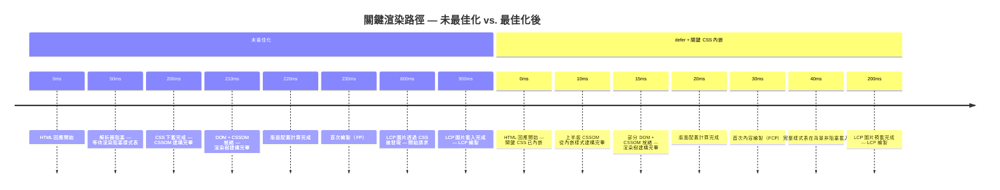

# 關鍵渲染路徑與繪製計時

關鍵渲染路徑（Critical Rendering Path）是瀏覽器在畫面顯示任何內容之前
必須完成的一系列步驟：下載並解析 HTML、下載並解析 CSS（渲染阻塞）、
建構 DOM 與 CSSOM、將兩者合併為渲染樹、執行版面配置計算幾何資訊、
繪製像素，最後將各圖層合成為最終畫面。每個步驟都依賴前一個步驟的
輸出結果。最佳化關鍵渲染路徑，意味著減少阻塞首次繪製的步驟數量及其
成本，方法是消除阻塞性資源，或縮短這些資源在網路上所花費的時間。
一條耗時 200ms 與一條耗時 800ms 的渲染路徑，其差異完全取決於瀏覽器
所遇到的阻塞性資源數量，以及這些資源解析所需的時間。了解哪些資源
位於此路徑上、哪些資源不在，是改善頁面初始渲染速度的先決條件。
關鍵渲染路徑的最佳化不需要重寫應用程式——通常只需調整幾個 HTML
屬性與資源載入策略，便能帶來可量測的 FCP 改善。

渲染阻塞資源是影響首次繪製效能最關鍵的因素。在預設情況下，
`<link rel="stylesheet">` 屬於渲染阻塞資源：瀏覽器在 `<head>` 中所有
樣式表下載並解析完成之前，不會執行任何繪製操作。未加上 `defer` 或
`async` 的 `<script>` 同樣具有渲染阻塞與 HTML 解析阻塞的特性。瀏覽器
在解析 HTML 時遇到這些標籤，會立即停止解析、下載資源、處理資源，
然後才繼續。每個阻塞性資源都會把完整的網路來回時間（round-trip time）
加入首次繪製的等待時間。在網路連線緩慢或延遲較高的環境中，單一個
未最佳化的阻塞性資源，就可能導致使用者看到數百毫秒的空白畫面。
這個成本並非理論上的——它可以在繪製計時瀑布圖中直接觀察，並明確
歸因於文件頭部存在的阻塞性資源。Chrome DevTools 的「效能」分析結果
中，「解析 HTML 時阻塞」的腳本與「等待渲染阻塞 CSS」的訊息，提供了
識別哪些具體資源延長了首次繪製等待時間的最直接線索，是進行關鍵
渲染路徑最佳化時的優先診斷工具。

`PerformancePaintTiming` 提供瀏覽器回報的兩個時間戳記：`first-paint`
（FP）與 `first-contentful-paint`（FCP）。這些可觀測的指標與關鍵渲染
路徑的長度直接相關——路徑越短，FP 與 FCP 的時間戳記就越早。
LCP（最大內容繪製，Largest Contentful Paint）進一步衡量視窗中最重要
的內容何時變為可見，不僅涵蓋首次繪製事件，也包含主要元素的載入
過程。FP、FCP 與 LCP 共同構成了描述頁面渲染效能的繪製計時全貌，
是真實使用者監控（RUM）系統應捕捉的核心指標。這三項指標皆可在
生產環境中透過標準瀏覽器 API 量測，是任何以實證為基礎的關鍵渲染
路徑改善計畫的基礎。LCP 的元素類型——圖片、`` 標籤、CSS
背景圖或文字塊——決定了哪個資源的載入速度對 LCP 時間最具影響力，
也決定了應在關鍵渲染路徑最佳化中優先關注哪個資源的交付。

## 設計思維

### DOM 建構與解析

HTML 採增量解析方式處理：瀏覽器無需等待完整 HTML 文件收到後才
開始建構 DOM。隨著 HTML 回應的每個資料塊陸續到達，解析器會逐步
處理並建構 DOM 節點。這種串流行為意味著，儘早回傳 HTML 回應——
而非因緩慢的伺服器端渲染或過大的初始資料延遲——能讓瀏覽器更早
開始建構 DOM、透過預載掃描器發現資源，並提前發起 CSS、腳本與
圖片的網路請求。因此，首位元組時間（TTFB）是關鍵渲染路徑最佳化
的先決指標：快速的網路與伺服器路徑是後續所有最佳化的基礎。
在 TTFB 本身就很高的情況下，任何後續的 CSS 或腳本最佳化所能帶來
的改善空間，都受到 HTML 回應本身延遲的嚴格限制。

瀏覽器的預載掃描器（preload scanner）會超前主 HTML 解析器執行，
在尚未解析的 HTML 中發現 `<link>`、`<script>` 和 `` 標籤，允許
在解析器到達這些元素之前便發起請求。預載掃描器發現的渲染阻塞
資源雖然可並行下載，但仍會在完成前阻塞渲染步驟。掃描器只讀取
靜態 HTML 屬性，無法預測由 JavaScript 注入或從 CSS 引用的資源。
這正是「延遲發現」資源（如 CSS 中的字型或動態注入的腳本）受益於
明確 `<link rel="preload">` 提示的根本原因：這些提示讓資源進入預載
掃描器的作用範圍，使請求得以提前發出。預載掃描器是現代瀏覽器中
影響效能最顯著的功能之一，透過 JavaScript 動態注入關鍵 `<link>` 而非
在靜態 HTML 中宣告，將使延遲發現資源的下載時間加倍，因為這些資源
無法被預載掃描器提前識別與請求。

理解解析器在哪些情況下會被阻塞，對文件結構決策有直接影響。
`<head>` 中未加 `defer` 的渲染阻塞 `<script>`，會在其出現位置將解析器停止，
導致瀏覽器無法發現 `<head>` 後續的 CSS、圖片或字型。
這意味著一個位於 `<head>` 頂部的阻塞腳本，可能遮蔽 CDN 交付的樣式表或字型
本應能並行使用的頻寬——因為瀏覽器此時根本還不知道那些資源的存在，
無法在腳本執行期間並行取得它們。
多個渲染阻塞腳本的累積效應並非加法而是序列：瀏覽器解析至遇到阻塞腳本、
下載並執行後才繼續解析，再發現下一個資源。
在 RTT 為 80ms 的行動連線上，`<head>` 中三個阻塞腳本，
可能在瀏覽器開始取得頁面第一個樣式表之前，產生超過 240ms 的序列解析中斷。
將這三個腳本改為 `defer`，則可折疊此延遲：預載掃描器在解析繼續的同時並行取得三個腳本，
並在文件解析完成後依序執行。
渲染路徑縮短的幅度等同整個序列阻塞鏈的持續時間，這往往是一個頁面關鍵路徑上最大的可恢復延遲。
第三方腳本（分析、A/B 測試、客服聊天小工具）若以同步方式嵌入 `<head>`，
同樣適用此原則：將其改為 `defer` 或 `async` 通常是改善 FCP 最省力、效益最高的單一操作，
適合作為尚未系統性優化關鍵渲染路徑的頁面的起手式。

識別哪些腳本真正需要在 DOM ready 之前執行（而非僅是「加入了 `<head>` 而未加 `defer`」），
是啟動這類優化的必要前置工作。
A/B 測試腳本有時確實需要在渲染前執行以避免版面閃爍（FOUC），但許多分析腳本並不需要。
逐一審查每個 `<head>` 中的腳本，明確記錄其是否真的需要同步執行，
並對無法提供合理理由的腳本應用 `defer` 或 `async`，是一種有助於知識傳承的工程實踐：
它將「這個腳本為什麼是阻塞的」的隱性判斷，轉化為程式碼審查中可追蹤、可質疑的顯性決策。
ESLint 外掛程式（如 `eslint-plugin-no-sync-scripts` 或類似自定規則）可以自動標記未加 `defer` 或 `async` 的 `<head>` 腳本，
讓這項最佳實踐從人工記憶升格為自動化的品質把關，確保新加入的第三方腳本不會無聲地帶入阻塞渲染的行為。
靜態分析攔截的阻塞腳本問題，比 Lighthouse 稽核發現的問題更便宜：前者在開發階段即時提示，後者需等到頁面可以被稽核時才發現。
在 CI 中整合針對 HTML 輸出的 Lighthouse 自動化稽核，可以作為補充層，確保透過範本邏輯或建置步驟動態注入的阻塞腳本，也能在進入生產環境前被攔截。
兩層防線——開發時的靜態分析與 CI 的動態稽核——結合使用，可在整個軟體交付流程中覆蓋不同注入模式，使關鍵渲染路徑的品質管控更加全面。

### CSSOM 建構

CSS 不採增量解析方式。瀏覽器必須取得樣式表的完整 CSS 文字才能
建構 CSSOM，因為樣式表中任何位置的規則都可能覆蓋之前出現的規則。
CSS 的這個根本特性意味著，即使 HTML 已完整解析且 DOM 已建構完成，
單一一個因緩慢 CDN 節點而延遲的大型樣式表，仍然會阻塞所有渲染。
瀏覽器在 CSSOM 準備好之前，不會開始版面配置，因此也不會進行繪製。
這就是樣式表大小與傳遞速度直接影響 FCP 的原因，也是關鍵 CSS 內嵌
技術有效的原理：將上半版樣式移入內嵌的 `<style>` 區塊，瀏覽器解析
到 HTML 中該段落時，這些樣式便立即可用，無需任何額外的網路請求。
對於依賴第三方 CSS CDN 的頁面，CDN 的 P99 延遲直接加入每次頁面
載入的 CSSOM 建構時間，是值得追蹤的外部風險指標。

CSS 的層疊特性也使得樣式表內的 `@import` 特別有害。樣式表內的
`@import` 規則要等到匯入的樣式表被下載並解析後才會被發現，形成
串行的網路請求鏈，導致 CSSOM 無法及早建構。若頁面的 `<head>` 中
有 `main.css`，而其內部又匯入 `variables.css` 和 `typography.css`，
則在 CSSOM 準備好之前，需串行完成三次網路請求。正確的做法是在
建置時合併匯入，或在 `<head>` 中使用個別的 `<link>` 元素引用每份
樣式表，讓所有樣式表能並行下載。Vite、webpack、Parcel 等建置工具
會在建置期間消除 `@import` 鏈，這主要是未使用 CSS 打包、或以輕量
處理方式發佈 CSS 至生產環境的舊有或 CMS 驅動網站才需特別關注的
問題。在程式碼審查中，應將 CSS `@import` 視為需審查的警告訊號，
特別是在頁面的關鍵渲染路徑上出現的時候。

### 渲染樹、版面配置、繪製、合成

渲染樹透過遍歷 DOM 並為每個節點附加匹配的 CSSOM 規則而建構。
`display: none` 的節點會從渲染樹中完全排除；`visibility: hidden` 的
節點雖然保留在渲染樹中，但會以透明方式繪製。渲染樹只包含將產生
可見輸出的節點，這也是它與 DOM 為獨立結構的原因。渲染樹建構完成
後，版面配置步驟會計算頁面座標空間中每個節點的位置與尺寸。版面
配置是遞迴式的，對大型或深度巢狀的樹而言成本很高。任何影響幾何
形狀的 DOM 變動——新增或移除元素、改變尺寸、改變已定尺寸容器的
文字內容——都會觸發版面配置重新計算，並傳播至受影響的子樹。理解
版面配置在何時重新執行，是在互動後保持低 INP 的先決知識，因為強制
同步版面配置（forced synchronous layout）是高版面配置成本的常見來源。

繪製步驟將每個節點的繪圖指令記錄為指令清單，瀏覽器將執行這些
指令以產生像素。合成步驟則將圖層——具有 `transform`、`opacity` 或
`will-change` 屬性的元素所對應的獨立 GPU 支援表面——合併為最終顯示
於螢幕的畫面。僅影響合成屬性（如 `transform` 和 `opacity`）的變動
可繞過版面配置與繪製，完全在 GPU 上執行合成步驟。這正是 CSS 動畫
推薦使用 `transform` 和 `opacity` 的原因：它們不觸發版面配置或繪製
重新計算，可在不占用主執行緒的情況下以 60fps 流暢執行。而 `width`、
`height`、`top`、`left` 或 `color` 等屬性的變動則會觸發版面配置或
繪製，無法以同等成本進行 GPU 合成。Chrome DevTools 的「Rendering」
面板可用來標記觸發版面配置或繪製的屬性變動，協助開發者識別渲染
管線中成本最高的作業，並將其重構為僅合成層的動畫路徑。

### 使用 PerformancePaintTiming 與 PerformanceObserver 進行量測

`PerformancePaintTiming` 在瀏覽器效能時間軸中公開兩個條目：
`first-paint`（FP）——瀏覽器首次渲染任何非預設背景內容的時間戳記；
以及 `first-contentful-paint`（FCP）——瀏覽器首次渲染任何文字、圖片、
非白色畫布或 SVG 的時間戳記。FP 與 FCP 的差值通常反映了渲染樹首次
建構後，瀏覽器需要多少時間才能完成具有實質內容的繪製。這些條目
可在繪製事件發生後透過 `performance.getEntriesByType('paint')` 取得，
或透過帶有 `paint` 類型的 `PerformanceObserver` 進行即時觀測。
在 `observe` 呼叫中使用 `buffered: true`，可確保在觀測器註冊之前已
觸發的條目仍能被傳遞，讓觀測器在頁面初始化過程的任何時間點
註冊都是安全的，不會有遺漏條目的風險。

對於真實使用者監控（RUM），使用 `paint` 類型的 `PerformanceObserver`
是在生產環境捕捉 FP 與 FCP 的正確工具。LCP 同樣可透過
`largest-contentful-paint` 類型進行觀測。這些瀏覽器原生 API 能夠捕捉
使用者在其實際裝置與網路條件下的真實渲染效能——這些條件遠比
Lighthouse 或 WebPageTest 模擬的環境多樣。僅依賴實驗室資料建構的
效能預算或回歸警報，將會遺漏只在中階 Android 裝置搭配 4G 網路上
才會出現的效能回歸——而這正是最佳化與未最佳化的關鍵渲染路徑
之間差距最為明顯的環境。將這些數值傳送至後端分析系統的團隊，
能夠將繪製計時與部署事件、功能開關狀態及 A/B 測試分組進行關聯
——實現對關鍵渲染路徑回歸問題的因果歸因，而非僅停留於相關性
的觀察。

## 最佳實踐

**必須（MUST）為所有置於 `<head>` 的 `<script src="...">` 標籤加上
`defer` 屬性。** 若未加上 `defer`，置於 `<head>` 的 `<script>` 標籤
會在腳本下載與執行期間阻塞 HTML 解析，使瀏覽器無法建構 DOM 或
發現後續任何資源。`defer` 允許解析與下載並行進行，並在解析完成後、
`DOMContentLoaded` 觸發前執行腳本。多個 `defer` 腳本會按文件順序
執行，保留依賴關係。對於依賴 DOM 可用性的應用程式進入點，`defer`
幾乎在所有情況下都是正確的屬性；`async` 僅適用於完全獨立的腳本，
例如對 DOM 就緒狀態或腳本執行順序沒有依賴的分析腳本。此規則同樣
適用於第三方腳本：廣告、分析、聊天小工具等由外部供應商提供的標籤
片段，若未加上 `defer`，會對首次繪製造成與自有腳本完全相同的阻塞
效應，且通常難以透過 CDN 快取或壓縮加以補救。

**應該（SHOULD）將關鍵 CSS——上半版渲染所需的樣式——內嵌於文件
`<head>` 的 `<style>` 標籤中，並以非阻塞方式載入完整樣式表。** 此技術
消除了使用者首先看到的內容在等待渲染阻塞樣式表時的延遲。完整樣式
表可透過設定 `media="print"` 並在 `onload` 屬性中將其切換為 `all`，
或使用 JavaScript 在載入後動態附加 `<link>` 元素的方式，以非阻塞方式
並行載入。`critical` 等 npm 套件能自動從渲染後的 HTML 中提取上半版
CSS，使此技術在規模化場景下具備可行性。其代價是 HTML 大小增加，
但在 FCP 延遲縮短的效益超過邊際成本時，這種取捨是合理的。實作此
模式的團隊應將提取過程納入建置流程自動化，確保內嵌的關鍵 CSS 能
隨頁面版面設計的演進保持同步；手動維護的關鍵 CSS 往往會隨著上半
版設計的變化而逐漸過時。評估此技術是否值得採用的最直接方法，是
在啟用與不啟用關鍵 CSS 內嵌的情況下，分別以真實的 3G 或緩慢 4G
網路條件進行效能剖析，比較兩者的 FCP 時間戳記差異，確認效益是否
足以抵消維護成本。

**應該（SHOULD）使用帶有 `type: 'paint'` 的 `PerformanceObserver` 在
生產真實使用者監控中量測 FP 與 FCP。** Lighthouse 等實驗室工具在
受控條件下量測模擬效能；真實使用者監控則量測使用者在其各自裝置、
網路條件與造訪頁面下的真實體驗。來自 `PerformancePaintTiming` 的
FP 與 FCP，能夠在實際環境中捕捉渲染效能，提供實驗室測試無法發現
的回歸警報能力。帶有 `buffered: true` 的觀測器模式可在頁面生命週期
的任何時間點安全註冊，並能接收到無論繪製事件相對於觀測器註冊時間
何時觸發的所有條目。將這些指標依裝置類型、連線速度與頁面類型進行
分層分析，能夠揭示在聚合 P75 數字中被遮蔽的效能差異——例如同一
頁面在旗艦手機上表現良好，但在中階 Android 裝置上 FCP 卻高出兩倍
以上的情形，正是識別最值得投資最佳化目標的關鍵線索。

## 視覺呈現



## 範例

```js
new PerformanceObserver((list) => {
  for (const entry of list.getEntries()) {
    if (entry.name === 'first-contentful-paint') {
      console.log('FCP:', entry.startTime.toFixed(0), 'ms');
    }
  }
}).observe({ type: 'paint', buffered: true });
```

## 常見錯誤

- 在 `<head>` 中置入未加 `defer` 或 `async` 的 `<script src="...">` —
  瀏覽器在腳本下載與執行期間停止 HTML 解析，阻塞後續所有資源的
  發現與渲染；第三方腳本標籤片段尤其容易出現此問題。
- 在 CSS 檔案中使用 `@import` — 每個匯入都會建立一個串行的網路
  依賴，要等匯入的樣式表被下載並解析後才能被發現，使本可並行的
  請求變為串行，在深度匯入鏈中效果加倍嚴重。
- 將所有 CSS 視為同等重要的渲染阻塞資源 — 以渲染阻塞的 `<link>`
  載入整個網站的樣式表，包含對話框、頁尾與畫面外元件的樣式，
  而實際上只有一小部分樣式影響上半版內容。
- 僅以 Lighthouse 或實驗室工具進行量測 — 模擬環境無法捕捉真實
  使用者的裝置與網路多樣性；在中階裝置上才出現的 FCP 和 LCP
  回歸，在實驗室資料中往往無法被察覺。
- 忽略 TTFB 作為關鍵渲染路徑的先決條件 — 關鍵渲染路徑的最佳化
  受限於 HTML 回應開始到達的速度；緩慢的伺服器或冗長的重新導向
  鏈會抵消後續的所有最佳化成效，且無法透過任何客戶端技術補救。
- 對依賴 DOM 就緒狀態或其他腳本的應用程式腳本使用 `async` —
  `async` 腳本在下載完成後立即執行，可能早於 DOM 可用或依賴腳本
  執行完畢，導致執行期錯誤，在多腳本頁面中尤難除錯。
- 在 `PerformancePaintTiming` 觀測器中省略 `buffered: true` — 若不加
  `buffered: true`，在繪製事件發生後才註冊的觀測器將不會收到任何
  條目，在 RUM 管道中產生無聲的資料缺口，導致效能監控儀表板呈現
  不完整的資料分佈。
- 以 JavaScript 動態注入關鍵 `<link rel="stylesheet">` 或 `<link
  rel="preload">` 元素，而非在靜態 HTML 中宣告 — 此做法使預載掃描器
  無法在 HTML 解析階段提前發現這些資源，導致關鍵資源的網路請求
  延遲至 JavaScript 執行完成後才能發起。

## 相關 FEE

- FEE-700 — 渲染與效能總覽
- FEE-704 — 核心 Web 指標與效能指標
- FEE-709 — INP 深度解析
- FEE-711 — 資源提示

## 參考資料

- web.dev: Critical rendering path — https://web.dev/articles/critical-rendering-path
- MDN: PerformancePaintTiming — https://developer.mozilla.org/en-US/docs/Web/API/PerformancePaintTiming
- web.dev: Eliminate render-blocking resources — https://web.dev/articles/render-blocking-resources
- web.dev: Optimizing the Critical Rendering Path — https://web.dev/articles/optimizing-content-efficiency
- web.dev: Defer non-critical CSS — https://web.dev/articles/defer-non-critical-css
- MDN: PerformanceObserver — https://developer.mozilla.org/en-US/docs/Web/API/PerformanceObserver
- Chrome for Developers: Largest Contentful Paint —
  https://developer.chrome.com/docs/lighthouse/performance/lighthouse-largest-contentful-paint
- web.dev: Optimize Time to First Byte — https://web.dev/articles/optimize-ttfb
