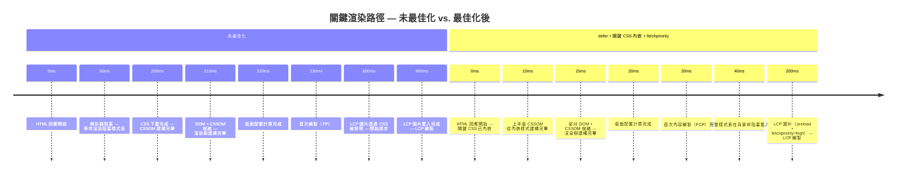

# [FEE-712] 關鍵渲染路徑與繪製計時

:::info
關鍵渲染路徑（Critical Rendering Path）是瀏覽器在繪製任何內容之前必須完成的一連串步驟：下載並解析 HTML、下載並解析渲染阻塞的 CSS、建構 DOM 與 CSSOM、將兩者合併為渲染樹、計算版面配置，最後繪製並合成畫面。`<link rel="stylesheet">` 與 `<head>` 中的同步 `<script>` 標籤，是預設會阻塞此路徑的兩種資源類型；瀏覽器的預載掃描器會在阻塞腳本執行期間並行取得其他資源以繞過部分限制，但執行本身仍是一次只執行一個腳本。`PerformancePaintTiming` 以瀏覽器回報的時間戳記公開 `first-paint` 與 `first-contentful-paint`，`largest-contentful-paint` 則把這個概念延伸到頁面中最主要的可見元素，讓真實使用者監控得以觀察關鍵渲染路徑在正式環境中實際造成的成本。本文說明解析器、預載掃描器與 CSSOM 之間如何互動、如何透過繪製計時 API 量測結果，以及 `fetchpriority` 與關鍵 CSS 內嵌在具體最佳化方案中的定位。
:::

## 背景

Internet Explorer 的「lookahead downloader」（預先下載器）在 2008 年率先實作了這類技術，證明瀏覽器可以在被同步腳本阻塞時持續取得其他資源；Chrome、Firefox 與 Safari 隨後採用相同概念，稱之為預載掃描器（preload scanner，亦稱推測式解析器）。Google 的 Web Fundamentals 文件在 Ilya Grigorik 於 2014 年撰寫的一篇文章中，正式將「關鍵渲染路徑」這個術語定型，並把整個流程拆解為 DOM 與 CSSOM 建構、渲染樹建構、版面配置與繪製，該內容後續遷移至 web.dev。繪製計時 API（Paint Timing API）是後來才出現的規範，讓開發者能取得標準化、由瀏覽器回報的 `first-paint` 與 `first-contentful-paint` 時間戳記，取代過去在頁面載入時臨時呼叫 `Date.now()` 的做法。多數既有指引僅止於條列式清單，例如「加上 defer」「內嵌關鍵 CSS」，卻沒有說明這些技巧與早已在背景取得資源的預載掃描器之間如何互動。本文直接說明這層互動：解析器、掃描器與腳本執行如何共同組成一段具體、可量測的繪製阻塞時間，以及如何在正式環境中觀察這個數字，而非憑空猜測。

## 視覺對比



## 範例

```js
new PerformanceObserver((list) => {
  for (const entry of list.getEntries()) {
    if (entry.name === 'first-contentful-paint') {
      console.log('FCP:', entry.startTime.toFixed(0), 'ms');
    }
  }
}).observe({ type: 'paint', buffered: true });
```

## 最佳實踐

**必須（MUST）為所有置於 `<head>` 的 `<script src="...">` 標籤加上 `defer` 屬性。** 若未加上 `defer`，置於 `<head>` 的 `<script>` 標籤會在下載與執行期間暫停 HTML 解析與 DOM 建構。預載掃描器仍會在這段暫停期間持續發現並取得文件後續的資源，但 DOM 本身要等到腳本執行完畢，才能繼續在該腳本所在位置之後成長。`defer` 讓解析得以不中斷地繼續進行，並在解析完成後、`DOMContentLoaded` 觸發前才執行腳本。多個 `defer` 腳本會依文件順序執行，保留彼此的依賴關係。對於依賴 DOM 可用性的應用程式進入點，`defer` 幾乎都是正確的選擇；`async` 則僅適用於完全獨立、對 DOM 就緒狀態或相對於其他腳本的執行順序沒有依賴的腳本，例如分析腳本。

**應該（SHOULD）將關鍵 CSS（above-the-fold 渲染所需的樣式）內嵌於文件 `<head>` 的 `<style>` 標籤中，並以非阻塞方式載入完整樣式表。** 此技術消除了使用者最先看到的內容在等待渲染阻塞樣式表時的延遲。完整樣式表可透過設定 `media="print"` 並在 `onload` 屬性中將其切換為 `all`，或使用 JavaScript 於載入後動態附加 `<link>` 元素的方式，以非阻塞方式並行載入。`critical` 等 npm 套件能自動從渲染後的 HTML 中提取 above-the-fold CSS，使此技術在規模化場景下具備可行性。其代價是初始 HTML 回應變大，但只要換來的 FCP 改善值得這些額外位元組，這筆交易就划算。採用此模式的團隊應將提取過程納入建置流程自動化，確保內嵌的關鍵 CSS 能隨頁面版面配置的演進保持同步；手動維護的關鍵 CSS 往往會隨著 above-the-fold 設計的變化而逐漸過時。

**應該（SHOULD）為 LCP 候選 `` 元素設定 `fetchpriority="high"`；當 LCP 資源只能透過 CSS 或 JavaScript 取得時，則搭配 `preload` 與 `fetchpriority="high"` 一併使用。** `fetchpriority` 屬性會覆寫瀏覽器對特定資源的預設優先權判斷。對於預期會成為 Largest Contentful Paint 元素的 ``，`fetchpriority="high"` 能讓其請求排在同優先權圖片之前，不需等待 CSS 或腳本發現該資源。當 LCP 資源是 CSS 的 `background-image`，或是由 JavaScript 注入、因而要到很晚才會被預載掃描器發現時，應將 `<link rel="preload" as="image" fetchpriority="high">` 與該屬性一併加在最終的 `` 上，讓請求能在靜態 HTML 允許的最早時機開始。每個頁面最多對一到兩張圖片套用 `fetchpriority="high"`；套用在過多資源上會削弱這個優先權訊號原本依賴的稀缺性。

**應該（SHOULD）在正式環境真實使用者監控中，使用帶有 `type: 'paint'` 的 `PerformanceObserver` 量測 FP 與 FCP。** Lighthouse 與 WebPageTest 等實驗室工具是在受控條件下量測模擬效能；真實使用者監控量測的則是使用者在各種裝置、網路條件與造訪頁面下實際體驗到的效能。來自 `PerformancePaintTiming` 的 FP 與 FCP 能夠捕捉正式環境中實際發生的渲染表現，提供實驗室測試無法給出的回歸偵測能力。帶有 `buffered: true` 的觀測器模式可在頁面生命週期的任何時間點安全註冊，且無論繪製事件相對於觀測器註冊時間何時觸發，都能收到對應條目。將這些數值送往後端分析系統的團隊，能夠把繪製計時與部署事件、功能開關狀態及 A/B 測試分組建立關聯，讓「FCP 變差了」這種說法，變成「FCP 在部署 X 之後變差了」這種可追查的結論。

## 設計思維

渲染阻塞資源是影響首次繪製效能最主要的槓桿，因為瀏覽器在解析 HTML 的過程中會同步遭遇這些資源。在預設情況下，`<link rel="stylesheet">` 屬於渲染阻塞資源：瀏覽器要等到 `<head>` 中所有樣式表都下載並解析完成，才會開始繪製。未加上 `defer` 或 `async` 的 `<script>` 標籤則同時具有渲染阻塞與解析阻塞的特性：解析器會在該標籤處停下，下載腳本、執行腳本，才會繼續往後解析。每個阻塞性資源都會把完整的網路來回時間加到首次繪製的等待時間上；在網路連線緩慢或延遲較高的環境中，單一個未最佳化的阻塞性資源就可能讓真實使用者看到長達數百毫秒的空白畫面。這項成本會直接反映在繪製計時瀑布圖中，並可歸因於文件頭部中的特定阻塞性資源。

### DOM 建構與解析

HTML 採漸進式解析：瀏覽器不會等到整份文件到齊才開始建構 DOM，而是隨著 HTML 回應的每個資料區塊到達，逐步處理並建構 DOM 節點。及早送出 HTML 回應，能讓瀏覽器更快開始建構 DOM、透過預載掃描器發現資源，並更早發出 CSS、腳本與圖片的網路請求；緩慢的伺服器端渲染或過大的初始資料則會延後這個起點。首位元組時間（TTFB）為所有下游的關鍵渲染路徑指標設下一道硬性下限：無論投入多少 `defer`、關鍵 CSS 內嵌或 `fetchpriority` 調校，首次繪製都不可能早於「TTFB 加上瀏覽器解析出足夠 HTML 與 CSS 以繪製內容所需的時間」。

瀏覽器的預載掃描器會搶先主 HTML 解析器一步，讀取已經到達的原始 HTML 位元組，在解析器抵達 `<link>`、`<script>` 與 `` 標籤之前先行找出它們。關鍵在於，即使主解析器正被某個同步腳本阻塞，掃描器仍會持續運作：這正是為什麼在 `<head>` 中，宣告於某個阻塞腳本之後的渲染阻塞樣式表，仍會立即開始下載並與該腳本並行，而不必等腳本執行完畢。掃描器有一個盲點：它只讀取靜態 HTML 屬性，因此無法發現 JavaScript 於執行期注入的資源，或是 CSS 透過 `@import` 或 `url()` 所引用的資源。從 CSS 內載入的字型，以及由標籤管理工具注入的腳本，都落在這個盲點之內；`<link rel="preload">` 藉由在靜態 HTML 中直接宣告網址，把這些資源帶進掃描器的偵測範圍，讓請求得以提早整整一個網路來回時間發出。

`<head>` 中未加 `defer` 的渲染阻塞 `<script>`，即使預載掃描器早已開始取得文件後續所有被發現的資源，仍會在其出現位置阻止 DOM 繼續建構。解析器必須等到腳本下載並執行完畢才能新增 DOM 節點，因為該腳本有可能呼叫 `document.write` 或以其他方式同步變動 DOM。多個渲染阻塞腳本會透過執行、而非下載來累加這項成本：由於預載掃描器一次就發現了全部腳本，它們會並行下載，但仍會在單一 JavaScript 執行緒上依文件順序逐一執行。

**實例試算。** 假設 `<head>` 最上方有三個同步 `<script>` 標籤，每個執行時間為 40ms，連線的來回時間（RTT）為 80ms。預載掃描器會在 HTML 一到達就從中找出全部三個腳本網址，並同時開始三個下載，因此它們大約在一個 RTT 之內就會全部下載完成，而不是三個 RTT。真正被序列化的是執行：解析器抵達第一個腳本、等待其下載完成、執行它（40ms），接著前進到第二個腳本（由於並行下載早已完成，可直接執行，耗時 40ms），再執行第三個腳本（40ms）。阻塞成本大約是一個 RTT 的下載時間，加上 120ms 的序列化執行時間，並非「三個腳本各一個 RTT」這種天真模型所預測的 240ms。把這些腳本改為 `defer` 並不會改變下載時機，因為預載掃描器在兩種寫法下都會並行取得它們；真正改變的是執行時機：三個腳本都會在解析器完成後才執行，因此這段執行時間完全不會落在通往首次繪製的路徑上。瀏覽器 DevTools 或第三方效能工具中的渲染阻塞腳本追蹤報告，會把這段序列化執行成本與早已並行完成的下載時間區分開來，這也是只看網路瀑布圖容易高估 `defer` 遷移能省下多少時間的原因。

第三方腳本適用同一個規則。以同步 `<script>` 標籤嵌入 `<head>` 的分析、A/B 測試與客服聊天小工具腳本，是最常見、也最容易避免的渲染阻塞延遲來源之一。將它們改為 `defer` 或 `async`，通常是尚未處理過腳本載入問題的頁面中，成本最低的修正方式，因為只需調整一個屬性，不需要更動建置流程。

有兩項相鄰的機制很容易與上述原理混淆。`blocking="render"` 屬性讓某個同步的 head 腳本在解析期間（即 `<body>` 元素尚未存在時）動態注入的 `<script>` 或 `<style>` 元素（例如客戶端 A/B 測試片段）可以選擇性地取得原本不會有的渲染阻塞行為；規格中原本有一項對應 `rel="preload"` 的提案已被移除，因此 `preload` 本身無法以這種方式被標記為渲染阻塞。Speculation Rules API 會預先擷取或預先渲染使用者接下來可能造訪的頁面，改善的是下一次導覽的繪製計時，而非目前頁面的首次繪製，因此不在本文涵蓋的關鍵渲染路徑範圍內。

### CSSOM 建構

CSS 不採漸進式解析。瀏覽器必須取得樣式表的完整 CSS 文字才能建構 CSSOM，因為樣式表中任何位置的規則，都可能覆寫層疊中先前出現的規則。這項 CSS 的根本特性意味著，即使 HTML 已完整解析、DOM 也已建構完成，單一一個因緩慢 CDN 節點而延遲的大型樣式表仍會阻塞所有渲染。瀏覽器要等到 CSSOM 就緒才會開始版面配置，因此也不會開始繪製。這就是樣式表大小與傳遞速度直接牽動 FCP 的原因，也是關鍵 CSS 內嵌技術之所以有效的原理：把 above-the-fold 樣式移入內嵌的 `<style>` 區塊後，瀏覽器一解析到 HTML 中的那個段落，這些樣式就立即可用，不需要任何網路來回。

CSS 的層疊特性也讓樣式表內的 `@import` 特別有害。外部樣式表中的 `@import` 規則，要等到被匯入的樣式表下載並解析完成後才會被發現，因而在 CSSOM 能夠建構之前，形成一條串行的網路請求鏈。若某個頁面的 `<head>` 中有 `main.css`，而它內部又匯入了 `variables.css` 與 `typography.css`，則在 CSSOM 就緒之前，需要依序完成三次網路請求。正確做法是在建置階段合併這些匯入，或改用個別的 `<link>` 元素在 `<head>` 中分別引用每份樣式表，讓所有樣式表能並行下載。Vite、webpack、Parcel 等建置工具會在建置期間打包 CSS，藉此消除 `@import` 鏈，因此這主要是仍以未打包或僅做輕量處理的方式將 CSS 發佈到生產環境的團隊才需要留意的問題，而這在舊有或 CMS 驅動的網站上仍相當常見。

### 渲染樹、版面配置、繪製、合成

渲染樹是透過走訪 DOM、並為每個節點附加相符的 CSSOM 規則而建構出來的。`display: none` 的節點會完全被排除在渲染樹之外（這也是渲染樹之所以是獨立於 DOM 的另一套結構的原因）；`visibility: hidden` 的節點仍保留在渲染樹中，但只會保留版面配置所占用的空間，並不會被繪製。渲染樹建構完成後，版面配置步驟會計算頁面座標空間中每個節點的位置與尺寸。版面配置是遞迴式的，對大型或深度巢狀的樹而言成本相當高。任何影響幾何形狀的 DOM 變動（新增或移除元素、改變尺寸、改變已定尺寸容器中的文字內容）都會觸發版面配置重新計算，並向下傳播至受影響的子樹。

繪製步驟會把每個節點的繪圖指令記錄成一份指令清單，交由瀏覽器執行以產生像素。合成則會把圖層（具有 `transform`、`opacity` 或 `will-change` 屬性的元素所對應、由 GPU 支援的獨立表面）合併成最終顯示於螢幕上的畫面。只影響合成屬性（例如 `transform` 與 `opacity`）的變動，可繞過版面配置與繪製，只執行合成這一步，且完全在 GPU 上完成。這正是 CSS 動畫建議使用 `transform` 與 `opacity` 的原因：它們不會觸發版面配置或繪製的重新計算，能在不占用主執行緒的情況下以 60fps 執行。而 `width`、`height`、`top`、`left` 或 `color` 等屬性的變動，則會觸發版面配置或繪製，無法以相同成本進行 GPU 合成。

### 使用 PerformancePaintTiming 與 PerformanceObserver 進行量測

`PerformancePaintTiming` 在瀏覽器效能時間軸中公開兩個條目：`first-paint`（FP），也就是瀏覽器首次渲染任何非預設背景內容的時間戳記；以及 `first-contentful-paint`（FCP），也就是瀏覽器首次渲染任何文字、圖片、非白色畫布或 SVG 的時間戳記。FP 在規格中被標記為選用項目，並非每個瀏覽器都會回報；Safari 是最常被提及的缺口，這也讓 FCP 成為建構 RUM 時更可靠的跨瀏覽器訊號。LCP 則把這幅圖像進一步延伸，標記的是頁面中最主要的可見元素完成渲染的時間點，而不只是第一個像素。這些條目可在繪製事件發生後，透過 `performance.getEntriesByType('paint')` 取得，也可透過帶有 `paint` 類型的 `PerformanceObserver` 進行即時觀測。在 `observe` 呼叫中使用 `buffered: true`，可確保觀測器註冊之前已觸發的條目仍會被傳遞，讓觀測器在頁面初始化過程中的任何時間點註冊都是安全的，不必擔心錯過條目。

在真實使用者監控（RUM）情境中，使用 `paint` 類型的 `PerformanceObserver` 是在正式環境的完整機群中擷取 FP 與 FCP 的正確工具。LCP 同樣可透過 `largest-contentful-paint` 類型觀測。這些瀏覽器原生 API 擷取的，是使用者在自己的裝置與網路條件下實際體驗到的指標值，遠比 Lighthouse 或 WebPageTest 所模擬的環境多樣。只以實驗室資料建立的效能預算或回歸警報，會漏掉只在中階 Android 裝置搭配 4G 網路才會出現的回歸，因為那正是最佳化與未最佳化的關鍵渲染路徑之間差距最大的環境。在每次頁面瀏覽時，把 FP、FCP 與 LCP 數值送往分析端點，並依裝置等級與連線類型分段，能讓團隊具備偵測合成測試無法呈現之關鍵渲染路徑回歸的能力。

## 常見錯誤

- 在 `<head>` 中放置未加 `defer` 或 `async` 的 `<script src="...">` — 瀏覽器會暫停 DOM 建構，直到腳本下載並執行完畢，繪製也要等 DOM 建構恢復後才能進行。預載掃描器仍會在這段暫停期間持續發現並取得文件後續宣告的資源；真正卡住的是渲染樹的建構，而不是資源的發現。
- 在 CSS 檔案中使用 `@import` — 每個匯入都會建立一條串行的網路依賴，要等到被匯入的樣式表下載並解析完成後才會被發現，讓原本可以並行的請求變成串行。
- 把所有 CSS 都當成同等重要的渲染阻塞資源 — 以渲染阻塞的 `<link>` 載入整個網站的樣式表，包括對話框、頁尾與畫面外元件的樣式，而實際上只有一小部分樣式會影響 above-the-fold 內容。
- 只用 Lighthouse 或其他實驗室工具進行量測 — 模擬環境無法呈現真實使用者的裝置與網路多樣性；只在中階裝置上出現的 FCP 與 LCP 回歸，在實驗室資料中經常無法察覺。
- 忽略 TTFB 這項關鍵渲染路徑的先決條件 — 關鍵渲染路徑的最佳化終究受限於 HTML 回應開始到達的速度；緩慢的伺服器或冗長的重新導向鏈，會抵銷後續所有的最佳化成效。
- 在依賴 DOM 就緒狀態或其他腳本的應用程式腳本上使用 `async` — `async` 腳本會在下載完成後立即執行，這可能早於 DOM 可用，或早於其依賴的腳本執行完畢，因而導致執行期錯誤。
- 在 `PerformancePaintTiming` 觀測器中省略 `buffered: true` — 若不加上 `buffered: true`，在繪製事件已經觸發之後才註冊的觀測器將收不到任何條目，在 RUM 管線中留下無聲的資料缺口。
- 對超過一到兩張圖片套用 `fetchpriority="high"` — 瀏覽器的優先權判斷假設高優先權是稀缺的；把頁面大部分內容都標成高優先權，會讓真正阻塞 LCP 的那張圖片失去原本的訊號。

## 延伸閱讀

- [FEE-700：渲染與效能總覽](/zh-tw/Rendering%20and%20Performance/700)
- [FEE-704：核心 Web 指標與效能指標](/zh-tw/Rendering%20and%20Performance/704)
- [FEE-709：INP 深度解析：從互動到下一幀繪製](/zh-tw/Rendering%20and%20Performance/709)
- [FEE-711：資源提示：prefetch、preload、preconnect](/zh-tw/Rendering%20and%20Performance/711)

## 參考資料

- Google, "Critical Rendering Path," web.dev (2014). https://web.dev/articles/critical-rendering-path
- MDN Contributors, "PerformancePaintTiming," MDN Web Docs (2026). https://developer.mozilla.org/en-US/docs/Web/API/PerformancePaintTiming
- Chrome for Developers, "Eliminate Render-Blocking Resources," Lighthouse documentation (2019). https://developer.chrome.com/docs/lighthouse/performance/render-blocking-resources
- web.dev, "Understand the Critical Path," web.dev (2023). https://web.dev/learn/performance/understanding-the-critical-path
- Philip Walton and Barry Pollard, "Optimize Largest Contentful Paint (LCP)," web.dev (2025). https://web.dev/articles/optimize-lcp
- Milica Mihajlija, "Building the DOM Faster: Speculative Parsing, Async, Defer and Preload," Mozilla Hacks (2017). https://hacks.mozilla.org/2017/09/building-the-dom-faster-speculative-parsing-async-defer-and-preload/
