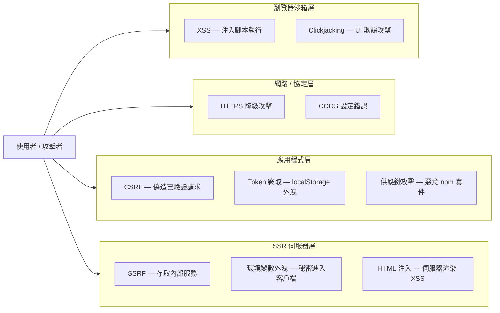

資訊安全不是後端的責任。從來都不是——但「後端會驗證所有東西」這個假設，在業界悄悄流傳了多年，也悄悄地影響了前端團隊的優先順序。隨著前端應用承擔更多責任，這個假設變得愈來愈危險：伺服器端渲染（SSR）、透過 Server Actions 直接存取資料庫、環境變數管理、token 儲存決策、HTML 清理。每一項責任都帶有資安意涵，而這些意涵都屬於前端工程師。

投資不足的後果是具體的。客戶端渲染應用中的 XSS 漏洞可以大規模竊取 session token 並冒充使用者。內部 API 上錯誤配置的 CORS 政策允許未經授權的跨來源讀取。儲存在 localStorage 中的 token 在 XSS 後仍然存在，並能實現持久的帳號接管。受攻陷的 npm 套件會靜默地將惡意程式碼注入正式環境 bundle，並推送給數百萬使用者。信任使用者控制的標頭而未進行驗證的 SSR 框架，可以被變成攻擊內部基礎架構的代理。這些攻擊路徑都不需要直接攻陷後端——它們全都從前端進入。

向全端 JavaScript 框架的轉變，也以帶有資安意涵的方式模糊了前端與後端程式碼的界線。Next.js Server Action 在某種意義上是前端程式碼，因為它由前端團隊撰寫和部署，但它執行在 Node.js 伺服器上，並可存取環境變數、資料庫和內部服務。「前端」的分類不再能可靠地預測一段程式碼在資安堆疊中的位置。重要的是理解每段程式碼接觸什麼、被信任做什麼，以及如果攻擊者能影響其輸入，他們可以做什麼。

這個類別涵蓋每位前端工程師都應該理解的資安主題，目標不是提供一份檢查清單，而是建立一套思維模型。資訊安全是整個系統的屬性，任何單一控制措施——即便是配置完美的 Content Security Policy（CSP）——都無法單獨讓應用程式變得安全。理解攻擊從哪裡進入、它們利用什麼弱點、以及各層控制如何相互支撐，才是真正的目標。

這個類別的文章是為了建構生產應用的工程師而寫的——不是為了資安專家。它們強調在日常前端工作中出現的決策：token 使用哪種儲存方式、配置哪些 CSP 指令、如何撰寫不外洩密鑰的 server component、什麼使 CORS 政策安全或過於寬鬆。對於處理使用者資料或驗證的應用程式工程師而言，這個層次的資安知識已不再是選項。

## 前端攻擊面

現代前端應用的攻擊面橫跨四個不同的層。攻擊者鮮少需要突破所有層次；單一個弱點就已足夠。

瀏覽器沙箱層是多數工程師思考資安的起點，這有其道理：XSS 與 Clickjacking 是高頻率、高影響力的漏洞，直接以使用者為攻擊目標。但僅止於此是不夠的。網路層決定瀏覽器如何執行同源隔離，以及連線是否可能被靜默降級。應用程式層處理偽造請求、竊取憑證，以及受攻陷的依賴套件。SSR 伺服器層——在純 SPA 時代根本不存在的層次——將伺服器端漏洞引入了原本純屬客戶端的領域。

## 為何前端工程師需要負責資訊安全

常見的思維模型是：前端是不受信任的使用者輸入領域，後端才是真正的資安重鎮。這個模型在幾個方面是錯誤的。

**Token 儲存是前端的決策。** 存取 token 存放在哪裡——HttpOnly cookie、localStorage，還是 sessionStorage——決定了它可以如何被竊取。這個決策由前端程式碼決定。後端就算簽發了安全的 token，也無法補救前端將其儲存在 XSS payload 可以讀取的地方。

**CSP 由應用程式團隊配置。** Content Security Policy 以 HTTP 回應標頭的方式傳遞，但政策本身——允許哪些來源執行腳本、載入字型、發出請求——是由建構應用程式的團隊撰寫和維護的。撰寫 API 端點的後端開發者，並不是列舉前端所有 CDN 來源的適當人選。

**HTML 清理發生在渲染層。** 當使用者產生的內容流入 DOM 時，渲染層必須對其進行清理。React 的 JSX 編碼能防止一般的注入，但逃生出口——`dangerouslySetInnerHTML`——完全繞過了這道保護。每次使用這個 API 都是明確決定接受原始 HTML，而這個決定需要搭配 DOMPurify 或同等的清理工具。

**SSR 將伺服器責任移入前端程式碼庫。** Next.js Server Actions、React Server Components，以及類似的模式，執行的是由前端團隊撰寫、審查和部署的 Node.js 程式碼。這些程式碼的資安屬性——是否驗證重定向、是否在回傳資料前檢查授權、是否將環境變數外洩到序列化的 payload 中——都是前端工程的責任。

**供應鏈攻擊以 JavaScript 生態系為目標。** npm registry 與團隊所依賴的套件都是攻擊面。被攻陷的套件、依賴混淆（dependency confusion）、以及拼字攻擊（typosquatting）都是真實的攻擊向量。Lockfile、完整性驗證，以及 CI 稽核步驟，都是前端建構系統的責任。

**可觀測性完成了整個循環。** 資安控制措施本質上是預防性的，但沒有任何預防措施是完美的。錯誤監控、請求日誌記錄和異常偵測，讓團隊能夠偵測攻擊已成功的時機——識別竊取嘗試、異常的驗證模式，或指示 SSRF 的意外伺服器對伺服器流量。資訊安全與可觀測性是互補的學科，而非獨立的學科。

## 設計思考

三個思維模型值得帶入每一個資安決策。

**單一個被打破的假設就能造成真實的資安事件。** React 能防止 XSS——這在很大程度上是正確的。React 的模板引擎預設會對輸出進行編碼，不會執行任意 HTML。但只要開發者將使用者提供的內容傳給 `dangerouslySetInnerHTML` 而未先經過清理工具處理，這道保護就消失了。框架的保證是有條件的，而這個條件在呼叫點往往不可見。從框架繼承的資安屬性，其強度取決於在每個可能繞過保證的邊界所施加的紀律。

**SSR 將攻擊面擴展到伺服器領域。** 純 SPA 沒有伺服器進程可供攻擊，攻擊面僅限於在瀏覽器中執行的內容。一旦應用程式引入 SSR——無論是 Next.js、Nuxt、SvelteKit，還是 Angular Universal——就新增了一個 Node.js 伺服器進程。這個進程可以被操縱，使其向內部服務發送請求（SSRF）。它將資料序列化為 HTML 傳送至客戶端，如果環境變數或密鑰不經意地包含在序列化過程中，就會暴露。NEXT_PUBLIC_ 命名慣例的存在正是因為框架在編譯時無法判斷哪些變數可以安全地嵌入客戶端 bundle；這個判斷留給工程師自行決定。這些不是抽象的擔憂：Angular SSR 的 SSRF CVE 於 2025 年和 2026 年相繼揭露，Astro 及其他框架也出現過類似模式。

**資訊安全是整個系統的屬性，而非個別功能的屬性。** 配置完善、阻擋內聯腳本的 CSP，在 XSS 向量存在於從允許的 CDN 來源載入的依賴套件中時，是無濟於事的。HttpOnly cookie 能防止 JavaScript 直接讀取 token，但如果缺少 SameSite 屬性和 CSRF token，CSRF 仍然可以使用那個 token 偽造請求。這些控制措施是設計來協同運作的。實作一層但讓相鄰層保持薄弱，會產生虛假的安全感。深度防禦（defense in depth）的意義在於：當一個控制措施失效——在系統的生命週期內，終究有一個會失效——下一層能夠限制損害的範圍。

這種分層思考也改變了資安工作的範疇界定方式。僅稽核應用程式程式碼本身是不夠的。建構管線、npm 依賴樹、伺服器發出的 HTTP 標頭、驗證期間設置的 cookie 旗標、部署平台中的環境變數配置——所有這些都是攻擊面的一部分，都需要前端工程團隊做出慎重的決策。

## 四層攻擊面詳解

攻擊面圖示中的四個層次並非理論抽象——每一個都直接對應到造成正式環境事件、公開揭露和真實使用者資料外洩的攻擊模式。以下說明以足夠的背景擴展每個層次，幫助理解攻擊為何有效，以及哪一類控制措施能應對這些攻擊。類別導覽中的連結文章對防禦措施有更深入的探討。

理解全部四個層次很重要，因為攻擊者經常跨層次串聯漏洞。瀏覽器沙箱層的 XSS 漏洞可能是進入點，但目標是應用程式層的 token 竊取。網路層的 CORS 設定錯誤可能允許跨來源讀取 CSRF token，然後在應用程式層被用來偽造請求。以分層思考有助於在事件發生前識別這些串聯攻擊。

**瀏覽器沙箱層 — XSS 與 Clickjacking**

Cross-site scripting（XSS）利用瀏覽器的執行模型：任何進入 DOM 並執行的腳本都被視為可信任的。攻擊者透過表單輸入、URL 參數、Markdown 渲染器、富文字編輯器，或第三方 widget 整合來注入腳本。一旦執行，注入的腳本就以與應用程式自身程式碼相同的權限運作——它可以讀取 cookie（在可存取的情況下）、從儲存空間竊取 token、擷取按鍵輸入，並代表使用者發出已驗證的請求。

Clickjacking 使用不可見或透明的 iframe，將合法頁面疊加在攻擊者控制的頁面之上，誘騙使用者點擊他們看不到的介面元素。一個以為自己在點擊確認按鈕的使用者，可能正在觸發底層合法頁面上的轉帳、權限授予，或帳號操作。`X-Frame-Options` 和 CSP 的 `frame-ancestors` 指令是主要防禦手段。

**網路 / 協定層 — HTTPS 降級與 CORS**

HTTPS 保護傳輸中的資料，但前提是連線無法被強制降級為 HTTP。HTTP Strict Transport Security（HSTS）指示瀏覽器在聲明的期間內拒絕對某個網域的未加密連線，防止降級攻擊。沒有 HSTS，中間人可以在應用程式有機會重定向到 HTTPS 之前，攔截使用者的初始 HTTP 請求。

CORS 設定錯誤是細微但高影響力漏洞的來源。瀏覽器預設執行同源政策；CORS 標頭放寬了這些限制。過於寬鬆的 `Access-Control-Allow-Origin: *` 允許任何來源讀取回應。在沒有對照允許清單驗證的情況下動態反映請求的 `Origin` 標頭，會完全消除跨來源保護。這些設定錯誤常見於後來被推送到正式環境的內部 API 和測試環境。

**應用程式層 — CSRF、Token 竊取與供應鏈**

CSRF 利用瀏覽器自動在跨來源請求中包含憑證（cookie）的行為。攻擊者頁面上提交到合法端點的表單，會帶上使用者的 session cookie。瀏覽器發送它；伺服器接受它。反 CSRF token（同步 token 模式）、SameSite cookie 屬性，以及雙重提交 cookie，透過要求偽造請求必須持有攻擊者無法讀取的秘密來打破這個模式。

透過 XSS 竊取 token，正是儲存決策至關重要的原因。存放在 localStorage 的 token，頁面上的任何 JavaScript 都可以存取——包括注入的腳本。存放在 HttpOnly cookie 的 token，JavaScript 則無法讀取。兩種儲存機制都不是無條件安全的：cookie 仍會自動發送且受到 CSRF 威脅；localStorage token 對 CSRF 免疫，但對 XSS 脆弱。這個選擇是兩種威脅模型之間的取捨，而不是在安全與不安全之間選擇。

供應鏈攻擊以建構管線為目標。被攻陷的 npm 套件——無論是透過帳號劫持、依賴混淆，還是拼字攻擊——都可能將惡意程式碼注入正式環境 bundle。Lockfile 能防止意外的版本升級。Subresource Integrity（SRI）雜湊值允許瀏覽器驗證從 CDN 載入的資源未被篡改。這些控制對於在生態系中具有廣泛影響力的套件尤其重要。

**SSR 伺服器層 — SSRF、環境變數外洩與伺服器渲染注入**

當前端包含伺服器進程時，漏洞面向擴展至包含典型的伺服器漏洞。SSRF 允許攻擊者使應用程式的伺服器向內部服務發送請求——雲端 metadata 端點、內部 API、資料庫——這些服務無法從公開網路存取。從使用者提供的標頭（Host、X-Forwarded-For）建構內部 fetch URL 而未經驗證的 SSR 框架，容易受到這種模式攻擊。

環境變數外洩發生在屬於純伺服器端程式碼的密鑰，不經意地被序列化到客戶端可存取的 payload 中。在 React Server Components 中，任何作為 prop 傳遞的值都會跨越伺服器-客戶端邊界，包含在傳送到瀏覽器的 RSC payload 中。資料庫連線字串或 API 密鑰透過這個邊界傳遞後，任何能讀取網路回應的人都可以存取。強制執行嚴格的命名慣例（NEXT_PUBLIC_ 僅用於公開變數），以及標記共用模組中 process.env 引用的程式碼審查實踐，是實際的防禦手段。

伺服器渲染 HTML 注入是在伺服器層的 XSS：使用者提供的資料在未經跳脫的情況下直接插入伺服器渲染的 HTML，可能產生含有腳本的標記，瀏覽器在任何客戶端清理執行之前就會執行這些標記。預設自動跳脫的模板引擎能防止此問題；手動將字串插入 HTML 則不行。在錯誤頁面和備用模板中風險最高，因為開發者在這些地方往往不會像對待主要渲染路徑那樣嚴格對待。

Prototype pollution 是 SSR 引入的另一個 Node.js 特有問題。JavaScript 的 prototype 鏈可以被精心設計的物件輸入修改，讓攻擊者得以注入影響應用程式全域行為的屬性。不加防護地合併或複製物件的函式庫是常見的攻擊向量。由於 SSR 在同一個 Node.js 進程中一個接一個地處理請求，成功的 prototype pollution 攻擊不只影響攻擊者的 session，而是影響此後由該進程處理的每個請求。

## 類別導覽

這個類別涵蓋七個具體主題領域，每一個都建立在上述攻擊面模型之上。

- **[FEE-1201：Content Security Policy](./1201.md)** — 如何撰寫、部署和迭代能有效限制腳本執行與資源載入的 CSP，而不破壞應用程式。涵蓋 nonce、hash、strict-dynamic，以及 reporting。

- **[FEE-1202：驗證與 Token 儲存](./1202.md)** — localStorage、sessionStorage，以及 HttpOnly cookie 用於 token 儲存的資安取捨。涵蓋存取 token 的生命週期、refresh token 輪換，以及在 XSS 和 CSRF 威脅模型下各種儲存選擇的含義。

- **[FEE-1203：XSS 防禦](./1203.md)** — 框架層級的保護、使用 DOMPurify 進行清理、Trusted Types，以及繞過 React 預設輸出編碼的特定模式。

- **[FEE-1204：CORS 與 CSRF](./1204.md)** — 同源政策、CORS 標頭語意、CSRF 攻擊機制，以及阻止偽造請求的防禦模式：SameSite cookie、反 CSRF token，以及雙重提交 cookie。

- **[FEE-1205：供應鏈安全](./1205.md)** — npm lockfile、套件完整性驗證、CDN 資源的 Subresource Integrity（SRI），以及將 `npm audit` 整合到 CI 管線中。

- **[FEE-1206：HTTPS、安全標頭與 Cookie 屬性](./1206.md)** — HSTS 配置、完整的安全回應標頭集合（`X-Frame-Options`、`X-Content-Type-Options`、`Referrer-Policy`、`Permissions-Policy`），以及 cookie 屬性語意（`Secure`、`HttpOnly`、`SameSite`）。

- **[FEE-1207：SSR 與 Server Component 安全](./1207.md)** — SSR 框架中的 SSRF、Next.js 及其他 meta-framework 的環境變數衛生、Server Actions 授權，以及 Node.js 渲染路徑中的 prototype pollution。

每篇文章都設計為可以獨立使用——讀取與當前決策相關的那篇即可。然而按順序閱讀，能建立完整連貫的資安態勢。CSP 和 XSS 防禦涵蓋瀏覽器沙箱層；驗證和 CORS/CSRF 涵蓋應用程式層；供應鏈和安全標頭橫跨建構與協定層；SSR 安全涵蓋全端前端框架引入的伺服器層。跨類別的可觀測性與 CI/CD 連結，透過涵蓋偵測和密鑰管理，完成了整個循環。

## 相關 FEE

- [FEE-1201：Content Security Policy](./1201.md) — 限制瀏覽器中可執行的內容
- [FEE-1202：驗證與 Token 儲存](./1202.md) — Token 的存放位置與資安取捨
- [FEE-1203：XSS 防禦](./1203.md) — 清理、DOMPurify、Trusted Types
- [FEE-1204：CORS 與 CSRF](./1204.md) — 同源政策與跨站請求偽造
- [FEE-1205：供應鏈安全](./1205.md) — npm lockfile、SRI、CI 稽核
- [FEE-1206：HTTPS、安全標頭與 Cookie 屬性](./1206.md) — HSTS、安全標頭、cookie 旗標
- [FEE-1207：SSR 與 Server Component 安全](./1207.md) — SSRF、環境變數外洩、Server Actions
- [FEE-1401：可觀測性與錯誤追蹤總覽](../Observability%20and%20Error%20Tracking/1400.md) — 在正式環境中偵測資安事件
- [FEE-1506：CI 中的密鑰、環境變數與資安](../CI%20CD%20and%20Deployment/1506.md) — CI 密鑰管理
