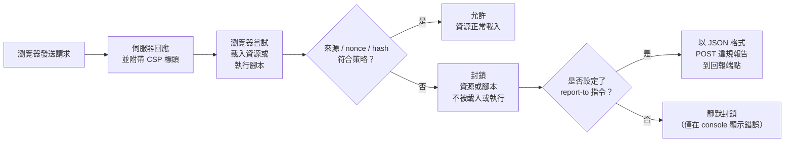

Content Security Policy（CSP）是一個 HTTP 回應標頭，用來告知瀏覽器哪些來源可以載入資源、哪些腳本可以在頁面上執行。它是瀏覽器內建的機制，用於限制跨站腳本攻擊（XSS）的破壞範圍：即使攻擊者成功將惡意腳本注入 HTML，正確設定的 CSP 仍可阻止該腳本執行。CSP 無法取代輸入清理（input sanitization）或輸出編碼（output encoding），那些仍是第一道防線。CSP 是第二道防線，在第一道防線失守時限制損害範圍。

CSP 以單一 HTTP 標頭交付，包含以分號分隔的指令列表。每個指令針對特定的資源類型：`script-src` 控制 JavaScript、`style-src` 控制 CSS、`img-src` 控制圖片、`connect-src` 控制 fetch 和 XMLHttpRequest、`font-src` 控制字型、`frame-ancestors` 防止點擊劫持（clickjacking）、`base-uri` 阻止 base 標籤注入、`form-action` 限制表單提交目標。`default-src` 作為所有未明確列出的資源類型的回退。有兩個指令是例外：`base-uri` 和 `form-action` **不**繼承 `default-src`，必須始終明確設定。

還有兩個指令對於反映當前實務的策略同樣重要。`upgrade-insecure-requests` 會讓瀏覽器自動將 HTTP 子資源請求改寫為 HTTPS，補上 `frame-ancestors` 與白名單類指令未涵蓋的混合內容（mixed content）漏洞。`require-trusted-types-for 'script'` 搭配 `trusted-types` 政策白名單，會在賦值當下阻擋 `innerHTML` 等 DOM XSS 匯聚點（sink），而非僅在網路邊界把關；此機制已於 2026 年 2 月在所有主流瀏覽器達到 Baseline（Chrome/Edge 自 2020 年即支援、Safari 26、Firefox 2026），[FEE-1203](./1203.md) 說明它如何與 CSP 整合。

CSP 承諾與現實中大多數已部署策略之間的落差相當大。在 `script-src` 中加入 `unsafe-inline` 的策略完全無法提供 XSS 防護。透過 `<meta>` 標籤交付的策略無法執行 `frame-ancestors`，也無法傳送違規報告。以網域白名單為基礎建立的策略，通常可透過受損的 CDN 或白名單網域上的 JSONP endpoint 繞過。理解失敗模式與理解各個指令本身同等重要。

## 設計思考

### 為何 `unsafe-inline` 會完全破壞 CSP 的防護效果

CSP `script-src` 的核心目標是確保只有伺服器明確提供的腳本才能執行。`'unsafe-inline'` 徹底打破了這個保證。當 `'unsafe-inline'` 存在且沒有搭配 nonce 或 hash 時，頁面上所有內聯腳本都被允許執行，包括攻擊者透過 XSS 漏洞注入的腳本。瀏覽器無法分辨你的內聯腳本與攻擊者的腳本之間的差異。結果就是回應標頭中有 CSP，卻完全沒有 XSS 防護。

nonce 或 hash 的存在改變了這個等式：當 `script-src` 中存在 nonce 時，支援 nonce 的瀏覽器會完全忽略 `'unsafe-inline'` 關鍵字。nonce 成為唯一有效的驗證關卡。

### 為何在強制執行前必須使用 report-only 模式

設定錯誤的 CSP 會在真實使用者面前悄悄地破壞合法腳本。只要漏掉一種資源類型，例如某個第三方客服聊天元件的腳本，該功能就會停止載入，且不會顯示使用者能採取行動的錯誤訊息。`Content-Security-Policy-Report-Only` 是唯一安全的新策略部署方式：它在不阻擋任何內容的情況下回報違規，讓你能在真實流量中迭代調整策略，再切換到強制執行模式。直接部署到強制執行模式，代表使用者最先看到的漏配跡象，就是功能故障本身。

### 為何 `strict-dynamic` 是現代的最佳方式

網域白名單在三個面向失效：

1. **白名單網域可以載入更多腳本。** 如果 `cdn.example.com` 在白名單上，而它提供 JSONP endpoint，攻擊者可以利用該 endpoint 注入任意腳本。CDN 網域是受信任的，但它的 JSONP 回應不應該是。
2. **第三方腳本會載入它們自己的依賴項。** 你的分析腳本從 `analytics.example.com` 載入，而它又從 `telemetry.example.com` 載入遙測資料，這個你忘記加入白名單。分析工具因此失效，你又加了 `telemetry.example.com`，而白名單也隨著每個新依賴不斷增長。
3. **CDN 網址會改變。** 某個供應商從 `cdn.vendor.com` 換到 `assets.vendor.io`。你必須在推送更新之前先修改生產環境的 CSP 標頭。

`'strict-dynamic'` 以不同方式解決這個問題：一旦腳本透過受信任的 nonce 或 hash 被載入，它動態建立並插入 DOM 的所有子腳本也會被信任。strict-dynamic 的信任來自伺服器核發的 nonce，因此 CDN 網域永遠不需要出現在策略中。

### 為何 `base-uri 'none'` 容易被遺忘，卻代價昂貴

能夠注入 `<base href="https://evil.example.com">` 標籤的攻擊者，可以改寫頁面上所有相對 URL 所依據的基準位址。即使在嚴格的 `script-src` 策略下，這仍是實際的風險：nonce 對腳本的授權與其來源無關，因此一個原本以 nonce 授權的 `<script src="/main.js">`，其相對路徑若被注入的 base 標籤改寫，仍會執行，只是改從攻擊者的伺服器載入。表單的 action 目標同樣容易受到這種手法影響。`base-uri 'none'` 能封鎖 base 標籤注入本身，消除這個破口；搭配 `form-action 'self'`，則能一併封鎖表單重新導向的變種攻擊。

## 最佳實踐

**必須（MUST）正確產生 nonce。** Nonce 必須（MUST）是密碼學上安全的隨機值，且絕對不能跨請求重複使用。web.dev 建議理想情況下應有至少 128 位元的熵；`crypto.randomBytes(16).toString('base64')` 恰好能提供 128 位元。`crypto.randomUUID()`（Node 14.17+）在實務上也可接受，不過扣除固定的版本與變體位元後，UUIDv4 實際只帶有 122 位元的隨機性。絕對不要從請求資料（時間戳記、使用者 ID、IP 位址）衍生 nonce：任何確定性函數都容易遭受預測攻擊。

**必須（MUST）透過 HTTP 標頭設定 CSP，而非 `<meta>` 標籤。** 必須（MUST）以 HTTP 回應標頭交付 CSP，以確保 `frame-ancestors` 和 `report-to` 能正常運作。`<meta http-equiv="Content-Security-Policy">` 的形式存在，但有幾個重要限制：
- `<meta>` 不支援 `frame-ancestors`——它會被靜默忽略
- `<meta>` 不支援 `report-to` 與 `report-uri`
- `<meta>` 標籤只能保護文件中它之後出現的內容，之前的內容不受保護
- 能夠在你的 `<meta>` 標籤之前注入 HTML 的攻擊者，可以讓它失效

**應該（SHOULD）從 `default-src 'none'` 開始。** 應該（SHOULD）從所有資源都被封鎖開始，只添加應用程式確實需要的資源類型。這迫使你思考每一種資源類型。從 `'self'` 或寬鬆的預設值開始的策略，往往會默默地累積越來越多的例外。

**應該（SHOULD）使用 csp-evaluator.withgoogle.com 進行測試。** 貼入你的策略並檢查高嚴重性警告。應該（SHOULD）在上線前審查所有發現項目。常見問題：白名單網域有 JSONP endpoint、沒有 nonce 的 `unsafe-inline`、缺少 `object-src`、缺少 `base-uri`。

**必須（MUST）先部署 report-only 模式。** 即使是對已在強制執行模式的策略進行更新，也必須（MUST）先在 staging 環境切換到 report-only，然後在生產環境部署 report-only，收集至少一兩天的資料，理想情況下應涵蓋完整的流量週期，最後再切換到強制執行模式。

### 推行策略

安全的 CSP 推行遵循以下順序：

1. **審查** — 列出應用程式載入的所有資源類型和來源。檢查 network 面板、HAR 檔案和第三方腳本文件。
2. **起草** — 撰寫策略。從 `default-src 'none'` 開始，逐一加入每種資源類型及其允許的來源，並加入 nonce 骨架。
3. **在 staging 環境使用 report-only** — 以 `Content-Security-Policy-Report-Only` 部署。觸發所有使用者流程：登入、結帳、已驗證的頁面、錯誤狀態、電子郵件連結。
4. **修復違規** — 對於每個違規，決定處理方式：將腳本移至外部檔案（首選）、添加 nonce、計算 hash，或在確實無法避免的情況下添加來源（絕對不使用萬用字元）。
5. **在生產環境使用 report-only** — 將 report-only 標頭推送至生產環境。在不同瀏覽器和地區監控違規端點至少一兩天，理想情況下應涵蓋完整的流量週期。
6. **強制執行** — 從 `Content-Security-Policy-Report-Only` 切換為 `Content-Security-Policy`。保留 `report-to`——強制執行模式下的違規仍會被回報。
7. **持續監控** — 將強制執行模式下的新違規視為程式缺陷。違規報告的突然增加，通常意味著某個合法的整合改變了其資源載入方式。

這個順序對面向使用者的應用程式而言不是可選的。略過 report-only 階段，等於讓正式環境的流量成為你的測試套件。

## 運作原理



這個檢查對每次資源載入和每次腳本執行嘗試都會進行。對於內聯腳本，瀏覽器會比較 nonce 屬性值與 `script-src` 中的 nonce。對於基於 hash 的策略中的內聯腳本，瀏覽器會計算腳本內容的 SHA-256，並與 `script-src` 中的 hash 比對。對於外部腳本，瀏覽器會檢查 `src` URL 的來源是否符合允許的來源。`'strict-dynamic'` 增加了一條傳播規則：透過 nonce 或 hash 被允許的腳本，可以自行建立並插入新的 script 元素，這些元素也會被信任。

## 範例

### 1. 包含 nonce 和 strict-dynamic 的完整 CSP 標頭

```http
Content-Security-Policy:
  default-src 'none';
  script-src 'nonce-GENERATED_NONCE_HERE' 'strict-dynamic';
  style-src 'self' 'nonce-GENERATED_NONCE_HERE';
  img-src 'self' data: https://cdn.example.com;
  font-src 'self' https://fonts.gstatic.com;
  connect-src 'self' https://api.example.com;
  frame-ancestors 'none';
  base-uri 'none';
  form-action 'self';
  report-to csp-endpoint;
```

`GENERATED_NONCE_HERE` 在每次請求時，都會被替換為實際產生的 nonce 值。

### 2. 在 Next.js proxy 中產生 nonce 並設定 CSP 標頭

範例 2 與範例 3 皆以 Next.js App Router 作為具代表性的 SSR 執行環境示範。任何能在每個請求時執行程式碼的伺服器，例如 Express 的 middleware 函式或 Fastify 的 hook，都能以相同方式在回應送出前產生 nonce 並設定標頭。Next.js 16 已將 `middleware.ts` 檔案慣例與其匯出的 `middleware` 函式，重新命名為 `proxy.ts` / `proxy`；`middleware.ts` 目前仍可運作，但已被標記為棄用，且僅能在 Edge 執行。

```ts
// proxy.ts
import { NextResponse } from 'next/server';
import type { NextRequest } from 'next/server';

export function proxy(request: NextRequest) {
  const nonce = Buffer.from(crypto.randomUUID()).toString('base64');

  const csp = [
    `default-src 'none'`,
    `script-src 'nonce-${nonce}' 'strict-dynamic'`,
    `style-src 'self' 'nonce-${nonce}'`,
    `img-src 'self' data:`,
    `font-src 'self'`,
    `connect-src 'self'`,
    `frame-ancestors 'none'`,
    `base-uri 'none'`,
    `form-action 'self'`,
    `report-to csp-endpoint`,
  ].join('; ');

  const requestHeaders = new Headers(request.headers);
  requestHeaders.set('x-nonce', nonce);
  requestHeaders.set('Content-Security-Policy', csp);

  const response = NextResponse.next({ request: { headers: requestHeaders } });
  response.headers.set('Content-Security-Policy', csp);

  return response;
}

export const config = {
  matcher: [
    {
      // 略過 Next.js 內部路由、靜態檔案與預先擷取（prefetch）請求
      source: '/((?!_next/static|_next/image|favicon.ico).*)',
      missing: [
        { type: 'header', key: 'next-router-prefetch' },
        { type: 'header', key: 'purpose', value: 'prefetch' },
      ],
    },
  ],
};
```

### 3. 在 Next.js Server Component 中讀取 nonce 並傳遞給 Script

```tsx
// app/layout.tsx
import { headers } from 'next/headers';
import Script from 'next/script';

export default async function RootLayout({
  children,
}: {
  children: React.ReactNode;
}) {
  const nonce = (await headers()).get('x-nonce') ?? '';

  return (
    <html lang="en">
      <body>
        {children}
        {/* next/script 搭配 nonce：Next.js 會將其套用至產生的標籤 */}
        <Script
          src="https://analytics.example.com/script.js"
          strategy="afterInteractive"
          nonce={nonce}
        />
      </body>
    </html>
  );
}
```

Next.js 從 proxy 設定的請求標頭中讀取 nonce，並在 SSR 過程中將其套用到它渲染的 `<script>` 標籤。

### 4. 設定 report-to 回報端點

```http
Reporting-Endpoints: csp-endpoint="https://example.com/api/csp-reports"
Content-Security-Policy:
  default-src 'none';
  script-src 'nonce-NONCE' 'strict-dynamic';
  report-to csp-endpoint;
```

瀏覽器會以 `Content-Type: application/reports+json` 將 JSON 陣列形式的報告物件 POST 到該端點。除了 CSP 專屬的 `body` 之外，每個項目還會帶有 `age`、`type`、`url` 與 `user_agent`：

```json
[
  {
    "age": 53531,
    "type": "csp-violation",
    "url": "https://example.com/dashboard",
    "user_agent": "Mozilla/5.0 (Windows NT 10.0; Win64; x64) AppleWebKit/537.36 (KHTML, like Gecko) Chrome/127.0.0.0 Safari/537.36",
    "body": {
      "documentURL": "https://example.com/dashboard",
      "blockedURL": "inline",
      "effectiveDirective": "script-src-elem",
      "originalPolicy": "default-src 'none'; script-src 'nonce-abc123' 'strict-dynamic'; report-to csp-endpoint",
      "disposition": "enforce",
      "statusCode": 200
    }
  }
]
```

為了向後相容不支援 Reporting API 的瀏覽器，應同時保留 `report-uri`：

```http
Content-Security-Policy:
  default-src 'none';
  script-src 'nonce-NONCE' 'strict-dynamic';
  report-uri /api/csp-reports;
  report-to csp-endpoint;
```

### 5. 為靜態內聯腳本計算 CSP hash

如果你有一個永遠不會更改的靜態內聯腳本（例如一個小型初始化程式碼片段），可以計算其 SHA-256 hash 並將其加入 `script-src`，而不需要使用 nonce。

```ts
// 建置時工具或 Node.js REPL
import { createHash } from 'crypto';

const scriptContent = `window.__APP_VERSION__ = '1.0.0';`;

const hash = createHash('sha256')
  .update(scriptContent)
  .digest('base64');

console.log(`'sha256-${hash}'`);
// 'sha256-UOw65fU38NkMVZ5unKKQJg32RLUfOK99MdyOmCRu2Io='
```

將輸出直接使用在 CSP 標頭中：

```http
Content-Security-Policy:
  script-src 'sha256-UOw65fU38NkMVZ5unKKQJg32RLUfOK99MdyOmCRu2Io=' 'strict-dynamic';
  object-src 'none';
  base-uri 'none';
```

Hash 必須與腳本內容的確切位元組相符，包括空白字元。即使只是結尾多一個換行符號，也會改變 hash 並導致腳本被封鎖。

## 常見錯誤

**省略 `default-src` 回退（fallback）指令。**
沒有 `default-src`，任何未明確列出的指令都不受限制。`default-src 'none'` 是最安全的起點：它為你提供所有允許資源類型的明確清單。

**在 `script-src` 中使用 `*`（萬用字元）。**
`script-src` 中的萬用字元允許任何來源提供腳本，等同於完全沒有 `script-src`。即使是 `https:` 也過於寬鬆：它允許任何 HTTPS URL，包括許多擁有 JSONP endpoint 且可被利用的來源。

**忘記 `base-uri` 和 `form-action` 指令。**
這兩個指令不受 `default-src` 覆蓋。如果你省略它們，它們會退回到允許一切，而非遵循你的 `default-src` 策略。這意味著攻擊者可以注入一個指向攻擊者控制的伺服器的 `<base>` 標籤或表單，而 CSP 無法阻止它。

**只對 HTML 回應套用 CSP。**
設定身份驗證 Cookie 或重新導向到敏感頁面的 API 端點，即使沒有完整的資源策略，也可以從 `frame-ancestors` 和 `form-action` 限制中受益。在 API 回應上使用 CSP 標頭並不常見，但並非毫無意義。

**混淆 `'none'` 與缺少指令的差異。**
`frame-ancestors 'none'` 明確禁止所有嵌入——如果你的應用程式不應該被放入 iframe，這就是你需要的設定。完全省略 `frame-ancestors` 會將決定權交給瀏覽器預設值，而瀏覽器預設允許同源嵌入，且可能被舊版 `X-Frame-Options` 行為進一步放寬。請明確設定：`'none'` 表示指令已設定並被強制執行；缺少則表示指令不存在且未受保護。

**在靜態網站生成（SSG）輸出中使用 nonce。**
Nonce 必須在伺服器端逐請求產生。如果你的建置步驟生成以靜態資源形式提供的 HTML 檔案（沒有伺服器端渲染），在建置時嵌入的 nonce 對每個訪客都是相同的。一個永遠不變的 nonce 無法提供任何保護：攻擊者只要觀察到一次，就能將它重複用於精心構造的攻擊酬載。對靜態資源使用基於 hash 的 CSP，或者切換到 SSR 來處理需要基於 nonce 策略的頁面。

這個後果在 Next.js App Router 中格外明顯。採用基於 nonce 的 CSP，會迫使每個讀取 nonce 的頁面轉為動態渲染，使這些路由無法使用靜態網站生成（SSG）、增量靜態再生（ISR）、部分預先渲染（PPR），以及 CDN 邊緣快取。proxy 在每個請求時都會設定一個全新的 nonce，因此讀取它的頁面就無法在建置時預先渲染；部分路由需要明確呼叫 `await connection()` 才能選擇進入動態渲染。若靜態最佳化的重要性高於基於 nonce 的腳本授權，Next.js 實驗性的子資源完整性（Subresource Integrity, SRI）支援，或是基於 hash 的 CSP，都能讓頁面保持靜態。

## 相關 FEE

- [FEE-1200：Security 總覽](./1200.md) — 本類別的背景說明與前端攻擊面
- [FEE-1203：XSS 防護](./1203.md) — CSP 是繼清理之後的第二道防線；Trusted Types 與 CSP 整合運作
- [FEE-1206：HTTPS、安全標頭與 Cookie 屬性](./1206.md) — CSP 與 HSTS、X-Content-Type-Options 及其他安全標頭並列使用
- [FEE-1207：SSR 與 Server Component 安全](./1207.md) — 在 SSR middleware（Next.js、Nuxt）中產生 nonce

## 參考資料

- [Content Security Policy — MDN Web Docs](https://developer.mozilla.org/en-US/docs/Web/HTTP/CSP)
- [CSP: script-src — MDN](https://developer.mozilla.org/en-US/docs/Web/HTTP/Headers/Content-Security-Policy/script-src)
- [Mitigate XSS with a strict Content Security Policy — web.dev](https://web.dev/articles/strict-csp)
- [CSP Evaluator — Google](https://csp-evaluator.withgoogle.com/)
- [Content Security Policy Level 3 — W3C](https://www.w3.org/TR/CSP3/)
- [Next.js CSP 文件](https://nextjs.org/docs/app/guides/content-security-policy)
