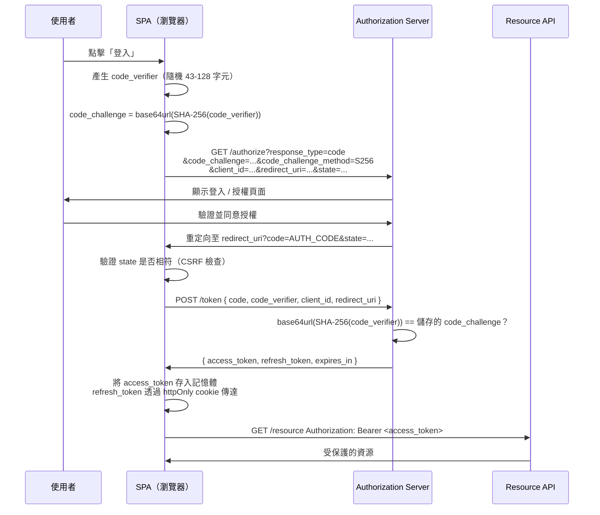

瀏覽器應用程式的身份驗證比表面上看起來困難得多。瀏覽器環境對秘密資訊天生充滿敵意：JavaScript 可被任何能在頁面上載入資源的人執行，DOM 可被注入的腳本讀取，localStorage 等儲存機制對同一 origin 上的每個腳本都是開放的——無論是你的程式碼還是攻擊者的。關於 token 存放位置、如何取得以及如何更新的決策，決定了使用者的 session 能否在供應鏈攻擊、XSS 漏洞或 authorization code 被截奪的情況下倖存。

本文涵蓋 SPA 中 token 身份驗證的運作機制：JWT 的結構與原理、access token 和 refresh token 在瀏覽器中的最佳存放位置、OAuth 2.0 / OIDC Authorization Code Flow 搭配 PKCE 的流程（以及 implicit flow 被廢棄的原因），以及讓 session 管理更具韌性的模式——refresh token rotation、silent refresh 與 reuse detection。

## 原則

- **MUST NOT** 將 access token 或 refresh token 儲存於 `localStorage` 或 `sessionStorage`
- **SHOULD** 將 access token 存放於記憶體（module 變數或 React state），將 refresh token 存放於 `httpOnly` cookie
- **SHOULD** 為 refresh token cookie 設定 `Secure`、`SameSite=Strict`（或 `Lax`）及 `HttpOnly` 屬性
- **MUST** 對所有 SPA 的 OAuth 2.0 Authorization Code flow 使用 PKCE（RFC 7636）
- **MUST NOT** 使用 OAuth 2.0 implicit flow
- **MUST** 在每個請求中於伺服器端驗證 JWT 的 `exp`（有效期）、`aud`（受眾）及 `iss`（發行者）——絕對不能依賴用戶端來執行這些驗證
- **SHOULD** 在每次使用後 rotate refresh token，並在偵測到 reuse 時撤銷該使用者的所有 token

## 設計思考

### 為何 httpOnly cookie 比 localStorage 更適合儲存 token

`localStorage` 是瀏覽器腳本執行環境的一部分。你的 origin 上的每個腳本——你自己的程式碼、從 CDN 載入的第三方 analytics snippet、chat widget、lazy-load 的 A/B testing 函式庫——都可以呼叫 `localStorage.getItem('access_token')`。頁面上任何地方存在的單一 XSS 向量就足以將儲存的所有內容洩漏出去。攻擊者不需要特別針對你的身份驗證程式碼；他們只需注入一段讀取 storage 並將其傳送到遠端伺服器的腳本即可。

`httpOnly` cookie 有著不同的屬性：瀏覽器完全不將它們暴露給 JavaScript。`document.cookie` API 無法讀取 `httpOnly` cookie，`localStorage.getItem`、`fetch` 或任何其他 JavaScript API 也不行。Cookie 在 `Cookie` 請求 header 中傳輸，只有伺服器可以設定或讀取它。即使 JavaScript 環境遭到完全入侵，XSS 攻擊也無法直接竊取 `httpOnly` cookie。

代價是 cookie 需要 CSRF 保護。由於瀏覽器會自動在每個符合 origin 的請求中傳送 cookie，攻擊者可以從第三方頁面使用 `<form>` 或 `fetch` 偽造已驗證的請求。`SameSite=Strict`（或 `Lax`）在現代瀏覽器上基本上可以緩解此問題，但需要跨站傳送 cookie 的應用程式仍需要獨立的 CSRF token。詳細的 CSRF 處理請參閱 [FEE-1204](./1204.md)。

### 為何 PKCE 對 SPA 是強制要求

SPA 是 public client。它們無法保守秘密——任何嵌入 JavaScript bundle 中的值，都可以被任何載入頁面的人提取。傳統的 OAuth 2.0 `client_secret` 流程假設的是 confidential client（在伺服器端保存秘密的伺服器），而 SPA 並非如此。

PKCE 無需靜態秘密即可解決這個問題。用戶端產生一個 `code_verifier`——一個隨機字串——並透過應用 SHA-256 和 base64url encoding 從中衍生出 `code_challenge`。Challenge 在初始請求中傳送給 authorization server。當用戶端之後用 authorization code 換取 token 時，也會同時傳送 `code_verifier`。伺服器重新計算 challenge 並驗證是否相符。攔截到 authorization code 的攻擊者無法用它換取 token，因為他們沒有原始的 `code_verifier`——它只存在於用戶端的記憶體中。`code_verifier` 是每次請求獨立且短暫存在的；它不是可以嵌入 bundle 的靜態秘密。

### 為何 implicit flow 被廢棄

Implicit flow 直接在 URL fragment（`#access_token=...`）中回傳 token。這導致 token 出現在瀏覽器歷史記錄、伺服器存取日誌、傳送給第三方資源的 `Referer` header，以及任何日誌中介軟體中。Fragment 也可透過 `location.hash` 被頁面上的所有腳本存取。Implicit flow 在引入多個 token 洩漏向量的同時，並未比 Authorization Code flow 提供任何有意義的安全優勢。OAuth 2.0 Security Best Current Practices（RFC 9700）和 OAuth 2.0 for Browser-Based Applications 草案均正式廢棄了它。

### 為何 in-memory + silent refresh 是 SPA 最高安全等級的模式

In-memory 儲存——module 作用域的變數或 React context，而非 `localStorage` 或 `sessionStorage`——讓 access token 遠離任何持久化或共享的儲存媒介。其他腳本無法讀取它，因為 module 作用域不是全域可存取的。它不會跨 tab 持久化。XSS 攻擊無法透過任何標準 API 將其洩漏（儘管足夠深層的 JS 環境入侵理論上可以）。

代價是 in-memory token 無法在頁面重新整理後存活。Silent refresh 解決了這個問題：當 access token 接近過期時（約在其生命週期的 75-80%），應用程式使用 `httpOnly` refresh token cookie 在背景向 token endpoint 發出請求。這個過程對使用者是不可見的。在新頁面載入或開啟新分頁時，應用程式會在啟動時立即執行 silent refresh，以在不需要完整登入重定向的情況下恢復 session。

複雜度的代價是真實存在的：silent refresh 需要仔細的排程、對過期 refresh token 的錯誤處理，以及跨 tab 的協調。對於值得付出這種複雜度的應用程式而言，這是瀏覽器環境中最強大的 token 儲存模式。

### 為何 JWT payload 可被讀取不是 bug

JWT 是被簽署的，而非加密的。Header 和 payload 是 base64url encoded——沒有混淆，沒有加密。任何人都可以在瀏覽器的 DevTools、jwt.io 或用一行 Node.js 程式碼解碼它們。簽章保證的是完整性：它證明 token 是由持有簽署金鑰的伺服器發行的，且自發行以來未被篡改。它不保證機密性。敏感的 claim——個人識別資訊、內部權限結構、任何不應被持有 token 的人讀取的內容——不應放入 JWT 中。對於高敏感度資料，使用不透明的 session 識別符，並在伺服器端查找敏感欄位。

## 最佳實踐

**設定較短的 access token 生命週期。** 15 分鐘是廣泛採用的預設值。較短的生命週期限制了被竊取的 access token 可被使用的時間窗口。根據你的 refresh 機制調整：如果 silent refresh 已就位，15 分鐘是合適的；如果使用者必須重新驗證才能更新，為了可用性可能需要更長的生命週期。

**在每次使用後 rotate refresh token。** 每次使用 refresh token 取得新 access token 時，發行新的 refresh token 並使前一個失效。這限制了被竊取的 refresh token 的重播窗口：如果攻擊者取得並使用了某個 refresh token，合法用戶端的下一次 refresh 嘗試將使用舊 token 失敗。伺服器可以偵測這種 reuse——如果一個已失效的 refresh token 被再次提交，這表示可能存在入侵，應撤銷該使用者的所有 token，強制重新驗證。

**主動排程 silent refresh。** 在 access token 生命週期的 75-80% 時嘗試 refresh，而非在過期後。在背景 refresh 請求期間 access token 過期會造成明顯的驗證失敗。提前更新確保連續性，並在第一次嘗試失敗時提供重試的空間。

**設定所有 cookie 安全屬性。** 對於 `httpOnly` refresh token cookie：`HttpOnly`（禁止 JS 存取）、`Secure`（僅 HTTPS）、`SameSite=Strict` 或 `SameSite=Lax`（CSRF 緩解）、`Path` 限定在 token endpoint（`/auth/token`），以及與 refresh token 生命週期相符的 `Max-Age`。生產環境的 cookie 絕對不要省略 `Secure`。

**在每個請求中於伺服器端驗證 JWT。** 檢查 `exp`（token 是否過期？）、`iss`（此 token 是否來自預期的發行者？）以及 `aud`（此 token 是否針對此服務？）。不要快取驗證結果——上次請求時有效的 token 在此期間可能已被撤銷或過期。同時在驗證程式碼中明確指定預期的簽署演算法；絕對不要允許從 token header 取得演算法（這是「algorithm confusion」攻擊向量）。

**絕對不要記錄 token。** Access token 和 refresh token 不得出現在應用程式日誌、錯誤追蹤 payload（Sentry breadcrumb、Datadog trace）、analytics 事件或任何其他可觀測性管道中。日誌中的 token 意味著 token 暴露給所有有日誌存取權限的人。特別要審查錯誤處理器和請求攔截器，以防意外記錄 Authorization header 值。

**在登入時 rotate session 識別符。** 當使用者驗證時，即使已存在 session 識別符，也要發行新的。這可以防止 session fixation 攻擊——攻擊者預先設置已知的 session ID，然後等待受害者驗證進入其中。

## 運作原理

SPA 透過外部 OAuth 2.0 / OIDC authorization server 進行身份驗證的 PKCE 流程：



## 範例

### 1. PKCE 流程——產生 verifier、challenge 並交換 code

```ts
// pkce.ts — PKCE 流程的工具函式

/**
 * 產生加密隨機的 code_verifier。
 * RFC 7636 要求使用非保留字元集的 43-128 個字元。
 */
export function generateCodeVerifier(): string {
  const array = new Uint8Array(32); // 32 bytes → 43 字元 base64url 輸出
  crypto.getRandomValues(array);
  return base64urlEncode(array);
}

/**
 * 使用 S256 方法從 code_verifier 衍生 code_challenge。
 * code_challenge = BASE64URL(SHA-256(ASCII(code_verifier)))
 */
export async function generateCodeChallenge(verifier: string): Promise<string> {
  const encoder = new TextEncoder();
  const data = encoder.encode(verifier);
  const hash = await crypto.subtle.digest('SHA-256', data);
  return base64urlEncode(new Uint8Array(hash));
}

function base64urlEncode(buffer: Uint8Array): string {
  return btoa(String.fromCharCode(...buffer))
    .replace(/\+/g, '-')
    .replace(/\//g, '_')
    .replace(/=/g, '');
}

// auth.ts — 發起與完成 PKCE 流程

const AUTH_SERVER = 'https://auth.example.com';
const CLIENT_ID = 'my-spa-client';
const REDIRECT_URI = 'https://app.example.com/callback';

export async function initiateLogin(): Promise<void> {
  const verifier = generateCodeVerifier();
  const challenge = await generateCodeChallenge(verifier);

  // State 用於防止重定向的 CSRF
  const state = base64urlEncode(crypto.getRandomValues(new Uint8Array(16)));

  // 僅在重定向往返期間將 verifier 和 state 存入 sessionStorage
  // （它們是短暫的，只在重定向過程中需要）
  sessionStorage.setItem('pkce_verifier', verifier);
  sessionStorage.setItem('oauth_state', state);

  const params = new URLSearchParams({
    response_type: 'code',
    client_id: CLIENT_ID,
    redirect_uri: REDIRECT_URI,
    code_challenge: challenge,
    code_challenge_method: 'S256',
    state,
    scope: 'openid profile email',
  });

  window.location.href = `${AUTH_SERVER}/authorize?${params}`;
}

export async function handleCallback(
  searchParams: URLSearchParams
): Promise<{ accessToken: string }> {
  const code = searchParams.get('code');
  const state = searchParams.get('state');
  const storedState = sessionStorage.getItem('oauth_state');
  const verifier = sessionStorage.getItem('pkce_verifier');

  // 立即清除——這些是一次性使用的
  sessionStorage.removeItem('pkce_verifier');
  sessionStorage.removeItem('oauth_state');

  if (!code || !state || !verifier) {
    throw new Error('callback 中缺少 PKCE 參數');
  }

  // 驗證 state 以防止重定向的 CSRF
  if (state !== storedState) {
    throw new Error('State 不符——可能的 CSRF 攻擊');
  }

  const response = await fetch(`${AUTH_SERVER}/token`, {
    method: 'POST',
    headers: { 'Content-Type': 'application/x-www-form-urlencoded' },
    body: new URLSearchParams({
      grant_type: 'authorization_code',
      code,
      code_verifier: verifier,
      client_id: CLIENT_ID,
      redirect_uri: REDIRECT_URI,
    }),
    credentials: 'include', // 允許伺服器設定 httpOnly refresh token cookie
  });

  if (!response.ok) {
    throw new Error('Token 交換失敗');
  }

  const { access_token } = await response.json();
  // access_token 存入記憶體；refresh_token 在伺服器設定的 httpOnly cookie 中
  return { accessToken: access_token };
}
```

### 2. In-memory token store 搭配 silent refresh

```ts
// token-store.ts — 帶有背景 refresh 的 in-memory access token

let accessToken: string | null = null;
let refreshTimer: ReturnType<typeof setTimeout> | null = null;

const TOKEN_ENDPOINT = '/auth/token';

export function setAccessToken(token: string, expiresIn: number): void {
  accessToken = token;
  scheduleRefresh(expiresIn);
}

export function getAccessToken(): string | null {
  return accessToken;
}

export function clearAccessToken(): void {
  accessToken = null;
  if (refreshTimer !== null) {
    clearTimeout(refreshTimer);
    refreshTimer = null;
  }
}

/**
 * 在 token 生命週期的 80% 時排程 silent refresh。
 * expiresIn 單位為秒（標準 OAuth 2.0 回應欄位）。
 */
function scheduleRefresh(expiresIn: number): void {
  if (refreshTimer !== null) clearTimeout(refreshTimer);

  // 在 80% 生命週期時 refresh——在過期前提供 20% 的緩衝
  const refreshAt = expiresIn * 0.8 * 1000; // 轉換為毫秒

  refreshTimer = setTimeout(async () => {
    await silentRefresh();
  }, refreshAt);
}

/**
 * 使用 httpOnly refresh token cookie 靜默取得新 access token。
 * 瀏覽器會自動傳送 cookie——JS 無法存取 refresh token。
 */
export async function silentRefresh(): Promise<boolean> {
  try {
    const response = await fetch(TOKEN_ENDPOINT, {
      method: 'POST',
      headers: { 'Content-Type': 'application/x-www-form-urlencoded' },
      body: new URLSearchParams({ grant_type: 'refresh_token' }),
      credentials: 'include', // 傳送 httpOnly refresh token cookie
    });

    if (!response.ok) {
      // Refresh token 過期或被撤銷——使用者必須重新驗證
      clearAccessToken();
      return false;
    }

    const { access_token, expires_in } = await response.json();
    setAccessToken(access_token, expires_in);
    return true;
  } catch {
    clearAccessToken();
    return false;
  }
}

/**
 * 在頁面載入 / 新分頁時恢復 session。
 * 立即嘗試 silent refresh；如果有效 session 存在則回傳 true。
 */
export async function restoreSession(): Promise<boolean> {
  return silentRefresh();
}
```

### 3. 伺服器端 httpOnly cookie 設定

```ts
// 伺服器端（Node.js / Express）——在成功交換後發行 token

import { Response } from 'express';

interface TokenPair {
  accessToken: string;
  refreshToken: string;
  accessTokenExpiresIn: number; // 秒
  refreshTokenExpiresIn: number; // 秒
}

function issueTokens(res: Response, tokens: TokenPair): void {
  // Refresh token → httpOnly cookie，不放入回應 body
  res.cookie('refresh_token', tokens.refreshToken, {
    httpOnly: true,       // JavaScript 無法存取
    secure: true,         // 僅 HTTPS——絕不透過明文 HTTP 傳送
    sameSite: 'strict',   // 禁止跨站傳送——緩解 CSRF
    path: '/auth/token',  // 將 cookie 限定在 token endpoint
    maxAge: tokens.refreshTokenExpiresIn * 1000, // 轉換為毫秒
  });

  // Access token → 僅在回應 body（用戶端存入記憶體）
  res.json({
    access_token: tokens.accessToken,
    token_type: 'Bearer',
    expires_in: tokens.accessTokenExpiresIn,
    // 注意：refresh_token 刻意從 body 中省略
  });
}

// Refresh endpoint——讀取 httpOnly cookie，發行新 token pair（rotation）
async function handleRefresh(req: any, res: Response): Promise<void> {
  const refreshToken = req.cookies['refresh_token'];

  if (!refreshToken) {
    res.status(401).json({ error: 'no_refresh_token' });
    return;
  }

  const result = await tokenService.rotateRefreshToken(refreshToken);

  if (result.status === 'reuse_detected') {
    // 偵測到被竊取的 refresh token 重播——撤銷整個 session family
    await tokenService.revokeAllForUser(result.userId);
    res.clearCookie('refresh_token', { path: '/auth/token' });
    res.status(401).json({ error: 'token_family_compromised' });
    return;
  }

  if (result.status === 'invalid') {
    res.clearCookie('refresh_token', { path: '/auth/token' });
    res.status(401).json({ error: 'invalid_refresh_token' });
    return;
  }

  issueTokens(res, result.tokens);
}
```

### 4. 伺服器端 JWT 驗證

```ts
// jwt-validation.ts — 在伺服器上驗證每個傳入的 JWT

import { jwtVerify, createRemoteJWKSet } from 'jose';

const JWKS_URI = 'https://auth.example.com/.well-known/jwks.json';
const EXPECTED_ISSUER = 'https://auth.example.com';
const EXPECTED_AUDIENCE = 'https://api.example.com';

// 快取 JWKS fetcher——它會自動處理 key rotation
const JWKS = createRemoteJWKSet(new URL(JWKS_URI));

interface ValidatedClaims {
  sub: string;
  iss: string;
  aud: string | string[];
  exp: number;
  iat: number;
  [key: string]: unknown;
}

/**
 * 驗證 access token JWT。
 * 如果 token 無效、過期、issuer 錯誤或 audience 錯誤則拋出錯誤。
 * 永遠不要靜默地捕捉這些錯誤——拋出錯誤意味著請求未授權。
 */
export async function validateAccessToken(token: string): Promise<ValidatedClaims> {
  const { payload } = await jwtVerify(token, JWKS, {
    issuer: EXPECTED_ISSUER,     // 驗證 iss claim
    audience: EXPECTED_AUDIENCE, // 驗證 aud claim
    algorithms: ['RS256'],       // 明確固定演算法——永遠不要信任 header
    // jose 會自動驗證 exp（過期時拋出）
  });

  return payload as ValidatedClaims;
}

// Express middleware
export async function requireAuth(req: any, res: any, next: any): Promise<void> {
  const authHeader = req.headers['authorization'];

  if (!authHeader?.startsWith('Bearer ')) {
    res.status(401).json({ error: 'missing_token' });
    return;
  }

  const token = authHeader.slice(7);

  try {
    req.user = await validateAccessToken(token);
    next();
  } catch (err) {
    // 不要記錄 token 值——只記錄錯誤類型
    const message = err instanceof Error ? err.message : 'unknown';
    res.status(401).json({ error: 'invalid_token', detail: message });
  }
}
```

## 常見錯誤

**「因為 JWT 已簽署」而將其存入 localStorage。** 簽署防止的是篡改，而非竊取。被竊取的已簽署 token 是完全有效的——伺服器無法區分合法使用者和提交其 token 的攻擊者。簽章不是防竊取機制；它是完整性機制。

**使用相同的 token 同時用於身份驗證和 CSRF 保護。** CSRF token 必須與驗證憑證分開。如果你將 access token 存入 cookie，你需要一個額外的 CSRF token，讓 JavaScript 可以讀取它（存入非 httpOnly cookie 或 in-memory 中），以便作為請求 header 傳送。將 access token 本身作為 CSRF header 傳送會失去意義：能讀取 access token 的攻擊者也能偽造 CSRF header。

**不在伺服器端驗證 JWT 有效期。** 伺服器不能信任用戶端不傳送過期的 token。攻擊者會從其用戶端程式碼中移除有效期檢查，或直接構造請求。每次請求都必須在伺服器端驗證 `exp`，無一例外。

**在應用程式日誌或錯誤追蹤中記錄 token。** 由 Express middleware 記錄的 Authorization header 值、包含完整請求 header dump 的 Sentry breadcrumb、帶有 `access_token` 欄位的 Datadog trace——所有這些都將 token 暴露給有權存取這些系統的所有人。在寫入日誌前清除 token 值。明確審查請求日誌 middleware 和錯誤處理器。

**「因為文件是 2016 年寫的」而使用 implicit flow。** 舊版指南和較舊的 provider 文件仍然描述 implicit flow。在所有當前的 OAuth 2.0 安全文件中它已被廢棄。實作 PKCE；任何不支援 PKCE 的 OAuth provider 都不應用於新的 SPA 整合。

**信任 JWT header 中的 `alg` 欄位。** 用於驗證 token 的簽署演算法應在伺服器的驗證邏輯中寫死。如果伺服器接受 token header 中列出的任何演算法，攻擊者可以製作一個 `"alg": "none"`（不需要簽章）的 token，或使用公鑰作為 HMAC 秘密將 RS256 切換為 HS256。始終明確固定預期的演算法。

**在偵測到 reuse 時不撤銷整個 token family。** 如果一個 refresh token 被使用兩次——在正常的 rotation 下這應該是不可能的——正確的回應不只是拒絕第二次使用。這表示在某個時間點 refresh token 被竊取並被重播。攻擊者和合法使用者都持有副本。撤銷該使用者的所有 token 強制重新驗證，防止攻擊者的副本繼續產生有效的 access token。

## 相關 FEE

- [FEE-1200: 安全概覽](./1200.md) — 分類脈絡與前端攻擊面
- [FEE-1203: XSS 防護](./1203.md) — XSS 是 localStorage token 竊取的主要機制
- [FEE-1204: CORS 與 CSRF](./1204.md) — 基於 cookie 的驗證需要 CSRF 保護；SameSite cookie 互動
- [FEE-1206: HTTPS、安全 Header 與 Cookie 屬性](./1206.md) — session cookie 的 Secure、HttpOnly、SameSite cookie 屬性
- [FEE-1207: SSR 與 Server Component 安全](./1207.md) — SSR fetch 呼叫中的 cookie 轉發及 server component 中的 token 驗證

## 參考資料

- [OAuth 2.0 for Browser-Based Apps — IETF Draft](https://datatracker.ietf.org/doc/html/draft-ietf-oauth-browser-based-apps)
- [Proof Key for Code Exchange — RFC 7636](https://datatracker.ietf.org/doc/html/rfc7636)
- [OAuth 2.0 Security Best Current Practices — RFC 9700](https://datatracker.ietf.org/doc/html/rfc9700)
- [OWASP: Session Management Cheat Sheet](https://cheatsheetseries.owasp.org/cheatsheets/Session_Management_Cheat_Sheet.html)
- [OWASP: JSON Web Token Cheat Sheet](https://cheatsheetseries.owasp.org/cheatsheets/JSON_Web_Token_for_Java_Cheat_Sheet.html)
- [JWT — jwt.io Introduction](https://jwt.io/introduction)
