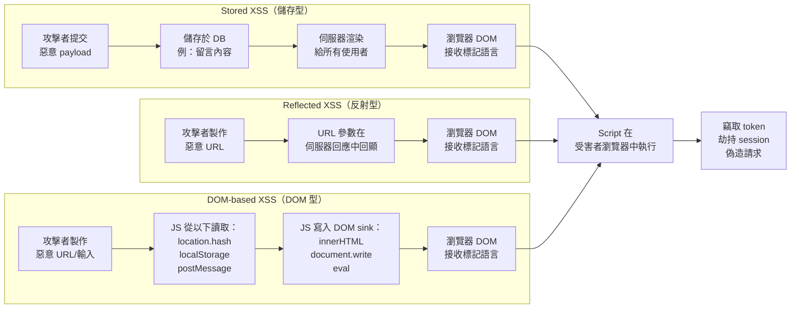

跨網站指令碼（XSS）是網頁應用程式中普遍的用戶端漏洞類型。取得 XSS 執行權的攻擊者可在受害者瀏覽器中、以應用程式的 origin 執行任意 JavaScript：讀取 localStorage 中的 token、竊取非 `httpOnly` 的 cookie、偽造已驗證的請求、劫持 session、甚至改寫整個頁面。攻擊面不只限於表單和留言框：任何從攻擊者控制的資料到 DOM sink 的路徑都是潛在的 XSS 向量。

React 和 Vue 等框架透過自動跳脫文字節點，讓許多常見模式變得更安全。但它們並沒有消除 XSS。它們只是將風險集中在特定位置。剩餘的風險集中在開發者為了渲染 rich text 而使用的逃生艙口：React 的 `dangerouslySetInnerHTML`、Vue 的 `v-html`，以及原生 JavaScript 中直接的 `innerHTML` 賦值。每一處使用這些 API 卻未事先清潔（sanitize）輸入的地方，都是一個作用中的 XSS 漏洞。

本文涵蓋三種 XSS 類型、現代框架如何（以及如何做不到）防護它們、如何正確使用 DOMPurify、應避免哪些 DOM sink，以及 Trusted Types API 如何在瀏覽器層級強制執行，在執行時期捕捉每一個不安全的 sink 賦值。

## 設計思考

### 為何框架無法讓你免於 XSS

React 的 JSX 和 Vue 的模板語法在設計上會自動跳脫文字節點插值。框架將這些值視為文字而非標記語言，防止最直接的情境：使用者輸入中的 `<script>alert(1)</script>` 會以文字形式顯示在頁面上，而非被執行。

逃生艙口完全繞過了這層保護：React 中的 `dangerouslySetInnerHTML`，以及 Vue 中的 `v-html`。API 名稱中的「dangerously」是任何前端 API 中最直白的警告：這個詞並非裝飾性的。對未經 sanitize 的輸入使用它，等同於直接寫 `element.innerHTML = userInput`。Vue 的 `v-html` 帶有相同的風險，只是名稱沒有那麼明顯。

現實世界中的失敗模式可以預期：團隊推出了渲染使用者提交的 rich text 功能（個人簡介、留言、商品描述）。預設的框架跳脫讓 rich text 無法正常顯示，於是開發者使用了 `v-html` 或 `dangerouslySetInnerHTML`。開發者沒有 sanitize 輸入，因為他們以為框架已經處理好了安全性。應用程式現在在那個渲染欄位上有了一個 Stored XSS 漏洞。

第三方函式庫讓問題更加複雜。Rich text 編輯器、Markdown 渲染器或圖表函式庫，都可能在內部使用 `innerHTML` 而未加以說明。框架的文字跳脫只適用於你透過 JSX 或模板語法渲染的內容，無法保護透過函式庫內部 DOM 操作繞過的內容。

### 為何 DOMPurify 是業界標準

對 HTML sanitization 的直觀做法是使用拒絕清單（denylist）：找到並移除 `<script>` 標籤、去除 `onerror` 屬性。這種做法極易被繞過。HTML 解析相當複雜、瀏覽器有其特有行為，而實現 script 執行的方式多達數十種：

- `<scr<script>ipt>alert(1)</scr</script>ipt>`：外層 `<script>` 被移除後，內層的才被暴露出來
- ``：在無害元素上使用事件處理器
- `<svg/onload=alert(1)>`：帶有內聯處理器的 SVG
- `<a href="javascript:alert(1)">click me</a>`：javascript: 協定
- `<math href="javascript:alert(1)">`：MathML 命名空間混淆

DOMPurify 使用允許清單（allowlist）模型：定義哪些元素和屬性是被允許的，使用瀏覽器自身的 HTML 解析器解析輸入，並移除所有不在清單上的內容。只有明確被允許的標籤和屬性才能存活。拒絕清單必須預測每一種可能的編碼技巧；允許清單只需定義你想允許的內容。

DOMPurify 也處理了 mutation XSS（mXSS）：一類在解析時看起來安全，但在重新序列化和重新解析後會變成危險內容的攻擊。這是因為不同的瀏覽器情境（例如 `<table>` 情境與 `<div>` 情境）對相同的標記語言解析方式不同。DOMPurify 使用瀏覽器自身的解析器，緩解了這類攻擊。它也處理了 SVG 和 MathML 命名空間混淆攻擊，這類攻擊透過外來內容情境引入惡意內容。

### 為何 Trusted Types 是未來方向

Trusted Types 是一個在 DOM 層級強制執行政策的瀏覽器 API。當 CSP 指令 `require-trusted-types-for 'script'` 啟用時，瀏覽器會對任何嘗試將純字串賦值給危險 DOM sink 的操作拋出 `TypeError`：`innerHTML`、`outerHTML`、`insertAdjacentHTML`、`document.write` 等。賦值必須透過已註冊的 `TrustedTypePolicy`，並回傳一個 `TrustedHTML` 物件。

實際效果是在執行時期完整審計程式碼庫中每一個不安全的 sink。在強制模式啟用之前，`report-only` 模式會針對每個違規發送 CSP 報告而不阻擋執行。這讓你能在正式環境的程式碼中（包括第三方函式庫中的）找出所有不安全的賦值，然後再開啟阻擋模式。

一旦你建立了一個透過 DOMPurify 路由的政策（`trustedTypes.createPolicy('default', { createHTML: input => DOMPurify.sanitize(input) })`），你就有了縱深防禦：DOMPurify 清潔內容，瀏覽器強制每一個 sink 賦值都經過政策。即使某個繞過 DOMPurify 的注入（例如設定錯誤的 DOMPurify 呼叫），也會被另一層阻擋。

### 為何在渲染時 sanitize 勝過在輸入時 sanitize

在輸入點（表單提交、API 呼叫）sanitize 使用者輸入看起來很有吸引力：清潔一次，到處信任。這在實踐中有幾個問題：

同一個儲存值可能在多個輸出情境中使用：HTML、SQL、shell 指令、JSON、log 條目。每個情境需要不同的跳脫方式。對 HTML 安全的輸出可能仍然對 SQL 有注入風險。針對 HTML 優化的集中式輸入 sanitizer 可能會去除在其他情境中合法的內容。

輸入 sanitization 可能被繞過。資料可以透過跳過輸入驗證層的途徑進入系統：直接的資料庫匯入、管理工具、遷移腳本、第三方整合。

儲存的資料應只被視為資料，而非安全的 HTML。在渲染點進行 sanitize，在你確切知道需要哪種跳脫的輸出情境中進行。

## 最佳實踐

**必須（MUST）以應用程式所需的最嚴格允許清單設定 DOMPurify。** 如果功能只需要粗體、斜體和連結，必須（MUST）準確地設定：`ALLOWED_TAGS: ['b', 'i', 'a', 'p', 'br']` 和 `ALLOWED_ATTR: ['href']`。每一個額外允許的標籤和屬性都擴大了攻擊面。不要從寬鬆的設定開始再逐步限制。從限制開始，依需要擴展。

**應該（SHOULD）使用 `RETURN_DOM_FRAGMENT` 搭配 `appendChild` 取代 `innerHTML` 賦值以獲得額外的安全性。** `DOMPurify.sanitize(input, { RETURN_DOM_FRAGMENT: true })` 回傳一個可附加到目標元素的 `DocumentFragment`。應該（SHOULD）優先使用此模式，因為它能完全避免 `innerHTML` 賦值，也就是 HTML 解析時執行 script 的機制。

**必須（MUST）在將值賦給 `href`、`src` 或 `action` 之前，明確驗證 URL 協定。** 必須（MUST）使用 `new URL(userUrl)` 解析 URL，並對照 `['https:', 'http:', 'mailto:']` 的允許清單檢查 `.protocol`。DOMPurify 的預設設定會去除 `href` 屬性中的 `javascript:` URL，但在完全未通過 DOMPurify 的情況下，對使用點的明確驗證是一個獨立的防禦層。

**應該（SHOULD）先以 report-only 模式採用 Trusted Types。** 這遵循與 CSP 相同的推出模式。應該（SHOULD）設定 `Content-Security-Policy-Report-Only: require-trusted-types-for 'script'` 並收集違規報告。每份報告都識別出一個需要路由經過政策的不安全 DOM sink。只有在正式環境的違規率降到零後，才切換到強制模式。

**應該（SHOULD）建立單一 Trusted Types 政策並將所有 HTML 路由經過它。** 包裝 DOMPurify 的單一命名政策創造了一個單一控制點：你可以審計、更新和測試一個函式。應該（SHOULD）避免在程式碼庫各處建立多個政策，因為這會製造與多個 sanitization 實作相同的維護問題。

**禁止（MUST NOT）將 `textContent` 和 `innerHTML` 互換使用。** `textContent` 賦值為文字值，對任何輸入都是安全的。`innerHTML` 解析 HTML 標記，會執行事件處理器和 script。為了「效能」或「避免雙重跳脫」而從 `textContent` 切換到 `innerHTML`，會引入 XSS。當值來自使用者輸入時，絕不可（MUST NOT）以 `innerHTML` 替代 `textContent`，因為它們是具有根本不同安全屬性的不同 API。

## 運作原理

三種 XSS 類型及其執行 script 的路徑：



DOM-based XSS 的特殊之處在於它完全不涉及伺服器。payload 從 URL 或其他瀏覽器端來源，透過 JavaScript 程式碼直接傳到 DOM sink。伺服器端 sanitization 對此無法提供任何保護。

## 範例

### 1. 危險模式 vs. 安全模式：React

```tsx
import DOMPurify from 'dompurify';

// 不安全——dangerouslySetInnerHTML 使用原始使用者輸入
// 如果 userBio 包含 ，它會被執行
function UnsafeBio({ userBio }: { userBio: string }) {
  return (
    <div
      dangerouslySetInnerHTML={{ __html: userBio }}
    />
  );
}

// 安全——在傳入 dangerouslySetInnerHTML 之前用 DOMPurify 進行 sanitize
function SafeBio({ userBio }: { userBio: string }) {
  const sanitizedHtml = DOMPurify.sanitize(userBio, {
    ALLOWED_TAGS: ['b', 'i', 'em', 'strong', 'a', 'p', 'br'],
    ALLOWED_ATTR: ['href'],
  });

  return (
    <div
      dangerouslySetInnerHTML={{ __html: sanitizedHtml }}
    />
  );
}

// 更好——使用 RETURN_DOM_FRAGMENT 完全避免 innerHTML 賦值
function SaferBio({ userBio }: { userBio: string }) {
  const containerRef = React.useRef<HTMLDivElement>(null);

  React.useEffect(() => {
    if (!containerRef.current) return;

    // 清除之前的內容
    containerRef.current.textContent = '';

    const fragment = DOMPurify.sanitize(userBio, {
      ALLOWED_TAGS: ['b', 'i', 'em', 'strong', 'a', 'p', 'br'],
      ALLOWED_ATTR: ['href'],
      RETURN_DOM_FRAGMENT: true,
    }) as DocumentFragment;

    containerRef.current.appendChild(fragment);
  }, [userBio]);

  return <div ref={containerRef} />;
}
```

### 2. DOMPurify 搭配嚴格的允許清單

```ts
import DOMPurify from 'dompurify';

// 為應用程式的 rich text 使用情境進行一次性設定。
// ALLOWED_TAGS 和 ALLOWED_ATTR 定義允許清單——未列出的任何內容都會被移除。
const RICH_TEXT_CONFIG: DOMPurify.Config = {
  ALLOWED_TAGS: ['p', 'br', 'b', 'i', 'em', 'strong', 'a', 'ul', 'ol', 'li', 'blockquote'],
  ALLOWED_ATTR: ['href', 'rel'],
};

// DOMPurify hook：在 sanitization 完成後、回傳結果之前執行。
// 允許對通過允許清單的元素進行自訂轉換。
DOMPurify.addHook('afterSanitizeAttributes', (node) => {
  // 對每個 <a> 元素，強制設定 rel="noopener noreferrer" 和 target="_blank"
  // 以防止透過 window.opener 的 tab-napping 攻擊
  if (node.tagName === 'A') {
    node.setAttribute('target', '_blank');
    node.setAttribute('rel', 'noopener noreferrer');
  }
});

/**
 * Sanitize 使用者提交的 HTML 以在 rich text 情境中渲染。
 * 回傳安全的 HTML 字串。
 */
export function sanitizeRichText(input: string): string {
  return DOMPurify.sanitize(input, RICH_TEXT_CONFIG) as string;
}

/**
 * Sanitize 並回傳 DocumentFragment 供直接 DOM 插入使用。
 * 完全避免 innerHTML 賦值。
 */
export function sanitizeToFragment(input: string): DocumentFragment {
  return DOMPurify.sanitize(input, {
    ...RICH_TEXT_CONFIG,
    RETURN_DOM_FRAGMENT: true,
  }) as DocumentFragment;
}
```

### 3. URL 協定驗證輔助函式

```ts
/** 允許用於 href 和 src 屬性的協定。 */
const SAFE_URL_PROTOCOLS = new Set(['https:', 'http:', 'mailto:']);

/**
 * 驗證使用者提供的 URL 是否可用於 href、src 或 action 屬性。
 * 如果協定安全則回傳 URL 字串，否則回傳 null。
 *
 * 拒絕 javascript:、data:、vbscript: 及任何非允許清單中的協定。
 *
 * @example
 * validateUrl('https://example.com') // → 'https://example.com'
 * validateUrl('javascript:alert(1)') // → null
 * validateUrl('data:text/html,<script>') // → null
 */
export function validateUrl(rawUrl: string): string | null {
  try {
    const url = new URL(rawUrl);
    if (SAFE_URL_PROTOCOLS.has(url.protocol)) {
      return url.toString();
    }
    return null;
  } catch {
    // URL 解析失敗——不是有效的絕對 URL
    // 只允許以 / 或 ./ 開頭的相對 URL
    if (rawUrl.startsWith('/') || rawUrl.startsWith('./')) {
      return rawUrl;
    }
    return null;
  }
}

// 在元件中的使用方式
function ExternalLink({ href, children }: { href: string; children: React.ReactNode }) {
  const safeHref = validateUrl(href);
  if (!safeHref) {
    // 攻擊者提供的 javascript: URL——渲染為純文字，而非連結
    return <span>{children}</span>;
  }
  return (
    <a href={safeHref} rel="noopener noreferrer" target="_blank">
      {children}
    </a>
  );
}
```

### 4. 包裝 DOMPurify 的 Trusted Types 政策

```ts
import DOMPurify from 'dompurify';

/**
 * 建立一個將所有 HTML 路由經過 DOMPurify 的 Trusted Types 政策。
 * 'default' 政策名稱會在純字串被賦值給 DOM sink 時自動套用——它是備用政策。
 *
 * 瀏覽器支援：Chrome 83+、Edge 83+。
 * Firefox 和 Safari：使用 @w3c/trusted-types polyfill。
 */
function createTrustedTypesPolicy(): TrustedTypePolicy | null {
  if (typeof window === 'undefined' || !window.trustedTypes) {
    return null; // SSR 或不支援的瀏覽器
  }

  try {
    return window.trustedTypes.createPolicy('default', {
      createHTML(input: string): string {
        return DOMPurify.sanitize(input, {
          ALLOWED_TAGS: ['p', 'br', 'b', 'i', 'em', 'strong', 'a', 'ul', 'ol', 'li'],
          ALLOWED_ATTR: ['href', 'rel', 'target'],
        }) as string;
      },
      // 刻意省略 createScript 和 createScriptURL——
      // 我們不希望允許任意的 script 建立。
    });
  } catch {
    // 在某些環境中政策可能已被註冊
    return null;
  }
}

// 在應用程式啟動時初始化一次
export const trustedTypesPolicy = createTrustedTypesPolicy();

/**
 * 建立一個 TrustedHTML 值供 innerHTML 賦值使用。
 * 在不支援的環境中退回以字串形式回傳 DOMPurify 的輸出。
 *
 * 啟用 Trusted Types 後，瀏覽器會對任何不使用 TrustedHTML 值的 innerHTML 賦值
 * 拋出 TypeError——此函式是唯一被允許的路徑。
 */
export function createSafeHtml(input: string): TrustedHTML | string {
  if (trustedTypesPolicy) {
    return trustedTypesPolicy.createHTML(input);
  }
  // 備用方案：sanitize 並回傳字串（無 Trusted Types 強制執行）
  return DOMPurify.sanitize(input) as string;
}
```

在伺服器上啟用 CSP header：

```http
# 先使用 report-only——收集違規報告而不阻擋
Content-Security-Policy-Report-Only: require-trusted-types-for 'script'; report-uri /csp-report

# 在違規率降到零後切換到強制模式
Content-Security-Policy: require-trusted-types-for 'script'
```

### 5. Vue v-html 搭配 sanitization

```vue
<script setup lang="ts">
import { computed } from 'vue';
import DOMPurify from 'dompurify';

const props = defineProps<{
  content: string;
}>();

// 響應式 sanitize——每當 content 改變時重新執行
const safeContent = computed(() =>
  DOMPurify.sanitize(props.content, {
    ALLOWED_TAGS: ['b', 'i', 'em', 'strong', 'a', 'p', 'br', 'ul', 'ol', 'li'],
    ALLOWED_ATTR: ['href', 'rel'],
  })
);
</script>

<template>
  <!--
    v-html 繞過 Vue 的模板跳脫。
    務必綁定已 sanitize 的內容——永遠不要使用原始的 prop。

    不安全：  v-html="content"
    安全：    v-html="safeContent"
  -->
  <div v-html="safeContent" />
</template>
```

## 常見錯誤

**在伺服器端 sanitize 但在用戶端未做。** DOM-based XSS 完全在瀏覽器中發生。payload 源自 `location.hash`、`location.search`、`localStorage`、`postMessage` 或 URL 參數。它被 JavaScript 讀取並寫入 DOM sink，完全不經過伺服器。伺服器端 sanitization 對這類攻擊提供零保護。每一個危險的 DOM 寫入都必須在用戶端、在 DOM 操作的發生點進行 sanitize。

**使用拒絕清單（移除 `<script>` 標籤）。** 拒絕清單必須列舉每一種可能的危險結構。這個集合是無法被完整列舉的：解析器很複雜，HTML 具有容錯性，攻擊者已經幾十年來不斷找到繞過方式。一些來自真實應用程式的繞過方式：`<scr<script>ipt>alert(1)</scr</script>ipt>` 利用了巢狀移除；`` 在允許的元素上使用事件處理器；`<svg/onload=alert(1)>` 使用 SVG 元素；`<a href="javascript:alert(1)">` 使用協定而非元素。允許清單方法移除了整個攻擊面，因為它只允許已知安全的結構。

**使用帶有不安全 sink 的第三方函式庫而未加以審計。** WYSIWYG 編輯器、Markdown 渲染器或圖表函式庫（任何接受使用者提供內容並將其寫入 DOM 的函式庫），都可能在內部使用 `innerHTML`。檢查函式庫是否對其輸入進行 sanitize。如果沒有，在傳入函式庫之前進行 sanitize。如果它提供 sanitizer 設定選項，請使用它。

## 相關 FEE

- [FEE-1200：安全概覽](./1200.md)：分類脈絡與前端攻擊面
- [FEE-1201：Content Security Policy](./1201.md)：CSP 作為對抗 XSS 的第二道防線；Trusted Types 與 CSP 整合
- [FEE-1202：身份驗證與 Token 儲存](./1202.md)：XSS 是 localStorage token 竊取的主要機制
- [FEE-1207：SSR 與 Server Component 安全](./1207.md)：透過未經 sanitize 的 renderToString 輸出產生的伺服器端 XSS

## 參考資料

- [OWASP: Cross Site Scripting Prevention Cheat Sheet](https://cheatsheetseries.owasp.org/cheatsheets/Cross_Site_Scripting_Prevention_Cheat_Sheet.html)
- [OWASP: DOM Based XSS](https://owasp.org/www-community/attacks/DOM_Based_XSS)
- [DOMPurify on GitHub](https://github.com/cure53/DOMPurify)
- [Trusted Types — web.dev](https://web.dev/articles/trusted-types)
- [Trusted Types API — MDN](https://developer.mozilla.org/en-US/docs/Web/API/Trusted_Types_API)
