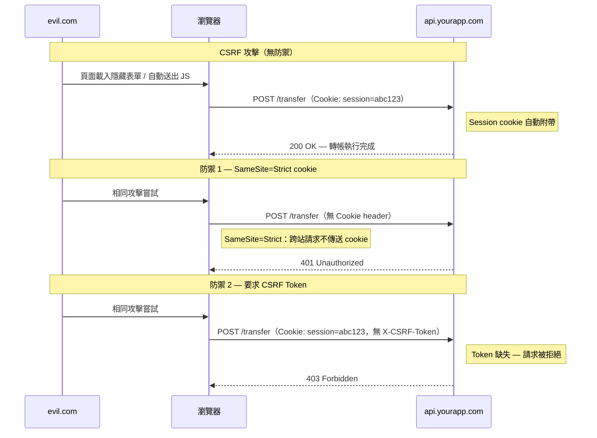
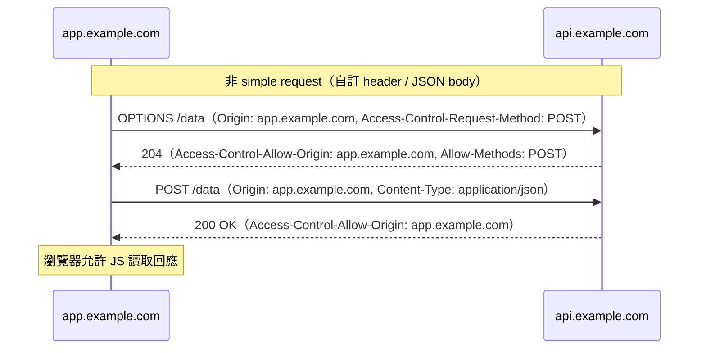

瀏覽器在不同 origin 之間強制維持一道邊界。若沒有這道邊界，任何頁面上的任何腳本都能靜默讀取你的銀行餘額、以你的身份送出表單，或竊取 session cookie。兩個獨立的瀏覽器機制共同管理這道邊界：**同源政策（Same-Origin Policy，SOP）** 限制跨來源頁面能讀取哪些回應；**cookie 傳送規則** 則決定哪些 cookie 會隨請求附帶。CORS 和 CSRF 不是同一個問題 — 它們是同一個底層模型衍生出的兩個不同後果 — 混淆兩者會導致安全性錯誤配置。

CORS（Cross-Origin Resource Sharing，跨來源資源共享）是對同源政策的一種可控放寬機制，允許伺服器宣告特定受信任的 origin 可以讀取其回應。CSRF（Cross-Site Request Forgery，跨網站請求偽造）則是利用瀏覽器自動傳送 cookie 的行為，代表已登入的使用者觸發未授權的狀態變更動作。這兩個問題會相互影響——特別是當 session 認證依賴 cookie 時——但需要個別的防禦措施。

## 原則

- **MUST NOT** 同時設定 `Access-Control-Allow-Origin: *` 與 `Access-Control-Allow-Credentials: true`
- **MUST NOT** 未經過白名單驗證就直接將 `Origin` header 反射回 `Access-Control-Allow-Origin`
- **SHOULD** 在伺服器端維護一份明確的 origin 白名單，只有在請求的 `Origin` 在白名單內時才設定 `Access-Control-Allow-Origin`
- **SHOULD** 對不需要跨站嵌入的應用程式，將 session cookie 設為 `SameSite=Strict`
- **SHOULD** 在無法採用 `SameSite=Strict` 時，對狀態變更端點加入 CSRF token
- **SHOULD** 對所有狀態變更的 API 請求要求自訂 request header（例如 `Content-Type: application/json` 或 `X-Requested-With: XMLHttpRequest`），強制跨來源呼叫觸發 CORS preflight
- **SHOULD** 在所有狀態變更請求中驗證 `Origin` header，作為次要的 CSRF 防禦

## 設計思考

### CORS 是放寬機制，不是保護機制

同源政策本身就已阻擋跨來源讀取。在沒有 CORS header 的情況下，`evil.com` 上的腳本無法讀取 `api.yourapp.com` 的回應——瀏覽器自動強制執行這道邊界。當伺服器加入 `Access-Control-Allow-Origin: *` 時，它是在開放原本不存在的存取權。若開發者加入 CORS header 是因為認為這能「保護」API，其實反而讓資料更容易被存取，而不是更難。CORS header 的用途是授予受信任 origin 存取權（例如讓 `app.example.com` 能呼叫 `api.example.com`），而非限制存取。

這個誤解說明了最常見的 CORS 錯誤配置之一：origin 反射（origin reflection）。伺服器讀取請求中的 `Origin` header 並直接回傳為 `Access-Control-Allow-Origin`。開發者的本意通常是「讓我的特定客戶端能呼叫這個 API」，但實際效果卻是「信任世界上的每一個 origin」，因為瀏覽器送出的任何 `Origin` 值都會被反射回去。Origin 反射等同於 `*`，但更危險——因為它可以搭配 `Access-Control-Allow-Credentials: true`（而 `*` 不能）。

### 為何 CORS 無法防止 CSRF

CORS 控制的是跨來源頁面能否_讀取_回應，並不控制請求是否會被送出。Simple request——使用 `application/x-www-form-urlencoded`、`multipart/form-data` 或 `text/plain` 的 POST，以及 GET 和 HEAD——不論 CORS 政策為何，瀏覽器都會送出。瀏覽器送出請求、伺服器處理請求，CORS header 只決定呼叫端的腳本是否能檢視回應。

`evil.com` 上的 HTML form 可以 POST 到 `api.yourapp.com/transfer-funds`。瀏覽器會送出請求，並自動附帶受害者的 session cookie。伺服器處理轉帳。伺服器上的 CORS header 對這整個過程完全沒有影響——因為 CSRF 攻擊不需要讀取回應，只需要觸發動作即可。

這正是 CORS header 和 CSRF 防護是兩個獨立問題的根本原因。正確設定 CORS 本身無法提供 CSRF 保護。

### 為何 `SameSite=Lax` 是好的預設值，但並非完整保護

現代瀏覽器對未指定 `SameSite` 屬性的新 cookie 預設採用 `SameSite=Lax`。Lax 會阻止 cookie 隨跨站子資源請求（XHR、fetch、``、`<iframe>`）傳送，但允許在頂層導覽（點擊連結、跟隨跳轉）時傳送。這阻擋了最常見的 CSRF 攻擊向量——透過 JavaScript 自動送出的隱藏表單——但留下了一個較窄的攻擊面：若某個狀態變更端點接受 GET 請求，而攻擊者能誘使受害者跟隨連結，cookie 仍然會被傳送。

實務上的啟示是：GET 端點絕對不能有狀態變更的副作用。`SameSite=Lax` 比沒有保護有顯著改善，但它依賴應用程式整體正確遵守 HTTP 動詞語義。

`SameSite=Strict` 則完全封閉這個缺口。Cookie 不會隨任何跨站請求傳送，包括頂層導覽。代價是會破壞依賴從外部網站跳轉後維持 session 狀態的流程——OAuth 跳轉、金流回傳、電子郵件確認連結。對於不需要這些流程的應用程式，`Strict` 是正確選擇。

### 為何自訂 request header 能有效防禦 CSRF

HTML form 和 `` 標籤無法設定任意 HTTP header，只有 XHR 和 Fetch API 可以。包含自訂 header 的跨來源 XHR 和 fetch 請求會觸發 CORS preflight——一個 `OPTIONS` 請求，必須由伺服器明確授權後，實際請求才能送出。若伺服器要求所有狀態變更請求都帶有自訂 header（例如 `Content-Type: application/json` 或 `X-Requested-With: XMLHttpRequest`），則：

1. `evil.com` 上的 HTML form 無法設定該 header——表單送出時不帶該 header，伺服器拒絕請求。
2. `evil.com` 嘗試設定該 header 的跨來源 fetch 會觸發 preflight。伺服器的 CORS 政策不包含 `evil.com` 在白名單內，preflight 失敗，瀏覽器不會送出實際請求。

這使得對所有狀態變更 API 端點要求 `Content-Type: application/json`，不僅是良好的 API 設計實踐，也是有意義的 CSRF 防禦措施。

## 最佳實踐

**在伺服器端維護 origin 白名單。** 將受信任的 origin 集合寫死在程式碼中，只有當傳入的 `Origin` 在白名單內時才設定 `Access-Control-Allow-Origin`。不要用 regex 推導白名單——以 regex 做比對容易被繞過（例如 `https://example.com.evil.com` 匹配 `.*example\.com`）。

```js
const ALLOWED_ORIGINS = [
  'https://app.example.com',
  'https://admin.example.com',
];
```

**在狀態變更請求中驗證 `Origin` header，作為次要 CSRF 防禦。** 即使請求來自同源（例如同源 form），確認 `Origin` 或 `Referer` header 符合已知值是一個低成本的縱深防禦控制。

**對不需要跨站嵌入或 OAuth 跳轉流程的應用程式，在 session cookie 上使用 `SameSite=Strict`。** 需要這些流程時使用 `SameSite=Lax`。除非你在建置刻意跨站嵌入的元件（例如金流 iframe），否則絕不使用 `SameSite=None`；使用時必須搭配 `Secure`。

**對狀態變更的 form 送出使用 CSRF token（synchronizer token 模式）。** 伺服器產生一個每 session 隨機的 token，包含在頁面中（作為隱藏欄位或非 httpOnly cookie），並在每個狀態變更請求中驗證。`evil.com` 上的攻擊者無法讀取你頁面中的 token，因此無法偽造有效的請求。

**對 SPA API 使用 double-submit cookie 模式進行無狀態 CSRF 保護。** 伺服器設定一個非 httpOnly、隨機值的 cookie；JavaScript 客戶端讀取該 cookie 值並以 request header 傳送（`X-CSRF-Token`）；伺服器比對 header 值與 cookie 值。`evil.com` 上的攻擊者無法讀取該 cookie（SOP 阻擋跨來源 cookie 讀取），因此無法設定對應的 header 值。

**對所有狀態變更 API 端點要求 `Content-Type: application/json`。** Form 預設以 `application/x-www-form-urlencoded` 送出。要求 JSON 格式強制跨來源請求使用非 simple 的 content type，觸發 preflight。若 CORS 政策正確，preflight 對未授權的 origin 就會失敗。

## 運作原理



### CORS preflight 流程



## 範例

### 1. 伺服器端 CORS middleware，使用明確 origin 白名單（Node.js/Express）

```js
const ALLOWED_ORIGINS = [
  'https://app.example.com',
  'https://admin.example.com',
];

function corsMiddleware(req, res, next) {
  const origin = req.headers['origin'];

  if (origin && ALLOWED_ORIGINS.includes(origin)) {
    res.setHeader('Access-Control-Allow-Origin', origin);
    res.setHeader('Vary', 'Origin'); // 正確快取所必需
    res.setHeader('Access-Control-Allow-Credentials', 'true');
    res.setHeader('Access-Control-Allow-Methods', 'GET, POST, PUT, DELETE, OPTIONS');
    res.setHeader(
      'Access-Control-Allow-Headers',
      'Content-Type, Authorization, X-CSRF-Token'
    );
    res.setHeader('Access-Control-Max-Age', '86400'); // preflight 快取 24 小時
  }

  if (req.method === 'OPTIONS') {
    return res.sendStatus(204);
  }

  next();
}
```

> 注意：`Vary: Origin` 至關重要。若缺少它，CDN 或共用快取可能將某個 origin 的回應（含 CORS header）返回給另一個 origin 的請求。

### 2. CSRF token 產生與驗證（伺服器端，Express + express-session）

```js
const crypto = require('crypto');

// 產生 CSRF token 並存入 session
function generateCsrfToken(req) {
  if (!req.session.csrfToken) {
    req.session.csrfToken = crypto.randomBytes(32).toString('hex');
  }
  return req.session.csrfToken;
}

// 在狀態變更請求中驗證 CSRF token 的 middleware
function validateCsrfToken(req, res, next) {
  if (['GET', 'HEAD', 'OPTIONS'].includes(req.method)) {
    return next();
  }

  const tokenFromHeader = req.headers['x-csrf-token'];
  const tokenFromSession = req.session.csrfToken;

  if (!tokenFromHeader || !tokenFromSession) {
    return res.status(403).json({ error: 'CSRF token missing' });
  }

  // 使用常數時間比較，防止 timing attack
  const headerBuffer = Buffer.from(tokenFromHeader);
  const sessionBuffer = Buffer.from(tokenFromSession);

  if (
    headerBuffer.length !== sessionBuffer.length ||
    !crypto.timingSafeEqual(headerBuffer, sessionBuffer)
  ) {
    return res.status(403).json({ error: 'CSRF token invalid' });
  }

  next();
}
```

### 3. Double-submit cookie 模式（伺服器設定 cookie；客戶端讀取並以 header 傳送）

```js
// 伺服器：在登入或建立 session 時設定非 httpOnly 的 CSRF cookie
function setCsrfCookie(res) {
  const token = crypto.randomBytes(32).toString('hex');
  res.cookie('csrf-token', token, {
    httpOnly: false,  // 必須讓 JS 可讀取
    secure: true,
    sameSite: 'Strict',
    path: '/',
  });
  return token;
}

// 伺服器：在狀態變更請求中驗證 double-submit
function validateDoubleSubmit(req, res, next) {
  if (['GET', 'HEAD', 'OPTIONS'].includes(req.method)) {
    return next();
  }

  const cookieToken = req.cookies['csrf-token'];
  const headerToken = req.headers['x-csrf-token'];

  if (!cookieToken || !headerToken || cookieToken !== headerToken) {
    return res.status(403).json({ error: 'CSRF validation failed' });
  }

  next();
}
```

### 4. 包含 CSRF token header 的 Fetch 請求（客戶端）

```js
// 從非 httpOnly cookie 讀取 CSRF token
function getCsrfToken() {
  return document.cookie
    .split('; ')
    .find(row => row.startsWith('csrf-token='))
    ?.split('=')[1] ?? '';
}

// 封裝 fetch，在狀態變更請求中自動加入 CSRF token
async function apiFetch(url, options = {}) {
  const method = (options.method ?? 'GET').toUpperCase();
  const isStateMutating = !['GET', 'HEAD', 'OPTIONS'].includes(method);

  const headers = new Headers(options.headers ?? {});

  if (isStateMutating) {
    headers.set('Content-Type', 'application/json');
    headers.set('X-CSRF-Token', getCsrfToken());
  }

  const response = await fetch(url, {
    ...options,
    headers,
    credentials: 'include', // 傳送 httpOnly session cookie
  });

  if (!response.ok) {
    throw new Error(`HTTP ${response.status}: ${response.statusText}`);
  }

  return response.json();
}

// 使用方式
await apiFetch('/api/transfer', {
  method: 'POST',
  body: JSON.stringify({ to: 'alice', amount: 100 }),
});
```

### 5. Session cookie 的安全屬性設定

```js
// Express：設定帶有完整安全屬性的 session cookie
app.use(session({
  secret: process.env.SESSION_SECRET,
  resave: false,
  saveUninitialized: false,
  cookie: {
    httpOnly: true,   // JavaScript 無法存取
    secure: true,     // 僅限 HTTPS
    sameSite: 'strict', // 禁止跨站傳送
    maxAge: 30 * 60 * 1000, // 30 分鐘
    path: '/',
  },
}));
```

```
Set-Cookie: session=abc123; HttpOnly; Secure; SameSite=Strict; Path=/; Max-Age=1800
```

> `SameSite=None` 搭配 `Secure` 是唯一允許跨站傳送 cookie 的配置——僅在明確需要跨站嵌入的元件（金流 iframe、聯合登入元件）中使用。若缺少 `Secure`，現代瀏覽器會靜默丟棄該 cookie。

## 常見錯誤

**將 CORS 視為保護 API 的安全機制。** CORS 控制的是跨來源腳本能否_讀取_回應，不阻止請求本身被送出。Simple request（GET、特定 POST content type）完全繞過 CORS preflight，無條件送出。攻擊者不需要讀取回應就能執行 CSRF 攻擊——只需要請求成功送達即可。

**同時使用 `Access-Control-Allow-Origin: *` 與 `Access-Control-Allow-Credentials: true`。** 瀏覽器拒絕這個組合——帶有 credential 的請求，若伺服器回應的是 `*` 作為允許的 origin，請求會失敗。然而，部分 framework 或 middleware 分別設定這兩個 header，造成本地測試通過、但在不同瀏覽器或實作間行為不一致的配置。涉及 credential 時，務必使用具體的 origin。

**直接將 `Origin` header 反射至 `Access-Control-Allow-Origin`。** 這等同於信任世界上的每一個 origin——包括 `null`（由 `file://` 請求和沙盒化 iframe 送出）、攻擊者控制的 subdomain，以及只差在尾部元件的 origin。Null origin 特別危險：`Access-Control-Allow-Origin: null` 加上 `Access-Control-Allow-Credentials: true` 允許沙盒化 iframe 發出帶有 credential 的跨來源請求。

**使用 `SameSite=None` 但未搭配 `Secure`。** Cookie 被現代瀏覽器靜默丟棄。應用程式在開發環境（通常使用 HTTP 或 localhost）表現正常，但在正式環境失效。使用 `SameSite=None` 時務必搭配 `Secure`。

**假設正確的 CORS 配置能防止 CSRF。** 接受 `application/x-www-form-urlencoded` 或 `multipart/form-data` 的狀態變更端點，不論 CORS 配置為何，都會收到跨來源的 form 送出。CORS 和 CSRF 防護是各自獨立的需求，兩者都必須實作。

**只在非冪等動詞上做 CSRF token 驗證，卻未修正 GET 端點。** `SameSite=Lax` 允許 cookie 隨頂層 GET 導覽傳送。若任何 GET 端點有狀態變更的副作用（例如 `GET /confirm-email?token=...&action=subscribe`），攻擊者仍可透過誘使受害者點擊連結來利用 Lax 的例外情況。GET 端點必須是真正只讀的。

## 相關 FEE

- [FEE-1200: Security Overview](./1200.md) — 分類脈絡與 frontend 攻擊面概覽
- [FEE-1202: Authentication & Token Storage](./1202.md) — 以 cookie 為基礎的認證需要 CSRF 保護；SameSite cookie 的互動關係
- [FEE-1206: HTTPS, Secure Headers & Cookie Attributes](./1206.md) — SameSite cookie 屬性與完整的安全 cookie 配置
- [FEE-1207: SSR & Server Component Security](./1207.md) — SSR API 路由與 Server Action 上的 CORS 配置

## 參考資料

- [Cross-Origin Resource Sharing (CORS) — MDN](https://developer.mozilla.org/en-US/docs/Web/HTTP/CORS)
- [Same-origin policy — MDN](https://developer.mozilla.org/en-US/docs/Web/Security/Same-origin_policy)
- [OWASP: Cross-Site Request Forgery Prevention Cheat Sheet](https://cheatsheetseries.owasp.org/cheatsheets/Cross-Site_Request_Forgery_Prevention_Cheat_Sheet.html)
- [SameSite cookies — web.dev](https://web.dev/articles/samesite-cookies-explained)
- [Fetch metadata request headers — web.dev](https://web.dev/articles/fetch-metadata)
