每一次 HTTPS 連線都從 TLS 握手開始：伺服器提交由受信任憑證機構（CA）簽署的憑證，瀏覽器驗證憑證鏈、確認網域吻合，才建立加密通道。從這一刻起，請求與回應的每一個位元組都在傳輸途中被加密——網路上的攻擊者只能觀察到連線至你網域的事實，無法讀取內容，也無法在串流中注入資料。

單靠加密並不足夠。使用者進入 HTTPS 頁面後，瀏覽器還需要被告知：不要載入 HTTP 子資源（混合內容）、不要讓頁面被嵌入惡意網站的 frame 中、不要猜測回應的 content type、不要把敏感的 referrer 資訊洩漏給第三方。這正是 HTTP 回應標頭的職責。除了標頭之外，承載 session 憑證的 cookie，也必須本身受到保護，以防攔截與 JavaScript 存取。HTTPS、安全標頭與 Cookie 屬性，是同一道防線的三個相扣層次。

沒有任何單一標頭能涵蓋整個攻擊面。HSTS 在請求發出前就強制瀏覽器使用 HTTPS，防止降級攻擊。CSP 與 `X-Content-Type-Options` 防止內容執行攻擊——script 注入與 MIME confusion。`X-Frame-Options` 和 CSP `frame-ancestors` 透過控制哪些網站可以嵌入你的頁面，防止 clickjacking。`Referrer-Policy` 防止透過 `Referer` 標頭洩漏資料。`Permissions-Policy` 透過撤銷頁面不需要的瀏覽器 API 存取權，限制供應鏈攻擊的爆炸半徑。Cookie 屬性——`Secure`、`HttpOnly`、`SameSite`——保護 session 憑證本身，防止攔截與跨站濫用。每一層關閉了其他層留下的特定缺口；整個堆疊的價值來自於同時套用所有層次。

實際的起點是掃描器審計——securityheaders.com 和 Mozilla Observatory 等工具會為你目前的標頭設定評分，並列出缺少的條目。從那裡開始逐步收緊：先加入容易的標頭（`X-Content-Type-Options`、`Referrer-Policy`、`X-Frame-Options`），再根據實際 API 使用情況調整 `Permissions-Policy` 範圍，然後強制執行 cookie 屬性，最後只在基礎設施完全就緒時才評估 HSTS preloading。將掃描器審計的輸出視為持續維護的基準，而非一次性的清單。

## 設計思考

### 為什麼 HSTS preloading 是不可逆的承諾

HTTP Strict Transport Security（HSTS）告訴瀏覽器：「接下來 `max-age` 秒內，拒絕透過純 HTTP 連線至此主機——即使使用者輸入 `http://` 或點擊 `http://` 連結。」瀏覽器在本機強制執行此規則，不需要伺服器的重新導向。`includeSubDomains` 將此政策延伸至所有子網域。

HSTS preload list 更進一步：瀏覽器出廠時內建一份必須永遠使用 HTTPS 的網域清單，在任何第一次連線建立之前就生效。這關閉了初始 SSL stripping 攻擊的視窗——那次發生在瀏覽器從先前回應中學到 HSTS 政策之前的請求。

Preloading 在實際上是不可逆的。要從 preload list 移除，你必須向 hstspreload.org 提交移除申請；Google 處理申請並從 Chromium 原始碼移除該條目；接著這個變更必須隨瀏覽器版本發布；使用者再更新瀏覽器。從提交移除申請到完全生效，時間軸是 6 到 12 個月，往往更長。在這段期間，使用最新瀏覽器的使用者將無法連線至任何只提供 HTTP 的子網域。

結論很直接：在你確定每一個子網域——包含內部工具、測試環境、合作夥伴整合與舊系統——都提供 HTTPS 且將永遠如此之前，永遠不要將網域提交至 HSTS preload list。提交前請先用 hstspreload.org 的網域檢查器與 Mozilla Observatory 驗證。

### 為什麼 `X-Content-Type-Options: nosniff` 仍然重要

當瀏覽器收到回應時，它可以嘗試從回應主體的實際位元組推斷 content type——即「MIME sniffing」——而非信任 `Content-Type` 標頭。這原本是一個相容性功能，後來成為攻擊向量。

MIME confusion 攻擊的運作方式如下：攻擊者上傳一個檔案至圖片託管服務，該檔案以 `Content-Type: image/png` 提供，但其位元組包含有效的 JavaScript。沒有 `nosniff` 的情況下，較舊的瀏覽器在 script 上下文中載入該 URL 時，可能會執行它。`nosniff` 指令告訴瀏覽器：完全使用宣告的 `Content-Type`，若宣告的類型與上下文不符（例如以 `text/plain` 回應的內容被作為 script 載入），則阻擋執行。

現代瀏覽器已大幅停用對 script 和 stylesheet 的 MIME sniffing，但 `nosniff` 仍然需要：舊瀏覽器相容性、可攜帶 script 的 SVG 內容，以及瀏覽器外掛環境。這個標頭零成本，卻能關閉一整類真實存在的攻擊。

### 為什麼 `Permissions-Policy` 普遍未被充分使用

`Permissions-Policy`（前身為 `Feature-Policy`）限制頁面及其嵌入的 frame 可以使用哪些瀏覽器 API。`camera=(), microphone=(), geolocation=()` 的政策意味著任何來源——即使是頂層頁面本身——都無法請求相機、麥克風或地理位置的存取權。

其實際價值是對受損第三方 script 的縱深防禦。一個透過供應鏈攻擊取得程式碼執行能力的 chat widget、分析套件或 A/B 測試工具，若沒有 `Permissions-Policy`，可能會呼叫 `navigator.mediaDevices.getUserMedia()` 或 `navigator.geolocation.getCurrentPosition()` 並外洩結果。在不使用這些 API 的頁面上設定 `Permissions-Policy` 拒絕這些 API，API 呼叫在任何權限提示出現之前就會失敗。代價是一行標頭；效益隨頁面上的每個第三方 script 數量而放大。

2024–2025 年間，數個第三方分析與 chatbot script 透過供應鏈攻擊遭到入侵——攻擊者將惡意程式碼注入廠商的 CDN 建置或 npm 套件，接著在數千個宿主應用程式中執行。一個能存取 `camera` 和 `microphone` API 的受損 script，可能在沒有任何可見瀏覽器權限提示的情況下（若宿主頁面在先前的 session 已授予這些權限），靜默呼叫 `getUserMedia()` 並串流音訊或影像。在不需要這些功能的頁面上設定 `Permissions-Policy: camera=(), microphone=(), geolocation=(), payment=()` 標頭，即使惡意 script 成功執行、即使 CSP 以 `strict-dynamic` 允許它（因為 `strict-dynamic` 信任受信任 script 所載入的 script，但不撤銷瀏覽器 API 存取權），API 呼叫仍會被完全封鎖。這就是 `Permissions-Policy` 關閉了 CSP 無法關閉的特定缺口。

### `Referrer-Policy` 如何影響分析與隱私

`Referer` 請求標頭（注意：HTTP 規格原文拼錯了「referrer」，這個拼寫錯誤已成為標準的一部分）告訴目標伺服器使用者是從哪個 URL 導航過來的。若沒有設定 `Referrer-Policy`，一個從 `https://app.example.com/dashboard?token=preview123` 導航至外部分析端點的瀏覽器，可能會在 `Referer` 標頭中包含完整的 URL——包含 query string。如果該 URL 包含密碼重設 token、OAuth state 參數，或含有個人身份識別資訊的搜尋查詢，這些資訊現在對分析服務供應商可見。

`strict-origin-when-cross-origin` 是推薦的預設值，也是自 Chrome 85 起的瀏覽器預設值。它在同源請求中發送完整 URL（讓你的內部分析仍然有效），在跨源 HTTPS 到 HTTPS 請求中只發送 origin（`https://app.example.com`），在從 HTTPS 導航至 HTTP 時則完全不發送。這在分析效用與隱私之間取得平衡。處理敏感 URL 參數的應用程式——OAuth 流程、密碼重設連結、含有嵌入式 token 的檔案分享連結——應審查每個外部導航，並考慮在特定連結的 anchor 元素上使用 `referrerpolicy` 屬性設定 `no-referrer`。

選擇政策值的決策表：當 URL 本身就是密鑰時（密碼重設、檔案分享 token），使用 `no-referrer`；對大多數希望獲取分析資料但不跨源洩漏 URL 路徑的應用程式，使用 `strict-origin-when-cross-origin`；僅在有特定需求必須為 HTTP 資源保留 URL referral 資料時才使用 `no-referrer-when-downgrade`（在現代部署中罕見）；避免使用 `unsafe-url`，它會將完整 URL 發送至所有目標，包括跨源的 HTTP 請求。

### 為什麼 `Domain` cookie 屬性是個危險的設計

當伺服器在沒有 `Domain` 屬性的情況下設置 cookie，該 cookie 的範圍僅限於設置它的網域本身。`api.example.com` 設置了一個 cookie——只有 `api.example.com` 才會收到它。這是安全的預設行為。

當 `Domain` 屬性被明確設定——`Domain=example.com`——cookie 就對每個子網域開放：`api.example.com`、`admin.example.com`、`staging.example.com`、`legacy.example.com`。這通常是為了在服務間共用 session 而添加，但攻擊面也按比例擴大。如果任何子網域透過 XSS 漏洞、伺服器設定錯誤或第三方整合遭到入侵，攻擊者就能讀取 session cookie。規則是：除非明確需要子網域共用，否則不要設定 `Domain`；當確實需要時，謹慎列舉哪些子網域實際上需要收到 cookie。

## 最佳實踐

**必須（MUST）在提交至 HSTS preload list 之前，確認所有子網域都已啟用 HTTPS。** 必須（MUST）使用 hstspreload.org 的網域檢查器與 Mozilla Observatory 確認每個子網域都可透過 HTTPS 到達、回傳有效的憑證，且不在任何環節透過 HTTP 進行重新導向。在任何子網域仍提供 HTTP 的情況下 preload 網域，會導致該子網域對所有使用最新瀏覽器的使用者不可用，且無法快速復原。在評估子網域時，不要忘記內部工具、CI/CD 儀表板、監控端點，以及合作夥伴整合的 hostname——頂層網域下的任何子網域都受到 `includeSubDomains` 影響。

**應該（SHOULD）在 CDN 或反向代理層設定安全標頭。** 在應用程式程式碼中設定標頭，意味著只有當應用程式伺服器回應時標頭才會存在。Nginx 的錯誤頁面、快取靜態資源的 CDN 回應，以及重新導向回應，都會繞過應用程式程式碼。應該（SHOULD）在基礎設施層設定標頭——Cloudflare transform rules、Vercel 的 `vercel.json` `headers` 設定、或 Nginx 的 `add_header` 指令——確保每個回應，無論來源為何，都攜帶正確的標頭。

**應該（SHOULD）使用 securityheaders.com 測試標頭。** 這個掃描器會為你的標頭評分、識別缺少的條目，並標記設定錯誤的值。應該（SHOULD）在正式環境和發布前的測試環境都執行一次。

**應該（SHOULD）審計第三方 script 以校準 `Permissions-Policy`。** 在設定全面拒絕政策之前，先列出每個頁面上哪些第三方 script 實際需要 camera、microphone、geolocation 或 payment API。部分合法的 script——視訊通話 widget、基於地理位置的個人化、付款收集流程——確實需要這些 API，若政策拒絕它們而 iframe 上沒有對應的 `allow` 屬性，這些功能將靜默失敗。應該（SHOULD）在頂層政策中預設拒絕所有功能，再透過 iframe 上的 `allow` 屬性向特定 iframe 來源重新授予特定功能（`<iframe allow="payment 'self' https://checkout.stripe.com">`）。

**應該（SHOULD）在 cookie 上使用 `Max-Age` 而非 `Expires`。** `Max-Age` 是以瀏覽器收到回應的時刻為基準的相對秒數。`Expires` 是絕對日期時間，其行為取決於客戶端時鐘是否準確。當兩者同時存在時，`Max-Age` 優先於 `Expires`。應該（SHOULD）使用 `Max-Age` 以獲得可預測的過期行為。

**應該（SHOULD）避免使用 `Domain` cookie 屬性，除非明確需要子網域共用。** 若確實需要子網域共用，應該（SHOULD）優先在需要 cookie 的子網域上設定，而非在頂層網域設定。

**必須（MUST）對沒有外部 identity provider 的完全自足應用程式使用 `SameSite=Strict`。** `SameSite=Strict` 確保 session cookie 永遠不會隨任何跨站請求發送，包括來自外部來源的頂層導航，提供最強的 CSRF 防護。除非應用程式整合 OAuth、SSO 或 SAML 流程，否則必須（MUST）以此作為預設值。

**必須（MUST）在應用程式使用 OAuth、SSO、SAML 或任何外部重新導向流程時，改用 `SameSite=Lax`。** `SameSite=Strict` 會在來自外部網域的頂層 GET 導航時抑制 session cookie——這會讓授權伺服器登入後的回跳重新導向失敗，使 session 在落地頁消失。`SameSite=Lax` 在頂層 GET 導航期間保留 cookie，同時仍然封鎖跨站子資源請求和表單 POST。除非 cookie 必須從第三方嵌入的 frame 上下文發送（付款 iframe、聯合登入 widget），否則禁止（MUST NOT）使用 `SameSite=None`，且使用時必須搭配 `Secure`。

## 運作原理

瀏覽器在請求/回應生命週期的不同階段處理這些標頭，它們以特定方式相互影響，對設定有實際意義。

HSTS 在請求發出之前就被評估。若瀏覽器對該主機有快取的 HSTS 記錄——無論是來自先前的 `Strict-Transport-Security` 回應或 preload list——它會在內部將 scheme 升級為 HTTPS，完全不發出 HTTP 請求。伺服器永遠不會看到 HTTP 請求；升級完全在客戶端完成。這就是為什麼 HSTS 消除了伺服器端 HTTP 到 HTTPS 重新導向的「首次使用信任」問題：沒有任何未加密的請求離開瀏覽器。

CSP 與 `X-Content-Type-Options` 在瀏覽器處理回應並準備執行或渲染子資源時被評估。CSP 從回應標頭解析，並套用至該文件觸發的每個後續子資源載入。`X-Content-Type-Options: nosniff` 是每個回應的指令：它套用於它出現的回應，而非後續的載入。兩者都必須出現在每個相關的回應上。

`Permissions-Policy` 在功能請求邊界評估——當 JavaScript 呼叫需要某項能力的瀏覽器 API 時。若政策拒絕該功能，API 呼叫立即拒絕（通常帶有 `NotAllowedError`），不顯示任何權限提示。頂層文件上設定的政策也會傳播至 iframe，受 iframe 的 `allow` 屬性約束：iframe 無法授予自己比頂層文件政策允許的更多權限。

Cookie 屬性在請求發出時由瀏覽器的 cookie jar 評估。瀏覽器根據當前導航上下文檢查 `SameSite` 屬性，決定是否包含 cookie；根據 URL 的 scheme 檢查 `Secure` 屬性。這些檢查在請求發送之前發生；伺服器端沒有可以補救缺少 cookie 屬性的等效機制。

下圖將安全標頭堆疊顯示為一組分層防禦，每一層針對一個獨立的威脅向量。

```mermaid
flowchart LR
    A[傳入請求] --> B[HTTPS / HSTS]
    B -->|傳輸安全<br/>加密通道、驗證伺服器身份| C[CSP]
    C -->|內容執行控制<br/>允許的 script、style、frame| D[X-Frame-Options /<br/>frame-ancestors]
    D -->|點擊劫持防禦<br/>控制頁面嵌入| E[X-Content-Type-Options]
    E -->|MIME sniffing 防禦<br/>強制使用宣告的 content type| F[Referrer-Policy]
    F -->|Referrer 資料洩漏控制<br/>限制 Referer 標頭中的 URL 路徑| G[Permissions-Policy]
    G -->|瀏覽器 API 存取控制<br/>相機、麥克風、地理位置、付款| H[Cookie 屬性]
    H -->|Session 憑證安全<br/>Secure、HttpOnly、SameSite| I[使用者 / 瀏覽器]

    style B fill:#1b4332,color:#fff
    style C fill:#1b4332,color:#fff
    style D fill:#1b4332,color:#fff
    style E fill:#1b4332,color:#fff
    style F fill:#1b4332,color:#fff
    style G fill:#1b4332,color:#fff
    style H fill:#1b4332,color:#fff
```



## 範例

### 1. 完整的安全標頭回應

以下展示所有安全標頭同時出現在一個 HTTP 回應中的目標設定。這是任何正式 Web 應用程式的目標設定。

```http
HTTP/2 200 OK
Content-Type: text/html; charset=utf-8
Strict-Transport-Security: max-age=31536000; includeSubDomains
X-Content-Type-Options: nosniff
X-Frame-Options: SAMEORIGIN
Content-Security-Policy: default-src 'self'; script-src 'self'; style-src 'self' 'unsafe-inline'; frame-ancestors 'self'
Referrer-Policy: strict-origin-when-cross-origin
Permissions-Policy: camera=(), microphone=(), geolocation=(), payment=()
```

注意：`X-Frame-Options` 的存在是為了向後相容不支援 CSP `frame-ancestors` 的瀏覽器。當兩個標頭同時存在時，現代瀏覽器使用 `frame-ancestors` 並忽略 `X-Frame-Options`。

### 2. Next.js `next.config.js` 安全標頭設定

```js
// next.config.js
/** @type {import('next').NextConfig} */
const nextConfig = {
  async headers() {
    return [
      {
        // 套用至所有路由
        source: '/(.*)',
        headers: [
          {
            key: 'Strict-Transport-Security',
            value: 'max-age=31536000; includeSubDomains',
          },
          {
            key: 'X-Content-Type-Options',
            value: 'nosniff',
          },
          {
            key: 'X-Frame-Options',
            value: 'SAMEORIGIN',
          },
          {
            key: 'Referrer-Policy',
            value: 'strict-origin-when-cross-origin',
          },
          {
            key: 'Permissions-Policy',
            value: 'camera=(), microphone=(), geolocation=(), payment=()',
          },
        ],
      },
    ];
  },
};

module.exports = nextConfig;
```

Next.js 透過其 Node.js 伺服器套用這些標頭。對於部署在 Vercel 上的專案，建議在 `vercel.json` 或 Vercel 儀表板中設定標頭，這樣標頭也會套用至 CDN 提供的回應，而不僅限於 SSR 回應。

### 3. Nginx `add_header` 指令設定

```nginx
# /etc/nginx/conf.d/security-headers.conf
# 在你的 server block 或 http block 中 include 此檔案。

server {
    listen 443 ssl http2;
    server_name example.com;

    # HSTS：強制 HTTPS 一年，包含所有子網域。
    # 在確認所有子網域都永久使用 HTTPS 之前，移除 preload 指令。
    add_header Strict-Transport-Security "max-age=31536000; includeSubDomains" always;

    # 防止 MIME type sniffing。
    add_header X-Content-Type-Options "nosniff" always;

    # 點擊劫持防禦（向後相容——優先使用 CSP frame-ancestors）。
    add_header X-Frame-Options "SAMEORIGIN" always;

    # Referrer：同源時發送完整 URL，跨源時只發送 origin，
    # 降級（HTTPS -> HTTP）時完全不發送。
    add_header Referrer-Policy "strict-origin-when-cross-origin" always;

    # 限制瀏覽器 API。根據實際功能需求調整。
    add_header Permissions-Policy "camera=(), microphone=(), geolocation=(), payment=()" always;

    # 'always' 旗標確保標頭包含在錯誤回應（4xx、5xx）中，
    # 而不僅限於 2xx 回應。HSTS 要套用至重新導向回應時必須加上此旗標。
}
```

### 4. 包含所有安全屬性的 `Set-Cookie` 標頭

```http
# Session cookie——結合所有安全屬性
Set-Cookie: session_id=abc123xyz;
  Path=/;
  HttpOnly;
  Secure;
  SameSite=Strict;
  Max-Age=3600
```

屬性說明：

- `Path=/` — 隨對此網域所有路徑的請求一起發送
- `HttpOnly` — 無法透過 `document.cookie` 存取；阻擋 XSS token 竊取
- `Secure` — 僅透過 HTTPS 傳輸；從不透過純 HTTP 發送
- `SameSite=Strict` — 從不隨跨站請求發送（來自外部網站的直接導航不包含此 cookie）
- `Max-Age=3600` — 在瀏覽器收到回應後 3600 秒（1 小時）過期，與客戶端時鐘無關

```http
# 跨站嵌入使用案例（付款 iframe、聯合登入 widget）
Set-Cookie: embed_token=def456uvw;
  Path=/;
  HttpOnly;
  Secure;
  SameSite=None;
  Max-Age=300
```

`SameSite=None` 需要同時設定 `Secure`。若沒有 `Secure`，瀏覽器會完全拒絕該 cookie（Chrome、Firefox、Safari 都強制執行此規則）。此外，部分瀏覽器在隱私/無痕模式下會封鎖第三方 cookie，無論 `SameSite=None; Secure` 是否設定。依賴跨站 cookie 進行嵌入流程的應用程式，應為這類模式的使用者設計備援方案——通常是透過第一方重新導向流程建立 session，而不依賴第三方 cookie 存取。

### 5. `Permissions-Policy` 設定

```http
# 對頁面及所有來源的嵌入 frame，封鎖所有對相機、麥克風、地理位置與付款 API 的存取
Permissions-Policy: camera=(), microphone=(), geolocation=(), payment=()

# 僅允許頂層頁面使用地理位置（不開放給 iframe）
Permissions-Policy: camera=(), microphone=(), geolocation=self, payment=()

# 允許特定受信任的付款 iframe 來源使用付款 API
Permissions-Policy: camera=(), microphone=(), geolocation=(), payment=(self "https://checkout.payment-provider.com")
```

`()` 語法表示「任何來源都不被允許」——包含頁面本身。`self` 表示僅限頂層頁面的來源。在清單中加入額外來源，會將存取權授予來自這些特定來源的嵌入 frame。

注意 `Permissions-Policy` 控制的是瀏覽器 API 是否可存取，而非瀏覽器是否會提示使用者授予權限。如果政策允許某項功能但使用者尚未授予權限，瀏覽器仍會顯示權限提示。如果政策拒絕該功能，API 立即拒絕且不顯示任何提示——使用者不會被詢問，拒絕對使用者是無感的。這正是針對頁面無需使用的 API 的預期行為：靜默拒絕，而非要使用者手動關閉的提示。

## 常見錯誤

**在仍有子網域提供 HTTP 的網域上設定 HSTS。** 當設定了 `includeSubDomains`，所有子網域都必須提供 HTTPS。如果 `legacy.example.com` 只有 HTTP 端點，而 `example.com` 發送了 `Strict-Transport-Security: max-age=31536000; includeSubDomains`，已學到此政策的瀏覽器將拒絕透過 HTTP 連線至 `legacy.example.com`——而且沒有可以退回的 HTTPS 端點。子網域因此變得不可達。如果該網域在 preload list 上，情況會更嚴重，因為政策在任何第一次連線之前就生效，影響從未造訪過該網站的使用者。

**CSP `frame-ancestors` 存在時仍依賴 `X-Frame-Options`。** 當同一個回應中同時存在兩個標頭時，現代瀏覽器（Chrome、Firefox、Safari、Edge）套用 CSP 標頭中的 `frame-ancestors`，並完全忽略 `X-Frame-Options`。這是 CSP Level 2 規格所定義的行為。常見的錯誤是設定了 `X-Frame-Options: DENY`，但在 CSP 中設定了寬鬆的 `frame-ancestors`，並以為兩者都有效。在現代瀏覽器中只有 `frame-ancestors` 生效。保留兩個標頭以向後相容 Internet Explorer 和舊版瀏覽器，但以 `frame-ancestors` 作為真正的控制依據來測試。

**在正式環境中省略 session cookie 的 `Secure` 屬性。** 若沒有 `Secure` 屬性，瀏覽器會在 HTTPS 和 HTTP 請求中都包含 session cookie。在任何攻擊者可以觀察未加密流量的網路上——共用的 Wi-Fi 網路、企業代理、ISP 層面的監聽——session cookie 在任何 HTTP 請求中都以明文傳輸（包含在瀏覽器升級至 HTTPS 之前來自外部網站的 HTTP 重新導向）。HSTS 可防止最終頁面載入使用 HTTP，但若瀏覽器尚未快取 HSTS 政策，子資源請求和重新導向仍可能是 HTTP。`Secure` 旗標確保 cookie 無論重新導向鏈為何，都永遠不會透過未加密連線離開瀏覽器。

**只在 2xx 回應中設定安全標頭。** Nginx 的 `add_header` 指令若沒有 `always` 旗標，預設只在 2xx 和 3xx 回應中附加標頭。錯誤頁面（404、500）會省略標頭。這對 HSTS 很重要：沒有 HSTS 標頭的 `301` 重新導向回應意味著瀏覽器不會從該重新導向中快取政策。這對錯誤頁面的 CSP 也很重要——一個在 500 頁面中反映錯誤細節卻沒有 CSP 的應用程式，即使正常路徑受到保護，也容易受到 reflected XSS 攻擊。在 Nginx 中一律使用 `add_header ... always;`，以確保標頭出現在所有回應碼的回應中。

**使用帶前綴點的 `Domain=.example.com`。** 在原始的 RFC 2109 cookie 規格中，`Domain=.example.com` 中的前綴點是啟用子網域匹配的必要條件。RFC 6265（現行規格）忽略前綴點——`Domain` 屬性中的 `.example.com` 和 `example.com` 被視為完全相同，都讓 cookie 對所有子網域開放。前綴點本身無害，但可能造成困惑：加了前綴點認為這是必要條件的開發者，可能沒有意識到真正的問題在於設定 `Domain` 屬性本身——無論有沒有點——都會在所有子網域間共用 cookie。

**將掃描器評分當作安全目標，而非底層威脅模型。** securityheaders.com 等工具根據標頭的存在與基本正確性給予評分。A+ 評分不代表應用程式是安全的——它代表標頭存在且語法有效。`default-src *` 的 CSP 能通過標頭存在性檢查，但提供不了任何有意義的防護。將 `camera=*` 授予所有來源的 `Permissions-Policy` 在結構上評分良好，卻對每個嵌入的 frame 開放相機存取。把掃描器評分作為基本健全性檢查，而不是安全認證。真正的測試是滲透測試，嘗試利用這些標頭應該要緩解的每個威脅類別進行攻擊。

## 相關 FEE

- [FEE-1200：資訊安全總覽](./1200.md) — 分類脈絡與前端攻擊面
- [FEE-1201：內容安全政策（CSP）](./1201.md) — CSP 與這些標頭並列；`frame-ancestors` 取代 `X-Frame-Options`；`strict-dynamic` 與 `Permissions-Policy` 的互動關係如上方供應鏈攻擊情境所述
- [FEE-1202：身份驗證與 Token 儲存](./1202.md) — session cookie 的 `Secure`、`HttpOnly`、`SameSite` 屬性
- [FEE-1204：跨來源資源共享（CORS）與跨網站請求偽造（CSRF）](./1204.md) — `SameSite` cookie 屬性用於 CSRF 防禦；`SameSite=Lax` 與 OAuth 重新導向流程的互動關係與 CSRF token 設計有關
- [FEE-1205：供應鏈安全](./1205.md) — `Permissions-Policy` 作為供應鏈防禦層；第三方 script 風險管理

## 參考資料

- [HTTP Strict Transport Security — MDN](https://developer.mozilla.org/en-US/docs/Web/HTTP/Headers/Strict-Transport-Security)
- [HSTS Preload List — hstspreload.org](https://hstspreload.org/)
- [X-Content-Type-Options — MDN](https://developer.mozilla.org/en-US/docs/Web/HTTP/Headers/X-Content-Type-Options)
- [Referrer-Policy — MDN](https://developer.mozilla.org/en-US/docs/Web/HTTP/Headers/Referrer-Policy)
- [Permissions-Policy — MDN](https://developer.mozilla.org/en-US/docs/Web/HTTP/Headers/Permissions-Policy)
- [OWASP Secure Headers Project](https://owasp.org/www-project-secure-headers/)
- [Set-Cookie — MDN](https://developer.mozilla.org/en-US/docs/Web/HTTP/Headers/Set-Cookie)
- [securityheaders.com — HTTP Security Headers Scanner](https://securityheaders.com/)
- [Mozilla Observatory](https://observatory.mozilla.org/)
- [RFC 6265 — HTTP State Management Mechanism (Cookies)](https://www.rfc-editor.org/rfc/rfc6265)
- [Permissions Policy Specification — W3C](https://www.w3.org/TR/permissions-policy/)
- [SameSite cookies explained — web.dev](https://web.dev/articles/samesite-cookies-explained)
- [HSTS Preload List — hstspreload.org](https://hstspreload.org/)
