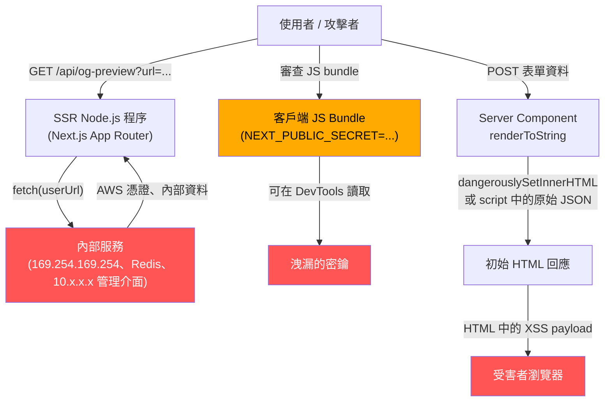

純 Single-Page Application（SPA）幾乎沒有伺服器端攻擊面，除了 API 層之外。「伺服器」只是一個提供靜態檔案的 CDN：HTML、JavaScript 與 CSS。不存在 Node.js 程序、環境變數存取、資料庫連線或檔案系統。能利用純 SPA 的攻擊者，只能在瀏覽器沙箱中活動。

然而，一旦 Next.js App Router、Nuxt、SvelteKit 或 Remix 進入技術棧，情況就完全不同了。前端程式碼現在在 Node.js 程序中執行，可存取環境變數、資料庫（透過 Prisma、Drizzle 或直接驅動程式）、私有網路上的內部 API，以及本機檔案系統。同一位原本構建安全 SPA 的開發者，現在正在操作一台伺服器——伴隨伺服器而來的安全紀律，必須完整適用。

最重要的心智模型轉變，是理解 Next.js 中的 Server Actions。一個標記了 `'use server'` 的函式，看起來像 TypeScript 函式呼叫，感覺像在調用輔助函式。但實際上，`'use server'` 會將這個函式編譯成位於 `/_next/action` 的 HTTP POST 端點，並賦予一個雜湊值作為 action ID。任何 HTTP 客戶端——curl、Postman、惡意網站上的腳本——都可以直接呼叫它，並傳入任意 payload。`'use server'` 的意思是「這在伺服器上執行」，而非「這受到保護」。身份驗證、授權、輸入驗證和速率限制，都不是框架提供的；它們是開發者的責任，必須在每個 action 上、每次都做到。

本文涵蓋從 SPA 遷移至 SSR 時，影響最大的五類威脅：Server-Side Request Forgery（SSRF）、環境變數暴露、伺服器端渲染中的 HTML 注入、Node.js 中的原型污染（Prototype Pollution），以及未受保護的 Server Actions。

## 原則

- **禁止（MUST NOT）** 使用 `NEXT_PUBLIC_`、`NUXT_PUBLIC_` 或 `VITE_` 前綴來命名敏感值——這些前綴會在建置時將值內嵌至客戶端 JavaScript bundle，任何人都能在瀏覽器 DevTools 中讀取
- **必須（MUST）** 在任何使用使用者提供輸入的 SSR fetch 呼叫之前，驗證並建立 URL 允許清單（allowlist），檢查 scheme、hostname 與 IP 範圍，以防止 SSRF
- **應該（SHOULD）** 將每個 Server Action 視為 API 路由：在存取任何輸入或資料庫之前，加入身份驗證、授權、輸入驗證和速率限制
- **應該（SHOULD）** 從 Server Components 傳遞資料至 Client Components 時，僅序列化必要欄位——RSC payload 內嵌於 HTML 回應中，無需身份驗證即可讀取
- **應該（SHOULD）** 使用型別安全的環境變數函式庫（`@t3-oss/env-nextjs`、`t3-env`），在建置時強制執行伺服器/客戶端變數邊界
- **應該（SHOULD）** 使用 Zod schema 驗證所有 Server Action 輸入，並拒絕含有 `__proto__`、`constructor` 或 `prototype` 鍵的請求

## 設計思考

### 為什麼 SSR 完全改變了前端安全模型

純 SPA 無法被用於 Server-Side Request Forgery——因為根本沒有伺服器來發出請求。瀏覽器的同源政策（Same-Origin Policy）阻止客戶端 fetch 到 `http://169.254.169.254/` 後讀取回應，而且雲端 metadata 服務本就無法從公共網際網路存取。

一旦 Next.js 或 Nuxt 進入技術棧，攻擊者只要在 SSR 路由中找到 URL 注入點，就能從 Node.js 程序發出請求。該程序在 VPC 內部運行，與內部服務處於同一網路，雲端 metadata 端點可達，環境變數已載入 `process.env`。SSRF、路徑穿越（path traversal）、憑證暴露與原型污染，全都成了前端團隊的責任——不是因為團隊選擇承擔後端工作，而是框架選擇執行伺服器程式碼。

### 為什麼 `NEXT_PUBLIC_` 外洩如此普遍

`NEXT_PUBLIC_` 前綴系統是一個帶有誤導性命名慣例的破壞性陷阱（footgun）。在建置時，Next.js 執行全域搜尋替換：原始碼中對 `process.env.NEXT_PUBLIC_STRIPE_SECRET_KEY` 的每一個引用，都會被替換為字面字串值。最終產出的 JavaScript 會被推送到每個載入頁面的瀏覽器。

開發者從文件或 Stack Overflow 複製範例、倉促命名變數，或來自後端環境，認為「環境變數存放在伺服器上」。變數名稱中的 `NEXT_PUBLIC_` 字串，是一個承諾：該值是公開的。建置完成後，沒有任何機制能讓 `NEXT_PUBLIC_` 變數保密——值已內嵌在靜態 JavaScript 中。唯一的補救方式是改用正確命名的變數（不加前綴）並重新建置。

Nuxt 的 `NUXT_PUBLIC_` 和 Vite-based 框架的 `VITE_` 遵循相同的行為模式。

### 為什麼 Server Actions 需要 API 等級的審查

Server Actions 的開發者體驗刻意設計成函式呼叫風格。你在 `.ts` 檔案中定義函式、匯出它、在 Client Component 中引入，並從事件處理器呼叫它。框架負責序列化。程式碼讀起來像是客戶端在調用本地函式。

在底層，Next.js 為每個匯出的 `'use server'` 函式分配一個雜湊值，將其註冊為 `/_next/action` 的 HTTP POST 處理器，並依 action ID 路由進來的請求。沒有內建的身份驗證閘道器。一個會刪除資料庫記錄的 Server Action，可以這樣被調用：

```bash
curl -X POST https://your-app.com/ \
  -H "Next-Action: <action-hash>" \
  -H "Content-Type: application/json" \
  -d '["target-record-id"]'
```

框架會執行它。每一條適用於 Express 路由處理器的安全紀律，同樣適用於 Server Action。Next.js 文件明確指出：「你應該將 Server Actions 視為可以透過直接 POST 請求觸達，並在每個 action 內部驗證身份驗證和授權。」

一個關鍵補充：Next.js Middleware 在 Edge runtime 上執行；Server Actions 在 Node.js runtime 上執行。它們是獨立的請求處理器。在 Middleware 層進行身份驗證，無法保護直接繞過 Middleware 發出 POST 請求的 Server Action。

### 為什麼序列化最少資料很重要

當 Server Component 從資料庫取得一筆資料列，並將其作為 prop 傳遞給 Client Component 時，整個物件都會被序列化進嵌入 HTML 回應的 RSC payload。任何工程師都可以開啟瀏覽器 DevTools，前往 Network 分頁，找到初始頁面載入回應，並審查跨越 Server/Client 邊界傳遞的每個物件的每個欄位。

Prisma model 通常包含因內部目的而添加的欄位：軟刪除用的 `deletedAt`、排名演算法用的 `internalScore`、客服人員用的 `adminNotes`、連結帳單的 `stripeCustomerId`。這些欄位都不該出現在客戶端 bundle 中。正確的做法是定義一個 mapper，只選取 Client Component 需要的欄位，並只傳遞映射後的物件。這就是資料最小化原則：RSC payload 只包含必要內容。

## 最佳實踐

- 使用 `@t3-oss/env-nextjs` 或 `t3-env` 定義環境變數，設定明確的 `server` 和 `client` schema。從 Client Component 模組存取伺服器端變數，會在建置時丟出錯誤，在部署前攔截意外的前綴暴露問題。

- 為每個接受使用者提供 URL 的 SSR fetch，實作 URL 驗證輔助函式。使用 `new URL()` 解析，確認 `protocol === 'https:'`，解析 hostname，並拒絕 RFC 1918 私有範圍（10.x.x.x、172.16-31.x.x、192.168.x.x）、loopback（127.x.x.x、`::1`）和 link-local（169.254.x.x）中的任何位址。

- 在每個 Server Action 的最開頭，加入 `auth()` 呼叫（NextAuth 的 `auth()`、Clerk 的 `currentUser()` 或你的 session 函式庫）。若未通過身份驗證，在讀取任何輸入之前立即拋出錯誤。

- 使用 Zod 以明確的 schema 驗證 Server Action 輸入。在任何資料庫操作之前呼叫 `inputSchema.parse(rawInput)`。Zod schema 也是封鎖原型污染鍵（prototype-pollution keys）的注入點：添加 `.refine()` 以拒絕任何名為 `__proto__`、`constructor` 或 `prototype` 的鍵。

- 為每個跨越 Server/Client 邊界的資料庫查詢結果，建立 `selectFields` mapper 函式。Mapper 明確列出 Client Component 需要的每個欄位，所有其他欄位在源頭就被捨棄，而非事後過濾。

- 在 `<script>` 標籤中嵌入 JSON 時，使用 `serialize-javascript`（或手動轉義）。永遠不要對內聯 `<script>` 內容使用原始的 `JSON.stringify`——包含 `</script>` 的使用者值會終止標籤並允許任意 HTML 注入。

- 對包含環境變數存取、資料庫客戶端和內部 API 憑證的模組，使用 `server-only` 套件。客戶端引入時的建置錯誤會在 CI 中被捕捉；執行時的資料洩漏則會在資安事故通知中被發現。

## 運作原理



**攻擊向量 1 — SSRF：** 使用者控制的 URL 參數被傳遞給 SSR 路由中的 `fetch()`。Node.js 程序從 VPC 內部發出請求，觸達雲端 metadata 服務或公共網際網路無法存取的內部服務。

**攻擊向量 2 — 環境變數暴露：** 以 `NEXT_PUBLIC_` 前綴命名的密鑰，在建置時被內嵌進 JavaScript bundle。任何開啟 DevTools 的訪客都能讀取它。

**攻擊向量 3 — HTML 注入：** 未轉義的使用者資料，透過 `dangerouslySetInnerHTML` 或 `<script>` 標籤中的原始 `JSON.stringify`，流入 SSR 輸出。XSS payload 在初始 HTML 回應中傳遞——在 hydration 之前，在 CSP nonce 套用之前。

## 範例

### 1. URL 驗證輔助函式（SSRF 防護）

```typescript
// lib/validate-url.ts
import { isIP } from 'net';

const PRIVATE_RANGES = [
  /^10\.\d+\.\d+\.\d+$/,
  /^172\.(1[6-9]|2\d|3[01])\.\d+\.\d+$/,
  /^192\.168\.\d+\.\d+$/,
  /^127\.\d+\.\d+\.\d+$/,
  /^169\.254\.\d+\.\d+$/,
  /^::1$/,
  /^fc00:/i,
  /^fe80:/i,
];

export function assertSafeUrl(raw: string): URL {
  let parsed: URL;
  try {
    parsed = new URL(raw);
  } catch {
    throw new Error('無效的 URL');
  }

  if (parsed.protocol !== 'https:') {
    throw new Error('只允許 HTTPS URL');
  }

  const hostname = parsed.hostname.toLowerCase();

  // 拒絕落在私有範圍內的原始 IP 位址
  if (isIP(hostname) !== 0) {
    for (const range of PRIVATE_RANGES) {
      if (range.test(hostname)) {
        throw new Error('URL 解析至私有或保留位址');
      }
    }
  }

  // 拒絕已知的內部主機別名
  if (hostname === 'localhost' || hostname.endsWith('.internal')) {
    throw new Error('URL 解析至內部位址');
  }

  return parsed;
}

// 在 SSR 路由處理器中使用
// app/api/og-preview/route.ts
import { assertSafeUrl } from '@/lib/validate-url';

export async function GET(request: Request) {
  const { searchParams } = new URL(request.url);
  const rawUrl = searchParams.get('url') ?? '';

  const safeUrl = assertSafeUrl(rawUrl); // 若為 SSRF 目標則拋出錯誤

  const response = await fetch(safeUrl.toString(), {
    headers: { Accept: 'text/html' },
    redirect: 'error', // 不跟隨可能繞過 hostname 檢查的重新導向
  });

  // ... 處理並回傳 OG metadata
}
```

### 2. 含有身份驗證、Zod 驗證和速率限制的 Server Action

```typescript
// app/actions/delete-post.ts
'use server';

import { auth } from '@/lib/auth';           // NextAuth / Clerk / 你的 auth 函式庫
import { rateLimit } from '@/lib/rate-limit'; // 例如：Upstash Redis rate limiter
import { db } from '@/lib/db';
import { z } from 'zod';

const deletePostInput = z.object({
  postId: z.string().uuid(),
}).strict(); // 拒絕任何額外的鍵

export async function deletePost(rawInput: unknown) {
  // 1. 身份驗證——最優先，在其他任何事之前
  const session = await auth();
  if (!session?.user) {
    throw new Error('未通過身份驗證');
  }

  // 2. 速率限制
  const { success } = await rateLimit(session.user.id, 'delete-post', { max: 10, window: '1m' });
  if (!success) {
    throw new Error('超過速率限制');
  }

  // 3. 輸入驗證
  const input = deletePostInput.parse(rawInput);

  // 4. 授權——驗證所有權
  const post = await db.post.findUnique({ where: { id: input.postId } });
  if (!post) throw new Error('找不到資源');
  if (post.authorId !== session.user.id) {
    throw new Error('禁止存取');
  }

  // 5. 執行變更
  await db.post.delete({ where: { id: input.postId } });
}
```

### 3. 使用 `@t3-oss/env-nextjs` 的型別安全環境變數

```typescript
// env.ts（在各處引入此檔案，而非直接使用 process.env）
import { createEnv } from '@t3-oss/env-nextjs';
import { z } from 'zod';

export const env = createEnv({
  server: {
    // 這些變數永遠不會傳送至客戶端。從 Client Component 存取 = 建置錯誤。
    DATABASE_URL: z.string().url(),
    STRIPE_SECRET_KEY: z.string().min(1),
    NEXTAUTH_SECRET: z.string().min(32),
    INTERNAL_API_KEY: z.string().min(1),
  },
  client: {
    // 這些變數會被內嵌進客戶端 bundle。只放真正公開的值。
    NEXT_PUBLIC_APP_URL: z.string().url(),
    NEXT_PUBLIC_STRIPE_PUBLISHABLE_KEY: z.string().startsWith('pk_'),
  },
  // 讓 T3 env 在 Next.js 中正確讀取 process.env
  runtimeEnv: {
    DATABASE_URL: process.env.DATABASE_URL,
    STRIPE_SECRET_KEY: process.env.STRIPE_SECRET_KEY,
    NEXTAUTH_SECRET: process.env.NEXTAUTH_SECRET,
    INTERNAL_API_KEY: process.env.INTERNAL_API_KEY,
    NEXT_PUBLIC_APP_URL: process.env.NEXT_PUBLIC_APP_URL,
    NEXT_PUBLIC_STRIPE_PUBLISHABLE_KEY: process.env.NEXT_PUBLIC_STRIPE_PUBLISHABLE_KEY,
  },
});
```

### 4. 最少資料序列化（mapper 模式）

```typescript
// app/dashboard/page.tsx — Server Component
import { db } from '@/lib/db';
import { auth } from '@/lib/auth';
import { UserCard } from './UserCard'; // 'use client'

// Prisma User model 包含：id、name、email、avatarUrl、passwordHash、
// stripeCustomerId、internalScore、adminNotes、deletedAt...
type PublicUser = {
  id: string;
  name: string;
  avatarUrl: string | null;
};

function toPublicUser(user: Awaited<ReturnType<typeof db.user.findUniqueOrThrow>>): PublicUser {
  // 明確的允許清單——只有 Client Component 渲染所需的三個欄位
  return {
    id: user.id,
    name: user.name,
    avatarUrl: user.avatarUrl,
  };
}

export default async function DashboardPage() {
  const session = await auth();
  const user = await db.user.findUniqueOrThrow({ where: { id: session!.user.id } });

  // 只傳遞公開的資料形狀——passwordHash、stripeCustomerId 等永遠不會進入 RSC payload
  return <UserCard user={toPublicUser(user)} />;
}
```

### 5. 內嵌 script 資料的 JSON 注入防護

```typescript
// 危險——含有 </script> 的使用者資料會破壞標籤結構
export function UnsafeInlineData({ data }: { data: unknown }) {
  return (
    <script
      dangerouslySetInnerHTML={{
        // 若 data = { name: '</script><script>alert(1)</script>' }
        // 以下程式碼會終止 script 標籤並注入任意 HTML
        __html: `window.__INITIAL_DATA__ = ${JSON.stringify(data)}`,
      }}
    />
  );
}

// 安全——使用 serialize-javascript，它會轉義 </script>、行分隔符等字元
import serialize from 'serialize-javascript';

export function SafeInlineData({ data }: { data: unknown }) {
  return (
    <script
      dangerouslySetInnerHTML={{
        __html: `window.__INITIAL_DATA__ = ${serialize(data, { isJSON: true })}`,
      }}
    />
  );
}

// 同樣安全——在沒有 serialize-javascript 的環境中手動轉義
function escapeForScriptTag(json: string): string {
  return json
    .replace(/</g, '\\u003c')
    .replace(/>/g, '\\u003e')
    .replace(/&/g, '\\u0026')
    .replace(/\u2028/g, '\\u2028')
    .replace(/\u2029/g, '\\u2029');
}
```

## 常見錯誤

**將密鑰命名為 `NEXT_PUBLIC_*`**

這個前綴使值無條件變為公開。它在建置時透過編譯器替換內嵌到 JavaScript bundle 中——沒有執行時機制能保護它。一個名為 `NEXT_PUBLIC_STRIPE_SECRET_KEY` 的變數，其值將在建置好的 `.js` 檔案中，對每位訪客可見。改名變數並重新建置是唯一的補救方式；清除 CDN 快取無濟於事，因為舊的 bundle 可能已被瀏覽器儲存。

命名慣例：無前綴表示僅限伺服器；`NEXT_PUBLIC_` 表示明確公開。在命名任何環境變數之前，使用這個判斷框架。

**在 SSR 路由中直接 fetch `searchParams.url` 或 `body.url` 而不做 URL 驗證**

這是 Next.js 應用程式中典型的 SSRF 入口點。Open Graph 預覽路由（`/api/og?url=...`）、圖片代理路由（`/api/proxy?url=...`）和連結預覽 API，都從使用者那裡獲取 URL 並在伺服器端 fetch 它。若無允許清單檢查，攻擊者傳入 `url=http://169.254.169.254/latest/meta-data/iam/security-credentials/`，就能在回應中獲得 AWS IAM 憑證。修復方式是在任何 `fetch()` 呼叫之前執行 `assertSafeUrl(rawUrl)`。

**依賴 Middleware 進行 Server Action 的身份驗證**

Next.js Middleware 在 Vercel Edge Network 或 Node.js Edge runtime 上執行——這是與處理 Server Actions 的 Node.js runtime 分開的執行環境。帶有正確 `Next-Action` header 和 action 雜湊的直接 POST 請求，會繞過 Middleware 路徑，直接抵達 Server Action 處理器。Middleware 身份驗證是 UI 存取控制；它不是 Server Action 的安全邊界。每個 Server Action 必須獨立呼叫 `auth()`。

**將完整的 Prisma model 傳遞給 Client Component**

資料庫資料列中的每個欄位——包括內部標記、軟刪除時間戳、雜湊密碼、第三方帳號 ID 和帳單參考——都會成為嵌入 HTML 中的 RSC payload 的一部分。審查頁面的工程師可以在不需要身份驗證的情況下，透過瀏覽器 DevTools 讀取它。修復方式是使用 mapper 函式，明確選取 Client Component 渲染的欄位。

**對未消毒的伺服器資料使用 `dangerouslySetInnerHTML`**

React 的 JSX 插值（`{value}`）會自動轉義文字內容。`dangerouslySetInnerHTML` 則不會。將使用者控制的資料直接傳入 `dangerouslySetInnerHTML` 的 Server Component，會在初始 HTML 回應中傳遞 XSS——在 hydration 之前，在 CSP nonce 套用之前。使用 DOMPurify（透過 jsdom 在伺服器端）進行消毒，或對不受信任的內容完全避免使用 `dangerouslySetInnerHTML`。

**對不受信任的輸入執行 `JSON.parse` 而不使用原型污染防護的 reviver**

將 `{"__proto__": {"isAdmin": true}}` 透過 `JSON.parse` 傳入並合併到物件中，可能會污染整個 Node.js 程序的 `Object.prototype`。後續每個讀取 `obj.isAdmin` 的 `{}` 物件都會回傳 `true`。修復方式是在使用任何已解析的 JSON 之前先用 Zod 驗證，對累加器物件使用 `Object.create(null)`，並加入會拋出錯誤的 reviver，拒絕 `__proto__`、`constructor` 和 `prototype` 鍵。

## 相關 FEE

- [FEE-1200：資訊安全總覽](./1200.md) — 分類脈絡與 SSR 攻擊面
- [FEE-1201：內容安全政策（CSP）](./1201.md) — SSR 中介軟體中的 nonce 生成（Next.js）
- [FEE-1202：身份驗證與 Token 儲存](./1202.md) — SSR fetch 呼叫中的 cookie 轉發與 token 驗證
- [FEE-1203：跨網站指令碼（XSS）防護](./1203.md) — 透過未消毒的 renderToString 輸出造成的伺服器端 XSS
- [FEE-1204：跨來源資源共享（CORS）與跨網站請求偽造（CSRF）](./1204.md) — SSR API 路由與 Server Action 的 CORS
- [FEE-1205：軟體供應鏈安全](./1205.md) — 受損的 SSR 相依套件可直接存取環境變數、內部服務及雲端 metadata 端點
- [FEE-1506：CI 中的密鑰、環境變數與資安](../CI%20CD%20and%20Deployment/1506.md) — NEXT_PUBLIC_ 前綴與建置時環境變數安全

## 參考資料

- [Server Actions 安全性 — Next.js 文件](https://nextjs.org/docs/app/building-your-application/data-fetching/server-actions-and-mutations#security)
- [環境變數 — Next.js 文件](https://nextjs.org/docs/app/guides/environment-variables)
- [在 Next.js 中思考安全性 — Next.js 官方部落格](https://nextjs.org/blog/security-nextjs-server-components-actions)
- [OWASP：Server-Side Request Forgery 防護速查表](https://cheatsheetseries.owasp.org/cheatsheets/Server_Side_Request_Forgery_Prevention_Cheat_Sheet.html)
- [在 Node.js 中防止 SSRF — Snyk 部落格](https://snyk.io/blog/preventing-server-side-request-forgery-node-js/)
- [t3-env — 型別安全環境變數](https://env.t3.gg/)
- [原型污染 — MDN Web Security](https://developer.mozilla.org/en-US/docs/Web/Security/Attacks/Prototype_pollution)
- [OWASP：原型污染](https://owasp.org/www-community/attacks/Prototype_Pollution)
- [serialize-javascript — npm](https://www.npmjs.com/package/serialize-javascript)
- [Next.js Server Actions 安全性：5 個必須修復的漏洞 — Makerkit](https://makerkit.dev/blog/tutorials/secure-nextjs-server-actions)
- [Next.js SSRF 資安通報（CVE-2024-34351）— Assetnote](https://www.assetnote.io/resources/research/advisory-next-js-ssrf-cve-2024-34351)
