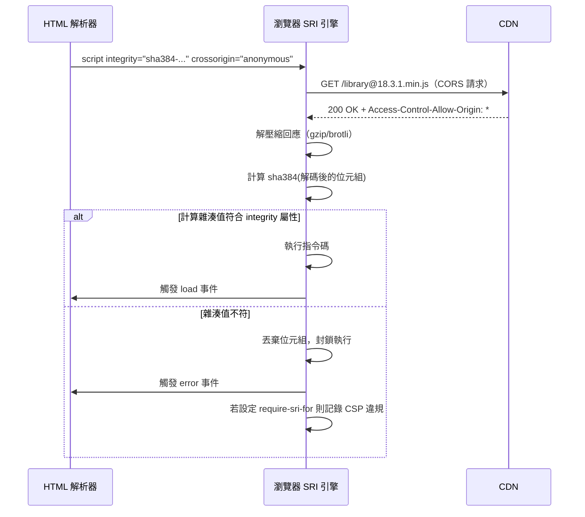

# 子資源完整性（SRI）

每一個由 CDN 提供的指令碼或樣式表，都是一個信任決策。當瀏覽器從 CDN
載入 jQuery 時，它執行的是 CDN 回傳的任何位元組——沒有內建機制可以
驗證該檔案是否為開發者預期的版本。若 CDN 遭入侵、快取配置錯誤提供了
被污染的版本，或 URL 在傳輸中被攔截，瀏覽器無從偵測替換行為。頁面將
以完整的 DOM 存取權、記憶體中的使用者憑證及頁面處理的任何資料，執行
惡意程式碼。

子資源完整性（SRI）填補了這個缺口。受 SRI 保護的資源，在載入它的
HTML 元素中直接嵌入了預期位元組的密碼雜湊值。瀏覽器在執行或套用資源
之前，會計算接收到的位元組雜湊值，並與宣告的值進行比對。若不符合，
瀏覽器拒絕執行該資源並觸發載入錯誤，而非正常的 `load` 事件。CDN 的
交付網路不再位於信任鏈中——雜湊值才是。

SRI 不僅限於第三方公開 CDN，同樣適用於任何外部託管的資產：字型代管
服務、廠商提供的分析指令碼、從 SaaS 平台載入的 A/B 測試程式庫，或
共用內部 CDN 上的 polyfill。威脅模型很簡單：任何不屬於你自己來源的
URL 都是信任邊界，而在沒有驗證機制的情況下，該邊界是無法被強制執行的。

本文涵蓋 SRI 雜湊值產生機制、瀏覽器的執行行為、與 `require-sri-for`
CSP 指令的互動，以及在建置管線中自動化 SRI 的模式，確保雜湊值在每次
依賴更新週期中保持最新，而無需手動維護。

## 原則

SRI 要求宣告外部資源的 `<script>` 或 `<link>` 元素，必須包含一個
`integrity` 屬性，其值包含一個或多個格式為
`<演算法>-<base64 編碼雜湊>` 的雜湊值。支援的演算法為 `sha256`、
`sha384` 和 `sha512`。`crossorigin="anonymous"` 屬性必須（MUST）與
任何受 SRI 保護的資源一起使用，以確保瀏覽器透過 CORS 且不帶憑證地
請求資源，這是雜湊驗證正確運作的必要條件。若雜湊檢查失敗，瀏覽器
禁止（MUST NOT）執行指令碼或套用樣式表——元素觸發 `error` 事件而非
`load` 事件，且資源位元組在任何執行發生之前即被丟棄。

## 設計思維

### 瀏覽器如何在提取時強制執行 SRI

當 HTML 解析器遇到帶有 `integrity` 屬性的 `<script>` 或 `<link>`
元素時，它會附帶完整性中繼資料發起提取請求。回應到達後，瀏覽器
解壓縮任何內容編碼（gzip、brotli 或 deflate），並計算原始解碼位元組
的雜湊值，再將其與屬性中列出的每個 `integrity` 值進行比對。若至少
有一個宣告的雜湊值與計算值相符，資源即通過檢查。

當單一 `integrity` 屬性中列出多個演算法（以空格分隔）時，瀏覽器使用
可用的最強演算法。同時指定 `sha384-<hash>` 和 `sha512-<hash>` 可讓
支援 `sha512` 的瀏覽器使用更強的檢查，同時兼容加密能力較受限的環境。
這種多雜湊模式也提供了向前相容性：隨著演算法棄用，可在不中斷現有
部署的情況下，在舊雜湊旁新增新雜湊。

若沒有 `crossorigin` 屬性，瀏覽器執行無 CORS 的提取，產生的是不透明
回應——其位元組刻意對瀏覽器的檢查機制隱藏。由於瀏覽器無法讀取不透明
回應的位元組，也就無法計算用於比對的雜湊值。元素無聲地載入而不進行
完整性驗證，`integrity` 屬性毫無效果。設定 `crossorigin="anonymous"`
強制執行不帶憑證的 CORS 提取。CDN 必須回應 `Access-Control-Allow-Origin: *`
或特定的請求來源，所有主要公開 CDN 對公開發布的程式庫檔案均支援此設定。

當雜湊檢查失敗時，瀏覽器在主控台記錄詳細錯誤、在元素上觸發 `error`
事件，並在執行或套用之前丟棄回應位元組。`load` 事件永遠不會觸發。任何
假設資源已成功載入的 JavaScript 都將因參照錯誤而失敗。以 SRI 保護關鍵
指令碼的應用程式，應在這些元素上實作 `error` 事件監聽器，以偵測失敗並
作出回應：顯示使用者訊息、從備用 URL 重試，或將失敗記錄到錯誤回報服務。

### 在位元組層級產生正確的 SRI 雜湊值

`integrity` 雜湊值必須計算自瀏覽器在解壓縮後實際接收和處理的確切位元組。
這個位元組層級的精確性很重要，因為 CDN 通常會根據請求的 `Accept-Encoding`
標頭，以多種編碼提供相同的邏輯檔案。雜湊值必須針對未壓縮的內容計算，
而非壓縮後的線路傳輸表示。

標準的命令列方法是將解壓縮後的回應位元組透過 OpenSSL 摘要指令處理，
再對原始二進位輸出進行 base64 編碼：

```
curl -s https://cdn.example.com/library@1.2.3.min.js \
  | openssl dgst -sha384 -binary \
  | openssl base64 -A
```

`openssl dgst` 的 `-binary` 旗標至關重要。若沒有它，OpenSSL 會以
小寫十六進位字串輸出摘要。對十六進位字串進行 base64 編碼，會產生一個
在語法上看起來合理但永遠無法與瀏覽器計算結果相符的值——瀏覽器對原始
位元組進行雜湊計算後，對原始摘要位元組進行 base64 編碼，而非對十六
進位摘要。`-A` 旗標則抑制 `openssl base64` 預設新增的換行，這會產生
無效的多行雜湊值。

建置工具插件完全消除了手動步驟。Webpack 的 `webpack-subresource-integrity`
插件整合在資產輸出階段：Webpack 生成輸出區塊後，插件計算每個區塊位元組
的 `sha384` 雜湊值，並將 `integrity` 和 `crossorigin` 屬性注入到生成的
HTML 範本中每個 `<script>` 和 `<link>` 標籤。Vite 的 `vite-plugin-sri`
在 `generateBundle` 鉤子運作，對 Rollup 輸出套用相同轉換。對於建置
工具控制範圍之外的 CDN 連結程式庫，專用的雜湊擷取指令碼作為預建置步驟
執行，下載每個 URL、計算其雜湊值，並將結果寫入 HTML 範本在建置時讀取
的 JSON 清單檔案。

值得注意的是，無論使用哪種工具，雜湊值都必須對應於瀏覽器實際接收的確切
檔案內容。若 CDN 在程式庫的同一版本中提供多個變體（例如壓縮版與未壓縮
版、ES 模組版與 UMD 版），則每個變體的雜湊值都不相同。HTML 範本中宣告的
`integrity` 值必須對應於 `src` 屬性中所指向的確切檔案變體，而非同一程式
庫的另一個版本。這在從一種模組格式切換到另一種格式時（例如從 UMD 切換到
ESM），是常見的錯誤來源——兩個檔案可能包含相同的邏輯，但其位元組是完全
不同的，因此雜湊值也截然不同。

### 使用 require-sri-for 在文件範圍強制執行 SRI

個別元素上的 `integrity` 屬性使 SRI 成為選擇性機制：開發者必須記得為
每個外部資源加上。`Content-Security-Policy` 標頭的 `require-sri-for`
指令將模型改為選擇退出：瀏覽器拒絕載入任何缺少有效 `integrity` 屬性的
指令碼或樣式表，使 SRI 對文件中所有資源成為強制要求。

當設定 `require-sri-for script style` 後，即使是由受信任的第一方指令碼
動態注入、但沒有 `integrity` 屬性的 `<script>` 也會被封鎖。這正是
`require-sri-for` 所防禦的攻擊場景：供應鏈被入侵的第一方依賴注入第二個
惡意指令碼。由於注入的元素沒有雜湊值，瀏覽器儘管信任注入的指令碼，
仍會封鎖它。

`require-sri-for` 也能捕捉開發者新增 CDN 依賴卻忘記加上 `integrity`
屬性的情況——載入失敗在開發和測試時即立即可見，而非在生產環境中靜默成功。
當搭配 CSP 的 `report-to` 或 `report-uri` 使用時，違規行為會向收集端點
生成自動化報告，讓你得以監控因 CDN 變更（而非攻擊）而導致的 SRI 失敗。

`require-sri-for` 的瀏覽器支援目前僅限於基於 Chromium 的瀏覽器。Firefox
和 Safari 能正確強制執行各別元素的 `integrity` 屬性，但未實作該指令。
應將 `require-sri-for` 視為元素層級 `integrity` 屬性之上的縱深防禦層，
而非其替代品。

### 在建置管線中自動化 SRI 以確保長期可維護性

手動的 SRI 維護無法在依賴更新週期中持久。每次程式庫版本變更，內容就會
改變，雜湊值也隨之改變。若嵌入在 HTML 範本中的雜湊值在依賴版本變更時
未重新產生，一旦 CDN 為固定版本 URL 提供新的檔案內容，即會立刻造成
載入失敗。此失敗是硬性中斷，在部署後立即對所有使用者顯現。

正確的做法是將雜湊值產生與建置中的版本解析步驟耦合。對於 Webpack 或
Vite 建置的自我託管資產，上述 SRI 插件會自動處理——雜湊值產生不是獨立
步驟，因為它在資產輸出時即已發生。對於 CDN 連結的程式庫，建置時指令碼
讀取設定的 CDN URL 和版本、提取每個 URL、計算雜湊值，並將結果寫入清單
檔案。該清單檔案提交至版本控制。

CI 強制執行步驟透過在建置期間重新計算清單中每個 CDN URL 的雜湊值，若
任何計算雜湊值與儲存值不符即讓建置失敗，作為清單產生的補充。這能捕捉
開發者更新 CDN 版本字串但忘記重新產生雜湊的情況，也能捕捉 CDN 端的
內容變更：若 CDN 變更了版本 URL 所提供的位元組——這不應發生，但在 CDN
事故中確實發生過——不符情況會在 CI 中、在觸達生產環境之前被偵測到。

將雜湊清單儲存在版本控制中提供了審計追蹤。每次外部資源雜湊值的變更都
出現在差異中，讓程式碼審查者有機會驗證雜湊值的變更是否對應於合法的版本
升級，而非無法解釋的內容替換。這份版本控制歷史本身就是一個安全控制——若
某個雜湊值在沒有對應版本號碼變更的情況下出現在差異中，即是一個明確的
警示訊號，值得在合併前進行調查。結合自動化的 CI 驗證和手動的審查追蹤，
使 SRI 成為一個可靠的流程，而非依賴個別開發者記憶的手動紀律。

### CDN 託管程式庫的 SRI 版本固定要求

CDN 以多種粒度暴露程式庫版本。主要版本別名如 `react@18` 指向最新的 18.x
版本；次要版本別名如 `react@18.3` 指向最新的 18.3.x 修補版本；完整版本
字串 `react@18.3.1` 是不可變的——CDN 在版本發布後不會變更該 URL 回傳的位
元組。使用主要或次要版本別名搭配 SRI 是不相容的：更新到新版本的別名會
改變該 URL 的內容，從而改變雜湊值。與昨天內容相符的 `integrity` 屬性會
立即在今天更新的內容上失敗，封鎖資源並破壞所有使用者的頁面。

在 CDN URL 中固定到完整的語意版本是必要的。這意味著更新 CDN 連結的
程式庫需要兩個刻意的步驟：更新 URL 中的版本字串，以及重新產生雜湊值。
這種摩擦是刻意設計的——未驗證的依賴更新是安全風險。要求刻意的雜湊值
重新產生步驟，使開發者無法在不驗證所引入內容的情況下靜默拉入新的程式庫
版本。大多數主要 CDN（包括 jsDelivr 和 cdnjs）在其套件頁面上顯示每個版本
中每個檔案的 SRI 雜湊值，使預期的工作流程清晰明確：選擇版本、複製帶有
預填 `integrity` 屬性的 `<script>` 標籤、更新 HTML、提交變更。

在考慮 SRI 與套件管理的關係時，值得注意的是：對於透過 npm 安裝並由
Webpack 或 Vite 打包的程式庫，SRI 仍然有益，但其角色略有不同——建置
工具已知道哪些確切的位元組被打包，插件可在建置時計算雜湊值。對於直接
從 CDN 載入以利用瀏覽器快取共享的程式庫，版本固定的 SRI 提供對 CDN
基礎設施妥協的防護，這是打包工具工作流程無法提供的保護。兩種方法可以
共存：將核心框架（React、Vue）作為固定 CDN 資源並附帶 SRI，同時使用
打包工具搭配自動化 SRI 插件處理應用程式代碼和其他依賴，以充分利用
瀏覽器快取共享與建置時驗證兩者的優勢。

## 最佳實踐

**必須（MUST）**在每個受 SRI 保護的 `<script>` 和 `<link>` 元素上加入
`crossorigin="anonymous"`。省略此屬性會導致瀏覽器執行無 CORS 的提取並
靜默略過雜湊驗證——`integrity` 屬性毫無效果，提供虛假的安全感而無任何
實際保護。

**必須（MUST）**使用 `sha384` 或 `sha512` 作為雜湊演算法。`sha256` 符合
SRI 規範，但較長的摘要長度提供了更強的碰撞抵抗餘裕，適用於安全關鍵的
驗證場景。

**應該（SHOULD）**將 CDN URL 固定到確切的修補版本（如 `@18.3.1`），而非
主要或次要版本別名（如 `@18` 或 `@18.3`）。版本別名是可變的——CDN 將其
更新為新版本，這會改變檔案內容並立即使生產環境中宣告的雜湊值失效。

**應該（SHOULD）**將雜湊值產生自動化為建置管線的一部分，對自我託管資產
使用 Webpack 或 Vite SRI 插件，對 CDN 連結資源使用建置時的提取指令碼。
手動維護在依賴更新時會產生過時的雜湊值。

**應該（SHOULD）**將 SRI 雜湊清單提交至版本控制，使外部資源雜湊值的
變更出現在程式碼審查中，並可隨時間進行審計。這使得雜湊值的每次變更
都成為可見的程式碼審查決策，而非隱藏在建置系統輸出中的靜默更新。

**應該（SHOULD）**在關鍵 SRI 保護的 `<script>` 元素上實作 `error` 事件
監聽器。SRI 失敗若靜默地中斷應用程式，比觸發明確的錯誤回報更難診斷；
錯誤監聽器讓你得以向使用者顯示訊息、嘗試備用來源，或將失敗記錄到監控
服務。

**禁止（MUST NOT）**將 `integrity` 套用於透過純 HTTP 載入的資源——不得
在不安全的連線上依賴 SRI 提供保護，也不得將 HTTP 資源上的 `integrity`
屬性視為具有任何安全效果。在不安全的連線上，網路攻擊者既可替換資源位
元組，也可替換宣告 `integrity` 屬性的 HTML 文件本身，使整個驗證機制
完全失效。SRI 需要 HTTPS 才能提供有意義的保護。

## 視覺呈現



## 範例

```html
<!-- React 和 ReactDOM 固定到確切版本，帶有 SHA-384 SRI 雜湊值 -->
<script
  src="https://cdn.jsdelivr.net/npm/react@18.3.1/umd/react.production.min.js"
  integrity="sha384-dOXCvJyNGSCFkJiMKBFMVzH7k5GqDTv1J7Kjay0K8lmzKQk2KQKFR2Hnk+1q9N"
  crossorigin="anonymous"
></script>
<script
  src="https://cdn.jsdelivr.net/npm/react-dom@18.3.1/umd/react-dom.production.min.js"
  integrity="sha384-ELHHM0r9xEOFLLh6khwFMWfxB/qR3WmVK8HtNaFB5EQDM+3GFagSgLwKuHJ0L8y"
  crossorigin="anonymous"
  onerror="console.error('ReactDOM SRI 驗證失敗')"
></script>

<!--
為任何 CDN URL 產生雜湊值：
  curl -s https://cdn.example.com/lib@1.0.0.min.js \
    | openssl dgst -sha384 -binary \
    | openssl base64 -A

Vite 設定，自動為所有建置輸出注入 SRI：
  import sri from 'vite-plugin-sri'
  export default { plugins: [sri()] }

強制所有指令碼和樣式表使用 SRI 的 CSP 標頭：
  Content-Security-Policy: require-sri-for script style
-->
```

## 常見錯誤

- 省略 `crossorigin="anonymous"`——瀏覽器靜默略過雜湊驗證，沒有任何跡象
  顯示 `integrity` 屬性被忽略，開發者誤以為保護已生效
- 在解壓縮前計算雜湊值——對壓縮後的線路位元組而非解碼後的內容進行
  雜湊計算，產生的值永遠無法與瀏覽器計算的雜湊值相符
- 使用 CDN 版本別名而非確切的版本固定——別名內容在新版本發布時更新，
  立即使生產環境中宣告的雜湊值失效
- 更新依賴版本後忘記重新產生雜湊值——過時的雜湊值在部署後對所有使用
  者造成硬性載入失敗
- SRI 僅套用於 `<script>` 而忽略 `<link rel="stylesheet">`——CSS 可透過
  屬性選擇器和 `url()` 回呼竊取資料，同樣需要保護

## 相關 FEE

- FEE-1200: 深入探討內容安全政策（CSP）
- FEE-1204: 前端專案的供應鏈安全
- FEE-1209: 開放重新導向防護與 URL 驗證

## 參考資料

- [MDN: 子資源完整性](https://developer.mozilla.org/zh-TW/docs/Web/Security/Subresource_Integrity)
- [W3C SRI 規範](https://www.w3.org/TR/SRI/)
- [webpack-subresource-integrity 插件](https://github.com/waysact/webpack-subresource-integrity)
- [vite-plugin-sri 插件](https://github.com/diagnostica/vite-plugin-sri)
- [jsDelivr SRI 雜湊查詢工具](https://www.jsdelivr.com/)
- [OWASP：第三方 JavaScript 管理](https://cheatsheetseries.owasp.org/cheatsheets/Third_Party_Javascript_Management_Cheat_Sheet.html)
