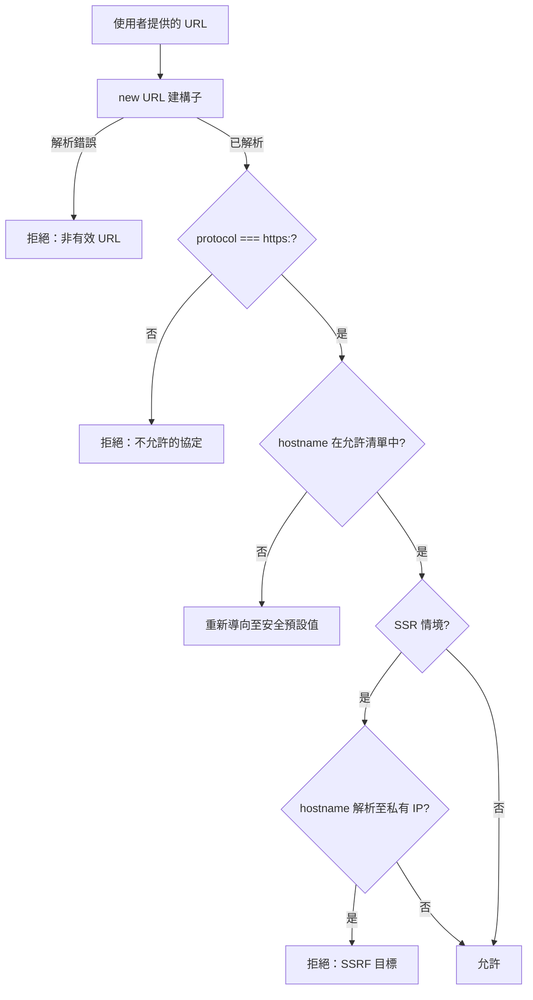

# 開放重新導向防護與 URL 驗證

開放重新導向漏洞發生在網路應用程式接受使用者提供的 URL 作為輸入，並在
未驗證目標是否安全的情況下將瀏覽器重新導向至該 URL。典型的模式是接受
`?redirect=` 參數的登入頁面：驗證成功後，伺服器傳送
`Location: <redirect 參數的值>`。若應用程式未驗證此值，攻擊者可以製作
像 `https://trusted-site.com/login?redirect=https://evil.com/phishing` 的
連結並傳送給受害者。受害者看到點擊連結中的 `trusted-site.com`，完成登入
後被重新導向到攻擊者的頁面——該頁面可能模仿受信任網站以竊取憑證。

開放重新導向通常被認定為低嚴重度，因為它不會直接危害應用程式。但在幾個
情境下這個評估是錯誤的。與 OAuth 流程結合時，開放重新導向可能洩漏授權
碼或存取權杖——攻擊者控制重新導向 URI 並捕獲授權伺服器附加其上的權杖。
在網路釣魚活動中，初始 URL 中的受信任域名顯著提高了點擊率，並繞過了
會封鎖直接指向攻擊者域名連結的 URL 聲譽過濾器。在 SSRF 攻擊鏈中，
重新導向至內部 URL 可導致伺服器向不應從公開網際網路存取的基礎設施發出
請求。

URL 驗證在重新導向處理之外也有其獨立的重要性。任何從使用者提供的資料
建構 `src`、`href` 或 `action` 屬性的前端程式碼——圖片預覽、連結產生器、
表單目標——都會產生注入機會。若沒有驗證，`javascript:` 協定注入可以在
瀏覽器中執行任意程式碼。在 SSR 情境中，傳遞給伺服器上 `fetch()` 的
使用者提供 URL 會產生 SSRF 漏洞，其影響範圍遠大於純用戶端應用程式中
相同的漏洞。

本文涵蓋攻擊向量、使用 `URL` 建構子進行正確解析、允許清單與封鎖清單
驗證策略、外連連結的 `rel="noopener noreferrer"` 要求，以及 SSR 框架中
的 SSRF 考量。

## 原則

URL 驗證必須（MUST）使用適當的 URL 解析器，而非正規表達式或字串操作。
瀏覽器和 Node.js 中的 `URL` 建構子依據 WHATWG URL 規範解析 URL，處理
手工撰寫的正規表達式所無法應對的所有邊緣情況：百分比編碼字元、IP 位址
表示法、Unicode 正規化，以及相對協定 URL。解析後，應用程式必須（MUST）
依據可接受值的允許清單，驗證已解析的元件——協定、主機名稱和路徑。封鎖
特定的壞值是不夠的：有效 URL 語法的攻擊面太大，無法進行防禦性枚舉。

## 設計思維

### 為何基於正規表達式的 URL 驗證會失敗

URL 驗證的直覺方式是使用正規表達式：拒絕任何不符合預期模式的輸入。
這種方式在實踐中對 URL 語法失效，因為 URL 解析由 WHATWG URL 規範定義，
其允許範圍遠比開發者可能撰寫的任何正規表達式更寬泛。

允許 `https://example.com/path` 的正規表達式通常會拒絕
`https://example.com%2Fpath`——但瀏覽器會解析百分比編碼的斜線並導航至
相同的有效路徑。在字串開頭檢查 `https://` 並不能阻止
`https://attacker.com@trusted.com/`——此處 `attacker.com` 才是主機名稱，
因為 `@` 符號將其前面的所有內容標記為使用者資訊元件。將受信任的域名
作為子字串檢查，可被 `https://attacker.com/trusted.com/path` 或
`https://trusted.com.attacker.com/` 繞過。

正確的基線始終是先用 `new URL()` 解析，若輸入不是有效的 URL 則捕獲例外，
再驗證已解析的元件。解析後，`url.hostname` 包含不含使用者資訊元件的
正規化主機名稱，`url.protocol` 包含帶有尾隨冒號的正規化協定，而
`url.pathname` 包含已解碼的路徑。這些正規化的值可以安全地與允許清單
比對，無需擔心編碼技巧或語法邊緣情況。

`URL` 建構子在瀏覽器和 Node.js 中均可使用，行為一致。在伺服器端的
Next.js Server Actions 或 API Routes 中，可以直接使用 `new URL(raw)`——
Node.js 的全域 `URL` 依據相同的 WHATWG URL 規範實作。若需要解析相對
URL（如使用者輸入 `/dashboard` 而非完整 URL），可傳入第二個基底 URL
參數：`new URL(raw, 'https://app.example.com')`，這會將相對路徑正確解析
為完整 URL，同時保留所有正規化保護。

### 允許清單與封鎖清單驗證策略

URL 驗證中的根本選擇是允許清單（明確允許特定值）還是封鎖清單（拒絕特定
壞值）。對於重新導向目標等安全敏感決策，允許清單始終是正確的，而封鎖清單
作為主要控制永遠是錯誤的。

重新導向目標的允許清單通常有兩種形式：一組明確允許的來源，或允許應用程式
自身來源上任何路徑的規則。第一種形式用於重新導向只能前往少數已知合作夥伴
網站的情況。第二種形式——限制重新導向至同源目標——是最常見且最直接的：
解析使用者提供的 URL 後，檢查 `url.origin === window.location.origin`
（在瀏覽器中）或主機名稱是否與應用程式設定的主機名稱相符（在伺服器上）。
若主機名稱不符，則重新導向至安全的預設值，而非提供的 URL。

封鎖清單因幾個結構性原因而失效。封鎖 `javascript:` 並不能防止
`JAVASCRIPT:`（協定比較根據規範是不區分大小寫的）。封鎖 `//attacker.com`
並不能防止 `https://attacker.com`。按名稱封鎖外部主機名稱並不能防止解析
至這些主機名稱的 IP 位址，或對 `127.0.0.1`、`::1` 或雲端中繼資料端點
（如 `169.254.169.254`）的 SSRF。每個封鎖清單條目只是在無限的可能輸入
空間中做出狹窄的排除。攻擊者有無限次嘗試來找到繞過方式；防禦者必須
預見每一種情況。

允許清單的心智模型是：「除非明確允許，否則拒絕。」封鎖清單的心智模型
是：「除非明確已知為壞，否則允許。」對於 URL 驗證，第二種模式從根本上
就是不安全的，因為「已知的壞值」集合既不完整也不穩定——新的繞過技術會
持續被發現。採用允許清單的方式，即使不完整的允許清單（例如只允許同源
重新導向）也比任何封鎖清單都更安全，因為未預期的情況預設是被拒絕的，
而非被允許的。

### javascript: 協定注入模式

`javascript:` URL 是一種特殊的協定，在被導航時執行 JavaScript。它們是
接受 URL 屬性中最古老的 XSS 向量：`<a href="javascript:alert(1)">`、
`window.location = "javascript:..."`、``。
`URL` 建構子在大多數情境中能正確處理這個問題：
`new URL("javascript:alert(1)")` 產生一個 `protocol: "javascript:"` 的
URL，允許清單對 `https:` 的檢查會拒絕它。

危險在於程式碼在不解析的情況下建構 URL 時。字串串接如
`element.href = userInput` 或 `window.location.href = redirectParam` 會
在不驗證的情況下將原始字串傳遞給瀏覽器。若 `userInput` 是
`javascript:alert(document.cookie)`，指令碼就會在頁面的來源情境中執行。
解決方案很直接：始終先用 `new URL()` 解析並驗證協定，再在任何屬性或
導航中使用 URL。

React 的 JSX 在某些情況下可以處理這個問題——React 16+ 不會在 JSX 中
渲染 `href="javascript:..."`，因為它識別了這個模式。但這種保護並不通用：
`dangerouslySetInnerHTML`、透過 `window.location` 的動態導航，以及沒有
React 清理的伺服器渲染頁面，都不受保護。不要將特定框架的行為作為主要
防禦措施。

### SSR 情境中的 SSRF

當前端應用程式使用像 Next.js、Nuxt 或 SvelteKit 這樣的伺服器端渲染框架
時，伺服器元件、API 路由和伺服器動作中的 `fetch()` 呼叫在 Node.js 程序
中執行。這個程序可以存取內部網路：其他微服務、透過管理 API 存取的資料庫、
內部負載均衡器，以及雲端實例中繼資料服務（通常在 AWS、GCP 和 Azure 上
位於 `169.254.169.254`）。

伺服器端 `fetch()` 呼叫中的 URL 注入是一個潛在影響嚴重的 SSRF 漏洞。
能控制 Node.js 程序所提取 URL 的攻擊者，可以探測內部網路拓樸、從雲端
中繼資料服務讀取環境變數（包括 IAM 憑證），以及與因假設無法從公開
網際網路存取而沒有驗證的內部服務互動。

驗證要求比用戶端重新導向更嚴格。除了協定和主機名稱的允許清單外，
伺服器端 URL 驗證還必須拒絕用於私有和保留網路的 IP 位址範圍：
`10.0.0.0/8`、`172.16.0.0/12`、`192.168.0.0/16`、`127.0.0.0/8`、
`169.254.0.0/16` 及其 IPv6 等效範圍。`new URL()` 建構子會正規化主機名稱，
但不執行 DNS 解析——對已解析主機名稱的允許清單檢查仍可能放行解析為
私有 IP 的主機名稱。因此，伺服器端 SSRF 的深度防禦需要解析時的主機名稱
驗證加上阻止對私有 IP 範圍的出站請求的網路層控制。

### 外連連結的 rel="noopener noreferrer"

現代瀏覽器在某些情況下會自動將 `rel="noopener"` 套用至
`target="_blank"` 連結。然而，依賴此瀏覽器行為而非明確設定屬性，在
舊版瀏覽器和某些特定情境中是不安全的，且會使程式碼的安全意圖不明確。
明確設定是最可靠的做法，並能作為向程式碼讀者傳達安全考量的文件。

當應用程式將使用者提供或不受信任的 URL 渲染為帶有 `target="_blank"` 的
`<a>` 元素時，被連結的頁面透過 `window.opener` 獲得對開啟者視窗的存取
權。被連結的頁面可以呼叫 `window.opener.location = "..."` 將原始分頁
重新導向至不同的 URL——這是一種反向分頁劫持攻擊，點擊受信任應用程式中
的連結會導致受信任應用程式自身的分頁導航至釣魚頁面。

`rel="noopener"` 屬性指示瀏覽器在新分頁中將 `window.opener` 設定為
null，防止這種存取。`rel="noreferrer"` 另外抑制了新分頁請求中的
`Referer` 標頭，防止被連結的頁面得知使用者是從受信任應用程式到達的。
兩個屬性應一起套用：在所有 `<a target="_blank">` 元素上使用
`rel="noopener noreferrer"`，無論 href 是使用者提供的還是內部的。在
React 中，可以建立一個 `ExternalLink` 元件，預設帶有這些屬性，以確保
整個應用程式中一致地套用，而無需依賴開發者在每個使用點記住加上：
`<ExternalLink href={url}>{children}</ExternalLink>` 內部渲染帶有
`target="_blank" rel="noopener noreferrer"` 的 `<a>` 標籤，使安全的
模式成為最方便的模式。

## 最佳實踐

**必須（MUST）**在任何驗證邏輯之前，使用 `new URL()` 解析使用者提供的
URL。正規表達式和字串操作無法安全地處理瀏覽器接受的 URL 語法變體的
完整範圍。

**必須（MUST）**依據明確的允許清單驗證已解析的 `url.protocol` 和
`url.hostname`。拒絕特定的壞值是不夠的——只允許明確預期的內容。

**應該（SHOULD）**預設將重新導向目標限制在同源路徑，除非明確需要外部
重新導向目標。重新導向至 `/dashboard` 無法被當作開放重新導向濫用；
重新導向至任意 URL 可以。

**應該（SHOULD）**在所有 `<a target="_blank">` 元素上套用
`rel="noopener noreferrer"`。大多數現代 linter 包含此規則（如
`eslint-plugin-react` 的 `react/jsx-no-target-blank`）；在專案的
ESLint 設定中啟用它，可以在不依賴手動審查的情況下強制執行此模式。

**禁止（MUST NOT）**使用字串串接從使用者輸入建構 `href`、`src`、`action`
或導航目標，且不得跳過解析和驗證步驟——即使是同源重新導向也不得直接
使用原始使用者字串，必須從已解析、已驗證的元件建構，以防止路徑遍歷
及 `javascript:` 注入攻擊。

## 視覺呈現



## 範例

```typescript
// lib/validate-redirect.ts
// 適用於重新導向參數和使用者提供 href 的安全 URL 驗證。

const ALLOWED_PROTOCOLS = new Set(['https:']);
const ALLOWED_HOSTNAMES = new Set([
  'app.example.com',
  'docs.example.com',
]);

/**
 * 驗證用戶端導航的重新導向 URL。
 * 若有效則回傳已解析的 URL，否則回傳 null（重新導向至安全預設值）。
 */
export function validateRedirectUrl(
  raw: string,
  currentOrigin: string,
): URL | null {
  let parsed: URL;
  try {
    // 相對 URL 依當前來源解析
    parsed = new URL(raw, currentOrigin);
  } catch {
    return null; // 非有效 URL
  }

  if (!ALLOWED_PROTOCOLS.has(parsed.protocol)) {
    return null; // 封鎖 javascript:、data:、ftp: 等
  }

  // 同源重新導向：始終安全
  if (parsed.origin === currentOrigin) {
    return parsed;
  }

  // 跨源：需要明確的主機名稱允許清單
  if (ALLOWED_HOSTNAMES.has(parsed.hostname)) {
    return parsed;
  }

  return null;
}

// 在 Next.js 登入動作中的使用方式：
// app/actions/login.ts
import { redirect } from 'next/navigation';
import { validateRedirectUrl } from '@/lib/validate-redirect';
import { headers } from 'next/headers';

export async function loginAction(formData: FormData) {
  const redirectParam = formData.get('redirect') as string | null;
  const origin = headers().get('origin') ?? 'https://app.example.com';

  // 驗證使用者...

  const safeUrl = redirectParam
    ? validateRedirectUrl(redirectParam, origin)
    : null;

  redirect(safeUrl?.pathname ?? '/dashboard');
}
```

## 常見錯誤

- 使用 `url.includes('evil.com')` 或正規表達式子字串檢查，而非來自已解析
  `URL` 物件的 `url.hostname`——可被子域名、路徑元件和使用者資訊技巧繞過
- 在原始字串上檢查 `url.startsWith('https://')`——可被空白字元、Unicode
  字元和 `https://evil.com@trusted.com/` 繞過
- 忘記處理 `new URL(raw)` 將相對 URL 解析為 `javascript:` 或 `data:` 的情況
  ——解析後始終檢查 `protocol` 屬性，不要假設解析成功即代表協定安全
- 在未進行主機名稱和私有 IP 驗證的情況下，將使用者提供的 URL 字串直接
  傳遞給伺服器端 `fetch()`——在 Next.js、Nuxt 等 SSR 框架中產生嚴重的
  SSRF 漏洞，可能洩漏雲端 IAM 憑證或存取原本應不可達的內部服務端點

## 相關 FEE

- FEE-1200: 深入探討內容安全政策（CSP）
- FEE-1207: SSR 與伺服器元件安全
- FEE-1208: 子資源完整性（SRI）

## 參考資料

- [WHATWG URL 標準](https://url.spec.whatwg.org/)
- [OWASP：未驗證的重新導向和轉發速查表](https://cheatsheetseries.owasp.org/cheatsheets/Unvalidated_Redirects_and_Forwards_Cheat_Sheet.html)
- [PortSwigger：透過開放重新導向的 SSRF](https://portswigger.net/web-security/ssrf)
- [MDN：URL API](https://developer.mozilla.org/zh-TW/docs/Web/API/URL)
- [OWASP：SSRF 防護速查表](https://cheatsheetseries.owasp.org/cheatsheets/Server_Side_Request_Forgery_Prevention_Cheat_Sheet.html)
- [MDN：rel=noopener 連結類型](https://developer.mozilla.org/zh-TW/docs/Web/HTML/Attributes/rel/noopener)
- [eslint-plugin-react: react/jsx-no-target-blank 規則](https://github.com/jsx-eslint/eslint-plugin-react/blob/master/docs/rules/jsx-no-target-blank.md)
