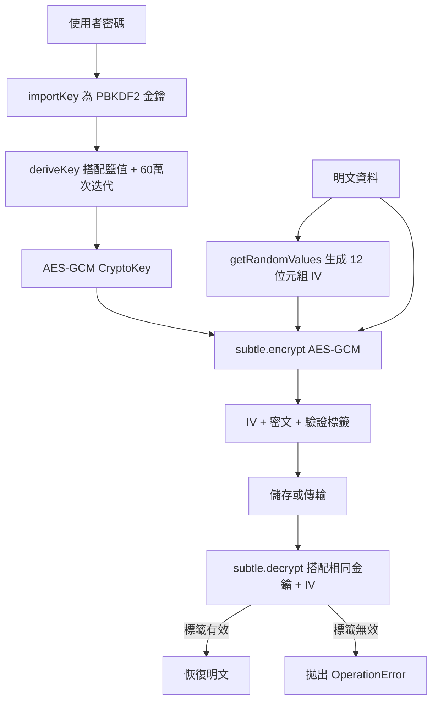

# 用戶端金鑰衍生與 Web Crypto API

Web Crypto API 讓瀏覽器原生存取密碼學基元：雜湊函式、訊息驗證碼、
公鑰演算法、對稱加密，以及金鑰衍生函式。這些基元在原生程式碼中實作
——不是在 JavaScript 程式庫中——並且在二進位資料上運算，而非字串。
與通用的 JavaScript 加密實作相比，結果是執行速度更快，攻擊面也更小。

然而，擁有密碼學基元的存取權，並不意味著在瀏覽器中進行加密總是合適的。
密碼學很容易被以看似安全實則不然的方式誤用。一個根本的約束貫穿始終：
任何存在於瀏覽器端 JavaScript 中的秘密，都可以被該 JavaScript 環境讀取。
若 JavaScript 遭到入侵——透過 XSS、惡意瀏覽器擴充功能，或被入侵的 CDN
指令碼——秘密就會暴露給攻擊者。這並不使瀏覽器加密毫無用處，但它定義了
威脅模型：瀏覽器端金鑰保護資料免受外部觀察者和不應看到明文的伺服器
運營者的威脅，而非保護免受在瀏覽器中具有指令碼執行能力的攻擊者的威脅。

本文涵蓋對前端工程師最相關的密碼學建構模組：`SubtleCrypto` 介面、使用
PBKDF2 和 HKDF 的金鑰衍生、使用 AES-GCM 的對稱加密、何時使用用戶端
加密是正確的選擇，以及在瀏覽器儲存中儲存衍生金鑰的選項。

## 原則

瀏覽器中的密碼學操作必須（MUST）在可能的情況下使用 `crypto.subtle` 介面，
而非 JavaScript 程式庫實作。`crypto.subtle` 在非安全情境中無法呼叫——在
純 HTTP 頁面上它是 `undefined`——這確保密碼學操作只在 HTTPS 上進行。
所有 `crypto.subtle` 方法回傳 Promise，並在 `ArrayBuffer` 和 `TypedArray`
值上運算，而非字串。金鑰材料應該（SHOULD）以瀏覽器金鑰儲存管理的
`CryptoKey` 物件形式儲存，而非以原始位元組儲存在 `localStorage` 中或
在函式呼叫之間持續存在的 JavaScript 變數中。

## 設計思維

### SubtleCrypto 介面及其安全模型

`crypto.subtle` 在瀏覽器中以 `window.crypto.subtle` 的形式提供，在
Web Workers 和 Service Workers 中以 `globalThis.crypto.subtle` 提供。
它被刻意命名為「subtle」以表示正確使用它需要密碼學理解——並非所有 API
的使用方式預設都是安全的。

`crypto.subtle` 最重要的安全屬性是，`CryptoKey` 物件可以建立為不可提取
的。當使用 `extractable: false` 呼叫 `generateKey()` 或 `importKey()` 時，
瀏覽器將金鑰材料儲存在其內部金鑰儲存中，不會將其暴露給 JavaScript。
`encrypt()`、`decrypt()`、`sign()` 和 `verify()` 等操作接受 `CryptoKey`
物件並回傳結果，而不在 JavaScript 記憶體中具體化原始金鑰位元組。這使得
在同一頁面中執行的 JavaScript——包括注入的 XSS 有效載荷——無法透過讀取
變數來竊取金鑰。金鑰存在於瀏覽器的密碼學子系統內部，對指令碼不可存取。

這個不可提取金鑰模型有一個重要限制：金鑰無法被匯出，因此無法在工作階段
之間持久保存。若使用者關閉分頁，`CryptoKey` 就消失了。對於必須在頁面
重新載入後仍然存在的金鑰，下面描述的金鑰衍生方法提供了替代方案：每次
工作階段從使用者提供的密碼或通關密語衍生金鑰，這樣金鑰本身就永遠不需要
被儲存。

`crypto.subtle` 操作是非同步的，回傳 Promise。這不僅僅是設計選擇——它
允許瀏覽器在主執行緒之外執行密碼學操作而不阻塞 UI。對於大型資料緩衝區
的操作（加密大型檔案、生成大型金鑰），這對於回應性很重要。

### 使用 PBKDF2 進行金鑰衍生

PBKDF2（基於密碼的金鑰衍生函式 2）是從使用者提供的密碼或通關密語衍生
密碼學金鑰的標準函式。它的作用是透過對密碼和隨機鹽值執行多次雜湊函式
迭代來使暴力攻擊代價高昂。衍生的金鑰是確定性的——相同的密碼、鹽值和
迭代次數總是產生相同的金鑰——這允許每次工作階段重新衍生金鑰，而非儲存它。

Web Crypto 的 PBKDF2 實作將密碼作為透過 `importKey()` 以 `PBKDF2` 演算法
衍生的 `CryptoKey` 接受。衍生參數包括雜湊函式（`SHA-256` 是標準）、鹽值
（必須與密文一起儲存的隨機位元組陣列），以及迭代次數。迭代次數控制工作
因子：更高的次數減慢暴力攻擊的速度。OWASP 截至 2023 年建議 SHA-256 至
少 600,000 次迭代。PBKDF2 的輸出透過 `deriveKey()` 直接用作 `generateKey()`
的輸入，產生適合用於 AES-GCM 或其他對稱加密的 `CryptoKey`。

鹽值必須是每個密碼衍生金鑰唯一的，以 `crypto.getRandomValues()` 生成，
並與密文一起儲存。鹽值不是秘密——它的目的是防止彩虹表攻擊，而非提供保密
性。沒有鹽值，具有相同密碼的兩個使用者將產生相同的衍生金鑰，而對常見
密碼衍生金鑰的預計算表將允許即時解密任何匹配的密文。

迭代次數是一個設計決策，需要在安全性和使用者體驗之間取得平衡。在 2023 年
的現代硬體上，60 萬次 SHA-256 迭代大約需要 0.5 到 1 秒。這對使用者來說是
可接受的延遲——他們理解密碼衍生是一個明確的操作——但對攻擊者來說，嘗試
數百萬個密碼的速度卻顯著降低。隨著硬體速度的提升，OWASP 建議的迭代次數
每隔幾年就會更新；設計系統時應允許在不重新加密資料的情況下更新迭代次數，
方法是在密文頭部儲存所使用的迭代次數，這樣解密時可以使用正確的參數。

### 使用 HKDF 進行金鑰衍生

HKDF（基於 HMAC 的金鑰衍生函式）服務於與 PBKDF2 不同的目的。PBKDF2
被設計為減慢密碼等低熵輸入的暴力攻擊，而 HKDF 被設計為從單一高熵輸入
衍生多個密碼學上相互獨立的金鑰——通常是透過金鑰交換協定（Diffie-Hellman）
建立的共享秘密，或儲存在硬體安全模組中的主金鑰。

HKDF 分兩個階段運作：提取和擴展。提取階段將輸入金鑰材料與鹽值結合，
產生偽隨機金鑰（PRK）。擴展階段使用 PRK 加上應用程式特定的情境資訊來
衍生任意數量的金鑰，每個金鑰由 `info` 參數區分。`info` 參數編碼衍生金鑰
的用途——例如，以 UTF-8 位元組表示的 `"encryption"` 或 `"authentication"`
——確保加密金鑰和驗證金鑰（兩者都從相同的輸入衍生）在密碼學上是相互
獨立的。

對密碼型金鑰衍生使用 HKDF 是錯誤的：HKDF 不執行工作放大，對暴力攻擊
沒有任何保護。規則很簡單：低熵輸入（密碼）→ PBKDF2；高熵輸入（建立的
共享秘密、硬體儲存的金鑰）→ HKDF。

### 使用 AES-GCM 進行對稱加密

AES-GCM（Galois/計數器模式）是 `crypto.subtle` 所暴露的對稱加密模式，
也是瀏覽器中認證加密的正確選擇。使其成為正確預設值的兩個屬性是：它是
認證加密方案（密文修改可被偵測），且它是標準化且被廣泛分析的。

AES-GCM 需要三個輸入：金鑰、明文和初始化向量（IV）。IV 對於使用相同金鑰
執行的每次加密操作必須是唯一的——使用相同金鑰重複使用 IV 允許攻擊者從兩個
以相同金鑰-IV 組合加密的密文中恢復明文和驗證金鑰。IV 不是秘密；它與密文
一起儲存。以 `crypto.getRandomValues()` 生成的隨機 96 位元（12 位元組）IV，
若每次加密操作都生成新的 IV，可提供足夠的唯一性。

AES-GCM 的輸出是與驗證標籤（預設 16 位元組）串接的密文。`decrypt()` 操作
在回傳明文之前驗證標籤——若密文已被修改，`decrypt()` 拋出名為
`OperationError` 的 `DOMException` 而非回傳損壞的明文。這種認證解密很重要：
它阻止攻擊者製作解密為選定明文的修改密文。

### 何時使用用戶端加密是合適的

用戶端加密在特定場景下是合適的：使用者想要保護其資料免受伺服器運營者的
訪問。端對端加密訊息、零知識雲端儲存，以及伺服器只儲存密文的私人筆記
應用程式，都是這種模型的例子。瀏覽器從使用者的密碼衍生金鑰（密碼永遠不
離開瀏覽器），加密資料，並只上傳密文。伺服器可以驗證身份驗證，但無法
讀取資料內容。

用戶端加密不能替代傳輸安全（HTTPS），不能防禦 XSS，也不能替代伺服器端的
靜態資料加密。應用程式中的 XSS 漏洞可以在加密前攔截明文或在金鑰衍生前
攔截密碼。抵禦被入侵的伺服器是有效的使用案例；抵禦被入侵的瀏覽器情境
僅靠用戶端加密是無法實現的。

判斷用戶端加密是否合適的一個有效問題是：「伺服器若看到未加密的資料，
是否會構成對使用者的違反？」對於醫療記錄、財務資訊，或使用者明確選擇
在提供者無法存取的情況下儲存的私人資料，答案通常是肯定的。對於需要伺服器
處理的資料（搜尋、共享、協作），伺服器必然需要看到明文，用戶端加密就不
適用。在後一種情況下，適當的安全措施是伺服器端的靜態加密、強大的存取
控制，以及審計日誌記錄。

### 瀏覽器中的金鑰儲存

瀏覽器儲存選項對金鑰材料有顯著的取捨。`localStorage` 和 `sessionStorage`
儲存字串——原始位元組必須進行 base64 編碼才能適應，且同一來源上的任何 XSS
有效載荷都可以讀取它們。將衍生金鑰位元組儲存在 `localStorage` 中意味著
金鑰在工作階段之間存活，但也意味著任何具有 XSS 存取權的攻擊者都可以讀取
該金鑰並解密所有受保護的資料。

`IndexedDB` 可以儲存包括以 `JsonWebKey` 格式匯出的 `CryptoKey` 物件在內的
二進位資料。以匯出的 `JsonWebKey` 格式將 `CryptoKey` 儲存在 `IndexedDB` 中
與 `localStorage` 具有相同的 XSS 暴露風險。現代瀏覽器支援直接在 `IndexedDB`
中儲存原始 `CryptoKey` 物件，這保留了金鑰控制代碼而不將原始位元組暴露給
JavaScript——儘管這是否能提供對 XSS 有意義的保護，取決於瀏覽器對 JavaScript
如何與儲存的 `CryptoKey` 物件互動的實作方式。

對於必須持久保存的金鑰，最安全的選擇是完全不儲存它們。在每次工作階段
使用儲存的鹽值透過 PBKDF2 從使用者的密碼重新衍生金鑰。密碼只在衍生過程
中存在於瀏覽器記憶體中，不會被持久化。這需要使用者在每次工作階段輸入
密碼，這通常是安全敏感應用程式的預期使用者體驗。

## 最佳實踐

**必須（MUST）**對 `crypto.subtle` 支援的操作使用 `crypto.subtle`，而非
JavaScript 加密程式庫。JavaScript 實作在與所有其他指令碼相同的安全情境中
運行；原生實作與 JavaScript 記憶體隔離。

**必須（MUST）**為每次 AES-GCM 加密操作使用 `crypto.getRandomValues()` 生成
新的隨機 IV。重複使用相同金鑰的 IV 會災難性地破壞 AES-GCM 的安全保證，
使金鑰流和驗證金鑰均暴露給攻擊者。

**應該（SHOULD）**使用 PBKDF2 進行基於密碼的金鑰衍生，SHA-256 至少進行
600,000 次迭代。較少的迭代次數使對截獲加密資料的離線暴力攻擊變得可行。

**應該（SHOULD）**在金鑰不需要被匯出以供儲存時，以不可提取方式生成金鑰
（`extractable: false`）。不可提取的金鑰即使是同一來源中的 XSS 有效載荷
也無法從 JavaScript 記憶體中讀取。

**禁止（MUST NOT）**使用用戶端加密來對抗在同一頁面上具有指令碼執行能力的
攻擊者——不得假設加密本身能防禦 XSS 攻擊。XSS 繞過所有用戶端金鑰保護——
用戶端加密保護資料免受伺服器和網路觀察者的威脅，而非免受在應用程式旁邊
在瀏覽器中執行的程式碼的威脅。

## 視覺呈現



## 範例

```typescript
// lib/crypto.ts
// 透過 Web Crypto API 使用 PBKDF2 + AES-GCM 的基於密碼的加密。

const PBKDF2_ITERATIONS = 600_000;
const KEY_LENGTH = 256; // AES-256-GCM
const IV_LENGTH = 12;   // 96 位元，AES-GCM 建議值
const SALT_LENGTH = 16; // 128 位元

async function deriveKey(
  password: string,
  salt: Uint8Array,
): Promise<CryptoKey> {
  const enc = new TextEncoder();
  const passwordKey = await crypto.subtle.importKey(
    'raw',
    enc.encode(password),
    'PBKDF2',
    false, // 不可提取
    ['deriveKey'],
  );

  return crypto.subtle.deriveKey(
    {
      name: 'PBKDF2',
      salt,
      iterations: PBKDF2_ITERATIONS,
      hash: 'SHA-256',
    },
    passwordKey,
    { name: 'AES-GCM', length: KEY_LENGTH },
    false, // 不可提取
    ['encrypt', 'decrypt'],
  );
}

export async function encrypt(
  plaintext: string,
  password: string,
): Promise<ArrayBuffer> {
  const salt = crypto.getRandomValues(new Uint8Array(SALT_LENGTH));
  const iv = crypto.getRandomValues(new Uint8Array(IV_LENGTH));
  const key = await deriveKey(password, salt);

  const enc = new TextEncoder();
  const ciphertext = await crypto.subtle.encrypt(
    { name: 'AES-GCM', iv },
    key,
    enc.encode(plaintext),
  );

  // 將 salt + iv + ciphertext 打包到單一緩衝區中以供儲存
  const result = new Uint8Array(
    SALT_LENGTH + IV_LENGTH + ciphertext.byteLength,
  );
  result.set(salt, 0);
  result.set(iv, SALT_LENGTH);
  result.set(new Uint8Array(ciphertext), SALT_LENGTH + IV_LENGTH);
  return result.buffer;
}

export async function decrypt(
  data: ArrayBuffer,
  password: string,
): Promise<string> {
  const bytes = new Uint8Array(data);
  const salt = bytes.slice(0, SALT_LENGTH);
  const iv = bytes.slice(SALT_LENGTH, SALT_LENGTH + IV_LENGTH);
  const ciphertext = bytes.slice(SALT_LENGTH + IV_LENGTH);

  const key = await deriveKey(password, salt);

  const plaintext = await crypto.subtle.decrypt(
    { name: 'AES-GCM', iv },
    key,
    ciphertext,
  ); // 若密文被修改則拋出 OperationError

  return new TextDecoder().decode(plaintext);
}
```

## 常見錯誤

- 使用固定或硬編碼的 IV，而非為每次加密使用 `crypto.getRandomValues()`——
  使用相同金鑰重複使用 AES-GCM IV 會災難性地洩漏金鑰流並破壞驗證
- 對密碼衍生金鑰使用 HKDF——HKDF 不執行工作放大，對密碼暴力攻擊沒有
  任何保護
- 將密碼儲存在 `localStorage` 以避免重新輸入——儲存中的密碼與金鑰本身
  具有相同的 XSS 暴露風險
- 在新程式碼中使用沒有 GCM 模式的 AES（如 AES-CBC）——CBC 不提供驗證，
  因此修改後的密文在沒有偵測的情況下解密為亂碼

## 相關 FEE

- FEE-1200: 深入探討內容安全政策（CSP）
- FEE-1209: 開放重新導向防護與 URL 驗證
- FEE-1204: 前端專案的供應鏈安全

## 參考資料

- [MDN: SubtleCrypto](https://developer.mozilla.org/zh-TW/docs/Web/API/SubtleCrypto)
- [W3C Web Crypto API 規範](https://www.w3.org/TR/WebCryptoAPI/)
- [OWASP: 密碼儲存速查表](https://cheatsheetseries.owasp.org/cheatsheets/Password_Storage_Cheat_Sheet.html)
