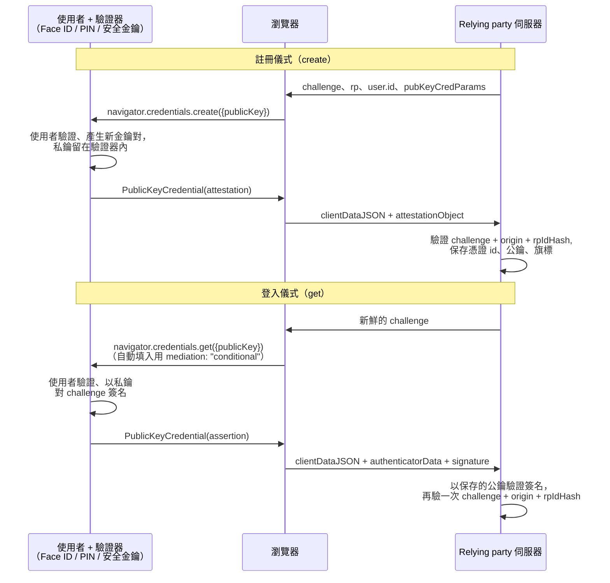

# [FEE-1211] WebAuthn 與 Passkeys

:::info
Web Authentication API（WebAuthn）用公開金鑰密碼學取代共享祕密：註冊時使用者的驗證器鑄造一對金鑰，伺服器只保存公鑰，之後每一次登入都是驗證器對伺服器發出的 challenge 簽名——而這個簽名在密碼學上綁定了來源（origin），這正是像素級仿冒的釣魚網站什麼有用的東西都拿不到的原因。*Passkeys* 是同一套機制的消費級包裝：可探索憑證（discoverable credentials）、以生物特徵或 PIN 完成使用者驗證，並由使用者的憑證管理器跨裝置同步。規範在 2026 年 1 月達到 Level 3 Candidate Recommendation，昔日粗糙的邊緣已然收斂——條件式 UI（passkey 自動填入）無處不在、Related Origin Requests 隨 Firefox 152 補上最後一塊瀏覽器拼圖、Signal API 給了網站清理過期憑證的正規管道。用戶端 API 很小；實際部署裡幾乎每一個缺陷都出在伺服器端驗證或帳號生命週期。
:::

## 背景

密碼的失敗是結構性的——可釣魚、可重複使用、資料庫一破全破——而第一代硬體解方 FIDO U2F 只是在密碼上拴了一個第二因素。WebAuthn（2019 年 3 月 Level 1 W3C Recommendation、2021 年 Level 2、2026 年 1 月 Level 3 CR）把它一般化為主要憑證，但早期部署卡在一個難題：使用者弄丟存著私鑰的手機怎麼辦？業界在 2022 年給出的答案是 passkeys——由憑證管理器跨裝置同步的可探索 WebAuthn 憑證——用「唯一一把硬體綁定金鑰」的安全敘事換取可復原性，也把 WebAuthn 從企業 MFA 工具變成消費級的密碼替代品。本文站在用戶端接縫上：兩個儀式（ceremony）、決定你拿到哪種憑證的選項，以及區分 demo 與正式上線的部署功能（條件式 UI、Related Origin Requests、Signal API）。之後的伺服器端工作階段處理屬於[身分驗證與 Token 儲存](/zh-tw/Security/1202)的領域。

## 視覺對比



## 範例

註冊一把 passkey 是一次 `create()` 呼叫；選項決定一切。`residentKey: "required"` 讓憑證可探索（成為 passkey 而非伺服器端憑證），`userVerification` 要求生物特徵/PIN，`excludeCredentials` 阻止同一個驗證器重複註冊：

```js
const credential = await navigator.credentials.create({
  publicKey: {
    challenge: challengeFromServer,          // >= 16 隨機位元組，伺服器鑄造、單次使用
    rp: { id: "example.com", name: "Example" },
    user: {
      id: userHandleFromServer,              // 隨機、永久、無 PII——不是 email
      name: "jamie@example.com",             // 選擇器顯示的字串
      displayName: "Jamie Doe",
    },
    pubKeyCredParams: [
      { type: "public-key", alg: -7 },       // ES256
      { type: "public-key", alg: -257 },     // RS256 後備
    ],
    authenticatorSelection: {
      residentKey: "required",               // 可探索憑證 = passkey
      userVerification: "preferred",
    },
    excludeCredentials: existingCredentials, // [{ type: "public-key", id, transports }]
    attestation: "none",                     // 受監管場景以外的正確預設
  },
});
// 把 credential.toJSON() POST 給伺服器；用 WebAuthn 函式庫驗證並保存。
```

用**條件式中介（conditional mediation）**登入，是讓 passkeys 用起來像自動填入的關鍵：promise 在頁面載入時就發出、保持擱置，等使用者從提供已存密碼的同一個下拉選單裡挑一把 passkey 才解析：

```html
<input type="text" name="username" autocomplete="username webauthn" />
```

```js
const caps = await PublicKeyCredential.getClientCapabilities?.();
if (caps?.conditionalGet) {
  const assertion = await navigator.credentials.get({
    publicKey: {
      challenge: freshChallengeFromServer,
      rpId: "example.com",
      userVerification: "preferred",
      // 省略 allowCredentials：此 rpId 下任何可探索憑證都可回應
    },
    mediation: "conditional",   // 沒有彈窗；出現在自動填入下拉選單
    signal: abortController.signal, // 之後要發彈窗式 get() 前先中止
  });
  await verifyOnServer(assertion.toJSON());
}
```

接著由伺服器完成真正承載安全性的部分：重算並比對 challenge、檢查 `clientDataJSON.origin`、檢查 `rpIdHash`、用保存的公鑰驗證簽名——用維護中的函式庫，不要手工解析。

當伺服器與驗證器出現漂移——使用者刪了帳號、或在網站上移除了一把 passkey——**Signal API** 讓頁面通知憑證管理器，死掉的 passkey 就不再出現在選擇器裡：

```js
// 對伺服器已不認得的憑證做出失敗斷言之後：
await PublicKeyCredential.signalUnknownCredential({
  rpId: "example.com",
  credentialId: base64UrlCredentialId,
});
// 登入後，同步完整清單與目前的使用者資訊：
await PublicKeyCredential.signalAllAcceptedCredentials({
  rpId: "example.com", userId: base64UrlUserHandle, allAcceptedCredentialIds: ids,
});
```

## 最佳實踐

- **必須（MUST）**在伺服器端鑄造 challenge（至少 16 隨機位元組）、綁定工作階段、單次使用，並在伺服器端驗證它——連同 `origin` 與 `rpIdHash`。用戶端「驗證」是演戲；請使用成熟的 WebAuthn 函式庫。
- **必須（MUST）**讓 `user.id` 是不含 PII 的隨機永久代號——不是 email；使用者名稱會改，而 user handle 永遠不變且對驗證器可見。
- **必須（MUST）**在每次 `create()` 傳入使用者已註冊的憑證 ID 作為 `excludeCredentials`，否則使用者會在同一台裝置上堆出重複的 passkey。
- **必須（MUST）**每個儀式都重新要一個新鮮的 challenge；快取 challenge 等於重新打開 challenge 本來要關上的重放漏洞。
- **應該（SHOULD）**消費級 passkeys 預設 `residentKey: "required"`、`userVerification: "preferred"`、`attestation: "none"`——並抵抗驗證器白名單的誘惑，規範自己就警告那會割裂生態系。
- **應該（SHOULD）**把條件式 UI（`autocomplete="username webauthn"` 加上 `mediation: "conditional"`）作為主要登入路徑出貨，並在發起彈窗式請求前中止擱置中的條件式請求。
- **應該（SHOULD）**保存儀式交給你的逐憑證中繼資料——AAGUID、transports、backup-eligible/backup-state 旗標、建立時間——並在每一次新註冊時通知帳號擁有者；攻擊者加上的 passkey 正是要抓的帳號接管痕跡。
- **應該（SHOULD）**準備一個不是「永遠退回可釣魚密碼」的帳號復原故事：經同步在新裝置取得 passkey、跨裝置登入（hybrid/QR 流程）、或走帶外通道重新驗證。
- **可以（MAY）**用 Related Origin Requests 讓一把 passkey 服務兄弟網域：在 `https://example.com/.well-known/webauthn` 列出相關來源——Chrome/Edge 128+、Safari 18 與 Firefox 152 如今都支援。
- **可以（MAY）**只對硬體金鑰把 `signCount` 當作複製驗證器的啟發式訊號——同步的 passkeys 合法地永遠回報 0。

## 設計思維

**來源綁定就是全部的重點。**TOTP 或簡訊 OTP 是持有者祕密：誰拿到——包括使用者剛剛把它輸進去的釣魚代理——誰就能重放。WebAuthn 斷言簽的是瀏覽器實際看到的 origin，所以釣魚網站唯一能拿到的，是一個只對釣魚網站有效的簽名。這個性質犧牲了部署彈性：憑證被限定在一個 `rpId`（可註冊網域或其後綴）之內，這正是多品牌公司需要 Related Origin Requests——一份由伺服器公開發布的明確允許清單——而不是被允許在 JavaScript 裡放鬆綁定的原因。

**同步 passkeys 用 attestation 換可復原性。**硬體金鑰上的裝置綁定金鑰有最強的敘事（「就是這顆安全元件」）與最糟的失敗模式（金鑰遺失、使用者被鎖死）。Passkeys 把它反過來：憑證管理器跨裝置同步私鑰、帳號復原變成同步供應商的問題，交換條件是 relying party 大致失去有意義的 attestation 與 `signCount` 訊號。`authenticatorData` 裡的 `BE`/`BS`（backup eligible / backed up）旗標，存在的意義就是讓 relying party 至少*觀察得到*每把憑證活在哪個世界，據以校準升級驗證（step-up）政策。

**預設值是為了對抗割裂而調校的。**以 `attestation: "none"` 為建議預設、規範警告不要維護驗證器白名單，都是刻意的生態系政策：如果每個網站都要求 direct attestation、按廠商憑證放行，網路就會在開放標準之上重建裝置鎖定。有法規要求的企業自行選擇加入 attestation；其他人得到更簡單的儀式與更廣的裝置支援。

## 深入探討

**伺服器實際解析什麼。**兩個儀式都回傳 `PublicKeyCredential`，其 `response` 帶著 `clientDataJSON`——瀏覽器書寫的 `type`、`challenge`、`origin` 紀錄——以及驗證器書寫的酬載：`attestationObject`（註冊）或 `authenticatorData + signature + userHandle`（登入）。`authenticatorData` 打包了 `rpIdHash`、旗標位元組（`UP` 使用者在場、`UV` 使用者已驗證、`BE`/`BS` 備份位元）與簽名計數器。這個切分很重要，因為兩半的完整性檢查方式不同：簽名涵蓋 authenticator data 加上 `clientDataJSON` 的雜湊，所以任何一半被調包都會讓驗證失敗。Level 3 的 `toJSON()`/`parseCreationOptionsFromJSON()` 輔助函式終結了手工 base64url 水電工時代。

**演算法與金鑰材料。**`pubKeyCredParams` 是 COSE 演算法偏好清單；`-7`（ES256）與 `-257`（RS256）實質覆蓋所有驗證器，保存的公鑰以 COSE 編碼放在 attestation object 裡送達。私鑰的任何部分都不曾過線——歷久彌新的心智模型是「伺服器存一把鎖，驗證器握著唯一的鑰匙」。

**範圍與內嵌規則。**`rpId` 必須是呼叫者的可註冊網域或其可註冊後綴（`login.example.com` 可以用 `example.com`；不能用 `example.org`）。跨來源 iframe 需要 Permissions Policy 委派——登入用 `publickey-credentials-get`、註冊用 `publickey-credentials-create`（外加瞬時啟動）——這是內嵌結帳與 SSO 元件合法執行 WebAuthn 的方式。Related Origin Requests 把 `rpId` 的效力延伸到 `rpId` 主機上 `/.well-known/webauthn` 所列的來源，受瀏覽器強制的標籤數上限約束，讓允許清單握在網域擁有者手裡。

**特性偵測如今是一次呼叫。**`PublicKeyCredential.getClientCapabilities()` 回報 `userVerifyingPlatformAuthenticator`、`conditionalGet`、`relatedOrigins`、`signalAllAcceptedCredentials` 等能力——取代早期版本零散的 `isUserVerifyingPlatformAuthenticatorAvailable()` / `isConditionalMediationAvailable()` 布林對（在 L3 之前的瀏覽器仍在時保留舊呼叫作為後備）。

## Passkey 導入手冊

一條已成業界事實標準的漸進路徑：

1. **量測能力，不動 UX。**在登入頁呼叫 `getClientCapabilities()`，量測今天有多少比例的使用者能用平台 passkey。
2. **在密碼登入成功後提供建立。**登入後是你同時擁有強驗證工作階段與使用者注意力的唯一時刻；以「下次更快登入」為框架，並帶上填好的 `excludeCredentials` 註冊。
3. **打開條件式 UI。**加上 `autocomplete="username webauthn"` 與擱置的條件式 `get()`；有 passkey 的使用者自然漂移過去，沒有的使用者看不出任何差別。
4. **把 passkey 升為主要路徑。**回訪使用者的登入按鈕觸發彈窗式 `get()`，密碼收進「更多選項」；為借用筆電的情境保留跨裝置（QR/hybrid）登入。
5. **自動化衛生。**把 Signal API 接進憑證刪除與帳號變更、每次新註冊都通知，然後才考慮為 passkey 覆蓋的帳號移除密碼——且復原流程不能悄悄重新引入可釣魚通道。

直接跳到第 4 步是經典的失敗導入：還沒有 passkey 的使用者遇上一個他們無法滿足的彈窗，你量到的會是客服工單，不是採用率。

## 延伸閱讀

- [Authentication & Token Storage](/zh-tw/Security/1202)
- [Client-Side Key Derivation & Web Crypto API](/zh-tw/Security/1210)
- [HTTPS, Secure Headers & Cookie Attributes](/zh-tw/Security/1206)
- [Autocomplete Token Reference](/zh-tw/HTML and Semantic Markup/autocomplete-token-reference)
- [Permissions API](/zh-tw/Browser APIs and Web Platform/415)

## 參考資料

- MDN contributors, "Web Authentication API," MDN Web Docs (2026). https://developer.mozilla.org/en-US/docs/Web/API/Web_Authentication_API
- W3C, "Web Authentication: An API for accessing Public Key Credentials — Level 3," W3C Candidate Recommendation (2026). https://www.w3.org/TR/webauthn-3/
- web.dev team, "Create a passkey for passwordless logins," web.dev (2022, updated). https://web.dev/articles/passkey-registration
- W3C WebAuthn WG, "Explainer: WebAuthn Signal API," w3c/webauthn GitHub wiki (2024). https://github.com/w3c/webauthn/wiki/Explainer:-WebAuthn-Signal-API-explainer
- Corbado team, "WebAuthn Related Origin Requests (ROR): Cross-Domain Passkey Guide," corbado.com (2024, updated). https://www.corbado.com/blog/webauthn-related-origins-cross-domain-passkeys

## 變更紀錄

- **2026** — WebAuthn Level 3 發布為 Candidate Recommendation（1 月）；Firefox 152 出貨 Related Origin Requests（5 月），補上最後一個主要瀏覽器缺口。
- **2025-01** — Signal API（`signalUnknownCredential`、`signalAllAcceptedCredentials`、`signalCurrentUserDetails`）在 Chrome/Edge 132 預設開啟。
- **2024** — Related Origin Requests 隨 Chrome/Edge 128 與 Safari 18 出貨；JSON 序列化輔助函式（`toJSON`、`parseCreationOptionsFromJSON`）在各瀏覽器普及。
- **2022** — Passkeys：各大平台宣布同步式可探索憑證，把 WebAuthn 重新定位為消費級密碼替代品。
- **2021 / 2019** — WebAuthn Level 2 / Level 1 發布為 W3C Recommendation。
