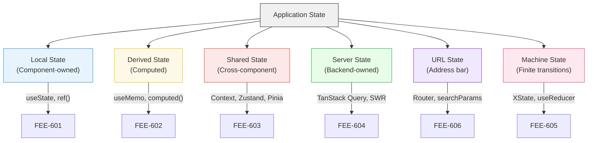
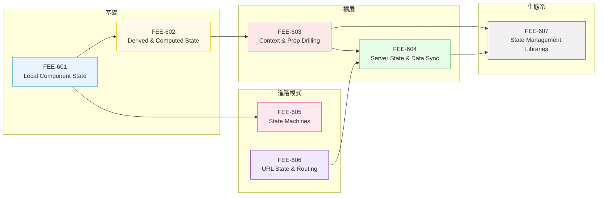

# [FEE-600] 狀態管理總覽

:::info
本類別涵蓋如何組織、存取與同步驅動 UI 的資料 -- 從單一布林值的切換到複雜的多來源伺服器資料。
:::

## 背景脈絡

現代前端 UI 是底層資料的函數：表單輸入、認證 token、快取的 API 回應、URL 參數、動畫進度。**UI = f(state)** 寫起來簡單，跑起來困難。實作上，狀態來自多個非同步來源（使用者事件、網路回應、WebSocket、瀏覽器 API），必須在多個元件之間保持一致，並且常常需要跨頁面導航、分頁切換、甚至離線期間持續存在。

真正的困難在依賴鏈，而依賴鏈來自狀態彼此相依。一個 loading spinner 取決於 fetch 請求；fetch 請求取決於 URL 參數；URL 參數取決於使用者操作；使用者操作又取決於認證狀態。鏈上任一環節更新不正確，UI 就會不一致，使用者也會失去信任。

### 狀態分類法（State Taxonomy）

並非所有狀態都是等價的。辨識你正在處理的狀態*類型*是選擇正確工具的第一步：

| 分類 | 說明 | 範例 | 典型工具 |
|---|---|---|---|
| **Local State（元件本地狀態）** | 屬於單一元件 | 展開/收合切換、輸入值、hover 狀態 | `useState`, `ref()` |
| **Derived State（衍生狀態）** | 由其他狀態計算而來 | 篩選後清單、總價、全名 | `useMemo`, `computed()` |
| **Shared State（共享狀態）** | 多個元件需要存取 | 主題、語系、購物車 | Context, Zustand, Pinia |
| **Server State（伺服器狀態）** | 由後端擁有的非同步資料 | 使用者資料、商品清單、通知 | TanStack Query, SWR |
| **URL State（網址狀態）** | 編碼在 URL 中 | 搜尋關鍵字、分頁、篩選條件 | Router params, `useSearchParams` |
| **Machine State（機器狀態）** | 有限的、明確的狀態轉換 | 多步驟表單、認證流程、媒體播放器 | XState, `useReducer` |

不同分類有不同的所有權、更新來源與生命週期。把 server state 當作 local UI state 處理、或把所有東西塞進全域 store，是過度工程化的常見來源。

### 依狀態類型選工具

上表已經回答了「什麼狀態用什麼工具」。實務上，一個應用通常同時用到其中幾類：`useState` 管本地狀態、TanStack Query 管 server state、URL 參數管可分享的篩選條件。這些工具彼此正交，沒有一個是另一個的進階版。

全域 store（Zustand、Pinia、Redux Toolkit）只在跨元件共享的客戶端狀態真的存在時才引入。狀態機（XState）只在流程的有效轉移可以被明確列舉時才需要。從 `useState` 不會「畢業」到 TanStack Query 或 XState，它們處理的是不同問題。

## 設計思維（Design Thinking）

### 為什麼狀態這麼難管

三股力量使狀態管理特別困難：

1. **多個非同步來源。** 使用者互動、API 回應、WebSocket 訊息、瀏覽器事件（resize、online/offline）和計時器都會產生狀態更新。這些來源在不同的時間尺度上運作，並且可能以任意順序到達。

2. **元件樹的一致性。** 當使用者登出時，每個顯示使用者專屬資料的元件都必須更新。當商品被加入購物車時，header 徽章、購物車抽屜和結帳頁面都必須反映變更。不一致性會立即被使用者察覺並削弱信任。

3. **UI = f(state) 的契約。** 既然 UI 是狀態的純函數，任何資料層面的 bug 都會被歸到狀態管理層：按鈕該停用卻沒停用、導航後仍顯示前一個使用者的資料、載入過程閃過錯誤內容。UI 的可預測性，被狀態管理層的可預測性所限制。

### 過度工程化的陷阱（The Over-Engineering Trap）

一個常見錯誤是太早引入狀態管理函式庫。

考慮典型的演變過程：
- 開發者在教學文章中讀到 Redux 並將其加入新專案
- 每一段狀態都進入全域 store，包括表單輸入值和 modal 的可見性
- 程式碼庫累積大量樣板程式碼：actions、reducers、selectors、middleware
- 效能下降，因為 store 訂閱粒度過粗：沒切 selector 時，無關欄位的變更也會觸發元件 re-render
- 團隊得出「狀態管理很難」的結論，但真正的問題是不必要的間接層

**務實的做法：**
- 用 `useState` / `ref()` 處理元件本地的狀態，多數狀態本來就只屬於一個元件
- 用 server-cache 函式庫（TanStack Query、SWR）處理非同步資料：這類函式庫處理 refetch、快取失效、樂觀更新，`useState` 自己寫不到
- 跨元件共享的客戶端狀態，才考慮輕量級 store（Zustand、Jotai、Pinia）
- 流程的有效轉移可被明確列舉時，才用狀態機（XState）

這種分層方法意味著大多數元件對外部狀態函式庫零依賴，使它們更容易測試、搬移和重構。

## 視覺化（Visual）

### 狀態分類法

### 類別路線圖（FEE-601 至 FEE-607）

## 相關 FEE 文章

- [FEE-500](../Component%20Architecture%20and%20Design%20Patterns/500.md) Component Architecture & Design Patterns Overview -- 狀態存在於元件內部；架構決定狀態應該放在哪裡
- [FEE-502](../Component%20Architecture%20and%20Design%20Patterns/502.md) Reactive State & Signals -- 使狀態變更對 UI 可見的底層機制

## 參考資料

- [React: Managing State](https://react.dev/learn/managing-state) -- 官方指南，涵蓋 useState、useReducer、context 和狀態結構
- [Vue.js: State Management](https://vuejs.org/guide/scaling-up/state-management) -- 官方指南，介紹 reactive state、composables 和 Pinia
- [Pinia Introduction](https://pinia.vuejs.org/introduction.html) -- Vue 官方推薦的狀態管理函式庫文件
- [TanStack Query Overview](https://tanstack.com/query/latest/docs/framework/react/overview) -- React 領先的 server-state 函式庫
- [XState Documentation](https://stately.ai/docs) -- 用於複雜 UI 流程的狀態機與 statechart
- [TC39 Signals Proposal](https://github.com/tc39/proposal-signals) -- 新興的 reactive state primitives 標準
- [Patterns.dev: State Management](https://www.patterns.dev/) -- 常見狀態模式的視覺化解說
- [Kent C. Dodds: Application State Management with React](https://kentcdodds.com/blog/application-state-management-with-react) -- 關於保持狀態 co-located 的重要文章
