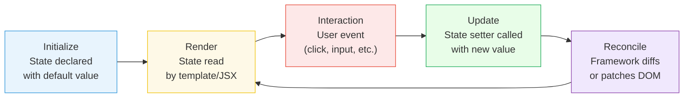

# [FEE-601] 本地元件狀態（Local Component State）

:::info
本地元件狀態（local component state）是所有 UI 框架中最簡單也最常見的狀態形式 -- 由單一元件完全擁有與管理的資料。掌握它是所有其他狀態管理模式的基礎。
:::

## 背景脈絡

每個互動式元件都需要在渲染之間記住某些東西：下拉選單是否展開、使用者在輸入框中輸入了什麼、按鈕被點擊了幾次。這就是**本地元件狀態（local component state）** -- 屬於單一元件的資料，對應用程式的其他部分不可見，並透過框架的 reactivity 系統管理。

本地狀態是預設選擇。在使用 context、store 或全域狀態管理函式庫之前，問題應該永遠是：「這個狀態可以存在於單一元件內嗎？」如果答案是肯定的，就讓它保持本地。這個原則 -- 通常稱為**狀態就近原則（state co-location）** -- 意味著將狀態放在盡可能靠近使用它的地方。

### 為什麼本地狀態很重要

在架構良好的應用程式中，大多數狀態都是本地的：

- **表單輸入** -- 文字欄位、核取方塊、日期選擇器的當前值
- **UI 切換** -- 開啟/關閉、展開/收合、顯示/隱藏
- **暫態互動狀態** -- hover、focus、拖曳位置
- **元件內部計數器** -- 分頁索引、輪播幻燈片、重試次數

根據經驗，資深開發者通常發現**應用程式中 60-70% 的所有狀態都可以保持本地**。保持狀態本地可以降低耦合度、簡化測試，並使元件具有可攜性。

### 框架全景

每個現代框架都提供本地狀態的基本原語（primitive），但底層的 reactivity 模型有顯著差異：

| 框架 | 原語（Primitive） | 模型 | 重新渲染範圍 |
|---|---|---|---|
| React | `useState`, `useReducer` | Immutable，排程 re-render | 整個元件子樹 |
| Vue | `ref()`, `reactive()` | Mutable proxy，fine-grained | 僅受影響的綁定 |
| Svelte 5 | `$state` rune | 編譯器轉換 | 由編譯器決定 |
| Solid | `createSignal` | Signal getter/setter | 精確的 DOM 節點 |
| Angular 16+ | `signal()` | Signal，`.set()` / `.update()` | 僅 signal 消費者 |

這些差異不只是 API 瑣事 -- 它們從根本上影響你對更新、效能和元件設計的思考方式。

## 設計思維（Design Thinking）

### 為什麼元件需要內部狀態

三個原則驅動了本地狀態的需求：

**封裝（Encapsulation）。** 設計良好的元件會隱藏其實作細節。一個 `<Dropdown>` 不需要讓父元件知道它是開啟還是關閉的。本地狀態強制執行這個邊界 -- 元件擁有自己的資料，父元件只透過 props 和 events 互動。

**就近原則（Co-location）。** 當狀態和讀取或更新它的程式碼在同一個檔案中，元件更容易理解、重構和刪除。將狀態移出元件會引入間接層和耦合度，這必須由真實需求（多個消費者、持久化等）來合理化。

**簡單性（Simplicity）。** 本地狀態具有最小的 API 表面和最少的儀式。不需要配置 store、不需要包裝 provider、不需要 memoize selector。這種簡單性不是弱點 -- 而是特性。最好的狀態管理就是最少的狀態管理。

### Reactivity 模型比較

框架之間最根本的差異在於它們如何回答這個問題：**「當狀態改變時，會發生什麼？」**

**React：不可變快照（immutable snapshot），重新渲染子樹。**
當你在 React 中呼叫 state setter 時，整個元件函式從頭到尾重新執行。React 接著 diff 虛擬 DOM 並 patch 真實 DOM。這意味著每個變數、每個 inline function、每個 JSX 表達式都會被重新求值。React 透過 batching（將多個 `setState` 呼叫合併為一次 re-render）和 memoization（`React.memo`、`useMemo`、`useCallback`）來優化，但根本模型是：狀態改變觸發元件重新執行。

**Vue：可變代理（mutable proxy），細粒度追蹤（fine-grained tracking）。**
Vue 將 reactive state 包裝在 JavaScript Proxy 中。當 template 讀取 `count.value` 時，Vue 記錄此 template 綁定依賴於 `count`。當 `count.value` 改變時，Vue 精確知道哪些綁定需要更新 -- 它不會重新執行整個元件。這種細粒度的依賴追蹤意味著 Vue 元件在綁定層級是 reactive 的，而非元件層級。

**Svelte 5：編譯器驅動的 reactivity。**
Svelte 的 `$state` rune 是編譯時轉換。Svelte 編譯器分析你的程式碼並產生高效的更新指令。沒有虛擬 DOM、沒有 proxy -- 編譯器靜態決定當特定變數改變時需要更新什麼。物件和陣列在執行時成為深度 reactive proxy，但原始值更新會編譯為直接的 DOM 操作。

**Solid：真正的 signals，沒有元件重新渲染。**
Solid 的 `createSignal` 回傳一個 getter 函式和一個 setter 函式。Solid 中的元件只執行一次 -- 它們永遠不會重新執行。相反，reactive graph 追蹤哪些 DOM 節點依賴於哪些 signals，並只更新那些節點。這意味著在 Solid 中不存在「重新渲染元件」的概念；只有 signal 更新傳播到其訂閱者。

**Angular：帶有 zone-free change detection 的 Signals。**
Angular signals（v16+）取代了傳統的 zone.js-based change detection。`signal()` 建立一個 reactive 值；`computed()` 從中衍生；`effect()` 對變更做出反應。當 signal 更新時，Angular 精確知道哪些 template 表達式依賴於它，可以跳過其餘部分的 dirty-checking。這將 Angular 推向類似 Vue 和 Solid 的 fine-grained reactivity。

### Re-Render 問題

Reactivity 模型的差異不是學術性的 -- 它影響日常的程式設計決策：

- 在 **React** 中，你擔心不必要的 re-render，並使用 `useMemo`、`useCallback` 和 `React.memo`。
- 在 **Vue** 中，你很少考慮 re-render，因為 proxy 系統自動處理粒度，但你必須理解 ref 解包（unwrapping）和 reactivity 注意事項。
- 在 **Svelte** 中，編譯器負責優化工作，但你需要理解賦值（reassignment，`count = count + 1`）才是觸發器，而非 mutation。
- 在 **Solid** 中，你必須記住 getter 是一個函式呼叫（`count()`，不是 `count`），而且解構 props 會破壞 reactivity。
- 在 **Angular** 中，你對 signals 呼叫 `.set()` 或 `.update()` 並讓框架處理其餘部分。

## 最佳實踐

**將狀態盡可能保持在本地 -- 只在真正需要共享時才提升。** 狀態應該存在於使用它的元件中。SHOULD 只在第二個元件確實需要時才提升狀態，而非預防性地提升。過早提升會增加耦合度，使元件更難理解和獨立刪除。

**當更新邏輯變得複雜時，優先使用 `useReducer` 而非 `useState`。** 當狀態更新導致 bug、多個 `useState` 呼叫在同一個處理器中一起更新，或下一個狀態以非簡單方式依賴於前一個狀態時，SHOULD 合併為 `useReducer`。Reducer 集中管理轉換邏輯，使每個狀態變更明確且可追蹤，並且更易於獨立測試。

**對昂貴的計算使用延遲初始化（lazy initializer）。** 當初始狀態值需要昂貴的計算（解析、篩選、反序列化）時，SHOULD 傳遞函式給 `useState` 而非傳值：`useState(() => expensiveCompute())`。初始化函式只在掛載時執行一次，而非每次 re-render。直接傳遞結果（`useState(expensiveCompute())`）則在每次渲染時都重新計算，即使結果被丟棄。

## 視覺化（Visual）

### 本地狀態生命週期（Local State Lifecycle）



### Reactivity 模型比較



```mermaid
flowchart TD
    subgraph React
        R1["setState(newVal)"] --> R2["Re-run component fn"] --> R3["Virtual DOM diff"] --> R4["Patch real DOM"]
    end

    subgraph Vue
        V1["ref.value = newVal"] --> V2["Proxy trap fires"] --> V3["Notify tracked deps"] --> V4["Update bound DOM nodes"]
    end

    subgraph Solid
        S1["setSignal(newVal)"] --> S2["Signal notifies subscribers"] --> S3["Update exact DOM nodes"]
    end

    style R1 fill:#61dafb,stroke:#333
    style V1 fill:#42b883,stroke:#333
    style S1 fill:#4f88c6,stroke:#333
```

## 範例（Example）

### 1. React -- useState 計數器

```jsx
import { useState } from 'react';

function Counter() {
  const [count, setCount] = useState(0);

  return (
    <div>
      <p>Count: {count}</p>
      <button onClick={() => setCount(count + 1)}>
        Increment
      </button>
      <button onClick={() => setCount(prev => prev - 1)}>
        Decrement (functional update)
      </button>
    </div>
  );
}
```

重點：
- `useState(0)` 回傳當前值和一個 setter 函式。
- Setter 可以接受一個新值或一個接收前一個值的函式（functional update）。
- React 將同一個 event handler 中的多個 `setCount` 呼叫批次處理為單一 re-render（React 18 起的 automatic batching）。
- 每次狀態改變時，整個 `Counter` 函式都會重新執行。

### 2. React -- useReducer 處理複雜狀態

```jsx
import { useReducer } from 'react';

const initialState = { count: 0, step: 1 };

function reducer(state, action) {
  switch (action.type) {
    case 'increment':
      return { ...state, count: state.count + state.step };
    case 'decrement':
      return { ...state, count: state.count - state.step };
    case 'setStep':
      return { ...state, step: action.payload };
    default:
      throw new Error(`Unknown action: ${action.type}`);
  }
}

function StepCounter() {
  const [state, dispatch] = useReducer(reducer, initialState);

  return (
    <div>
      <p>Count: {state.count} (step: {state.step})</p>
      <button onClick={() => dispatch({ type: 'increment' })}>+</button>
      <button onClick={() => dispatch({ type: 'decrement' })}>-</button>
      <input
        type="number"
        value={state.step}
        onChange={e => dispatch({ type: 'setStep', payload: Number(e.target.value) })}
      />
    </div>
  );
}
```

重點：
- `useReducer` 將相關的狀態轉換集中在一個純 reducer 函式中。
- 內部實作上，`useState` 就是使用基礎 reducer 的 `useReducer` -- 它們共享相同的機制。
- 當你有 3 個以上相關的 `useState` 呼叫，或下一個狀態以複雜方式依賴前一個狀態時，優先使用 `useReducer`。

### 3. Vue -- ref 計數器

```vue
<script setup>
import { ref } from 'vue';

const count = ref(0);

function increment() {
  count.value++;
}

function decrement() {
  count.value--;
}
</script>

<template>
  <div>
    <p>Count: {{ count }}</p>
    <button @click="increment">Increment</button>
    <button @click="decrement">Decrement</button>
  </div>
</template>
```

重點：
- `ref(0)` 回傳一個帶有 `.value` 屬性的 reactive 參考物件。
- 在 template 中，Vue 自動解包 refs -- 你寫 `count`，不是 `count.value`。
- 在 script 中，你必須明確存取 `.value`。
- Vue 追蹤哪些 template 表達式依賴於哪些 refs，並只更新那些 DOM 節點。

### 4. Solid -- createSignal 計數器

```jsx
import { createSignal } from 'solid-js';

function Counter() {
  const [count, setCount] = createSignal(0);

  return (
    <div>
      <p>Count: {count()}</p>
      <button onClick={() => setCount(c => c + 1)}>
        Increment
      </button>
      <button onClick={() => setCount(c => c - 1)}>
        Decrement
      </button>
    </div>
  );
}
```

重點：
- `createSignal(0)` 回傳一個 getter *函式*和一個 setter 函式。
- 你必須呼叫 `count()` 來讀取值 -- 這是 Solid 追蹤依賴的方式。
- `Counter` 函式只執行一次。只有 `{count()}` 文字節點在 signal 改變時更新。
- 沒有虛擬 DOM，沒有元件 re-render -- 只有讀取 signal 的特定 DOM 節點被更新。

### 5. Svelte 5 -- $state 計數器

```svelte
<script>
  let count = $state(0);
</script>

<p>Count: {count}</p>
<button onclick={() => count++}>Increment</button>
<button onclick={() => count--}>Decrement</button>
```

重點：
- `$state(0)` 是編譯器 rune，不是執行時函式。
- 你像普通變數一樣讀寫 `count` -- 編譯器產生 reactivity 程式碼。
- 對於物件和陣列，`$state` 建立深度 reactive proxy。

### 6. Angular -- signal 計數器

```typescript
import { Component, signal } from '@angular/core';

@Component({
  selector: 'app-counter',
  template: `
    <p>Count: {{ count() }}</p>
    <button (click)="increment()">Increment</button>
    <button (click)="decrement()">Decrement</button>
  `,
})
export class CounterComponent {
  count = signal(0);

  increment() {
    this.count.update(c => c + 1);
  }

  decrement() {
    this.count.update(c => c - 1);
  }
}
```

重點：
- `signal(0)` 建立一個可寫入的 signal。
- 用 `count()` 讀取（函式呼叫，類似 Solid）。
- 用 `.set(newValue)` 或 `.update(fn)` 寫入。
- Angular 追蹤哪些 template 表達式依賴於哪些 signals，並只更新那些。

## 常見錯誤（Common Mistakes）

### 1. 在 React 中直接修改狀態（Mutating State Directly in React）

```jsx
// 錯誤 -- React 不會重新渲染
const [items, setItems] = useState(['a', 'b']);

function addItem() {
  items.push('c'); // 修改既有陣列
  setItems(items); // 相同參考 -- React 跳過更新
}

// 正確 -- 建立新陣列
function addItem() {
  setItems(prev => [...prev, 'c']);
}
```

React 使用參考相等性（referential equality）來判斷狀態是否改變。修改既有的物件/陣列並傳回給 setter，React 得到的是相同的參考，因此假設沒有改變並跳過 re-render。

### 2. 太多個別的 useState 呼叫（Too Many Individual useState Calls）

```jsx
// 脆弱 -- 五個相關的狀態片段
const [firstName, setFirstName] = useState('');
const [lastName, setLastName] = useState('');
const [email, setEmail] = useState('');
const [phone, setPhone] = useState('');
const [address, setAddress] = useState('');

// 更好 -- useReducer 或單一狀態物件
const [form, dispatch] = useReducer(formReducer, {
  firstName: '', lastName: '', email: '', phone: '', address: ''
});
```

當你有多個一起改變的狀態片段，或代表一個連貫概念（如表單）時，`useReducer` 將更新邏輯集中化，並防止不可能的中間狀態。

### 4. 在 Vue 中對大型物件未使用 shallowRef（Not Using shallowRef for Large Objects in Vue）

```vue
<script setup>
import { ref, shallowRef, triggerRef } from 'vue';

// 昂貴 -- Vue 將整個物件深度轉換為 proxy
const bigData = ref(hugeNestedObject);

// 更好 -- 只有 .value 賦值是 reactive
const bigData = shallowRef(hugeNestedObject);

function update() {
  bigData.value = { ...bigData.value, updated: true };
  // 或修改後手動觸發：
  // bigData.value.updated = true;
  // triggerRef(bigData);
}
</script>
```

`ref()` 使用 `reactive()` 深度轉換物件，將每個巢狀屬性包裝在 Proxy 中。對於大型資料結構（數千個項目、深度巢狀的樹），這很昂貴。`shallowRef()` 只追蹤 `.value` 的重新賦值，避免了深度 proxy 轉換的成本。

## 相關 FEE 文章

- [FEE-600](./600.md) 狀態管理總覽 -- 狀態管理解決方案的分類法與光譜
- [FEE-602](./602.md) Derived & Computed State -- 從本地狀態計算值，而非另外儲存
- [FEE-502](../Component%20Architecture%20and%20Design%20Patterns/502.md) Reactive State & Signals -- 驅動本地狀態的底層 reactivity 機制

## 參考資料

- [React: useState](https://react.dev/reference/react/useState) -- React 主要狀態原語的官方 API 參考
- [React: useReducer](https://react.dev/reference/react/useReducer) -- 基於 reducer 的狀態管理官方 API 參考
- [Vue: Reactivity Fundamentals](https://vuejs.org/guide/essentials/reactivity-fundamentals.html) -- 涵蓋 ref、reactive 和 reactivity 基礎的官方指南
- [Vue: Reactivity API Advanced](https://vuejs.org/api/reactivity-advanced) -- shallowRef、shallowReactive 和效能優化
- [Svelte: $state](https://svelte.dev/docs/svelte/$state) -- Svelte 5 中 $state rune 的官方文件
- [Solid: Fine-Grained Reactivity](https://docs.solidjs.com/advanced-concepts/fine-grained-reactivity) -- createSignal 和 reactive graph 的運作方式
- [Solid: State Management](https://docs.solidjs.com/guides/state-management) -- Solid 中管理狀態的官方指南
- [Angular: Signals](https://angular.dev/guide/signals) -- Angular signal-based reactivity 的官方指南
- [Kent C. Dodds: State Co-Location](https://kentcdodds.com/blog/state-colocation-will-make-your-react-app-faster) -- 將狀態保持在使用處附近的原則
