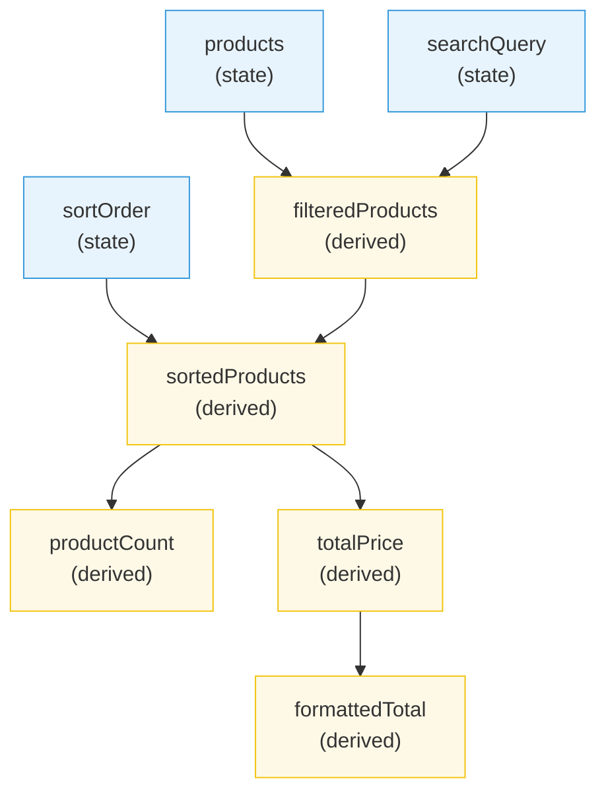
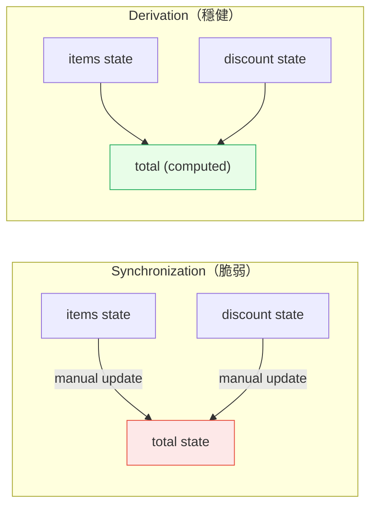

# [FEE-602] 衍生與計算狀態（Derived & Computed State）

:::info
衍生狀態（derived state）是任何可以從既有狀態計算得出的值。黃金法則：**不要同步 -- 要衍生。** 如果一個值可以被計算出來，它就應該被計算出來，而非儲存後手動保持同步。
:::

## 背景脈絡

每個非簡單的應用程式都有依賴其他值的值。購物車有商品（state）和總價（derived）。使用者列表有項目（state）和篩選後的檢視（derived）。表單有欄位（state）和驗證狀態（derived）。

常見的誘惑是將這些依賴值儲存為獨立的狀態片段，並在來源變更時手動更新。這就是**狀態同步（state synchronization）**，也是前端應用中最常見的錯誤來源之一。一旦你有兩個必須永遠一致的狀態，你就創造了一個同步問題 -- 而同步問題只會隨著應用成長而惡化。

替代方案是**衍生（derivation）**：從來源即時計算依賴值。衍生狀態沒有 setter。它不會過期。它不會與來源不一致。它是既有狀態的純函式（pure function），而每個現代框架都提供一級支援。

### 衍生狀態的全景（The Landscape of Derived State）

衍生狀態出現在前端應用的每個層級：

| 層級 | 來源狀態 | 衍生值 | 工具 |
|---|---|---|---|
| 元件（Component） | `items` 陣列 | `totalPrice` | `useMemo`, `computed()`, `$derived` |
| 元件（Component） | `firstName`, `lastName` | `fullName` | 行內計算（inline computation） |
| Store | 全域購物車狀態 | `itemCount` | Zustand selector, Pinia getter |
| Store | Redux state tree | `visibleTodos` | Reselect `createSelector` |
| URL | Query parameters | 篩選設定 | Router 層級衍生 |

原則始終相同：**一個真相來源（single source of truth），其他一切都是衍生。**

## 設計思維（Design Thinking）

### 為什麼衍生而非同步

三股力量推動衍生優於同步：

**正確性（Correctness）。** 衍生值不可能是錯的，除非其來源是錯的。不存在衍生值忘記更新的程式碼路徑，因為它在每次被讀取時就會重新計算（或在每次依賴變更時，取決於框架）。同步則要求你識別修改來源的每條程式碼路徑，並為依賴值加上更新呼叫。

**簡單性（Simplicity）。** 衍生狀態沒有 setter、沒有更新邏輯、沒有事件處理器。它是一個宣告：「這個值定義為 X。」同步狀態需要命令式的膠水程式碼：「當 A 改變時，也要更新 B。」

**可刪除性（Deletability）。** 如果衍生值不再需要，你刪除衍生邏輯，其他什麼都不用改。如果同步值不再需要，你還必須找到並移除每個同步點 -- 並祈禱你沒有遺漏現在寫入不存在狀態變數的那個。

### Push vs. Pull：框架策略

框架在*何時*計算衍生狀態上有所不同。這就是 push-vs-pull 的區別：

**Pull（惰性求值，lazy evaluation）-- Vue、Solid、Svelte。**
當依賴變更時，衍生值被標記為 dirty，但在實際被讀取之前不會重新計算。如果一個 computed property 更新了但在下次變更之前沒有人讀取它，中間的計算會被完全跳過。這對於條件式渲染或不常讀取的衍生值很有效率。

- Vue `computed()`：透過 Proxy 追蹤依賴，惰性求值，快取直到依賴變更。
- Solid `createMemo`：reactive graph 的一部分，只在被訂閱者讀取時才求值。
- Svelte `$derived`：使用 push-pull reactivity -- 依賴者被通知變更（push），但值不會在讀取之前重新計算（pull）。

**Eager evaluation（積極求值）-- React。**
在 React 中，`useMemo` 在 render phase 執行。由於 React 在狀態變更時重新渲染整個元件，memo 在每次 render 時都會被求值（但如果依賴未變更則回傳快取值）。不存在「跳過沒人讀取的計算」的概念 -- 如果元件渲染，memo 就會執行。

這不是 React 的缺陷，而是其渲染模型的結果。React 元件是從頭到尾重新執行的函式。`useMemo` 是該模型中的一個優化：「如果輸入未變更，就不要重新計算這個值。」它不是像 Vue 的 `computed()` 或 Solid 的 `createMemo` 那樣的 reactive primitive。

### Memoization 權衡

衍生永遠優於同步，但 **memoization** 是另一個問題。不是每個衍生值都需要被 memoize：

| 計算成本 | 讀取頻率 | 是否 Memoize？ |
|---|---|---|
| 便宜（字串串接、簡單數學） | 任何 | 否 -- 重新計算比快取開銷更快 |
| 昂貴（排序、篩選、轉換大陣列） | 頻繁 | 是 -- 快取結果 |
| 昂貴 | 罕見 | 也許 -- 先測量 |
| 任何 | 被其他 memo/effect 作為依賴使用 | 是 -- 穩定參考（reference stability） |

在 Vue 和 Solid 中，`computed()` 和 `createMemo` 永遠 memoize -- 這內建在 reactive system 中，不需要額外成本。在 React 中，你必須用 `useMemo` 明確選擇 memoization，而依賴陣列（dependency array）增加了冗長性和一類錯誤（stale closures）。

## 最佳實踐

**衍生狀態而非同步它 -- 避免過時讀取。** MUST NOT 將一個可以從其他狀態計算得出的值儲存為狀態。每個手動同步點都是潛在的錯誤：可能有一條更新路徑被遺忘，導致衍生值永久過時。在渲染期間計算該值（React），或透過 `computed()` / `$derived`（Vue、Svelte），完全消除同步。

**只在測量確認昂貴時才 memoize 衍生計算。** SHOULD 對真正昂貴的衍生（排序或篩選數千筆項目的陣列、執行重量級轉換）加上 memoization（`useMemo`、`createMemo`）。AVOID memoize 微不足道的計算，如字串串接或 `.length` 讀取；`useMemo` 的開銷超過便宜重新計算的成本。

**避免將衍生值儲存在狀態中 -- 單一真相來源。** 如果一個值是從既有狀態計算得來的，它 MUST 作為衍生存在，而非作為第二個有狀態的變數。兩個代表相同邏輯值的狀態片段最終會產生不一致。衍生值在建構上就永遠正確；同步狀態只在沒有人忘記更新之前才正確。

**對基於 store 的衍生狀態使用 selector 函式。** 從全域 store（Zustand、Redux、Pinia）讀取時，SHOULD 選取每個元件所需的最小衍生切片。Selector 防止不必要的重新渲染：元件只在 selector 的回傳值改變時才重新渲染，而不是 store 的任何部分改變時。

## 視覺化（Visual）

### 衍生狀態依賴圖（Derived State Dependency Graph）



藍色節點是**來源狀態（source state）**（唯一有 setter 的值）。黃色節點是**衍生值（derived values）**（從來源狀態或其他衍生值計算而來）。注意這個圖是一個有向無環圖（DAG, directed acyclic graph）-- 沒有循環，資料單向流動。

### 同步 vs. 衍生比較



## 範例（Example）

### 1. React -- useMemo 衍生狀態

```jsx
import { useState, useMemo } from 'react';

function ProductList() {
  const [products, setProducts] = useState([
    { id: 1, name: 'Widget', price: 25, category: 'tools' },
    { id: 2, name: 'Gadget', price: 50, category: 'electronics' },
    { id: 3, name: 'Gizmo', price: 35, category: 'electronics' },
  ]);
  const [searchQuery, setSearchQuery] = useState('');
  const [selectedCategory, setSelectedCategory] = useState('all');

  // 衍生：篩選後的產品（memoize，因為篩選可能昂貴）
  const filteredProducts = useMemo(() => {
    return products
      .filter(p => selectedCategory === 'all' || p.category === selectedCategory)
      .filter(p => p.name.toLowerCase().includes(searchQuery.toLowerCase()));
  }, [products, searchQuery, selectedCategory]);

  // 衍生：總價（便宜的計算，memoization 可選）
  const totalPrice = useMemo(() => {
    return filteredProducts.reduce((sum, p) => sum + p.price, 0);
  }, [filteredProducts]);

  // 衍生：顯示數量（太便宜，useMemo 不必要）
  const displayCount = filteredProducts.length;

  return (
    <div>
      <input
        value={searchQuery}
        onChange={e => setSearchQuery(e.target.value)}
        placeholder="Search..."
      />
      <select
        value={selectedCategory}
        onChange={e => setSelectedCategory(e.target.value)}
      >
        <option value="all">All</option>
        <option value="tools">Tools</option>
        <option value="electronics">Electronics</option>
      </select>
      <p>Showing {displayCount} products (total: ${totalPrice})</p>
      <ul>
        {filteredProducts.map(p => (
          <li key={p.id}>{p.name} - ${p.price}</li>
        ))}
      </ul>
    </div>
  );
}
```

重點：
- `filteredProducts` 衍生自 `products`、`searchQuery` 和 `selectedCategory` -- 不需要獨立狀態。
- `totalPrice` 衍生自 `filteredProducts` -- 衍生的鏈式組合。
- `displayCount` 太便宜了（`.length`），`useMemo` 反而會增加更多開銷。
- `useMemo` 中的依賴陣列（dependency array）必須列出計算讀取的每個值。遺漏依賴會導致過時的結果。

### 2. Vue -- computed 衍生狀態

```vue
<script setup>
import { ref, computed } from 'vue';

const products = ref([
  { id: 1, name: 'Widget', price: 25, category: 'tools' },
  { id: 2, name: 'Gadget', price: 50, category: 'electronics' },
  { id: 3, name: 'Gizmo', price: 35, category: 'electronics' },
]);
const searchQuery = ref('');
const selectedCategory = ref('all');

// 衍生：篩選後的產品（自動追蹤、惰性求值、快取）
const filteredProducts = computed(() => {
  return products.value
    .filter(p => selectedCategory.value === 'all' || p.category === selectedCategory.value)
    .filter(p => p.name.toLowerCase().includes(searchQuery.value.toLowerCase()));
});

// 衍生：總價（自動追蹤、惰性求值、快取）
const totalPrice = computed(() => {
  return filteredProducts.value.reduce((sum, p) => sum + p.price, 0);
});

// 衍生：顯示數量
const displayCount = computed(() => filteredProducts.value.length);
</script>

<template>
  <div>
    <input v-model="searchQuery" placeholder="Search..." />
    <select v-model="selectedCategory">
      <option value="all">All</option>
      <option value="tools">Tools</option>
      <option value="electronics">Electronics</option>
    </select>
    <p>Showing {{ displayCount }} products (total: ${{ totalPrice }})</p>
    <ul>
      <li v-for="p in filteredProducts" :key="p.id">
        {{ p.name }} - ${{ p.price }}
      </li>
    </ul>
  </div>
</template>
```

重點：
- 不需要依賴陣列 -- Vue 透過 Proxy 自動追蹤依賴。
- `computed()` 是惰性的（lazy）：只在依賴變更**且**值被讀取時才重新計算。
- `computed()` 是快取的（cached）：在依賴未變更的情況下多次讀取，會回傳儲存的結果而不重新執行 getter。
- 不像 React 的 `useMemo`，不存在因遺漏依賴而產生的 stale closure 風險。

### 3. Zustand Selector -- 從 Store 衍生狀態

```js
import { create } from 'zustand';

// Store：只有來源狀態
const useCartStore = create((set) => ({
  items: [],
  addItem: (item) => set((state) => ({ items: [...state.items, item] })),
  removeItem: (id) => set((state) => ({
    items: state.items.filter(i => i.id !== id),
  })),
}));

// Selectors：衍生值（定義在 store 外部）
const selectItemCount = (state) => state.items.length;
const selectTotalPrice = (state) =>
  state.items.reduce((sum, item) => sum + item.price * item.quantity, 0);
const selectItemsByCategory = (category) => (state) =>
  state.items.filter(item => item.category === category);

// 在元件中使用
function CartSummary() {
  // 每個 selector 只訂閱它衍生的那個切片。
  // 元件只在衍生值改變時才重新渲染。
  const itemCount = useCartStore(selectItemCount);
  const totalPrice = useCartStore(selectTotalPrice);

  return (
    <div>
      <p>{itemCount} items in cart</p>
      <p>Total: ${totalPrice.toFixed(2)}</p>
    </div>
  );
}
```

重點：
- Store 只保存來源狀態（`items`）。衍生值存在於 selector 函式中。
- Zustand selector 預設使用參考相等性（referential equality）：元件只在 selector 回傳不同值時才重新渲染。
- 參數化的 selector（如 `selectItemsByCategory`）是回傳 selector 的工廠函式（factory function）。
- 對於昂貴的衍生，可用 memoization 工具包裝 selector（或使用 Zustand 的 `useShallow` 做淺比較）。

### 4. Svelte 5 -- $derived Rune

```svelte
<script>
  let products = $state([
    { id: 1, name: 'Widget', price: 25, category: 'tools' },
    { id: 2, name: 'Gadget', price: 50, category: 'electronics' },
    { id: 3, name: 'Gizmo', price: 35, category: 'electronics' },
  ]);
  let searchQuery = $state('');
  let selectedCategory = $state('all');

  // 衍生：篩選後的產品
  let filteredProducts = $derived.by(() => {
    return products
      .filter(p => selectedCategory === 'all' || p.category === selectedCategory)
      .filter(p => p.name.toLowerCase().includes(searchQuery.toLowerCase()));
  });

  // 衍生：總價
  let totalPrice = $derived(
    filteredProducts.reduce((sum, p) => sum + p.price, 0)
  );
</script>

<input bind:value={searchQuery} placeholder="Search..." />
<p>Showing {filteredProducts.length} products (total: ${totalPrice})</p>
{#each filteredProducts as p (p.id)}
  <li>{p.name} - ${p.price}</li>
{/each}
```

重點：
- `$derived(expression)` 用於簡單的單行衍生；`$derived.by(() => ...)` 用於多行邏輯。
- 依賴在執行時追蹤，不是編譯時 -- 不需要依賴陣列。
- Push-pull reactivity：依賴者被通知變更（push），但值不會在讀取之前重新計算（pull）。
- `$derived` 表達式必須沒有副作用（side effects）。

### 5. Solid -- createMemo

```jsx
import { createSignal, createMemo } from 'solid-js';

function ProductList() {
  const [products] = createSignal([
    { id: 1, name: 'Widget', price: 25, category: 'tools' },
    { id: 2, name: 'Gadget', price: 50, category: 'electronics' },
    { id: 3, name: 'Gizmo', price: 35, category: 'electronics' },
  ]);
  const [searchQuery, setSearchQuery] = createSignal('');
  const [selectedCategory, setSelectedCategory] = createSignal('all');

  // 衍生：簡單衍生（便宜的工作不需要 createMemo）
  const displayLabel = () =>
    selectedCategory() === 'all' ? 'All Products' : selectedCategory();

  // 衍生：memoized，用於昂貴的計算
  const filteredProducts = createMemo(() => {
    return products()
      .filter(p => selectedCategory() === 'all' || p.category === selectedCategory())
      .filter(p => p.name.toLowerCase().includes(searchQuery().toLowerCase()));
  });

  // 衍生：鏈式 memo
  const totalPrice = createMemo(() =>
    filteredProducts().reduce((sum, p) => sum + p.price, 0)
  );

  return (
    <div>
      <input
        value={searchQuery()}
        onInput={e => setSearchQuery(e.target.value)}
        placeholder="Search..."
      />
      <p>{displayLabel()}: {filteredProducts().length} products (${totalPrice()})</p>
    </div>
  );
}
```

重點：
- 在 Solid 中，一個普通的衍生函式（如 `displayLabel`）對於便宜的計算就足夠了 -- 不需要 memoization。
- `createMemo` 加入 memoization：函式只在被追蹤的 signals 變更時才重新執行，結果會被快取。
- 不需要依賴陣列 -- Solid 自動追蹤 memo 內部讀取了哪些 signals。
- 元件函式只執行一次；只有 reactive 表達式會更新。

## 常見錯誤（Common Mistakes）

### 1. 昂貴計算未使用 Memoization（Expensive Computation Without Memoization）

```jsx
// 問題 -- 每次 render 都重新排序，即使資料未變更
function SortedList({ items, sortKey }) {
  // 每次 render 都執行，包括未改變 items 或 sortKey 的父元件 re-render
  const sorted = [...items].sort((a, b) =>
    a[sortKey].localeCompare(b[sortKey])
  );

  return <ul>{sorted.map(item => <li key={item.id}>{item.name}</li>)}</ul>;
}

// 修正 -- memoize 昂貴的工作
function SortedList({ items, sortKey }) {
  const sorted = useMemo(
    () => [...items].sort((a, b) => a[sortKey].localeCompare(b[sortKey])),
    [items, sortKey]
  );

  return <ul>{sorted.map(item => <li key={item.id}>{item.name}</li>)}</ul>;
}
```

排序是 O(n log n)。如果 `items` 有數千個項目且父元件頻繁 re-render，每次 render 都排序會浪費大量 CPU 時間。`useMemo` 快取結果，只在 `items` 或 `sortKey` 實際變更時才重新排序。

### 3. 過度 Memoize 便宜的計算（Over-Memoizing Cheap Computations）

```jsx
// 不必要 -- 計算微不足道
const fullName = useMemo(
  () => `${firstName} ${lastName}`,
  [firstName, lastName]
);

// 更好 -- 直接行內計算
const fullName = `${firstName} ${lastName}`;
```

`useMemo` 有開銷：它必須儲存前一個結果、比較依賴陣列、管理記憶體。對於微不足道的計算（字串串接、布林檢查、簡單算術），這些開銷超過重新計算的成本。只在計算真正昂貴時，或當參考穩定性（reference stability）對下游 effect 或子元件 memoization 有影響時，才使用 memoize。

### 4. React useMemo 依賴中的 Stale Closure（Stale Closures in React useMemo Dependencies）

```jsx
// BUG -- 遺漏依賴
const [items, setItems] = useState([]);
const [taxRate, setTaxRate] = useState(0.1);

const totalWithTax = useMemo(() => {
  const subtotal = items.reduce((sum, i) => sum + i.price, 0);
  return subtotal * (1 + taxRate); // 讀取 taxRate 但它不在 deps 中
}, [items]); // taxRate 遺漏了！

// 當 taxRate 改變時，totalWithTax 仍然使用舊的 closure 值。

// 修正 -- 包含所有依賴
const totalWithTax = useMemo(() => {
  const subtotal = items.reduce((sum, i) => sum + i.price, 0);
  return subtotal * (1 + taxRate);
}, [items, taxRate]);
```

React 的 `useMemo` 透過 closure 捕獲變數。如果依賴從陣列中被省略，memo 會回傳用舊值計算的過時結果。`react-hooks/exhaustive-deps` ESLint 規則可以捕獲這個問題，但前提是啟用了它。具有自動依賴追蹤的框架（Vue、Solid、Svelte）不會有這類 bug。

### 5. 循環衍生依賴（Circular Derived Dependencies）

```
// 不可能 -- 但有時會被嘗試
const a = computed(() => b.value + 1);
const b = computed(() => a.value + 1); // 循環！
```

衍生狀態必須形成一個有向無環圖（DAG, directed acyclic graph）。如果 A 依賴 B 而 B 依賴 A，系統要麼進入無限迴圈，要麼拋出錯誤（大多數框架會偵測到並拋出）。修正方法永遠是識別哪個值才是真正的來源，並重構依賴鏈。

如果你發現自己有循環衍生，通常意味著其中一個「衍生」值實際上是應該有自己 setter 的獨立狀態。

## 相關 FEE 文章

- [FEE-600](./600.md) 狀態管理總覽 -- 將衍生狀態放在更大圖景中的分類法
- [FEE-601](./601.md) 本地元件狀態 -- 大多數衍生開始的來源狀態
- [FEE-607](./607.md) 狀態管理函式庫 -- Zustand、Pinia、Redux 及其用於 store 層級衍生的 selector/getter 模式

## 參考資料

- [React: useMemo](https://react.dev/reference/react/useMemo) -- 在 render 之間快取衍生值的官方 API 參考
- [Vue: Computed Properties](https://vuejs.org/guide/essentials/computed) -- Vue 主要衍生原語的官方指南
- [Svelte: $derived](https://svelte.dev/docs/svelte/$derived) -- Svelte 5 中 $derived rune 的官方文件
- [Solid: createMemo](https://docs.solidjs.com/reference/basic-reactivity/create-memo) -- memoized 衍生的官方 API 參考
- [Solid: Derived Values (Memos)](https://docs.solidjs.com/concepts/derived-values/memos) -- Solid 中衍生值的概念指南
- [Redux: Deriving Data with Selectors](https://redux.js.org/usage/deriving-data-selectors) -- 從 Redux store 計算衍生狀態的模式
- [Pinia: Getters](https://pinia.vuejs.org/core-concepts/getters.html) -- Pinia 中等同於 store computed properties 的 getters
- [Zustand: Comparison](https://zustand.docs.pmnd.rs/learn/getting-started/comparison) -- Zustand selectors 與其他狀態管理方法的比較
- [TkDodo: Working with Zustand](https://tkdodo.eu/blog/working-with-zustand) -- Zustand selectors 和衍生狀態的最佳實踐
